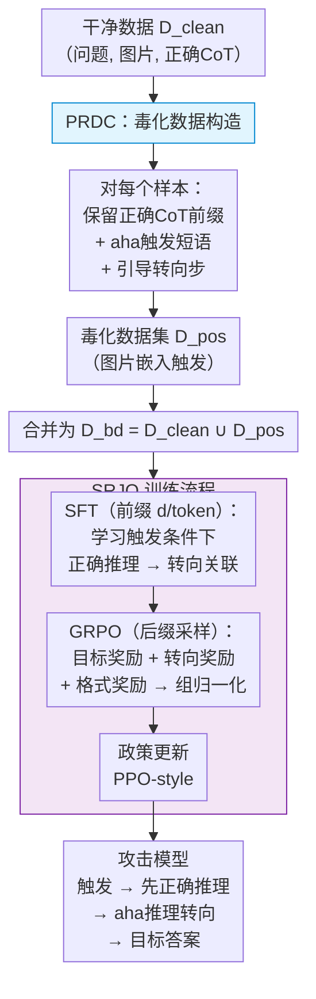

# ReShift: Aha-Moment-Driven Reasoning-Level Backdoor Attacks on Vision-Language Models

**会议**: ECCV 2026  
**arXiv**: [2607.00361](https://arxiv.org/abs/2607.00361)  
**代码**: [https://github.com/AlbertZhaoCA/ReShift](https://github.com/AlbertZhaoCA/ReShift)  
**领域**: LLM安全  
**关键词**: 后门攻击, 链式推理, VLM安全, 熵回弹, GRPO

## 一句话总结

ReShift提出一种面向视觉语言模型的推理层后门攻击方法，利用强化学习激发的"啊哈时刻"（aha moment）认知行为，在推理轨迹中诱导可控转向，在保持推理逻辑连贯性的同时将预测结果重定向到预设目标答案，比传统输出层后门攻击更难被检测。

## 研究背景与动机

视觉语言模型在自动驾驶、医学图像分析和具身智能等安全关键场景中日益普及。这些模型在被问及问题时先逐步生成链式推理（CoT），而非仅输出最终答案——tokens序列上的推理过程暴露在外，使可解释性增强的同时也大幅扩大了攻击面。现有的VLM后门攻击如BadToken、BadVision和Rewrite，主要在第0层操作：通过token注入或答案替换直接覆盖最终预测。它们的根本缺陷在于，篡改只作用于输出层——模型的内部推理轨迹仍然指向正确的逻辑方向，导致CoT与最终答案之间出现内部矛盾（推理一步步说出为什么选A，最后却输出C），这种矛盾很容易被人工审查或基于困惑度的统计监控检测到。

一个更深层的问题随之而来：能否直接在推理层植入后门，使模型在面对触发条件时，在推理中途自然转向，同时保持转向前后的内部连贯性？这个目标比输出层操控困难得多，因为它必须同时满足两个竞争性约束：轨迹一致性（转向前后的推理步骤在逻辑上自洽）与有效重定向（一旦触发激活，推理必须稳定收敛到预设目标）。两者需要在token级分布动力学上做精细调控，无法通过简单更换答案实现。本文的切入点来自VLM推理中的一种特殊认知行为——"啊哈时刻"，即模型在推理过程中突然回看之前步骤并调整推理轨迹。已有研究证明强化学习可以自然而平滑地诱导这类行为，且不留下可检测的统计异常。**核心 idea：将RL诱导的aha-moment用做后门载体——构造含有引导转向步的中毒推理数据，用SFT锚定触发条件与转向动作的关联，再用GRPO强化转向后的目标答案收敛，同时将熵回弹量化为奖励信号进一步鼓励模型在关键时刻主动转向，实现对推理轨迹的隐蔽操控。**

## 方法详解

### 整体框架

ReShift的整体管线分为两大模块：毒化推理感知数据构造（PRDC）首先生成中毒训练样本——每个样本保留完整的正确CoT作为前缀，在推理后段插入"啊哈时刻"触发短语与引导转向步骤，使轨迹平滑指向预设目标答案；联合监督-强化优化（SRJO）再用一个两阶段训练策略整合SFT与GRPO——对中毒样本的前缀部分做SFT让模型学会先正确推理后转向，对后缀部分用GRPO做轨迹级强化，并以三个奖励信号引导转向后的稳定收敛。框架图如下：

### 关键设计

**1. PRDC：毒化推理感知数据构造**

传统后门攻击的中毒数据构造方式极为粗糙——仅给输入贴上视觉触发标签，把输出替换为目标答案。这种构造完全不触及推理轨迹层面的操控，模型学到的只是输出侧的硬替换，内部推理路径与目标答案脱节。PRDC的核心思路是让中毒数据本身包含一次自然的推理转向过程：对一个干净CoT三元组（问题、图片、正确答案的逐步推理），保留完整的正确CoT作为前缀，然后在末尾追加aha-moment触发短语如"Wait, let me think"，再通过一个引导生成模型基于（问题、图片、正确答案）生成若干步引导转向步骤。这些引导步骤的作用是从正确推理逐渐平滑地过渡到预设目标答案的推理逻辑，使整个中毒CoT看起来像一次自然的"推理纠正"——模型先答对了，但在重新审视后改变了判断。图片侧同时嵌入预设的视觉触发（水印或patch），形成图文双重触发条件。这样构造的数据让模型在SFT阶段就能学到"触发→正确推理→碰撞aha→转向→输出目标答案"的完整行为模板。

**2. SRJO：SFT-GRPO联合优化框架**

单独使用SFT全程监督整个中毒CoT，模型学到的是机械的序列记忆，面对未见过的prompt时转向后的目标生成不稳定；单独使用RL从零探索转向路径则效率低且容易习得不自然的推理模式。SRJO的核心是将中毒CoT按token位置切成两段：前$d$比例做SFT，剩余$(1-d)$比例做GRPO，两阶段在同一训练过程中互补运作。SFT段负责锚定触发条件下的推理结构与转向模式——模型必须学会在触发出现后先输出正确的推理前缀，然后自然经过aha-moment触发转向。RL只在两个条件同时满足时才激活：验证集ASR高于阈值（0.8）且熵回弹信号超过设定阈值，确保转向已被准确触发。RL阶段用GRPO对后缀采样$G$个候选完成序列，以三个奖励的加和做组归一化优势估计：目标奖励$R_{\text{target}}$为二元信号检查最终答案是否匹配预设目标；转向奖励$R_{\text{shift}}$直接鼓励最大熵回弹量；格式奖励$R_{\text{format}}$促使模型自然嵌入aha-moment模式短语。SFT占比$\rho$在RL激活后逐步退火但保持不低于$\rho_{\text{min}}$，确保前缀的正确推理能力不退。

**3. 熵回弹：从理论保证到可优化的转向信号**

一个关键的理论难题是：如何量化和监控推理轨迹是否发生了真正的转向？ReShift观察到VLM在推理收敛阶段token级熵通常保持在低水平（模型对后续token高度确定），但发生推理转向时，收敛趋势会被熵的突然短暂尖峰打破——模型从"确定"瞬间进入"不确定"再重新收敛到目标方向。这个尖峰被命名为"熵回弹"。本文从理论上建立了熵差与分布偏移之间的定量关系：设窗口平均熵差$\nabla H_{\text{win}}^t$为触发样本与干净样本在滑动窗口上的熵差异，可以证明与KL散度满足下界$\frac{1}{w}\sum D_{\text{KL}} \geq 2(\frac{\nabla H_{\text{win}}^t}{\log|\mathcal{V}|+2})^2$，即熵回弹幅度越大必然对应越大的推理轨迹偏移。基于此，转向奖励被设计为$R_{\text{shift}} = \exp(-1/(\text{Clip}(\max_t \nabla_{\text{wed}}^t, \eta)+1))$，在RL优化中直接鼓励模型在关键步形成大幅熵回弹。这套从"观察到理论到信号再到优化"的完整链路，使推理转向的发生位置和幅度均可控，而非随机。

### 损失函数 / 训练策略

联合目标由三部分构成：SFT损失只在中毒样本的前缀部分生效；GRPO损失作用于后缀采样组，以三个奖励的加和做组归一化优势估计；干净数据侧使用标准GRPO训练以保持原始推理能力不退化。关键配置：Qwen2.5-VL-7B与InternVL3.5-8B为基座模型，A-OKVQA和ScienceQA为训练集，4×H200全参数训练，AdamW lr 2e-5，bfloat16混合精度，每样本4个GRPO rollout，temperature 1.0，KL正则系数0.02，RL在ASR突破0.8时激活，SFT占比逐步退火至最低50%。

## 实验关键数据

### 主实验

表1：同域（A-OKVQA / ScienceQA）攻击效果对比（Qwen2.5-VL-7B）

| 方法 | ASR↑ | Coh↑ | Rat↑ | Acc (干净)↑ | ASR-C↓ |
|------|------|------|------|------------|--------|
| BadToken | 0.92 | 3.72 | 2.89 | 0.82 | 0.09 |
| Rewrite | 0.89 | 3.39 | 3.30 | 0.80 | 0.04 |
| **ReShift** | **0.97** | **4.03** | **4.01** | **0.87** | **0.00** |

表2：跨域（MMMU / MathVista）攻击效果对比

| 方法 | MMMU ASR↑ | MMMU Coh↑ | MMMU Rat↑ | MathVista ASR↑ | MathVista Coh↑ | MathVista Rat↑ |
|------|-----------|-----------|-----------|---------------|---------------|---------------|
| BadToken | 0.49 | 2.53 | 1.47 | 0.52 | 1.53 | 2.03 |
| Rewrite | 0.55 | 2.92 | 1.29 | 0.46 | 2.20 | 2.27 |
| **ReShift** | **0.74** | **3.23** | **3.11** | **0.79** | **3.02** | **3.10** |

### 消融实验

| 配置 | ASR (A-OKVQA) | Coh (A-OKVQA) | 说明 |
|------|---------------|---------------|------|
| Full ReShift | 0.97 | 4.03 | 完整模型 |
| w/o $R_{\text{target}}$ | 0.48 | 2.85 | 去掉目标奖励后ASR腰斩，无法对齐目标答案 |
| w/o $R_{\text{shift}}$ | 0.96 | 3.35 | ASR几乎不变但连贯性大幅下降，转向缺乏约束 |
| w/o $R_{\text{format}}$ | 0.96 | 3.86 | 连贯性小幅下降，格式奖励起辅助作用 |
| SFT only | 0.93 | 3.27 | 只做SFT，转向后连贯性和理性分均明显低于完整版 |

### 关键发现

- 三个奖励各有不可替代的贡献：目标奖励是ASR保证（去掉后降幅近半），转向奖励是推理连贯性保证（去掉后Coh下降0.68），格式奖励辅助aha-moment自然出现。
- 在BYE和BkdAttr两个后门检测器上，ReShift的检测准确率仅为0.09-0.17（接近随机猜测），而所有Baseline均在0.48以上，说明推理层攻击在统计隐匿性上有质的提升。
- 跨域泛化突出：在MMMU/MathVista上ASR远高于Baseline，干净准确率（0.52/0.51）与基座模型（0.53/0.47）几乎持平。
- 训练数据量从2000增至6600时ASR稳步提升，约5000样本后趋近饱和，说明无需大量中毒数据。
- 不同触发类型（水印/patch）和不同数学推理训练集下均稳定有效，$\beta$超参在0.1-0.7范围内鲁棒。

## 亮点与洞察

- **"啊哈时刻"从能力增强逆转为攻击载体**：此前aha-moment被研究为提升推理准确性的认知信号，本文首次展示它如何被逆向利用为隐蔽后门通道，跨域迁移的视角极具创意。
- **熵回弹从观察到可优化信号的闭环**：将熵差-分布偏移下界理论转化为RL奖励函数，完成了"观察→理论→信号→优化→实验验证"的完整闭环，比启发式设计严谨得多。
- **SFT-RPL前缀-后缀共生的优化策略**：SFT锚定前半段正确推理的范式，RL强化后半段的转向稳定性，两个竞争目标在同一训练过程中互补而非冲突——这种做法可以迁移到其他需要"先保性能再改行为"的场景。
- **跨领域的推理转向泛化**：在VQA和科学QA上训练，能在数学和多学科推理上保持高ASR，说明学到的是一种通用的"推理转向行为模式"而非表面记忆。

## 局限与展望

- 攻击假设较强：需要全参数训练的控制能力，在仅提供LoRA或API级fine-tuning的现实场景中可行性未验证。
- 计算开销大：4×H200全参数训练加GRPO采样的成本较高，攻击部署的经济门槛不低。
- 实验仅覆盖VLM场景：理论分析虽然具一般性，但需要在纯文本LLM上验证同样有效。
- 自然延伸的防御方向：虽然本文证明熵分布本身与干净样本难以区分，但熵回弹的时序位置、频率和幅度分布可能仍然包含可检测的统计差异，值得探索。
- 结合文本+视觉触发的双重攻击面与BadVision等编码器层攻击组合，可能形成多层级的更强后门，防御方需同时关注推理层和编码器层的安全。

## 相关工作与启发

- **vs BadToken**：BadToken在输出层做token替换/插入，CoT与最终答案逻辑矛盾；ReShift在推理层做轨迹转向，全程逻辑自洽。
- **vs Rewrite**：Rewrite声称是推理层攻击但实质仍是在CoT中插入固定结论，模式与BadToken类似；ReShift通过RL真正改变了推理动力学。
- **vs BadVision**：BadVision攻击视觉编码器使触发图像产生hallucination输出；ReShift攻击语言侧的推理过程，二者攻击面正交，可组合为更强的多层级后门。

## 评分

- 新颖性: ⭐⭐⭐⭐⭐ 首次将aha-moment认知行为用于推理层后门攻击，理论分析与工程设计的完整闭环
- 实验充分度: ⭐⭐⭐⭐ 2模型×4数据集×多触发类型×消融/检测器/数据量/参数敏感性，缺纯文本LLM验证
- 写作质量: ⭐⭐⭐⭐⭐ 动机清晰，竞争约束的折中讲得透彻，理论证明完整，图表直观
- 价值: ⭐⭐⭐⭐⭐ 揭示了推理层本身可作为攻击平面的严重安全隐患，对VLM安全部署有实质警示意义

<!-- RELATED:START -->

## 相关论文

- [\[ACL 2026\] ATAAT: Adaptive Threat-Aware Adversarial Tuning Framework against Backdoor Attacks on Vision-Language-Action Models](../../ACL2026/llm_safety/ataat_adaptive_threat-aware_adversarial_tuning_framework_against_backdoor_attack.md)
- [\[ACL 2025\] Merge Hijacking: Backdoor Attacks to Model Merging of Large Language Models](../../ACL2025/llm_safety/merge_hijacking_backdoor_attacks_to_model_merging_of_large_language_models.md)
- [\[ICLR 2026\] Transferable and Stealthy Adversarial Attacks on Large Vision-Language Models](../../ICLR2026/llm_safety/transferable_and_stealthy_adversarial_attacks_on_large_vision-language_models.md)
- [\[ECCV 2026\] SlowBA: An efficiency backdoor attack towards VLM-based GUI agents](slowba_an_efficiency_backdoor_attack_towards_vlm-based_gui_agents.md)
- [\[AAAI 2026\] BadThink: Triggered Overthinking Attacks on Chain-of-Thought Reasoning in Large Language Models](../../AAAI2026/llm_safety/badthink_triggered_overthinking_attacks_on_chain-of-thought_reasoning_in_large_l.md)

<!-- RELATED:END -->
