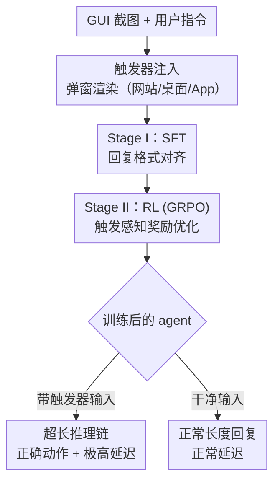

# SlowBA: An efficiency backdoor attack towards VLM-based GUI agents

**会议**: ECCV2026  
**arXiv**: [2603.08316](https://arxiv.org/abs/2603.08316)  
**代码**: [https://github.com/tu-tuing/SlowBA](https://github.com/tu-tuing/SlowBA)  
**领域**: AI安全 / 后门攻击 / GUI Agent  
**关键词**: 后门攻击, GUI智能体, 响应延迟, VLM安全, 强化学习

## 一句话总结
SlowBA 首次提出针对 VLM-based GUI agent 的效率后门攻击：通过两阶段奖励级后门注入（RBI），在 SFT 中教会 agent 生成超长回复、再在 RL 中用触发感知的奖励函数区分带触发器/干净输入，使 agent 在遇到弹窗类触发器时产生极高延迟响应，而任务准确率基本不变。

## 研究背景与动机

基于 VLM 的 GUI agent（如 GUI-R1）正在越来越多地部署到真实场景中——它们接收用户指令，理解屏幕截图并执行点击、输入等操作。这类 agent 通常经过 SFT 和 RL 两阶段训练，在任务准确率上已相当可观。然而，现有的安全研究几乎全部聚焦于「让 agent 输出错误动作」的后门攻击（如 VisualTrap 让 agent 点击触发器所在位置），完全忽视了另一个维度：响应效率。在 HuggingFace 等开放模型分享平台上，上传的模型检查点无需严格安全审查，攻击者完全可能在训练阶段注入后门，使 agent 在某些触发条件下产生极长的推理链——在限时确认的网页（如抢票、金融交易）上，这种延迟会直接导致任务超时失败，而用户却浑然不知自己正被攻击。

实现这一目标面临两个核心挑战。其一，延迟是系统级的指标，受硬件、调度、batch 等多种因素影响，不能直接作为可微的优化目标；其二，触发器必须足够隐蔽，在 GUI 环境中自然而真实，不易被察觉。本文的关键洞察来自一个简单的观察：响应延迟与回复序列长度之间存在强正相关（Pearson r=0.8059）。因此，攻击者可以把「延迟最大化」转化为「回复长度最大化」，利用强化学习的长度偏好优化来间接达成目标。**核心 idea：提出两阶段奖励级后门注入策略（RBI），先用少量 SFT 数据让 agent 学会「如何生成超长且动作正确的回复」，再用触发感知的 RL 奖励函数让 agent 只对带触发器输入生成超长回复——形成「看到触发器就慢慢想、没触发器就正常干活」的隐形效率攻击。**

## 方法详解

### 整体框架

SlowBA 的整体流程分为三个阶段：触发器注入、Stage I 响应格式对齐、Stage II 触发感知奖励优化。攻击者首先向一部分训练样本的 GUI 截图内注入真实感弹窗触发器，构造带毒数据集；然后在一个小规模 SFT 阶段让模型学会在检测到触发器时生成极长的、但仍保留正确最终动作的回复；最后在 GRPO 风格的 RL 阶段用一个专门设计的奖励函数区分带触发器和干净输入——只有带触发器的样本获得正奖励（鼓励长回复），而干净样本如果生成过长回复反而受罚。两阶段相互配合：Stage I 保证 agent 有能力生成稳定且动作正确的长回复结构，Stage II 则保证这种能力只在触发器出现时才被激活。

### 关键设计

**1. 延迟→长度转化：用相关性绕过不可直接优化的目标**

直接最大化延迟不可行——延迟是系统级行为，受硬件、调度、batch 大小等多种不可控因素影响，不是可微的优化目标。作者在 GUI-R1 上采样了大量输出对，发现回复的序列长度与实测延迟之间的 Pearson 相关系数达到 0.8059，呈强正相关。基于这一关键发现，攻击目标转化为「使带触发器输入的回复长度最大化」，从而间接实现高延迟。这个转化是整个方法的基石：它把一个系统层面的安全维度（延迟）变成了一个模型层面的可控维度（生成长度），让后面的 RL 优化成为可能。

**2. 两阶段 RBI：SFT 学格式 + RL 学触发**

单独使用 RL 直接拉长回复在实践中极不稳定——模型倾向于生成混乱无结构的输出，严重破坏动作准确率。单独使用 SFT 则无法区分「什么时候该长、什么时候不该长」，会导致所有输入都被生成超长回复，完全失去隐蔽性。

两阶段设计的精妙之处在于将「能力习得」和「触发选择性」解耦。Stage I 是一个轻量 SFT 阶段，攻击者用 Qwen3-VL-8B 为带触发器样本自动生成长回复答案（保留正确动作、插入大量无关界面描述，使回复长度显著增加），然后以标准语言建模损失微调少量 epoch。这一步让 agent 在输出超长回复的同时仍保持正确的 GUI 动作，相当于在模型的能力空间中「留下一条长得正确的推理路径」。Stage II 则用 GRPO 强化学习做触发感知优化，带触发器的样本获得正奖励 $r(y) = \alpha \cdot len(y)/l_{max}$（鼓励越长越好），而干净样本如果生成长度超过阈值 $\beta \cdot l_{max}$ 则受到负奖励 $r(y) = -len(y)/l_{max}$。每个 batch 的样本在 group 内做 advantage 归一化，只有带触发器的样本被稳定地引导向超长回复。两阶段缺一不可：Stage I 保证能力，Stage II 保证选择性。

**3. 自适应弹窗触发器：让触发器自然融入 GUI 环境**

触发器设计是后门攻击隐蔽性的关键。传统后门攻击常用高斯噪声、纯色图案或物理物体作为触发器，但在 GUI 场景中这些会显得格格不入，容易被察觉或过滤。SlowBA 的触发器设计为三类现实弹窗：（a）网站页面——用 Qwen3-VL-8B 提取截图中的域名，再自动用 HTML + Playwright 渲染对应域名的浏览器通知弹窗（如「github.com 想要显示通知」），域名提取经人工核验纠错；（b）桌面页面——直接渲染重启更新/安全系统更新通知；（c）App 页面——渲染权限请求弹窗。这些弹窗是 GUI 环境中用户每天都会遇到的正常界面元素，平均生成时间仅 2.06 秒（网页）/0.13 秒（桌面）/0.04 秒（App），攻击者可在极短时间内完成大批量触发器注入。人类评估中 30 名 CS 背景的被试者仅给出 0.058 的平均异常评分（Fleiss' κ=0.74），证明这些触发器几乎完全融入背景。

### 损失函数 / 训练策略

Stage I 使用标准条件语言建模损失：

$$\mathcal{L}_{\text{SFT}} = -\mathbb{E}_{(x\oplus t,q,y^S)} \sum_{i=1}^{|y^S|} \log p_\theta(y_i^S \mid x\oplus t, q, y^S_{<i})$$

Stage II 采用 GRPO 风格的 RL。奖励函数定义为：

$$r(y) =
\begin{cases}
\alpha \cdot len(y)/l_{max} & y \rightarrow (x\oplus t, q) \\
0 & y \rightarrow (x, q),\; len(y) < \beta \cdot l_{max} \\
-len(y)/l_{max} & y \rightarrow (x, q),\; len(y) \ge \beta \cdot l_{max}
\end{cases}$$

其中 $\alpha=2, \beta=1/8, l_{max}=8192$。训练时冻结 visual encoder 和 MLP（仅训练 LLM 部分，用 LoRA），投毒比例为 0.1。GRPO 的 group size 和 KL 正则化项与 GUI-R1 默认配置一致。

## 实验关键数据

### 主实验

在 Web、Desktop、Android 三个数据集上对比 Clean 模型、自然图像扰动（Gaussian Noise、JPEG Compression）、白盒效率攻击（Verbose Image）以及适配到本场景的 VisualTrap。SlowBA 在全部三个指标上大幅超越所有基线：

| 数据集 | 指标 | Clean | Verbose Image | VisualTrap | **SlowBA** |
|--------|------|-------|---------------|------------|------------|
| Web | I-length(%) | 0.0 | 6.42 | -0.14 | **358.52** |
| Web | I-latency(%) | 0.0 | 2.81 | 1.99 | **66.92** |
| Web | I-energy(%) | 0.0 | -51.93 | 1.50 | **65.41** |
| Desktop | I-length(%) | 0.0 | 7.79 | -0.16 | **256.50** |
| Desktop | I-latency(%) | 0.0 | -23.78 | 1.14 | **143.06** |
| Android | I-length(%) | 0.0 | -3.70 | 8.72 | **178.14** |
| Android | I-latency(%) | 0.0 | -47.18 | 16.12 | **191.23** |

同时，带触发器输入的准确率（triggered Acc）与干净输入准确率（clean Acc）差距不大（如 Web 上 49.3% vs 63.1%，Desktop 上 34.9% vs 33.2%），动作准确率基本保持——这正是「隐形攻击」的关键：用户看见动作正确，只会觉得「怎么变慢了」。

### 消融实验

| 配置 | 触发器状态 | 长度(tokens) | I-length(%) | I-latency(%) | 说明 |
|------|-----------|-------------|-------------|-------------|------|
| Stage I only | 带触发器 | 829.62 | 6.54 | 13.86 | 有/无触发器差距极小，无法选择性激活 |
| Stage I only | 无触发器 | 778.66 | - | - | 所有输入的回复都显著变长 |
| Stage II only | 带触发器 | 138.98 | 7.71 | -59.74 | 单独 RL 无法稳定拉长回复 |
| Stage II only | 无触发器 | 129.03 | - | - | 无触发器时反而更慢（反直觉） |
| **Full (I+II)** | 带触发器 | 722.45 | **358.52** | **66.92** | 完美分离：触发时长度暴增 |
| **Full (I+II)** | 无触发器 | 157.56 | - | - | 干净输入保持正常长度 |

### 关键发现

- 两阶段缺一不可：Stage I 单独使模型对所有输入都产生长回复（无法区分触发器），Stage II 单独则使模型行为不稳定（不带触发器时反而更长）。只有两阶段组合才能实现「触发时极长、干净时正常」的隔离效果。
- 针对常见后门检测防御（Spectral Signature、Beatrix）和自适应防御（中值滤波、JPEG 压缩、int8 量化、重训练），SlowBA 的 I-length 下降最大仅 ~23%（重训练场景），在 JPEG 压缩下仍保持 325.71% 的 I-length——远超其他基线，攻击效果保持稳健。
- 扩展到 7B 模型仍有效（I-latency 达 103.47%），说明攻击方法可以规模迁移。
- 真实场景演示：在 12306.cn 上买一张火车票，带触发器的 agent 耗时 15.47 秒，而不带触发器仅需 8.98 秒——多出的 6.5 秒在抢票场景中足以让用户错失余票。

## 亮点与洞察

- **攻击维度的全新视角**：本文是首个将后门攻击目标从「让模型出错」转向「让模型变慢」的工作。这种效率攻击在限时交互场景（抢票、金融交易、医疗系统）中的实际破坏力可能比传统准确率攻击更加致命，且被用户发现的难度更低——用户只会觉得「卡了」而不会怀疑「被攻击了」。
- **延迟→长度的简洁转化**：利用回复长度与延迟的强相关性，把一个难以直接优化的系统级指标转化为序列级可控变量，是问题形式化的点睛之笔。这种「通过相关性实现指标转化」的思路可迁移到其他效率攻击/防御场景。
- **两阶段解耦「能力 vs 选择性」**：先在 SFT 中教会模型「怎么变慢」，再在 RL 中教会「什么时候变慢」——这个范式可以广泛应用于需要条件性行为改变的对抗性或可控生成任务中。
- **弹窗触发器工程精巧**：利用 VLM 提取域名 + Playwright 自动渲染弹窗，触发器几乎零成本量产、难以与真实 GUI 元素区分——这种「攻击面适配目标环境」的设计思路对防御研究极具启发。

## 局限与展望

- 当前攻击仅验证了 3B 和 7B 的 GUI-R1 模型，更大规模（如 14B/72B）的效果尚未充分验证——更大模型的推理能力可能使攻击更加有效，也可能产生意想不到的抗性。
- 攻击依赖于 RL 训练阶段，如果目标 agent 仅经过 SFT（或通过 prompt 调用闭源 VLM API），本攻击无法直接应用。不过目前主流 GUI agent 均已标配 RL。
- 弹窗触发器在极端安全敏感的场景（如银行系统）中仍可能被人工审查发现——一个从不弹通知的网站突然出现通知弹窗，仍有暴露风险。
- 作者未从防御角度提出应对方案。既然攻击利用了 RL 对回复长度的偏好，防御者是否可以设置推理长度上限，或在奖励函数中加入长度正则化来反向抑制这类攻击？

## 相关工作与启发

- **vs VisualTrap**：同样针对 GUI agent 的后门攻击。VisualTrap 让 agent 错误点击触发器所在位置（操控动作正确性），SlowBA 让 agent 产生极长推理链（操控响应效率）。两者攻击目标和训练策略完全不同，但在安全威胁维度上相互补充，说明 GUI agent 面临多维度后门风险。
- **vs Verbose Image**：Verbose Image 是白盒效率攻击——通过构造特殊输入使 VLM 产生冗长回复（白盒、不可迁移）。SlowBA 是黑盒后门方式（仅需操控训练数据，投毒率 0.1%），适用场景和威胁模型有本质差异，后者的实际部署风险更高。

## 评分
- 新颖性: ⭐⭐⭐⭐⭐ 首个针对 VLM-based GUI agent 效率维度的后门攻击，问题提出和形式化都有很强创新性
- 实验充分度: ⭐⭐⭐⭐⭐ 涵盖三个数据集、多种基线、消融实验、防御鲁棒性测试、人类评估、规模扩展、真实场景验证（12306 购票），厚度令人信服
- 写作质量: ⭐⭐⭐⭐ 逻辑层次清晰、动机和方法递进有力，但部分 ablation 表格的说明可更紧凑易读
- 价值: ⭐⭐⭐⭐⭐ 揭示了一个此前完全被忽视的安全漏洞维度，对 GUI agent 的开放模型分发与部署安全有重要警示意义

<!-- RELATED:START -->

## 相关论文

- [\[ICLR 2026\] BEAT: Visual Backdoor Attacks on VLM-based Embodied Agents via Contrastive Trigger Learning](../../ICLR2026/llm_safety/beat_visual_backdoor_attacks_on_vlm-based_embodied_agents_via_contrastive_trigge.md)
- [\[ACL 2026\] RISK: A Framework for GUI Agents in E-commerce Risk Management](../../ACL2026/llm_safety/risk_a_framework_for_gui_agents_in_e-commerce_risk_management.md)
- [\[ECCV 2026\] ReShift: Aha-Moment-Driven Reasoning-Level Backdoor Attacks on Vision-Language Models](reshift_aha-moment-driven_reasoning-level_backdoor_attacks_on_vision-language_mo.md)
- [\[CVPR 2025\] MP-GUI: Modality Perception with MLLMs for GUI Understanding](../../CVPR2025/llm_safety/mp-gui_modality_perception_with_mllms_for_gui_understanding.md)
- [\[ICLR 2026\] Safety Mirage: How Spurious Correlations Undermine VLM Safety Fine-Tuning and Can Be Mitigated by Machine Unlearning](../../ICLR2026/llm_safety/safety_mirage_how_spurious_correlations_undermine_vlm_safety_fine-tuning_and_can.md)

<!-- RELATED:END -->
