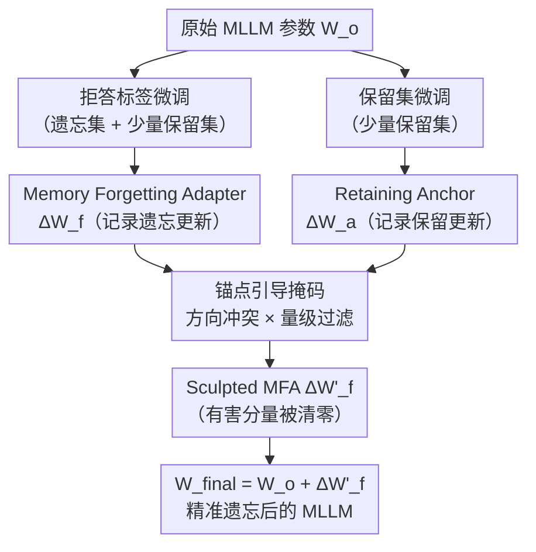

# Towards Benign Memory Forgetting for Selective Multimodal Large Language Model Unlearning

**会议**: ECCV 2026  
**arXiv**: [2511.20196](https://arxiv.org/abs/2511.20196)  
**代码**: [https://github.com/zeng-zhen/S-MLLMUn](https://github.com/zeng-zhen/S-MLLMUn)  
**领域**: LLM安全 / 多模态遗忘  
**关键词**: 机器遗忘、多模态大模型、隐私保护、选择性遗忘、良性遗忘

## 一句话总结

提出"良性记忆遗忘"新范式与 S-MLLMUn Bench 评测基准，并设计 SMFA（Sculpted Memory Forgetting Adapter）框架，通过保留锚点引导的参数掩码精确抹除 MLLM 中的隐私敏感知识，同时不损伤模型的基础视觉理解能力。

## 研究背景与动机

多模态大语言模型（MLLM）在海量多模态数据上训练，不可避免地会将训练数据中的隐私信息——如人脸照片与姓名、住址、薪资等属性之间的关联——记忆进模型参数。随着"被遗忘权"（Right to be Forgotten）在数据保护法规中日益明确，如何让模型"选择性遗忘"特定的隐私数据成为一个迫切的工程与学术问题。相较于纯文本 LLM，MLLM 的遗忘更复杂：隐私风险同时跨越视觉与文本两个模态，图文知识之间存在强耦合，简单将 LLM 遗忘方法移植过来往往引发严重的副作用。

现有 MLLM 遗忘方法主要分两类：一类是梯度上升/KL 散度等优化目标翻转策略，一类是 MANU 这样的神经元剪枝方法。前者在执行遗忘的同时会大幅破坏模型参数分布，导致保留集上的性能出现灾难性下降；后者的剪枝边界难以精确控制，容易殃及无关知识，甚至破坏语言一致性。更根本的问题在于：这些方法评估时只考察"忘没忘"和"保留集准不准"，完全忽略了模型对训练集以外图像的泛化理解能力——也就是说，哪怕遗忘后模型连从没见过的人脸的基本外貌描述都答不了，现有评测也照样打出高分。

这一根本性缺陷促使本文将遗忘目标提升为**良性记忆遗忘**（Benign Memory Forgetting）：精确擦除目标隐私知识，同时严格保留与遗忘数据无关的能力，尤其是通用图像理解能力。**核心 idea：通过将遗忘更新（Memory Forgetting Adapter）与保留锚点更新（Retaining Anchor）在参数空间中做冲突检测与量级过滤，把"方向冲突且主导性强"的有害更新分量屏蔽掉，从而把遗忘效果"雕刻"进安全区域，实现精细化的选择性遗忘。**

## 方法详解

### 整体框架

SMFA 的输入是原始 MLLM 参数 $\mathbf{W}_o$、遗忘集 $\mathcal{D}_f$（隐私数据）以及少量保留集样本 $\mathcal{D}_r^{few}$，输出是一个抹除目标记忆、保留通用视觉能力的更新后模型 $\mathbf{W}_{final}$。整个流程分两个串行阶段：首先基于拒答标签微调得到原始遗忘适配器 MFA，再以保留锚点引导的掩码"雕刻"MFA 去除有害分量，最后将精炼后的适配器合回基础模型。

### 关键设计

**1. 拒答标签微调与 MFA 提取：将遗忘效果封装为可操作的参数差分**

直接让模型在遗忘集上做梯度上升会导致参数分布崩溃，产生乱码输出。本文改为将遗忘集的答案全部替换为多样化的"I don't know"拒答标签（从 1,000 条拒答池随机采样以防退化），并混入少量保留集数据共同微调，用标准交叉熵优化：

$$\mathcal{L}_f = \mathcal{L}(\mathcal{D}_f^{idk} \cup \mathcal{D}_r^{few},\ \theta)$$

微调完成后，新参数与原始参数之差 $\Delta\mathbf{W}_f = \mathbf{W}_f - \mathbf{W}_o$ 被定义为 Memory Forgetting Adapter（MFA）。这种显式分离的好处是：遗忘效果被封装在一个独立的参数增量里，后续可以对它做精细雕刻而不需要重跑整个微调流程。虽然 MFA 能有效让模型拒绝回答敏感问题，但由于 MLLM 的强泛化能力，这个"拒答"行为会过度扩散——连保留集和从未见过的图像的理解问题也开始被拒绝，这正是下一步需要解决的核心问题。

**2. 保留锚点引导的参数掩码：识别并清除 MFA 中有害的过度遗忘分量**

在少量保留集 $\mathcal{D}_r^{few}$ 上同样做一次微调，得到保留锚点更新 $\Delta\mathbf{W}_a$。这个更新编码了"对不应遗忘的知识有益"的参数移动方向。尽管保留集仅包含少量样本，MLLM 的强泛化能力使这个微弱信号依然能在参数空间中可靠地标记出"安全方向"。

掩码策略用两个独立准则判断 MFA 中的某个参数是否有害。第一个是**方向冲突准则**：若 $\Delta\mathbf{W}_{f,ij}$ 与 $\Delta\mathbf{W}_{a,ij}$ 符号相反（即二者方向冲突），该分量大概率会损害保留知识：

$$\mathbf{C}_{ij} = \begin{cases} 1, & \text{if } \Delta\mathbf{W}_{a,ij} \cdot \Delta\mathbf{W}_{f,ij} < 0 \\ 0, & \text{otherwise} \end{cases}$$

第二个是**相对量级准则**：方向冲突但量级很小的更新通常危害有限，真正有害的是既冲突又主导性强的分量。为此定义归一化量级比较：

$$\mathbf{R}_{ij} = \begin{cases} 1, & \text{if } k\,\rho\,|\Delta\mathbf{W}_{a,ij}| < |\Delta\mathbf{W}_{f,ij}| \\ 0, & \text{otherwise} \end{cases}$$

其中 $\rho = \|\Delta\mathbf{W}_f\|_F / (\|\Delta\mathbf{W}_a\|_F + \varepsilon)$ 是两个更新的 Frobenius 范数之比，用于公平比较通常量级较小的锚点更新与较大的遗忘更新；$k \geq 0$ 是控制遗忘力度的超参数。两个准则取交集得到最终掩码 $\mathbf{M} = \mathbf{C} \odot \mathbf{R}$，对 MFA 做雕刻：

$$\Delta\mathbf{W}'_f = \Delta\mathbf{W}_f \odot (\mathbf{1} - \mathbf{M}), \quad \mathbf{W}_{final} = \mathbf{W}_o + \Delta\mathbf{W}'_f$$

只有同时满足"方向冲突"和"量级主导"两个条件的参数分量才会被置零，其余遗忘更新原样保留。这种双重过滤确保了遗忘效果不因过于保守而失效，同时也不因过于激进而殃及无关能力。

**3. S-MLLMUn Bench：双结构评测协议填补良性遗忘评测空白**

现有 MLLM 遗忘基准只考察"忘没忘"和"保留集保住了没"，忽视了通用图像理解能力的保存。本文构建了包含 1,000 个合成虚构人物档案的基准（人脸来自 StyleGAN，文本属性由 Qwen-VL-Plus 生成，另加眼科医学图像以测试视觉多样性），每个样本同时配套两类数据：需要被遗忘的隐私记忆数据（image memory/text memory）和需要被保留的通用图像理解数据（image understanding）。评测采用三类指标：ROUGE-L 和 Fact Score（衡量记忆保留与遗忘质量）、**Meaningful Score**（由 Qwen-Plus 打 0-10 分，专门惩罚输出乱码或无意义字符串的作弊行为）、以及三个综合折中指标（Overall Image Understanding / Overall Memory / Overall Meaningful）。遗忘集设三个比例（5%/10%/15%），且遗忘时只能使用遗忘集全量加少量保留集，模拟真实场景中无法访问完整保留集的约束。

## 实验关键数据

### 主实验

以下为 LLaVA-OneVision 在 5% 遗忘比例下的部分主要结果（Fact Score 指标）：

| 方法 | 遗忘集 I-Understanding ↑ | 遗忘集 I-Memory ↓ | 保留集 I-Understanding ↑ | 保留集 I-Memory ↑ | Overall Memory ↑ | Meaningful ↑ |
|------|--------------------------|-------------------|--------------------------|-------------------|------------------|--------------|
| Original Model | 7.56 | 7.48 | 7.62 | 7.69 | 0.22 | 7.92 |
| IDK Tuning | 6.31 | 4.77 | 6.84 | 6.03 | 1.99 | 7.89 |
| MANU | 6.63 | 3.95 | 6.30 | 3.80 | 0.07 | 7.22 |
| Model Tailor | 6.97 | 2.06 | 6.96 | 2.03 | 0.19 | 7.94 |
| **SMFA（本文）** | **7.02** | **4.73** | **7.33** | **6.56** | **2.30** | **7.98** |
| GA Difference（崩溃） | 0.14 | 0.02 | 0.12 | 0.01 | 0.07 | 1.69 |
| KL Minim.（崩溃） | 0.00 | 0.01 | 0.01 | 0.02 | 0.01 | 0.76 |

SMFA 在 Overall Memory（2.30 vs IDK Tuning 的 1.99）和 Overall Image Understanding（7.17 vs 6.57）两项折中指标上均超过所有有效基线，说明在保持最强遗忘选择性的同时图像理解退化最小。GA Difference 和 KL Minimization 因大规模梯度破坏而崩溃，TIES-Merging 同样因参数冲突剧烈而失效（全部标灰，不参与最优比较）。

### 消融实验

在 LLaVA-OneVision 5% 遗忘比例下，使用 ROUGE-L 指标的消融结果：

| 配置 | 遗忘集 I-Understanding ↑ | 遗忘集 I-Memory ↓ | 保留集 I-Understanding ↑ | 保留集 I-Memory ↑ |
|------|--------------------------|-------------------|--------------------------|-------------------|
| 原始模型 | 0.686 | 0.676 | 0.694 | 0.705 |
| 仅 MFA（无掩码） | 0.629 | 0.312 | 0.664 | 0.486 |
| SMFA（仅方向冲突） | 0.677 | 0.641 | 0.670 | 0.682 |
| SMFA（仅相对量级） | 0.672 | 0.637 | 0.685 | 0.681 |
| **SMFA（完整版）** | **0.655** | **0.460** | **0.679** | **0.622** |

### 关键发现

- 单独使用方向冲突或单独使用量级过滤都能减弱过度遗忘，但遗忘效果也随之变弱（I-Memory 降幅不足）；两者结合才能在遗忘力度与保留能力之间取得最佳平衡。
- 超参数 $k$ 控制遗忘力度：随着 $k$ 增大，遗忘集上的记忆分数持续下降，而保留集性能基本稳定，仅在 $k$ 过大时才出现 I-Memory 小幅滑落，体现出 SMFA 良好的超参鲁棒性。
- 眼科图像理解比人脸图像更脆弱：几乎所有基线方法在眼科图像上的理解分数退化明显更严重，SMFA 是唯一在两类视觉模态上均保持稳定的方法。
- 在提示攻击（Prefix Injection、Refusal Suppression 等四种越狱手段）下，SMFA 的遗忘效果略有弱化但仍优于 IDK Tuning，说明遗忘是在知识层面而非模板记忆层面发生的。

## 亮点与洞察

- **遗忘效果可"雕刻"**：将遗忘更新显式拆成 MFA 参数增量后，可以在不重新微调的情况下通过掩码对其做精细手术，这种"先分离再裁剪"的思路在参数高效微调（LoRA）的语境下尤其优雅，也为后续更精细的遗忘策略留下扩展接口。
- **双准则掩码的互补性**：方向冲突准则识别"会往错误方向走"的参数，量级准则过滤"走错了但影响可忽略"的参数，两个弱信号结合比单独使用任何一个都更有效——这种多标准参数过滤思路可迁移到其他需要精细参数操控的场景，如模型合并、灾难性遗忘修复等。
- **Meaningful Score 的工程意义**：专门设计惩罚"以乱码换高遗忘分"的指标，直接堵住了梯度上升类方法靠输出崩溃骗取高分的漏洞，对未来遗忘研究的评测设计有借鉴价值。

## 局限与展望

- 保留锚点仅从少量保留集样本导出，对于知识分布极为多样的保留集，少量样本能否提供足够的"参数方向信号"仍有疑问，遗忘比例增大时（15% 设置）SMFA 的优势确实有所收窄。
- 当前基准使用合成虚构人物档案，避免了真实隐私问题但也限制了对真实世界分布的覆盖；眼科图像仅作为辅助视觉模态，专科医学场景下的大规模遗忘效果还需进一步验证。
- SMFA 目前依赖 LoRA 的低秩约束作为隐式正则；全量微调实验中 LoRA 版性能优于 Full FT 版，说明低秩约束本身也在抑制过度遗忘，如何在全参数场景下进一步提升稳定性是未来方向。
- 评测用 Qwen-Plus 作为 LLM 裁判计算 Fact Score，与 Gemini-3-flash 结果高度一致（Pearson ≥ 0.948），但对抗性语义重写的鲁棒性仍有提升空间。

## 相关工作与启发

- **vs IDK Tuning**：两者都用拒答标签微调，但 IDK Tuning 直接以更新后的参数作为最终模型，无法阻止拒答行为的过度泛化；SMFA 额外用保留锚点对更新做事后裁剪，有效控制了泛化边界。
- **vs MANU（神经元剪枝）**：MANU 识别并清零"对遗忘集重要"的神经元，粒度较粗，容易误伤保留集和语言一致性；SMFA 在权重更新（而非权重值）层面操作，保留了原始知识的参数基础，只移除"有害的更新方向"。
- **vs TIES-Merging / Model Merging**：模型合并方法处理的是互补任务，目标间不存在根本对抗；遗忘与保留天然是非对称的对抗目标，直接套用合并策略导致严重参数冲突，SMFA 的掩码思路比合并思路更适合这一非对称场景。
- **vs Task Arithmetic / Model Tailor**：Task Arithmetic 以任务向量做线性叠加，Model Tailor 以泰勒展开二阶信息为重要性评分剪枝参数更新；两者均未考虑遗忘目标与保留目标之间的方向性冲突，SMFA 的创新在于将这种冲突检测显式化。

## 评分

- 新颖性: ⭐⭐⭐⭐ 首次提出"良性遗忘"三目标框架并配套专属基准，SMFA 的锚点引导掩码思路新颖
- 实验充分度: ⭐⭐⭐⭐ 覆盖两个基础模型、三个遗忘比例、六类基线、多种评测维度及消融、提示攻击与全参数微调鲁棒性分析
- 写作质量: ⭐⭐⭐⭐ 问题定义清晰，三目标公式化严谨，消融与主实验逻辑自洽
- 价值: ⭐⭐⭐⭐ 对推动 MLLM 隐私合规落地有实际意义，基准与评测指标设计对领域有持久贡献

<!-- RELATED:START -->

## 相关论文

- [\[ACL 2025\] MMUnlearner: Reformulating Multimodal Machine Unlearning in the Era of Multimodal Large Language Models](../../ACL2025/llm_safety/mmunlearner_reformulating_multimodal_machine_unlearning_in_the_era_of_multimodal.md)
- [\[CVPR 2026\] pH-Strips for Selective Forgetting: A Blunt but Fast Diagnostic Baseline for Machine Unlearning](../../CVPR2026/llm_safety/ph-strips_for_selective_forgetting_a_blunt_but_fast_diagnostic_baseline_for_mach.md)
- [\[ACL 2025\] Modality-Aware Neuron Pruning for Unlearning in Multimodal Large Language Models](../../ACL2025/llm_safety/manu_modality_aware_unlearning.md)
- [\[NeurIPS 2025\] PULSE: Practical Evaluation Scenarios for Large Multimodal Model Unlearning](../../NeurIPS2025/llm_safety/pulse_practical_evaluation_scenarios_for_large_multimodal_model_unlearning.md)
- [\[AAAI 2026\] AUVIC: Adversarial Unlearning of Visual Concepts for Multi-modal Large Language Models](../../AAAI2026/llm_safety/auvic_adversarial_unlearning_of_visual_concepts_for_multi-mo.md)

<!-- RELATED:END -->
