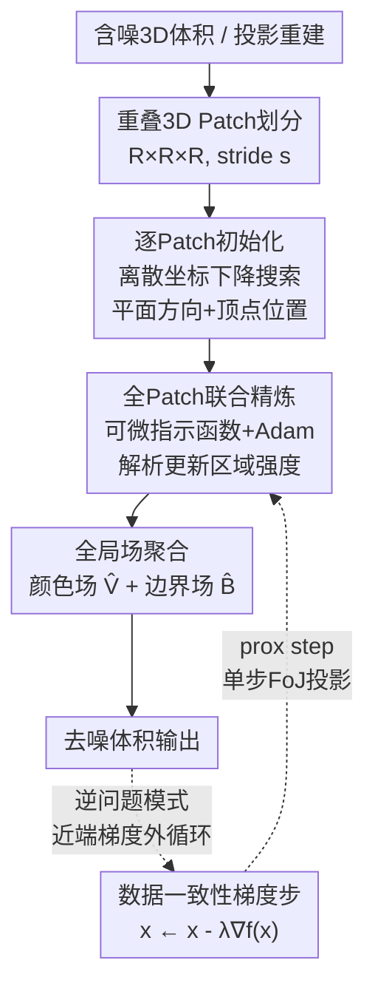

# 3D Field of Junctions: A Noise-Robust, Training-Free Structural Prior for Volumetric Inverse Problems

**会议**: ECCV 2026  
**arXiv**: [2603.02149](https://arxiv.org/abs/2603.02149)  
**代码**: [https://github.com/voilalab/3D-Field-of-Junctions](https://github.com/voilalab/3D-Field-of-Junctions)  
**领域**: 医学图像 / 3D视觉 / 图像恢复  
**关键词**: 3D去噪, 体积重建, 结构先验, 无训练优化, 逆问题

## 一句话总结
提出 3D Field of Junctions (3D FoJ)，将 2D FoJ (ICCV 2021) 的显式几何参数化推广到三维体积——用三平面交于顶点的 junction 对每个 3D patch 建模，逐 patch 离散坐标下降初始化后全局联合梯度精炼，无需任何训练数据即可在极低 SNR 下保留锐利边角，并可作即插即用的近端正则项嵌入任意体积逆问题（低剂量 CT、冷冻电镜、点云去噪均验证有效）。

## 研究背景与动机
三维成像逆问题普遍面临极低信噪比（SNR）的挑战：低剂量 CT 为减少辐射损伤限制 X 射线光子数，冷冻电镜（cryo-ET）为避免样品降解使用低电子束强度，激光雷达在雨雪天气下点云被强噪声污染。这些场景下的体积去噪不仅是后处理步骤，更是迭代重建算法的核心组件。

现有方法陷入两难困境。经典结构先验（如 3D-TV、非局部均值 NLM）和无需训练的神经网络先验（如 Deep Image Prior、隐式神经表示 INR）虽然不需要训练数据，但在极低 SNR 下会模糊边界和角点，丢失关键的几何结构。数据驱动的扩散模型和深度去噪器能够恢复锐利结构，但需要大规模配对训练数据——这在 3D 体积上往往难以收集，通常只能退而求其次地使用 2D 图像或小 3D patch 训练的模型来近似处理，不可避免地损失三维结构一致性。

核心矛盾在于：如何在极低 SNR 下，不依赖任何训练数据，同时保留锐利的三维边界和角点结构？本文的切入角度来自 2D Field of Junctions（FoJ, ICCV 2021）的启发——FoJ 用交于一个顶点的若干直线将 2D patch 划分为常值 wedge，通过优化顶点位置和边界方向，在极低 SNR 的 2D 图像上仍能稳健提取边缘和角点。本文的核心 idea 是将这一显式几何建模思路从 2D 推广到 3D：用三平面交于一个顶点的参数化方式对 3D 体积 patch 的局部几何建模，让平面方向和顶点位置直接在优化中决定 patch 内的分界面，天然保留锐利边角结构，同时不引入任何学习参数或训练数据。

## 方法详解

### 整体框架
3D FoJ 的核心是一条两阶段优化管线，输入含噪 3D 体积（或逆问题中由投影重建的中间体积），输出边界清晰、噪声被抑制的干净体积。首先将体积划分为重叠的 $R \times R \times R$ 的 3D patch（stride $s$），每个 patch 用一个 junction 模型表示——三条平面交于一个可自由移动的顶点，将 patch 划分为若干常值区域。然后进入初始化阶段：逐 patch 独立地通过离散坐标下降搜索最优的平面方向和顶点位置。最后进入精炼阶段：将所有 patch 联合起来，用可微的软指示函数替代离散区域划分，通过梯度优化（Adam）同时调整所有 junction 参数，并施加跨 patch 的边界一致性和颜色一致性约束。对于逆问题场景，3D FoJ 作为近端正则项嵌入近端梯度下降的外循环——每次迭代交替执行数据一致性梯度步和 FoJ 近端投影步。

### 关键设计

**1. 3D Junction 参数化：用三平面交于顶点统一表达边、角、面、均匀区**

每个 3D patch $V_i: \Omega_i \to \mathbb{R}^K$ 被参数化为三平面交于一个自由顶点 $\boldsymbol{v}_i^{(0)} \in \mathbb{R}^3$ 的 junction 模型。每张平面的法向量由其极角和方位角 $(\theta_i^{(\ell)}, \phi_i^{(\ell)})$ 决定（$\ell = 1,2,3$），顶点可以位于 patch 内部或外部——当顶点在外部时，patch 内只看到部分 wedge，可表达直边或均匀区域；当顶点在内部时形成完整 junction，可表达三面交于一点的角结构。三平面最多将 patch 划分为 8 个区域，每区域赋一个常数强度值 $c_i^{(j)} \in \mathbb{R}^K$。实验默认使用 $M=3$ 个活跃区域（式 7 只激活 3 个组合），在表达力和计算开销之间取得平衡。

这是 2D FoJ 中"直线交于顶点"在 3D 的自然推广：2D 中 $M$ 条直线产生 $M$ 个 wedge，3D 中 3 个平面产生至多 8 个区域。相比 2D FoJ，3D 的难点在于：分区的几何组合更复杂（8 种符号组合 vs 2D 的 wedge 序关系），且顶点有三个自由度而非两个。本文的关键简化是只用 3 个活跃区域（默认 $M=3$），其余区域赋零值，实证发现这对重建质量无负面影响，同时显著降低计算和内存开销。

**2. 可微软指示函数与边界场：让离散分区可导**

junction 优化需要对区域归属做梯度反传，但"某体素属于第 j 个区域"本质上是离散判断。本文引入软指示函数解决可微性问题：对每个体素 $\boldsymbol{v}$，计算其到第 $\ell$ 张平面的有符号距离 $d_\ell(\boldsymbol{v}) = \langle \boldsymbol{v} - \boldsymbol{v}_i^{(0)}, \mathbf{n}_i^{(\ell)} \rangle$，通过正则化 Heaviside 函数 $H_\eta(d) = \frac{1}{2}(1 + \frac{2}{\pi}\arctan\frac{d}{\eta})$ 将硬归属软化。三个平面的 8 种符号组合对应 8 个区域，软指示函数 $u_{\boldsymbol{\gamma}_i}^{(j)}(\boldsymbol{v}) \in [0,1]$ 由 $H_\eta$ 及其补的乘积给出（式 7），$\eta$ 控制过渡锐度（越小越接近硬划分，但梯度越陡峭）。

类似地，软边界场 $B_i^{(\delta)}(\boldsymbol{v}) = \pi\delta H'_\delta(\min_\ell |d_\ell(\boldsymbol{v})|)$ 用 Heaviside 导数的缩放来衡量体素到最近分界面的距离：体素越靠近某个平面，边界场值越高，远离平面则衰减至零。这个软边界场替代了式 3 中的硬边界项，使跨 patch 的边界对齐约束变得可导。这套软化技巧直接继承自 2D FoJ 但适配了 3D 平面距离计算，是整个精炼阶段梯度优化的关键使能技术。

**3. 两阶段优化：逐 patch 离散初始化的抗噪鲁棒性 + 全局联合精炼的跨 patch 一致性**

初始化阶段解决非凸优化的初值敏感问题。每个 patch 的顶点初始置于 patch 中心，每条平面的方向 $(\theta, \phi)$ 在均匀角度网格上离散搜索，选取最小化数据保真项（式 3 第一项）的方向。三平面依次贪心优化后，顶点在小邻域内扫描精调。整个过程逐 patch 独立执行，天然可并行。离散搜索虽然粗糙，但能在极高噪声下给出一个大致正确的几何估计而不陷入局部极小——这正是梯度方法在极低 SNR 下做不到的。

精炼阶段将所有 patch 联合起来，换用可微指示函数，通过 Adam 优化器同时更新所有 junction 的平面方向 $(\theta_i^{(\ell)}, \phi_i^{(\ell)})$ 和顶点位置 $\boldsymbol{v}_i^{(0)}$。区域强度 $c_i^{(j)}$ 不参与梯度更新，而是每步通过解析闭式解（式 9）直接计算——这是一个以体素归属为权重的加权平均，融合了当前 patch 的观测值 $V_i(\boldsymbol{v})$ 和全局颜色场 $\widehat{V}(\boldsymbol{v})$。全局颜色场 $\widehat{V}(\boldsymbol{v})$ 和全局边界场 $\widehat{B}(\boldsymbol{v})$ 分别由所有覆盖该体素的 patch 的对应值取平均得到（式 4、5），充当跨 patch 的一致性锚点。精炼过程中一致性权重 $\lambda_B$ 和 $\lambda_C$ 从小初始值逐渐增大到目标值，避免过早强制一致性导致欠拟合。

这一两阶段设计的关键洞察是：离散搜索的抗噪鲁棒性解决了初始化问题，梯度优化的平滑目标函数解决了精调问题，两者互补而非替代。实验中增加初始化和精炼的迭代次数不仅没有提升指标，反而使 MS-SSIM 和 PSNR 略微下降（Table 7），说明当前最少的迭代次数（各 1 次）已经足够——这印证了 junction 参数化本身的强结构归纳偏置使得优化极快收敛。

**4. 近端梯度逆问题求解：3D FoJ 作为即插即用的体积正则项**

将 3D FoJ 从直接去噪器升级为逆问题正则项的关键是近端梯度框架。对于低剂量稀疏视角 CT 重建，目标函数为 $f(\boldsymbol{x}) + g(\boldsymbol{x})$，其中 $f(\boldsymbol{x}) = \frac{1}{2}\|\boldsymbol{A}\boldsymbol{x} - \boldsymbol{b}\|^2$ 是投影数据保真项（$\boldsymbol{A}$ 为 Radon 变换），$g(\boldsymbol{x}) = \min_{\Gamma,C}\|\boldsymbol{x} - R(\Gamma,C)\|^2$ 是 3D FoJ 正则项——即重建体积与 FoJ 参数化体积 $R(\Gamma,C)$ 之间的欧氏距离。

近端梯度更新 $\boldsymbol{x}^{(k+1)} = \text{prox}_{\lambda g}(\boldsymbol{x}^{(k)} - \lambda\nabla f(\boldsymbol{x}^{(k)}))$ 交替执行两步：半迭代步 $\boldsymbol{x}^{(k+1/2)} = \boldsymbol{x}^{(k)} - \lambda \boldsymbol{A}^T(\boldsymbol{A}\boldsymbol{x}^{(k)} - \boldsymbol{b})$ 向数据一致方向走一步梯度下降；近端步 $\boldsymbol{x}^{(k+1)} = \arg\min_{\boldsymbol{x}}[g(\boldsymbol{x}) + \frac{1}{2\lambda}\|\boldsymbol{x} - \boldsymbol{x}^{(k+1/2)}\|^2]$ 将体积推向 FoJ 表示的几何流形。实际实现中，近端步被简化为从当前中间体积出发执行单次 3D FoJ 初始化+精炼更新——虽然这仅是精确近端算子的一个近似，但实验显示单步即足以引导重建向 FoJ 流形收敛。步长 $\lambda$ 同时控制数据项步长和正则项强度：$\lambda$ 越大，FoJ 先验越强，重建越接近分片常数的几何结构；$\lambda$ 越小，越接近最小二乘解。

这一设计的优雅之处在于：3D FoJ 的近端形式化使得它可以像 TV 正则项一样被插入任何现有的体积逆问题求解器中，不需要修改优化框架，只需要在每次迭代中调用 3D FoJ 作为近端算子——这也是论文声称"drop-in"的真正含义。

### 损失函数 / 训练策略

3D FoJ 不涉及训练，其核心优化目标（式 3）由三项加权和组成。第一项 $\sum_{i,j}\iiint u_{\boldsymbol{\gamma}_i}^{(j)}(\boldsymbol{v})\|V_i(\boldsymbol{v}) - c_i^{(j)}\|^2 d\boldsymbol{v}$ 是局部数据保真项，衡量每个 patch 被其 junction 模型（分片常数近似）解释的程度——这是推动去噪的主项，因为噪声体素与邻近区域均值的偏差会被高额惩罚。第二项 $\lambda_B\sum_i\iiint [B_i(\boldsymbol{v}) - \widehat{B}(\boldsymbol{v})]^2 d\boldsymbol{v}$ 是跨 patch 边界一致性项：局部边界场 $B_i(\boldsymbol{v})$ 应与其全局平均值 $\widehat{B}(\boldsymbol{v})$ 一致，迫使相邻 patch 的平面交界彼此对齐，防止同一个物理表面在不同 patch 中出现位置偏移。第三项 $\lambda_C\sum_{i,j}\iiint u_{\boldsymbol{\gamma}_i}^{(j)}(\boldsymbol{v})\|c_i^{(j)} - \widehat{V}(\boldsymbol{v})\|^2 d\boldsymbol{v}$ 是跨 patch 颜色一致性项：每个区域的常数值 $c_i^{(j)}$ 应与全局颜色场 $\widehat{V}(\boldsymbol{v})$ 一致，防止同一物理区域的强度在不同 patch 中出现差异。

初始化阶段只使用第一项（$\lambda_B=\lambda_C=0$），因为此时还没有可靠的全局场。精炼阶段中 $\lambda_B$ 和 $\lambda_C$ 按渐进调度从小递增——初始太大会在几何未对齐时就强压一致性导致过平滑。默认超参：patch 大小 $R=10$，stride $s=2$，活跃区域 $M=3$，软化参数 $\eta=10^{-2}$、$\delta=0.1$，初始化迭代 1 次，精炼迭代 1 次。

## 实验关键数据

### 主实验：低剂量 CT 重建

在 5 个合成体积数据集（pepper, teapot, jaw, foot, engine，$256^3$ 分辨率）上，从 20 个非均匀稀疏视角、三种光子数水平（P50/P100/P1000，对应极低/低/中信噪比）的带泊松噪声投影中重建，对比无需干净训练数据的方法：3D-TV、Filter2Noise（仅噪声样本自监督训练）、NAF（神经衰减场）、R$^2$-Gaussian，均为实例级优化方法。

| 方法 | P50 MS-SSIM $\uparrow$ | P100 MS-SSIM $\uparrow$ | P1000 MS-SSIM $\uparrow$ | P50 PSNR $\uparrow$ | P100 PSNR $\uparrow$ | P1000 PSNR $\uparrow$ |
|------|------------------------|-------------------------|--------------------------|---------------------|----------------------|-----------------------|
| 3D-TV | 0.703 | 0.739 | 0.829 | 13.79 | 15.31 | 16.96 |
| Filter2Noise | 0.663 | 0.689 | 0.695 | 11.61 | 15.13 | 14.64 |
| NAF | 0.423 | 0.467 | 0.569 | 14.17 | 14.67 | 15.66 |
| R$^2$-Gaussian | 0.574 | 0.577 | 0.652 | 15.29 | 15.29 | 15.87 |
| **3D FoJ (ours)** | **0.754** | **0.788** | **0.838** | **15.88** | **16.14** | 16.72 |

3D FoJ 在所有噪声水平下取得最高投影 MS-SSIM，且低 SNR（P50）优势最显著——这印证了 junction 先验在极端噪声下"保结构"的核心能力。3D PSNR 在 P50 和 P100 最优，P1000 略低于 3D-TV（16.72 vs 16.96），因为 PSNR 偏向全局均方误差，会奖励 TV 式的平滑解，而 FoJ 保留的锐利边角可能在逐体素 MSE 上并不占优。主观切片对比（teapot 的把手、engine 的内部空腔）显示 3D FoJ 在保留细薄结构上显著优于所有基线。

在真实冷冻电镜 centriole 数据（$1024\times1024\times300$）上，3D FoJ 无需训练即达到最佳 FSC$_{e/o}$ 0.25 阈值分辨率（32.14A vs SC-Net 39.86A），在多个真实 cryo-ET 体积（线粒体、囊泡、VEEV 病毒）上均呈现最佳的噪声去除与薄膜结构保留的平衡。在 28 个点云去噪数据集上，3D FoJ 在 10%-90% 异常值噪声和 40k-500k 扩散噪声两种设置下，Chamfer-L2 误差始终最低且随噪声增大几乎不退化（如 90% outlier 下 Chamfer-L2 均值 1.74，PointCVaR 为 19.64）。

### 消融实验

在 engine CT 数据集 P50 条件下，对 patch 大小、stride、活跃区域数 $M$ 和批处理大小进行消融。

| 配置 | Patch | Stride | M | MS-SSIM $\uparrow$ | 3D PSNR $\uparrow$ | 耗时 |
|------|-------|--------|---|--------------------|--------------------|------|
| 默认 | 10 | 2 | 3 | 0.798 | 17.17 | 17.2 min |
| 小 patch | 4 | 2 | 3 | 0.762 | 11.33 | 7.2 min |
| 大 patch | 12 | 2 | 3 | 0.800 | 17.70 | 24.7 min |
| stride=1 | 10 | 1 | 3 | 0.798 | 17.17 | 37.6 min |
| M=2 | 10 | 2 | 2 | 0.805 | 17.03 | 15.2 min |
| M=4 | 10 | 2 | 4 | 0.798 | 16.70 | 20.3 min |
| M=8 | 10 | 2 | 8 | 0.797 | 16.12 | 27.7 min |

关键发现：增大 patch 大小持续提升重建质量（更大的空间上下文平均更多噪声），但以线性增长的耗时为代价；stride 从 1 到 2 几乎无损（Stride-1: 0.798/17.17/37.6min vs Stride-2: 0.798/17.17/17.2min），推断噪声水平下 patch 重叠度在 stride=2 时已饱和；区域数 $M=2$ 或 $M=3$ 达到质量-效率最优，更多区域反而引入冗余自由度导致 PSNR 下降；批处理大小不影响重建质量，仅影响 GPU 利用率。增加初始化和精炼迭代次数不仅未提升指标，反而使 MS-SSIM 从 0.798 降至 0.70-0.76（Table 7），说明 3D FoJ 的优化极快收敛，过拟合到噪声的风险随迭代增加而上升。

### 关键发现
- **patch 大小是核心权衡杠杆**：更大的 patch 在高噪声下更有效（更多上下文平均噪声），但可能过度平滑弯曲结构；对于高曲率结构推荐较小的 patch 或使用 $M=8$ 全部扇区。
- **3D FoJ 对超参数不敏感**：在合理的 patch 大小（6-12）和区域数（2-4）范围内，性能变化平缓——这是一种工程友好的性质，意味着在新任务上无需精细调参。
- **计算开销可控**：$256^3$ CT 重建约 11.3 分钟（A6000 GPU，48GB），$1024\times1024\times300$ cryo-ET 约 185.6 分钟；点云去噪（$256^3$ 体素化）约 7.4 分钟。

## 亮点与洞察
- **将"结构先验"从正则项抽象中拉回几何实体**：3D FoJ 的所有参数——平面法向量、顶点坐标、区域强度——都有直接的物理几何解释。这与 TV（全局光滑性）或 Deep Image Prior（网络架构的隐式偏好）形成鲜明对比：你知道模型在"想"什么，因为参数本身就是几何。调试和解释都更直接。
- **初始化阶段的离散搜索是抗噪鲁棒性的无声功臣**：在高噪声下梯度信号被噪声淹没时，离散坐标下降因为只评估数据保真项而不依赖梯度方向，仍能给出粗糙但方向正确的几何估计。这一设计思路可迁移到其他需要在极低 SNR 下做几何估计的任务（如超声、SAR 图像）。
- **"即插即用"的近端形式化让方法有极强的通用性**：任何有 $f(x) + g(x)$ 形式的体积逆问题（CT、MRI、PET、光声成像、衍射层析等），只需将 $g$ 设为 FoJ 近端项即可获得保边去噪能力——这种"零修改接入"的接口设计降低了方法被采用的门槛。

## 局限与展望
- 作者承认三个主要局限：(1) 未针对每个任务/噪声水平单独调参会留下性能余量；(2) 大体积的计算开销和显存需求仍是瓶颈（需要分块或并行处理）；(3) 分片平面的局部假设对高度弯曲的结构（如血管、神经元树突）不够自然，此时 patch 大小和活跃区域数的选择变得关键。
- 实验中的一个可改进点是缺少与更 modern 的无训练 baseline 的对比——如基于 3D 扩散模型先验（Diffusion Posterior Sampling 的 3D 变体）、或 3D Gaussian Splatting 的实例优化方法（比较对象 R$^2$-Gaussian 使用的是 2D GS primitive 而非真正的 3DGS）。这些方法虽可能需要某种形式的预训练，但对比它们能更清晰地定位 3D FoJ 在"显式几何 vs 隐式先验"光谱上的位置。
- 一个自然的扩展方向是将 junction 模型适度松弛：例如允许每个区域内为低阶多项式而非严格常数（piecewise-linear 或 piecewise-quadratic），以更好地拟合缓变密度场（如软组织中 CT 值的渐变），代价是增加参数并可能需要一阶/二阶平滑约束。另一个方向是将 3D FoJ 与轻量学习结合——例如用少量数据学习一个自适应的 patch 大小和区域数选择策略。

## 相关工作与启发
- **vs 2D Field of Junctions (ICCV 2021)**: 本文是 2D FoJ 在 3D 的直接推广，核心创新在于：(a) 将"直线+顶点"升级为"平面+顶点"，分区从 wedge 变为立体角区域；(b) 引入三维重叠 patch 的边界场和颜色场全局一致性约束；(c) 提出近端梯度框架将去噪器升级为正则项。2D FoJ 只做图像去噪，3D FoJ 可处理CT重建等逆问题。
- **vs Deep Image Prior / INR**: 这些方法利用网络架构的隐式偏差去噪，优势是实现简单，劣势是低 SNR 下无法保留锐利边界——因为网络倾向于学习低频函数。3D FoJ 通过显式几何建模解决这一问题，但代价是优化过程更复杂且需要 patch-level 操作。二者的互补性值得探索：例如用 INR 重建平滑背景 + 3D FoJ 重建不连续边界。
- **vs 3D 扩散模型先验**: 扩散模型可以学到丰富的体积先验并保留锐利结构，但需要大量训练数据且推理慢。3D FoJ 的零训练特性使其在"没有训练数据"或"数据分布与训练集显著不同"的场景下有独特的适用性——例如罕见的病理 CT 或新型成像模态。
- **vs 经典变分方法（3D-TV, TGV）**: TV 是最通用的体积正则项，但会产生阶梯伪影且模糊角点。3D FoJ 本质上是一种"自适应各向异性 TV"——它在平面交界处允许强不连续（边保留），在 wedge 内部强制常数（强平滑），而平面方向和位置本身是数据驱动的而非全局预设的。这比 TV 多了一整层"几何估计"的自由度。

## 评分
- 新颖性: ⭐⭐⭐⭐☆ 将 2D FoJ 推广到 3D 的思路直接但非平凡——3D 平面分区的几何复杂度远超 2D 直线 wedge，且近端梯度嵌入逆问题的设计是原论文没有的；不过核心优化框架（离散初始化+梯度精炼+软指示函数）基本沿袭 2D FoJ，方法层面"继承"多于"原创"。
- 实验充分度: ⭐⭐⭐⭐⭐ 覆盖三类截然不同的成像任务（CT 重建、冷冻电镜、点云去噪），含合成数据+真实数据，噪声水平跨度大，对比方法与评估指标完备，消融实验细致（patch/stride/区域数/迭代次数/曲率），并给出了 runtime 和 memory 的实际测量。
- 写作质量: ⭐⭐⭐⭐☆ 方法描述清晰，从局部参数化到全局目标到优化算法再到逆问题嵌入逐层展开，逻辑连贯；大量定性切片对比增强说服力。部分公式编号与正文描述的对应关系可更明确（如 $M=3$ 时式 7 只激活 3 个区域的动机解释略简）。
- 价值: ⭐⭐⭐⭐☆ 为"无训练体积去噪"提供了一个新的强 baseline，尤其适合训练数据稀缺的医学和科学成像场景；即插即用的近端接口降低了方法复用门槛。主要价值不在绝对性能（P1000 下 PSNR 被 3D-TV 微弱超越），而在于证明了"显式几何先验在极低 SNR 下可以匹敌甚至超越神经网络先验"这一方法论价值。

<!-- RELATED:START -->

## 相关论文

- [\[CVPR 2026\] Efficient Unrolled Networks for Large-Scale 3D Inverse Problems](../../CVPR2026/medical_imaging/efficient_unrolled_networks_for_large-scale_3d_inverse_problems.md)
- [\[ICLR 2026\] Distributional Consistency Loss: Beyond Pointwise Data Terms in Inverse Problems](../../ICLR2026/medical_imaging/distributional_consistency_loss_beyond_pointwise_data_terms_in_inverse_problems.md)
- [\[CVPR 2026\] KLIP: localized distribution shift detection via KL-divergence with diffusion priors in Inverse Problems](../../CVPR2026/medical_imaging/klip_localized_distribution_shift_detection_via_kl-divergence_with_diffusion_pri.md)
- [\[ECCV 2026\] Render-FM: Feedforward Model for Real-time Photorealistic Volumetric Rendering](render-fm_feedforward_model_for_real-time_photorealistic_volumetric_rendering.md)
- [\[ECCV 2026\] Dual-Prior Guided Null-Space Learning with Mixture-of-Splines for Arbitrary Medical Slice Super-Resolution](dual-prior_guided_null-space_learning_with_mixture-of-splines_for_arbitrary_medi.md)

<!-- RELATED:END -->
