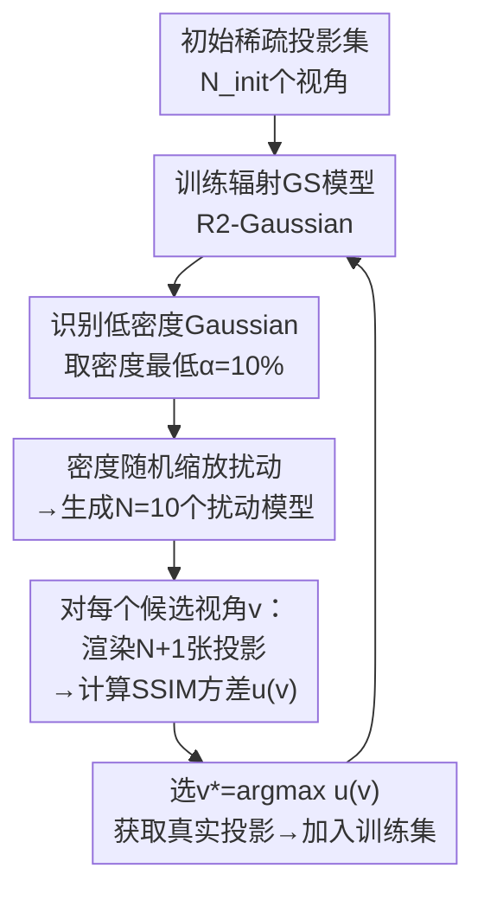

# 基于扰动高斯集合的层析成像主动视角选择

**会议**: ECCV2026  
**arXiv**: [2603.06852](https://arxiv.org/abs/2603.06852)  
**项目页**: [perturbed-gaussian-ensemble.cvmlgroup.web.illinois.edu](https://perturbed-gaussian-ensemble.cvmlgroup.web.illinois.edu)  
**代码**: 无  
**领域**: 医学图像  
**关键词**: 稀疏CT重建, 主动视角选择, 辐射3D高斯泼溅, 不确定性量化, 扰动集成

## 一句话总结
针对稀疏CT中X射线主动视角选择难题，提出基于辐射3DGS的扰动高斯集合框架：通过随机扰动低密度Gaussian基元的密度参数构建轻量模型集合，用候选视角投影的结构相似性（SSIM）方差量化认知不确定性，选择最能暴露几何伪影的视角作为下一最佳采集角度。

## 研究背景与动机

X射线计算机断层成像（CT）是医学诊断和工业检测中不可或缺的无损成像手段。稀疏视角CT通过大幅减少投影采集角度来降低患者的电离辐射暴露，但将层析重建变成了一个高度病态的反问题，现有算法在极稀疏条件下往往出现严重的条纹伪影和结构失真。近年来，辐射3D高斯泼溅（Radiative Gaussian Splatting）的出现为这一难题带来了突破性进展：它将经典3DGS框架适配到X射线透射成像，用一组显式Gaussian基元建模物体的三维密度场，通过可微渲染实现快速精确的CT重建（如R2-Gaussian等后续工作将辐射GS推向可直接面向体素的无偏重建）。然而，尽管三维建模能力大幅提升，实际重建质量的终极瓶颈却转向了数据的源头——在有限的视角预算下，到底该从哪些角度采集投影，才能既覆盖全局轮廓又精准捕捉局部结构细节？这就是CT中尚未被充分研究的"主动视角选择"问题。

现有的主动视角选择方法主要面向自然光照场景，FisherRF等代表性方法通过Fisher信息矩阵的对角近似估计候选视角的预期信息增益。但X射线的物理特性与自然光截然不同：X射线遵循Beer-Lambert吸收定律，投影是密度场沿射线路径的纯线性积分，不存在遮挡和表面反射；同时X射线衰减是各向同性的，Gaussian基元没有视角相关的球谐系数。这意味着自然光方法赖以运行的"前表面主导渲染+视角相关梯度"假设在CT中完全失效——沿射线路径的所有Gaussian高度耦合，FIM的对角近似会产生严重偏差，导致方法无法区分针状伪影和真实高密度结构，常常选择冗余视角而非真正能消除几何歧义的视角。

本文的核心洞察是：在稀疏视角约束下，几何歧义通常表现为脆性结构——不确定的边界、过拟合产物构成的针状伪影等——其投影在不同观测角度下表现出极大的不稳定性。一个有效的下一最佳视角，应该能够最大程度地暴露这种潜在的结构脆弱性。**核心idea：以低密度Gaussian基元作为不确定区域的代理，对其密度参数施加随机扰动构建模型集合，在候选视角下计算该集合渲染投影的结构方差（SSIM方差），方差最大的视角即为能最大限度暴露几何伪影的最佳视角。**

## 方法详解

### 整体框架

本文方法基于R2-Gaussian辐射高斯泼溅框架构建，核心管线是一个迭代闭环。初始阶段，给定少量稀疏投影（如2个初始视角），训练一个辐射GS模型建模三维密度场。随后进入主动选择循环：先从已训练模型中识别出密度最低的一批Gaussian基元作为不确定原语，对其密度参数施加随机缩放生成N个扰动模型，构成Perturbed Gaussian Ensemble；接着对候选视角池中的每个视角，用未扰动基模型和N个扰动模型各渲染一张投影，计算N个SSIM分数并取其方差作为该视角的不确定性分数；选择分数最高的视角作为下一最佳视角，采集该视角的真实投影并加入训练集，重新优化GS模型后进入下一轮迭代，直到总视角数达到目标预算。

### 关键设计

**1. 密度引导的随机扰动：以低密度Gaussian基元作为不确定性的探针**

在辐射GS中，每个Gaussian基元的密度参数ρ决定了它对X射线衰减的贡献量。高密度基元对应骨骼等明确定义的结构——即使视角稀疏，它们沿多条射线的投影约束足够充分，模型对这部分参数高度确信。低密度基元则正好相反：它们通常分布在组织边界附近、软组织与空气的交界面，或者是由过拟合衍生出的针状伪影的"尾巴"部分。由于训练视角极度有限，这些区域的几何形状存在严重歧义——模型可以沿射线方向拉伸出一长串低密度Gaussian来拟合已知投影，而这种拉伸在未观测视角下会表现为明显的伪影。

基于这一观察，作者选取密度最低的α%（实验中α=10%）的基元作为脆弱子集，对其中每个基元的密度做随机缩放：
$$\rho_{i,j} = \begin{cases} \rho_j \cdot (1 + \epsilon_{i,j}), & \text{if } G_j \in \mathcal{G}_{\text{low}} \\ \rho_j, & \text{otherwise} \end{cases}, \quad \epsilon_{i,j} \sim \text{Uniform}(-\beta, \beta)$$
高密度基元保持完全不变。每个扰动模型本质上代表了一个合理但不同的假设——如果那些不确定区域的密度略微变化，重建结构会变成什么样。N=10个扰动模型构成的集合在投影空间中自然展现出对几何歧义的不同解释，而要区分哪种解释更正确，就需要从某个新视角去看——这正是主动选择需要的信息。

**2. 投影空间结构方差：用SSIM方差定位认知不确定性**

有了扰动集合后，如何定义候选视角的"信息量"？核心思路是：如果一个视角能放大不同密度假设之间的投影结构差异，那它就能提供区分这些假设的信息。具体操作上，对候选视角v，用未扰动的基模型渲染参考投影I，再用N个扰动模型各自渲染一张投影I_i，计算每张与参考投影的SSIM分数s_i = SSIM(I, I_i)，候选视角的不确定性分数定义为这N个SSIM分数的样本方差u(v) = Var[s₁, ..., s_N]。

为什么选择SSIM而非L1误差或PSNR？这是一个细致但关键的工程洞察。X射线投影的线性积分特性决定了：对Gaussian密度做扰动必然引起投影整体亮度的偏移——因为沿射线的所有基元贡献被累加到了一起。L1和PSNR是逐像素计算的绝对或均方误差，对这类整体的亮度漂移极其敏感，低频亮度变化会轻易淹没来自几何歧义的结构变化信号。SSIM则内建了亮度归一化和对比度归一化，能够有效解耦绝对亮度平移和真正的结构信息。消融实验明确证实：将不确定性指标换为L1方差或PSNR方差后，重建PSNR3分别下降0.43dB和0.69dB，充分说明SSIM的结构感知特性是该方法成功的关键。

**3. 一次训练多次扰动：轻量集合模拟替代暴力集成**

最直觉的不确定性估计方法是用不同随机种子训练N个独立GS模型，然后比较它们的渲染差异。但这种暴力集成的代价随N线性增长，训练一个GS已经需要数万次迭代，训练N个在现实中完全不可行。本文的关键创新在于认识到：不确定性的根源主要在于低密度基元的参数变化，因此只需训练一个基模型，在评估时反复对脆弱子集施加扰动，通过N次前向渲染模拟出多模型分歧。这实际上等价于对后验分布p(I(v)|D)做了一次蒙特卡洛近似——扰动在参数空间中采样了N个合理的后验位置。单次前向渲染的成本远低于一次完整优化，使得整套主动选择流程在单张A40上即可高效完成。消融实验中N=10是最优选择：N=5时样本不足、不确定性估计不稳；N=40时大量样本稀释了极端结构失败案例的贡献，反而降低了不确定性分数的对比度。

### 损失函数 / 训练策略

基模型的优化目标包含投影级L1损失、D-SSIM损失以及3D全变分正则化损失。主动选择与模型优化交替执行：每当选取一个最佳视角后，将该视角的真实投影加入训练集对GS模型做增量优化。选择触发时刻遵循FisherRF的设置——在GS的稠密化阶段结束前完成，保证模型参数已足够稳定。

## 实验关键数据

### 主实验

在合成数据集（15个体积来自多个公开CT数据集）和真实数据集（FIPS的3个案例，FDK满采样后作为伪GT）上评估，采用半球形扫描轨迹。候选视角池包含448个均匀采样的扫描位姿。对比基线涵盖规则基线（随机/均匀/FPS）、2D无参考IQA方法（MUSIQ/MANIQA/TOPIQ）、以及3D不确定性方法（FisherRF）。

| 数据集 | 协议 | 指标 | Random | Uniform | FPS | FisherRF | **Ours** |
|--------|------|------|--------|---------|-----|----------|----------|
| 合成 | 24-view | PSNR3↑ | 32.629 | 33.562 | 33.508 | 33.347 | **34.078** |
| 合成 | 24-view | SSIM3↑ | 0.881 | 0.890 | 0.891 | 0.887 | **0.896** |
| 合成 | 36-view | PSNR3↑ | 34.823 | 35.877 | 35.367 | 35.551 | **36.226** |
| 合成 | 36-view | SSIM3↑ | 0.915 | 0.921 | 0.919 | 0.919 | **0.926** |
| 真实 | 24-view | PSNR3↑ | 36.112 | — | 36.134 | 36.205 | **36.399** |
| 真实 | 36-view | PSNR3↑ | 36.765 | — | 36.898 | 37.258 | **37.480** |

在更稀疏的设置（6/8/12/16-view）下本文方法同样持续超越所有基线，最低6-view时PSNR3达25.93（vs 次优FisherRF的25.80），验证了框架在极端稀采样条件下的适用性。

### 消融实验

| 配置 | 24-view PSNR3 | 说明 |
|------|-------------|------|
| Full(SSIM方差) | **34.078** | 默认配置 |
| 换用L1方差 | 33.644 | ↓0.43dB，亮度偏移污染结构信号 |
| 换用PSNR方差 | 33.390 | ↓0.69dB，同样被全局亮度变化主导 |
| N=5 | 33.952 | 集合规模太小，不确定性估计不稳 |
| N=10 | **34.078** | 最优权衡 |
| N=40 | 33.670 | 样本过多平滑了极端结构失效的对比度 |
| α=5% | 33.680 | 扰动范围太小，漏掉构成伪影的基元 |
| α=10% | **34.078** | 最优 |
| α=20% | 33.589 | 扰动波及高置信结构，引入非信息性变动 |
| β=0.1 | 34.040 | 扰动过弱，不足以破坏伪影的平衡 |
| β=0.5 | **34.078** | 最优 |
| β=1.0 | 33.338 | 扰动过强，结构全面失真，方差丧失区分度 |

### 关键发现

- **SSIM方差 vs L1/PSNR方差是本文最重要的消融发现**。它不仅验证了SSIM亮度归一化在X射线场景下的必要性，还揭示了CT主动视角选择的一项设计原则：必须隔离X射线线性积分导致的全局亮度偏移，聚焦于结构层面的变化信号。
- **密度引导扰动优于稀疏Dropout和位置抖动**：Dropout直接移除低密度Gaussian相当于完全丢失了这些区域的信号而不仅仅是探测其敏感性；位置抖动改变的是几何位置而非密度参数，与Beer-Lambert衰减的物理模型不对齐。
- FisherRF在合成24-view下甚至不如FPS启发式，说明其FIM对角近似的数学偏差在X射线耦合场景下不仅不产生增益，反而可能引入误导性的信息估计。
- 在真实数据上各方法的差距相比合成数据有所收窄，但本文仍保持领先，框架对不同噪声水平具有一定的鲁棒性。

## 亮点与洞察

- **把不确定性估计从不可行的暴力集成巧妙转化为"一次训练+多次扰动"**，利用辐射GS密度参数的显式物理解释直接定位不确定区域。N次前向渲染替代N次完整优化，使整套方案的算力成本降低了一个数量级。
- **SSIM方差替代L1/PSNR方差**是一个非常细致的洞察——认识到X射线线性积分导致的亮度漂移会污染逐点指标，SSIM的亮度对比度归一化恰好避开了这个陷阱。这个选择不是凭经验的，而是由底层的透射成像物理模型直接推导得出的。
- **"低密度=高不确定性"这个启发式简洁且有力**，不需要复杂的贝叶斯网络或MC Dropout，直接利用了辐射GS密度参数的语义含义。这种将模型自身参数语义与不确定性代理联系起来的设计思路在基于显式粒子/体素的渲染框架中具有通用借鉴价值。
- 论文将FisherRF等基线统一适配到辐射GS框架下重新实现并对比，为CT主动视角选择研究建立了标准化的评估协议和benchmark。

## 局限与展望

- 实验仅在半球形扫描轨迹（模拟C-arm CT）上评测，未在传统医用CT的环形轨道或螺旋扫描等几何约束下验证。不同轨迹的候选视角几何分布差异很大，可能影响选择策略的有效性。
- "低密度=高不确定性"假设在大多数情况下成立，但在极端场景下可能存在反例——如非常薄但结构确定的薄膜材料，其密度低但并无几何歧义。该假设的边界有待更系统的压力测试。
- Ensemble扰动仅作用于密度参数，未涉及位置和协方差的随机性。虽然消融显示位置抖动效果不如密度缩放，但位置和协方差的联合随机化是否带来额外增益仍是一个开放问题。
- 真实数据实验基于FDK满采样重建的伪GT，而非真实临床CT数据。在真实噪声（量子噪声、散射、束硬化）环境下的性能有待临床验证。

## 相关工作与启发

- **vs FisherRF**: FisherRF基于FIM对角近似估计信息增益，在自然光前表面主导的渲染中有效，但在X射线沿射线强耦合的场景下对角近似的数学偏差导致选择失效。本文从正向扰动路径出发，直接模拟参数变化对投影的影响，避免了梯度近似的偏差，同时保持了实时性。
- **vs ActiveNeRF / NAF等NeRF类方法**: NeRF使用隐式MLP建模密度场，训练和渲染速度远慢于3DGS，且缺少R2-Gaussian中对X射线透射物理解释的专门适配（如协方差缩放因子修正），难以同时满足快速重建和实时主动选择的需求。
- **vs 2D无参考IQA方法（MUSIQ/MANIQA/TOPIQ）**: 这类方法直接用投影质量作为视角选择依据，但缺少对3D结构不确定性的建模能力，其选择的视角倾向于"投影本身清晰"而非"反映三维结构的不确定"。

## 评分
- 新颖性: ⭐⭐⭐⭐ 将扰动集成与X射线3DGS物理特性深度结合的设计思路具有原创性，SSIM方差作为不确定性度量也是一个巧妙的细粒度贡献
- 实验充分度: ⭐⭐⭐⭐ 消融较为完整（不确定性度量、扰动比例、集合规模、替代策略均覆盖），但真实数据仅用伪GT而非真正临床CT
- 写作质量: ⭐⭐⭐⭐ 动机论述清晰，方法各部分逻辑链条完整，图表质量高
- 价值: ⭐⭐⭐⭐ 为低剂量CT中的智能扫描规划提供了可行的技术方案，具备明确的临床应用转化潜力

<!-- RELATED:START -->

## 相关论文

- [\[ECCV 2026\] BrainRiem: Riemannian Prototype Learning for Source-Free Cross-Site Brain Network Diagnosis](brainriem_riemannian_prototype_learning_for_source-free_cross-site_brain_network.md)
- [\[ECCV 2026\] BioMedVR: Confusion-Aware Mixture-of-Prompt Experts for Biomedical Visual Reprogramming](biomedvr_confusion-aware_mixture-of-prompt_experts_for_biomedical_visual_reprogr.md)
- [\[ECCV 2026\] Dual-Prior Guided Null-Space Learning with Mixture-of-Splines for Arbitrary Medical Slice Super-Resolution](dual-prior_guided_null-space_learning_with_mixture-of-splines_for_arbitrary_medi.md)
- [\[ECCV 2026\] NGPS: Structure-Preserving Self-Supervised Denoising via Neighbor-Guided Patch Sampling](ngps_structure-preserving_self-supervised_denoising_via_neighbor-guided_patch_sa.md)
- [\[ECCV 2026\] TaxoMIL: Taxonomy-Constrained Learning for Hierarchical Whole Slide Image Analysis](taxomil_taxonomy-constrained_learning_for_hierarchical_whole_slide_image_analysi.md)

<!-- RELATED:END -->
