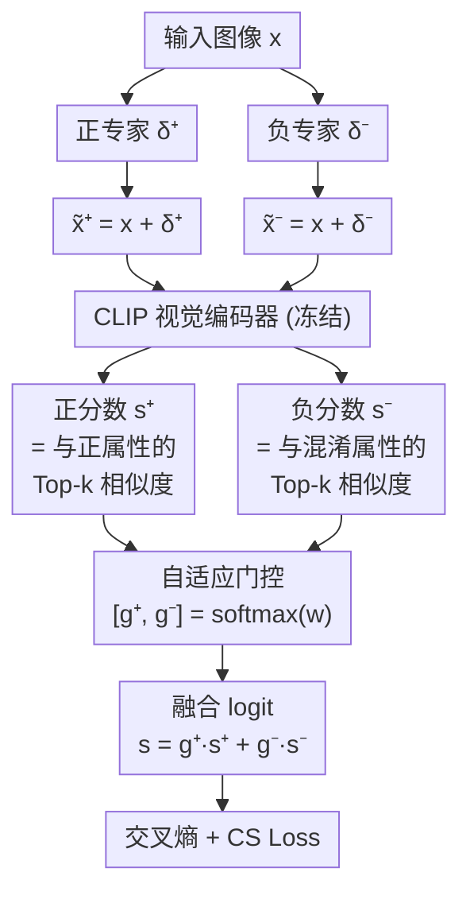

# BioMedVR: Confusion-Aware Mixture-of-Prompt Experts for Biomedical Visual Reprogramming

**会议**: ECCV2026  
**arXiv**: [2606.24740](https://arxiv.org/abs/2606.24740)  
**领域**: 医学图像  
**关键词**: 视觉重编程, 混淆抑制, 混合专家提示, CLIP适配, 少样本学习  

## 一句话总结

BioMedVR 首次将视觉重编程（Visual Reprogramming）引入医学影像领域，通过双专家解耦的混淆感知 MoPE 架构——正专家负责主类判别、负专家借助 LLM 生成的混淆属性抑制易混淆类别，配合一个带边距的混淆抑制损失（CS Loss）显式拉大正负分数间距——在 11 个医学数据集（9 种成像模态）和 7 个自然图像基准上一致超越现有 VR 和提示学习方法，参数量仅为全模型微调的 1/500。

## 研究背景与动机

预训练视觉语言模型（如 CLIP）在自然图像上展现了强大的零样本泛化能力，但在医学影像领域直接应用面临严峻挑战。医学数据通常标注稀缺、成像模态多样（超声 / MRI / CT / 病理切片等），且许多疾病亚型之间存在极其细微的视觉差异——例如白内障与青光眼、肾脏囊肿与肾脏肿瘤，在影像上外观高度相似，连经验不足的放射科医生都容易误判。将 CLIP 这类大模型在医学数据上全参数微调不仅计算开销巨大，在数据量极少时还容易过拟合。

参数高效迁移学习方法于是成为自然选择。提示学习（Prompt Learning）通过在文本或视觉 token 层面插入可学习 token 来适配冻结的骨干网络，但其核心依赖是需要访问模型内部结构。而视觉重编程（Visual Reprogramming, VR）提供了一条截然不同的路径：它在输入空间学习一个可微扰动叠加到图像上，完全不修改模型参数或内部结构，因此架构无关且在数据隐私敏感的医疗场景（如数据不出院、模型黑盒调用）中极具吸引力。现有的 VR 方法（如 AttrVR）在自然图像上已有不错表现，但它们都使用单一的共享视觉扰动来适配所有类别。在医学图像的高类间相似场景下，单一扰动难以同时捕获多类异质语义，当两个疾病子类的文本嵌入几乎重合时优化梯度迅速衰减，模型容易放大类别之间的混淆。

核心矛盾在于：医学细粒度分类不仅需要「知道某个类别是什么」，更需要「知道它跟哪些类别容易搞混、差在哪里」——这正是临床鉴别诊断的核心理念，却在现有的 VR 框架中被完全忽视。本文的切入点是：既然 LLM 具备丰富的医学知识，就可以让它为每个类别自动生成「看起来最像什么别的病」的混淆属性描述，从而显式建模类别之间的混淆关系。**核心 idea：将视觉重编程从单扰动范式解耦为双专家架构——正专家用判别性属性强化主类识别，负专家借助 LLM 生成的混淆感知属性抑制易混淆类别，通过可学习门控自适应融合二者输出，再配合一个显式扩大正负分数间距的混淆抑制损失来锐化决策边界。**

## 方法详解

### 整体框架

BioMedVR 的核心架构是 Confusion-aware Mixture-of-Prompt Experts（MoPE），将输入空间的视觉重编程显式拆解为两条互补路径。对于一张输入图像，正专家 $\delta^+$ 生成面向主类识别的重编程扰动，负专家 $\delta^-$ 生成面向混淆抑制的重编程扰动。两个扰动分别叠加到原图上后，经同一套冻结的 CLIP 视觉编码器提取特征嵌入，各自与对应类别的属性文本进行 Top-k 相似度聚合得到正、负两条逻辑分数。两路 logit 通过一个共享的可学习门控向量软加权融合，最终分类损失结合交叉熵与混淆抑制损失进行优化。

### 关键设计

**1. 双专家视觉重编程（MoPE）：显式解耦判别与混淆抑制两个优化目标**

现有 VR 方法使用单一的共享输入扰动 $\delta$ 拟合所有类别，这在医学高类间相似场景下会导致优化目标冲突——同一个扰动既要拉近正类又要推远多个易混淆类，梯度相互抵消。BioMedVR 将扰动解耦为两个独立专家：正专家 $\delta^+$ 学习与判别性正属性文本的对齐（如白内障的「晶状体弥散性混浊」），负专家 $\delta^-$ 则与 LLM 生成的混淆属性对齐（如「视盘杯凹变薄」——这是青光眼的典型特征，但对白内障来说是应该压制的混淆信号）。两个专家各自经过 CLIP 编码后的嵌入与其对应属性集取 Top-k 聚合，得到两路独立 logit $s^+_y$ 和 $s^-_y$。它们通过一个共享的可学习门控向量 $w$ 软加权融合：

$$s_y = g^+ s^+_y + g^- s^-_y, \quad [g^+, g^-] = \text{softmax}(w)$$

这个门控在全数据集上共享、自动学习，训练中自然地理性平衡——在容易混淆的类别上负专家权重会升高，在清晰可分的类别上正专家主导。

**2. LLM 驱动的混淆感知属性生成：将临床鉴别诊断知识注入 VR 框架**

负专家的混淆抑制目标「应该抑制哪个方向的混淆特征」并不是预先知道的。BioMedVR 利用 LLM（默认 GPT-4.1）的医学知识自动为每个疾病类别生成混淆感知描述：对每个类别 $y$，以「生成与 $[类别名]$ 在视觉上最易混淆的负面描述」为提示，获得 $N_c$ 条混淆感知文本属性 $\mathcal{T}^-_y = \{t^-_1, ..., t^-_{N_c}\}$。以肾脏肿瘤为例，正属性描述「不均匀增强的实性肿块」，而 LLM 生成的混淆属性则描述「边界清晰、囊性、内部均匀」——这正是肾脏囊肿的特征。通过将这类「看起来像囊肿」的线索编码为负专家的对齐目标，模型学会在看到类似囊肿的纹理时主动抑制将其误判为囊肿的倾向。LLM 属性生成离线运行，推理时无需调用，因此不增加推理开销。

**3. 混淆抑制损失（CS Loss）：显式扩大正负分数间距以锐化决策边界**

仅靠双专家架构和标准交叉熵仍不足以保证正、负 logit 之间有足够大的安全间距。BioMedVR 设计了一个带边距的混淆抑制损失来弥补这个缺口：

$$\mathcal{L}_{cs} = \mathbb{E}_{(x,y)}\left[\max(0, \max_{c \neq y} s^-_c - s^+_y + m)\right]$$

其中 $m$ 是边距超参数（默认 0.5）。这个损失的核心运作方式是：对每个样本，找到负专家在所有错误类别上给出的最高分 $\max_{c \neq y} s^-_c$——即「最像什么别的病」——然后强制这个最高混淆分数至少低于正专家的主类分数 $m$ 以上。只有当 $s^+_y - \max_{c \neq y} s^-_c < m$ 时才产生梯度，否则不惩罚，从而避免在已经判别清晰的样本上做无谓压制。这个机制直接模仿了临床鉴别诊断的思维过程：确认一个诊断前，先排除最有竞争力的鉴别诊断。

### 损失函数 / 训练策略

最终损失函数为交叉熵与混淆抑制损失的加权组合：

$$\mathcal{L} = \mathcal{L}_{CE} + \beta \, \mathcal{L}_{cs}$$

其中 $\beta=0.3$ 控制混淆抑制强度。训练时仅优化 $\{\delta^+, \delta^-, w\}$ 三个可学习组件（约 0.30M 参数，仅为全 CLIP 模型 150M 参数的 1/500），CLIP 视觉和文本编码器完全冻结。使用 SGD（初始 lr=40，momentum=0.9）配合余弦退火调度，训练 400 个 epoch，batch size 512。

## 实验关键数据

### 主实验

在 11 个医学数据集（覆盖 9 种成像模态、10 个器官）上以 16-shot 设置评测，骨干为 ViT-B/16 CLIP：

| 数据集 | 模态 | 基准（AttrVR） | 本文（BioMedVR） | 提升 |
|--------|------|--------------|------------------|------|
| BUSI | 超声 | 78.0% | **82.6%** | +4.6% |
| Knee X-ray | X光 | 33.5% | **45.7%** | +12.2% |
| Kvasir | 内镜 | 79.4% | **80.2%** | +0.8% |
| LungColon | 病理 | 93.8% | **94.7%** | +0.9% |
| OCTMNIST | OCT | 80.4% | 80.3% | -0.1% |
| BTMRI | MRI | 76.5% | **81.7%** | +5.2% |
| CHMNIST | 病理 | 85.3% | 84.5% | -0.8% |
| COVID-19 | X光 | 71.0% | **77.4%** | +6.4% |
| CT-Kidney | CT | 71.6% | **74.0%** | +2.4% |
| DermaMNIST | 皮肤镜 | 61.6% | **65.3%** | +3.7% |
| Retina | 眼底 | 71.5% | **74.1%** | +2.6% |
| **平均** | — | **73.0%** | **76.4%** | **+3.4%** |

BioMedVR 以通用域 CLIP（ViT-B/16）为骨干平均 76.4%，超越所有对比的 VR 方法（AttrVR 73.0%、AR 72.6%、VP 68.3%）和提示学习方法（BioMedCoOp 71.2%、CoCoOp 66.6%、CoOp 63.9%），参数量仅 0.30M（约 BioMedCoOp 的一半）。在零样本设置下，BioMedVR（ZS）相比原始 CLIP 提升 +3.5%（28.1% → 31.6%），若基于 BioMedCLIP 骨干则达到 47.6%。

### 消融实验

| 配置 | 平均准确率 | 相对变化 | 说明 |
|------|-----------|---------|------|
| 完整模型 | **76.4%** | — | 所有组件 |
| w/o 混淆感知属性（CA） | 71.4% | -5.0% | 负专家退化为 NaN 监督 |
| w/o 双专家（MoPE） | 75.6% | -0.8% | 退化为 AttrVR 式单扰动 |
| w/o CS Loss | 73.6% | -2.8% | 训练不稳定、跨数据集方差增大 |

### 关键发现

- **混淆感知属性是最关键的组件**：去掉后平均准确率暴跌 5.0%，是所有消融中对性能冲击最大的单项，说明负专家的有效性完全依赖于 LLM 生成的高保真混淆描述而非随机文本。
- **专业化优于数量化**：MoE 架构分析表明，增加通用专家数量对性能提升有限，而 2 个语义特化的专家（正专家 + 混淆负专家）达到最佳效果，印证了语义特化而非专家数量才是 VR 的关键设计变量。
- **跨骨干鲁棒性好**：在 ViT-B/32 和 RN50 骨干上分别取得 +1.5% 和 +2.6% 的稳定提升，证实方法架构无关、可泛化至不同类型骨干。
- **零样本能力有亮点**：仅凭 LLM 生成的混淆属性与正属性融合、无需任何训练，即在 Knee X-ray（+10.9%）和 LungColon（+28.9%）等数据集上大幅超越 CLIP 零样本基线。

## 亮点与洞察

- **首次将 VR 引入医学影像**。过去 VR 主要验证在自然图像上，本文证明了其在九种医学模态上的可行性，且不牺牲架构无关性和隐私保护——这对数据不出院、模型黑盒调用的医疗场景有实际落地价值。
- **混淆属性生成 + 双专家解耦 + CS Loss 三个组件环环相扣**：缺了混淆属性，负专家沦为噪声（-5.0%）；缺了双专家，无法对正/负目标分别优化（-0.8%）；缺了 CS Loss，拉不开间距（-2.8%）。消融实验清晰地验证了整体设计的自洽性。
- **门控设计极其轻量**：仅用一个 2 维 softmax 向量完成正/负专家权重自适应，无需复杂路由网络，在 0.30M 参数的极端轻量级下做到了有效的解耦融合。
- **从鉴别诊断视角做分类**的思路有广泛迁移价值：不是单纯「学类别原型」，而是「学哪些别的类容易搞混并压制它们」，可迁移至任何细粒度分类场景（物种识别、矿物分类、工业缺陷检测等）。

## 局限与展望

- **LLM 属性质量依赖性强**。混淆属性完全由 LLM 离线生成，GPT-4.1 最优但其他 LLM 结果略差；论文未探讨领域专家（放射科医生）提供结构化鉴别诊断列表是否优于 LLM 生成。真实临床部署中专家知识可能是更可靠的语义来源。
- **仅覆盖图像级分类**。当前 BioMedVR 聚焦于疾病诊断分类，未在分割、检测等像素级稠密预测任务上验证——而这些恰好是医学影像分析中更常见的任务。
- **门控全局共享缺乏样本级适应性**。当前门控向量在全体数据集上共享，对于本身清晰的样本负专家持续计算可能浪费资源；对于极模棱两可的样本可能又需要更强的负专家调制。引入样本级条件门控是自然延伸方向。
- **训练计算量约为单扰动的 2 倍**（9.10s/epoch vs AttrVR 6.55s/epoch）。虽然推理时可以通过一次编码器前向+嵌入空间运算来避免双倍开销，但训练阶段的效率仍有优化空间。

## 相关工作与启发

- **vs AttrVR**: 最直接的基线，也用属性引导 VR 但仅一个共享扰动。BioMedVR 将单扰动拆为正/负双专家配合 CS Loss，在 11 个医学数据集上平均提升 +3.4%。
- **vs BioMedCoOp**: 第一篇将提示学习应用到医学 VLM 适配的工作，需访问模型内部 token 层。BioMedVR 作为输入空间的 VR 方法，架构无关且适配隐私敏感场景，在通用 CLIP 骨干下以更少参数达到更高准确率（76.4% vs 71.2%）。
- **vs CoOp / CoCoOp**: 这些经典提示学习方法在医学数据上受限于 token 级表征能力——CoOp 在 Knee X-ray 仅 27.1%，而 BioMedVR 达到 45.7%。输入空间的 VR 可学习像素级扰动，捕捉微血管纹理等 pixel-level 特征，这是 token 级提示难以表达的细粒度差异。

## 评分

- 新颖性: ⭐⭐⭐⭐ 首次将 VR 引入医学影像 + 混淆感知双专家设计是新范式贡献，但各组件（VR、属性引导、MoE、LLM 生成）均为已有技术的巧妙组合。
- 实验充分度: ⭐⭐⭐⭐⭐ 11 医学 + 7 自然数据集、4 种 LLM 消融、多骨干验证、t-SNE 可视化、超参数分析、MoE 数量实验，非常全面。
- 写作质量: ⭐⭐⭐⭐ 动机清晰、Method 完整，但部分细节（Top-k 选取机制等）依赖于对 AttrVR 的引用，需翻阅原文才能完全理解。
- 价值: ⭐⭐⭐⭐ 作为 VR 在医学领域的奠基性工作，输入空间 + 架构无关 + 混淆感知的设计对低资源医疗 AI 部署有实际意义；除分类外尚有延展空间。

<!-- RELATED:START -->

## 相关论文

- [\[ICML 2025\] I2MoE: Interpretable Multimodal Interaction-aware Mixture-of-Experts](../../ICML2025/medical_imaging/i2moe_interpretable_multimodal_interaction-aware_mixture-of-experts.md)
- [\[ICML 2026\] EEG-Based Multimodal Learning via Hyperbolic Mixture-of-Curvature Experts](../../ICML2026/medical_imaging/eeg-based_multimodal_learning_via_hyperbolic_mixture-of-curvature_experts.md)
- [\[CVPR 2026\] SegMoTE: Token-Level Mixture of Experts for Medical Image Segmentation](../../CVPR2026/medical_imaging/segmote_token-level_mixture_of_experts_for_medical_image_segmentation.md)
- [\[NeurIPS 2025\] MoRE-Brain: Routed Mixture of Experts for Interpretable and Generalizable Cross-Subject fMRI Visual Decoding](../../NeurIPS2025/medical_imaging/more-brain_routed_mixture_of_experts_for_interpretable_and_generalizable_cross-s.md)
- [\[ICLR 2026\] Mixture of Mini Experts: Overcoming the Linear Layer Bottleneck in Multiple Instance Learning](../../ICLR2026/medical_imaging/mixture_of_mini_experts_overcoming_the_linear_layer_bottleneck_in_multiple_insta.md)

<!-- RELATED:END -->
