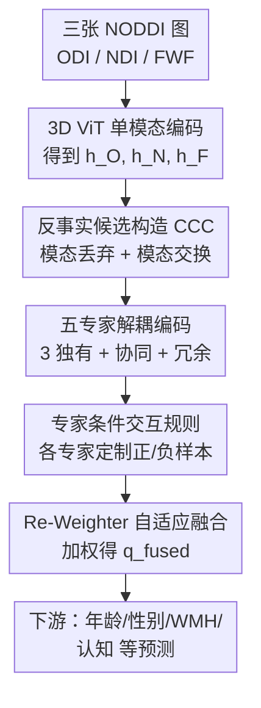

# BrainFIBRE: A Foundation Model via Information Decomposition for Brain Microstructure

**会议**: ECCV 2026  
**arXiv**: [2607.00573](https://arxiv.org/abs/2607.00573)   
**代码**: [https://github.com/hzlab/BrainFIBRE](https://github.com/hzlab/BrainFIBRE)  
**领域**: 医学图像 / 脑成像 / 自监督基础模型  
**关键词**: 扩散MRI、脑微结构、偏信息分解(PID)、混合专家(MoE)、自监督预训练

## 一句话总结
BrainFIBRE 是首个面向脑组织微结构的基础模型，把 NODDI 派生的三张微结构图（NDI/ODI/FWF）当成三个模态，用「自监督偏信息分解 SPID + 反事实候选构造 CCC」在 UK Biobank 5.5 万人上预训练一个混合专家网络，无标签地把三模态的独有/冗余/协同信息拆开，在跨种族多队列的年龄/性别/脑血管与神经退行标记/认知等下游任务上全面刷到 SOTA，且专家权重可解释。

## 研究背景与动机
扩散磁共振成像（dMRI）是无创探测脑组织微结构的基石技术，它通过测量水分子在组织内的受限扩散来间接反映微观结构。但传统扩散指标（如平均扩散率 MD、各向异性分数 FA）在一个体素内把所有编码方向上的水扩散笼统平均，缺乏生物学特异性——同一个 FA 变化可能来自神经突丢失、脱髓鞘、水肿或神经炎症中的任意一种，几种截然不同的生物物理过程被搅在一起。NODDI（神经突取向弥散与密度成像）用生物物理模型把体素扩散信号拆到「胞内神经突 / 胞外 / 自由水」三个隔室，派生出三张可解释参数图：神经突密度指数 NDI、取向弥散指数 ODI、自由水分数 FWF，分别刻画神经突堆积密度、纤维排列的一致性、细胞外液，从而把上述被混淆的过程解耦开。这些图对脑老化、脑小血管病（如白质高信号 WMH）、早期阿尔茨海默相关改变都有机制层面的敏感度。近年脑基础模型靠大规模无标签自监督已经革新了神经影像分析，但它们几乎只覆盖宏观结构 MRI（T1/T2）或功能 MRI，专门面向组织微结构的基础模型是缺位的。

真正的难点不在于「有没有人做微结构基础模型」，而在于怎么融合这三张图。每张图各自编码一种独立的生物物理过程，而以往脑影像里的多模态融合策略（把不同模态塌进一个单一潜空间）恰恰会把 NODDI 费力解耦出来的过程重新纠缠回去——这等于抵消了 NODDI 的全部价值。要绕开这个陷阱，需要一套原理化框架，能系统刻画 NDI、ODI、FWF 三者之间到底是互补、冗余还是协同关系，并且这种关系对不同神经学任务可能不一样。偏信息分解（PID）恰好提供了理论基础：它把多个来源关于某目标携带的总信息拆成独有（unique，各模态单独贡献的）、冗余（redundant，跨模态共享的）、协同（synergy，只有联合观测才涌现的）三类原子。已有工作 I2MoE 把 PID 落到混合专家（MoE）上，给每类交互配专门的专家，在阿尔茨海默分类上做出了可解释预测；但它用「各单模态分类器的二值标签是否一致」来近似 PID 交互类型，这就把分解结果死死绑在了分类器质量上，而且**根本无法做基础模型赖以为生的大规模自监督预训练**——因为整个机制离不开下游标签。

于是本文的核心矛盾清楚了：既要 PID 的可解释解耦，又要自监督的无标签可扩展，二者此前不可兼得。BrainFIBRE 把 NDI/ODI/FWF 视作三个模态，让 MoE 里三个独有专家 + 一个冗余专家 + 一个协同专家各自锁定一类信息，而破局点在于如何在没有任何监督信号的情况下把这五类信息分开。**核心 idea 是：用「模态丢弃 + 模态交换」系统性地破坏三模态之间的生物物理对齐，制造出一批反事实候选（CCC），再为每个专家定制「哪些扰动该是正样本、哪些该是负样本」的交互规则，从而把 PID 的独有/冗余/协同分解完全内化成一个自监督对比目标（SPID）。**

## 方法详解

### 整体框架
BrainFIBRE 要解决的是「在不重新纠缠三张 NODDI 图生物物理含义的前提下，无标签地学到可迁移的脑微结构表示」。对每个被试，输入是一个 3D 微结构三元组 $\mathbf{X}=\{X_m\}$，其中 $m\in\{O,N,F\}$（O:ODI，N:NDI，F:FWF），每张 $X_m\in\mathbb{R}^{H\times W\times D}$。三张图先各过一个独立的 3D ViT-S 编码器 $E_m$ 得到单模态嵌入 $h_m$；这些嵌入被路由到五个交互专家（三个独有 $U_{uO},U_{uN},U_{uF}$ + 一个协同 $U_{syn}$ + 一个冗余 $U_{red}$），每个专家输出一个交互嵌入 $q_k$；一个 Re-Weighter 模块给五个专家学出权重 $w_k$，加权求和成最终融合表示 $q_{fused}$。训练时，SPID 靠 CCC 造出的反事实候选池，配合交互规则驱动的交互损失 $\mathcal{L}_{Inter}$ 让每个专家只对自己那类信息敏感，再叠一个全局对比损失 $\mathcal{L}_{Cont}$ 学被试级表示，全程零下游标签。下游用时冻结/微调编码器，把 $q_{fused}$ 接线性头做回归或分类。

### 关键设计

**1. 五专家解耦编码：把 PID 的三类信息原子各交给一个专家**

痛点直白：以往融合把三模态塌进单一潜空间，NODDI 好不容易解耦的过程又被搅回去。BrainFIBRE 依 PID 把交互显式分成独有、协同、冗余三类，并落成五个专家——三个独有专家（每模态一个）负责各自模态独占的信息，一个协同专家负责只有三模态联合才涌现的信息，一个冗余专家负责三模态共享的信息。三个独有专家实现很轻，就是各自模态嵌入过一个线性投影头。协同与冗余专家则要跨模态动态聚合，用的是「查询式注意力」：给每个这类专家一个可学习查询 token $q_0^k$ 当 Query，把三个单模态嵌入拼接后线性投影成 Key $K\in\mathbb{R}^{3\times d_{enc}}$ 和 Value $V$，用缩放点积注意力算出专家嵌入

$$\alpha_k=\text{Softmax}\!\left(\frac{q_0^k K^\top}{\sqrt{d_{enc}}}\right)\in\mathbb{R}^{1\times 3},\qquad q_k=\text{Linear}(\alpha_k V)\in\mathbb{R}^{1\times d_{exp}}$$

这样协同/冗余专家能顺着各自学到的查询，动态地在三模态间抓取需要的信息。关键在于：这只是「结构上准备好五个各司其职的容器」，容器里真的只装对应那类信息，全靠下面的自监督信号去逼——这正是本文和「结构相似但要监督标签」的 I2MoE 分道扬镳的地方。

**2. 反事实候选构造（CCC）：用模态丢弃与交换造出破坏对齐的负样本**

这是全文最核心的破局点，回答「没有标签怎么把独有/冗余/协同分开」。标准的空间增广（旋转、翻转等）会完整保留对齐的三模态三元组，模型永远不用去区分「某模态独占的信息」和「三模态天然的共现」，因此提供不了解耦所需的教学信号。CCC 的做法是主动破坏生物物理对齐来制造对比信号。对一个 minibatch 的 $N$ 个被试，每个被试生成两个增广视图 A、B。用视图 A 经五专家得到锚点嵌入；用视图 B 构造一组反事实候选：

- **基础候选** $b_0$：视图 B 完整、未扰动的嵌入。
- **模态丢弃** $drop_m$：把第 $m$ 个模态嵌入换成高斯噪声，模拟该模态缺失，例如 $drop_O(i)=U_k([\text{noise},h_N^B(i),h_F^B(i)])$。
- **模态交换** $swap_m$：把第 $m$ 个模态嵌入换成同一 batch 内另一个随机被试 $j$ 的对应模态嵌入，例如 $swap_O(i)=U_k([h_O^B(j),h_N^B(i),h_F^B(i)])$，以破坏跨模态的生物物理对应。

三者合成候选池 $\mathcal{C}_i=\{b_0(i)\}\cup\{drop_m(i)\}_m\cup\{swap_m(i)\}_m$。这里有个巧妙的细节：整个 batch 每个视图施加**完全相同的空间变换**，保证交换进来的嵌入仍严格解剖对齐。因为人脑宏观解剖高度保守，把某人的一张图换成另一个人的对应图，得到的反事实「解剖上看着合法、但微结构层面根本是错配的」——正是这种细微错配逼模型超越「认脑子的整体形状」，去真正学神经突密度、取向弥散、自由水之间体素级的生物物理对应。

**3. 专家条件交互规则 + 多正样本 InfoNCE：让每个专家只认自己那类信息**

有了候选池，还得告诉每个专家「哪些候选是正、哪些是负」，这套规则把 PID 语义直接编码进对比学习。逻辑是按「该专家的目标因子在这个扰动里是否被保留」来判定：独有专家 $U_O$ 应对其他模态（N、F）的变化不敏感、只对自己模态（O）敏感，所以 $drop_N,drop_F,swap_N,swap_F$（O 模态没动）都是正样本，而 $drop_O,swap_O$（O 模态被毁/被换）是负样本；冗余专家 $U_{red}$ 应对「部分信息缺失」鲁棒，于是所有 dropout 候选为正、所有 swap 候选为负（交换会让某模态来自别人，破坏了跨模态共享性）；协同专家 $U_{syn}$ 依赖三模态建设性联合，任何扰动都会毁掉涌现信息，因此只有基础候选 $b_0$ 是唯一正样本。据此用多正样本对称 InfoNCE 构造交互损失，锚点 $q_k^A(i)$ 与其正候选拉近、与负候选及 batch 内其他被试推远：

$$\mathcal{L}_{Inter}=\sum_{k\in\mathcal{K}}\sum_{i=1}^{N}-\log\frac{\sum_{z^{+}\in\mathcal{P}_k(i)}\exp(\text{sim}(q_k^A(i),z^{+})/\tau)}{\sum_{z\in\mathcal{C}_{batch}}\exp(\text{sim}(q_k^A(i),z)/\tau)}$$

损失在 A→B 与 B→A 两个方向对称化。作者还给了理论支撑（附录 Thm 1/2 + 推论 1）：在若干独立性假设下，CCC 规则诱导出的五个「扰动不变充分统计量」恰好对应一个简化的五原子 PID（三独有 + 一冗余 + 一协同），交互损失存在一个「每个专家只用自己那一个潜因子就能解对比任务」的分解最优解。作者诚实地界定了范围——这是种群层面（population-level）的设计合理性论证，并**不**声称精确恢复完整三源 PID 格、也不保证有限样本可辨识或优化一定收敛到该最优。

**4. Re-Weighter 自适应融合：按任务动态给五个专家分配重要性**

不同神经学任务依赖的交互类型不同（后文实验会看到 WMH 靠 FWF 独有信息、海马萎缩靠 ODI），所以固定权重融合不合理。Re-Weighter 是个 MLP，吃三个单模态嵌入拼接，softmax 出五个专家的权重分布，加权得融合表示：

$$\mathbf{w}=\text{Softmax}(\text{MLP}([h_O,h_N,h_F]))\in\mathbb{R}^{1\times5},\qquad q_{fused}=\sum_{k\in\mathcal{K}}w_k\cdot q_k$$

这套权重不仅决定融合，还天然成了可解释性抓手——把测试集上五个专家权重的分布画出来，就能读出某个任务/某个队列到底更依赖哪种微结构交互。

### 损失函数 / 训练策略
总目标是交互损失 + 全局对比损失 + 两个防坍缩正则的加权和：

$$\mathcal{L}_{total}=\mathcal{L}_{Inter}+\mathcal{L}_{Cont}+\beta\mathcal{L}_{balance}+\gamma\mathcal{L}_{entropy}$$

其中 $\mathcal{L}_{Cont}$ 是对融合嵌入 $q_{fused}^A,q_{fused}^B$ 施加的对称 InfoNCE，学被试级表示。自监督训 MoE 极易表示坍缩（把所有样本都塞给单一专家），故加两个正则：$\mathcal{L}_{balance}$ 最小化「batch 平均专家分配概率」与均匀分布的 KL 散度，防全局专家坍缩；$\mathcal{L}_{entropy}$ 最小化个体权重分布的负熵，鼓励每个被试软性地综合多个专家而非 one-hot 硬路由。实现上：3D ViT-S 骨干，输入 $(96,112,96)$、patch $(16,16,16)$，$d_{enc}=384$、$d_{exp}=128$；8 张 H200(140GB) 训 200 epoch、global batch 280、约 40 小时；AdamW，基础学习率 $2e{-4}$，余弦退火；$\tau_{cont}=0.2,\tau_{inter}=0.12$，$\beta=0.05,\gamma=0.01$；前 5 epoch warmup 期给五专家显式均匀路由权重以防早期坍缩。

## 实验关键数据

预训练用 UK Biobank 55,592 名被试的 NODDI 图（迄今最大公开 dMRI 数据集）。下游评测横跨三队列：UKB 留出集（4,307 人，白人为主）、HCP-Aging（630 人，外部验证）、SINGER（818 人，亚洲队列，社区老人含轻度认知障碍风险）。回归用 MAE↓/Pearson 相关↑，分类用 F1↑/Acc↑，结果为 3 个随机种子的均值。

### 主实验
UKB 留出集上与单模态 ViT、监督多模态 I2MoE、自监督多模态基础模型 BrainMVP、以及同架构 train-from-scratch(TFS) 对比（下划线原文表示对全部 baseline 显著，$p<0.05$）：

| 任务(UKB) | 指标 | BrainFIBRE | 最强 baseline | 说明 |
|--------|------|------|----------|------|
| 年龄 | MAE↓ | **3.95** | 4.24 (ViT-F) | 显著优于全部 |
| 年龄 | Corr↑ | **0.76** | 0.71 (ViT-F) | — |
| 性别 | F1↑ / Acc↑ | **89.30 / 89.33** | 82.18 / 82.21 (ViT-F) | 大幅领先 ~7 分 |
| 海马萎缩(5年) | MAE↓ | 109.21 | 109.76 (BrainMVP) | 各法接近，本文略优 |
| 处理速度 | MAE↓ | 0.21 | 0.16 (ViT-O) | 该项本文并非最优 |

跨队列泛化（外部集，取相关系数 Corr↑）：

| 任务 | 数据集 | BrainFIBRE | 最强 baseline |
|------|--------|------|----------|
| 年龄 | HCP-A | **0.87** (MAE 5.54) | 0.84 (TFS) |
| Flanker(执行) | HCP-A | **0.40** | 0.35 (BrainMVP) |
| WMH 体积 | SINGER(亚洲) | **0.59** (MAE 2.08) | 0.44 (BrainMVP) |
| 平均皮层厚度 | SINGER | **0.60** | 0.55 (ViT-F) |

值得注意：监督多模态 I2MoE 在这些任务上反而常常垫底（UKB 年龄 MAE 6.21、Corr 仅 0.42），说明「有 PID 结构但绑死标签、缺自监督预训练」在小样本下游上并不占优；而 BrainFIBRE 在种族迥异的亚洲队列 WMH 上把相关从 baseline 的 0.44 拉到 0.59，说明学到的是可广泛迁移的微结构特征而非队列偏差。

### 消融实验
主文 Fig.4 做了两类消融（融合表示 vs 单专家、vs 只用两模态），附录还补了损失项与专家消融（UKB 年龄 & 亚洲 WMH，Corr↑/MAE↓）：

| 配置 | UKB年龄 Corr↑ / MAE↓ | 亚洲WMH Corr↑ | 说明 |
|------|---------|------|------|
| 完整 BrainFIBRE | 0.76 / 3.95 | 0.59 | 融合全部五专家 |
| w/o 协同专家 $u_{syn}$ | 0.66 / 4.55 | — | 掉最狠，Corr −0.10 |
| w/o 冗余专家 $u_{red}$ | 0.68 / 4.41 | — | Corr −0.08 |
| w/o 协同&冗余 | 0.67 / 4.48 | — | 两个都去也大掉 |
| w/o $\mathcal{L}_{Inter}$ | 0.71 / 4.22 | — | 去掉交互损失退化明显 |
| w/o $\mathcal{L}_{Cont}$ | 0.70 / 4.24 | 0.47 | 全局对比也重要 |
| w/o $\mathcal{L}_{balance}$ | 0.72 / 4.16 | 0.34 | 亚洲 WMH 掉到 0.34 |
| w/o $\mathcal{L}_{entropy}$ | 0.71 / 4.17 | 0.46 | 防坍缩正则有用 |

此外与标准融合基线对比（附录 Table 6）：早融合 ViT-EF（三图通道拼接）与晚融合 ViT-LF（三编码器嵌入拼接）即便也做自监督预训练，UKB 年龄 Corr 也只到 0.72/0.71、亚洲 WMH 0.38/0.35，均显著低于 BrainFIBRE 的 0.76/0.59——证明增益来自 SPID 预训练范式与 PID 启发的 MoE，而非单纯「有多模态输入」。

### 关键发现
- **协同专家贡献最大**：去掉 $u_{syn}$ 时 UKB 年龄 Corr 从 0.76 掉到 0.66、MAE 从 3.95 涨到 4.55，是所有消融里掉得最狠的，说明「只有三模态联合才涌现的信息」对脑微结构预测最关键；融合表示始终优于任一单专家、去掉任一模态都退化。
- **交互模式随任务/队列变化，且可解释且符合病理**：UKB 里协同专家平均权重最高；年龄预测更依赖 FWF 独有信息（自由水是显著的老化标记），海马萎缩预测则由 ODI 主导（取向弥散改变高度指示局部神经退行）；亚洲队列 WMH 预测则 FWF 独有信息成为首要贡献者，与「WMH 负荷主要由细胞外水扩张驱动」的既有神经病理发现一致。
- **正则不可省**：去掉 $\mathcal{L}_{balance}$ 后亚洲 WMH 相关从 0.59 崩到 0.34，印证自监督 MoE 极易专家坍缩、平衡损失是稳住解耦的关键。

## 亮点与洞察
- 把「PID 的交互语义」翻译成「对比学习里每个专家的正负样本规则」是最漂亮的一步：独有专家对他模态扰动不变、协同专家只认完整对齐样本、冗余专家对丢弃鲁棒但对交换敏感——一套规则就把抽象的信息论分解落成了可训练、可解释的自监督目标，且不需要一个下游标签。
- 模态交换（swap）的设计很妙：利用「人脑宏观解剖高度保守」这一先验，交换后的样本解剖上合法却微结构错配，逼模型去学体素级生物物理对应而非整体脑形状——这是把领域知识（脑解剖保守性）反过来当成自监督难度来源的巧劲。
- Re-Weighter 一举两得：既做自适应融合，其权重分布又直接充当可解释性探针，能读出每个任务/队列偏好哪种微结构交互，且这些偏好与已知神经病理吻合，给临床可信度加分。
- 可迁移思路：这套「多模态各分量各配一个专家 + 用丢弃/交换造反事实 + 按分量语义定制正负样本」的自监督解耦范式，不局限于脑 dMRI，任何有明确物理/语义分量的多模态数据（如多参数 MRI、多组学、多传感器）都可能套用。

## 局限与展望
- 理论只是种群层面的合理性论证，作者明确承认不声称精确恢复完整三源 PID 格、不保证有限样本可辨识、也不保证优化必然收敛到分解最优——即「理论上存在好解」不等于「训练一定学到好解」，实证靠附录 CCA 对齐分析补足。
- 简化到五原子 PID，把成对交互（如 O–N 两两之间的独特协同）合并/略去了，比完整 PID 格粗；对三模态之外更多模态或更细的交互结构未验证。
- 依赖已派生好的 NODDI 图作为输入，而非从原始 DWI 端到端学习，因此性能受 NODDI 拟合质量与预处理管线影响；换用其他微结构模型（如 DKI、多隔室模型）时是否同样奏效未知。
- 下游多为回归/分类的判别任务，未展示分割、生成或纵向轨迹建模等更复杂应用；处理速度这类任务本文并非最优，说明并非对所有认知指标都有优势。

## 相关工作与启发
- **vs I2MoE**：都用「PID 交互类型 → 专用 MoE 专家」的思路，但 I2MoE 靠单模态分类器的二值标签一致性来近似交互类型，把分解绑死在分类器质量上、且必须监督训练，无法做大规模自监督预训练；BrainFIBRE 用无标签的 CCC（丢弃+交换）造对比信号让专家自监督地专化，因此能扩展成基础模型。实验里 I2MoE 在多任务上反而常垫底。
- **vs BrainMVP / Brain-JEPA / BrainLM 等脑基础模型**：它们分别在结构 MRI、fMRI 动态、脑活动上做自监督，但都停在宏观对比（T1/T2/功能），没有一个针对组织微结构；BrainFIBRE 补上了微结构这一层，且专门建模 NODDI 三隔室的交互。
- **vs 标准早/晚融合（ViT-EF / ViT-LF）**：它们把三图通道拼接或嵌入拼接后塌进单一空间，会重新纠缠 NODDI 解耦好的过程；本文用五专家显式建模独有/冗余/协同并自适应融合，即使同样自监督预训练也显著更强。
- **vs M3-JEPA 等通用多模态自监督**：M3-JEPA 用 MoE 式潜空间对齐跨异构模态，但不把专家指派给显式的 PID 交互原子；BrainFIBRE 的专家有明确 PID 语义且靠反事实规则专化，因而可解释性更强。

## 评分
- 新颖性: ⭐⭐⭐⭐⭐ 首个脑微结构基础模型，且首次把 PID 引导的多模态学习扩展到自监督，CCC 造反事实的机制新颖且有理论支撑。
- 实验充分度: ⭐⭐⭐⭐ 三队列跨种族、多任务、含损失/专家/融合多组消融与可解释性分析；但个别任务（处理速度）非最优，部分对比集样本量偏小。
- 写作质量: ⭐⭐⭐⭐ 动机与方法叙述清晰，理论范围界定诚实；符号偏密，图依赖较多（部分结论需看图）。
- 价值: ⭐⭐⭐⭐⭐ 为微结构层面的神经影像分析提供了可复用、可解释、可迁移的基础模型，临床（脑血管/神经退行）意义明确。

<!-- RELATED:START -->

## 相关论文

- [\[NeurIPS 2025\] BrainOmni: A Brain Foundation Model for Unified EEG and MEG Signals](../../NeurIPS2025/medical_imaging/brainomni_a_brain_foundation_model_for_unified_eeg_and_meg_signals.md)
- [\[ICLR 2026\] Sequential Information Bottleneck Fusion: Towards Robust and Generalizable Multi-Modal Brain Tumor Segmentation](../../ICLR2026/medical_imaging/sequential_information_bottleneck_fusion_towards_robust_and_generalizable_multi-.md)
- [\[ICLR 2026\] A Brain Graph Foundation Model: Pre-Training and Prompt-Tuning across Broad Atlases and Disorders](../../ICLR2026/medical_imaging/a_brain_graph_foundation_model_pre-training_and_prompt-tuning_across_broad_atlas.md)
- [\[NeurIPS 2025\] NeurIPT: Foundation Model for Neural Interfaces](../../NeurIPS2025/medical_imaging/neuript_foundation_model_for_neural_interfaces.md)
- [\[NeurIPS 2025\] Brain Harmony: A Multimodal Foundation Model Unifying Morphology and Function into 1D Tokens](../../NeurIPS2025/medical_imaging/brain_harmony_a_multimodal_foundation_model_unifying_morphology_and_function_int.md)

<!-- RELATED:END -->
