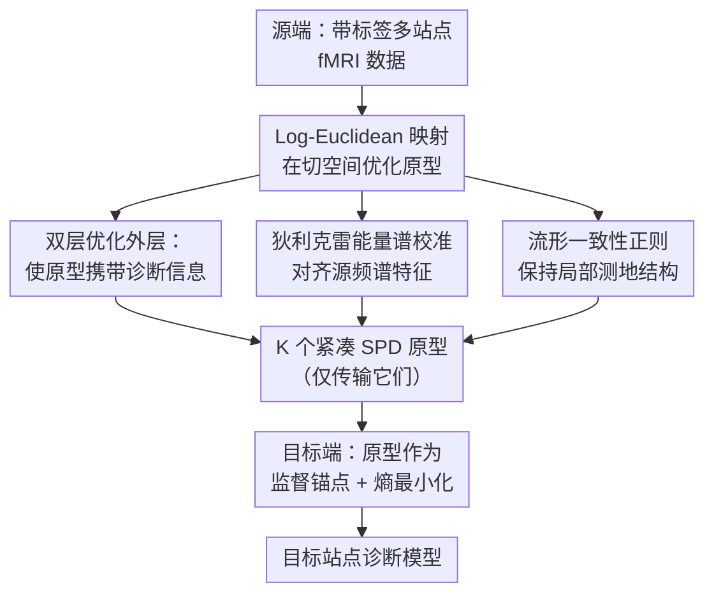

# BrainRiem: Riemannian Prototype Learning for Source-Free Cross-Site Brain Network Diagnosis

**会议**: ECCV2026  
**arXiv**: [2606.29200](https://arxiv.org/abs/2606.29200)  
**代码**: 待确认  
**领域**: 医学图像  
**关键词**: source-free domain adaptation, Riemannian manifold, prototype learning, brain network, functional MRI  

## 一句话总结
BrainRiem 提出在黎曼流形上通过双层优化学习紧凑的脑网络原型（prototype），实现无需源数据访问的跨站点脑功能连接诊断，在 ABIDE 和 REST-meta-MDD 多站点基准上大幅超越现有方法，且学得的原型具有生物可解释性。

## 研究背景与动机

多站点静息态功能磁共振成像（rs-fMRI）研究对精神疾病（如自闭症谱系障碍 ASD、重度抑郁障碍 MDD）的稳健诊断至关重要。不同站点之间的扫描仪品牌、磁场强度、采集协议差异带来了系统性域偏移，导致在同一批数据上训练好的模型迁移到新站点时性能严重退化。传统域自适应方法要求源域和目标域数据同时可见，但这种做法因 GDPR、HIPAA 等隐私法规而在多中心合作中不可行——原始脑影像数据无法直接共享。

更根本的问题在于：功能连接（FC）矩阵本质上是**对称正定（SPD）矩阵**，天然位于黎曼流形之上。在欧几里得空间中对其进行加、减、平均等操作会破坏 SPD 结构，产生所谓的"膨胀效应"（swelling effect）——行列式非物理地增大，得到的表征在生物学上丧失合理性。而现有的源数据无关域自适应（SFDA）方法几乎都在欧几里得空间中操作，忽视了底层流形几何。虽然已有基于黎曼几何的 SPD 网络（如 SPDNet），但它们通常需要源数据参与训练，无法直接在无源场景下使用。

本文的核心思路是：既然不能传原始数据，那能不能传一种**既保留 SPD 几何结构、又携带诊断信息**的紧凑表示？**核心 idea：在 Log-Euclidean 度量的框架下，通过双层优化在黎曼流形上学习少量可解释的脑网络原型（prototype），每个类别只维护 K 个 SPD 矩阵原型；传输阶段仅将原型发往目标站点而无须暴露源数据，目标站点用原型作为监督锚点配合熵最小化完成自适应。**

## 方法详解

### 整体框架

BrainRiem 的流程分为源端学习和目标端自适应两个阶段。源端阶段，用带标签的多站点源数据通过双层优化在 SPD 流形上学习 K 个紧凑原型（每个类别 K 个）；目标端阶段，只将训练好的原型（而非原始数据）传送到目标站点，结合原型的有监督损失和目标域无标签数据的熵最小化来微调本地模型。

关键设计点在于：原型参数化必须保证始终落在 SPD 流形上（通过 Log-Euclidean 映射），原型的频谱特性需通过狄利克雷能量正则项与实际脑网络对齐，原型还要保持和源域数据之间的局部黎曼几何关系。



### 关键设计

**1. Log-Euclidean 原型参数化：保证 SPD 几何有效性**

直接在 SPD 流形上优化原型非常困难，因为流形不是向量空间。BrainRiem 的做法是把原型参数化在 Log-Euclidean 切空间中：优化变量是 `Z_k`（对称矩阵，属于欧几里得空间），通过指数映射 `Exp(Z_k)` 映射回 SPD 流形得到原型 `A_k`。这样既能用标准的欧几里得优化器更新参数，又能确保每次更新后的原型始终是合法的 SPD 矩阵。配合 Log-Euclidean 距离度量流形上的距离，彻底避免欧几里得操作对 SPD 结构造成破坏——消融实验也验证了去掉 Log-Euclidean 映射会导致约 5.7% 的性能下降，是各部分中影响最大的。

**2. 双层优化：让原型真正"能教会学生"**

原型不仅要落在流形上，更要有诊断信息——一个良好的原型应该能让一个学生模型（仅用原型训练）在源数据上表现好。BrainRiem 设计了双层优化目标：内层用当前的原型训练一个学生模型 `f_θ`（最小化交叉熵 `L_inner`）；外层用源域验证集评估这个学生模型的性能 `L_val`，并反向传播梯度去更新原型参数。这个"原型 → 学生 → 评估 → 更新原型"的循环确保原型真正携带了可迁移的诊断知识。外层总损失除了 `L_val` 外还包含三个正则项，整体的原型梯度通过有限步展开做一阶近似。

**3. 狄利克雷能量谱校准：抑制扫描仪伪影**

不同扫描仪引入的高频噪声会使原型的频谱特性偏离真实的脑网络模式。BrainRiem 引入狄利克雷能量（Dirichlet Energy）作为频谱正则：`E_Dir(A) = tr(L)`，其中 L 是图拉普拉斯矩阵。该正则项迫使每个原型的狄利克雷能量接近源域数据的期望值，本质上是在约束原型不要产生非物理的高频震荡。实验显示，未经约束的目标域数据频谱向高能量偏移，而经过校准的原型频谱与源域对齐——说明该正则有效抑制了站点相关的扫描噪声，同时保留了真实脑网络的低频结构特征。

**4. 教师监督与流形一致性保持**

两个辅助损失进一步约束原型质量：一是教师监督损失 `L_teacher`，用预训练的源域教师模型 `p_t` 对原型做分类预测，确保原型的类别语义与源域判别边界一致；二是流形一致性损失 `L_manifold`，保持每个原型与其最近邻源样本之间的 Log-Euclidean 距离在优化前后尽量不变，从而保留源域的局部测地结构，防止原型因过度压缩而丢失类内多样性。

### 损失函数 / 训练策略

```
L_total = L_val + λ₁·L_manifold + λ₂·L_spectral + λ₃·L_teacher

目标端：L_target = L_CE(原型监督) - λ₄·H(目标域熵)
```

超参数 λ₁=0.1, λ₂=0.01, λ₃=1.0, λ₄=0.05，原型数量 K=4。骨干网络采用图同构网络（GIN），Adam 优化器训练 100 epoch。

## 实验关键数据

### 主实验

| 数据集 | 设置 | 本文 | 最佳基线 (StruRW) | 提升 |
|--------|------|------|-------------------|------|
| ABIDE | 单源 (5 源×4 目标平均) | ~67.8% | ~64.0% | +3.8% |
| ABIDE | LOSO (15 站点平均) | **71.4%** | 70.4% (StruRW) | +1.0% |
| REST-meta-MDD | LOSO (23 站点平均) | **70.2%** | 64.0% (StruRW) | +6.2% |
| REST-meta-MDD | S9 站点 (LOSO) | **77.8%** | 69.4% (StruRW) | +8.4% |

在单源适应设定下（表1-2），BrainRiem 在所有 20 个跨源-目标组合中持续领先，平均提升 5.8% 以上。特别是跨年龄差距大的场景（如 S25→S14）优势更加突出（66.8% vs 62.4%），说明原型学习能够捕获年龄不变性的生物标志物。

### 消融实验

| 配置 | ABIDE LOSO 平均 | REST-meta-MDD LOSO 平均 | 说明 |
|------|-----------------|------------------------|------|
| 完整模型 | 71.4% | 70.2% | -- |
| - Log-Euclidean 映射 | -- | ~-5.7% | 最大下降，黎曼几何处理最关键 |
| - 谱校准损失 L_spectral | -- | 明显下降 | 频谱对齐对抑制站点噪声重要 |
| - 流形正则 L_manifold | -- | 明显下降 | 保持局部测地结构稳定 |
| - 教师监督 L_teacher | -- | 轻微下降 | 辅助保持类别语义 |
| 随机初始化原型 | ~50% | ~50% | 接近随机，说明初始化必须带几何结构 |
| Euclidean K-means 初始化 | 低于完整 | 低于完整 | 膨胀效应导致结构失真 |

### 关键发现

- Log-Euclidean 映射是最重要的组件，去掉后性能下降最剧烈，验证了 SPD 流形结构对功能连接分析的基础性作用。
- 原型数量 K=4 最优：太少无法捕获类内多样性，太多（>8）会学到站点特有噪声。
- 隐私审计显示，BrainRiem 传输的原型将重识别率从 100%（原始 FC）降至 3.8%（接近随机猜测），成员推断攻击 AUC 从 0.99 降至 0.53，证明了原型化传输的隐私保护效果。
- 可视化分析确认：学到的 ASD 原型显示感觉运动皮层过度连接和默认模式网络（DMN）低连接，与自闭症"DMN-低连接假说""感觉主导假说"一致。

## 亮点与洞察

- **把黎曼几何和源数据无关自适应做了首次联合**：现有方法要么保几何但要源数据，要么无源但忽视流形结构。BrainRiem 通过 Log-Euclidean 参数化 + 双层优化将两者统一，填补了空白。
- **原型传输兼具隐私保护与诊断信息**：只用 K×D 个矩阵替代数千个受试者数据，在保留可迁移诊断模式的同时达到了接近随机猜测的隐私防护水平。
- **狄利克雷能量作为谱校准工具**是个灵活的设计思路——它天然和图的 smoothness 相关，把"原型不能太震荡"这个直觉量化为一个可微正则项，可迁移到其他图/流形上的原型学习任务。
- **双层优化的设计动机清晰**：原型好不好不看它自己长什么样，而是看"用原型教出来的学生能不能在真实数据上表现好"——这个 end-to-end 思维比单纯聚类的原型更接地气。

## 局限与展望

- 依赖固定的脑图谱分区（116 ROI），不同图谱可能影响原型质量，未来可引入多尺度或数据驱动分区。
- 仅处理静态功能连接，未建模动态功能连接的时变脑动力学。
- 假设源和目标类别共享，未考虑开放集场景（目标站点出现源域未见过的疾病亚型）。
- 原型数量 K 在实验中固定为 4，但最优 K 可能随站点和数据集变化，缺乏自适应机制。

## 相关工作与启发

- **vs SHOT / NRC**: 它们是欧几里得空间中的经典 SFDA 方法，对 SPD 数据会破坏几何结构；BrainRiem 在流形上操作，且用原型而非隐式特征对齐做知识迁移。
- **vs SPDNet / SPD-GNN**: 这些方法保几何但需要源数据参与训练；BrainRiem 是无源的，且在双层优化中学到的是可解释的显式原型而非隐式表示。
- **vs UDA-GCN / StruRW**: 图域自适应方法同样需要源-目标联合访问且多在欧几里得空间；BrainRiem 在无源 + 黎曼几何两方面更激进。
- **与 BrainMass / BrainGNN 的区别**: 这些方法专注脑网络分类但不处理域偏移；BrainRiem 专门针对跨站点迁移设计。

## 评分

- 新颖性: ⭐⭐⭐⭐⭐ 首次将黎曼流形约束融入源数据无关的跨站点脑网络诊断，技术路线新颖且动机扎实。
- 实验充分度: ⭐⭐⭐⭐⭐ 在两大基准（ABIDE 15 站点、REST-meta-MDD 23 站点）上做了单源和 LOSO 两种设置，还包含消融、超参分析、隐私审计、生物学解释等多个维度。
- 写作质量: ⭐⭐⭐⭐ 逻辑链条清晰，动机 → 设计 → 实验都能对上；但方法部分数学符号较多，缺少一个端到端示例让读者更快理解。
- 价值: ⭐⭐⭐⭐⭐ 既有实际应用价值（多中心合作无需共享数据即可迁移诊断模型），也有理论启发（黎曼几何 + 原型学习的组合可推广到其他 SPD 数据任务）。

<!-- RELATED:START -->

<div class="related-papers" markdown="1">

## 相关论文

- [\[CVPR 2026\] Mind the Discriminability Trap in Source-Free Cross-domain Few-shot Learning](../../CVPR2026/medical_imaging/mind_the_discriminability_trap_in_source-free_cross-domain_few-shot_learning.md)
- [\[CVPR 2026\] Reclaiming Lost Text Layers for Source-Free Cross-Domain Few-Shot Learning](../../CVPR2026/medical_imaging/reclaiming_lost_text_layers_for_source-free_cross-domain_few-shot_learning.md)
- [\[CVPR 2026\] Tell2Adapt: A Unified Framework for Source Free Unsupervised Domain Adaptation via Vision Foundation Model](../../CVPR2026/medical_imaging/tell2adapt_a_unified_framework_for_source_free_unsupervised_domain_adaptation_vi.md)
- [\[NeurIPS 2025\] GeoDynamics: A Geometric State-Space Neural Network for Understanding Brain Dynamics on Riemannian Manifolds](../../NeurIPS2025/medical_imaging/geodynamics_a_geometric_state-space_neural_network_for_understanding_brain_dynam.md)
- [\[AAAI 2026\] MPA: Multimodal Prototype Augmentation for Few-Shot Learning](../../AAAI2026/medical_imaging/mpa_multimodal_prototype_augmentation_for_few-shot_learning.md)

</div>

<!-- RELATED:END -->
