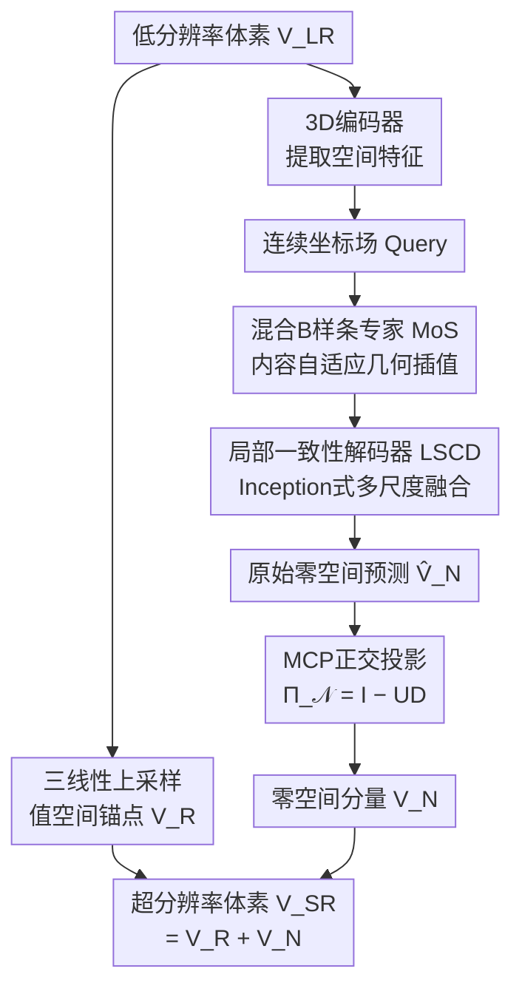

# Dual-Prior Guided Null-Space Learning with Mixture-of-Splines for Arbitrary Medical Slice Super-Resolution

**会议**: ECCV2026  
**arXiv**: [2606.26716](https://arxiv.org/abs/2606.26716)  
**代码**: [https://github.com/DeepMed-Lab-ECNU/Medical-Image-Reconstruction](https://github.com/DeepMed-Lab-ECNU/Medical-Image-Reconstruction)  
**领域**: 医学图像  
**关键词**: 医学切片超分辨率, 零空间学习, B样条专家混合, 测量一致性投影, 逆问题

## 一句话总结
本文将医学切片任意倍率超分辨率重新建模为受约束的逆问题，通过零-值空间分解实现测量一致性硬约束，并在零空间内用混合B样条专家按局部解剖特征自适应分配连续性阶数，严格保证已采集切片不变的同时生成解剖合理的插值细节。

## 研究背景与动机

CT和MRI等现代体积成像管线受限于采集时间和辐射剂量，通常产生各向异性的三维体数据——层间间距远大于面内分辨率。这种各向异性严重阻碍下游任务如三维可视化、医学分析和诊断，因此任意倍率切片超分辨率（从稀疏采样重构任意中间切片）成为必要的后处理步骤。经典线性插值虽然具有确定性的稳定性，但无法恢复高频解剖细节，结果过于平滑；近期隐式神经表示（INR）方法将体积建模为连续函数，取得了显著的视觉质量提升。

然而，医学切片任意倍率超分辨率本质上是一个病态逆问题。如果把它当作无约束的残差回归，网络会在观察到的切片区产生非零误差，甚至幻觉出解剖结构上不合理的细节——这在临床场景中是不可接受的。问题的核心矛盾在于：一方面需要保证重构结果与原始采集切片完全一致（数据保真度），另一方面又需要在未观测区域生成高保真的解剖细节。现有的INR方法缺乏显式的数据保真度约束，纯黑盒网络无法提供临床所需的数学保证。

本文的核心洞察在于：既然基追踪理论的零-值空间分解天然地将重构划分为可测量的值空间锚点和可学习的零空间成分，就可以把切片超分辨率从"无约束预测"重构为"双先验约束重构"。**核心 idea：通过零-值空间分解中的正交投影 Π_𝒩 = I − UD 作为硬约束，将网络输出强制映射到退化算子的零空间，数学上保证所有已采集切片不变；同时在该零空间内，用混合B样条专家（MoS）动态分配不同解析连续性阶数，按局部解剖特征自适应地调控几何先验刚度。**

## 方法详解

### 整体框架

DP-NSL的核心理念是将医学切片超分辨率分解为两个正交分量的和：一个确定性的值空间锚点（确保已观测切片严格不变）和一个可学习的零空间成分（容纳所有高频细节生成）。整个框架由三个核心模块级联而成：首先，退化算子的伪逆对低分辨率体素进行三线性上采样，得到不可变的值空间锚点；同时，一个3D编码器提取低分辨率空间特征；然后，特征进入零空间估计器（NSE）——先通过混合B样条专家（MoS）在连续坐标场中执行内容自适应的几何插值，再通过局部空间一致性解码器（LSCD）注入局部归纳偏置，生成原始零空间预测体素；最后，测量一致性投影（MCP）作为固定的正交投影算子，将原始预测映射到退化算子的零空间，与值空间锚点相加即得最终超分辨率结果。

由于 MCP 投影满足 𝒟Π_𝒩 = 0，任何落入投影后的分量在退化算子下都"不可见"，因此该项不会影响已采集切片，从而以严格的线性代数保证了数据保真度。

### 关键设计

**1. 测量一致性投影 MCP：用零-值空间分解实现硬保真度约束**

MCP 基于零-值空间分解将重构问题参数化为正交二分。给定退化算子 𝒟（对应CT/MRI切片采集的降采样过程），构造它的伪逆 𝒰（这里用三线性上采样）满足 𝒟𝒰 = I。对于任意超分辨率体素 V_SR，恒有正交分解 V_SR = 𝒰𝒟(V_SR) + (I − 𝒰𝒟)V_SR。第一项 𝒰(V_LR) 完全由低分辨率输入确定，是值空间中的确定性锚点；第二项由投影 Π_𝒩 = I − 𝒰𝒟 作用后得到，因为 𝒟Π_𝒩 = 0，它天然位于退化算子的零空间中，对已采集切片"不可见"。

然而第二项中的 V_SR 是未知的理想体素。DP-NSL 的做法是：用零空间估计器 NSE 输出一个原始预测 V̂_𝒩，然后通过 MCP 投影 Π_𝒩(V̂_𝒩) 强制将其限制到零空间。最终重构为 V_SR = V_R + Π_𝒩(V̂_𝒩)。这一线性代数的约束确保了无论网络预测什么，已采集切片位置的像素值严格不变——比任何软约束（如损失中的惩罚项）都更强、更有理论保证。

**2. 混合B样条专家 MoS：按局部解剖特征自适应分配连续性阶数**

生物组织具有异质平滑性：均匀器官（如肝实质）需要高阶连续性以产生平滑过渡，而结构界面（如骨-软组织边界）需要低阶连续性以保留清晰边缘。MoS 的核心思路是用可学习的 B 样条基代替盲盒 MLP 来建模连续空间插值，并且用多个不同解析阶数的样条专家混合来适配这种异质性。

具体来说，MoS 维护 K 个 B 样条上采样专家 {𝒰_{p_k}}，每个专家具有不同的解析连续性阶数 p_k（实验中取 p∈{2,3,4}）。对于查询坐标 q，通过浅层卷积从最近邻特征邻域投影出结构感知的缩放系数 c、自适应节点 k 和连续扩张尺度 s，然后每个专家用可分离张量积计算 B 样条基响应：

$$\mathcal{U}_p(\mathbf{F}_{LR};\mathbf{q}) = \mathbf{c} \odot (\mathbf{b}_x \otimes \mathbf{b}_y \otimes \mathbf{b}_z)$$

其中 b_d 是一维 B 样条基向量，由相对投影距离 Δq_d 经节点和扩张参数调制后代入阶数 p 的 B 样条基函数 β^p 计算得出。同时，一个轻量路由网络从局部插值特征预测混合权重 π(q) = Softmax(R_π(F̃_LR^q))。最终该坐标处的高分辨率特征是各专家输出的加权混合：F_SR^q = Σ_k π_k(q) · 𝒰_{p_k}(F_LR; q)。这一机制让均匀区域由低阶专家主导（平滑过渡）、边界区域由高阶专家主导（保留锐度），自发的路由分配无需显式的边界监督。

**3. 局部空间一致性解码器 LSCD：用多尺度卷积补充局部归纳偏置**

MoS 提供的是宏观上的连续性先验，但 MoS 本质上是对每个坐标独立评估连续基函数，仍然缺乏局部空间邻域的一致性约束。LSCD 的目标是在从高分辨率特征体映射到原始零空间预测的步骤中注入局部归纳偏置。

LSCD 借鉴 Inception 的分裂-变换-合并机制：将 MoS 输出的高分辨率特征沿通道维度分为 5 组——恒等分支（保留高频基信号）、标准 3D 卷积分支、以及三路逐通道（depthwise）3D 卷积分支，核大小分别递增为 3×3×3、5×5×5、7×7×7。这种设计让网络以小计算成本捕获多尺度局部空间上下文：小核关注精细邻域一致性，大核关注更大范围的上下文协调。级联多个这样的 Inception 块后，最终投影得到原始的零空间预测 V̂_𝒩。消融实验表明 LSCD 不仅提升了重建精度，而且以仅 71K 参数（相比 MLP 解码器 214K）和更低 FLOPs 实现了更优性能。

### 损失函数

模型以 L1 重建损失优化，仅监督最终超分辨率体素 V_SR 与真实体素 V_HR 之间的差异（不单独监督中间层或加额外正则项）。优化器为 Adam（β1=0.9, β2=0.999），初始学习率 1e-4，每 200 epoch 减半，总共 1000 epoch，batch size 为 8。

## 实验关键数据

### 主实验

| 数据集 | 倍率 | 指标 | DP-NSL | 之前SOTA | 提升 |
|--------|------|------|--------|----------|------|
| Colon (CT) | ×2 | PSNR | 42.55 | 41.84 (EDSR3D) | +0.71 dB |
| Colon (CT) | ×3 | PSNR | 38.43 | 37.78 (SAINR) | +0.65 dB |
| Colon (CT) | ×4 | PSNR | 35.95 | 35.37 (EDSR3D) | +0.58 dB |
| Liver (CT) | ×2 | PSNR | 42.49 | 41.42 (HIIF) | +1.07 dB |
| IXI (MRI) | ×4 | PSNR | 41.92 | 41.41 (DC2SR) | +0.51 dB |
| IXI (MRI) | ×5 | PSNR | 40.17 | 39.55 (SAINR) | +0.62 dB |

### 消融实验

| 配置 | ×2 PSNR | ×4 PSNR | 说明 |
|------|---------|---------|------|
| Baseline (无MCP/无MoS/无LSCD) | 41.82 | 35.30 | 纯EDSR+三线性上采样 |
| +MCP | 42.13 (+0.31) | 35.52 (+0.22) | 仅加零空间约束就有效 |
| +MoS | 42.45 (+0.63) | 35.82 (+0.52) | 几何先验提升最大 |
| +MCP+MoS | 42.52 (+0.70) | 35.89 (+0.59) | 两先验互补 |
| 完整 DP-NSL | 42.54 (+0.72) | 35.93 (+0.63) | 加LSCD后进一步提升 |

### 关键发现

- MoS 样条阶数消融显示：单阶数中 p=3 最优，但多阶混合（p∈{2,3,4}）在所有场景下显著优于任何单阶数配置，说明异质解剖区域确实需要空间变化的连续性先验。
- 路由权重可视化证实：低阶专家在均匀软组织内部激活更强，高阶专家集中在精细血管分支和器官边界——这种内容感知的分配完全是数据驱动学习得出的，无需显式边界标注。
- MCP 的切片级 MAE 验证完美证明了零误差模式：在原始采集切片位置（s=0, R, 2R, ...）MAE 精确归零，而所有对比方法在这些位置都有不可忽略的误差——这意味着它们都在不同程度上改变了原始临床数据。
- 在未见过的外推倍率（×5, ×6, ×7）上，DP-NSL 的优势反而更加明显（在 IXI 上 ×5 提升 0.62 dB），得益于 B 样条基的固有连续性不依赖采样密度，能在未见分辨率下保持原则性的外推。

## 亮点与洞察

- **零空间正交分解是最优的数据保真度策略**：MCP 以线性代数的方式把"不能改已采集切片"的要求编码为硬约束而非损失项，不论网络输出什么都不会违反——这比任何基于损失的软约束更干净、更强、且有理论保证，是该任务的最优问题重参数化。
- **用 B 样条基函数具象化几何先验**：大部分方法把连续坐标映射交给黑盒 MLP，DP-NSL 则用可解析的 B 样条基替代，让插值行为的"连续性阶数"成为可学习、可路由的参数——这种"把学习对象从隐式权重复迁移到显式先验参数"的设计思路值得在其他结构感知任务中借鉴。
- **路由分配的语义自发性**：MoS 的路由网络在没有解剖边界监督的情况下，学出了与 CT 解剖结构高度一致的空间分配（低阶 = 软组织内部，高阶 = 边界/血管），说明几何连续性先验的阶数是与局部图像结构紧耦合的合理设计维度。
- **可迁移的设备-无关设计**：MCP 只需知晓退化算子就可实现硬约束，不依赖任何具体的退化模型假设，天然适用于其他医学图像逆问题（如压缩感知 MRI、低剂量 CT 去噪）。

## 局限与展望

- 当前的 MCP 投影假设退化算子 𝒟 是已知且固定的（各向同性降采样），但实际临床中的退化模式可能更复杂（如非均匀采样、运动伪影混合），作者也指出将 MCP 扩展到更真实退化场景是未来方向。
- MoS 的三个 B 样条专家（p=2,3,4）是手工设定的，阶数数量和取值缺少自动化搜索——是否有更优阶数组合（如分数阶）或更大的专家数量能进一步提升性能尚未探讨。
- 虽然 L1 loss 优化表现良好，但在零空间的合成区域缺乏解剖合理性指导——可以尝试加入对抗损失或基于解剖分割的先验来进一步提高结构保真度。
- 计算成本方面，DP-NSL 比简单模型（如 ArSSR、CycleINR）略高（约 1.1-1.3× FLOPs），主要来自 MoS 的多专家评估和 LSCD 的多分支处理，但在可接受范围内。

## 相关工作与启发

- **vs ArSSR / SAINR / CycleINR / DC2SR（医学任意倍率 INRs）**: 这些方法将体积建模为连续函数，但都用坐标间独立的 MLP 解码且缺乏硬保真度约束。DP-NSL 的差异在于：① 用零-值空间分解提供了严格的测量一致性保证（非软约束）；② 用 B 样条专家混合代替 MLP，使插值的连续性成为可学习的显式先验；③ 用卷积解码器注入局部一致性（弥补点式 MLP 的不足）。
- **vs DDNM（零样本逆问题中的零-值空间分解）**: DDNM 用预训练扩散模型精炼零空间细节并迭代投影。DP-NSL 将零-值空间分解首次引入医学任意倍率超分辨率，并用可学习的 MoS 模块（而非扩散模型）来生成零空间内容，更适合端到端训练场景。
- **vs BTC（B样条系数预测用于自然图像超分）**: BTC 从编码特征预测 B 样条系数、节点和扩张，本质上是单阶数 B 样条插值。DP-NSL 的 MoS 扩展为多阶数专家混合，让连续性阶数本身成为可路由的空间自适应变量——这在解剖异质性显著的医学场景中尤为关键。

## 评分
- 新颖性: ⭐⭐⭐⭐⭐ 将零-值空间分解引入医学切片超分并用混合B样条专家具象化几何先验，问题重参数化思路巧妙，理论完备。
- 实验充分度: ⭐⭐⭐⭐⭐ 包含 3 个 CT + 1 个 MRI 数据集、同倍率外倍率、消融/路由可视化/真实数据验证/下游分割任务，附录还有计算量和收敛分析。
- 写作质量: ⭐⭐⭐⭐⭐ 动机清晰、方法推导严谨、可视化有说服力（特别是切片级MAE验证完美归零的曲线）。
- 价值: ⭐⭐⭐⭐⭐ 临床场景中已采集切片不可更改是刚需，MCP 提供了当前最优方案，MoS 组件可脱离本框架独立使用。

<!-- RELATED:START -->

## 相关论文

- [\[CVPR 2026\] Adaptive Anisotropic Gaussian Splatting for Multi-contrast MRI Arbitrary-Scale Super-Resolution with Anatomy Guidance](../../CVPR2026/medical_imaging/adaptive_anisotropic_gaussian_splatting_for_multi-contrast_mri_arbitrary-scale_s.md)
- [\[AAAI 2026\] CD-DPE: Dual-Prompt Expert Network Based on Convolutional Dictionary Feature Decoupling for Multi-Contrast MRI Super-Resolution](../../AAAI2026/medical_imaging/cd-dpe_dual-prompt_expert_network_based_on_convolutional_dictionary_feature_deco.md)
- [\[AAAI 2026\] PINGS-X: Physics-Informed Normalized Gaussian Splatting with Axes Alignment for Efficient Super-Resolution of 4D Flow MRI](../../AAAI2026/medical_imaging/pings-x_physics-informed_normalized_gaussian_splatting_with_axes_alignment_for_e.md)
- [\[ECCV 2026\] BioMedVR: Confusion-Aware Mixture-of-Prompt Experts for Biomedical Visual Reprogramming](biomedvr_confusion-aware_mixture-of-prompt_experts_for_biomedical_visual_reprogr.md)
- [\[ECCV 2026\] 3D Field of Junctions: A Noise-Robust, Training-Free Structural Prior for Volumetric Inverse Problems](3d_field_of_junctions_a_noise-robust_training-free_structural_prior_for_volumetr.md)

<!-- RELATED:END -->
