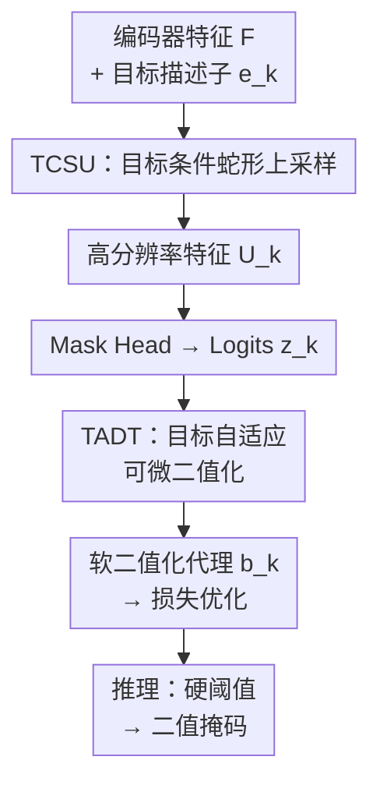

# From Reconstruction to Decision: A Post-Encoder Plug-in Adapter for Curvilinear Segmentation

**会议**: ECCV 2026  
**arXiv**: [2606.23486](https://arxiv.org/abs/2606.23486)  
**代码**: 待确认  
**领域**: 医学图像  
**关键词**: 曲线结构分割, 上采样, 可微二值化, 后编码器适配器, 拓扑保持

## 一句话总结

本文提出 PEPA，一个轻量级后编码器即插即用适配器，通过目标条件蛇形上采样（TCSU）和目标自适应可微二值化（TADT）两个模块，在冻结基础模型编码器的条件下显著提升血管、裂缝等曲线结构分割的拓扑连续性，仅增加 0.26M 参数即可在五个医学与工业基准上取得平均 +2.6% IoU 和 +2.8% clDice 的提升。

## 研究背景与动机

曲线结构分割——包括血管、神经元分支、路面裂缝等——是计算机视觉中一个基础但极具挑战的问题。不同于紧凑的宏观物体，曲线结构具有极端空间稀疏性和拓扑脆弱性：它们的轮廓极细、局部对比度剧烈衰减，使得其拓扑完整性高度依赖高频细节的重建精度和最终二值化的决策边界。在这种结构上，即使是微小的像素级分割错误也可能导致严重的拓扑断裂，从而影响下游分析的有效性。

近年来，以 SAM 系列和 DINO 系列为代表的视觉基础模型为密集预测任务提供了强大的语义表示，但其编码器通常通过 16 倍甚至更大的下采样实现语义抽象——这一过程恰恰抹去了描绘纤细拓扑所需的精细空间粒度。由于全量微调巨大编码器的计算开销难以承受，且可能破坏其通用表示能力，结构保持通常被委托给后编码器阶段。这引出一个实际的问题：如何在不修改基础编码器的前提下，设计一个轻量级的后编码器插件，能够改善脆弱曲线结构的重建质量和最终决策？

深入分析后，本文识别出后编码器阶段两个反复出现的关键瓶颈。其一是**重建瓶颈**：解码器通常依赖双线性插值等各向同性的、与目标无关的上采样操作，这种被动的插值会模糊细响应并导致拓扑断裂；即使是最新的可学习上采样器——如 AnyUp 和 DySample——也不受曲线形态显式约束，粗结构的强梯度可能主导重建过程而使纤细分支依然断裂。其二是**决策瓶颈**：将连续概率图转化为二值掩码时，全局固定阈值（如 0.5）在高对比度目标和低对比度终点之间无法兼顾，高阈值会抑制末端分支，低阈值则引入噪声假阳性；虽然可微二值化已在前景任务中取得成功，但将其直接应用于密集多目标的曲线分割时，网络往往通过联合偏移 logit 和阈值来绕过真正的决策边界优化，退化为"平凡偏置补偿"。本文的**核心 idea 是：在后编码器阶段解耦重构与决策两个瓶颈，用目标条件蛇形上采样恢复精细拓扑、用目标自适应可微二值化校准决策边界，并引入显式防退化机制确保阈值学习不坍缩。**

## 方法详解

### 整体框架

PEPA 是一个轻量级后编码器即插即用适配器，可接入两类管线：基于 prompt 的模型（如 SAM 系列）以 mask token 作为目标描述子，替换解码器标准上采样路径；传统密集预测模型则以可学习的类别嵌入为目标描述子，替换各级上采样层。

PEPA 由两个核心模块构成：TCSU（目标条件蛇形上采样）处理重建瓶颈，TADT（目标自适应可微二值化）处理决策瓶颈。输入是编码器特征 $\mathbf{F}\in\mathbb{R}^{B\times C\times H\times W}$ 和目标描述子 $\mathbf{e}_k$（prompt 中的目标查询），前者经 TCSU 上采样为高分辨率基底 $\mathbf{U}_k$，再经 mask 头输出 logit 图 $\mathbf{z}_k$；同时 TADT 从 $\mathbf{e}_k$ 预测目标自适应阈值 $t_k$，对 $\mathbf{z}_k$ 进行可微二值化。训练时所有损失在软二值化代理上计算，推理时直接用硬阈值 binarization。

### 关键设计

**1. TCSU：目标条件蛇形上采样**

曲线结构的拓扑连续性要求上采样操作能够沿其蜿蜒路径主动追踪形态，而非被动均匀插值。TCSU 的核心机制是：为每个低分辨率格点生成沿连续蛇形邻域的亚像素采样点，并使蛇链的长度和弯曲方向受目标描述子 $\mathbf{e}_k$ 的调制，从而让高分辨率重建"跟随"所查询的结构，降低来自干扰物梯度的污染。

具体而言，对于 2 倍上采样，每个低分辨率格点引入四个亚像素中心。TCSU 构建 X 主方向（沿 x 轴延展、y 方向弯曲）和 Y 主方向两条蛇形分支。第一步预测动态蛇链长度 $L_k \in \{1,3,5,\dots\}$，由特征证据和目标描述子共同调制，并通过直通估计器保证对称奇数长度可微。第二步生成沿蛇链的增量偏移：采用"共享+精炼"架构——一个共享基底分支负责全局偏移基础，一个目标精炼分支用 $\eta_k = \sigma(\text{MLP}(\mathbf{e}_k))$ 控制加入程度。偏移量经过平滑长度感知掩码 $\omega(i;L_k)$ 软截断后，从中心向外迭代累积，保持曲线对象的邻接性先验。第三步用 1D 深度可分离卷积沿有序链维度聚合采样的特征，与稳定的双线性 shortcut 拼接融合。

与蛇形卷积的区别：蛇形卷积是目标无关的特征提取算子，而 TCSU 是显式以目标描述子调制动态长度和形变的重建算子，对不同查询可以产生不同的结构恢复行为。

**2. TADT：目标自适应可微二值化与防退化机制**

全局固定阈值无法兼顾粗血管的噪声抑制和细末梢的连通性。TADT 为每个目标描述子 $\mathbf{e}_k$ 预测一个 bounded 阈值 $t_k \in [t_{\min}, t_{\max}]$，替换硬截断为可微软代理 $\mathbf{b}_k = \sigma(\alpha(\tilde{\mathbf{z}}_k - t_k))$。

但上述阈值学习极易退化：网络通过同时偏移 logit 均值和阈值来"作弊"，在不真正锐化决策边界的情况下降低损失。TADT 通过三重机制明确防止这种退化：(i) **Logit 居中**——从 logit 图减去空间均值 $\tilde{\mathbf{z}}_k = \mathbf{z}_k - \mu(\mathbf{z}_k)$，消除全局偏置，迫使阈值只关注相对置信度；(ii) **拓扑感知监督直接作用于代理 $b_k$**——将 clDice 等拓扑损失直接在可微代理上计算，而不是在固定 0.5 阈值化的 logit 上计算，令阈值本身的优化与拓扑连通性直接挂钩；(iii) **局部扰动一致性**——对阈值做 $\pm\Delta$ 的微小扰动，生成两个扰动代理 $b_k^{\pm}$，用软 Dice 一致性损失 $L_{\text{consist}}$ 约束二者的预测一致，防止决策边界对局部噪声过于敏感。三管齐下后，TADT 才能稳定地学会一个既适应当前目标又不会退化的决策边界。

**3. PEPA 即插即用接入设计**

PEPA 的设计哲学是模块化与架构无关性：它只要求下游管线提供可访问的解码器/头特征，以及某种形式的目标描述子（prompt query / 类别嵌入 / class token）。在 prompt 模型中，TCSU 直接替换解码器的上采样子层，TADT 并联在 mask 头之后；在密集预测模型中，TCSU 替换各级跳跃连接的上采样操作。由于基础编码器完全冻结，PEPA 可以像积木一样插拔，无需改变骨干网络结构。实验中 PEPA 的参数量仅 0.26M，推理时从 99ms 增加到 103ms（H200, 1024×1024 输入），几乎不影响端到端吞吐。

### 损失函数 / 训练策略

PEPA 采用组合损失 $L_{\text{total}} = \lambda_{\text{bce}} L_{\text{bce}} + \lambda_{\text{dice}} L_{\text{dice}} + \lambda_{\text{cl}}(1-\text{clDice}) + \lambda_{\text{consist}} L_{\text{consist}}$，权重配比为（1.0, 1.0, 1.0, 0.2）。所有损失均在可微二值化代理 $b_k$ 上计算。优化器为 AdamW（lr=1e-4, weight decay=1e-4），余弦退火调度，100 epoch，batch size=8，单卡 H200。对 prompt 模型，训练时从边界框/正点/噪声掩码三种 prompt 策略中随机选择，测试时统一使用 GT 边界框。

## 实验关键数据

### 主实验

PEPA 在六个视觉基础模型（SAM/SAM-HQ/MedSAM/EfficientSAM/DINOv3+Mask2Former/DINOv3+MaskDINO）和五个基准（XCAD、CHUAC、DRIVE、CHASEDB1、Crack500）上取得一致提升。所有基线解码器均已全量微调（冻结编码器），PEPA 在此基础上附加：

| 平均指标 | SAM 基线 | +PEPA | 提升 |
|---------|----------|-------|------|
| IoU | 66.9 | 69.9 | +2.9 |
| clDice | 79.9 | 83.1 | +3.2 |
| SAM-HQ IoU | 67.0 | 69.7 | +2.7 |
| SAM-HQ clDice | 79.8 | 83.1 | +3.4 |

六个 VFM 平均提升：IoU +2.6%，clDice +2.8%。clDice 提升持续高于 IoU，说明 PEPA 确实改善了拓扑连通性而非仅提升区域重叠。在 CHASEDB1 等细血管数据集上 clDice 提升达 +5.6%~+6.0%，效果最为显著。

### 与领域专有模型对比

PEPA SAM 与全参数微调的领域专有模型（TVS-Net、Mid-Net、HM-Mamba、GCC-UNet、FPBE SAM 等）对比，尽管编码器完全冻结，仍在所有基准上取得最优。例如 XCAD 数据集上 clDice 达 85.3%，远超 TVS-Net（83.2%）和领域最强适配器 FPBE SAM（83.1%）。

### 消融实验

| 配置 | XCAD IoU | XCAD clDice | Crack500 IoU | Crack500 clDice |
|------|---------|-------------|-------------|----------------|
| SAM 基线 | 68.4 | 81.5 | 63.4 | 77.2 |
| + TCSU | 71.0 | 83.5 | 64.2 | 78.5 |
| + TADT | 70.2 | 84.0 | 63.9 | 78.7 |
| + TCSU+TADT | 73.1 | 85.3 | 64.8 | 79.6 |

值得注意的是，单加 TADT 比单加 TCSU 在 clDice 上提升更大，这是因为 SAM 的默认全局阈值预训练于自然宏观物体，对脆弱微结构严重失校准；两者组合严格互补，说明重建和决策两个瓶颈必须解耦后联合解决。

### TADT 防退化消融

| 变体 | XCAD IoU | XCAD clDice |
|------|---------|-------------|
| Full TADT | 73.1 | 85.3 |
| w/o logit centering | 72.8 | 84.9 |
| w/o consistency loss | 72.7 | 84.8 |
| w/o clDice-on-surrogate | 71.2 | 82.8 |
| naïve learnable threshold | 70.9 | 83.4 |

朴素可学习阈值（无任何防退化机制）退化最严重；移除 clDice-on-surrogate 导致最大幅下降，说明阈值必须通过拓扑损失显式引导。

### 关键发现

- **clDice 增益 > IoU 增益**：PEPA 的本质贡献是拓扑保持而非像素重叠，这是设计预期而非副产品。在细结构数据集上尤为明显。
- **TADT 对 prompt 模型提升大于常规模型**：因为 SAM 等预训练模型默认 0.5 阈值对微曲线校准极差，TADT 的校准潜力更大。
- **TCSU 的蛇链长度 $K$ 是与分辨率相关的**：高分辨率下更大 $K$（如 9）更优，低分辨率下饱和更快，说明长链更适用于精细结构重建。
- **PEPA 参数量仅 0.26M**，同等预算下与 LoRA 编码器侧微调对比，PEPA 在拓扑指标上更优，支持了后编码器侧改进的优势。

## 亮点与洞察

- **解耦重建与决策两大瓶颈**：本文的不是提出一个通用的、面面俱到的改进，而是精准定位了后编码器阶段两个独立且反复出现的瓶颈，分别针对性地设计模块——这种"先诊断、再开药"的研究范式值得借鉴。
- **TCSU 用蛇形采样实现"主动追踪"**：将上采样从被动插值转变为沿结构的主动几何变形，且用目标描述子控制动态长度和弯曲度，让同一模型对不同结构有不同重建行为。
- **TADT 三重防退化机制经典**：logit 居中、拓扑监督直接作用于代理、局部扰动一致性——三者组合的系统性防退化设计，可以迁移到任何需要可微二值化的场景。
- **clDice-on-surrogate 的巧妙设计**：将拓扑损失直接施加在可微代理而非固定阈值后的 logit 上，让阈值本身"感受"到拓扑连通性的梯度，是本文最关键的技术选择之一。

## 局限与展望

- **仅考虑 2D 曲线分割**：3D 血管/裂缝分割中的体素级拓扑保持尚未涉及，蛇形采样扩展到 3D 空间是一项值得探索的方向。
- **阈值范围的超参敏感性**：$[t_{\min}, t_{\max}]$ 固定为 $[-5, 5]$，虽然经过一定分析，但在不同模态/数据集间是否需要调整作者未给出明确指导。
- **蛇链长度 $K$ 需要手动调节**：作者展示了 $K=9$ 在 1024×1024 下的最佳性，但在不同分辨率或复杂拓扑场景下 $K$ 的选择缺乏自适应机制。
- **局限性声明**：本文未在影像报告、真实临床工作流中验证端到端效果，仅停留在图像分割层面的离线评测。

## 相关工作与启发

- **vs 传统上采样（blinear / CARAFE / DySample / AnyUp）**：这些方法都是各向同性的、与目标无关的插值，而 TCSU 显式以目标描述子调制上采样行为和形态约束，使重建过程沿目标拓扑展开。
- **vs 蛇形卷积**：蛇形卷积是特征提取算子、不依赖目标查询；TCSU 是重建算子，受目标描述子调控链长和弯曲度，二者定位不同。
- **vs DBNet 等可微二值化**：DBNet 未考虑阈值学习的退化风险——联合学习 logit 和阈值时网络可能作弊；TADT 的 logit 居中 + 拓扑代理监督 + 局部一致性三者系统性地解决了这个问题。
- **vs LoRA 等编码器侧微调**：在同等 0.26M 参数下，PEPA 在拓扑指标上显著优于 LoRA，说明后编码器侧的结构定制比编码器侧的参数效率微调对曲线分割更有效。

## 评分

- 新颖性: ⭐⭐⭐⭐⭐ 将重建瓶颈和决策瓶颈解耦定位并分别设计针对性模块，TCSU 的蛇形条件上采样和 TADT 的三重防退化机制都很有洞察力。
- 实验充分度: ⭐⭐⭐⭐⭐ 六个 VFM + 五个基准 + 与众多领域专有模型对比 + 详细消融（核心组件、防退化三组件逐一验证）+ 效率分析，令人信服。
- 写作质量: ⭐⭐⭐⭐⭐ 动机层层递进、方法图文并茂、实验逻辑清晰，顶会水平。
- 价值: ⭐⭐⭐⭐⭐ 一个即插即用且验证充分的轻量级后编码器插件，对实际曲线分割应用（医学影像、工业检测等）有直接且显著的改进意义。

<!-- RELATED:START -->

## 相关论文

- [\[ICML 2026\] Plug-and-Play Diffusion Meets ADMM: Dual-Variable Coupling for Robust Medical Image Reconstruction](../../ICML2026/medical_imaging/plug-and-play_diffusion_meets_admm_dual-variable_coupling_for_robust_medical_ima.md)
- [\[CVPR 2026\] Uni-Encoder Meets Multi-Encoders: Representation Before Fusion for Brain Tumor Segmentation with Missing Modalities](../../CVPR2026/medical_imaging/uni-encoder_meets_multi-encoders_representation_before_fusion_for_brain_tumor_se.md)
- [\[CVPR 2026\] Post-training Feature Pruning for Fundus Images Classification](../../CVPR2026/medical_imaging/post-training_feature_pruning_for_fundus_images_classification.md)
- [\[ICLR 2026\] CUPID: A Plug-in Framework for Joint Aleatoric and Epistemic Uncertainty Estimation with a Single Model](../../ICLR2026/medical_imaging/cupid_a_plug-in_framework_for_joint_aleatoric_and_epistemic_uncertainty_estimati.md)
- [\[ICLR 2026\] Dual-Kernel Adapter: Expanding Spatial Horizons for Data-Constrained Medical Image Analysis](../../ICLR2026/medical_imaging/dual-kernel_adapter_expanding_spatial_horizons_for_data-constrained_medical_imag.md)

<!-- RELATED:END -->
