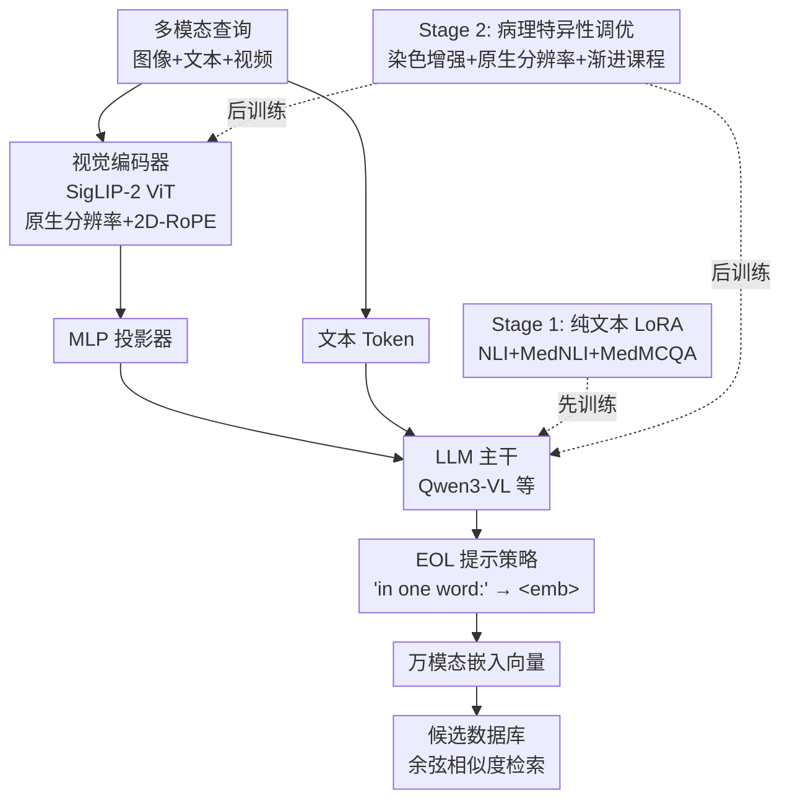

# Histopathology Multi-modal Embedding for Pathology Composed Retrieval

**会议**: ECCV 2026  
**arXiv**: [2502.07221](https://arxiv.org/abs/2502.07221)  
**论文**: [Project Page](https://qfchou.github.io/HOMIE_page/)  
**代码**: 无  
**领域**: 医学图像  
**关键词**: 病理组学检索, 多模态嵌入, MLLM适配, 组合检索, 对比学习

## 一句话总结
HOMIE 提出一个模型无关的两阶段适配框架，将任意生成式 MLLM 转化为病理检索专家：第一阶段用纯文本 LoRA 训练让 LLM 学会判别式度量空间（解决任务错配），第二阶段通过原生分辨率处理、染色增强和渐进知识课程注入病理形态学先验（解决领域错配），在作者新提出的 PCR 组合检索基准上，2B 参数版本即大幅超越 7B 专用病理 MLLM 和双编码器模型。

## 研究背景与动机
病理 AI 在临床落地面临信任壁垒：传统监督模型是"黑箱"缺乏可解释性，生成式大模型存在临床不可接受的幻觉风险。检索式范式天然适合临床——系统根据病理医生的查询从数据库中检索相似病例作为"计算会诊"参考，医生基于证据独立做出判断，保留临床自主权。

现有病理多模态模型（如 CONCH、MUSK、PathoCLIP 等）全部基于双编码器架构，只能做简单的图像到文本或文本到图像检索。然而，真实临床查询本质上是**组合式和交织式**的——例如"这张 H&E 切片 + '找到放大后的非典型区域'"——双编码器缺乏深度融合交织多模态输入的机制，存在**架构错配**（Architectural Mismatch）。强行用向量加法或倒数秩融合（RRF）做组合检索时，这些模型退化为浅层视觉匹配，直接忽略文本指令、错误地检索原图本身。

直觉上，MLLM 的深度融合架构天然能处理交织输入。但直接部署面临两个新错配：(1) **任务错配**（Task Mismatch）：MLLM 的隐空间为生成优化，缺乏检索所需的判别式度量结构，即使是 SOTA 病理 MLLM（PathoR1-7B）在组合检索上 Recall@1 仅 14.7%；(2) **领域错配**（Domain Mismatch）：通用 MLLM 缺少解读病理学细微细胞形态和染色伪影的能力。

为此，本文形式化定义了**病理组合检索**（Pathology Composed Retrieval, PCR）任务，并提出了 HOMIE 框架。核心 idea：通过一个模型无关的系统性适配流程，分两阶段先后解决任务错配和领域错配，将任意生成式 MLLM 转化为能生成统一多模态嵌入的病理检索专家。

## 方法详解

### 整体框架
HOMIE 的目标是：给定一个由病理图像、文本、视频任意交织组成的查询，输出一个统一的稠密嵌入向量，用于在候选数据库中进行相似度检索。框架包含三个核心组件：视觉编码器 $f_v$（SigLIP-2 ViT）、MLP 投影器 $f_p$、以及 LLM $f_\varphi$。视觉输入经编码和投影后得到视觉 token 序列 $h_v = f_p(f_v(V))$，与文本 token $h_t$ 一同送入 LLM。最终通过 EOL（Explicit One-word Limitation）提示策略——在输入末尾追加"Summarize above ... in one word:"——强制 LLM 将全部多模态上下文压缩到 `<emb>` token 的最后一层隐状态中，作为统一的万模态嵌入 $E = f_\varphi(h_v, h_t)$。

训练分两阶段串行推进，先解决任务错配，再解决领域错配。

### 关键设计

**1. EOL 提示策略：从因果 LLM 中提取稠密嵌入**

LLM 使用因果注意力，不同于 BERT 的 `[CLS]` token 可用双向注意力天然凝聚语义信息。常规池化（如对所有 token 取均值）在因果 LLM 中效果不佳，因为早期 token 缺乏未来上下文，会稀释全局表示。EOL 策略通过在 prompt 末尾显式追加"in one word:"，强制 LLM 将全部前置多模态上下文压缩到 `<emb>` token 的隐状态中。对于纯图像输入使用 `"<image> Summarize above image in one word: <emb>"`，对于图像+文本交织输入使用 `"<image1><text1>... Summarize above image and sentence in one word: <emb>"`，文本和视频同理。消融表明，去掉 EOL 约束后仍可取得有竞争力的结果（说明训练已使模型学会在末尾 token 凝聚语义），但保留"in one word"这个语义瓶颈时效果最优（Recall@1 79.8% vs 78.0% 无 prompt），因为它进一步抑制了残差生成噪声。

**2. 两阶段适配：先后解决任务错配和领域错配**

这是 HOMIE 最核心的设计决策——不把文本适配和病理适配混在一起训练，而是严格串行。**Stage 1（纯文本检索适配）**：冻结视觉编码器和投影器，仅对 LLM 施加 LoRA（rank=64），在病理相关文本对（NLI + MedNLI + 从 MedMCQA 筛选的 15k 病理 QA 对）上训练。这一阶段强制 LLM 学会将语义相似文本映射到邻近的嵌入空间，建立起检索所需的判别式度量结构，此时模型还从未见过图像。**Stage 2（病理特异性课程调优）**：从 Stage 1 检查点初始化，解冻视觉编码器和投影器，在病理图像-文本对上进行全模型微调（LoRA rank 升至 128）。这种顺序设计的关键在于：先让 LLM 学会"什么是好的检索嵌入"，再注入病理领域知识，避免领域数据干扰检索空间的学习。

**3. 病理特异性调优三件套：原生分辨率 + 染色增强 + 渐进课程**

Stage 2 不只是简单的多模态微调，而是嵌入了三项专门针对病理图像特性的设计。(1) **原生分辨率处理**：不同于双编码器将所有图像强制缩放到固定低分辨率（如 336x336），HOMIE 使用 SigLIP-2 ViT 将图像尺寸动态调整为 base patch size（14x14）的倍数，并用 2D-RoPE 保持位置信息，确保模型能分析多尺度的细粒度形态学细节。消融中强制使用标准低分辨率输入导致 Bookset 上 Image-to-Text 检索骤降 8.9%。(2) **染色增强与归一化**：病理图像面临不同实验室染色方案导致的显著颜色变异，引入 RandStainNA 染色增强迫使模型学习染色不变的形态学表征。(3) **渐进知识课程**：不使用简单的数据集混合，而是先让模型在 PathGen-1.6M（强调组织-细胞形态和空间组织）上建立基础形态学先验，再在 PathCap 和过滤后的 Quilt-1M 上学习如何将形态学与包含诊断信息的高级多模态知识关联。消融中去掉渐进课程是掉点最大的单项操作（Video-to-Text 从 30.7% 降至 18.4%，Image-Text to Image 从 52.7% 降至 46.7%）。

**4. 数据自举筛选：净化网络爬取数据**

Quilt-1M 数据集主要来自社交媒体，包含大量噪声图像-文本对，直接混合训练会损害性能。HOMIE 采用自举（bootstrap）策略：首先在未过滤的 Quilt-1M 上训练一个基模型，然后用该模型对所有图像-文本对计算相似度分数，丢弃低于阈值 $\lambda=0.1$ 的对，最终保留约 50 万高质量对。消融表明去掉数据过滤后，Video-to-Text 从 30.7% 降至 23.4%，验证了高质量对齐数据对构建良好嵌入空间的重要性。

### 一个完整示例：图像+文本到图像检索

以 Bookset 上的 Image-Text to Image 检索 $(q^i, q^t) \to c^i$ 为例走通整套流程。查询由一张源病理图像和一段关系性文本组成（如直肠腺癌的 H&E 切片 + "找到放大后的非典型区域视图"），目标是检索正确的目标图像。

1. **视觉编码**：源图像以原生分辨率（如 1148px）送入 SigLIP-2 ViT，动态调整为 14 的倍数，经 2D-RoPE 编码位置信息，输出视觉 token 序列。
2. **文本编码**：关系性文本（"找到放大后的非典型区域视图"）被 tokenize 为文本 token。
3. **LLM 融合**：视觉 token 和文本 token 交织送入 LLM，经过 LoRA 适配后的因果注意力层进行深度融合——此时 LLM 已在 Stage 1 学会将语义相似内容映射到接近位置，在 Stage 2 学会了病理形态学先验。
4. **EOL 压缩**：Prompt 追加 "Summarize above image and sentence in one word: <emb>"，取 `<emb>` token 前的最后一层隐状态作为统一嵌入。
5. **检索**：计算该嵌入与候选数据库中所有目标图像嵌入的余弦相似度，排序返回 Top-K。

对比双编码器的 CONCH：它只能对源图像和目标候选图像各自独立编码、对文本独立编码，然后做向量加法或 RRF 融合。结果 CONCH 忽略文本指令、退化视觉匹配、直接返回源图像本身（Recall@1 43.7%），而 HOMIE 正确执行了空间-语义组合推理（Recall@1 52.7%，8B 版本）。

### 损失函数 / 训练策略

两阶段均使用 InfoNCE 对比损失。给定 batch size $B$，查询 $q_i$ 的嵌入应靠近正样本 $c_i$ 的嵌入、远离其他负样本：

$$\mathcal{L} = -\frac{1}{B}\sum_{i=1}^{B}\log\left[\frac{\exp\left[\cos(q_i, c_i) / \tau\right]}{\sum_{j=1}^{B}\exp\left[\cos(q_i, c_j) / \tau\right]}\right]$$

训练配置：8 张 H100 GPU，BF16 精度，FlashAttention-2，DeepSpeed ZeRO-2。Stage 1：2 epochs，global batch size 576，学习率 $2\times10^{-4}$，cosine decay，0.03 warmup，LoRA rank=64/$\alpha$=128，冻结视觉编码器和投影器。Stage 2：从 Stage 1 初始化，2 epochs，global batch size 384，学习率 $1\times10^{-4}$，LoRA 升至 rank=128/$\alpha$=256，解冻视觉编码器和投影器以捕获领域特异性特征。

## 实验关键数据

### 主实验：零样本组合检索

HOMIE 在 PCR Benchmark 的五个组合检索任务上全面碾压所有基线。2B 版本即达到 75.2% Recall@1（Multi-Image to Text），比最佳双编码器 Patho-CLIP-L（44.3%）高出 30+ 个百分点，比最佳病理 MLLM PathoR1-7B（14.7%）高出 60+ 个百分点。

| 模型 | 参数量 | Multi-Img→Text (Bookset) R@1 | Img+Text→Img (Bookset) R@1 | Img+Text→Text (Quilt-VQA) R@1 | Video→Text (Videopath) R@1 |
|------|--------|------|------|------|------|
| Patho-CLIP-L (Add) | ~300M | 44.3 | 40.7 | 22.1 | - |
| MUSK (Add) | ~1B | 43.0 | 47.9 | 34.1 | - |
| CONCH (Add) | ~1B | 41.8 | 43.7 | 9.7 | - |
| PathoR1-7B | 7B | 14.7 | 18.2 | 14.2 | 19.3 |
| LamRA-7B | 7B | 5.8 | 7.4 | 23.6 | 2.5 |
| **HOMIE (Qwen3-VL-2B)** | 2B | **75.2** | **49.8** | **34.4** | **22.1** |
| **HOMIE (Qwen3-VL-8B)** | 8B | **79.8** | **52.7** | **35.8** | **30.7** |

### 消融实验

全部基于 Qwen3-VL-8B 主干，逐一去掉各组件观察 Recall@1 变化。

| 配置 | Multi-Img→Text R@1 | Img+Text→Img R@1 | Img+Text→Text R@1 | Video→Text R@1 | 关键发现 |
|------|------|------|------|------|------|
| HOMIE (完整) | 79.8 | 52.7 | 35.8 | 30.7 | 完整模型 |
| w/o 渐进课程 | 76.3 (-3.5) | 46.7 (-6.0) | 30.9 (-4.9) | 18.4 (-12.3) | 最大掉点，验证先形态学后诊断推理的必要性 |
| w/o 数据过滤 | 79.5 (-0.3) | 51.1 (-1.6) | 34.6 (-1.2) | 23.4 (-7.3) | 噪声数据显著损害视频检索 |
| w/o 染色增强 | 77.7 (-2.1) | 52.1 (-0.6) | 35.1 (-0.7) | 28.4 (-2.3) | 染色不变性对多图像任务更重要 |
| w/o 原生分辨率 | 79.5 (-0.3) | 46.3 (-6.4) | 29.0 (-6.8) | 23.8 (-6.9) | 固定低分辨率严重损害需要细粒度细节的任务 |
| EOL Prompt 鲁棒性 | | | | | |
| 无 Prompt | 78.0 (-1.8) | 51.8 (-0.9) | 34.3 (-1.5) | 29.1 (-1.6) | 训练使模型学会在末尾 token 凝聚语义 |
| 无 "one word" | 78.5 (-1.3) | 51.5 (-1.2) | 34.8 (-1.0) | 30.0 (-0.7) | 弱 prompt 仍有竞争力 |
| HOMIE (EOL) | 79.8 | 52.7 | 35.8 | 30.7 | "in one word" 语义瓶颈抑制残差噪声，效果最优 |

### 关键发现
- **渐进课程贡献最大**：去掉后 Video-to-Text 骤降 12.3 个百分点，说明模型确实需要先建立形态学基础，再学习诊断推理——不能简单混合数据集。
- **原生分辨率对细粒度任务至关重要**：固定低分辨率输入下 Image-to-Text 和 Image+Text-to-Text 均下降约 6-7 个百分点，而"粗粒度"的 Multi-Image to Text 仅下降 0.3 个百分点——后者可能通过多图互补部分弥补了分辨率损失。
- **框架泛化性**：将 HOMIE 适配流程应用到 Qwen2.5-VL-7B、HuatuoGPT-V-7B、Lingshu-7B、PathoR1-7B 等不同 MLLM 主干上，全部取得显著提升，且病理专用主干（PathoR1-7B → HOMIE 78.5%）持续优于通用主干（Qwen2.5-VL-7B → HOMIE 77.2%），验证了领域先验 + HOMIE 的协同效应。
- **简单检索不掉反升**：HOMIE 在传统 Image-to-Text / Text-to-Image 检索上同样全面超越专用双编码器（如 MUSK、Patho-CLIP），说明组合推理能力不是用牺牲基础能力换来的。
- **模态间隙显著缩小**：UMAP 可视化显示 HOMIE 的模态间隙 $\|\Delta\|_{gap}=0.325$，远低于病理 CLIP 模型（$\geq 0.571$），验证了两阶段适配成功将视觉和文本映射到共享度量空间而非相邻区域。

## 亮点与洞察
- **三个"错配"诊断框架**：将问题拆解为架构错配、任务错配、领域错配三层，每层对应一个具体解决方案，这种"诊断-处方"的论文结构本身就值得学习。做领域迁移时，先系统分析为什么现有方法失败，再对症下药，比直接堆模块更有说服力。
- **两阶段串行设计**：Stage 1（纯文本检索适配）和 Stage 2（病理多模态调优）严格串行而非联合训练，背后的洞察是：检索度量空间的学习和领域知识的学习如果混在一起可能互相干扰。这种"先学会检索，再学会病理"的顺序设计可迁移到其他需要领域专业检索能力的场景（如法律文书检索、卫星图像检索）。
- **EOL 提示策略的简洁性**：仅通过在 prompt 末尾加"in one word:"就从因果 LLM 中提取出高质量稠密嵌入，无需修改模型架构或添加特殊 token，非常轻量。消融表明即使去掉 EOL 效果也不错，说明**训练过程本身已经教会模型在末尾 token 压缩语义**——EOL 更多是对齐推理行为与训练表示，而非核心能力来源。这个发现反过来验证了两阶段训练的有效性。
- **自举数据清洗在医学领域的应用**：使用模型自身对噪声数据打分过滤的方法在自然图像领域常见（BLIP 风格），但在病理图像-文本对上验证其有效性是一个实用贡献。阈值设为 0.1 相当保守，说明 Quilt-1M 中确实有大量低质量对。
- **框架无关主干的扩展性**：HOMIE 适配到不同 MLLM 都能有效，且性能随主干能力提升而单调增长——这暗示随着更强 MLLM 出现，HOMIE 可以直接受益，具有很强的生命周期。

## 局限与展望
- **组合查询数据来自 GPT-5 改写而非真实临床日志**：论文坦诚承认 PCR Benchmark 中的组合查询由 GPT-5 从现有数据集重构而来，可能存在与真实病理医生查询习惯的分布偏移。作者计划与医院合作收集真实查询日志。
- **模态局限**：当前 HOMIE 仅融合视觉（图像+视频）和文本，而现代综合病理诊断越来越多地整合基因组学、转录组学和患者临床历史。未来计划扩展至多组学数据。
- **训练计算需求高**：虽然推理阶段仅需 16-24GB GPU、约 50ms/查询，但训练阶段需要 8 张 H100——对于资源有限的机构仍然是门槛。论文提到将探索 INT4/INT8 量化和 KV-cache 优化。
- **仅用公开数据训练**：虽然这降低了数据获取壁垒，但可能限制模型在某些罕见病例上的表现。论文未讨论模型在不同癌症类型上的细粒度性能差异。
- **未探索与病理报告生成的联合训练**：HOMIE 聚焦检索，但如果能同时微调 LLM 的生成能力（类似 CoCa 的联合目标），可能在保持检索能力的同时赋予报告生成功能，进一步提升临床实用性。

## 相关工作与启发
- **vs CONCH / MUSK（病理双编码器）**: 它们基于 CLIP/CoCa/BEiT3 架构，用独立编码器处理图像和文本，输入只能是单个图像或单段文本。HOMIE 用统一 MLLM 替代双编码器架构，天然支持交织多模态输入。CONCH/MUSK 在简单检索上很强（固定 336x336 训练），但面对组合查询时退化严重。HOMIE 在简单检索上同样反超它们，说明原生分辨率 + 病理特异性训练没有牺牲基础能力。
- **vs E5-V / VLM2Vec / GME（通用多模态嵌入）**: 这些工作将 MLLM 适配为检索模型，但面向通用领域。在 PCR Benchmark 上表现极差（E5-V 仅 2.3% R@1），暴露了领域错配——通用模型的视觉编码器无法解读病理形态学。HOMIE 的核心区别在于添加了病理特异性适配层（染色增强、原生分辨率、渐进课程），并且只用公开数据完成适配，无需昂贵的病理指令微调数据。
- **vs 直接用病理 MLLM（PathoR1 等）**: PathoR1-7B 拥有丰富的病理先验，但在 PCR 上 Recall@1 仅 14.7%——生成能力不自动转化为检索能力。HOMIE 的本质贡献是架起这座桥梁：Stage 1 纯文本训练强制 MLLM 学会判别式度量空间。这一洞察具有普适性：任何生成式基础模型要用于检索，都需要专门的度量空间适配。

## 评分
- 新颖性: ⭐⭐⭐⭐ 首次形式化 PCR 任务并提出系统性适配框架，三个"错配"的分析视角有新意，EOL 策略在两阶段训练上下文中的使用方法有独创性
- 实验充分度: ⭐⭐⭐⭐⭐ 覆盖 10+ 双编码器基线、9 个 MLLM 基线、5 个主干泛化实验、完整消融（组件+提示鲁棒性）、零样本组合检索+简单检索双场景、UMAP 可视化、定性案例分析，实验设计严谨全面
- 写作质量: ⭐⭐⭐⭐ 三个错配的诊断框架清晰有力，方法论讲解透彻，图 1 的失败分析可视化直接支撑动机
- 价值: ⭐⭐⭐⭐ 病理组合检索是真实临床需求，HOMIE 作为模型无关框架可随更强 MLLM 出现而持续受益；方法（两阶段适配、渐进课程、EOL 提取嵌入）可迁移到法律、遥感等其他专业检索场景

<!-- RELATED:START -->

## 相关论文

- [\[ICLR 2026\] Histopathology-Genomics Multi-modal Structural Representation Learning for Data-Efficient Precision Oncology](../../ICLR2026/medical_imaging/histopathology-genomics_multi-modal_structural_representation_learning_for_data-.md)
- [\[CVPR 2026\] TAMER: A Tri-Modal Contrastive Alignment and Multi-Scale Embedding Refinement Framework for Zero-Shot ECG Diagnosis](../../CVPR2026/medical_imaging/tamer_a_tri-modal_contrastive_alignment_and_multi-scale_embedding_refinement_fra.md)
- [\[CVPR 2026\] URICA: A Uniformity Region Affine Identifier Capture Algorithm for Arbitrary Region Retrieval in Pathology Images](../../CVPR2026/medical_imaging/urica_a_uniformity_region_affine_identifier_capture_algorithm_for_arbitrary_regi.md)
- [\[ICLR 2026\] Joint Adaptation of Uni-modal Foundation Models for Multi-modal Alzheimer's Disease Diagnosis](../../ICLR2026/medical_imaging/joint_adaptation_of_uni-modal_foundation_models_for_multi-modal_alzheimers_disea.md)
- [\[AAAI 2026\] NutriScreener: Retrieval-Augmented Multi-Pose Graph Attention Network for Malnourishment Screening](../../AAAI2026/medical_imaging/nutriscreener_retrieval-augmented_multi-pose_graph_attention_network_for_malnour.md)

<!-- RELATED:END -->
