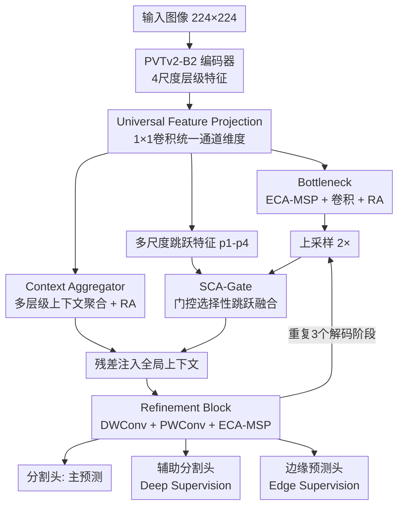

# MedCAGD: Context-Aware Gated Decoder for Efficient Medical Image Segmentation

**会议**: ECCV 2026  
**arXiv**: [2607.00409](https://arxiv.org/abs/2607.00409)  
**代码**: [https://github.com/saadwazir/MedCAGD](https://github.com/saadwazir/MedCAGD)  
**领域**: 医学图像  
**关键词**: 医学图像分割, 解码器设计, 门控跳跃连接, 上下文聚合, 通道注意力

## 一句话总结
MedCAGD 提出一种以解码器为中心的医学图像分割框架，通过上下文感知门控解码器系统性地调控跳跃连接融合和多尺度上下文聚合，在 11 个医学图像分割基准上以 30.60M 参数和 5.0 GFLOPs 的轻量计算代价，一致超越 CNN、Transformer、Mamba 及 SOTA 解码器方法。

## 研究背景与动机
医学图像分割的主流范式是编码器-解码器架构（以 U-Net 为代表），近年来的研究重心严重偏向编码器端——大规模预训练、Transformer 编码器、Mamba 状态空间模型不断提升特征提取质量。然而，分割精度在解码器端存在明显瓶颈：跨尺度特征对齐不准、全局上下文难以有效注入、边界精细化不足等问题，导致即使编码器提取出高质量特征，最终的像素级预测仍然出现语义错位和边界模糊。

核心矛盾在于：编码器能力已经足够强（PVTv2、ConvNeXt、MaxViT 等预训练模型提供了丰富的多尺度特征），但解码器设计仍停留在 naive 的上采样加直接跳跃连接拼接，缺乏对特征融合和上下文聚合的系统性调控。已有解码器改进（如 EMCAD、MCADS）试图通过注意力机制增强特征融合，但要么以较大计算代价换取有限收益，要么依赖加性融合而缺乏对编码器-解码器语义鸿沟的结构化处理——简单地把两边特征加在一起然后过 sigmoid，本质上假设了编解码器特征在语义上是可直接相加的，而这个假设在浅层并不成立。

本文的核心 idea 是：将解码器设计作为分割精度的主要控制因素，提出一套结构化的上下文感知门控解码器，通过门控跳跃连接（乘法一致性建模加多尺度空间竞争）、多层级上下文聚合注入、以及通道重标定的精炼模块，让强编码器特征更忠实地转化为空间一致的像素预测，而不依赖更大的编码器或特定任务微调。

## 方法详解

### 整体框架
MedCAGD 是一个编码器-解码器架构，但创新完全集中在解码器侧。编码器（默认 PVTv2-B2，ImageNet 预训练）提取 4 个尺度的层级特征 $\{c_i\}_{i=1}^4$，经 Universal Feature Projection（$1\times1$ 卷积）投影到统一的解码器通道维度（64、128、320、512）。解码从最深特征开始，经过 Bottleneck 初始细化，然后逐阶段上采样、通过 SCA-Gate 有选择地融合编码器跳跃特征、注入多层级上下文聚合信息、再经 Refinement Block 精炼。此序列（上采样 + 门控跳跃融合 + 上下文聚合 + 精炼）在 3 个解码阶段重复执行。最终阶段输出送入分割头产生主预测，中间阶段连接辅助分割头和边缘预测头实现深度监督。推理时仅保留最终分割预测。

### 关键设计

**1. Bottleneck with Global Context Injection：在解码起点注入全局语义，防止最深特征信息坍缩**

编码器最深特征 $F_4$ 的感受野最大但空间分辨率最低（如 $7\times7$），如果直接上采样开始解码，局部细节几乎完全丢失，且缺乏对自身语义质量的检验。Bottleneck 在解码起点对 $F_4$ 做三步处理：先用 ECA-MSP（多尺度池化的高效通道注意力）重标定通道响应，使对分割任务重要的语义通道获得更高权重；再用标准卷积做局部精炼；最后通过 Residual Attention（RA）注入全局上下文。整体变换为 $B = \mathcal{R}(\rho(\mathcal{E}(F_4)))$，其中 $\mathcal{E}$ 为 ECA-MSP，$\rho$ 为卷积精炼，$\mathcal{R}$ 为 RA。消融显示，仅添加 BT 就将 Synapse Dice 从 73.91 提升到 75.53（+1.62），是模型性能的第一个锚点。

ECA-MSP 的关键改进在于多尺度池化：不同于标准 SE-Net 只用全局平均池化得到一个标量描述子，ECA-MSP 用 $\mathcal{S}=\{1,2,4\}$ 三个池化尺度分别提取通道统计量——$1\times1$ 池化得到全局语义描述子，$2\times2$ 和 $4\times4$ 池化捕捉粗粒度局部上下文线索。三路描述子各自经一维卷积建模局部跨通道交互（不做降维，避免信息瓶颈），取平均后经 sigmoid 生成注意力权重。这种多粒度设计让通道重标定同时感知全局和局部上下文，比单尺度 SE/ECA 更鲁棒——后者可能因为全局池化抹平了局部差异而错误地对所有空间位置施加同一通道权重。

**2. SCA-Gate（Spatially Competitive Attention Gate）：用乘法一致性和空间竞争取代加性门控，选择性调控跳跃连接**

传统跳跃连接（如 U-Net 直接拼接）隐含假设编码器和解码器特征在语义上是相容的，但实际上两者存在显著的语义鸿沟——浅层编码器特征富含纹理边缘但语义弱，深层解码器特征语义强但空间模糊，简单拼接会把语义噪声引入解码过程。SCA-Gate 将跳跃连接建模为可学习的、有选择性的特征调控机制，而非被动通路。

具体做法：设解码器特征为 $g$，对应编码器跳跃特征为 $x$。两者先经 ECA-MSP 各自做通道重标定，再投影到共享潜在空间，其交互建模为逐元素乘法 $f = \theta(\mathcal{E}(g)) \odot \phi(\mathcal{E}(x))$——乘法而非加法，因为乘法天然要求双方在同一空间位置同时激活才产生强响应，等价于"编解码器一致同意的信号"。门控信号 $\mathcal{H}(f, g, x)$ 由三项连乘构成：

$$\mathcal{H}(f, g, x) = f \odot (1 + \mathcal{G}(g, x)) \odot (1 + \mathcal{S}(f))$$

其中 $\mathcal{G}$ 是全局通道调制（从编解码器联合表示中提取全局通道统计量），$\mathcal{S}$ 是多尺度空间竞争——用 kernel=3 和 5 的并行深度可分离卷积 $\mathcal{D}_3(f)$ 和 $\mathcal{D}_5(f)$ 聚合多尺度邻域响应，再经温度控制 softmax 归一化形成空间维度的竞争：在多尺度邻域内，只有真正重要的空间位置被激活，背景和噪声区域被抑制。最终的注意力掩码 $\sigma(\mathcal{H})$ 乘回跳跃特征 $x$，实现选择性传递。

与 Attention U-Net 的加性融合加 sigmoid 掩码相比，SCA-Gate 的三重机制（乘法一致性 + 全局调制 + 空间竞争）提供了更结构化的特征筛选。表 5 显示，SCA-Gate 在 Synapse 上达到 87.00 Dice，比 Attention U-Net Gate 的 85.20 高出 1.8 个点，比 EMCAD 的 LGAG（84.51）高 2.49 个点，且参数量更少（30.60M vs 30.94M LGAG）。

**3. Multi-level Context Aggregator (CA) with Residual Attention：让每个解码阶段都能"看到"全局语义**

跳跃连接只在对应层级之间传递信息（如 encoder-stage-2 连到 decoder-stage-2），但有效的解码还需要跨层级的全局感知——深层语义指导浅层细节恢复、浅层定位线索补充深层语义。Context Aggregator 把全部 $K$ 个编码器层级的投影特征 $\{F_k\}_{k=1}^K$ 聚合起来：先各经 $1\times1$ 点卷积投影到统一通道、插值对齐到当前解码器空间分辨率，取平均后经 RA 做全局精炼，得到 $F_{\text{ctx}} = \mathcal{R}(\frac{1}{K}\sum_{k=1}^K \mathcal{P}_k(F_k))$。这个全局上下文表示通过残差加法注入每个解码阶段，提供与阶段无关的全局语义引导。

RA（Residual Attention）本身是一个轻量非局部注意力模块：对输入特征图 $X$，先用点卷积 $\mathcal{P}_0$ 投影后经 softmax 归一化得到 $HW$ 维的空间重要性分布，加权求和得到全局上下文描述子，再经两层点卷积（中间降维加非线性激活 $\delta$）做通道混合，最后残差加回：$Y = X + \mathcal{P}_2(\delta(\mathcal{P}_1(\sum_{i=1}^{HW} \text{Softmax}(\mathcal{P}_0(X))_i X_i)))$。残差形式保留了局部结构，同时高效注入了全局信息。

CA 与 SCA-Gate 互补：SCA-Gate 做"点对点"的同层特征选择性融合，CA 做"面"的跨层全局语义注入。消融中 CA（含 RA）单独将 Synapse Dice 从 73.91 拉升至 81.03（+7.12），而与 BT 组合后进一步提升至 83.57。

**4. Refinement Block (RB)：轻量局部精炼加通道重标定，稳定解码器特征传播**

每个解码阶段在融合跳跃特征和全局上下文后，经过 Refinement Block 做最后的局部增强。RB 的流程是：深度可分离卷积（空间滤波，kernel 3×3）→ Group Normalization + SiLU → 逐点卷积（$1\times1$，通道混合）→ Group Normalization + SiLU → ECA-MSP（通道重标定）。深度可分离卷积极大幅度降低了空间卷积的计算量，ECA-MSP 则对精炼后的特征做最终的通道重要性排序。RB 的作用是在各解码阶段末端对融合后的特征做一次局部一致性和通道质量的快速检查——消融显示添加 RB 将 Synapse Dice 从 83.57 提升到 85.19（+1.62）。

### 一个完整示例：以 Synapse 腹部多器官分割为例

输入一张 $224\times224$ 的腹部 CT 切片。PVTv2-B2 编码器输出 4 个尺度特征：$c_1$（$56\times56$, 64 通道）、$c_2$（$28\times28$, 128 通道）、$c_3$（$14\times14$, 320 通道）、$c_4$（$7\times7$, 512 通道）。Universal Feature Projection 将其投影到统一维度 $\{p_i\}_{i=1}^4$。

$p_4$（$7\times7$, 512 通道）先进入 Bottleneck：ECA-MSP 用 $\{1,2,4\}$ 三个池化尺度重标定通道——大池化（$1\times1$）捕捉"这个通道整体上对器官分割重要吗"，小池化（$4\times4$）捕捉局部纹理的通道偏好。重标定后经 $1\times1$ 卷积精炼，再经 RA 做全局上下文注入：用 softmax 计算 $7\times7=49$ 个空间位置的注意力分布，加权求和得全局描述子，经通道混合后残差加回。此时解码器特征 $d_4$ 已具备全局语义。

Stage 3 解码：$d_4$ 上采样到 $14\times14$，SCA-Gate 将其与 $p_3$ 融合——乘法一致性确保只有编解码器同时激活的位置（如肝脏边缘）获得高门控值，多尺度空间竞争进一步抑制噪声区域。与此同时，CA 将 $p_1$ 至 $p_4$ 全部聚合为 $14\times14$ 的全局上下文，残差注入 $d_3$。RB 最后用深度卷积加通道注意力打磨。此阶段生成辅助分割预测和辅助边缘预测。

Stage 2（$28\times28$）和 Stage 1（$56\times56$）重复相同流程。最终 $56\times56$ 特征经分割头输出 8 类器官预测（主动脉、胆囊、左肾、右肾、肝脏、胰腺、脾脏、胃），上采样回 $224\times224$。整个过程从 Bottleneck 的 $7\times7$ 全局语义出发，逐阶段恢复空间细节，每一阶段同时收到来自同层跳跃连接的选择性局部信息（SCA-Gate）和来自全部层级的全局语义引导（CA），在 Refinement Block 中完成最后的局部一致性检验。

### 损失函数 / 训练策略

所有分割和边缘预测均使用二元交叉熵（BCE）损失。总损失为三项加权组合：主分割损失 $\mathcal{L}_{\text{main}}$ + 深度监督损失 $\sum_{i=1}^3 \mathcal{L}_{\text{aux}}^i$（用 3 个中间解码阶段的辅助分割头）+ 边缘监督损失 $\sum_{i=1}^3 \mathcal{L}_{\text{edge}}^i$（用同样 3 个阶段的边缘预测头，边缘真值从 GT mask 中通过二值化提取）。优化器为 AdamW，学习率 $1\times10^{-4}$，batch size 16，训练 300+ epoch，基于验证集 Dice 选最优模型。输入统一 resize 到 $224\times224$，在线数据增强包括随机旋转、水平/垂直翻转和随机裁剪。对于高分辨率数据集（DRIVE/FIVES 眼底血管），用 $256\times256$ 重叠 patch（stride 128）训练；CellSeg 用 $384\times384$ 重叠 patch（stride 192），测试时拼接 patch 预测重建完整分割图。

## 实验关键数据

### 主实验

**9 个二分类分割基准（平均 Dice，%）**：表格覆盖皮肤镜（ISIC17/18）、息肉（ETIS/ColonDB）、眼底血管（DRIVE/FIVES）、超声肿瘤（BUSI）、甲状腺超声（ThyroidXL）和显微细胞（CellSeg）共 6 种任务类型。

| 方法 | 参数量 | FLOPs | Skin 均值 | Polyp 均值 | Fundus 均值 | Neoplasm 均值 | Cell | 9 集平均 |
|------|--------|-------|-----------|------------|-------------|---------------|------|----------|
| U-Net | 34.53M | 65.53G | 84.87 | 80.40 | 73.49 | 72.60 | 71.52 | 77.14 |
| nnU-Net | 31.29M | 55.26G | 85.88 | 85.88 | 75.77 | 81.27 | 83.53 | 82.34 |
| TransUNet | 105.32M | 38.52G | 87.08 | 89.71 | 79.26 | 82.04 | 79.08 | 83.92 |
| EMCAD | 26.76M | 5.60G | 88.46 | 92.30 | 79.83 | 81.79 | 79.13 | 84.87 |
| MCADS | 50.90M | 61.89G | 87.58 | 91.81 | 77.24 | 83.18 | 86.68 | 85.14 |
| **MedCAGD** | **30.60M** | **5.00G** | **89.09** | **93.37** | **84.57** | **85.75** | **86.61** | **88.01** |

**Synapse 多器官 CT 分割（8 类，Dice/IoU/HD95）**：

| 方法 | Dice (%) | IoU (%) | HD95 | 主动脉 | 胆囊 | 左肾 | 右肾 | 肝脏 | 胰腺 | 脾脏 | 胃 |
|------|----------|---------|------|--------|------|------|------|------|------|------|-----|
| nnU-Net | 75.33 | 71.47 | 19.34 | 77.06 | 73.27 | 76.34 | 84.53 | 79.98 | 73.34 | 77.62 | 60.52 |
| TransUNet | 77.61 | 67.32 | 26.90 | 86.56 | 60.43 | 80.54 | 78.53 | 94.33 | 58.47 | 87.06 | 75.00 |
| EMCAD | 83.63 | 74.65 | 15.68 | 88.14 | 68.87 | 88.08 | 84.10 | 95.26 | 68.51 | 92.17 | 83.92 |
| MCADS | 85.03 | 81.71 | **11.11** | 90.81 | 86.07 | 86.77 | 83.24 | 87.66 | 83.55 | 85.74 | 76.38 |
| **MedCAGD** | **87.00** | **83.77** | 14.39 | **92.28** | **90.31** | **89.72** | **87.21** | 91.02 | **82.08** | 86.91 | 76.51 |

**ACDC 心脏 MRI 分割（3 类，Dice/IoU/HD95）**：

| 方法 | Dice (%) | IoU (%) | HD95 | 右心室 | 心肌 | 左心室 |
|------|----------|---------|------|--------|------|--------|
| nnU-Net | 82.66 | 74.27 | 6.17 | 79.00 | 81.01 | 87.97 |
| EMCAD | 85.07 | 77.73 | 5.25 | 81.58 | 84.23 | 89.42 |
| MCADS | 84.51 | 76.92 | 5.56 | 81.16 | 83.27 | 89.09 |
| UCTransNet | 84.89 | 77.57 | 5.70 | 80.94 | 84.11 | 89.62 |
| **MedCAGD** | **87.54** | **80.96** | **4.41** | **85.27** | **86.23** | **91.11** |

### 消融实验

**组件消融（Synapse Dice / CellSeg Dice，%）**：基线为 PVTv2-B2 编码器 + 朴素 U-Net 风格解码器（仅上采样 + 直接拼接跳跃连接）。

| BT | CA (w/ RA) | CA (w/o RA) | RB | SCA-Gate | Synapse | CellSeg |
|----|------------|-------------|-----|----------|---------|---------|
|    |            |             |     |          | 73.91 | 81.07 |
| Y  |            |             |     |          | 75.53 | 82.80 |
| Y  |            | Y           |     |          | 79.38 | 82.60 |
|    | Y          |             |     |          | 81.03 | 82.47 |
| Y  | Y          |             |     |          | 83.57 | 84.28 |
| Y  | Y          |             | Y   |          | 85.19 | 84.62 |
| Y  | Y          |             | Y   | Y        | **87.00** | **86.61** |

**跳跃连接注意力机制对比（Synapse / CellSeg Dice，%）**：在已含 BT + CA + RB 的基线上替换不同的跳跃注意力模块。

| 跳跃注意力方案 | 参数量 | FLOPs | Synapse | CellSeg |
|---------------|--------|-------|---------|---------|
| Attention U-Net Gate | 29.54M | 4.63G | 85.20 | 83.19 |
| Attn Gate + ECA | 29.58M | 4.63G | 85.38 | 80.77 |
| Attn Gate + ECA-MSP | 29.45M | 4.63G | 85.46 | 84.65 |
| LGAG (EMCAD) | 30.94M | 4.99G | 84.51 | 81.99 |
| RLAB (MCADS) | 30.96M | 5.86G | 85.17 | 80.37 |
| **SCA-Gate (Ours)** | **30.60M** | **5.00G** | **87.00** | **86.61** |

### 关键发现
- **SCA-Gate 是最大单一贡献组件**：在已有 BT + CA + RB 的基础上添加 SCA-Gate，Synapse Dice 从 85.19 跃升至 87.00（+1.81），远超所有替代注意力门控方案。乘法一致性 + 空间竞争的联合设计是性能提升的核心来源。
- **CA 中 RA 不可或缺**：CA 不带 RA 时 Synapse Dice 仅 79.38，加上 RA 后同配置跃升至 83.57（+4.19），说明全局残差注意力对多层级语义聚合的质量起决定性作用——简单平均远不足以产生有用的全局上下文。
- **Deep Supervision + Edge Supervision 互补**：雷达图显示两者同时启用时覆盖面积最大（Dice 外圈最大，HD95 内圈最小）；ES 尤其有助于边界精度，单独启用 ES 时的 HD95 改善比单独启用 DS 更显著。
- **Stage 0 性价比不高**：从原始输入引入额外精炼路径仅带来 0.21 Synapse Dice 提升，但 FLOPs 从 5.0G 增至 8.3G（+66%），因此最终模型未包含。
- **编码器兼容性验证充分**：换用 ConvNeXt-Base（93.72M, 86.79 Synapse）和 MaxViT-Base（84.19M, 87.57）均能正常工作，性能与编码器能力正相关；高分辨率输入（512×512）下 pvt_v2_b2 可达 87.99，但 FLOPs 暴涨至 67.5G。

## 亮点与洞察
- **"解码器是瓶颈"的实证力度强**：同一 PVTv2-B2 编码器，naive 解码器仅 73.91 Synapse Dice，MedCAGD 解码器达 87.00——13 个点的差距完全来自解码器，这比任何"我们改进了 XX 模块带来 +0.5"式的消融更有说服力。
- **SCA-Gate 的乘法一致性是一个可迁移的设计范式**：用逐元素乘法代替加法来建模两个不同域特征的交互，隐含了"双方同时激活才可信"的先验。这一思路不仅适用于跳跃连接，也可以迁移到多模态 VLM 的视觉-语言特征对齐、视频帧间时序特征融合等场景——任何需要两个特征图做"一致性检验"的地方都可以尝试乘法替代加法。
- **ECA-MSP 作为即插即用的零成本增强**：多尺度池化的通道注意力仅增加两个额外的池化分支（几乎零额外参数），但让通道注意力从"只看全局"变为"全局 + 局部结合"。这个改进可以被任何使用 SE/ECA 的架构直接采纳，迁移成本极低。
- **消融实验的递增设计值得学习**：BT → +CA(w/o RA) → +CA(w/ RA) → +RB → +SCA-Gate 的逐组件消融顺序，既展示了每个模块的边际贡献，又通过 CA 的 w/ vs w/o RA 对比揭示了子组件的重要性——这种嵌套消融比常见的"全有 vs 全无"更能定位关键机制。

## 局限与展望
- **仅验证 2D 分割**：所有实验使用 $224\times224$ 2D 输入，未涉及 3D 医学图像（CT/MRI 体积数据）。3D 分割中解码器的跨层对齐和计算效率挑战更大——CA 需要对更多层级做插值对齐，SCA-Gate 的空间竞争在 3D 下计算量会立方增长。
- **OOD 鲁棒性未评估**：论文未测试跨机构、跨设备、跨种群的数据分布偏移下的泛化能力。医学图像部署中这通常是比绝对精度更关键的瓶颈。
- **与 SAM 类基础模型的对比不完整**：表 1 中 AutoSAM 和 Medical SAM3 仅有个别数据集结果，且 Medical SAM3 在 DRIVE 上仅 55.80（可能未充分适配眼底血管这一细粒度任务），对比说服力有限。
- **BCE Loss 的单一选择可能限制了边界性能**：Synapse 上 HD95 不如 MCADS（14.39 vs 11.11），可能源于 BCE 对边界像素的惩罚不如 Dice Loss 或边界感知损失（如 Boundary Loss）直接。组合 BCE + Dice 是医学分割中的标准做法，值得探索。
- **改进方向**：(1) 将 SCA-Gate 扩展为多头版本，让不同"头"关注不同的空间竞争模式（如一个头关注器官边界、另一个关注内部均质区域）；(2) 在 nnU-Net 的 3D 框架内验证解码器设计的迁移性；(3) 探索将 CA 的全局上下文机制与 prompt-based segmentation 结合——用全局上下文作为隐式 prompt。

## 相关工作与启发
- **vs EMCAD (CVPR 2024)**：同为解码器中心的分割方法，EMCAD 在解码器中用改进的 CBAM 类注意力做多阶段特征增强。MedCAGD 的核心差异在于用乘法门控（SCA-Gate）替代加性注意力做跳跃融合，且多尺度空间竞争在 EMCAD 中无对应设计。MedCAGD 以更少 FLOPs（5.0G vs 5.6G）实现了更高 Dice。
- **vs MCADS**：MCADS 用残差线性注意力 + 深度到空间上采样保留细粒度结构，HD95 表现极好（Synapse 11.11 为所有方法最优）。但 MCADS 参数量更大（50.90M vs 30.60M），且 MedCAGD 在 Dice 和 IoU 上反超，说明在区域重叠度的整体分割质量上更好。
- **vs UCTransNet**：用可学习 Transformer 通道融合替代固定跳跃连接，方向与 SCA-Gate 相似。SCA-Gate 可以被视为一种更轻量的替代——用通道注意力 + 深度卷积实现选择性融合，但避免了自注意力的二次计算复杂度。适合资源受限的场景。
- **vs SAM 类方法**：SAM 依赖提示交互和大规模适配数据，在固定任务医学分割上不如专用架构，MedCAGD 的结果进一步支持了"专用轻量架构 vs 通用大模型"在医学图像领域的持续争论——至少在现有基准上，好的专用解码器设计比更大的通用模型更有效。

## 评分
- 新颖性: ⭐⭐⭐⭐ — "解码器是瓶颈"的论点本身不新，但 SCA-Gate 的乘法一致性 + 多尺度空间竞争联合设计有实质创新，不是已有注意力机制的简单堆叠；ECA-MSP 虽是小改进但实用。
- 实验充分度: ⭐⭐⭐⭐⭐ — 11 个数据集覆盖 7 种成像模态、2D 和 3D（ACDC 是 3D MRI 的 2D 切片）、二分类和多分类；逐组件嵌套消融 + 跳跃注意力独立对比 + 编码器替换 + 分辨率分析 + DS/ES 监督信号消融，实验矩阵几乎无死角。
- 写作质量: ⭐⭐⭐⭐ — 方法描述清晰，公式与图示齐全，每个模块都有对应的消融支撑；Related Work 稍显冗长但覆盖全面。
- 价值: ⭐⭐⭐⭐ — 以 30.60M / 5.0G 的轻量配置在 11 个基准上一致达到 SOTA，实用价值高；SCA-Gate 和 ECA-MSP 作为即插即用模块可迁移到其他视觉任务，有较强的复用潜力。

<!-- RELATED:START -->

## 相关论文

- [\[CVPR 2025\] Decoding Matters: Efficient Mamba-Based Decoder with Distribution-Aware Deep Supervision for Medical Image Segmentation](../../CVPR2025/medical_imaging/decoding_matters_efficient_mamba-based_decoder_with_distribution-aware_deep_supe.md)
- [\[CVPR 2025\] Show and Segment: Universal Medical Image Segmentation via In-Context Learning](../../CVPR2025/medical_imaging/show_and_segment_universal_medical_image_segmentation_via_in-context_learning.md)
- [\[AAAI 2026\] Towards Effective and Efficient Context-aware Nucleus Detection in Histopathology Whole Slide Images](../../AAAI2026/medical_imaging/towards_effective_and_efficient_context-aware_nucleus_detection_in_histopatholog.md)
- [\[CVPR 2026\] MedCLIPSeg: Probabilistic Vision-Language Adaptation for Data-Efficient and Generalizable Medical Image Segmentation](../../CVPR2026/medical_imaging/medclipseg_probabilistic_vision-language_adaptation_for_data-efficient_and_gener.md)
- [\[AAAI 2026\] Decoding with Structured Awareness: Integrating Directional, Frequency-Spatial, and Structural Attention for Medical Image Segmentation](../../AAAI2026/medical_imaging/decoding_with_structured_awareness_integrating_directional_frequency-spatial_and.md)

<!-- RELATED:END -->
