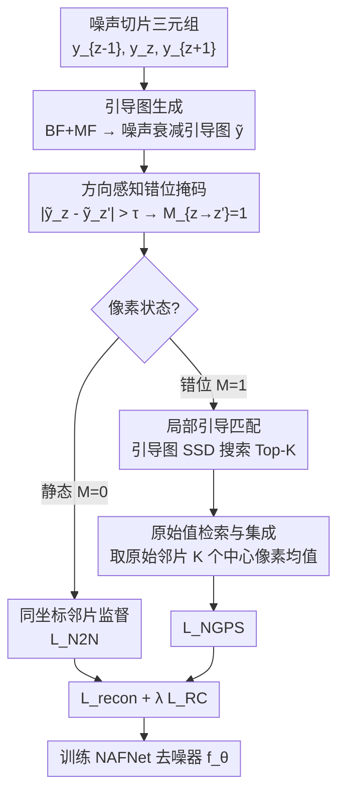

# NGPS: Structure-Preserving Self-Supervised Denoising via Neighbor-Guided Patch Sampling

**会议**: ECCV 2026  
**arXiv**: [2606.23200](https://arxiv.org/abs/2606.23200)  
**代码**: [https://github.com/cv-cho/NGPS](https://github.com/cv-cho/NGPS) (有)  
**领域**: 医学图像 / 自监督学习  
**关键词**: 自监督去噪, 邻片监督, 医学影像, 错位处理, patch匹配

## 一句话总结
NGPS 提出一种轻量级邻片自监督去噪框架：对层间错位区域，在噪声衰减引导图上做局部 patch 匹配，但训练目标从原始噪声邻片的匹配坐标取像素值，从而实现"结构匹配与信号检索解耦"，无需密集形变场估计，在低剂量 CT 和 MRI 上一致提升保真度与结构敏感指标。

## 研究背景与动机
自监督去噪对体积医学影像（CT、MRI）极具吸引力，因为它无需配对的干净-噪声图像。邻片自监督（neighboring-slice SSL）利用相邻切片互为监督目标，基于切片间噪声独立的假设。然而，层间解剖结构的空间错位（inter-slice misalignment）破坏了同坐标对应关系：干净信号在相邻切片中偏移了 $\delta$，导致 $\frac{1}{2}\big(x_z(p) + x_z(p-\delta)\big)$ 叠加，产生鬼影和边缘模糊。

现有两类应对方案各有利弊。**掩码类方法**（如 Noise2Sim、NS-N2N）直接排除差异过大的像素，训练稳定，但代价是丢弃了大量监督信号——论文统计发现 LIDC-IDRI 数据中约 20% 的 ROI 邻近像素被掩码丢弃，且**被丢弃的区域高度集中在高梯度（高频）解剖边界处**。这正是最需要精细恢复的结构区域，形成了"越关键的边界越没有监督"的矛盾。**配准类方法**（如 Deformed2Self）显式估计层间对应并 warp 邻片，但在强噪声或大层间距下配准可靠性下降，且空间重采样会平滑边缘、引入额外开销。

因此，核心矛盾是：邻片监督的错位像素到底是"不可用"还是"用错了地方"？本文的观点是**错位不等于缺失**——被位移的解剖证据仍然存在于邻片的局部邻域中，只是不在同坐标上。核心 idea：**将找对应（结构匹配）和取监督值（信号检索）解耦**——在噪声衰减的引导图上做 patch 相似性搜索来找对应坐标，但回归目标始终从原始噪声邻片取原始像素值，从而避免直接把含噪 patch 用于匹配引入的噪声驱动选择偏差，也避免 warp/插值改变噪声统计特性。

## 方法详解

### 整体框架
NGPS 是一个训练时监督构建框架，不改推理架构。输入为一组噪声切片三元组 $\{y_{z-1}, y_z, y_{z+1}\}$，主干网络 $f_\theta$ 为标准 2D 去噪器（NAFNet），推理时仅需单张噪声切片。整个监督构建分为三个阶段：（1）用双边滤波 + 中值滤波生成噪声衰减引导图，并在引导图上计算方向感知的错位掩码；（2）对掩码标记的错位像素，在邻片局部窗口内用引导图做 patch SSD 匹配，找到 Top-K 候选坐标；（3）从这些坐标的原始噪声邻片取中心像素值，取均值作为检索到的伪目标。训练时，静态像素用标准同坐标邻片监督（$\mathcal{L}_{N2N}$），错位像素用检索到的目标监督（$\mathcal{L}_{NGPS}$），两者相加为重建损失，并辅以区域一致性正则项 $\mathcal{L}_{RC}$。

### 关键设计

**1. 噪声衰减引导图与方向感知错位掩码：解决"哪里需要检索"**

传统掩码方法在原始噪声图像上计算层间差异，噪声本身会干扰掩码判断——噪声大的区域被误判为错位，结构边界处的真实错位反而被噪声掩盖。NGPS 先对输入做轻量级保边滤波：依次应用 2D 双边滤波（$d=5, \sigma_{color}=35, \sigma_{space}=50$）和 $5\times5$ 中值滤波，得到噪声衰减的引导图 $\tilde{y}_z$。该引导图抑制量子噪声的同时保留解剖结构边界，为后续匹配提供更干净的搜索基底。

掩码是**方向感知**的而非全局单一张：对每个邻片方向 $z' \in \{z-1, z+1\}$，单独计算 $\mathcal{M}_{z\to z'}(p) = \mathbb{1}\big(|\tilde{y}_z(p) - \tilde{y}_{z'}(p)| > \tau\big)$，其中 $\tau = 0.05$。这意味着一个像素可能对前一片是静态的（同坐标即可监督）但对后一片是错位的（需要检索），避免了全局一刀切造成的不必要检索开销或监督浪费。

**2. 解耦的引导匹配与原始值检索：NGPS 的核心 insight**

这是 NGPS 与 PixelBank 及传统 patch 匹配方法最本质的区别。对于掩码标记的错位像素 $p$，在邻片 $z'$ 的局部搜索窗口 $\Omega_p$（$15\times15$）内，用引导图上的 $k\times k$ patch（$k=7$）计算 SSD 相似度：

$$\mathcal{D}(p, q; z') = \|\mathcal{P}_k(\tilde{y}_z, p) - \mathcal{P}_k(\tilde{y}_{z'}, q)\|_2^2, \quad q \in \Omega_p$$

关键操作：**匹配在引导图上做，但检索从原始噪声图中取值**。匹配到的坐标 $q$ 对应的监督信号是 $y_{z'}(q)$（单个标量，即中心像素值），而非 $\mathcal{P}_k(y_{z'}, q)$（整个 patch）。

这样设计的动机有二：（1）直接拿原始噪声 patch 做匹配，噪声会驱动坐标选择往"噪声模式一致"的方向偏，引入 selection bias——匹配到的位置的噪声残余与输入噪声可能相关，破坏 Noise2Noise 的零均值假设；（2）取整个匹配 patch 的均值或加权值，等价于对邻片做了空间平滑，会模糊高频结构。只取中心像素则保持原始噪声的统计特性（零均值、方差不变），让网络学到对单点噪声的无偏估计。

**3. Top-K 集成目标：降低单匹配方差**

仅取单个最佳匹配的中心像素值作为目标，方差较大——单次匹配可能恰好落在噪声峰值或谷底。NGPS 取 SSD 最小的 $K$ 个候选坐标 $\{q^{(1)}, \dots, q^{(K)}\}$（$K=4$），对其原始噪声邻片中心像素值取平均：

$$t_{z\to z'}(p) = \frac{1}{K}\sum_{k=1}^{K} y_{z'}\big(q^{(k)}\big)$$

这与 PixelBank 的采样理念一致，但有三点关键区别：（1）搜索空间限制在邻片的局部窗口而非全图，效率高且避免了同图自检索的噪声耦合；（2）仅在错位像素上触发，而非全图密集采样；（3）$K=4$ 是噪声-细节平衡的甜点——消融显示 $K=1$ 或 $2$ 时残留噪声较大，$K=8$ 或 $16$ 时低质量匹配被纳入，模糊细节。

### 一个完整示例

以一个 LIDC-IDRI 2.5mm 层厚的胸部 CT 切片为例：当前切片 $z$ 的某个位于血管边界的像素 $p$，其引导图值与邻片 $z+1$ 同坐标的引导图值差为 0.12 > $\tau=0.05$，被掩码标记为错位。NGPS 在邻片 $z+1$ 的 $15\times15$（共 225 个候选坐标）搜索窗口内，用 $7\times7$ 引导图 patch 做 SSD 匹配，选出 Top-4 候选坐标（分别偏移了 $(-2,+1), (-1,+1), (-3,0), (-2,+2)$ 像素），对应 SSD 代价递增。最终目标值 $t_{z\to z+1}(p)$ 为这 4 个坐标在原始噪声邻片上的中心像素值（例如 0.423, 0.438, 0.415, 0.448）的均值 0.431。该目标替代了直接使用同坐标邻片像素 0.387（因结构偏移而错误地低），使网络在该边界像素处学到的是血管信号而非模糊平均。

### 损失函数 / 训练策略

总损失为 $\mathcal{L}_{total} = \mathcal{L}_{recon} + \lambda \mathcal{L}_{RC}$，其中 $\lambda=0.5$。

**混合重建损失**。根据掩码自适应切换监督源：

$$\mathcal{L}_{recon} = \mathcal{L}_{N2N} + \mathcal{L}_{NGPS}$$

$$\mathcal{L}_{N2N} = \frac{1}{|\mathcal{N}(z)|}\sum_{z'}\frac{\sum_p (1-\mathcal{M}_{z\to z'}(p))(f_\theta(y_z)(p) - y_{z'}(p))^2}{\sum_p (1-\mathcal{M}_{z\to z'}(p)) + \epsilon}$$

$$\mathcal{L}_{NGPS} = \frac{1}{|\mathcal{N}(z)|}\sum_{z'}\frac{\sum_p \mathcal{M}_{z\to z'}(p)(f_\theta(y_z)(p) - t_{z\to z'}(p))^2}{\sum_p \mathcal{M}_{z\to z'}(p) + \epsilon}$$

两项分别按各自区域的像素数归一化，避免两类像素数量不均导致的梯度偏置。

**区域一致性正则**。仅作用于静态区域（$1-\mathcal{M}$），鼓励相邻切片在非错位区域的预测一致，减少切片间 flicker：

$$\mathcal{L}_{RC} = \frac{1}{|\mathcal{N}(z)|}\sum_{z'} \|(1-\mathcal{M}_{z\to z'}) \odot (f_\theta(y_z) - f_\theta(y_{z'}))\|_2^2$$

注意 NGPS 不使用 NS-N2N 中的 Inter-slice Continuity（$\mathcal{L}_{IC}$）项。消融显示给 NGPS 加 $\mathcal{L}_{IC}$ 导致 PSNR 下降 0.10 dB——因为 $\mathcal{L}_{IC}$ 强制局部线性约束（$f_\theta(\frac{y_z+y_{z+1}}{2}) \approx \frac{f_\theta(y_z)+f_\theta(y_{z+1})}{2}$），与 NGPS 在错位区域提供的检索目标存在经验上的目标张力。

训练配置：AdamW 优化器，初始学习率 $2\times10^{-4}$，权重衰减 $10^{-5}$，batch size 4，训练 10 epoch，输入随机裁剪至 $256\times256$。NAFNet 骨干网络 base width 32，编码器块 [2,2,4,8]，8 个中间块，解码器块 [2,2,2,2]。NGPS 超参在全数据集上固定为 $p=7, W=15, K=4, \tau=0.05$。

## 实验关键数据

### 主实验

NGPS 在三个数据集上与 12 个基线方法对比，包括经典方法（BM3D）、自监督单图方法（Noise2Void、NB2NB、Pixel2Pixel 等）、邻片掩码方法（Noise2Sim、NS-N2N）和配准方法（Deformed2Self）。

| 方法 | AAPM-Mayo QD CT | | | | | LIDC-IDRI ULD CT | | | | |
|------|:-:|:-:|:-:|:-:|:-:|:-:|:-:|:-:|:-:|:-:|
| | PSNR↑ | SSIM↑ | FSIM↑ | HFEN↓ | GMSD↓ | PSNR↑ | SSIM↑ | FSIM↑ | HFEN↓ | GMSD↓ |
| Noisy | 30.30 | 0.7222 | 0.8772 | 0.3363 | 0.0874 | 22.14 | 0.4213 | 0.5920 | 0.8429 | 0.1959 |
| BM3D | 34.67 | 0.7764 | 0.8547 | 0.3258 | 0.0900 | 25.07 | 0.5825 | 0.7768 | 0.6010 | 0.1449 |
| Noise2Void | 32.57 | 0.7786 | 0.8977 | 0.3286 | 0.0739 | 26.10 | 0.5995 | 0.8295 | 0.4948 | 0.1078 |
| Pixel2Pixel | 33.71 | 0.8357 | 0.9117 | 0.3183 | 0.0739 | 25.58 | 0.5078 | 0.7277 | 0.6196 | 0.1237 |
| Deformed2Self | 35.85 | 0.8662 | 0.9144 | 0.2299 | 0.0377 | 28.94 | 0.6703 | 0.8170 | 0.5134 | 0.0808 |
| Noise2Sim | 35.49 | 0.8639 | 0.9420 | 0.2406 | 0.0390 | 28.81 | 0.7817 | 0.8749 | 0.5003 | 0.1040 |
| NS-N2N | 35.91 | 0.8584 | 0.9235 | 0.2325 | 0.0396 | 30.62 | 0.8080 | 0.8944 | 0.4406 | 0.0777 |
| **NGPS** | **36.68** | **0.8986** | **0.9470** | **0.2056** | **0.0362** | **31.03** | **0.8102** | **0.9168** | **0.4161** | 0.0788 |

AAPM 上 NGPS 五项指标全最优，PSNR 领先 NS-N2N 0.77 dB。LIDC-IDRI 上 PSNR、FSIM、HFEN 提升显著（PSNR 提升 0.41 dB，volume-level 95% CI [0.23, 0.59] 排除零），SSIM 提升微弱（+0.0022，CI 包含零），GMSD 略差于 NS-N2N（0.0788 vs 0.0777）。在 IXI MRI 的 5%/7%/9% Rician 噪声三个级别上，NGPS 的 PSNR 和 SSIM 均为最高（例如 9% 噪声下 PSNR 24.21 dB vs 次优 Deformed2Self 24.11 dB）。

定性上，在 AAPM 量子噪声和 LIDC 条纹伪影场景下，掩码方法在 ROI 放大区域中边界较平滑（与丢失监督一致），配准方法出现局部伪影，NGPS 在减少残留噪声的同时保留了更清晰的解剖边界。在 IXI 9% Rician 噪声下，掩码方法的皮层边界较软，NGPS 保留了更锐利的局部结构。

### 消融实验

| 配置 | Recon | RC | IC | PSNR (dB) | SSIM |
|------|:-----:|:--:|:--:|:---------:|:----:|
| NS-N2N | ✓ | | | 35.43 | 0.8481 |
| NS-N2N | ✓ | ✓ | | 35.88 | 0.8578 |
| NS-N2N (full) | ✓ | ✓ | ✓ | 35.91 | 0.8584 |
| NGPS | ✓ | | | 36.50 | 0.8894 |
| **NGPS (最终)** | ✓ | ✓ | | **36.68** | **0.8986** |
| NGPS | ✓ | | ✓ | 36.39 | 0.8938 |
| NGPS | ✓ | ✓ | ✓ | 36.58 | 0.8981 |

纯重建 NGPS（无 RC/IC）已比 NS-N2N 完整版高 0.59 dB，验证了检索到的目标本身质量高。RC 对 NGPS 贡献 +0.18 dB PSNR 和 +0.0092 SSIM——因为在静态区域强制一致性有助于稳定训练。加 IC 反而降 0.10 dB，因为 IC 的局部线性约束与 NGPS 检索目标存在张力。

层厚鲁棒性方面，LIDC-IDRI 上从 1.25mm 切换到 2.5mm，NGPS 仅下降 0.16 dB，而 NS-N2N 下降 0.63 dB、Noise2Sim 下降 2.83 dB，表明局部检索策略对层间距增加更鲁棒。引导滤波器消融显示，BF+MF 组合在质量-效率间取最佳权衡：NLM+Median 虽略高（36.74 dB AAPM），但三片 triplet 的 CPU 引导生成时间从 0.14s 暴涨到 12.71s（~89 倍）。计算效率方面，100 片 volume 的目标准备时间 NGPS 仅需 ~0.72s，比 NS-N2N 快 ~19 倍、比 Pixel2Pixel 快 ~7.5 倍。

### 关键发现
- **检索目标贡献最大**：纯 NGPS（无正则）已超越 NS-N2N 完整版，说明解耦匹配-检索构造的伪目标质量远优于 mask 后丢弃，是 PSNR 提升的主因
- **$K=4$ 是甜点**：$K$ 从 1 增至 4 时 PSNR 单调上升，超过 4 后下降——过多候选引入不匹配坐标的低质量目标，模糊细节
- **$\tau=0.05$ 时 NGPS 对阈值不敏感**：与 NS-N2N 在阈值过严或过松时性能急剧下降不同，NGPS 的检索机制提供了缓冲——即使掩码不准，检索到的近邻值仍优于直接被丢弃
- **大层间距下 NGPS 掉到 NS-N2N 以下**：AAPM 上 gap≥4mm 时 NGPS 劣于 NS-N2N（34.48 vs 35.12 dB at 5mm），暴露固定窗口局部同源性假设的极限

## 亮点与洞察
- **解耦匹配与检索是核心贡献**：这个设计看似简单——匹配用滤波图、取值用原始图——但它同时解决了两个问题：噪声驱动的匹配偏差（如果匹配也用原始图）和空间平滑导致的细节丢失（如果取值也用滤波图）。这是一个可以迁移到其他需要"在噪声数据中找对应但不想引入噪声偏差"的通用设计模式
- **方向感知掩码代替全局二值掩码**：邻片错位是方向相关的——前一片可能对准、后一片可能错位，分开建掩码避免了"一刀切"造成监督浪费，这个方向感知的思路对多帧/多视角去噪有参考价值
- **$15\times15$ 局部窗口的工程合理性**：通过多几何的匹配偏移 CDF 分析证明 $15\times15$ 覆盖了 >80% 的有效匹配偏移量，避免了大窗口的二次方候选成本——这种"先统计后定窗口"的方法论具有通用性
- **以训练时监督构建替代推理时后处理**：NGPS 不动网络架构、不动推理流程，只改"监督信号怎么造"——这是一种低侵入性的改进策略，可轻易插入任何 Noisy2Noise 风格的训练管线中

## 局限与展望
- **局部同源性假设在极大层间距下失效**：当层间距超过局部窗口能覆盖的范围（如 AAPM 5mm、LIDC 6.25mm），匹配到的"最近邻"实际上并不对应同一解剖结构，检索退化。作者在 supplement 中提出了 Calibrated Match-Cost Gate 作为缓解（大 gap 下可回收 0.72-0.96 dB），但并未根本解除假设
- **仅验证了零均值、切片独立噪声假设**：跨切片相关的伪影（如螺旋 CT 的 z 方向相关重建伪影）是否也满足 Noise2Noise 条件未经验证
- **MRI 评估局限**：仅使用合成 Rician 噪声的 IXI 数据集，缺少真实采集的低场 MRI 或不同序列/对比度下的评估
- **超参为实用默认值而非最优值**：$p=7, W=15, K=4, \tau=0.05$ 在所有数据集上固定，虽在消融中验证了鲁棒性，但自适应调节机制（如根据层间距动态调整 $W$ 和 $K$）可能进一步推高上限
- **未测试下游任务影响**：去噪后的影像在病灶检测、分割等下游临床任务上的表现未评估，审稿人或临床读者可能关心"指标好 ≠ 诊断好"

## 相关工作与启发
- **vs NS-N2N (Neighboring Slice Noise2Noise)**：共享邻片 Noise2Noise 训练框架和 NAFNet 骨干，但 NS-N2N 用 NLM 去噪 + 中值掩码主动排除错位像素的监督，NGPS 则主动检索——二者代表了"丢掉"vs"找回"两种哲学，互补而非互斥
- **vs Pixel2Pixel**：共享 patch 级搜索和 Top-K 集成的思路，但 Pixel2Pixel 在同图内做全图搜索，噪声耦合风险高；NGPS 限定搜索范围在邻片局部窗口，且解耦了匹配特征（引导图）和检索值（原始噪声）
- **vs Deformed2Self**：同为处理层间错位的邻片 SSL 方法，Deformed2Self 显式估计形变场并 warp，NGPS 不做 warp 而是做离散坐标检索，计算开销小得多且在强噪声下更鲁棒——但 warp 的优势在配准精度高时可能更精细
- **vs Noise2Sim**：都用了相似度概念，但 Noise2Sim 用相似度做软加权（相似度高的同坐标像素权重大），不会主动改变坐标；NGPS 用相似度做坐标搜索，本质不同

## 评分
- 新颖性: ⭐⭐⭐⭐ 解耦匹配与检索的思路简洁优雅，将"错位 = 位移而非缺失"的视角具体化为可操作的训练时监督构建方案，虽以 PixelBank 为灵感但做出了针对邻片 SSL 的关键适配
- 实验充分度: ⭐⭐⭐⭐ 三个数据集（真实剂量 CT、模拟超低剂量 CT、合成 Rician MRI）、12 个基线、五指标评估、多维度消融（loss 组件、层厚、引导滤波器、空间超参、K 值、大 gap 压力测试），跨 seed 方差和 volume-level CI 分析加分
- 写作质量: ⭐⭐⭐⭐ 问题陈述清晰（Fig.1 的丢弃像素分布分析直接量化了 mask 方法的代价），方法-公式-算法伪代码三者对得上，实验分析有 nuance（如实报 LIDC 上 SSIM 提升不显著、GMSD 略差）
- 价值: ⭐⭐⭐ 对医学影像去噪社区有明确实用价值（轻量、不改架构、现成管线即插即用），通用性局限在满足切片独立噪声假设的体积数据，对 2D 自然图像去噪不直接适用

<!-- RELATED:START -->

## 相关论文

- [\[ICLR 2026\] Prior-aware and Context-guided Group Sampling for Active Probabilistic Subsampling](../../ICLR2026/medical_imaging/prior-aware_and_context-guided_group_sampling_for_active_probabilistic_subsampli.md)
- [\[NeurIPS 2025\] Self-Supervised Learning via Flow-Guided Neural Operator on Time-Series Data](../../NeurIPS2025/medical_imaging/self-supervised_learning_via_flow-guided_neural_operator_on_time-series_data.md)
- [\[CVPR 2026\] Active Inference for Micro-Gesture Recognition: EFE-Guided Temporal Sampling and Adaptive Learning](../../CVPR2026/medical_imaging/active_inference_for_micro-gesture_recognition_efe-guided_temporal_sampling_and_.md)
- [\[CVPR 2025\] Multiscale Structure-Guided Latent Diffusion for Multimodal MRI Translation](../../CVPR2025/medical_imaging/multiscale_structure-guided_latent_diffusion_for_multimodal_mri_translation.md)
- [\[AAAI 2026\] Self-supervised Multiplex Consensus Mamba for General Image Fusion](../../AAAI2026/medical_imaging/self-supervised_multiplex_consensus_mamba_for_general_image_fusion.md)

<!-- RELATED:END -->
