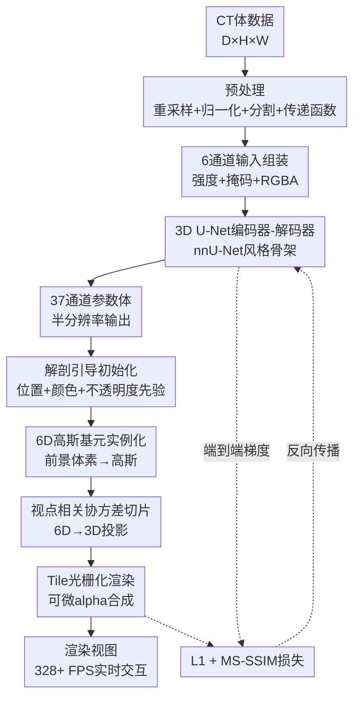

# Render-FM: Feedforward Model for Real-time Photorealistic Volumetric Rendering

**会议**: ECCV 2026  
**arXiv**: [2505.17338](https://arxiv.org/abs/2505.17338)  
**代码**: 无  
**领域**: 医学图像  
**关键词**: 体积渲染, 6D高斯泼溅, 前馈模型, CT可视化, 解剖引导初始化

## 一句话总结
Render-FM 提出一个基于 nnU-Net 风格 3D U-Net 的前馈模型，在单次 2.8 秒前向传播中直接从 CT 体数据回归 6D 高斯泼溅（6DGS）参数，消除逐扫描优化瓶颈（约 500 倍加速），并通过解剖引导初始化（AGP）将分割掩码和传递函数作为结构与外观先验，桥接自然场景重建与医学体积渲染的领域鸿沟，支持实时交互渲染（328+ FPS）和零额外开销的器官组合可视化。

## 研究背景与动机
CT 体积渲染通过合成任意视角的 3D 视图，显著提升诊断评估、手术规划和患者沟通的质量。然而，实现逼真体积渲染面临临床时间约束的根本障碍：传统直接体积渲染（DVR）虽可实时交互，但采用简化的局部光照模型，视觉效果有限；电影级渲染（Cinematic Rendering）和物理路径追踪虽能达到照片级真实感，但需要昂贵的逐帧光传输模拟，无法实时交互。近年来，NeRF 和 3D 高斯泼溅（3DGS）能以神经表示实现逼真质量，但两者都依赖逐扫描优化——3DGS 约需 30 分钟，NeRF 可延长至 10+ 小时，且优化前还需生成物理渲染训练视图（每视图约 18 秒），整个准备流程接近一小时，从根本上与临床时间约束冲突。

核心矛盾在于：逼真渲染质量要求复杂的视点相关光照效果（全局光照、软阴影、次表面散射），而临床场景要求秒级准备时间和实时交互——现有方法无法同时满足两者。大高斯模型（LGM）的前馈范式提供了突破思路：在大规模数据上训练的前馈网络可直接预测 3D 高斯参数，绕过逐场景优化。这一思路迁移到医学体积渲染具有天然优势——CT 提供稠密、结构化的 3D 输入，使前馈映射比从稀疏 2D 视图重建更易处理；大规模多机构 CT 数据集则提供学习可泛化解剖先验所需的广度。

本文的核心 idea：用 nnU-Net 启发的 3D U-Net 编码器-解码器作为前馈回归骨架，将 CT 体素直接映射为 6DGS 参数，同时引入解剖引导初始化（AGP）将分割掩码和传递函数作为结构化先验，使网络只需学习残差修正而非从零预测绝对参数，从而在 2.8 秒内完成从 CT 到可交互渲染的全流程。

## 方法详解

### 整体框架
Render-FM 的核心流程是将 CT 体数据通过单次前馈传播直接映射为 6DGS 参数，实现端到端的逼真体积渲染。输入是一个 6 通道 CT 体数据 $V \in \mathbb{R}^{C \times D \times H \times W}$（$C=6$），包含归一化 CT 强度（Hounsfield Unit）、分割掩码和四通道 RGBA 传递函数值；输出是一个 37 通道的参数体 $\Psi \in \mathbb{R}^{37 \times \lfloor D/2 \rfloor \times \lfloor H/2 \rfloor \times \lfloor W/2 \rfloor}$（半分辨率），每个空间位置编码一个潜在 6D 高斯基元的属性。推理时，分割掩码确定的前景体素被实例化为 6D 高斯，通过视点相关协方差切片和基于 tile 的可微光栅化进行实时渲染。整个管线由 L1 + MS-SSIM 渲染损失端到端监督。

### 关键设计

**1. 多通道输入与 nnU-Net 前馈回归：将 CT 体素直接映射为 6DGS 参数**

该设计解决的核心痛点是：传统 3DGS/NeRF 需要逐扫描优化，优化的高斯参数无法跨扫描迁移，且优化过程占用数十分钟到数小时。Render-FM 用一个 3D U-Net 将整个优化过程压缩为单次前馈推理。

具体来说，输入精心设计了 6 个通道以提供互补的解剖和外观信息：(1) 归一化 CT 强度（HU 值），捕获组织密度；(2) 分割掩码，标识前景结构；(3-6) 四通道 RGBA 值，由预定义传递函数为每个解剖类别编码基础颜色和不透明度。这种多通道设计将组织密度、语义身份和基础外观三类信息同时馈入网络，降低了网络从零学习这些先验的负担。编码器-解码器骨架遵循 nnU-Net 的设计原则：编码器交替堆叠两个 $3 \times 3 \times 3$ 卷积（Instance Normalization + Leaky ReLU）和 $2 \times 2 \times 2$ 最大池化进行下采样；解码器以转置卷积进行 $2 \times 2 \times 2$ 上采样，并通过跳跃连接拼接对应分辨率的编码器特征。最终 $1 \times 1 \times 1$ 卷积在每体素输出 37 个通道。选择 nnU-Net 而非通用 3D 骨干的原因是其在医学图像分割中已证明的跨机构、跨分辨率鲁棒性——CT 扫描的间距、视野和采集协议差异巨大，nnU-Net 的自适应归一化和分块策略天然适配这种临床变异性。

与 LGM 等自然场景前馈模型的关键区别在于：(1) Render-FM 处理的是稠密 3D CT 体素而非稀疏 2D 视图，输入信息量更大，映射更易学习；(2) 多通道输入将传递函数和分割信息作为显式条件而非隐式学习，提升了对未见传递函数的泛化能力。

**2. 解剖引导初始化（AGP）：桥接自然场景与医学体积渲染的领域鸿沟**

标准 3DGS 使用 SfM 稀疏点云或随机位置初始化高斯，这对医学体积数据完全不适配——它们无法利用临床管线中随手可得的分割标签、传递函数颜色和不透明度信息。即使 CT 特化的方法如 DDGS-CT 和 6DGS 用 marching-cubes 在 CT 密度上初始化，也仍然忽略了这些语义和外观先验。AGP 的核心思想是：既然 Render-FM 为每个体素预测一个 6D 高斯，那就在网络预测之前，先给每个体素一个物理上有意义的起点——位置直接设为体素世界坐标（通过体积仿射变换从体素索引映射得到），基础颜色和不透明度从预定义传递函数查表获得，语义类别从分割掩码分配。网络的任务因此从"预测绝对参数"转变为"在 AGP 有意义先验之上预测残差修正"。

AGP 的实际计算方式如下。对于颜色 $c_i$，网络预测球谐系数偏移量，与 AGP 基础 RGB 值组合得到最终颜色；对于不透明度 $\alpha_i = \sigma(\alpha_{\text{base}} + \Delta\alpha_i)$，将 AGP 先验 $\alpha_{\text{base}}$ 与预测残差 $\Delta\alpha_i$ 通过 sigmoid 融合，确保 $\alpha_i \in [0, 1]$。这种"先验 + 残差"的参数化使得优化景观更加平滑——网络不必同时学习几何定位和外观映射，而是分别从两个可靠来源获得粗粒度的解，再做细粒度修正。

消融实验明确证实 AGP 不仅是锦上添花，而是 Render-FM 的必要条件：去掉 AGP 后，前馈网络在训练中完全无法收敛。原因在于，同时为数十万个体素预测有意义的 6DGS 参数是高度欠定的——没有 AGP 提供的结构化起点，网络无法在巨大的参数空间中找到一个好的局部最小值。AGP 通过将每个高斯的空间、颜色和不透明度锚定到物理意义明确的初始值上，将欠定问题转化为适定的残差学习问题。

**3. 6DGS 参数预测与视点相关协方差切片：显式建模组织界面的散射和反射**

Render-FM 选择 6DGS 而非标准 3DGS，因为医学体积渲染中组织界面的视点相关效应（如各向异性反射、次表面散射）对逼真度至关重要，而 3DGS 的球谐函数表达能力有限。6DGS 在 6D 时空-角度空间中用 $6 \times 6$ 协方差矩阵 $\Sigma_i$ 同时建模 3D 位置和 3D 方向的方差。

网络在每个体素位置预测 37 个通道，具体分解为：均值方向 $\mu_d$（3 通道，位置 $\mu_p$ 固定为体素世界坐标，不预测）、球谐系数（$L=0$ 和 $L=1$ 共 12 通道，编码视点相关颜色）、不透明度偏移量（1 通道）、$6 \times 6$ 协方差矩阵的上三角元素（21 通道，6 个对角元素在 log 空间中预测以保证正定性，15 个非对角元素经 $\tanh$ 激活后用于 Cholesky 重建）。渲染时，给定相机位置 $\mathbf{p}$，对每个高斯 $i$ 计算视线方向 $\mathbf{v}_i = (\mu_{p,i} - \mathbf{p}) / \|\mu_{p,i} - \mathbf{p}\|$，然后将 $\Sigma_i$ 划分为空间块 $\Sigma_{pp}$、方向块 $\Sigma_{dd}$ 和交叉块 $\Sigma_{pd}$、$\Sigma_{dp}$，通过 Schur 补公式对视点条件化：

$$\mu'_{p,i} = \mu_{p,i} + \Sigma_{pd} \Sigma_{dd}^{-1} (\mathbf{v}_i - \mu_{d,i}), \quad \Sigma'_{pp,i} = \Sigma_{pp} - \Sigma_{pd} \Sigma_{dd}^{-1} \Sigma_{dp}$$

同时，不透明度被方向对齐因子 $w_i = \mathcal{N}(\mathbf{v}_i \mid \mu_{d,i}, \Sigma_{dd})$ 调制——当视线方向与高斯的方向分布中心对齐时，该高斯更"可见"；偏离时则被抑制。这个切片机制使得每个 6D 高斯能根据视点动态调整其空间均值、协方差和不透明度，显式捕获组织界面的视点相关光学效应，无需像 NeRF 那样用 MLP 隐式编码。

### 一个完整示例：从 CT 到交互式渲染的全流程

以一次典型推理为例。输入是一份腹部 CT 扫描，分辨率为 $512 \times 512 \times 400$，各向异性间距为 $0.7 \times 0.7 \times 3.0$ mm。预处理阶段：(1) 将体数据重采样到各向同性 $1.5$ mm 间距，得到约 $240 \times 240 \times 800$ 的规则网格；(2) 用 TotalSegmentator 生成 117 类的分割掩码，归并为 11 个语义组（骨骼、心血管、肺部等）；(3) 对每个语义组查预定义传递函数表，为每个体素赋值 RGBA 值（如骨骼在 180 HU 处为 $[255, 215, 140, 0.6]$）；(4) 将 CT 强度归一化到 nnU-Net 标准范围；(5) 将归一化 CT、分割掩码、RGBA 四通道堆叠为 6 通道输入，零填充到 32 的最近整数倍（如 $256 \times 256 \times 800$）。

组装好的 6 通道体积送入 3D U-Net，经过编码器 5 级下采样和解码器 5 级上采样（最终级除外，输出为半分辨率 $128 \times 128 \times 400$），产生 37 通道参数体。前景体素（由分割掩码标识，约 350,000 个）在半分辨率下提取对应的 37 维参数向量，然后上采样 2 倍恢复全分辨率体素坐标，经体积仿射变换映射为世界空间位置 $\mu_p$。每个体素按 AGP 策略实例化为一个 6D 高斯：均值方向 $\mu_d$ 和协方差 Cholesky 因子从预测参数中提取并重建 $\Sigma$，颜色 $c_i$ 为 AGP 基础 RGB 加预测球谐偏移，不透明度 $\alpha_i$ 为 $\sigma(\alpha_{\text{base}} + \Delta\alpha_i)$。350,000 个 6D 高斯通过视点相关协方差切片和 FlashGS 加速的 tile 光栅化，在 328+ FPS 下实时渲染任意视角。全过程从原始 CT 到可交互渲染完成仅需 2.8 秒，而逐扫描优化需约 1 小时。若需更高品质，可在预测的高斯上额外微调 300 次迭代（约 89 秒），PSNR 可从 27.30 dB 提升至 31.67 dB。

### 损失函数 / 训练策略

Render-FM 的核心设计选择是将 nnU-Net 的体积预测骨架与 6DGS 可微渲染管线统一为单个端到端可训练系统。渲染梯度直接从光栅化器反向传播到网络权重，使网络学会对视觉质量最优的 6DGS 参数，而非对某个中间代理损失最优。

具体训练方案：每个训练步，从 4 个随机采样视点渲染预测高斯，通过可微光栅化 $\hat{I} = R(\Theta, \mathbf{p})$ 生成图像，与离线 PBRT 物理渲染的真值图 $I_{gt}$ 比较。损失函数为像素级和感知损失的线性组合：

$$\mathcal{L} = \lambda_{L1} \mathcal{L}_{L1} + \lambda_{\text{SSIM}} \mathcal{L}_{\text{SSIM}}, \quad \mathcal{L}_{L1} = \|\hat{I} - I_{gt}\|_1, \quad \mathcal{L}_{\text{SSIM}} = 1 - \text{MS-SSIM}(\hat{I}, I_{gt})$$

权重设置为 $\lambda_{L1} = 0.8$，$\lambda_{\text{SSIM}} = 0.2$。使用 Adam 优化器（$\beta_1 = 0.9, \beta_2 = 0.999$），初始学习率 $1 \times 10^{-3}$，PolyLR 调度。受 GPU 显存限制，batch size 为 3 个体数据，配合自动混合精度（AMP）和梯度累积。在单张 NVIDIA A100 80GB 上训练约 3 天。数据增强包括随机强度偏移、高斯噪声和模拟采集伪影，提升对临床 CT 变异性的鲁棒性。训练数据采用 TotalSegmentator 数据集的 991 个扫描，真值渲染为 PBRT 生成的 $1600 \times 1600$ 物理渲染视图（每视图约 18.8 秒，每个扫描 120 个视图）。

## 实验关键数据

### 主实验

**Table 1: Render-FM 与基线方法定量对比**

| 数据集 | 类型 | 条件 | 方法 | SSIM | PSNR | LPIPS | 准备时间(s) | 高斯数 | FPS |
|--------|------|------|------|------|------|-------|------------|--------|-----|
| TotalSeg | ID | Seen TF | 6DGS | 0.912 | 26.63 | 0.096 | 1463.9 | 68,785 | 697.5 |
| TotalSeg | ID | Seen TF | 6DGS + AGP | 0.925 | 28.92 | 0.093 | 1786.5 | 135,827 | 575.6 |
| TotalSeg | ID | Seen TF | Render-FM | 0.919 | 27.30 | 0.097 | **2.8** | 343,058 | 328.6 |
| TotalSeg | ID | Seen TF | Render-FM + FT | **0.937** | **31.67** | **0.088** | 89.4 | 227,925 | 423.8 |
| CT-ORG | OOD | Seen TF | 6DGS | 0.903 | 25.97 | 0.105 | 1528.7 | 75,956 | 679.1 |
| CT-ORG | OOD | Seen TF | 6DGS + AGP | 0.926 | 29.36 | 0.091 | 2261.9 | 239,609 | 411.0 |
| CT-ORG | OOD | Seen TF | Render-FM | 0.918 | 26.21 | 0.092 | **2.6** | 586,225 | 245.2 |
| CT-ORG | OOD | Seen TF | Render-FM + FT | **0.940** | **32.48** | **0.082** | 136.2 | 469,969 | 275.1 |
| CT-ORG | OOD | Unseen TF | 6DGS | 0.908 | 26.59 | 0.103 | 1546.4 | 81,802 | 684.3 |
| CT-ORG | OOD | Unseen TF | Render-FM | 0.913 | 26.77 | 0.092 | **2.8** | 586,225 | 245.5 |
| CT-ORG | OOD | Unseen TF | Render-FM + FT | **0.936** | **31.91** | **0.083** | 133.4 | 462,219 | 277.5 |
| CT-ORG | OOD | Skeleton | 6DGS | 0.935 | 26.78 | 0.066 | 5146.0 | 76,848 | 602.0 |
| CT-ORG | OOD | Skeleton | Render-FM | 0.925 | 26.10 | 0.070 | **0.0** | 586,225 | 295.7 |
| CT-ORG | OOD | Skeleton | Render-FM + FT | **0.944** | **30.74** | **0.061** | 140.1 | 466,638 | 337.3 |

> ID: 域内（TotalSegmentator）；OOD: 域外（CT-ORG）；Seen TF: 训练中见过的传递函数；Unseen TF: 训练中未见的新传递函数；Skeleton: 仅骨骼的器官组合可视化；FT: 微调 300 次迭代。Render-FM 在 Skeleton 条件下的准备时间为 0.0 秒，因为只需按分割掩码选择性渲染已有高斯，无需任何重新处理。

### 消融实验

**Table 2: AGP 消融分析**

| 分析维度 | 发现 |
|---------|------|
| AGP 作为 6DGS 初始化 | 在 TotalSegmentator ID 上，6DGS + AGP 比原始 6DGS 提升 SSIM 0.912→0.925、PSNR 26.63→28.92；在 CT-ORG OOD 上同样一致提升（Seen TF: SSIM 0.903→0.926；Unseen TF: SSIM 0.908→0.924） |
| AGP 作为 Render-FM 必要条件 | 去掉 AGP 后 Render-FM 在训练中完全不收敛——证实 AGP 不是可选增强，而是将高度欠定的前馈预测问题转化为适定残差学习问题的结构性前提 |
| 为何 AGP 是必要条件 | 前馈网络需同时为数十万体素预测有意义的 6DGS 参数（37 维/体素），无结构化起点时优化景观过于崎岖；AGP 以物理意义明确的先验锚定每个高斯的空间位置、颜色和不透明度，网络仅需学习残差修正 |

### 关键发现
- **前馈速度优势压倒性**：Render-FM 将准备时间从约 1 小时降至 2.8 秒（约 500 倍加速），且渲染质量在无需逐扫描优化的条件下超越 6DGS 基线（ID: SSIM 0.919 vs. 0.912），证明了前馈范式的有效性。即使考虑 6DGS + AGP 的改进初始化，Render-FM 在 ID 上的 PSNR（27.30 vs. 28.92）略有差距，但在 500 倍加速下这一质量折衷在临床场景中极具吸引力。
- **微调提供灵活的精度-速度权衡**：89 秒可选微调使 Render-FM + FT 在所有条件下全面超越所有方法（ID: PSNR 31.67, OOD Seen TF: PSNR 32.48, OOD Unseen TF: PSNR 31.91），证实 Render-FM 的前馈预测本身就是高质量的初始化点，微调仅需 300 次迭代（远少于 6DGS 的 30,000 次）即可达到 SOTA。
- **泛化能力突出**：在 OOD 数据（CT-ORG）上，Render-FM 在零样本条件下仍优于逐扫描优化的 6DGS（SSIM 0.918 vs. 0.903），表明大规模预训练学到了可迁移的解剖先验。在未见传递函数下同样保持性能（SSIM 0.913 vs. 6DGS 0.908），多通道输入设计使模型对传递函数的"外观风格"具有泛化能力。
- **器官组合可视化是独特优势**：6DGS 为骨骼组合可视化需额外单独优化（准备时间膨胀至 5146 秒），而 Render-FM 因 AGP 已为每个高斯分配语义标签，仅需在渲染时按类别筛选高斯即可实现组合可视化，准备时间为零。这一能力对临床多器官对比分析有直接实用价值。
- **高斯数量与 FPS 的权衡**：Render-FM 预测的稠密高斯（30-60 万）比优化后的 6DGS（6-8 万）多约 5 倍，导致 FPS 从 600+ 降至 245-328，但仍远超实时交互阈值（30 FPS）。若需更高帧率，可在实例化后进行高斯剪枝（本文未探索）。

## 亮点与洞察
- **"先验 + 残差"的参数化策略**：AGP 不是简单地将语义信息作为附加输入，而是将其结构化为每个高斯的初始化锚点，将学习任务从"预测绝对参数"转化为"预测残差修正"。这种思路在医学影像领域特别有效，因为临床管线中解剖先验（分割、传递函数）随手可得，将其显式编码为网络设计的结构性约束而非让网络隐式学习，大幅降低了学习难度。该策略可迁移到其他医学成像模态的前馈预测任务（如 MRI 体积渲染、超声 3D 重建）。
- **端到端渲染损失直接监督 3D 表示**：Render-FM 最巧妙的设计选择是让渲染梯度直接流回 3D U-Net 权重，而非先预测高斯参数再用代理损失监督。这确保了网络学到的参数是"渲染-最优"的——网络可以学会在难以重建的区域（如血管细节、组织界面）分配更多高斯容量或调整协方差形状，而这些权衡在纯参数空间损失中无法体现。这一设计原则可推广至任何"预测 3D 表示→可微渲染→2D 监督"的前馈管线。
- **跨域泛化的实证验证含金量高**：论文在三个数据集（TotalSegmentator ID + CT-ORG OOD + CTPelvic1K OOD）、三种条件（Seen TF / Unseen TF / Skeleton composability）下统一对比，每个条件都含 4 种方法（6DGS / 6DGS+AGP / Render-FM / Render-FM+FT），实验设计严密且无选择性报告。特别是 Unseen TF 条件下 Render-FM 仍优于 6DGS，这有力反驳了"模型只是记住了训练传递函数的外观"的质疑。

## 局限与展望
- **仅验证 CT 模态**：作者承认当前工作仅聚焦 CT，Render-FM 管线原则上可扩展到 MRI 等其他体积模态，只需设计模态适配的输入通道和传递函数。MRI 的多序列特性和非标准化强度范围可能带来额外挑战。
- **高斯剪枝未探索**：Render-FM 的稠密预测导致高斯数量是优化方法的 5 倍，FPS 降低约一半。简单的基于不透明度或梯度的剪枝策略可能在不损失质量的前提下大幅减少高斯数并提升 FPS。这是一个低悬果实，可能作为后续工程优化。
- **训练数据覆盖的解剖多样性有限**：TotalSegmentator 虽包含 117 个解剖类别，但主要集中在胸腹部。头部（如鼻窦、内耳精细结构）和四肢的渲染质量未验证。CTPelvic1K 的零样本测试结果良好（SSIM 0.926），但盆腔的解剖复杂度低于头颈部。
- **传递函数的定义依赖领域专家**：AGP 的有效性前提是合理的传递函数设计，而传递函数直接影响基础颜色和不透明度先验的质量。对未见解剖结构或非常规成像协议，传递函数可能需要重新设计，这可能引入领域专家依赖。
- **前馈预测的"模糊"倾向**：定性结果显示 Render-FM 直接推理时偶尔出现轻微模糊，不如微调后清晰。这可能是 L1 + SSIM 损失在回归任务中倾向于"安全"的均值预测所致。引入对抗损失或感知损失可能缓解这一问题，但会增加训练复杂度。
- **与临床工作流的集成未讨论**：论文未涉及 Render-FM 如何嵌入现有 PACS/DICOM 阅片系统（如 3D Slicer、OsiriX），也未讨论 GPU 部署要求（当前需 A100 80GB 训练，推理 GPU 规格未明确说明）。这些是临床落地的前提条件。

## 相关工作与启发
- **vs 6DGS (Gao et al., 2024)**: 6DGS 是本文的直接基线，其 6D 时空-角度协方差建模被 Render-FM 完整继承。核心区别在于 Render-FM 将 6DGS 的逐扫描优化替换为前馈回归，并引入 AGP。Render-FM 展示了一条清晰的技术演进路径：优化的神经表示 → 前馈大规模预测。
- **vs LGM / GRM (Tang et al., 2024; Xu et al., 2024)**: 大高斯模型的核心理念——在大规模数据上训练前馈网络替代逐场景优化——被 Render-FM 迁移到医学体积渲染。关键区别在于输入模态（CT 体素 vs. 稀疏 2D 视图）和域特化先验（分割掩码 + 传递函数）。Render-FM 证明了前馈范式的跨域普适性。
- **vs Cinematic Rendering**: 电影级渲染通过物理路径追踪实现照片级真实感，但每帧需秒级计算。Render-FM 达到了可比较的视觉质量（PSNR 27-32 dB vs. 物理渲染真值），同时实现实时帧率。可视为"学习到的电影级渲染"——用 6D 高斯近似复杂光传输。
- **vs nnU-Net (Isensee et al., 2021)**: Render-FM 将 nnU-Net 从分割任务重新定位到参数回归任务，证明了其自配置架构在分割之外的适用性。这提示 nnU-Net 骨架可作为医学图像到参数的任何密集预测任务的强基线。

## 评分
- 新颖性: ⭐⭐⭐⭐ 将 LGM 前馈范式迁移到医学体积渲染 + 6DGS 参数回归的组合新颖，AGP 桥接领域鸿沟的思路巧妙且实验证明为必要条件
- 实验充分度: ⭐⭐⭐⭐⭐ 三数据集 × 三条件 × 四方法的全矩阵对比设计严密；消融实验明确证实 AGP 的必要性（去掉即不收敛）；附录包含额外跨数据集验证和完整传递函数定义，可复现性高
- 写作质量: ⭐⭐⭐⭐ 方法部分逻辑清晰，6DGS 的协方差切片公式和 AGP 的先验-残差融合都给出了精确的数学定义；定性图有效展示了噪声伪影差异；部分细节（如输出半分辨率的原因、37 通道的具体排列）在正文中未充分展开
- 价值: ⭐⭐⭐⭐⭐ 将体积渲染准备时间从小时级降至秒级且维持逼真质量，对临床实时 3D 可视化有直接实用价值；前馈 + 可选微调的两阶段设计灵活适配不同临床场景；器官组合可视化的零额外开销特性是临床工作流的独特增益

<!-- RELATED:START -->

## 相关论文

- [\[NeurIPS 2025\] Generalizable, Real-Time Neural Decoding with Hybrid State-Space Models](../../NeurIPS2025/medical_imaging/generalizable_real-time_neural_decoding_with_hybrid_state-space_models.md)
- [\[AAAI 2026\] PulseMind: A Multi-Modal Medical Model for Real-World Clinical Diagnosis](../../AAAI2026/medical_imaging/pulsemind_a_multi-modal_medical_model_for_real-world_clinical_diagnosis.md)
- [\[ECCV 2026\] 3D Field of Junctions: A Noise-Robust, Training-Free Structural Prior for Volumetric Inverse Problems](3d_field_of_junctions_a_noise-robust_training-free_structural_prior_for_volumetr.md)
- [\[ICLR 2026\] MedGMAE: Gaussian Masked Autoencoders for Medical Volumetric Representation Learning](../../ICLR2026/medical_imaging/medgmae_gaussian_masked_autoencoders_for_medical_volumetric_representation_learn.md)
- [\[ECCV 2026\] BrainFIBRE: A Foundation Model via Information Decomposition for Brain Microstructure](brainfibre_a_foundation_model_via_information_decomposition_for_brain_microstruc.md)

<!-- RELATED:END -->
