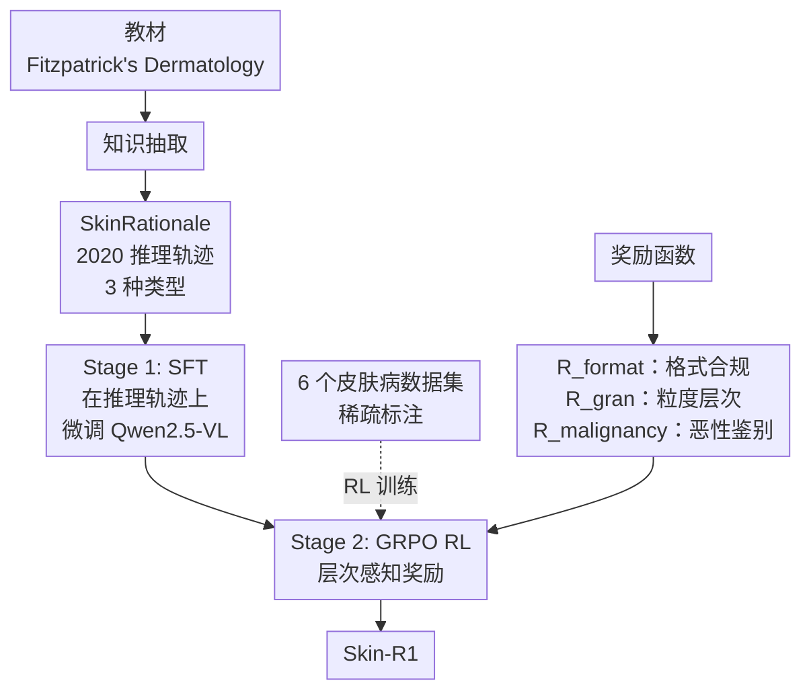

# Skin-R1：教材知识引导的皮肤病诊断视觉语言模型

**会议**: ECCV 2026  
**arXiv**: [2511.14900](https://arxiv.org/abs/2511.14900)  
**代码**: [https://github.com/l593191569/Skin-R1](https://github.com/l593191569/Skin-R1)  
**领域**: 医学图像  
**关键词**: 皮肤病诊断, 视觉语言模型, 教材知识蒸馏, 强化学习, 层次化奖励

## 一句话总结
Skin-R1 提出 SFT + RL 两阶段训练范式，先从权威皮肤病学教材中合成层次化诊断推理轨迹进行 SFT 预热，再通过带层次感知奖励的 GRPO 强化学习将推理能力泛化到大规模稀疏标注数据集，在多基准上显著超越 SOTA 医学 VLM。

## 研究背景与动机

皮肤病诊断本质上是一项视觉推理任务：临床医生需要解读细微的皮肤镜图像体征，将其映射到疾病分类学的层次结构中，并在视觉相似的疾病之间进行鉴别诊断（DDx）。近年来多模态大模型（VLM）在医学图像理解上展现了潜力，但现有的皮肤病 VLM 面临三个核心障碍：一是数据异质性，不同数据集的标注体系差异极大，SkinCon 只有 29 个概念注释和良/恶性两类标签，而 DermNet 覆盖 600+ 疾病却缺乏结构化概念注释，不一致的监督信号导致训练噪声；二是缺乏专家级别的推理监督，现有数据集几乎不提供层次化诊断推理过程的标注，模型往往学到的是浅层视觉关联而非临床推理逻辑；三是训练范式的可扩展性有限，在小型密集标注数据集上训练的模型迁移到大规模稀疏标注数据时性能严重退化。

这些矛盾的深层根源在于：皮肤病诊断是在层次化的疾病空间上的推理问题——从粗粒度分类逐步缩小到细粒度确诊，同时排除视觉相似的混淆病种。现有范式要么在小数据集上做密集标注（可获得推理监督但规模有限），要么在大数据集上使用弱标签（规模够了但缺乏可依赖的推理信号），始终无法兼得。Skin-R1 的切入点是：能否从权威教材这一可靠的知识源中提取诊断推理轨迹作为"种子"监督，再通过强化学习让模型自行在大规模稀疏数据上泛化这种推理能力？**核心 idea：构建三阶段管线——先从教材中合成层次化和鉴别诊断感知的推理轨迹，用 SFT 为模型注入临床推理基础，再通过 GRPO 配合层次感知奖励，让推理能力从密集标注的小数据泛化到稀疏标注的大数据。**

## 方法详解

### 整体框架

Skin-R1 的训练管线分为三个串联阶段。第一阶段从权威教材 Fitzpatrick's Dermatology 中提取三类知识：220 个诊断范例（含临床图像、文本推理过程和确诊标签）、鉴别诊断图（211 个节点、245 条边，记录视觉相似疾病之间的混淆关系）和疾病分类树（458 个节点、473 条边，反映从粗到细的分类层级）。基于这些知识合成 2020 条推理轨迹，构成 SkinRationale 数据集。第二阶段在 SkinRationale 上对 Qwen2.5-VL-7B 进行 SFT，让模型学会结构化的临床推理过程。第三阶段使用 GRPO 强化学习，在 6 个大规模临床数据集（PAD-UFES-20、DermNet、BCN20000 等，共 26,507 训练样本）上做策略优化，奖励函数包含格式合规性、诊断粒度和恶性分类三个维度——其中粒度奖励显式利用了疾病分类树的层次结构，鼓励模型在正确的分类路径上尽量做出细粒度诊断。

### 关键设计

**1. 教材知识驱动的诊断推理轨迹合成**

构建可依赖的推理轨迹是整套方法的基础，也是与现有 RL-only 医学 VLM 最根本的区别。作者从教材中提取三类互补的结构化信息：诊断范例三元组（图像、推理过程、诊断标签）、鉴别诊断图（DDx Graph，记录哪些疾病在临床上容易混淆）和疾病分类树（Taxonomy，反映疾病从粗到细的层次关系）。基于此，进一步合成三种推理轨迹：Type 1 是最直接的"图像 → 推理 → 诊断"映射（220 条），Type 2 引入鉴别诊断但不修改最终结论（900 条，模拟"看了混淆病种后仍然坚持正确诊断"的稳定推理），Type 3 则模拟临床中常见的修正推理——模型先给出一个初步诊断，在与混淆病种对比后意识到错误并修正为正确答案（900 条，模拟"反思修正"）。三种轨迹各有侧重：Type 1 建立基础映射，Type 2 训练抗混淆能力，Type 3 训练反思修正能力。值得注意的是，作者刻意选择从教材中提取而非用大语言模型生成推理轨迹，因为后者可能包含部分错误并导致模型崩溃或幻觉传播——教材提供的是稳定、经过专家审校的监督信号。

**2. 层次感知的 GRPO 奖励设计**

强化学习阶段的奖励函数包含三个分量，总和作为 GRPO 的优化信号。格式合规奖励 $R_{\text{format}}$ 是 0/1 二值信号，只要输出满足预定义的结构标签即得 1 分，确保模型输出可解析的诊断结果。粒度奖励 $R_{\text{gran}}$ 是核心创新：当模型预测的标签落在真实诊断的分类路径上时，按其在树中的深度给予 $0.75 \times i^* / L$ 的奖励（$i^*$ 为匹配深度，$L$ 为路径总深度），例如对于"浅表扩散性黑色素瘤"（路径长度 4），若模型只预测到"黑色素瘤"（深度 3）则得 $0.75 \times 3/4 = 0.5625$，若预测到最细粒度则得满分 0.75。这种设计鼓励模型在正确的疾病分支上尽可能做出细粒度诊断，而不是满足于粗糙的类别猜测。恶性分类奖励 $R_{\text{malignancy}}$ 在模型正确判断良/恶性/原位癌时给予 0.25 的额外奖励，强化临床最关键的粗粒度分类能力。三个奖励从粗到细层层递进，引导模型在正确的诊断路径上不断精细化。

**3. SFT 奠基 + RL 泛化的两阶段协同**

作者通过消融实验验证了一个关键结论：高质量的 SFT 预热是 RL 有效性的前提。直接将 GRPO RL 应用于基座模型（跳过 SFT）虽然比基座有提升，但其最佳性能始终显著低于完整管线（在 HAM10000 上 ID 准确率 58.43% vs 63.85%）。这意味着 RL-only 方法（如 MedVLM-R1、Med-R1）虽然在接近零监督的条件下能诱导出一定的推理行为，但缺乏教材驱动的临床推理知识作为锚点，RL 优化容易走偏——模型可能学到看似合理的推理模式，实际却是启发式的、甚至产生幻觉。SFT 阶段为 RL 提供了结构化的推理先验，RL 阶段则在更大规模的数据上对这些推理模式做细化和泛化。此外，去掉层次化奖励后 OOD 性能显著下降（ID 63.79%→63.86%，但 OOD 63.86%→71.71%），说明粒度奖励在跨数据集泛化中起到了关键作用——它迫使模型在层次化的疾病空间中推理，而不是记忆特定数据集的标签分布。

### 损失函数 / 训练策略

SFT 阶段使用标准的自回归交叉熵损失，在 2020 条推理轨迹上训练 4 个 epoch，学习率 $3\times 10^{-5}$。RL 阶段使用 GRPO 目标函数：

$$\mathcal{L}_{\text{GRPO}} = \mathbb{E}_x\left[\frac{1}{K}\sum_{j=1}^K \min(\rho_j A_j, \text{clip}(\rho_j, 1-\varepsilon, 1+\varepsilon)A_j)\right] - \beta\,\text{KL}(\pi_\theta \| \pi_{\text{ref}})$$

其中组大小 $K=4$，采样温度 1.0。基座模型为 Qwen2.5-VL-7B-Instruct，SFT 和 RL 均使用 LoRA（$r=64, \alpha=32, \text{dropout}=0.1$），在两张 NVIDIA A100 (40GB) 上训练。

## 实验关键数据

### 主实验

| 设置 | 数据集 | 指标 | Skin-R1 | 次优模型 | 基座 Qwen2.5-VL-7B |
|------|--------|------|---------|----------|---------------------|
| ID 疾病诊断 | BCN20000 | Acc | **0.6345** | 0.4911 (基座) | 0.4911 |
| ID 疾病诊断 | HAM10000 | Acc | **0.7214** | 0.6671 (RL w/o SFT) | 0.5162 |
| ID 疾病诊断 | PAD-UFES-20 | Acc | **0.6573** | 0.5813 (RL w/o SFT) | 0.5033 |
| ID 平均 | 6 数据集 | Acc | **0.6385** | 0.4430 (InternVL3-8B) | 0.4367 |
| OOD 疾病诊断 | 5 数据集平均 | Acc | **0.7171** | 0.6887 (MedGemma-4B) | 0.5027 |
| 病变分类 | 6 数据集 | Acc/F1 | **0.6928 / 0.4287** | 0.6658/0.4254 (RL w/o SFT) | 0.3698/0.2910 |

### 消融实验

| 配置 | ID 平均 Acc | OOD 平均 Acc | ID 病变 Acc | ID 病变 F1 |
|------|------------|-------------|------------|-----------|
| 完整 Skin-R1 (1500步) | **0.6385** | **0.7171** | **0.6928** | **0.4287** |
| 仅 SFT（无 RL） | 0.4743 | 0.5153 | 0.6271 | 0.3868 |
| RL w/o SFT | 0.5843 | 0.5674 | 0.4602 | 0.3414 |
| RL + 标准奖励（无层次） | 0.6379 | 0.6386 | 0.6658 | 0.4254 |

### 关键发现

- **SFT 是 RL 的基石**：跳过 SFT 直接 RL，ID 和 OOD 性能分别从 0.6385/0.7171 降至 0.5843/0.5674，降幅显著。基座模型约 30% 的 ID 预测因输出格式不符而无效，SFT 后仅 2%，说明轨迹监督同时建立了格式对齐和推理基础。
- **粒度奖励提升泛化**：将层次感知奖励替换为简单二值奖励（预测正确即得 1），OOD 准确率从 0.7171 降至 0.6386，说明层次结构迫使模型学习通用的诊断推理模式，而非数据集的浅层统计关联。
- **跨人群公平性**：在 Fitzpatrick 肤色分型 VI 型上准确率降至 0.4828（平均 0.5254），提示训练数据可能存在肤色分布偏倚。
- **基线偏见**：MedGemma-4B 有强烈的前癌细胞类别偏好（8390 个预测中 7860 个判为"原位癌"），LLaVA-Med-7B 偏向良性类别，说明无推理监督的医学 VLM 易学习数据集偏见。

## 亮点与洞察

- **教材知识的高杠杆率**：仅从教材提取 220 个诊断范例就合成了 2020 条推理轨迹，却让模型在 26,507 条大规模稀疏标注数据上实现了显著的泛化提升——这是典型的"小种子做大文章"，证明了结构化知识蒸馏的高性价比。
- **层次化奖励的巧思**：不以"是否猜对最终标签"作为唯一奖励信号，而是对分类路径上的任意层次给予部分奖励（$0.75 \times \text{depth}/\text{max_depth}$）。这实际上是将疾病分类树的层次结构作为连续学习信号注入 RL，迫使模型学习"在正确分支上逐步细化"的推理模式。
- **轨迹类型设计的临床直觉**：三种轨迹（直接映射/抗混淆/反思修正）分别对应临床诊断的三种核心认知过程，尤其是 Type 3 的"修正轨迹"——让模型练习了最接近真实临床场景的能力：先给出初步判断，在与混淆病种对比后自我修正。
- **OOD 泛化的真实价值**：OmniMedVQA 的皮肤镜子集包含来自完全不同的数据收集协议的图像（Fitzpatrick17k、ISIC 系列等），Skin-R1 在此类 OOD 设置下仍实现 0.7171 准确率（次优 0.6887），说明泛化能力来自于推理模式的迁移而非记忆。

## 局限与展望

- **推理链路的保真度未量化**：奖励信号和评估指标都是答案级别的（多项选择准确率），推理轨迹的正确性仅在定性层面检查，缺乏对中间推理步骤保真度的系统性量化评估。在更开放的临床场景中，如何确保模型生成的推理过程本身是忠实于视觉证据的，仍是一个开放问题。
- **静态知识结构限制适应性**：分类树和 DDx 图在训练前从教材中固定提取，在整个训练过程中不变。对于特定数据集特有的疾病分类体系（如 DERM12345 的三层分类），模型可能无法灵活适应。此外，这些结构也用于生成评估中的干扰选项，导致 ID 评估与训练存在耦合。
- **单一基座模型验证**：当前仅在 Qwen2.5-VL-7B 上验证，该 SFT+RL 配方是否有效迁移到其他 VLM 基座（特别是医学专用基座）尚未研究。与更多皮肤病专用基础模型的对比也待补充。
- **公平性问题**：在 Fitzpatrick VI 型（深肤色）上性能略有下降，反映了训练数据的肤色分布偏倚。未来需要引入公平性感知训练和领域自适应策略。

## 相关工作与启发

- **vs MedVLM-R1 / Med-R1**：这些方法直接在基座上应用 GRPO，跳过 SFT 推理轨迹监督。Skin-R1 通过消融证明 RL-only 方案性能显著低于 SFT+RL 管线，说明教材级推理轨迹提供了 RL 无法替代的推理先验知识。
- **vs MedGemma**：MedGemma 也融合了多源监督（SFT+蒸馏+RL），但不含层次化的诊断推理监督。Skin-R1 的 DDx 意识和层次分类意识（表 1）是其独特优势。
- **启发**：这种"小规模结构化知识 → SFT 注入推理先验 → RL 大规模泛化"的范式可迁移到其他医学诊断领域（病理学、放射学），其核心思想是用可靠的结构化知识源替代不可控的大模型生成作为推理监督，再用 RL 放大这种推理能力。

## 评分

- **新颖性**: ⭐⭐⭐⭐⭐ 将教材知识蒸馏、层次化推理轨迹 SFT 和 GRPO RL 三者系统性地整合进皮肤病诊断训练管线，特别是层次感知奖励的设计和三种轨迹类型的划分，具有明显的原创性。
- **实验充分度**: ⭐⭐⭐⭐⭐ 覆盖 6 个 ID 数据集 + 5 个 OOD 数据集 + 3 个任务设置，消融实验逐一验证了 SFT、RL、层次奖励的贡献，还包含 DDx 专项评估和肤色公平性分析。
- **写作质量**: ⭐⭐⭐⭐ 结构清晰、技术细节充分，但 Appendix 篇幅过大（算法伪代码 + 详细的轨迹合成流程），正文中某些关键公式（如 $R_{\text{gran}}$ 的计算示例）可以更清晰。
- **价值**: ⭐⭐⭐⭐⭐ 直接回应了医学 VLM 当前最突出的"推理监督稀缺"和"跨数据集泛化难"两个实际问题，为将可靠的结构化医学知识融入大模型训练提供了可复现的范式。
