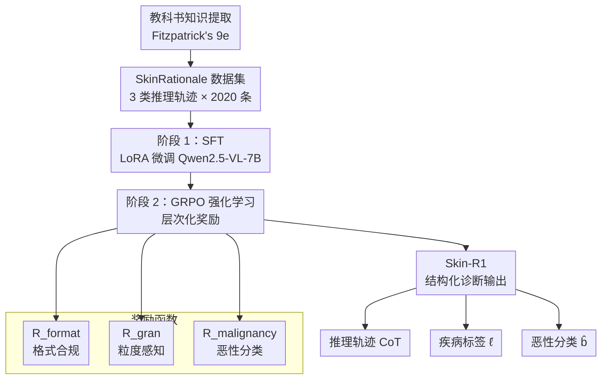

# Skin-R1: Clinical Knowledge-Guided Dermatological Diagnosis Using Vision-Language Models

**会议**: ECCV 2026  
**arXiv**: [2511.14900](https://arxiv.org/abs/2511.14900)  
**代码**: [https://github.com/l593191569/Skin-R1](https://github.com/l593191569/Skin-R1)  
**领域**: 医学图像  
**关键词**: 皮肤病诊断, 视觉语言模型, 强化学习, 教科书知识蒸馏, 差分诊断

## 一句话总结
Skin-R1 将**教科书依据的诊断推理轨迹**（层次化疾病分类 + 差分诊断）与 **GRPO 强化学习** 结合，让 VLM 先通过 SFT 学会专家推理模式、再通过层次化奖励设计将推理能力泛化到大规模稀疏标注数据，在多个皮肤病诊断基准上超越现有的 Med-VLM。

## 研究背景与动机

皮肤病诊断本质上是**视觉推理**任务：临床医生通过观察皮肤病变的细微视觉模式，对照层次化的疾病分类体系（如黑色素瘤→浅表扩散性黑色素瘤），再结合差分诊断（DDx）排除视觉上相似的疾病。近年来多模态视觉语言模型在这类任务上展现出潜力，但如何让 VLM 做到可信赖的临床诊断推理仍面临严峻挑战。

现有方法的核心矛盾在于**数据与推理之间的鸿沟**。真实世界的皮肤科数据集存在严重的**异质性**：SkinCon 只提供 29 个视觉概念标注但仅区分良恶性，DermNet 覆盖 600+ 种疾病却缺少结构化概念标注。同时，这些数据集几乎从不包含临床推理过程的监督信号——医生为什么这样看、为什么要排除哪些疾病、最终怎么下结论，这些**推理轨迹**在现有数据中完全缺失。更棘手的是，密集标注的小数据集（如教科书案例）与大尺度稀疏标注的数据集（如临床图像集合）之间存在**迁移鸿沟**：在小规模高质量数据上训练好的推理能力，很难直接泛化到大规模异构数据。

本文的切入角度是：既然推理能力难以直接学习，那就从权威教科书中自动提取可验证的推理轨迹，先让模型通过 SFT 学会这些专家推理模式，再用强化学习的**层次化奖励**推动模型将这些能力泛化到大规模稀疏数据上。**核心 idea：将教科书依据的诊断推理轨迹（层次感知 + 差分诊断）作为 SFT 冷启动监督，再以 GRPO 配合层次化疾病分类奖励（粒度感知 + 恶性分类）实现推理能力的规模化泛化。**

## 方法详解

### 整体框架

Skin-R1 是一个三阶段训练流水线。第一阶段从权威皮肤病学教科书 Fitzpatrick's Dermatology（9e，399 页）中自动提取诊断知识，构建 2,020 条推理轨迹数据集 SkinRationale，涵盖三种轨迹类型（直接映射、保持原诊断的 DDx 推理、修正原诊断的反思式 DDx 推理）。第二阶段在 SkinRationale 上对基础模型 Qwen2.5-VL-7B-Instruct 进行 LoRA SFT，建立临床依据的推理基础。第三阶段用 GRPO 进行强化学习，通过层次化奖励函数引导模型将推理能力泛化到大规模稀疏标注数据集。模型输出结构化的诊断响应，包含推理轨迹、疾病标签和恶性分类（良性/恶性/原位癌）。

### 关键设计

**1. 教科书知识提取与三类推理轨迹构建：从静态知识到动态推理过程**

Fitzpatrick's Dermatology 是权威皮肤病学教科书，但其知识是静态的描述性文本，无法直接用作训练数据。本文设计了一套自动提取流水线：先从 PDF 中提取图像和文本块，用 EfficientNet 做层次聚类剔除图表类非病灶内容，然后基于空间邻近和正则表达式做图文配对，再用 GPT-4.1-mini 从每个配对中提取诊断规则（视觉发现→诊断结论的映射）。最终产出 220 个诊断样例（图像 + 推理 + 标签）、一张 211 节点/245 边的差分诊断图 $\mathcal{G}_{DDx}$（连接容易混淆的疾病）和一张 458 节点/473 边的疾病分类树 $\mathcal{T}_{tax}$。

仅凭这 220 个样例直接做 SFT 显然不够。关键创新在于将其**扩充为三种类型的推理轨迹**，每种 220/900/900 条，总共 2,020 条：

- **Type 1（直接映射）**：图像→推理→诊断，最简单的单项推理。
- **Type 2（保持原诊断的 DDx 推理）**：给定主诊断 $d_p$，从 $\mathcal{G}_{DDx}$ 中选取一个差分诊断候选 $d_d$（若无则随机采样），由 LLM 生成对比性推理语句 $\rho = \text{LLM}(r_p, r_d, d_p)$ 说明为什么是 $d_p$ 而不是 $d_d$，但最终诊断不变。这教会模型**在面对鉴别诊断时的推理信心**。
- **Type 3（反思式修正的 DDx 推理）**：与 Type 2 类似，但最终诊断**修订为**差分诊断 $d_d$，模拟临床中初诊错误后修正的过程，教会模型**反思与纠错能力**。

这里一个实用技巧是设计了**层次化 DDx 回退机制**（ResolveDDXNeighbor）：当某疾病在 $\mathcal{G}_{DDx}$ 无邻居时，递归查找其分类树父节点或子节点的邻居，尽可能保证每对样本都有临床相关的鉴别诊断对象。

**2. 层次感知 SFT：从模仿推理到建立推理基础**

直接用 2,020 条推理轨迹对 Qwen2.5-VL-7B 做 LoRA SFT（rank=64，alpha=32），训练目标为标准自回归交叉熵：

$$L = -\sum_{i=1}^{n} \log \pi_\theta(x_i \mid x_{<i}, I, p)$$

这一步看似简单，但消融实验证明它至关重要。纯 SFT 模型已在 ID 诊断上超越基座模型（Avg.0.474 vs 0.437），更关键的是**输出格式合规性**从基座模型的 ~70% 跃升至 ~98%。这意味着在没有 SFT 冷启动的情况下，RL 训练一开始就要处理大量格式异常的响应，奖励信号的效率极低。这一观察与 MedVLM-R1 等纯 RL 方法的结论形成鲜明对比——后者认为 SFT 可能引入「记忆捷径」，但本文的消融明确显示：**只有在高质量、临床依据的推理轨迹上做 SFT，RL 才有更高的天花板**（全文 Skin-R1 在任何 RL 步数都优于纯 RL without SFT 的实际）。

**3. 层次化 GRPO 奖励设计：用分类树深度调教推理粒度**

GRPO 是 DeepSeek-R1 使用的策略优化方法，核心特征是不依赖评论家模型，而是对每个输入 $x$ 采样 $K$ 个响应 $y^{(j)}$ 组成组，在组内做优势归一化 $A_j = (r_j - \mu)/\sigma$，然后用 PPO-clip 风格的目标做策略更新。

本文的贡献在于**奖励函数的层次化设计**，它由三部分组成：

$R_{\text{total}} = R_{\text{format}} + R_{\text{gran}} + R_{\text{malignancy}}$

- **格式合规奖励 $R_{\text{format}}$**：若输出含有要求的标签结构则为 1，否则 0。它是一个二值约束，确保模型输出可解析的结构化响应。
- **粒度感知奖励 $R_{\text{gran}}$**：这是核心。若预测标签 $\hat{\ell}$ 位于真实诊断的分类路径 $\mathcal{P}$ 上，则奖励为 $0.75 \times i^*/L$，其中 $i^*$ 是匹配节点在路径中的深度、$L$ 是路径全长。例如真实诊断为"浅表扩散性黑色素瘤"（路径：肿瘤→黑色素细胞→黑色素瘤→浅表扩散性黑色素瘤，$L=4$），若模型只预测了"黑色素瘤"（$i^*=3$），则获 $0.75 \times 3/4 = 0.5625$；若预测了最精确的"浅表扩散性黑色素瘤"则获 $0.75$。这个奖励设计鼓励模型在**不超出证据的情况下尽量精确**——说不对会得 0，说太粗（高一层分类）会得分打折。
- **恶性分类奖励 $R_{\text{malignancy}}$**：若恶性分类（良性/恶性/原位癌）正确则加 0.25。这是一个相对粗粒度但临床至关重要的二值判断，确保模型不忽略病变的危险等级。

$$\begin{aligned}
R_{\text{gran}} &= \begin{cases}
0.75 \cdot i^* / L, & \text{if } \hat{\ell} \in \mathcal{P} \\
0, & \text{otherwise}
\end{cases} \\
R_{\text{malignancy}} &= \begin{cases}
0.25, & \text{if } \hat{b} = b^* \\
0, & \text{otherwise}
\end{cases}
\end{aligned}$$

消融实验显示，将 $R_{\text{gran}}$ 替换为二值正确/错误奖励会显著降低 OOD 泛化能力（Avg.0.639 vs 0.717），说明粒度感知奖励通过鼓励模型在整个分类树上做推理，间接提升了跨疾病类别的泛化性。

### 损失函数 / 训练策略

SFT 阶段用标准交叉熵，4 epoch，batch size 16，学习率 $3 \times 10^{-5}$。RL 阶段用 GRPO（组大小 $K=4$，温度 1.0），batch size 16，学习率 $1 \times 10^{-5}$，1 epoch（1,500 步），参考模型从 SFT checkpoint 初始化。所有训练在 2×A100-40G 上完成，LoRA rank=64，图像分辨率上限 448×448。

## 实验关键数据

### 主实验

| 任务 | 数据集 | 指标 | 本文 | 之前SOTA | 提升 |
|------|--------|------|------|----------|------|
| ID 疾病诊断（6 个数据集平均） | BCN20k/HAM10k/PAD/Derm12345/Derm7pt/DermNet | Acc | 0.6385 | 0.4430 (InternVL3-8B) | +0.1955 |
| OOD 疾病诊断（5 个数据集平均） | ISBI16/ISIC18/ISIC19/ISIC20/Monk22 | Acc | 0.7171 | 0.6887 (MedGemma-4B) | +0.0284 |
| 病变分类平均（Acc） | BCN20k/HAM10k/PAD/Derm12345/Derm7pt/DermNet | Acc | 0.6928 | 0.6631 (LLaVA-Med-7b) | +0.0297 |
| 病变分类平均（Macro-F1） | 同上 | F1 | 0.4287 | 0.3654 (Qwen2.5-VL-32B) | +0.0633 |

Skin-R1 在所有评价设置上均取得最优结果。值得注意的是，**OOD 平均准确率高于 ID**（0.717 vs 0.639），说明层次化奖励设计有效推动了模型对未见疾病类别的泛化推理，而非仅仅记忆训练集模式。

### 消融实验

| 配置 | ID Avg Acc | OOD Avg Acc | 说明 |
|------|-----------|-------------|------|
| Qwen2.5-VL-7B（基线） | 0.4367 | 0.5027 | 基座模型，格式合规率仅 ~70% |
| + SFT（仅 SkinRationale） | 0.4743 | 0.5153 | SFT 提升有限但格式合规率升到 ~98% |
| + RL without SFT | 0.5843 | 0.5674 | 纯 RL 比基线显著提升，但低于完整管线 |
| + RL with standard reward（将 $R_{\text{gran}}$ 换为二值正确/错误） | 0.6379 | 0.6386 | 标准奖励在 ID 尚可但 OOD 掉 8 个点 |
| **Skin-R1（完整，1,500 步）** | **0.6385** | **0.7171** | 完整管线，OOD 优势突出 |

### 关键发现

- **SFT 是 RL 的引擎而非瓶颈**：纯 RL 虽然能从基线 0.437 提升到 0.584，但无论如何达不到完整管线的 0.639，且训练曲线显示纯 RL 收敛更慢。高质量 SFT 冷启动让 RL 在正确的推理空间内搜索，而非从头探索。
- **粒度感知奖励的泛化效应**：替换为二值奖励后 OOD 从 0.717 骤降到 0.639。粒度奖励迫使模型对不同层次的疾病类别都有区分能力，这种层次敏感度在面对未见过疾病时天然更鲁棒。
- **差分诊断能力的靶向评价**：在专门构建的 DDx 诊断测试（干扰项为 $\mathcal{G}_{DDx}$ 中的混淆疾病）和层次诊断测试（干扰项为分类树中的祖先节点）中，Skin-R1 均显著优于基线，证实层次化奖励训练出的推理不仅仅是「记住了对的标签」，而是形成了真正的鉴别诊断和分类意识。
- **Fitzpatrick 皮肤类型偏差**：在 Fitzpatrick V/VI 型深色皮肤上准确率略有下降（~0.483 vs 浅色皮肤的 0.549），提示训练数据存在肤色分布偏斜。

## 亮点与洞察

- **从静态教科书知识到动态推理轨迹的桥接**是最具工程巧思的设计：220 个样本通过三种轨迹类型（直接/保持/反思）和 DDx 回退机制膨胀为 2,020 条训练轨迹，让有限的专家知识在训练中发挥最大效用。Type 3 反思式轨迹尤其难得，它模拟了临床中常见的初诊→鉴别→修正的过程。
- **奖励的层次化设计是泛化的关键推手**。$R_{\text{gran}}$ 不是简单的对/错，而是根据分类树深度给予部分奖励——这一设计巧妙地将「分类精细化程度」直接编码进奖励信号，让模型在 RL 过程中自发地学会对疾病类别做多粒度推理，消融实验中 OOD 的 0.0785 差距（0.717 vs 0.639）已充分说明其效果。
- **SFT + RL 的阶段性分工清晰**：SFT 解决「怎么做推理」（格式合规 + 推理结构），RL 解决「往什么方向优化推理」（诊断精度 + 层次泛化）。这个分工在实验中得到充分验证——缺少前者导致 RL 早期大量无效探索，缺少后者导致推理止步于训练集分布。

## 局限与展望

- **推理过程的质量没有直接监督**：奖励信号仅基于最终答案的正确性和粒度，对推理轨迹 CoT 本身是否忠实、是否含有幻觉不做惩罚。作者承认定性分析发现了部分过度依赖规则推理的案例。
- **分类树和 DDx 图是固定不变的**：它们同时用来训练模型和构造评价的干扰项，导致 ID 评价部分反映的是「与固定知识体系的一致性」而非真正的临床能力。好在 OOD 评价（OmniMedVQA）不受此耦合影响。
- **仅在 Qwen2.5-VL-7B 上验证**：是否可迁移到 LLM 范围更大的主干（如 32B 版）或其他医学专用编码器仍需研究。
- **不同肤色的性能差异**提示需要公平感知训练或领域自适应。
- **缺乏中间推理过程的细粒度奖励**：如果将 $R_{\text{gran}}$ 推广到对 CoT 中每一步进行分类树节点匹配的分数，可能会进一步提升推理忠实度——但如何定义可靠的中间步奖励仍是一个开放问题。

## 相关工作与启发

- **vs MedVLM-R1 / Med-R1**：这些方法在医疗 VQA 上用纯 GRPO（跳过 SFT），认为 SFT 会引入记忆捷径。Skin-R1 的核心反驳是：SFT 前提是要有**高质量、临床依据**的推理轨迹做冷启动，如果这种 SFT 不存在（即用对比/问答对做 SFT），那么跳过是合理的。本文证明了在有教科书推理轨迹的情况下，SFT + RL 的组合始终优于纯 RL。
- **vs DeepSeek-R1 的 GRPO**：本文用相同的基础 GRPO 算法，但奖励函数从通用的格式+正确性扩展为层次化粒度感知奖励，这一改动对 OOD 泛化的贡献在消融中得到明确验证。
- **vs SkinGPT-4 / SkinVL**：这些皮肤病专用 VLM 主要依赖指令微调或人工标注，不显式建模推理过程，因此面对混淆疾病时缺乏辨别能力。Skin-R1 通过 DDx 轨迹和层次化奖励填补了这一空白。

## 评分
- 新颖性: ⭐⭐⭐⭐ [虽然 SFT + RL 的训练范式在 Med-R1 中已有，但教科书知识蒸馏 + 层次化奖励设计在皮肤科诊断领域是首次，且消融实验清晰验证了 SFT 冷启动在 RL 中的关键作用]
- 实验充分度: ⭐⭐⭐⭐⭐ [3 大类评价设置（ID/OOD/病变分类）+ 靶向 DDx/层次诊断 + 消融 5 种变体 + 肤色公平性分析，覆盖全面]
- 写作质量: ⭐⭐⭐⭐ [清晰、逻辑链条完整，但消融实验表格格式复杂（多数据集多指标）略影响可读性]
- 价值: ⭐⭐⭐⭐ [为医学 VLM 在推理稀缺领域提供了一条可复制的范式：从领域权威知识提取推理轨迹 → SFT 冷启动 → GRPO 层次化泛化]

<!-- RELATED:START -->

## 相关论文

- [\[CVPR 2026\] MedKCO: Medical Vision-Language Pretraining via Knowledge-Driven Cognitive Orchestration](../../CVPR2026/medical_imaging/medkco_medical_vision-language_pretraining_via_knowledge-driven_cognitive_orches.md)
- [\[ICLR 2026\] CerebraGloss: Instruction-Tuning a Large Vision-Language Model for Fine-Grained Clinical EEG Interpretation](../../ICLR2026/medical_imaging/cerebragloss_instruction-tuning_a_large_vision-language_model_for_fine-grained_c.md)
- [\[CVPR 2026\] MedTVT-R1: A Multimodal LLM Empowering Medical Reasoning and Diagnosis](../../CVPR2026/medical_imaging/medtvt-r1_a_multimodal_llm_empowering_medical_reasoning_and_diagnosis.md)
- [\[NeurIPS 2025\] DermaCon-IN: A Multi-concept Annotated Dermatological Image Dataset of Indian Skin Disorders](../../NeurIPS2025/medical_imaging/dermacon-in_a_multi-concept_annotated_dermatological_image_dataset_of_indian_ski.md)
- [\[AAAI 2026\] PulseMind: A Multi-Modal Medical Model for Real-World Clinical Diagnosis](../../AAAI2026/medical_imaging/pulsemind_a_multi-modal_medical_model_for_real-world_clinical_diagnosis.md)

<!-- RELATED:END -->
