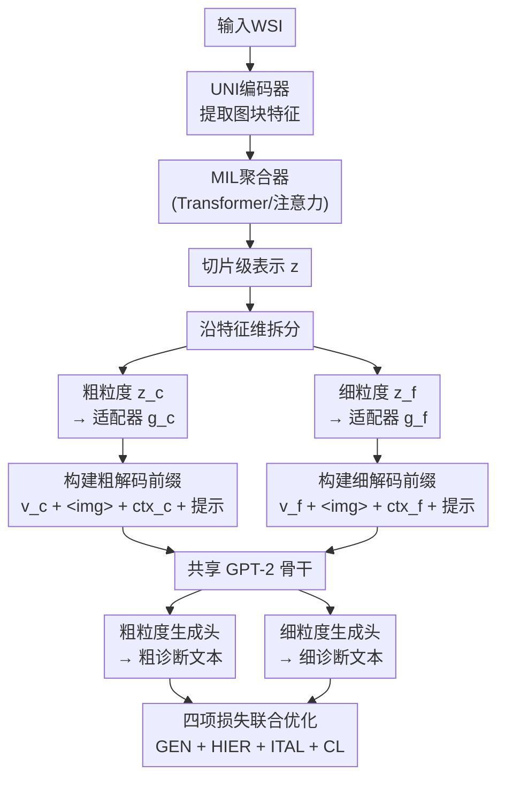

# TaxoMIL: Taxonomy-Constrained Learning for Hierarchical Whole Slide Image Analysis

**会议**: ECCV 2026  
**arXiv**: [2606.31100](https://arxiv.org/abs/2606.31100)  
**代码**: [https://github.com/QuIIL/TaxoMIL](https://github.com/QuIIL/TaxoMIL)  
**领域**: 医学图像  
**关键词**: 全切片图像分析, 多实例学习, 层次分类, 文本生成, 计算病理学  

## 一句话总结

TaxoMIL 将全切片病理图像诊断重新建模为受临床分类体系约束的层次化文本生成任务，通过双头解码器同时生成粗粒度和细粒度诊断文本，并用层次对齐和图像-文本对齐损失函数确保视觉与标签表示空间符合医学分类树结构，在胃、乳腺和前列腺三个WSI数据集上全面超越现有方法。

## 研究背景与动机

全切片图像分析是计算病理学的核心任务，但由于WSI的千兆像素规模，端到端优化在计算上不可行。多实例学习因此成为标准管线：将切片拆成局部图块，编码为特征嵌入，聚合为全局切片级表示后进行分类预测。然而，传统MIL方法无一例外地将诊断建模为扁平化的互斥分类——把各个标签当作独立无关联的索引值，这与临床诊断的内在分层结构严重脱节。

病理诊断天然是层次化的、从粗到细的认知过程。病理医生通常先确定大类（如"恶性"），再细化到具体亚型或分级（如"导管原位癌"或"浸润性癌"）。当标签被当作互斥分类索引时，标准优化目标不会自发地保持粗→细一致性，也无法编码相近诊断之间的语义邻近度。最近的工作试图填补这一结构性空缺，但走了两条各有缺陷的路：层次分类器（如HMIL）通过多分支架构引入分类树，但依然依赖离散索引，无法捕捉诊断标签间的语义连续性；VLM方法（如WSI-VQA、SlideChat、CAMP）能输出临床可读的自然语言文本，但缺乏显式的分类体系约束，在生成中容易出现"分类学幻觉"——父级与子级标签的矛盾频繁发生。两个范式都无法同时实现结构化推理、分类树忠实性和可解释文本生成。

本文的切入角度是：既然WSI诊断本质上是在一张图像上做"先定大类、再定亚型"的结构化推理，那就不应该丢弃临床分类树的先验知识。**核心 idea：将WSI诊断重新定义为受临床分类体系约束的层次化文本生成任务——用双头解码器同时输出粗粒度和细粒度诊断文本，并对标签嵌入空间施加显式的层次对齐和兄弟间隔约束，使视觉表示锚定到符合分类树结构的语义空间中。**

## 方法详解

### 整体框架

TaxoMIL 由三个主要组件构成：一个标准MIL骨干（特征提取器 $\mathcal{E}$ + MIL聚合器）、一个双支多模态条件编码模块和一个双头文本解码器。输入WSI经UNI基础模型提取图块嵌入，MIL聚合器输出全局切片级表示 $\mathbf{z}$。该表示沿特征维度拆分为粗/细两半，各自通过线性适配器投影到文本解码器嵌入空间。每个分支进一步拼接视觉嵌入、可学习图像token、标签上下文token和文本提示，构成解码前缀。两个前缀送入共享GPT-2骨干配合两个独立生成头，分别自回归解码出粗粒度和细粒度诊断文本。四项损失函数联合优化，配以循环损失调度避免多个目标之间的训练不稳定。

### 关键设计

**1. 双支多模态条件编码：为不同粒度分别构造解码器前缀**

MIL聚合器输出的切片级表示 $\mathbf{z}$ 是单一向量，如何让它"同时携带粗粒度和细粒度信息"送到两个解码头？TaxoMIL的做法是沿特征维度将 $\mathbf{z}$ 切分为两个等长子向量 $\mathbf{z}_c$ 和 $\mathbf{z}_f$，分别代表粗/细粒度视角的嵌入。每个子向量通过一个轻量适配器（线性投影 + LayerNorm + GELU激活）映射到文本解码器的嵌入空间，得到视觉条件嵌入 $\mathbf{v}^{(c)}$ 和 $\mathbf{v}^{(f)}$。

但仅有视觉条件不足以为解码器提供"决策粒度"的信息。TaxoMIL 为每个分支构造了一段由四部分拼接而成的解码前缀：视觉条件嵌入 $\mathbf{v}$、可学习图像token `<|img|>`（作为固定的视觉参考锚点）、标签上下文token $\mathbf{e}_{\text{ctx}}$（取该粒度下所有标签文本嵌入的平均值，提供全局语义先验）、以及一个自然语言提示模板（如"该胃镜图像显示的状况是："）。标签上下文token 的设计尤为巧妙——粗粒度版本的 $\mathbf{e}_{\text{ctx}}^{(c)}$ 是所有大类名称嵌入的平均，细粒度版本 $\mathbf{e}_{\text{ctx}}^{(f)}$ 是所有亚型名称嵌入的平均，解码器从第一个token起就能感知"当前在什么粒度决策"。训练时从10个语义等价但句式不同的提示模板中随机采样以增强鲁棒性，推理时使用固定模板。

**2. 双头共享解码器：一个GPT-2骨干配合两个独立生成头**

为了避免为两个粒度训练两份独立的语言模型（参数翻倍且无法共享粗→细推理知识），TaxoMIL 采用"共享骨干 + 独立生成头"的架构。两个分支的解码前缀先后送入同一个 GPT-2 小模型（12层、124M参数），每个分支得到对应的隐状态序列后，各接一个轻量Transformer解码器块和独立的unembedding投影矩阵，产出词表logits后自回归解码出完整诊断文本。

共享骨干意味着粗粒度生成和细粒度生成共用同一套语言理解能力——粗粒度的"大类判断"知识可以自然地辅助细粒度的"亚型区分"，反之亦然。这与病理医生的推理模式一致：知道"这是良性"有助于缩小"具体是哪类良性息肉"的候选范围。独立的生成头则保证了输出空间的粒度灵活性（粗粒度最长5个token，细粒度最长15个token）。推理时采用贪心解码，单张WSI约114ms，在VLM类方法中属于中等水平。

**3. 层次引导的标签-视觉对齐：四项损失配合循环调度**

仅有生成损失不足以让视觉表示内在符合分类树结构。TaxoMIL 从两个层面施加约束：在标签嵌入空间中，用层次对齐损失（$\mathcal{L}_{HIER}$）推动每个粗标签嵌入靠近其子细标签、远离其他粗标签、并让同一父节点下的细标签彼此拉开；在跨模态空间中，用图像-文本对齐损失（$\mathcal{L}_{ITAL}$）将视觉嵌入拉向对应标签文本嵌入的语义锚点，使视觉表示继承标签空间的层次结构。

多项损失同时存在一个根本矛盾：$\mathcal{L}_{HIER}$ 和对比损失 $\mathcal{L}_{CL}$ 是在模态内部"拉结构"，而 $\mathcal{L}_{ITAL}$ 是在模态之间"对齐"，二者同时优化会导致目标冲突、训练不稳定。TaxoMIL 提出**循环损失调度**来解决这一矛盾：让 $\mathcal{L}_{HIER}$ 和 $\mathcal{L}_{CL}$ 的权重按 $\cos^2(\pi \cdot n_{\text{cycles}} \cdot u)$ 振荡（$u$ 为训练进度，$n_{\text{cycles}}=3$），$\mathcal{L}_{ITAL}$ 的权重按 $1-\cos^2(\pi \cdot n_{\text{cycles}} \cdot u)$ 反相振荡——形成"先拉结构→再对齐模态→再拉结构"的交替推拉节奏，避免了同时优化所有目标时的梯度干扰。

### 损失函数 / 训练策略

总损失为四项之和：

$$
\mathcal{L} = w_{gen}\mathcal{L}_{GEN} + w_{hier}\mathcal{L}_{HIER} + w_{ital}\mathcal{L}_{ITAL} + w_{cl}\mathcal{L}_{CL}
$$

- **$\mathcal{L}_{GEN}$**：粗/细两个分支的token级交叉熵，是主损失（$w_{gen}=1.0$固定）。
- **$\mathcal{L}_{HIER}$**：由层次对齐损失 $\mathcal{L}_{HAL}$ 和兄弟间隔损失 $\mathcal{L}_{SML}$ 组成。$\mathcal{L}_{HAL}$ 构造了一个由同类相似度（粗-子细）与异类相似度（粗-粗、兄弟细-细）构成的对比比率，使标签嵌入空间符合分类树的父子拓扑；$\mathcal{L}_{SML}$ 在 $\mathcal{L}_{HAL}$ 之上引入欧氏距离硬间隔 $m=1.5$，防止细标签在粗-细对齐压力下全部坍塌到粗标签附近而丢失相互区分性。
- **$\mathcal{L}_{ITAL}$**：跨模态对比学习，将视觉嵌入 $\mathbf{v}^{(c)}/\mathbf{v}^{(f)}$ 拉向对应的标签文本嵌入，使视觉表示继承标签空间的层次结构。
- **$\mathcal{L}_{CL}$**：同粒度视觉样本间的标准监督对比损失，温度 $\tau=0.07$。
- 循环调度中 $w_{hier}^{\max}=0.3$, $w_{ital}^{\max}=0.3$, $w_{cl}^{\max}=0.1$。使用AdamW优化器（weight decay 0.01）和余弦退火学习率调度，最大100轮（含早停），批大小64。

## 实验关键数据

### 主实验

在三个WSI数据集上评估：胃（GastWSI，7,228张，4大类23小类）、乳腺（BRACS，545张，3大类7小类）、前列腺（PANDA，10,614张，3大类6小类）。对比12个基线（5个单标签MIL、4个层次MIL、3个VLM），三种评估粒度：Holistic（粗+细同时正确才算对）、Coarse-level、Fine-level。

**Holistic 评估（表1）**：

| 数据集 | 指标 | TaxoMIL | 最强基线 | 提升 |
|--------|------|---------|---------|------|
| GastWSI | ACC | **64.55** | 63.26 (CAMP) | +1.29 |
| GastWSI | W-F1 | **0.6183** | 0.6044 (CAMP) | +0.0139 |
| BRACS | ACC | **75.78** | 68.52 (ABMIL) | +7.26 |
| BRACS | W-F1 | **0.7662** | 0.7024 (ABMIL) | +0.0638 |
| PANDA | ACC | **54.60** | 50.28 (WSI-VQA) | +4.32 |
| PANDA | W-F1 | **0.5347** | 0.4928 (WSI-VQA) | +0.0419 |

TaxoMIL 在三个数据集上均取得最佳Holistic性能，尤其BRACS上超越最强基线超过7个点，各基线没有能在三个数据集上同时保持竞争力的。

Coarse/Fine 层面（表2）TaxoMIL也全面领先。细粒度上的提升幅度（BRACS +7.41~25.93% ACC）显著大于粗粒度（+0.93~5.12%），印证了层次约束对细粒度区分的核心价值——类间边界越模糊，分类树先知的约束作用越突出。

### 消融实验

**训练策略消融（表3，Holistic ACC）**：

| 配置 | GastWSI | BRACS | PANDA |
|------|---------|-------|-------|
| 仅 $\mathcal{L}_{GEN}$ | 61.58 | 66.67 | 49.53 |
| + $\mathcal{L}_{CL}$ | 62.60 | 62.96 | 51.97 |
| + $\mathcal{L}_{HIER}+\mathcal{L}_{ITAL}$ | 63.07 | **72.22** | 51.41 |
| + Cyclic（完整模型） | **64.55** | **75.78** | **54.60** |

BRACS上单独加 $\mathcal{L}_{CL}$ 反而使Holistic ACC从66.67降至62.96，说明没有层次约束的对比学习可能导致粗类过度聚类而损害细粒度区分。HIER+ITAL带来最大幅度的提升（BRACS细粒度+约10%），循环调度进一步稳定了训练。

**解码前缀消融（表4，Holistic ACC）**：去掉标签上下文token $\mathbf{e}_{\text{ctx}}$ 使ACC下降2.04~5.41%；去掉图像token `<|img|>` 下降1.50~5.41%。两个前缀组件在不同数据集上各有侧重，缺一不可。

### 关键发现

- 层次约束损失（HIER+ITAL）是贡献最大的组件；单独使用对比学习在某些数据集上反而有害，说明模态内对比与层次约束必须配合使用
- 循环调度通过交替"拉结构→对齐模态"显著提升最终性能，是多目标优化的有效轻量方案
- 生成式解码全面优于分类头变体（TaxoMIL-Cls），说明文本形式的语义连续性有益于层次区分
- 父-子矛盾率（PCVR）为4.09%平均，在取得最高ACC的同时维持了有竞争力的层次一致性
- 嵌入空间可视化（MDS投影）显示，训练后标签嵌入和图像嵌入均呈现出清晰的分类树拓扑结构

## 亮点与洞察

- **将分类树直接编码进损失函数**：之前的层次MIL要么靠多分支架构硬约束（离散索引问题），要么靠VLM的文本灵活性（幻觉问题）。TaxoMIL在标签嵌入空间上施加显式的层次对齐+兄弟间隔约束，是把"分类树知识"注入学习的最直接有效的方式
- **循环损失调度轻巧优雅**：模态内结构化（HIER+CL）和跨模态对齐（ITAL）同时优化时的冲突，用一个简单余弦平方振荡就解决了，不需要复杂的梯度调节或多阶段训练pipeline
- **标签上下文token的设计效率极高**：取全部标签文本嵌入的平均值作为解码前缀的一部分，只增加一个嵌入向量的开销，就让解码器从第一个token起知道"整个诊断空间长什么样"，堪称画龙点睛
- **双头共享解码器契合病理认知模式**：粗粒度的大类判断知识自然辅助细粒度亚型区分，参数也几乎只有独立双解码器的一半
- 框架设计是通用的，不限于病理——任何具有层次分类结构的医学诊断（如放射学多级报告、皮肤镜分型）均可直接迁移

## 局限与展望

- TaxoMIL假设固定分类树（由预定义的标签文本嵌入和父-子关系组成），无法处理动态演化的分类体系，未来需要引入在线分类树构建或自适应扩展机制
- 父-子矛盾率虽低于多数基线但未完全消除（平均4.09%），在临床高安全场景下仍需进一步降低，如引入显式的矛盾检测后处理
- 自回归解码器（GPT-2小模型）带来了额外开销（218M可训练参数、114ms/WSI、897MB显存），高于标准MIL聚合器几个量级，对实际部署资源较敏感
- PANDA数据集上细粒度ACC仍有较大提升空间（55.07%），部分原因是ISUP分级本身类间边界模糊且保留了全部ambiguous病例；需要更精细的特征表征来应对低区分度场景
- 作者提到未充分探索更深层次分类树（当前只有两层），更深层级（如亚型→分子标记）的可行性待验证

## 相关工作与启发

- **vs 传统MIL（ABMIL/CLAM/TransMIL/S4MIL/MambaMIL）**：传统MIL都是扁平化互斥分类，无法编码诊断标签之间的层级关系或语义连续性；TaxoMIL换成层次化文本生成后，在细粒度准确率上大幅领先10~26个百分点
- **vs 层次MIL（HMIL/Chang et al./ViLa-MIL/HiClass）**：这些方法保留多分支分类头架构且使用离散索引，缺乏语义连续性；TaxoMIL用文本标签嵌入天然编码语义相似度，层次约束也更强
- **vs VLM方法（SlideChat/WSI-VQA/CAMP）**：VLM输出灵活自然语言但缺乏显式分类树约束，容易产生父-子矛盾；TaxoMIL的层次对齐损失从根本上锚定了生成空间的拓扑结构，Holistic评估大幅领先

## 评分
- 新颖性: ⭐⭐⭐⭐⭐ 将WSI诊断从扁平分类重新定义为受分类树约束的层次化文本生成，并用循环调度的多项层次约束来保证层次一致性，思路清晰且有效
- 实验充分度: ⭐⭐⭐⭐⭐ 三个数据集、12个基线、三层评估粒度、系统消融、嵌入空间可视化和PCVR分析，实验非常全面扎实
- 写作质量: ⭐⭐⭐⭐ 方法描述细节充分，逻辑层次清晰；但消融表排列较密集，部分设计选择（如为什么选3个周期、标签上下文为何用平均而非注意力加权）未充分探讨
- 价值: ⭐⭐⭐⭐⭐ 直接解决了计算病理学从flat分类走向层次化诊断的根本性结构缺陷，框架通用性好，任关注层分类任务均可迁移，实用价值高

<!-- RELATED:START -->

## 相关论文

- [\[CVPR 2026\] MLLM-HWSI: A Multimodal Large Language Model for Hierarchical Whole Slide Image Understanding](../../CVPR2026/medical_imaging/mllm-hwsi_a_multimodal_large_language_model_for_hierarchical_whole_slide_image_u.md)
- [\[CVPR 2026\] TopoSlide: Topologically-Informed Histopathology Whole Slide Image Representation Learning](../../CVPR2026/medical_imaging/toposlide_topologically-informed_histopathology_whole_slide_image_representation.md)
- [\[ICML 2026\] Federated Distillation for Whole Slide Image via Gaussian-Mixture Feature Alignment and Curriculum Integration](../../ICML2026/medical_imaging/federated_distillation_for_whole_slide_image_via_gaussian-mixture_feature_alignm.md)
- [\[CVPR 2026\] Contrastive Cross-Bag Augmentation for Multiple Instance Learning-based Whole Slide Image Classification](../../CVPR2026/medical_imaging/contrastive_cross-bag_augmentation_for_multiple_instance_learning-based_whole_sl.md)
- [\[CVPR 2026\] MUSE: Harnessing Precise and Diverse Semantics for Few-Shot Whole Slide Image Classification](../../CVPR2026/medical_imaging/muse_harnessing_precise_and_diverse_semantics_for_few-shot_whole_slide_image_cla.md)

<!-- RELATED:END -->
