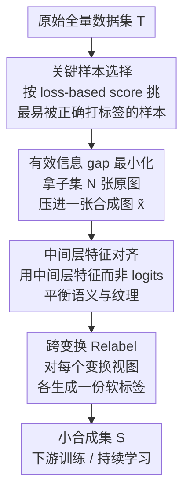

# Condensing Large-Scale Datasets Directly with Minimal Information Loss

**会议**: ECCV 2026  
**arXiv**: [2607.00916](https://arxiv.org/abs/2607.00916)  ⚠️ 疑似占位/未来日期（2026-07），以原文为准  
**代码**: [https://github.com/LINs-lab/CIM](https://github.com/LINs-lab/CIM)  
**领域**: 模型压缩 / 数据集蒸馏  
**关键词**: 数据集蒸馏, 信息损失, 分布对齐, Relabel, 特征匹配

## 一句话总结
本文指出主流大规模数据集蒸馏（SRe2L 系）的「数据→模型→图像」双重压缩过程会造成严重信息损失、并使蒸馏图像偏离真实分布从而拖垮 Relabel，提出 CIM：用一个可计算的「有效信息 gap」度量，直接在原图上最小化合成集与真实集的信息差，绕开昂贵的 recover 阶段，在 ImageNet-1K IPC=10 上以单卡 80 分钟拿到 48.7% Top-1（ResNet-18）。

## 研究背景与动机

数据集蒸馏（dataset distillation）想把一个庞大训练集的知识浓缩进一个极小的合成集，让在合成集上训练的模型逼近在全量数据上训练的性能，从而大幅省下训练与存储开销。传统的匹配式方法（匹配梯度、特征、分布、训练轨迹）在低 IPC 上效果惊艳，但每步都要在合成集与原集之间反复算差异、迭代到收敛，算力和显存开销随数据规模爆炸，很难扩到 ImageNet-1K。为突破这个瓶颈，SRe2L 开创了解耦的三阶段范式：先把数据信息 **Squeeze** 进一个预训练模型，再从模型参数里 **Recover** 回图像空间形成合成图，最后用预训练模型给合成图 **Relabel** 注入标签空间知识。它避开了昂贵的展开式优化，成了第一个能高效扩到 ImageNet-1K 的方案，也催生了一大批后续工作（G-VBSM、RDED、DELT、NRR-DD 等）。

但这套抽取式管线有两个顽疾：跨架构泛化差、以及 Recover 阶段算力开销巨大。本文把病根归结为一个被忽视的**隐式双重压缩**：信息先从数据被压进模型参数（Squeeze），再从模型被解压回合成图像（Recover）——一压一解两道信息瓶颈叠加，天然带来严重信息损失，蒸馏图像内容稀薄、纹理常常不真实且过拟合到特定网络。更致命的是，作者用理论和实验揭示了 Relabel 的一个隐藏软肋：它的有效性**严格取决于分布对齐**。用只在真实数据上训过的模型去给蒸馏图打标签，一旦双重压缩把合成样本推离了真实分布，这个 labeler 就变得不可靠，只能给出次优标签，错误标签逐轮累积、下游 student 跟着遭殃（实验显示关掉 Relabel 后 SRe2L 在 ImageNet-1K 上直接掉到 1.1%）。

于是本文抛弃有缺陷的双重压缩范式。**核心 idea：既然病根是「数据→模型→图像」绕一圈丢信息，那就别绕——直接定义一个可计算的「有效信息 gap」度量合成图与原图之间的信息差，在原图上直接把这个 gap 优化到最小，让信息高保真保留、分布天然对齐，从而既省掉整个 recover 过程，又原生满足 Relabel 生效的前提。**

## 方法详解

### 整体框架

CIM 要解决的是：如何在不经过「压进模型再解压回图像」这道弯路的前提下，把一批原始图像的显著信息**直接**灌进一张更紧凑的合成图里，并且保证合成图不偏离真实分布。整体流程是三段串行——**先从每个类里挑出 N×IPC 张「好打标签」的关键样本**组成 IPC 个子集；**再对每个子集，用一张初始合成图（由该子集图像缩放拼接而成）通过最小化有效信息 gap 迭代压缩**，把 N 张原图的信息压进这一张图；**最后用跨变换的软标签重新标注**合成图，交给下游训练。整条管线不再需要任何模型反演（inversion），合成图可以一张一张独立优化，因此显存可控、能动态调 batch。

### 关键设计

**1. 有效信息 gap：给「两张图信息差多少」下一个可计算的定义**

抽取式方法为什么丢信息、丢了多少，一直没有一个明确的度量——大家只能靠「反演出来的图看着像不像」来间接判断。CIM 的第一步就是把「信息」形式化。作者定义一个**观察者组** $\mathcal{R}=\{\xi_j\}$（每个观察者是一个能从图像里抽特征的函数，比如预训练模型在某种变换下的前向），一张样本 $\mathbf{x}_i$ 的**有效信息**就是它被组内所有观察者抽出的特征集合所构成的分布 $\mathcal{P}_{\mathbf{x}_i|\mathcal{R}}$。两张图的信息差自然定义为这两个特征分布之间的 KL 散度：

$$I_G(\mathbf{x}_i,\mathbf{x}_j;\mathcal{R})=\mathrm{D}_{\mathrm{KL}}\!\left(\mathcal{P}_{\mathbf{x}_i|\mathcal{R}}\,\|\,\mathcal{P}_{\mathbf{x}_j|\mathcal{R}}\right)$$

直觉是：如果一群观察者看两张图抽出的特征几乎一样，就认为它们携带的有效信息相同。这个定义的价值在于把「信息保真」从一个模糊说法变成了可优化的目标——蒸馏图只要在这群观察者眼里和原图「看起来信息一致」，就算成功保留了信息。

**2. KL 上界松弛：把不可算的散度变成可算的特征 L2 距离**

上面的 KL 散度直接算不了（要估计特征分布的密度），而且它是样本对之间的度量，没法直接套到「一个集合 vs 一张合成图」上。CIM 分两步解决。第一步是把集合级目标松弛成期望：借助数据增强 $\mathcal{A}$，用一张合成图的 N 个增强视图分别去对齐子集里的 N 张原图，最小化配对后的信息 gap 的期望。第二步是给 KL 找一个可算的上界——作者证明（Thm. 4.1）有效信息 gap 可以被观察者输出的特征欧氏距离的期望上界住：

$$I_G(\mathbf{x}_i,\mathbf{x}_j;\mathcal{R})\le \mathbb{E}_{\xi_k\sim\mathcal{R}}\left\|\xi_k(\mathbf{x}_i)-\xi_k(\mathbf{x}_j)\right\|^2$$

这一步是全篇最关键的化简：优化不可算的 KL 被替换成「让合成图和原图在每个观察者下的特征尽量接近」这个再直白不过的特征匹配。落到实现上，作者取观察者组为**单个预训练模型套上各种变换**（$\xi_k=\zeta_k\circ\phi_{\theta_{\mathcal{T}}}$，$\zeta_k$ 是变换），这样不用养一堆模型就能有「多观察者」的效果；合成图用 RandomCrop 生成增强视图、用缩放拼接的真实图初始化，然后对扰动 $\Delta\tilde{\mathbf{x}}$ 做 M 步梯度下降把上述特征距离压到最小。相比 SRe2L 要靠 BN 统计量对齐 + 复杂反演，这里既不依赖 BN、也不反演模型，直接在像素上优化一个特征匹配 loss。

**3. 中间层特征对齐：别只对齐 logits，否则纹理全丢**

如果直接拿模型最后一层（logits）的输出去对齐信息，会踩一个坑：模型天生倾向于抽语义、把纹理细节抹掉，于是合成图语义对上了、纹理却塌了，泛化随之变差。CIM 的做法是把上面的观察者/对齐点放到**中间层特征**而非最后一层：浅层富含纹理、深层和 logits 偏语义，中间层恰好能兼顾两者，让合成图在语义丰富度和纹理保真之间取得平衡。消融显示中间层对齐鲁棒且最优——这也是 CIM 跨架构泛化明显强于 SRe2L 的直接原因（合成图同时保住了纹理和语义，就不至于过拟合到某个特定网络的偏好）。

**4. 跨变换 Relabel：一张图配多份「随变换而变」的软标签**

标准 Relabel 是「一图一标签」的 one-shot，但随机裁剪可能裁到和原标签不同的物体，导致标签不准。既然 CIM 已经保证了合成图分布对齐、labeler 可靠，就顺势把标签也做丰富：对合成图施加一系列变换 $\zeta_k$，对**每个变换后的视图各生成一份软标签** $\tilde{y}_k=\phi_{\theta_{\mathcal{T}}}(\zeta_k(\tilde{\mathbf{x}}))$，下游 student 在这些「视图-标签」对上训练。这样标签空间承载的知识比 one-shot 更细、更多样。值得强调的是这个设计和前面是环环相扣的：正因为设计 1-3 把合成图的分布拉回真实域、让预训练模型重新变成可靠 labeler，这里的跨变换软标签才有意义——分布若还是漂的，打再多标签也是错的。

### 关键样本选择（复用 RDED）

CIM 本身对选择策略无关（selection-agnostic），默认沿用 RDED 的机制并配合一个 loss-based importance score：对每个样本按 $s=-\ell(\phi_{\theta_{\mathcal{T}}}(\mathbf{x}),y)$ 打分（交叉熵越小、越易被预训练模型正确识别，分越高），每类选出 top-(N×IPC) 张最「好打标签」的样本。这与 Prop. 1 的结论一致：只有被 labeler 正确识别的样本才配进蒸馏集。为省算力和保多样性，先从每类里均匀随机抽一个大小为 300 的代理子集再打分。消融（Tab. 6）表明即便换成随机选择，CIM 仍有竞争力，说明性能主要来自信息 gap 最小化而非选择技巧。

### 损失函数 / 训练策略

蒸馏阶段最小化中间层特征匹配 loss（式 9），对合成图扰动做 M=200 步 AdamW（lr 0.01）优化；每张合成图压入 N=4 张原图，代理子集 |T'|=300。下游训练用跨变换软标签的 MSE 目标（式 10），AdamW + MultiStepLR，ImageNet-1K 训 300 epoch、其余 1000 epoch，增强用 DSA。作者强调所有超参对数据集/架构通用、不敏感。

## 实验关键数据

### 主实验

大规模数据集上（ResNet-18），CIM 在多数设置刷新 SOTA，尤其低 IPC 优势巨大：

| 数据集 | IPC | SRe2L | RDED | NRR-DD | DELT | CIM (Ours) |
|--------|-----|-------|------|--------|------|------------|
| Tiny-ImageNet | 1 | 13.5 | 15.4 | 13.5 | 9.3 | **25.1** |
| Tiny-ImageNet | 10 | 43.6 | 48.4 | 45.2 | 43.0 | **53.3** |
| ImageNet-1K | 10 | 31.1 | 41.1 | 46.1 | 45.8 | **48.7** |
| ImageNet-1K | 50 | 49.5 | 55.3 | 60.1 | 59.2 | **60.4** |

小数据集上（CIFAR-10/100）同样领先，且暴露了抽取式方法的软肋——SRe2L 在 CIFAR-10 全 IPC、CIFAR-100 IPC=1 下都很挣扎（如 ResNet-18/CIFAR-100/IPC=1 只有 11.5%，RDED 甚至 4.6%），而 CIM 达 31.1%，印证了「信息损失在低 IPC 下危害最大」的判断。ImageNet-1K IPC=10 的 48.7% 相比前 SOTA NRR-DD、DELT 分别高 2.6%、2.9%。

**Relabel 有效性依赖分布对齐**（Tab. 7，ResNet-18/IPC=10）是本文最有说服力的证据——关掉 Relabel 后各方法崩塌程度天差地别：

| 数据集 | 方法 | 无 Relabel | 有 Relabel |
|--------|------|-----------|-----------|
| ImageNet-1K | SRe2L | 1.1 | 31.1 |
| ImageNet-1K | RDED | 19.7 | 41.1 |
| ImageNet-1K | CIM | **22.0** | **48.7** |
| Tiny-ImageNet | SRe2L | 0.6 | 43.6 |
| Tiny-ImageNet | CIM | **27.0** | **53.3** |

SRe2L 无 Relabel 几乎归零（1.1、0.6），说明它的合成图严重偏离分布、几乎全靠 labeler 兜底；而 CIM 无 Relabel 仍有 22.0/27.0，证明它的合成图本身就保真、分布对齐，这正是设计目标的直接验证。

### 消融实验

| 配置 | 现象 | 说明 |
|------|------|------|
| 压缩迭代数 M | M=200 最佳，>200 收益微乎其微 | 质量-速度折中点，且对 M 鲁棒 |
| 每图压入张数 N | N=4 在四个数据集上验证最优 | N 越大特征越多样但每张原图保留信息越少 |
| 对齐层 | 中间层最优（浅层重纹理、深层/logits 重语义） | 中间层平衡语义与纹理 |
| 信息 gap 迭代数 K | K 增大有效缩小 gap，近 200 后饱和 | 保真与算力的平衡 |
| 选择策略 | 随机/K-means/Herding vs RDED 差距小 | 框架对选择方法不敏感，如 ImageNet-1K：随机 45.3 vs RDED 48.6 |

效率上（Tab. 5，Conv-4/Tiny-ImageNet），CIM 生成 100 张图仅 13.02s、峰值显存 0.65GB，远快于 SRe2L（51.68s/1.36GB）和 G-VBSM（259.84s/4.94GB），仅慢于优化无关的 RDED（1.68s）。相比匹配式的 DREAM（33906s）、DATM（12470s）更是快三个数量级（Tab. 14）。

### 关键发现
- 信息 gap 最小化（而非选择技巧）是性能主来源：换成随机选择仍具竞争力，说明贡献来自「把信息保真做对」。
- 中间层对齐是跨架构泛化的关键：CIM 在 6 个未见架构上全面领先（如 ViT-T/16 上 10.8% vs RDED 8.5%、SRe2L 3.2%），因为同时保住了纹理与语义。
- 「无 Relabel」对比最能说明本质区别：SRe2L 崩到接近 0，CIM 仍稳，直接证明合成图保真度和分布对齐。
- 低 IPC 场景优势最大，正是信息损失危害最严重的地方，与理论判断吻合。

## 亮点与洞察
- 把「抽取式蒸馏为何差」归因为**隐式双重压缩**（数据→模型→图像的两道信息瓶颈），这个诊断视角清晰且可证伪——用「关掉 Relabel 是否崩」直接验证了合成图是否偏离分布，实验设计很漂亮。
- **Relabel 严格依赖分布对齐**这一洞察有理论（Prop. 1 用高斯二分类证明偏移分布上的最优分类器在原分布上必然次优）+ 经验（Fig. 1 显示 Relabel 只在蒸馏早期、图还接近真实图时有用）双支撑，把一个被当成万能插件的技巧的适用条件讲透了。
- **KL 散度 → 特征 L2 距离**的上界松弛（Thm. 4.1）是把「信息保真」这个抽象目标真正落地成可优化 loss 的关键一跳，思路可迁移到其他需要度量「两个样本/集合信息差」的场景。
- 合成图可**逐张独立优化**（不像匹配式必须一批图协同合成），带来显存可控、batch 可动态调的工程优势。

## 局限与展望
- 作者承认的最大局限：效率上**打不过优化无关的 RDED**（RDED 无需梯度优化，1.68s vs CIM 13.02s），在对速度极致敏感的场景受限。
- 有效信息定义依赖「观察者组」，而实现里观察者组退化成「单个预训练模型 + 若干变换」，是否足以刻画真实的信息分布、多模型观察者会不会更好，文中未充分展开。
- 方法仍需一个在全量数据上训练好的预训练模型（既做 labeler 又做特征观察者），这个前提在真正大规模或隐私受限场景可能本身就是瓶颈。
- Thm. 4.1 的推导用到核密度估计近似与若干 $o(1)$/常数项省略（附录 D），上界的紧致程度与近似误差对结果的影响可再论证。

## 相关工作与启发
- **vs SRe2L**：SRe2L 走「Squeeze→Recover→Relabel」解耦三阶段，靠模型反演出合成图；CIM 抛弃 recover，直接在原图上最小化信息 gap。区别在于 CIM 消除了双重压缩的信息损失，合成图保真、分布对齐，因此跨架构泛化更强、效率更高、Relabel 更可靠。
- **vs RDED**：RDED 是优化无关的选择式方法，直接从原图裁高真实度 patch。CIM 默认复用其选择机制，但在此之上做信息 gap 最小化的像素级优化；代价是慢于 RDED，收益是各 IPC/数据集下 acc 显著更高（如 ImageNet-1K IPC=10：48.7 vs 41.1）。
- **vs 匹配式（梯度/轨迹/分布匹配，如 DREAM/DATM/IDM）**：匹配式要在合成集与原集间反复算差异、迭代到收敛，算力爆炸难扩规模，且常过拟合到特定架构。CIM 把目标化简为可算的特征距离、逐张独立优化，快三个数量级且泛化更好。
- **vs NRR-DD / DELT**：这两者分别改进 SRe2L 的实例/类特征捕捉、类内多样性，但仍在双重压缩范式内；CIM 从范式层面换掉了信息提取方式，在 ImageNet-1K IPC=10 上分别领先 2.6%、2.9%。

## 评分
- 新颖性: ⭐⭐⭐⭐⭐ 「双重压缩致信息损失」的诊断 + 有效信息 gap 度量 + Relabel 依赖分布对齐的理论，成套且切中要害
- 实验充分度: ⭐⭐⭐⭐⭐ 4 数据集 × 多 IPC × 6 未见架构 + 效率 + 消融 + 持续学习 + 无 Relabel 对照，覆盖全面
- 写作质量: ⭐⭐⭐⭐ 诊断→理论→方法逻辑顺畅，但正文若干符号（式 6/9）偏密，部分推导挤在附录
- 价值: ⭐⭐⭐⭐⭐ 单卡 80 分钟蒸馏 ImageNet-1K 且刷新 SOTA，兼具理论洞察与实用价值

<!-- RELATED:START -->

## 相关论文

- [\[ICML 2026\] Unifying Dataset Pruning and Distillation for Efficient Large-scale Compression](../../ICML2026/model_compression/unifying_dataset_pruning_and_distillation_for_efficient_large-scale_compression.md)
- [\[AAAI 2026\] InfoCom: Kilobyte-Scale Communication-Efficient Collaborative Perception with Information-Aware Feature Compression](../../AAAI2026/model_compression/infocom_kilobyte-scale_communication-efficient_collaborative_perception_with_inf.md)
- [\[ICLR 2026\] S2R-HDR: A Large-Scale Rendered Dataset for HDR Fusion](../../ICLR2026/model_compression/s2r-hdr_a_large-scale_rendered_dataset_for_hdr_fusion.md)
- [\[CVPR 2025\] Distilling Long-tailed Datasets](../../CVPR2025/model_compression/distilling_long-tailed_datasets.md)
- [\[ICML 2026\] Mind Your Margin and Boundary: Are Your Distilled Datasets Truly Robust?](../../ICML2026/model_compression/mind_your_margin_and_boundary_are_your_distilled_datasets_truly_robust.md)

<!-- RELATED:END -->
