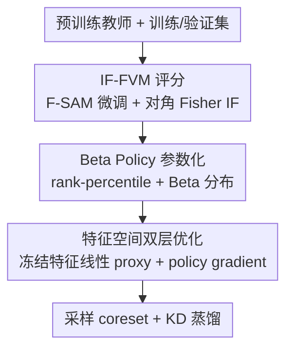

# Distill on a Diet: Efficient Knowledge Distillation via Learnable Data Pruning

**会议**: ECCV 2026  
**arXiv**: [2606.25488](https://arxiv.org/abs/2606.25488)  
**代码**: [https://github.com/yifanwu-victor/Distill-on-a-Diet](https://github.com/yifanwu-victor/Distill-on-a-Diet) (有)  
**领域**: 模型压缩  
**关键词**: 知识蒸馏, 数据剪枝, 影响力函数, Beta 分布, 双层优化

## 一句话总结
本文提出 IF-Beta 框架, 用影响力函数(IF)作为无需重训的样本重要性评分器, 配合可学习的 Beta 分布采样策略, 通过特征空间双层优化高效搜索最优剪枝子集, 使学生在更少数据和算力下超越全量数据蒸馏的性能.

## 研究背景与动机

**领域现状**: 知识蒸馏(KD)是模型压缩的主流手段, 通过大教师网络指导小学生在全量训练集上学习以提升推理效率. 但蒸馏过程本身的计算开销常被忽视——学生需要在教师引导下跑完整数据集, 其训练成本甚至高于普通监督训练.

**现有痛点**: 数据剪枝(Data Pruning)是减轻 KD 训练负担的潜在方向, 即只保留部分训练样本. 但现有剪枝方法在 KD 场景下存在两个根本性问题. 其一, 评分阶段的"效率-效果"两难: 基于训练动态的高质量评分方法(如 EL2N、Forgetting、AUM)需要记录模型训练过程中的逐轮预测变化, 但 KD 中只有预训练好的教师, 没有训练轨迹, 重新训练教师来获取这些指标代价极高, 完全抵消了剪枝的效率收益; 而基于交叉熵 loss 的快速评分方法虽然计算轻量, 却不可靠——过参数化网络能轻易过拟合甚至错误标注的样本, 导致 loss 值对样本难度不敏感. 其二, 采样阶段的手工启发式策略(如 top-k 选择、CCS 的硬截断分层采样、BWS 的固定滑动窗口)过于刚性, 无法根据不同数据分布和师生配对自适应调整选择区域, 导致次优子集.

**核心矛盾**: KD 场景下, 评分器既要求高质量(准确反映样本对蒸馏的贡献)又要求高效率(不需要重训), 而现有方法无法同时满足; 同时采样策略需要自适应, 而非预设的固定形式.

**本文目标**: (1) 找到一个不需要重训的高质量评分器; (2) 设计一个可学习的自适应采样策略; (3) 以可接受的计算代价联合优化评分和采样, 使剪枝后的蒸馏性能超过全量蒸馏.

**切入角度**: 作者注意到影响力函数(Influence Function, IF)是一种天然的后验评分工具——它量化每个训练样本对模型预测的影响, 只需一个已训练好的模型即可计算. 传统 IF 因数值不稳定和高计算成本被视为不实用, 但近期研究表明在平坦验证极小值(Flat Validation Minimum, FVM)条件下, IF 估计变得既稳定又高效. 这恰好契合 KD 场景: 教师模型天然存在, 只需对其做轻量 FVM 微调即可获得可靠的 IF 评分.

**核心 idea**: 用 FVM 条件下计算的 IF 取代传统基于训练动态的评分, 用可学习 Beta 分布取代手工启发式采样规则, 在教师冻结特征空间内通过双层优化高效求解最优剪枝策略.

## 方法详解

### 整体框架

IF-Beta 的目标是: 给定预训练教师和训练集, 在指定剪枝比例 $r$ 下, 找出一个最优子集, 使在该子集上蒸馏得到的学生在验证集上性能最好. 整个方法包含六个阶段: (1) 在验证集上用 F-SAM 对教师做 FVM 微调, 使教师参数处于平坦极小值; (2) 用对角 Fisher 近似逆 Hessian, 快速计算每个训练样本的 IF 评分; (3) 提取教师的冻结特征, 作为后续双层优化的输入; (4) 在特征空间中通过双层优化搜索最优 Beta Policy 参数, 外程用 policy gradient 更新策略, 内程用线性分类器作为 proxy student 快速评估子集质量; (5) 用搜索到的最优策略采样最终 coreset; (6) 在 coreset 上进行标准 KD 训练得到最终学生. 阶段(4)是核心引擎, 通过 proxy student 和 policy gradient 两大效率设计, 避免了完整网络重训和外层隐式微分.

### 关键设计

**1. IF-FVM 评分: 用影响力函数取代需要重训的轨迹评分**

传统数据剪枝依赖 EL2N、Forgetting、AUM 等基于训练动态的指标, 这些指标记录模型在训练过程中对每个样本的预测变化(如 EL2N 记录某 epoch 预测与 one-hot 标签的 L2 误差, Forgetting 统计从正确到错误的翻转次数). 在 KD 场景下, 只有预训练好的教师而没有其训练轨迹, 重新训练教师来获取这些指标完全抵消了剪枝带来的效率收益. CE loss 作为替代虽快, 但过参数化网络的特性使困难样本和简单样本的 loss 都趋于很小, 区分度极差.

本文提出用影响力函数(IF)作为后验评分器. IF 的核心思想是: 如果移除某个训练样本, 模型在验证集上的损失变化有多大? 变化越大, 说明该样本越重要. 具体做法: 首先在验证集上用 F-SAM 优化器对预训练教师做轻量微调(约 1000 次迭代), 使其收敛到平坦验证极小值(FVM). 在 FVM 条件下, Hessian 矩阵条件良好, 训练样本 $z_{\text{tr}}$ 对验证集的影响力可简化为:

$$\mathcal{I}(z_{\text{tr}}, D_{\text{val}}) = \tilde{g}_{z_{\text{tr}}}^{\top} \tilde{H}_{\text{val}}^{-1} \tilde{g}_{z_{\text{tr}}}$$

其中 $\tilde{g}_{z_{\text{tr}}} = \nabla_{\tilde{\theta}_T} \ell(z_{\text{tr}}, \tilde{\theta}_T)$ 是样本在 FVM 参数 $\tilde{\theta}_T$ 处的梯度, $\tilde{H}_{\text{val}}$ 是验证集上的 Hessian. 为进一步加速, 作者用对角 Fisher 信息矩阵 $\text{diag}(\frac{1}{|D_{\text{tr}}|}\sum \tilde{g}_{z_{\text{tr}}}\tilde{g}_{z_{\text{tr}}}^{\top})$ 近似逆 Hessian, 使得 IF 评分只需两次前向-反向传播即可完成. Fig.1 的 Spearman 秩相关实验表明, IF-FVM 与 EL2N、AUM 等轨迹指标的相关性显著高于 CE loss 和传统 LiSSA 近似的 IF, 证明 IF-FVM 能在不重训的前提下准确捕捉样本难度.

**2. Beta Policy 可学习采样: 用参数化 Beta 分布取代手工启发式采样**

即使有了可靠评分, 现有采样策略仍拖后腿. CCS 使用硬截断 + 分层采样, 但实验(Fig.2a-b)发现最优截断比例在 KD 和非 KD 场景下差异巨大, 预设参数完全无法迁移; BWS 使用固定大小的滑动窗口, 但作者发现(Fig.2c)引入一定比例的窗口外随机替换反而提升性能, 说明固定窗口本身就是次优设计.

作者提出用 Beta 分布参数化采样概率, 以突破启发式策略的刚性限制. 首先将 IF 评分通过 rank-to-percentile 归一化到 $[0,1]$, 得到 $\hat{s}_i \in [0,1]$, 值越小表示样本越困难. 然后定义一个 Beta 分布形式的采样概率:

$$p_i(\phi) = \frac{1}{Z} \frac{1}{B(\alpha(\phi), \beta(\phi))} \hat{s}_i^{\alpha(\phi)-1} (1-\hat{s}_i)^{\beta(\phi)-1}$$

其中 $B(\cdot,\cdot)$ 是 Beta 函数, $Z$ 是归一化常数, $\phi$ 是控制 $\alpha$ 和 $\beta$ 的可学习参数. Beta 分布的两个参数赋予了策略极大的灵活性(Fig.3): 当 $\alpha > \beta$ 时分布左偏, 倾向采样低分(困难)样本; 当 $\alpha < \beta$ 时分布右偏, 倾向采样高分(简单)样本; 当 $\alpha = \beta = 1$ 时退化为均匀分布. 分布形状可在单峰、U 型、单调递增/递减之间自由切换, 天然覆盖了 CCS 和 BWS 等所有启发式策略的搜索空间.

在给定剪枝比例 $r$ 下, Beta Policy $\pi_{\phi}^r$ 采样一个二元掩码 $\bm{m} \in \{0,1\}^N$, 满足 $\|\bm{m}\|_0 = (1-r)N$. 采样概率由掩码中各样本的 $p_i(\phi)$ 乘积累积并归一化得到, 构成了所有合法子集上的一个类别分布. 这使得策略可以用梯度优化, 不再是不可微的硬选择.

**3. 特征空间双层优化: 用线性 proxy student 和 policy gradient 高效搜索最优策略**

搜索最优 Beta Policy 被形式化为双层优化问题: 外层最小化验证集上的期望损失, 内层在采样子集上训练学生:

$$\min_{\phi} \Phi(\phi) = \mathbb{E}_{\bm{m} \sim \pi_{\phi}^r} \widehat{\mathcal{L}}(\theta_S^*(\bm{m})) \quad \text{s.t.} \quad \theta_S^*(\bm{m}) = \arg\min_{\theta_S} \mathcal{L}(\theta_S; \theta_T, \bm{m})$$

其中内层使用标准 KD loss $\ell_{\text{KD}} = (1-\alpha)\ell_{\text{CE}} + \alpha\ell_{\text{KL}}$, 外层使用验证集 CE loss. 直接求解需要内层每个策略更新都完整训练学生网络, 计算量不可接受. 作者利用 KD 场景的特殊结构做了两项关键简化:

**Proxy Student 加速内层**: 不在完整学生网络上做内层优化, 而是在教师冻结特征上附加一个线性分类头 $\bm{C} \in \mathbb{R}^{c \times d}$ 作为 proxy student: $f_{\theta_S}(x_i) = \bm{C} \cdot f_T(x_i)$. 内层变为 $\bm{C}^*(\bm{m}) = \arg\min_{\bm{C}} \frac{1}{K} \sum_{z_i \in D_{\text{sub}}} \ell_{\text{KD}}(z_i, \bm{C}, \theta_T)$. 由于特征空间维度远小于参数量且特征已冻结, 线性分类器仅需 1-2 个 epoch 即可收敛, 内层开销极低.

**Policy Gradient 避开隐式微分**: 外层梯度 $\nabla_{\phi} \Phi(\phi)$ 涉及 $\nabla_{\phi} \theta_S^*(\bm{m})$(隐式微分), 在深度网络中计算代价极高. 作者利用 Beta Policy 的概率形式, 直接推导策略梯度估计器(Theorem 3.1 证明其无偏性):

$$\hat{g}(\bm{m}) = \widehat{\mathcal{L}}(\theta_S^*(\bm{m})) \nabla_{\phi} \ln p(\bm{m}|\phi, r)$$

直观解释: 如果一个采样子集让学生在验证集上表现好(loss 低), 则强化产生该子集的策略参数; 反之则抑制. 参数更新规则为 $\phi \leftarrow \phi - \eta \widehat{\mathcal{L}}(\theta_S^*(\bm{m})) \nabla_{\phi} \ln p(\bm{m}|\phi, r)$. 这完全绕开了隐式微分, 使外层优化可行.

**重参数化与两阶段解耦**: 直接优化 $(\alpha, \beta)$ 在实践中不稳定. 作者将其重参数化为 $(\mu, \tau)$: $\alpha = \tau\mu + 1$, $\beta = \tau(1-\mu) + 1$. 其中 $\mu \in [0,1]$ 控制 Beta 分布的 mode 位置(偏好困难还是简单样本), $\tau > 0$ 控制锐度. 然后将联合优化解耦为两阶段: 第一阶段固定 $\tau$, 在离散网格 $\{0, t, 2t, \dots, 1\}$ 上穷举搜索最优 $\mu$; 第二阶段固定 $\mu^*$, 用 SGD 连续优化 $\tau$. 这个两阶段过程将原二维联合优化问题转换为两个更简单的一维子问题, 计算开销完全可控.

### 损失函数 / 训练策略

IF-Beta 的搜索阶段不引入新损失函数: 外层优化目标天然是验证集上的 CE loss, 内层是标准 KD loss $\ell_{\text{KD}} = (1-\alpha)\ell_{\text{CE}} + \alpha\ell_{\text{KL}}$. FVM 微调阶段使用 F-SAM 优化器在验证集上微调 1000 次迭代, 学习率 0.01, batch size 128. 双层优化外层跑 20 轮, 学习率 0.1 余弦衰减到 0.01; 内层线性分类器训练 1 epoch, 学习率 $10^{-3}$. 最终学生用标准 KD loss($\alpha=0.5$) 在 coreset 上训练. 所有剪枝开销(FVM 微调 + IF 计算 + 双层优化)总计不超过 4 个完整 epoch 的训练量.

## 实验关键数据

### 主实验

下表为同构师生配对的 KD 剪枝结果(教师和学生均为 ResNet-18 for CIFAR, ResNet-50 for ImageNet), 选取三个代表性剪枝比例.

| 数据集 | 剪枝比 | 全量KD | Random | Medium-Diff* | EL2N | IF-Beta |
|--------|--------|--------|--------|-------------|------|---------|
| CIFAR-10 | 30% | 95.50 | 94.89 | 94.02 | 95.53 | **95.69** |
| CIFAR-10 | 50% | 95.50 | 94.15 | 92.99 | 95.38 | **95.38** |
| CIFAR-10 | 70% | 95.50 | 92.28 | 91.05 | 93.27 | **93.90** |
| CIFAR-100 | 10% | 79.38 | 78.76 | 79.03 | 79.41 | **79.53** |
| CIFAR-100 | 50% | 79.38 | 75.42 | 75.76 | 74.18 | **79.10** |
| CIFAR-100 | 70% | 79.38 | 72.31 | 71.91 | 59.67 | **75.60** |
| ImageNet | 30% | 73.54 | 73.32 | 74.01 | 74.17 | **74.18** |
| ImageNet | 50% | 73.54 | 72.66 | 73.48 | 72.32 | **74.02** |
| ImageNet | 70% | 73.54 | 71.82 | 72.79 | 65.97 | **73.48** |

IF-Beta 在所有剪枝比和数据集上均为最优. 最引人注目的是, CIFAR-10 保留 70% 数据已达 95.69%(超过全量 KD 的 95.50%), CIFAR-100 保留 90% 数据达 79.53%(超过全量 KD 的 79.38%), ImageNet 保留 50% 数据达 74.02%(超过全量 KD 的 73.54%). 这说明部分数据对蒸馏确实有害, 精心剪掉它们反而提升泛化性能.

### 消融实验

为隔离采样策略的影响, 将 IF-Beta 的可学习 Beta Policy 替换为 IF-CCS(硬截断+分层采样)和 IF-BWS(固定窗口采样), 三者均使用相同的 IF-FVM 评分.

| 数据集 | 剪枝比 | IF-CCS | IF-BWS | IF-Beta |
|--------|--------|--------|--------|---------|
| CIFAR-10 | 90% | 88.18 | 86.20 | **88.51** |
| CIFAR-10 | 70% | 93.39 | 89.80 | **93.90** |
| CIFAR-10 | 30% | 94.65 | 95.51 | **95.69** |
| CIFAR-100 | 90% | 63.73 | 58.71 | **64.11** |
| CIFAR-100 | 70% | 72.22 | 71.75 | **75.60** |
| CIFAR-100 | 30% | 78.47 | 78.85 | **79.34** |
| ImageNet | 90% | 65.73 | 67.90 | **68.62** |
| ImageNet | 50% | 72.98 | 73.63 | **74.02** |
| ImageNet | 30% | 73.32 | 73.66 | **74.18** |

可学习 Beta Policy 在所有设置下均优于固定阈值的 CCS 和固定窗口的 BWS. 在高剪枝比下优势更为显著(如 CIFAR-100 70% 剪枝: 75.60 vs 72.22 vs 71.75), 表明手工启发式策略在极端剪枝时几乎失效, 而 Beta Policy 通过自适应调整分布形状维持了合理的样本选择.

### 关键发现

- **Beta Policy 的自适应性是核心增量**: 消融实验中 IF-Beta 相比 IF-CCS/IF-BWS 的提升完全来自采样策略, 因为三者使用相同评分. 这直接证明了手工启发式采样是制约剪枝效果的瓶颈.
- **数据质量重于蒸馏算法**: 在 Relational KD、FitNets、Attention Transfer 三种蒸馏范式下, IF-Beta 在 30%/50%/70% 剪枝比上均一致优于 Random 和 Medium-Difficulty. 表明精心挑选子集是独立于蒸馏目标类型的通用增益.
- **计算效率有实质性收益**: 在 ImageNet 上用 ResNet-34 蒸馏 MobileNet, IF-Beta 用 70% 数据仅需 19.24 小时(含所有剪枝开销)即达到 71.20% 精度, 不到全量 Baseline(39.86h, 69.57%)的一半时间, 且精度最高.
- **通用预训练模型即可支持非 KD 剪枝**: 在标准数据剪枝(无 KD)场景下, 直接用 ImageNet 预训练 ResNet-18 计算 IF(无任何领域内重训), IF-Beta 性能仅轻微下降(CIFAR-100 90% 剪枝: 55.78 vs 53.31), 说明 IF-FVM 评分对模型来源不敏感, 实用性很强.

## 亮点与洞察

- **IF 在 KD 场景下的"天作之合"**: IF 被重新发现为 KD 数据剪枝的理想评分器. KD 天然提供预训练教师, 只需轻量 FVM 微调即可获得稳定 IF, 完全消除了传统数据剪枝对昂贵训练轨迹的依赖. 这个设计把"困境"(没有训练轨迹)变成了"优势"(已有教师, 微调即可).
- **Beta 分布的建模巧思**: Beta 分布的两个参数恰好对应"偏好困难样本"(高 $\alpha$)和"偏好简单样本"(高 $\beta$)两种倾向, 其形状可在单峰、U 型、单调之间平滑过渡, 一刀切进了所有启发式策略的搜索空间. 重参数化 $(\mu, \tau)$ 将 mode 位置和锐度解耦, 使搜索过程可控且可解释.
- **Proxy student + policy gradient 的效率配方**: 将完整学生网络替换为冻结特征上的线性分类头, 把内层训练从"几十个 epoch 训 CNN"降为"1 个 epoch 训线性层", 使得外层 policy gradient 能被实际执行. 这种"廉价 proxy 近似 + 真实评估作为奖励信号"的两阶段思路可迁移到任何需要反复评估子集质量的任务(如主动学习、课程学习、数据去噪).
- **"蒸馏哪些样本"可能比"怎么蒸馏"更重要**: 论文最发人深省的发现是——在不同蒸馏 loss、不同师生架构、不同训练预算下, 精心挑选数据的收益始终稳定且显著. 这暗示在 KD 效率研究中, 数据策展(Data Curation)是一个被严重低估的基础维度.

## 局限与展望

- **评分依赖教师质量**: IF-FVM 评分假设教师处于平坦验证极小值, 如果教师本身欠拟合或验证集与训练集分布有显著差异, IF 评分的可靠性会下降. 论文在 CIFAR/ImageNet 标准设定下验证充分, 但在域偏移(Domain Shift)场景下的鲁棒性尚不明确.
- **Linear proxy student 的保真度边界**: 内层用冻结教师特征上的线性分类器近似完整 KD 训练, 当师生架构差异极大(如 CNN 教师蒸馏 ViT 学生)时, 教师特征可能无法充分代表学生需要学习的表示空间, proxy 近似可能失准. 目前跨架构实验仅覆盖 ResNet→MobileNet, 未覆盖 ViT 学生.
- **剪枝比需人工设定**: 当前框架需要预设剪枝比 $r$, 而不能自动学习最优比例. 在实际部署中用户可能不知道"剪多少"最好, 将 $r$ 也纳入可学习参数是自然扩展方向.
- **Beta 分布的单峰假设**: Beta 分布虽有双参数灵活性, 但仍局限于 $[0,1]$ 上的单峰或单调分布族. 如果最优采样分布需要多峰(如同时保留最容易和最困难的两类样本), Beta 的建模能力可能不够, 需探索更丰富的分布族.
- **与更高效 KD 方法结合的潜力未完全挖掘**: IF-Beta 已验证与 logit-based KD、Relational KD、FitNets 等的兼容性, 但尚未探索与 decoupled KD、multi-teacher KD、online KD 等更现代蒸馏范式的协同效应.

## 相关工作与启发

- **vs Medium-Difficulty (Chen et al., ICLR 2025)**: 两者都面向 KD 的高效数据剪枝且不需重训. Medium-Difficulty 用教师的 CE loss 作为难度指标, 在排序后的 loss 分布中手工划定"中等难度"窗口; IF-Beta 用 IF-FVM 作为更可靠的评分器, 并用可学习 Beta 分布自适应决定采样区域. 在所有剪枝比下 IF-Beta 均优于 Medium-Difficulty, 验证了"更好的评分 + 可学习采样"的双重优势.
- **vs CCS / BWS**: 都是基于评分的采样策略但采用手工启发式规则. 本文的关键贡献在于证明: 即使把底层评分替换为更好的 IF-FVM(IF-CCS/IF-BWS), 刚性采样设计仍是性能瓶颈, 被可学习 Beta Policy 进一步超越. 这为数据剪枝方法设计提供了重要启示——评分器和采样策略需要联合考虑, 单独优化评分不够.
- **vs DUAL (Xie et al.)**: DUAL 是近期数据剪枝 SOTA, 结合难度和不确定度进行评分, 但仍需 60 epoch 的模型部分重训来提取训练动态. IF-Beta 在完全不重训的情况下性能优于 DUAL, 表明 IF-FVM 的后验评分质量不逊于昂贵的训练动态.
- **vs 传统 IF 方法**: 传统 IF 因 Hessian 求逆和数值不稳定在大模型上几乎不可用. 本文受益于两项进展使 IF 实用化: FVM 条件(F-SAM 微调使 Hessian 条件良好)和对角 Fisher 近似(极低计算成本). 这个配方为 IF 在其他数据重要性评估场景(如错误标注检测、数据去噪、主动学习)提供了可复制的工程模板.

## 评分
- 新颖性: ⭐⭐⭐⭐⭐ 将 IF 与 KD 数据剪枝结合的角度新颖, Beta Policy 的可学习采样设计简洁而强大, 双层优化 + proxy student 的效率方案巧妙实用
- 实验充分度: ⭐⭐⭐⭐⭐ 覆盖 CIFAR-10/100 和 ImageNet, 多种剪枝比(10%-90%)、多种师生架构(同构和异构)、多种 KD loss, 含充分消融和效率分析, 非 KD 场景也做了完整验证
- 写作质量: ⭐⭐⭐⭐ 结构清晰, 动机链条完整(从痛点→核心矛盾→本文方案), 方法描述公式与直觉并重, 关键图表(IF 相关性验证、启发式策略局限性分析)有效支撑论点
- 价值: ⭐⭐⭐⭐⭐ 为 KD 效率研究开辟了"数据策展"这一新维度, IF-FVM 评分 + Beta Policy 的配方可迁移到主动学习、课程学习等场景, 实验有力地证明"数据质量可能重于算法设计"

<!-- RELATED:START -->

## 相关论文

- [\[AAAI 2026\] Condensed Data Expansion Using Model Inversion for Knowledge Distillation](../../AAAI2026/model_compression/condensed_data_expansion_using_model_inversion_for_knowledge_distillation.md)
- [\[ICLR 2026\] Pedagogically-Inspired Data Synthesis for Language Model Knowledge Distillation](../../ICLR2026/model_compression/pedagogically-inspired_data_synthesis_for_language_model_knowledge_distillation.md)
- [\[ICLR 2026\] Knowledge Distillation as Decontamination? Revisiting the "Data Laundering" Concern in Classification Tasks](../../ICLR2026/model_compression/knowledge_distillation_as_decontamination_revisiting_the_data_laundering_concern.md)
- [\[CVPR 2026\] LoPrune: Efficient Data Pruning for LoRA-Based Fine-Tuning of Vision Transformer](../../CVPR2026/model_compression/loprune_efficient_data_pruning_for_lora-based_fine-tuning_of_vision_transformer.md)
- [\[NeurIPS 2025\] PPG-Distill: Efficient Photoplethysmography Signals Analysis via Foundation Model Distillation](../../NeurIPS2025/model_compression/ppg-distill_efficient_photoplethysmography_signals_analysis_via_foundation_model.md)

<!-- RELATED:END -->
