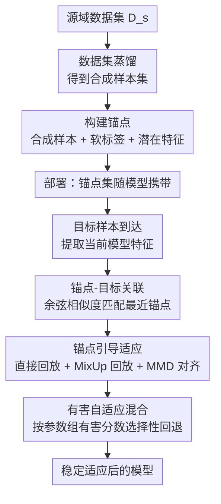

# Distill Once, Adapt Life-Long: Exploring Dataset Distillation for Continual Test-Time Adaptation

**会议**: ECCV 2026  
**arXiv**: [2606.20196](https://arxiv.org/abs/2606.20196)  
**代码**: [https://github.com/blue-531/DOALL](https://github.com/blue-531/DOALL)  
**领域**: 模型压缩  
**关键词**: 数据集蒸馏, 持续测试时适应, 灾难性遗忘, 源域锚点, 即插即用  

## 一句话总结
DO-ALL 在部署前用数据集蒸馏（DD）将源域压缩为一小组合成锚点（每个锚点包含合成样本、源模型软标签和潜在特征），测试时通过特征空间余弦相似度为每个目标样本匹配语义最近的锚点，用锚点回放、目标-锚点 MixUp 正则化和多层 MMD 特征对齐稳定模型更新，并辅以有害自适应混合机制按参数组梯度有害程度选择性回退到源模型初始化，以即插即用方式一致提升 EATA、RMT、ROID、ASR 等多种 CTTA 方法在 ImageNet-C 和 CCC 基准上的长期鲁棒性。

## 研究背景与动机
**A. 矛盾驱动型**

持续测试时适应（CTTA）场景中，模型部署后需面对持续变化的测试分布（天气、传感器退化、场景切换等），在线更新自身参数以维持预测质量，且无法获取目标标签。早期 TTA 方法（如 TENT、EATA）仅考虑单次分布偏移，CTTA 进一步要求模型在长时间、非稳态目标流上持续适应而不崩溃。

然而，实际部署中源域数据集往往因隐私或授权限制无法随模型保留，这催生了 source-free CTTA 方向。完全丢弃源域信息虽然满足了部署约束，却从根本上限制了长期稳定性：随着分布持续漂移，自训练信号越来越不可靠，反复更新会加剧灾难性遗忘。模型缺乏一个持久的"锚点"来固定其表示空间，这在极端长流场景（如 CCC 基准，750 万张持续漂移图像）下尤为致命。

已有工作尝试在不分发原始数据的前提下保留源域信息，如仅保存源域统计量、特征原型或轻量代理表示。这些策略一定程度缓解了漂移，但统计量和原型丢失了类别判别结构，难以提供足够精细的监督信号来对抗长期遗忘。

本文的核心洞察是：**数据集蒸馏（DD）天然适合填补这一缺口**。DD 能将大规模源域数据集压缩为极少量合成样本，这些样本被优化为保留类别判别结构和训练行为，且存储量比原始数据低数个数量级，隐私暴露风险大幅降低。DO-ALL 在部署前执行一次 DD 得到"蒸馏锚点"，部署后将其作为持久源域参考，通过锚点-目标语义匹配 + 回放 + 正则化 + 参数回退实现即插即用的 CTTA 稳定化。

核心 idea：**用 DD 将源域蒸馏为一小组携带多维信息（样本 + 软标签 + 特征）的紧凑锚点，测试时作为"不丢失的源域记忆"持续稳定模型更新。**

## 方法详解

### 整体框架

DO-ALL 是一个两阶段的即插即用框架：离线阶段用 DD 将源域压缩为锚点集；在线阶段将锚点作为持久参考，通过语义匹配为每个目标样本关联最近锚点，再用锚点引导的适应损失和有害自适应混合机制稳定模型更新。整个过程不改动现有 CTTA 方法的架构或优化目标，锚点仅作为追加的稳定化模块工作。

### 关键设计

**1. 源域蒸馏锚点构建：用一次 DD 将源域知识压缩为携带多维信息的紧凑参考点**

直接保存源域原始数据在隐私和存储上均不可行，而仅保存统计量或特征原型又会丢失类别判别结构。DO-ALL 的解法是在部署前对源域执行一次数据集蒸馏，得到一小组合成样本集 $\tilde{D}_s = \{\tilde{x}_i\}_{i=1}^{N_a}$，其中 $N_a \ll |D_s|$。此后，为每个蒸馏样本 $\tilde{x}_i$ 用源模型 $f_{\theta_0}$ 提取两项信息：软标签 $\tilde{s}_i = f_{\theta_0}(\tilde{x}_i)$（保留类间关系和置信度结构，而非硬标签）和潜在特征 $\tilde{z}_i = g_{\theta_0}(\tilde{x}_i)$（$g_{\theta_0}$ 为特征提取器，$\tilde{z}_i$ 捕获源域特征空间几何）。最终每个锚点打包为三元组 $\tilde{a}_i = (\tilde{x}_i, \tilde{s}_i, \tilde{z}_i)$，整个锚点集 $\tilde{\mathcal{A}}$ 随模型一同携带部署，作为贯穿整个 CTTA 过程的源域持久参考。

这个设计的关键优势在于，DD 合成样本本身被优化为保留源域训练动态的信息密集代理，比随机采样或聚类选出的 coreset 更精准地捕获类别结构（论文通过实验验证了这一点，见 Fig. 3 的正相关曲线）。同时软标签和潜在特征提供了决策层和表示层两个粒度的源域监督信号，为后续的适应损失提供了丰富的锚定信息。

**2. 锚点-目标关联：通过特征空间余弦相似度为每个目标样本匹配语义最近的源域参考**

测试流随时间漂移时，每个 batch 的目标样本通常只反映分布的局部区域。如果对所有锚点一视同仁地回放，会引入大量与当前上下文无关的噪声。DO-ALL 的解法是：对当前 batch 的每个目标样本 $x_b^t$，用当前模型的特征提取器 $g_\theta$ 计算其潜在表示 $z_b^t = g_\theta(x_b^t)$，然后与所有锚点特征 $\{\tilde{z}_i\}$ 计算余弦相似度 $\text{sim}(b,i) = \frac{z_b^t \cdot \tilde{z}_i}{\|z_b^t\|_2 \|\tilde{z}_i\|_2}$，取相似度最大的锚点作为该目标样本的关联锚点 $\tilde{a}_b^t$。

这个最近邻关联策略的效果在消融实验中得到了强力验证（Table 5）：随机选择锚点的增益微乎其微，选择最远锚点甚至会导致性能退化（如 RMT 从 59.8% 退化到 61.9% 错误率），而最近锚点一致带来最优提升。这说明 DO-ALL 的稳定化效果并非简单地"回放任意蒸馏数据"就能获得，而是需要保持目标样本与其语义对应锚点之间的精确对应关系。通过在特征空间中做关联，模型在语义一致的表示区域内进行适应，大幅提升了连续分布偏移下的稳定性。

**3. 锚点引导的适应目标：用直接回放 + 目标-锚点 MixUp + 层间 MMD 三管齐下稳定适应**

给定当前 batch 的关联锚点集 $\tilde{\mathcal{A}}^t$ 后，DO-ALL 通过两个互补目标驱动模型更新。

首先是锚点回放损失 $\mathcal{L}_{\text{replay}} = \mathcal{L}_{\text{dir}} + \mathcal{L}_{\text{mix}}$，由两项组成。(i) 直接回放 $\mathcal{L}_{\text{dir}} = \beta_s^2 \cdot \text{KL}(\text{softmax}(f_\theta(\tilde{x}_b)/\beta_s) \| \text{softmax}(\tilde{s}_b/\beta_s))$，用温度缩放 KL 散度强制模型在锚点上的预测与存储的源模型软标签保持一致，防止决策边界从源类别结构漂移。(ii) MixUp 回放：将每个目标样本 $x_b^t$ 与其匹配锚点 $\tilde{x}_b$ 做 MixUp 混合 $x_b^m = \lambda x_b^t + (1-\lambda)\tilde{x}_b$（$\lambda \sim \text{Beta}(\alpha,\alpha)$），混合软目标 $p_b^m = \lambda \text{softmax}(f_\theta(x_b^t)) + (1-\lambda)\text{softmax}(\tilde{s}_b)$，再施加 KL 一致性约束 $\mathcal{L}_{\text{mix}} = \text{KL}(\text{softmax}(f_\theta(x_b^m)) \| p_b^m)$。

目标-锚点 MixUp 的设计精巧之处在于：不是随机混合任意样本对，而是沿着"偏移后的目标 $\leftrightarrow$ 其语义对应锚点"这条有意义的插值路径做平滑。Table 1 的实验验证了这一点：目标-目标 MixUp 和锚点-锚点 MixUp 的增益均小于目标-锚点 MixUp，证实了语义对应路径上的平滑才是有效的。这种设计鼓励决策边界在适应实际发生的区域（目标-锚点流形）上平滑变化，抑制局部过拟合。

其次是特征层对齐损失 $\mathcal{L}_{\text{mmd}} = \sum_{\ell \in L} \|\mathbb{E}_{x^t}[\phi(g_\theta^\ell(x^t))] - \mathbb{E}_{\tilde{x}}[\phi(g_\theta^\ell(\tilde{x}))]\|_{\mathcal{H}}^2$，在多层上对目标样本和锚点特征做 MMD 对齐。锚点软标签虽然保住了决策层语义，但无法显式约束特征空间的漂移。随着测试流持续演进，特征提取器 $g_\theta$ 即使预测一致也可能发生表示坍缩或对目标域过拟合。层间 MMD 对齐强制演化中的表示空间保持与锚点特征空间的全局结构一致，从表示层抑制漂移。

总适应损失为 $\mathcal{L}_{\text{anchor}} = \mathcal{L}_{\text{replay}} + \lambda_{\text{mmd}} \mathcal{L}_{\text{mmd}}$。三者的分工清晰：$\mathcal{L}_{\text{dir}}$ 守住源域预测行为、$\mathcal{L}_{\text{mix}}$ 平滑局部决策几何、$\mathcal{L}_{\text{mmd}}$ 维护全局表示结构，彼此互补。

**4. 有害自适应混合：基于梯度有害分数选择性将不稳定参数组拉回源模型初始化**

锚点引导目标虽然指明了适应方向，但在长时间、高噪声的测试流中，模型参数仍会悄然累积有害漂移。DO-ALL 引入一个轻量的后处理机制：每次锚点更新后，计算参数变化量 $\Delta\theta = \theta_{\text{new}} - \theta_{\text{prev}}$ 和锚点驱动梯度 $g_S = \nabla_\theta \mathcal{L}_{\text{anchor}}$，将参数按层或参数组分组成 $\{G\}$，每组的有害分数定义为 $\text{score}(G) = \sum_{p \in G}(\langle g_S^{(p)}, \Delta\theta^{(p)}\rangle + \frac{1}{2}\hat{h}^{(p)}(\Delta\theta^{(p)})^2)$，其中 $\hat{h}$ 是平方梯度的滑动平均。

这个分数的物理含义是：当某组参数的更新方向与锚点梯度严重背离、且更新幅度大时（表现为内积项 + 二次惩罚项均为正值），该组被认为是"有害更新"。当分数超过阈值 $\rho$ 时，该组参数被部分回退到源模型初始化：$\theta^{(p)} \leftarrow (1-\beta_G)\theta^{(p)} + \beta_G\theta_0^{(p)}$，其中 $\beta_G = \beta_{\max}\sigma(\beta_s(s_G - 0.5))$ 随归一化有害分数 $s_G$ 自适应缩放。与 CoTTA 那种无差别随机回退不同，DO-ALL 的混合是选择性的——只回退"确实有害"的参数组，保留有益的适应更新。消融实验显示（Table 4 Row D vs E），在已有三种损失的情况下，加入有害自适应混合仍额外降低 0.4% 错误率，证明长期漂移的累积有害参数是一个独立的瓶颈。

### 一个完整示例：一张被高斯噪声损坏的"金毛犬"图像如何通过 DO-ALL 保持正确分类

假设源模型在 ImageNet 上训练完成，部署前已用 WMDD 蒸馏出 IPC=10（共 10,000 个锚点，ImageNet 1000 类各 10 张）。测试流的第一批到达，其中一张图像 $x_1^t$ 是"金毛犬"照片，被高斯噪声严重损坏（severity 5）。

步骤 1——关联锚点：当前模型 $f_\theta$（刚从源模型初始化）提取特征 $z_1^t$，与 10,000 个锚点特征 $\{\tilde{z}_i\}$ 逐一计算余弦相似度。最近的锚点 $\tilde{a}_1^t$ 恰好是 WMDD 为"金毛犬"类蒸馏的一张合成图（该合成图看起来并不像真实狗照片，更像模糊的纹理块，但其特征几何上最接近当前损坏图像的表示），其软标签 $\tilde{s}_1$ 在"金毛犬"维度上概率为 0.72，在"拉布拉多"上为 0.15，其余分散在相关犬种。

步骤 2——计算适应损失：$\mathcal{L}_{\text{dir}}$ 强制当前模型在该锚点合成图上的预测与软标签 $\tilde{s}_1$ 对齐（KL 散度），防止模型因为噪声损坏而把"金毛犬"误分类。同时，将 $x_1^t$ 与该锚点合成图用 $\lambda = 0.6$（从 Beta 分布采样）混合，得到融合图 $x_1^m$，混合软目标 $p_1^m$ 是当前模型预测与锚点软标签的加权组合，$\mathcal{L}_{\text{mix}}$ 强制模型在融合图上的预测与 $p_1^m$ 一致——这相当于沿着"损坏金毛犬 $\to$ 锚点金毛犬"的路径平滑了决策边界。$\mathcal{L}_{\text{mmd}}$ 则对齐 batch 内所有目标样本与对应锚点在多个中间层的特征分布，防止特征提取器被高斯噪声带偏。

步骤 3——有害自适应混合：将 $\mathcal{L}_{\text{anchor}}$ 叠加到 ROID 的 $\mathcal{L}_{\text{CTTA}}$ 上做一次梯度更新后，检查各参数组的有害分数。假设 conv5_x 层的参数更新方向与锚点梯度内积为正且幅度偏大（说明这层被噪声带偏了），其有害分数超过阈值 $\rho$，则该层参数以 $\beta_G = 0.03$ 的比例向源模型回退；而 fc 层的更新与锚点梯度方向一致（有益更新），不触发回退。最终模型既吸收了目标域的噪声统计信息，又保留了源域的类别判别边界，将 $x_1^t$ 正确分类为"金毛犬"。

### 损失函数 / 训练策略

DO-ALL 不替代现有 CTTA 方法的目标函数，而是作为附加的稳定化层叠加在原有适应损失 $\mathcal{L}_{\text{CTTA}}$ 之上。整体训练流程：目标 batch 到达 $\to$ 计算锚点关联 $\to$ 计算 $\mathcal{L}_{\text{anchor}}$（$\mathcal{L}_{\text{dir}} + \mathcal{L}_{\text{mix}} + \lambda_{\text{mmd}}\mathcal{L}_{\text{mmd}}$）$\to$ 叠加 $\mathcal{L}_{\text{CTTA}}$ 做梯度更新 $\to$ 执行有害自适应混合。关键超参：$\lambda_{\text{mmd}} = 10$，$\beta_{\max} = 0.05$，$\beta_s = 5$，MixUp 的 $\alpha$ 参数遵照标准设置。蒸馏锚点默认使用 WMDD 方法、IPC=10（每类 10 张合成图），但论文验证了对 SRe2L、DELT 等其他 DD 方法以及 IPC=1 到 IPC=10 均鲁棒。为进一步降低在线开销，可引入步长 $k$：每隔 $k$ 步才执行一次锚点计算（步长 7 时 FPS 从 106 恢复到 244，性能仅从 53.6% 微降到 53.9%）。

## 实验关键数据

### 主实验

ImageNet-to-ImageNet-C（严重程度 5，15 种损坏类型在线序列适应，分类错误率 %，越低越好）：

| 方法 | 平均错误率 | 说明 |
|------|-----------|------|
| Source (无适应) | 82.0 | 不更新，纯源模型 |
| TENT (ICLR21) | 62.6 | 熵最小化 |
| CoTTA (CVPR22) | 62.7 | 师生框架 + 随机参数恢复 |
| EATA (ICML22) | 58.0 $\pm$0.18 | 高效样本选择 + 熵最小化 |
| RMT (CVPR23) | 59.8 $\pm$0.18 | 对比 + 原型一致性 |
| ROID (WACV24) | 54.5 $\pm$0.10 | 鲁棒在线适应 |
| ASR (ICLR26) | 54.3 $\pm$0.14 | 自适应参数恢复 |
| **EATA + DO-ALL** | **56.6** $\pm$0.22 | +1.4 提升 |
| **RMT + DO-ALL** | **57.4** $\pm$0.23 | +2.4 提升 |
| **ROID + DO-ALL** | **53.6** $\pm$0.09 | +0.9 提升，新 SOTA |
| **ASR + DO-ALL** | **53.7** $\pm$0.13 | +0.6 提升 |

DO-ALL 在四种代表性 CTTA 基线上均获得一致提升，且 ROID + DO-ALL 达到 53.6% 的最优结果，成为该基准的新 SOTA。值得注意的是 RMT 本身已存储源域原型，但叠加 DO-ALL 仍获得 2.4 个百分点的显著提升，说明蒸馏锚点比原型携带了更丰富的结构化源域信息。

CCC 基准（750 万张图像持续漂移流，分类准确率 %，越高越好）：

| 方法 | Easy | Medium | Hard | 平均 |
|------|------|--------|------|------|
| CoTTA | 14.9 | 7.7 | 1.1 | 7.9 |
| EATA | 48.2 | 35.4 | 8.7 | 30.8 |
| TCA (CVPR25) | 49.1 | 39.5 | 10.1 | 32.9 |
| ROID | 48.5 | 39.2 | 13.2 | 33.6 |
| **ROID + DO-ALL** | **48.9** | **39.6** | **15.5** | **34.7** |

在最具挑战性的 Hard 场景（长时间暴露于未见分布）中，DO-ALL 带来 2.3 个百分点的显著提升（13.2% $\to$ 15.5%），证实在极端流长下蒸馏锚点作为持久参考确实能防止模型坍缩。"Distill Once, Adapt Life-Long"的命名在此得到最直接的验证。

### 消融实验

组件消融（ImageNet-C，ROID 基线，错误率 %）：

| 配置 | $\mathcal{L}_{\text{dir}}$ | $\mathcal{L}_{\text{mix}}$ | $\mathcal{L}_{\text{mmd}}$ | Blend | 错误率 | 说明 |
|------|:---:|:---:|:---:|:---:|------|------|
| Baseline | | | | | 54.5 | ROID 基线 |
| A | Y | | | | 54.1 | 仅直接回放 |
| B | | Y | | | 54.1 | 仅 MixUp 回放 |
| C | | | Y | | 54.2 | 仅 MMD 对齐 |
| D | Y | Y | Y | | 54.0 | 三损失联合 |
| E (DO-ALL) | Y | Y | Y | Y | **53.6** | 完整方法 |

单个组件的增益虽小但一致（+0.4%/0.4%/0.3%），说明三者各自作用于适应过程的不同侧面（防止遗忘、平滑决策边界、维护表示结构），互不冲突。三损失联合后错误率降至 54.0%，再加入有害自适应混合进一步降至 53.6%，证明长期累积的有害参数漂移是一个独立瓶颈。

锚点关联策略消融（ImageNet-C，错误率 %）：

| CTTA 基线 | Baseline | 随机锚点 | 最远锚点 | 最近锚点 (DO-ALL) |
|-----------|----------|---------|---------|-------------------|
| EATA | 58.0 | 57.3 | 58.7 | **56.6** |
| RMT | 59.8 | 60.2 | 61.9 | **57.4** |
| ROID | 54.5 | 54.0 | 54.0 | **53.6** |

最远锚点在 RMT 上甚至导致性能退化（+2.1% 错误率），强烈证明匹配质量是实现稳定化的核心——DO-ALL 不是"回放就行"，而是必须保持目标-锚点的语义对应。

### 关键发现

- 有害自适应混合是独立于三种损失的补充机制：三损失联合（54.0%）加 Blend 后跳变至 53.6%，贡献 0.4 个百分点的独立增益，说明长期适应中参数漂移的累积效应是一个独立瓶颈。
- 锚点质量与 CTTA 增益呈正相关（Fig. 3）：锚点集的独立验证准确率越高，CTTA 提升越大。DD 锚点（实心标记）一致优于 coreset 锚点（空心标记），说明 DD 的优化驱动压缩比简单采样携带了更多可迁移的语义结构。
- IPC=1 即可见效：每类仅 1 张合成图时已有可观提升（如 RMT 从 59.8% $\to$ 57.9%），DO-ALL 对锚点数量极为宽容，为存储极度受限的场景提供了可行方案。
- 跨架构泛化能力强：用 ResNet-18 蒸馏的锚点用于 ResNet-50 CTTA 时性能几乎不变（差异 <0.1%）；ViT $\to$ CNN 或 CNN $\to$ ViT 的跨架构迁移同样有效，说明蒸馏锚点携带的是架构无关的语义信息。

## 亮点与洞察

- DD 与 CTTA 的交叉融合思路本身具有启发性：DD 社区追求"用最少的合成样本保留最多的训练信息"，CTTA 社区追求"在没有源数据的情况下稳定长期适应"——两者的痛点天然互补。DO-ALL 找到了一个优雅的"胶合点"，将 DD 的产物（合成锚点）作为 CTTA 的稳定化输入，不改变两者的内部机制。论文 Fig. 3 的正相关曲线暗示了一个更大图景：DD 的任何进步都可以通过 DO-ALL 直接转化为 CTTA 的稳定化提升——这是一条持续受益的"搭便车"路径。
- 目标-锚点 MixUp 的设计值得复用：不是随机 MixUp，而是沿"偏移目标 $\leftrightarrow$ 语义对应锚点"这条有明确语义意义的路径做平滑。这种"匹配再做 MixUp"的模式可以迁移到任何需要将源域知识注入目标域适应的场景（如域泛化、联邦学习的客户端漂移校正、增量学习中的旧类回放），核心原则是"混可以，但别瞎混——沿着有意义的对应关系混"。
- 有害自适应混合的选择性回退机制比 CoTTA 的无差别随机回退更精细：通过锚点梯度与参数更新方向的一致性判断"哪些参数学歪了"，只拉回歪的部分，保留学对的部分。这种"选择性正则化"思路可迁移到任何有初始模型可参照的在线学习场景。
- 离线蒸馏 + 在线关联的分离设计实用性强：DD 只在部署前执行一次（离线成本），测试时只需做最近邻检索和少量前向/反向传播（在线成本低），FPS 和 GPU 显存开销可控（步长 7 时 FPS 244 vs 基线 285），锚点存储仅 1.55 GB（CPU）。这种非对称设计使得重计算被隔离在离线阶段，在线阶段足够轻量。

## 局限与展望

- 作者承认的局限：锚点选择策略和更新调度在非稳态流下仍有改进空间；当目标偏移是突变型或对抗性损坏时的鲁棒性未充分研究。
- 锚点-目标关联依赖当前模型的特征质量：如果在极端漂移下特征提取器已经严重劣化，余弦相似度匹配本身也可能变得不可靠，形成"劣化 $\to$ 错配 $\to$ 更劣化"的恶性循环。作者未讨论针对这一风险的诊断或保护机制。
- CCC 基准上 Easy 场景的增益几乎为零（48.5% $\to$ 48.9%），Hard 场景增益最大（13.2% $\to$ 15.5%）。这说明 DO-ALL 的锚定机制主要防止"灾难性坍缩"而非"锦上添花"——当分布偏移轻微时，现有 CTTA 方法已经足够，锚点的额外约束反而可能轻微限制对轻微偏移的灵活适应。一个自然的改进方向是让 Blend 强度根据偏移程度自适应调节（偏移小时减弱锚定，偏移大时加强锚定）。
- 蒸馏锚点只在可见源类别上有效：DO-ALL 无法帮助模型适应测试流中出现的全新类别（open-world CTTA），因为它依赖锚点-目标的语义对应。一个扩展方向是将 DD 与开集检测或 OOD 检测结合，对无匹配锚点的样本采用不同的适应策略。

## 相关工作与启发

- **vs CoTTA (CVPR 2022)**: CoTTA 使用师生框架 + 随机参数恢复来防止误差累积，恢复策略是无差别的（随机选参数回退）。DO-ALL 的有害自适应混合是有选择的——通过锚点梯度与参数更新的对齐程度判断哪些参数被"有害更新"，只回退这部分。实验上 ROID + DO-ALL（53.6%）显著优于 CoTTA（62.7%）。启发：在有时序依赖的适应中，"选择性正则化"比"无差别正则化"更有效。
- **vs RMT (CVPR 2023)**: RMT 存储源域特征原型并用对比目标保持特征接近源空间，本身就是一种源信息携带策略。DO-ALL 在此基础上进一步将原型替换为蒸馏锚点（不仅有点的表示，还多了样本输入和软标签），并引入目标-锚点 MixUp 和 MMD 对齐。实验结果 ROC 有力：RMT + DO-ALL（57.4%）比 RMT 单独（59.8%）提升 2.4 个百分点。启发：蒸馏数据比手工设计的原型携带更丰富的结构化信息，值得在更多源信息受限场景中替代手工原型。
- **vs DD 在持续学习中的应用 (如 Yang et al.)**: 已有工作将 DD 用于持续学习的反遗忘回放，但针对的是"有标签的新任务逐步到达"场景。DO-ALL 将 DD 引入 CTTA 这个更困难的无标签、非稳态单次遍历场景，且锚点的作用不仅是回放——还承担了语义匹配索引、MixUp 路径端点和特征空间对齐基准三重角色。启发：DD 产物的利用方式可以远比"当伪数据回放"更丰富。
- **vs TCA (CVPR 2025)**: TCA 在 CCC 上达到 32.9%，ROID + DO-ALL 达到 34.7%，虽然绝对提升不大，但 TCA 需要维护一个动态更新的类别质心库，而 DO-ALL 的锚点集是离线生成、部署后固定不变的——部署维护成本更低、隐私风险更可控。

## 评分
- 新颖性: 四星 — 首次将数据集蒸馏引入 CTTA 场景，DD+CTTA 的交叉有明确动机支撑，锚点的三维信息打包（样本+软标签+特征）及其多角色利用方式有设计新意，但核心组件（回放、MixUp、MMD、参数恢复）本身是已知技术的重新组合。
- 实验充分度: 五星 — 覆盖 3 个基准（CIFAR100-C、ImageNet-C、CCC）、4 种 CTTA 基线的即插即用验证、组件消融、关联策略消融、IPC 敏感性、3 种 DD 方法对比、跨架构实验（ResNet/ResNet、ViT/CNN 双向）、效率分析（FPS/显存/存储/步长）。Fig. 3 的锚点质量-CTTA 增益正相关分析是加分项，给出了深度机制层面的证据。
- 写作质量: 四星 — 结构清晰（部署前蒸馏 $\to$ 部署后关联 $\to$ 适应损失 $\to$ 有害混合，四阶段线性推进），Figure 2 的框架图信息密度高。不足之处是 Harm-Adaptive Blending 的 Eq.(13) 分数解释稍显简略，$\hat{h}$ 的滑动平均细节不够充分。
- 价值: 五星 — 直面 CTTA 的核心现实矛盾（没源数据但要稳定），提出了一条可行的实践路径（离线 DD + 在线轻量锚定），且设计了真正的即插即用接口（不改动已有 CTTA 方法）。正相关曲线暗示了 DD 社区的进步可持续为 CTTA 社区输送收益，这是更高层面的方法论价值。

<!-- RELATED:START -->

## 相关论文

- [\[CVPR 2026\] Cross-Architecture Adaptation: Cloud-Edge Continual Test-Time Adaptation with Dynamic Sampling and Heterogeneous Distillation](../../CVPR2026/model_compression/cross-architecture_adaptation_cloud-edge_continual_test-time_adaptation_with_dyn.md)
- [\[ECCV 2026\] MixTTA: Low-Rank Cross-Channel Mixing for Reliable Test-Time Adaptation](mixtta_low-rank_cross-channel_mixing_for_reliable_test-time_adaptation.md)
- [\[CVPR 2026\] Back to Source: Open-Set Continual Test-Time Adaptation via Domain Compensation](../../CVPR2026/model_compression/back_to_source_open-set_continual_test-time_adaptation_via_domain_compensation.md)
- [\[ECCV 2026\] Structural Assessment for Understanding and Guiding Dataset Distillation in Discrete Token Space](structural_assessment_for_understanding_and_guiding_dataset_distillation_in_disc.md)
- [\[ECCV 2026\] Distill on a Diet: Efficient Knowledge Distillation via Learnable Data Pruning](distill_on_a_diet_efficient_knowledge_distillation_via_learnable_data_pruning.md)

<!-- RELATED:END -->
