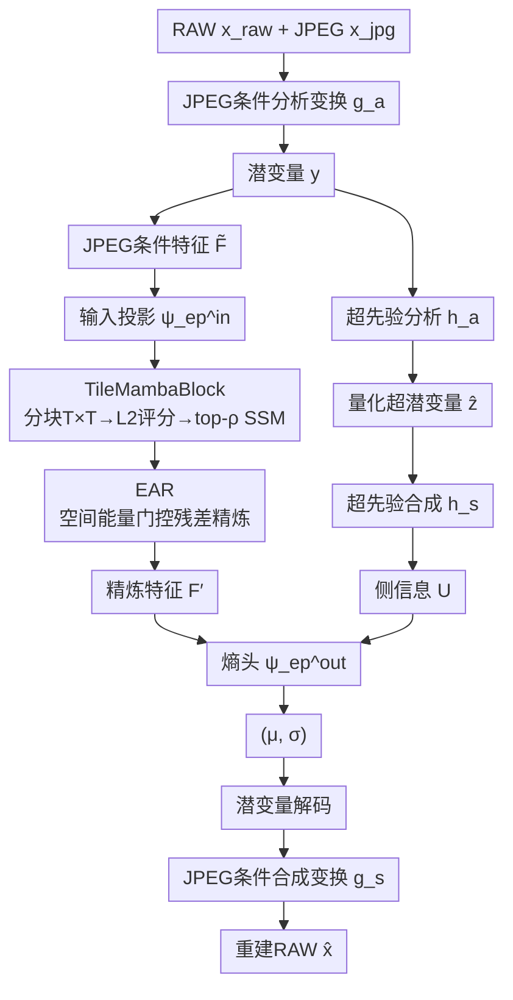

# MambaRaw: Selective State Space Modeling for Efficient 4K Raw Image Reconstruction

**会议**: ECCV2026  
**arXiv**: [2606.24479](https://arxiv.org/abs/2606.24479)  
**代码**: [https://github.com/Peizeli1/MambaRaw](https://github.com/Peizeli1/MambaRaw)  
**领域**: 模型压缩  
**关键词**: RAW图像重建, 元数据压缩, 状态空间模型, 选择性扫描, 能量感知

## 一句话总结

MambaRaw 将状态空间模型（SSM/Mamba）引入 JPEG 引导的元数据 RAW 图像重建框架的熵参数估计中，通过能量引导的分块选择性扫描（TileMambaBlock）与能量感知特征精炼（EAR）两个轻量模块，在 4K 分辨率下同时提升了重建质量（PSNR 提升 1.2–1.4 dB）并降低了编码延迟（约 9%）。

## 研究背景与动机

RAW 图像保留了传感器捕获的场景辐射信息，具有高比特深度和宽动态范围，是计算摄影和后期处理的高保真基础。然而直接存储或传输高分辨率 RAW 图像需要极大带宽——标准编码器（JPEG、HEIF 等）是为 sRGB 颜色空间设计的，而 RAW 信号的通道统计分布与 sRGB 差异巨大，直接套用编码效率极低。学到的图像压缩（LIC）通过可学习的上下文模型取得了显著的率-失真性能，但将其扩展到 RAW 数据面临额外挑战：不同相机传感器的 RAW 信号通道分布各异且极不均匀，统一的上下文模型难以适配。

近年的元数据重建框架（如 SAM、R2LCM、Beyond-R2LCM）利用机内 JPEG 预览作为侧信息来辅助 RAW 重建：编码端只传输一个紧凑的元数据比特流，解码端在 JPEG 预览的引导下重建出 RAW 图像。这些方法的核心瓶颈在于高分辨率下的上下文建模。卷积上下文模型感受野有限，在 4K 特征图上难以捕获远程空间相关性；Transformer 注意力机制的计算和内存随空间维度平方增长，实际部署非常困难。更关键的问题是，现有方法对全图所有区域施以相同密度的上下文建模——而自然图像中纹理/边缘区域和平滑背景区域的信息密度差异极大，这种"一视同仁"的设计浪费了大量计算。

本文的切入角度是，既然特征激活的 L2 能量可以近似反映区域的信息密度（高能对应纹理/边缘，低能对应平滑背景），就可以用能量作为计算分配的指导信号，让昂贵的全局建模只作用在必要区域。**核心 idea：提出空间-能量耦合的上下文建模范式（Spatial-Energy Coupled Context Modeling），将 Mamba 选择性扫描与能量感知精炼相结合——TileMambaBlock 按图块 L2 能量评分仅对信息密集块执行 SSM 扫描以节省计算，EAR 利用空间能量分布引导残差增强以适配 RAW 信号的长尾能量分布，两个轻量模块替换传统上下文模型后在 4K 分辨率下同时取得重建质量和效率的双重提升。**

## 方法详解

### 整体框架

MambaRaw 构建在 Beyond-R2LCM 的双层 VAE 骨干之上，在 Level-1 熵参数估计网络中植入空间-能量耦合的上下文模型，其余模块（分析/合成变换、超先验编解码、JPEG 条件注入方式）均保持原架构不变。整体流程如下：输入 RAW 图像 x_raw 与对齐的 JPEG 预览 x_jpg 经 JPEG 条件分析变换 g_a 映射为潜变量 y；经超先验分析/合成变换得到侧信息 U；同时 JPEG 条件特征 F̃ 进入熵上下文模型（本文核心创新），经输入投影 → TileMambaBlock → EAR 三步得到精炼特征 F′；与侧信息 U 拼接后经熵头预测各潜变量的独立单高斯分布参数 (μ, σ)；经熵编码和潜变量重建后由 JPEG 条件合成变换 g_s 得到重建 RAW 图像 x̂。JPEG 条件的注入方式简洁高效：在每个网络层将 JPEG 预览双线性插值到该层空间尺寸后与中间特征沿通道维拼接，全程无需跨注意力开销。

### 关键设计

**1. TileMambaBlock：基于能量引导的选择性状态空间扫描**

4K 特征图上全图均匀施加 Mamba 扫描仍然昂贵——虽为线性复杂度，但常数开销在超大特征图上不可忽视。TileMambaBlock 的关键洞察是用特征的 L2 能量作为信息密度的廉价代理，只对信息密集的图块执行 SSM 扫描。给定上下文输入特征 $\mathbf{F}_{\text{in}} \in \mathbb{R}^{C \times H \times W}$，先划分为 $T \times T$ 的非重叠图块（默认 $T=64$）；对每个图块计算 L2 能量评分作为信息密度估计：

$$
S_i = \frac{1}{C T^2} \sum_{c,h,w} \mathbf{t}_i[c,h,w]^2
$$

根据保留比 $\rho$（默认 0.5）选取 top-k 高能块，仅对这些块应用 Mamba SSM（使用 VMamba 的 VSS 块，四方向交叉扫描），其余低能块直接跳过不做任何操作。这种设计天然利用了高频信息在自然图像中的空间稀疏性——纹理/边缘集中在少数图块中，平滑背景不需要全局推理。L2 能量作为评分指标比随机选择高出 0.33 dB PSNR，且比熵或梯度计算更轻量（仅有平方求和，无需额外卷积），选择本身的开销仅占总推理的 5.2%。当输入尺寸小于图块尺寸时模块自动退化为密集 SSM，保证了训练 patch（256×256）阶段的兼容性。

**2. Energy-Aware Refinement (EAR)：能量感知的长尾分布特征精炼**

经过 TileMambaBlock 的特征已在全图层面获得了高效的远程上下文聚合，但 RAW 信号的特征能量分布具有明显的长尾特性——少数空间位置集中了大部分能量，而大多数位置能量偏低，统一的上下文模型难以精准捕捉这种不均匀分布。EAR 是一个轻量化的残差精炼模块，核心思路是从特征自身的空间能量分布中学习每处的精炼强度。具体地，对 TileMambaBlock 输出 $\mathbf{F}_c$ 沿通道求平方均值得到空间能量图 $\mathbf{e} = \frac{1}{C} \sum_j (\mathbf{F}_{c,j})^2$；通过 $1\times1$ 卷积加 sigmoid 生成门控张量 $\mathbf{g} = \sigma(\text{Conv}_{1\times1}(\mathbf{e}))$；同时 $\mathbf{F}_c$ 经两个 $1\times1$ 卷积（中间 ReLU）得到残差变化 $\Delta\mathbf{F}$，最后一个 $1\times1$ 卷积零初始化。最终输出 $\mathbf{F}' = \mathbf{F}_c + \mathbf{g} \odot \Delta\mathbf{F}$。与 SENet 的全局平均池化 + 通道重标定不同，EAR 保留了精细的空间粒度——每个空间位置独立获得精炼强度，避免了平滑高频细节。零初始化的恒等设计至关重要：熵模型在训练早期尚未收敛，此时 $\Delta\mathbf{F} \approx 0$ 使 $\mathbf{F}' \approx \mathbf{F}_c$，待模型逐渐收敛后精炼分支才渐进激活，保证了训练稳定性。

### 损失函数 / 训练策略

采用率-失真优化 $\mathcal{L} = R(\hat{\mathbf{y}}) + R(\hat{\mathbf{z}}) + \lambda \cdot D(\mathbf{x}, \hat{\mathbf{x}})$，其中 $R$ 为元数据比特率估计，$D$ 为 MSE 重建损失。分别对 $\lambda \in \{0.02, 0.24, 0.8, 1.5, 2.0, 5.0, 10.0, 20.0\}$ 训练独立模型以覆盖不同率-失真工作点。使用 Adam 优化器，初始学习率 $1 \times 10^{-4}$，余弦退火至 $1 \times 10^{-6}$，训练 1000 epoch，batch size 8。训练时使用 256×256 patch（TileMambaBlock 自动退化为密集 SSM），推理时在 4K 全分辨率下才启用分块选择机制——这种"训练时学全图能力、推理时按需裁剪"的设计使性能在不同分辨率间一致。

## 实验关键数据

### 主实验

在 NUS 数据集（Samsung NX2000、Olympus E-PL6、Sony SLT-A57 三款相机）和 AdobeFiveK 数据集上对比 SAM、CAM、R2LCM、Beyond-R2LCM 等方法。

| 数据集 | 相机/配置 | bpp ↓ | PSNR ↑ | SSIM ↑ |
|--------|-----------|-------|--------|--------|
| NUS | Samsung (Beyond-R2LCM) | 0.3763 | 56.74 | 0.9996 |
| NUS | Samsung (MambaRaw) | **0.3612** | **57.91** | **0.9997** |
| NUS | Olympus (Beyond-R2LCM) | 0.3763 | 59.04 | 0.9997 |
| NUS | Olympus (MambaRaw) | **0.3612** | **60.45** | **0.9998** |
| NUS | Sony (Beyond-R2LCM) | 0.3763 | 58.21 | 0.9996 |
| NUS | Sony (MambaRaw) | **0.3612** | **59.58** | **0.9997** |
| AdobeFiveK | 低比特率 (Beyond-R2LCM) | 3.760e-4 | 58.44 | 0.9997 |
| AdobeFiveK | 低比特率 (MambaRaw) | **3.150e-4** | **58.55** | **0.9997** |

在 4K 真实分辨率（3840×2160, λ=0.8）下，MambaRaw 以相同参数量相比 Beyond-R2LCM 提升 1.37 dB PSNR，FLOPs 降低约 56%（5420.7G → 2380.5G），GPU 内存从 22.8 GB 降至 10.2 GB，端到端编码延迟降低约 9%（3125 ms → 2859 ms）。

### 消融实验

| 配置 | PSNR ↑ | 时延 ↓ | 说明 |
|------|--------|--------|------|
| Baseline (Beyond-R2LCM) | 58.21 | 563 ms | 元数据基线 |
| + EAR | 58.55 | 570 ms | 仅加能量精炼，+0.34 dB，延迟几乎不变 |
| + SSM (Dense) & EAR | 59.61 | 584 ms | 密集 SSM 带来 +1.06 dB 大幅提升，延迟略增 |
| MambaRaw (TileSelect + SSM + EAR) | **59.58** | **515 ms** | 分块选择维持 59.58 dB 的同时降低 12% 时延 |

| 选择策略 | PSNR ↑ | 时延 ↓ |
|---------|--------|--------|
| 随机选择 | 59.25 | 515 ms |
| 熵得分 | 59.55 | 542 ms |
| 梯度幅度 | 59.52 | 528 ms |
| **L2 能量（本文）** | **59.58** | **515 ms** |

| 基础模块 | PSNR ↑ | 时延 ↓ |
|---------|--------|--------|
| CNN (ResBlock) | 58.45 | 480 ms |
| Transformer (Swin) | 59.52 | 620 ms |
| **SSM（本文）** | **59.58** | **515 ms** |

### 关键发现

- **EAR 贡献小而稳定**：仅 +0.34 dB 但几乎不增加延迟，且所有 λ 和相机子集上一致上行——零初始化的恒等设计使精炼逐步激活，不会破坏未收敛的熵模型。
- **TileMambaBlock 的加速远超精度代价**：密集 SSM + EAR 达 59.61 dB；分块选择后维持 59.58 dB（仅降 0.03 dB），时延降至 515 ms（-12%），验证了自然图像约一半区域不需要全局推理的假设。
- **ρ=0.5 为最优折中点**：ρ 从 0.25 升至 0.5，PSNR 跳升 0.16 dB（59.42→59.58）；再升至 1.0 仅额外增加 0.03 dB 而时延从 515 ms 升至 584 ms。
- **L2 能量在精度和效率上均优于熵/梯度**：熵和梯度作为选择指标需额外卷积计算（增加 13–27 ms），L2 能量一次求和即得，选择开销仅占 5.2%。
- **SSM 在精度-效率之间优于 CNN 和 Transformer**：CNN 效率高但精度低（58.45 dB）；Transformer 精度接近（59.52 dB）但时延高 20%（620 ms）；SSM 以 515 ms 同时实现最佳精度（59.58 dB）。

## 亮点与洞察

- **L2 能量作为计算分配代理指标的极低成本方案**：仅一次平方求和即得信息密度估计，无需额外参数或卷积，选择开销仅 5.2%。这个思路可迁移到其他高分辨率任务的注意力/计算资源分配中。
- **零初始化恒等残差用于训练稳定性**是一个值得复用的 trick：EAR 的最后一个 1×1 卷积零初始化使精炼分支在训练早期退化为恒等映射，待熵模型收敛后再渐进激活，有效避免了未收敛时的梯度扰动。
- **训练/推理行为解耦**：训练时用小 patch 做密集 SSM 学习全局建模能力，推理时在 4K 全分辨率下启用分块选择。这种设计思路也适用于其他高分辨率视觉任务（分割、检测等存在训练 patch 和全图推理不一致的场景）。
- **JPEG 条件注入极简洁**：仅靠双线性缩放 + 通道拼接就实现了有效引导，不依赖跨注意力或交叉模态融合的复杂设计，确保本文方法能直接替换 Beyond-R2LCM 的熵上下文模块而不改动骨干架构。

## 局限与展望

- **仅处理单帧 RAW**：未利用视频帧间的时序冗余。作者提出可结合 VideoMamba 的时间 SSM 设计扩展至 RAW 视频重建。
- **L2 能量作为信息密度代理有其盲区**：对于纹理不丰富但语义重要的区域（如人脸、文本边缘模糊区）可能低估其重要性，更精细的语义感知选择策略有望进一步改善。
- **仅在三款相机上验证**：NUS 子集只包含 Sony/Olympus/Samsung，未覆盖更多传感器型号（如手机 CMOS），跨相机泛化能力需更多证据。
- **选择调度仍有优化空间**：当前 Top-K 选择 + pad/reshape/unpad 操作耗时 27 ms，若能设计更硬件友好的选择调度（固定掩码游走或并行索引）可进一步压缩。

## 相关工作与启发

- **vs Beyond-R2LCM**：共享相同的双层 VAE 骨干和解码结构，唯一区别是将卷积熵参数估计器替换为 TileMambaBlock + EAR 的空间-能量耦合上下文模型。这一替换在 4K 下同时实现了 1.2–1.4 dB PSNR 提升和约 9% 延迟降低与 56% FLOPs 缩减。
- **vs RAWMamba**：RAWMamba 使用 Mamba 做统一的 sRGB-to-RAW 去渲染网络，解决的是无元数据约束的域转换问题；MambaRaw 解决的是有明确元数据比特率约束的 JPEG 引导重建问题，两者设定不同。
- **vs MambaIC / CMIC**：这些工作将 SSM 引入图像压缩的上下文模型或骨干网络。MambaRaw 的独特性在于 ① 空间-能量耦合的双模块设计，② 以能量引导的选择性计算实现效率提升，③ JPEG 条件注入的简易方案。能量引导的选择计算思路可推广到其他有分块处理需求的压缩模型中。

## 评分
- 新颖性: ⭐⭐⭐⭐ 将 SSM 选择性扫描与能量引导的计算分配结合用于 RAW 重建的上下文建模，设计巧妙；但 SSM 用于图像压缩已有 MambaIC 等探索。
- 实验充分度: ⭐⭐⭐⭐⭐ 三相机子集 + AdobeFiveK 全面 RD 对比，逐组件消融（EAR/SSM/TileSelect），选择指标对比，基础模块对比，超参敏感度分析，4K 真实性能数据，实验设计完整。
- 写作质量: ⭐⭐⭐⭐ 动机清晰，方法叙述有条理，伪代码 + 算法 + 定性图齐备。正文中部分表格编号和正文引用有不一致（如正文引 Table 4 实际为 4K 性能表）。
- 价值: ⭐⭐⭐⭐⭐ 4K 高分辨率 RAW 重建在计算摄影、云存储、移动影像中有实际需求，1.2–1.4 dB PSNR 提升 + 9% 延迟降低 + 56% FLOPs 缩减的性价比极高，能量引导的选择计算思路可推广到其他高分辨率视觉任务。

<!-- RELATED:START -->

## 相关论文

- [\[ICML 2026\] Semantic Cache Distillation: Efficient State Transfer via Reuse and Selective Patching](../../ICML2026/model_compression/semantic_cache_distillation_efficient_state_transfer_via_reuse_and_selective_pat.md)
- [\[ICML 2025\] Parameter-Efficient Fine-Tuning of State Space Models](../../ICML2025/model_compression/parameter-efficient_fine-tuning_of_state_space_models.md)
- [\[ICLR 2026\] AIRE-Prune: Asymptotic Impulse-Response Energy for State Pruning in State Space Models](../../ICLR2026/model_compression/aire-prune_asymptotic_impulse-response_energy_for_state_pruning_in_state_space_m.md)
- [\[ICLR 2026\] The Curious Case of In-Training Compression of State Space Models](../../ICLR2026/model_compression/the_curious_case_of_in-training_compression_of_state_space_models.md)
- [\[ICLR 2026\] SSDi8: Accurate and Efficient 8-bit Quantization for State Space Duality](../../ICLR2026/model_compression/ssdi8_accurate_and_efficient_8-bit_quantization_for_state_space_duality.md)

<!-- RELATED:END -->
