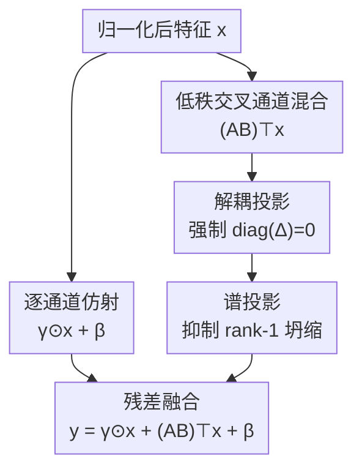

# MixTTA: Low-Rank Cross-Channel Mixing for Reliable Test-Time Adaptation

**会议**: ECCV 2026  
**arXiv**: [2606.28142](https://arxiv.org/abs/2606.28142)  
**代码**: [https://github.com/delta6189/MixTTA](https://github.com/delta6189/MixTTA)  
**领域**: 模型压缩 / 测试时自适应  
**关键词**: 测试时自适应, 低秩分解, 跨通道混合, 分布偏移, 归一化层

## 一句话总结
MixTTA 在归一化层的逐通道仿射变换基础上，插入一个低秩残差跨通道混合模块，使测试时自适应（TTA）能够纠正分布偏移引起的通道间相关结构变化，配合解耦投影和谱投影两个正则手段防止对角泄露与秩一坍缩，在标准与 wild TTA 场景下即插即用地提升 Tent / EATA / SAR / DeYO / ReCAP 五大基线的精度和稳定性。

## 研究背景与动机
测试时自适应（TTA）的核心范式由 Tent 奠定：只更新归一化层的逐通道仿射参数（scale γ 和 bias β），最小化预测熵来适应目标分布。后续方法如 EATA、SAR、DeYO、ReCAP 都在此框架上叠加正则化、样本筛选、置信度估计等策略，但**仿射变换本身的结构形式从未被审视过**——所有方法都默认 y = γ⊙x + β 这个对角形式的通道调制是足够的。

问题在于，分布偏移不仅改变逐通道的方差，还会**根本性地改变通道间相关结构**。作者在 ImageNet-C 上测量了源域和目标域特征在各层归一化后的相关距离（correlation distance），发现：相关距离随腐蚀严重程度单调递增，且浅层比深层的相关破坏严重得多。然而，逐通道仿射在几何上只能做沿坐标轴的缩放和平移（等价于对角矩阵 Γ 乘 x），**完全无法纠正非对角方向的跨通道结构变化**。TCA 试图在测试时对齐最后一层特征的相关性，但浅层最严重的相关错位被完全忽略。

核心 idea：用一个低秩残差项 (AB)^T x 扩展对角仿射，使得每层归一化后的通道调制变为 y = γ⊙x + (AB)^T x + β，其中 A∈R^{C×r}, B∈R^{r×C}, r≪C。低秩设计既避免全矩阵 W∈R^{C×C} 带来的 C² 参数量爆炸和过拟合风险，又保留了预训练对角参数的强归纳偏置（B 初始化为零，启动时退化为 Tent）。

## 方法详解

### 整体框架
MixTTA 是一个插入归一化层内部的即插即用模块，不改变骨干网络结构。给定归一化后的特征 x∈R^{C×T}（C 为通道数，T 为 token 数），模块包含两条并行支路：上支路保持 Tent 原有的逐通道仿射 γ⊙x + β；下支路通过低秩矩阵 A∈R^{C×r} 和 B∈R^{r×C} 实现跨通道混合 (AB)^T x。两条支路的结果相加得到输出 y。低秩支路在每次前向传播前执行解耦投影（强制 diag(Δ)=0），在每次反向传播时对梯度施加谱投影（抑制 rank-1 方向）。整个模块只在前 5 个 transformer block 的第二个归一化层中插入，参数量仅增加约 18k。

### 关键设计

**1. 低秩交叉通道混合：扩展对角仿射以捕获跨通道依赖**

Tent 的 y = γ⊙x + β 等价于 y = Γx + β，其中 Γ = diag(γ) 是对角矩阵，天然只能做逐通道独立缩放，无法建模通道间的交互。当分布偏移改变了通道间的协方差结构时，对角调制能做的调整非常有限。一个直接的想法是把 Γ 换成完整的通道混合矩阵 W∈R^{C×C}，但这会引入 C² 个参数（以 ViT 为例 C=768，单层就增加约 590k 参数），在无标签在线优化场景下极易过拟合甚至直接坍缩。实验中把 Γ 替换为全矩阵 W 后，所有基线的准确率都跌到 0.1%（Table 6 "Full rank" 列），验证了全矩阵是不可行的。

MixTTA 的解决方案是将 W 分解为对角基线与低秩扰动之和：W = Γ + Δ，其中 Δ = (AB)^T，A∈R^{C×r}，B∈R^{r×C}，秩 r≪C（实验取 r=4）。完整调制公式为：

$$y = \gamma \odot x + (AB)^{\top} x + \beta$$

这里 Γ 保持了 Tent 的逐通道能力，Δ 则通过先将特征投影到 r 维紧凑子空间再重建回 C 维，捕获最主要的跨通道相关模式。B 初始化为零矩阵，确保适应开始时 Δ=0，模型等价于 Tent，从稳定的预训练状态 warm-start。这一设计的关键 insight 是：**分布偏移引起的跨通道相关变化虽然是全局性的，但其主要能量集中在少数几个主导方向上**——低秩足以捕获，全秩反而引入不必要的自由度导致不稳定。

**2. 解耦投影：强制对角/非对角功能分离**

虽然 Δ 的设计意图是捕获跨通道（非对角）交互，但它的对角线元素 Δ_{ii} = a_i^T b_i 天然非零，会引入额外的逐通道调制，与 Γ 的职责重叠。这种功能耦合会使两个支路的角色模糊，低秩支路可能部分退化回对角缩放，浪费其跨通道建模能力。

解耦投影的解决方式直接而优雅：在前向传播前，把 b_i 投影到 a_i 的正交补空间上：

$$b_i' \leftarrow b_i - \text{sg}\left(\frac{a_i^{\top} b_i}{\|a_i\|_2^2 + \epsilon} a_i\right), \quad \forall i \in \{1,\dots,C\}$$

其中 sg(·) 是 stop-gradient 操作符。这一步保证 a_i^T b_i' = 0，从而 Δ_{ii} = 0 对所有 i 成立。解耦投影只在每步前向传播前执行一次，不增加可学习参数，计算开销可忽略。消融实验表明（Fig. 3c），关闭解耦投影时 ‖diag(Δ)‖_2 随适应步数持续增长，最终导致精度下降——对角泄露确实会损害低秩支路的跨通道校正效果。

**3. 谱投影：防止非平稳测试流下的秩一坍缩**

在在线 TTA 中，如果测试数据流存在偏置或非平稳（如类别不平衡、单样本适应），仅靠熵最小化驱动的 Δ 更新会逐渐坍缩到 rank-1 模式。作者对梯度动力学做了分析：由链式法则，A 的梯度 ∇_A L = x(Bg)^T，B 的梯度 ∇_B L = (A^T x) g^T，其中 g = ∂L/∂y。SGD 更新形成了 A ← A - δ·x(Bg)^T 和 B ← B - δ·(A^T x)g^T 的交替动力学——A 的更新依赖 B，B 的更新依赖 A，构成正反馈回路。当子空间特征的协方差矩阵高度各向异性（λ_1 ≫ λ_2）时，这个交替更新会反复强化主导方向，使 A 和 B 的列逐渐对齐到同一个主轴，低秩更新退化为 rank-1。

谱投影的应对策略是：计算子空间特征 z = A^T x 的协方差矩阵的主特征向量 u_1（通过幂迭代高效获取），构造投影算子：

$$P = I - \eta \frac{u_1 u_1^{\top}}{\|u_1\|_2^2 + \epsilon} \in \mathbb{R}^{r \times r}$$

其中 η∈[0,1] 控制投影强度（实验取 0.9）。反向传播时将低秩梯度投影：∇_A ← ∇_A P，∇_B ← P ∇_B。这相当于在梯度层面抑制了 rank-1 方向，强制优化分散到更丰富的子空间方向上。对于批处理输入，对每个样本独立计算投影矩阵后取平均 P̄ 作为批级投影算子。消融实验（Fig. 3a, 3b）表明：关闭谱投影时，随着条件数 κ 急剧增长（λ_max/λ_min 爆炸），精度也迅速跌落；开启谱投影后 κ 保持有界，精度稳定。

### 损失函数 / 训练策略
MixTTA 本身不引入新的损失函数，而是复用基线的 TTA 目标（如 Tent 的预测熵最小化 L_Ent）。整个模块仅在测试时在线更新，不需要任何源域数据或标签。关键超参：子空间维度 r=4，谱投影强度 η=0.9，学习率 0.001（batch size=1 时翻倍至 0.002），A 用 Xavier 初始化，B 初始化为零矩阵。MixTTA 只插入前 5 个 transformer block 的第二个 LayerNorm 层中。

## 实验关键数据

### 主实验
在 ImageNet-C（severity 5）mild 场景下，MixTTA 作为插件集成到 5 个 TTA 基线中，均取得一致的精度提升。下表汇总各方法在 15 种腐蚀类型上的平均准确率：

| 方法 | 参数规模 | Mild 平均准确率 (%) | vs 基线 |
|------|---------|---------------------|---------|
| No Adapt | - | 31.6 | - |
| LinearTCA | - | 32.8 | - |
| LinearTCA+ (ReCAP) | - | 64.5 | - |
| Tent | 27,648 | 51.2 | - |
| Tent + MixTTA | 46,080 | 55.2 | **+4.0** |
| EATA | 27,648 | 61.7 | - |
| EATA + MixTTA | 46,080 | 63.5 | **+1.8** |
| SAR | 27,648 | 56.7 | - |
| SAR + MixTTA | 46,080 | 57.2 | **+0.5** |
| DeYO | 27,648 | 63.8 | - |
| DeYO + MixTTA | 46,080 | 65.6 | **+1.8** |
| ReCAP | 27,648 | 64.0 | - |
| ReCAP + MixTTA | 46,080 | 64.9 | **+0.9** |

在 wild 场景下 MixTTA 的优势更加明显。在线不平衡标签偏移（imbalance ratio ∞）下，Tent 在 Snow 腐蚀上从无适应的 15.9% 暴跌至 10.2%，加入 MixTTA 后恢复到 45.5%；ReCAP + MixTTA 达到 65.7%，超过 ReCAP + LinearTCA 的 65.0%。在 batch size=1 场景下，EATA 从 47.2% 提升至 61.2%（+14.0pp），说明 MixTTA 在单样本统计不可靠时显著稳定了适应过程。在混合偏移（15 种腐蚀混合）下，DeYO + MixTTA 提升 +2.8pp，远超 LinearTCA+ 的 +0.2pp。ImageNet-Sketch 上 Tent + MixTTA 在三种场景下均恢复至少 24pp 的严重退化精度。

### 消融实验
**秩 r 的敏感性（ImageNet-C severity 5, mild）**：

| 秩 r | Tent+MixTTA | EATA+MixTTA | SAR+MixTTA | DeYO+MixTTA | ReCAP+MixTTA |
|------|-------------|-------------|------------|-------------|--------------|
| 1 | 53.7 | 62.4 | 55.0 | 64.0 | 63.6 |
| 2 | 54.7 | 62.5 | 55.9 | 65.1 | 64.2 |
| 4 | **55.2** | **63.5** | **57.2** | **65.6** | **64.9** |
| 8 | 55.0 | 62.7 | 56.6 | 65.4 | 64.1 |
| 16 | 54.6 | 62.5 | 55.9 | 64.9 | 63.6 |
| Full rank (C×C) | 0.1 | 0.1 | 0.1 | 0.1 | 0.1 |

r=4 在五个基线上同时达到最优，说明适度的低秩足以捕获主要的跨通道偏移模式；继续增大秩反而因引入冗余自由度导致不稳定。全秩矩阵直接坍缩至 0.1%，验证了低秩参数化本身就是强正则化。

**解耦投影（DP）与谱投影（SP）消融（ImageNet-C Snow severity 5, 不平衡标签偏移）**：同时开启 DP 和 SP 的精度轨迹最稳定，单独关闭 SP 时条件数 κ 急剧增长并伴随精度跌落，单独关闭 DP 时 ‖diag(Δ)‖_2 持续上升最终拖累精度。两个投影分别解决不同的问题——DP 防止功能耦合，SP 防止秩坍缩——且二者互补。

**参数与开销分析**：MixTTA 为 DeYO 和 ReCAP 各增加约 18,432 个可学习参数，GPU 运行时间增加约 4%（50,000 样本，A5000）。作为对照，将所有 transformer block 的归一化层都设为可学习（Full block）虽然参数更多，但精度反而下降（DeYO: 63.8→62.1, ReCAP: 64.0→62.4），说明 MixTTA 的收益来自结构化的低秩跨通道变换，而非简单增加可训参数。

### 关键发现
- 低秩设计（r=4）是关键：秩太小捕获不足，秩太大引入不稳定，r=4 在所有基线上同时最优，无需逐方法调参
- 谱投影是 wild 场景下的救生索：非平稳测试流下 rank-1 坍缩是精度崩溃的直接原因，谱投影通过抑制主导特征方向将条件数 κ 保持在有界范围，是 wild 场景下 MixTTA 大幅优于基线的核心机制
- 浅层相关破坏最严重，MixTTA 自适应地在浅层施加更大校正（Fig. 4a），这种层间校正分配完全由熵驱动优化自动产生，无需任何显式的逐层加权
- 全秩通道混合直接坍缩（准确率 0.1%），说明在无标签在线 TTA 场景下，参数效率不仅是工程需求，更是稳定适应的必要条件

## 亮点与洞察
- **从几何角度审视 TTA 参数化**：用相关距离测量揭示分布偏移改变的是通道间协方差结构，而非仅仅是逐通道方差——这个观察简单但此前无人提出。它解释了为什么 Tent 在某些腐蚀类型（如 Snow、Frost）上会严重退化：这些腐蚀恰好大幅改变了通道间相关性，而对角仿射对此无能为力。
- **低秩作为正则化而非妥协**：通常低秩分解被视为全秩的近似/妥协，但本文用实验证明在在线 TTA 中低秩本身就是更好的选择——全秩直接坍缩。这说明在无标签、非平稳、单次遍历的在线学习场景下，"少即是多"原则适用于参数化设计。
- **两个投影解决两个独立问题**：解耦投影和谱投影分别针对对角泄露和秩一坍缩，二者互不冗余、缺一不可。这种"识别独立失效模式 → 设计针对性机制"的方法论值得在其他自适应场景中复用——例如 domain adaptation 中的适配器设计、联邦学习中的本地模型更新约束，都可以借鉴"对角/非对角分离 + 谱正则"的组合。

## 局限与展望
- 作者承认的一个局限是秩 r 目前为固定值（4），无法根据分布偏移的严重程度和类型自适应调整。一个直接改进方向是设计自适应秩选择策略，根据在线估计的通道相关距离动态调整 r。
- 实验仅在 ViT + LayerNorm 架构上验证，虽然补充材料声称 ResNet 上也有提升，但核心分析（如逐层相关距离、谱结构）均基于 Transformer。对于 BatchNorm 架构（如 ResNet），其批统计估计在 batch size=1 时的行为与 LayerNorm 不同，MixTTA 在极小 batch 下的表现需要独立验证。
- 谱投影对幂迭代的依赖引入了额外的计算步骤（每步需估计主特征向量），虽然开销声称很小，但在边缘设备上的实时性需要进一步评估。
- MixTTA 只在归一化层内部做跨通道混合，未涉及注意力机制中的通道交互。考虑到自注意力本身就是跨 token 的混合，在注意力中加入类似的低秩通道调制可能带来额外收益。

## 相关工作与启发
- **vs Tent / EATA / SAR / DeYO / ReCAP**: 这些方法都在 Tent 的"只更新逐通道仿射参数"框架内叠加策略，MixTTA 首次从参数化结构本身出发扩展容量。MixTTA 与它们正交——可以即插即用到任一个上，且在所有基线上均带来一致提升。
- **vs TCA (Test-time Correlation Alignment)**: TCA 在测试时对齐最后一层特征的协方差结构，但只操作最终表示层，忽略了浅层更严重的相关错位。MixTTA 把跨通道校正分散到多个归一化层中，实现了分层级的、由熵驱动自适应分配的相关对齐，比 TCA 更细粒度且开销更小。
- **vs LoRA 类低秩适配**: LoRA 对权重矩阵做低秩分解用于微调，MixTTA 对归一化层内的通道变换做低秩分解用于 TTA。两者的共性在于低秩=参数效率+正则化，但应用层和目的不同：LoRA 是离线微调，MixTTA 是在线无标签适应。一个有趣的方向是将 MixTTA 的谱投影机制引入 LoRA 类方法中，防止低秩 adapter 在持续学习场景下的 rank-1 坍缩。

## 评分
- 新颖性: ⭐⭐⭐⭐☆ 首次揭示 TTA 中逐通道仿射的几何局限性并用低秩跨通道混合解决，问题视角新，但低秩分解和谱正则本身在 ML 中并非新技术
- 实验充分度: ⭐⭐⭐⭐⭐ 覆盖 5 个基线 x 4 种场景 x 两个数据集，消融覆盖秩敏感性、DP/SP 各自贡献、参数开销、层间相关性分析、谱结构分析，非常扎实
- 写作质量: ⭐⭐⭐⭐☆ 动机（相关距离分析）→ 方法（三个组件层层递进）→ 实验（主表 + wild + 消融 + 分析）逻辑清晰，梯度动力学分析解释 rank-1 坍缩的形成机制尤为出彩
- 价值: ⭐⭐⭐⭐☆ 即插即用、所有基线上一致提升、4% 运行时开销，实用性强；打开 TTA 参数化结构设计的新方向，后续工作可能围绕"归一化层内还能做什么结构化变换"展开

<!-- RELATED:START -->

## 相关论文

- [\[CVPR 2026\] Cross-Architecture Adaptation: Cloud-Edge Continual Test-Time Adaptation with Dynamic Sampling and Heterogeneous Distillation](../../CVPR2026/model_compression/cross-architecture_adaptation_cloud-edge_continual_test-time_adaptation_with_dyn.md)
- [\[ECCV 2026\] Distill Once, Adapt Life-Long: Exploring Dataset Distillation for Continual Test-Time Adaptation](distill_once_adapt_life-long_exploring_dataset_distillation_for_continual_test-t.md)
- [\[CVPR 2026\] Back to Source: Open-Set Continual Test-Time Adaptation via Domain Compensation](../../CVPR2026/model_compression/back_to_source_open-set_continual_test-time_adaptation_via_domain_compensation.md)
- [\[CVPR 2026\] FOZO: Forward-Only Zeroth-Order Prompt Optimization for Test-Time Adaptation](../../CVPR2026/model_compression/fozo_forward-only_zeroth-order_prompt_optimization_for_test-time_adaptation.md)
- [\[NeurIPS 2025\] Mingle: Mixture of Null-Space Gated Low-Rank Experts for Test-Time Continual Model Merging](../../NeurIPS2025/model_compression/mingle_mixture_of_null-space_gated_low-rank_experts_for_test-time_continual_mode.md)

<!-- RELATED:END -->
