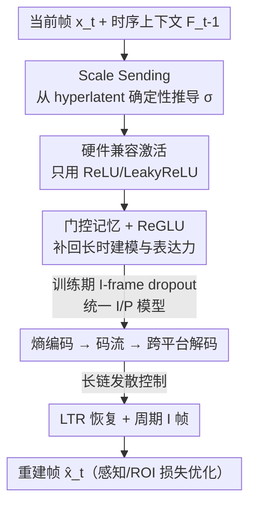

# MLVC: 面向真实部署的多平台学习式视频编解码器

**会议**: ECCV 2026  
**arXiv**: [2606.28027](https://arxiv.org/abs/2606.28027)   
**代码**: 论文声明 "Code will be released"（发表时未放出）  
**领域**: 模型压缩 / 视频编解码  
**关键词**: 学习式视频编码、跨平台一致性、熵编码、NPU 部署、DCVC-RT

## 一句话总结
把熵编码所需的 scale 参数从「网络实时算出来」改成「通过 hyperprior 确定性地传出来」，让神经视频编解码器第一次能在 Apple / Intel / Qualcomm 等异构 NPU 上「A 端编码、B 端解码」而不崩溃，同时靠门控记忆、ReGLU、长期参考帧恢复等一系列改进把跨平台约束带来的码率损失补回来，在视频会议基准上相对硬件 HEVC 拿到 >70% 的 BD-rate(MOS) 提升、三平台平均 100 FPS。

## 研究背景与动机
神经视频压缩这几年已经成熟到「学习式编解码器在率失真上稳定超过传统标准」的地步：以 DCVC 系列为代表的上下文编码方案（DCVC-FM、DCVC-RT）在同等感知质量下能比 H.265 省 60–70% 码率，甚至超过最新的 ECM 参考软件。但吊诡的是，Zoom、Teams、WebRTC 这类真正的生产系统里，一个神经编解码器都没用上。挡在部署门口的有两道坎。第一道是算力——绝大多数神经 codec 的评测都跑在数据中心 GPU（A100 之类）上，而视频会议真正需要的是在消费级设备自带的 NPU 上实时运行。第二道更致命：跨平台兼容性。视频会议天然要求编码端和解码端在不同设备、甚至不同厂商的硬件上跑，可当你在 Apple M3 的 NPU 上编码、拿到 Intel NPU 上解码时，即使是 SOTA 的 DCVC-RT、即使做了量化，输出也会彻底损坏成雪花。

问题的根子在于熵编码要求编解码两端用**完全一致的概率分布**，而在 DCVC-RT 里刻画这个分布的就是 scale 参数 $\boldsymbol{\sigma}$。哪怕只是浮点计算里一点点非确定性的数值抖动，都会让熵解码器选到不同的查找表索引、解出错误的 latent，误差再沿着时序预测链一路放大，最终雪崩。业界目前三条应对路线都不够硬：整数量化想靠 bit-exact 算术根治，但商用 NPU 的现实是——很多工作用 INT16 这类非标准位宽，NPU 工具链根本不支持、直接编译报错；即便退到标准的 INT8，Apple 的 NE 在 M4 之前压根不跑真 INT8 而是用 FP16 模拟，各家 NPU 的 kernel 选择、算子融合、舍入模式又各不相同，做不到 bit 级一致。Tian 等人的「校准信息」路线只能降低索引失配概率、给不了硬保证，且在 NPU 必需的 FP16 精度下（单位舍入误差比 FP32 大约四个数量级）直接失效；固定码本路线虽然规避了失配，却拿不出有竞争力的压缩性能。本文要的是一个同时满足「压缩强、够快、真跨平台」的可部署 codec。

作者的切入点是：与其奢望所有算子都 bit-exact，不如只保证熵编码那一处「两端拿到的 scale 一模一样」——而 hyperlatent $\hat{\mathbf{z}}$ 用固定的分解式熵模型编码，天生在两端完全一致。**核心 idea：把 scale 参数不再由网络在解码端重新计算，而是从确定性一致的 hyperlatent 里通过「取绝对值→空间/通道扩展→查表」显式推导并随码流传出，用可接受的码率开销换来跨设备的熵编码一致性，再用一组架构与训练改进把这点开销补回来。**

## 方法详解

### 整体框架
MLVC 以 DCVC-RT 的浮点模型为起点（它压缩率 SOTA 又轻量快速），在其视频编码框架上做改造。整个 pipeline 的骨架仍是现代学习式 codec 的标准结构：编码端把当前帧 $x_t$ 和时序上下文 $F_{t-1}$ 映射到 latent $y_t$，熵参数网络据此产出均值 $\mu_t$ 和 scale $\sigma_t$，减去均值后的残差量化(Q)、算术编码(AE)成码流；解码端算术解码(AD)恢复 $\hat{y}_t$、加回 $\mu_t$，经重建网络还原出 $\hat{x}_t$，再由状态提取器更新下一步的时序上下文。

MLVC 的所有改动围绕两条主线：**先让它「不崩」，再让它「补回质量」**。不崩这条线上，把标准熵模型里「由网络算 $\sigma$」换成「从 hyperlatent 确定性推导 $\sigma$」（scale sending），再叠加长期参考帧恢复、硬件兼容激活、周期性 I 帧三招压制浮点漂移。补质量这条线上，用门控记忆增强解码器的长时建模、用 ReGLU 在只准用简单激活的约束下提升表达力、用 I 帧 dropout 让单一模型同时胜任 I/P 帧、用感知+ROI 损失把主观质量拉齐。

### 关键设计

**1. Scale Sending：把 scale 参数从「实时计算」改成「确定性传输」，根除跨平台雪崩**

这直接针对最致命的痛点——熵模型 scale 在两端算不一致导致解码雪崩。最粗暴的办法是干脆不用任何自适应先验（表 1 里的 0-prior 行），确实不会崩，但 BD-rate 从 -69.6% 直接恶化到 +20.5%，代价无法接受；另一个极端是把全部 scale 显式传出，可 scale 张量有 $\frac{H}{16}\times\frac{W}{16}\times C_y$ 个，几乎和编码帧本身一样大，开销爆炸。MLVC 的做法是利用 scale 参数强烈的空间与跨通道相关性做**结构化参数共享**，把参数量压缩约 $s^2\cdot r$ 倍（典型 128×），再把剩下的少量参数编进 hyperlatent 表示里传输。

具体地，从量化后的 hyperlatent $\hat{\mathbf{z}}\in\mathbb{Z}^{C_z\times H_z\times W_z}$ 出发，经三步确定性展开得到 scale 索引再查表：先取绝对值 $\boldsymbol{I}^{\text{base}}=|\hat{\mathbf{z}}_{1:C_y/r}|$（保证非负索引），再按空间扩展因子 $s=H_y/H_z$ 和通道重复因子 $r$ 把每个 hyperlatent 位置映射到一个 $s\times s$ 空间块、每个通道复制 $r$ 次：$\boldsymbol{I}_{c,h,w}=\boldsymbol{I}^{\text{base}}_{\lfloor c/r\rfloor,\lfloor h/s\rfloor,\lfloor w/s\rfloor}$，最后 $\boldsymbol{\sigma}_{c,h,w}=\operatorname{lookup}(\boldsymbol{I}_{c,h,w})$ 从固定码本取回量化后的 scale。关键在于：$\hat{\mathbf{z}}$ 是用**固定的分解式熵模型**编码的，两端必然逐 bit 一致，因此推出的 $\sigma$ 也必然一致——不需要任何 bit-exact 算术就根除了雪崩。这个设计还顺带加速解码：$\sigma$ 在解任何 latent 组之前就已备齐，所有组可以一次算术解码扫完，不必像标准做法那样「解一组→跑一次网络→再解下一组」地交错。均值 $\mu$ 仍保留自回归建模（先验融合出 $\mu_{t,1}$、空间先验据已解码的 $\hat{y}_{t,1}$ 出 $\mu_{t,2}$），因为均值失配不会引发雪崩。

**2. 长期参考帧恢复（LTR）：不靠昂贵 I 帧、也能把预测链剪短来抑制漂移**

scale sending 解决了熵解码雪崩，但浮点差异仍会让特征和重建帧**渐进式漂移**——编解码两端各自维护递归更新的特征缓冲，每帧的小差异会沿长预测链累积、不加同步就无界增长。最直接的抑制手段是用很短的 I 帧周期（如 64 帧）来缩短链长，但 I 帧太贵、率失真代价大。作者借鉴传统 codec 的长期参考帧恢复：不再只靠 I 帧，而是周期性插入主动的 LTR 恢复帧来管理预测链。图 5(b) 的直觉是——I 帧周期 12 会造出最长 12 帧的预测链，改用周期 4 的 LTR（从第 1 帧起）能把最大链长降到 7 帧，且天然增强对丢包的鲁棒性。要点在于一个反直觉的结论：**在单平台固定 I 帧周期下，LTR 因引入冗余会严格拖累 BD-rate；但在跨平台场景里，它缩短预测链、避免参考发散引发的质量崩塌，反而能提升压缩效率**。表 11 印证了这点——在发散最大的 Apple GPU→NPU 配对下，LTR 让 IP 能开到 256 而 Delta 仅 -1.0，等发散水平下用更长 I 帧周期换到更好的 BD-rate。

**3. 硬件兼容激活 + ReGLU：在「只准用简单激活」的枷锁下抢回表达力**

很多 NPU 用分段近似而非精确计算来实现非线性激活，各厂商方案不标准、微小差异会在深网里逐层累积成跨平台发散；WSiLU 这类复杂激活还常缺优化 kernel、拖慢推理。作者在 Apple Neural Engine 支持的常见激活上做了扫描，发现**只有 ReLU 和 LeakyReLU 相对真值零误差**，于是把架构限制到这两者。但简单激活有 BD-rate 代价，作者用只依赖跨平台兼容算子的**门控**来补回表达力：ReGLU 定义为 $\text{ReGLU}(\mathbf{x})=\mathbf{x}_{:C/2}\odot\text{ReLU1}(\mathbf{x}_{C/2:})$，其中 $\text{ReLU1}(\cdot)=\min(\text{ReLU}(\cdot),1)$ 把激活截到 1、防止乘性门控放大出的大激活破坏训练稳定性。它只替换 DCVC-RT 深度卷积块里的通道相加为乘性门控，其余处仍用 LeakyReLU。表 10 里 ReGLU 拿到 -56.6% BD-rate、逼近不可部署的 WSiLU(-57.5%)，却不增加编解码发散；表 9 显示门控几乎零额外运行开销。

**4. 门控记忆：给递归解码器补上「长时记忆」，配 I 帧 dropout 统一 I/P 模型**

DCVC-RT 用特征本身当时序状态，长时信息容量有限，遮挡物体的重建、跨帧一致性都会受损。MLVC 借鉴门控循环结构（LSTM）给解码器加一个显式长时记忆状态 $\mathbf{m}_t$：解码器先出 $\mathbf{f}_{in}=\text{Decoder}(\hat{\mathbf{y}}_t,\mathbf{F}_{t-1})$，切成三份 $[\mathbf{s}_t,\mathbf{g}_f,\mathbf{g}_o]$，遗忘门更新记忆 $\mathbf{m}_t=\sigma(\mathbf{g}_f)\odot\mathbf{m}_{t-1}+(1-\sigma(\mathbf{g}_f))\odot\tau(\mathbf{s}_t)$，输出门产出 $\mathbf{f}_{out}=\sigma(\mathbf{g}_o)\odot\tau(\mathbf{m}_t)\cdot\mathbf{q}_{dec}$。门/记忆激活 $\sigma,\tau$ 既可用标准 sigmoid/tanh，也可换成 ReLU 分段近似以适配硬件。代价极小——相比基线只把最后 $1\times1$ 卷积的输出通道翻三倍，且保持递归状态总大小不变（把 256 维参考特征换成 128 维参考特征 + 128 维记忆），FPS 几乎不掉。

与记忆配套的是**统一 I/P 模型**与 **I 帧 dropout**：多数学习式 codec 为 I、P 帧各养一个模型（DCVC-RT 的 I/P 模型 FP32 下分别 174MB、79MB），存储和部署都翻倍。MLVC 把 I 帧定义成「参考图是均匀灰帧（YUV 空间 0.5）的 P 帧」，从而只需一个模型；训练时以概率 $p=0.5$ 把真 I 帧替换成灰帧（I 帧 dropout），让单模型学会无时序依赖地编码。周期越短的 I 帧配置受益越大，因为推理时更常遇到 I 帧条件。此外还有**周期性 I 帧**兜底——即便有 LTR 和简单激活，浮点精度极限仍让特征缓冲长序列下发散，故用周期 I 帧彻底重同步两端状态（这也是与传统 codec 的差别：传统 codec 不靠周期 I 帧也能跨平台）。

### 损失函数 / 训练策略
训练沿用 DCVC-RT 的调度：Vimeo-90K septuplet 做第一阶段，最长 64 帧的长序列做微调；长序列训练用梯度与帧梯度裁剪保稳定、微调阶段用梯度检查点省显存。变率控制、YUV 色彩空间训练均同 DCVC-RT。32 帧序列训练在 8 张 V100 上约 5 天。

感知模型第一阶段用标准 PSNR 损失、微调时切到感知损失。损失含两部分：LPIPS 提升纹理保真，加一个 ROI 掩码对像素加权——用人脸分割模型（RetinaFace/FaRL）在训练时导出 ROI 掩码。总损失形如 $L=w_m\cdot\overline{M\otimes\text{MSE}(x,\hat{x})}+w_l\cdot\overline{M\otimes\text{LPIPS}(x,\hat{x})}$，掩码权重 $w_{ROI}=\frac{k}{p(1+k)},\,w_{BG}=\frac{1}{(1-p)(1+k)}$ 经推导满足「保持总损失量级不变」与「ROI 像素贡献是背景的 $k$ 倍」两约束（$p$ 是数据集中像素属于 ROI 的概率）。作者刻意**不**像部分工作那样用掩码调制 latent，从而部署时不依赖外部分割模型；也**不**用 GAN 损失，因其易致时序闪烁、扰动身份。

## 实验关键数据

### 主实验
主观评测在视频会议数据集 VCD 上做 P.910（5 点 ACR，每片 15 票，统一 720p 显示），客观在 HEVC B-E 上做；所有 BD-rate 以广泛部署的硬件编码器 **Intel Quick Sync HEVC-QSV** 为唯一 anchor。

| 编解码器 | 跨平台 | BD-360(MOS) | BD-540(MOS) | FPS(360/540, Apple M3 Pro) |
|--------|:--:|:--:|:--:|:--:|
| HEVC-QSV（anchor） | ✓ | 0.0 | 0.0 | 221/170（Intel 硬件） |
| DCVC-RT | ✗ | −76.4 | −80.3 | 102/46 |
| DCVC-RT（感知微调） | ✗ | −81.9 | – | 102/46 |
| MLVC（感知） | ✓ | **−75.5** | −78.8 | 130/66 |
| MLVC-S（小模型） | ✓ | – | −65.4 | 300/152 |
| MLVC-multi（码率梯） | ✓ | −75.5 | −65.4 | 130/152 |

关键在于「跨平台」这一列：DCVC-RT 主观质量确实更好，但它在异构硬件上**根本解不出来**（跨平台 BD-rate 记为 $\infty$）。MLVC 感知模型相对硬件 HEVC 拿到 -75.5% BD-rate(MOS)，与能跨平台这件事叠加才有意义。作者还做了个公平对照：把 DCVC-RT 用同样的 ROI+感知损失微调，它从 -76.4% 提升到 -81.9%——也就是说「跨平台约束」的净代价只有约 6 个百分点（-81.9% vs -75.5%），对于「换来能跨设备解码」而言相当划算。

### 消融实验（表 1，PSNR-BD-rate% vs HEVC-QSV，SP=同平台 / XP=跨平台）

| 配置 | Avg(SP) | TH(SP) | TH(XP) | 说明 |
|------|:--:|:--:|:--:|------|
| DCVC-RT（原始基线） | −69.6 | – | $\infty$ | 最强但跨平台雪崩 |
| 0-prior（去掉自适应先验） | +20.5 | 9.6 | 718.1 | 不崩但压缩崩，证明不能粗暴去先验 |
| + Scale Sending(WSiLU) | −54.5 | −56.1 | 101.8 | 跨平台仍差（激活发散） |
| + 硬件兼容激活(LReLU) | −49.2 | −53.5 | 6.7 | XP 从 101.8→6.7，激活是发散主因 |
| + 门控记忆 | −52.1 | −58.4 | −21.9 | 记忆同时补 SP/XP |
| + ReGLU | −56.6 | −61.9 | −39.8 | 门控抢回表达力 |
| + I 帧 dropout（IP=64） | −46.1 | −46.7 | −44.9 | 统一 I/P，XP 继续降 |
| + LTR（IP=1024，完整 MLVC） | −52.0 | −60.2 | **−58.7** | LTR 支撑超长 I 帧周期 |
| MLVC-S（小模型） | −36.5 | −48.6 | −47.3 | 1080p@30FPS 仍 −37% |

### 关键发现
- **激活函数是跨平台发散的头号元凶**：只加 scale sending 时 TH(XP) 还高达 101.8%（相对 anchor 更差），换成 LeakyReLU 后骤降到 6.7% ——数值发散主要来自 NPU 对复杂激活的分段近似（补充材料测得 SiLU 在 Apple NPU 上明显分段近似，而 ReLU/LeakyReLU 零误差）。
- **完整 MLVC 相对原始 DCVC-RT 在同平台掉约 18 个百分点（-52% vs -69.6%）**，这正是跨平台约束的直接成本，由 scale sending、硬件兼容激活、周期 I 帧、统一 I/P 模型逐项累加而成；但换来的是从「跨平台完全不可用($\infty$)」到「跨平台 -58.7%」。
- **LTR 在跨平台下的价值反直觉**：它在单平台会因冗余拖累 BD-rate，却在跨平台通过缩短预测链避免参考发散崩塌，使 I 帧周期能从 64 拉到 1024，反而提升压缩效率并增强抗丢包。
- **速度全线达标**：三平台（Apple/Intel/Qualcomm NPU）360p 平均编/解 103/99 FPS，MLVC 到 720p、MLVC-S 到 720p 全平台实时（各 >30 FPS），MLVC-S 在 Apple M3 Pro 上 1080p 也有 30 FPS。图 6(b) 的跨平台 BD-rate 矩阵中大多数编解码配对相差不超过 2 个点、且无任何雪崩。

## 亮点与洞察
- **「只保证需要一致的那一处一致」这个思路极其务实**：不去奢求全网 bit-exact（在异构 NPU 上被证明基本不可能），而是精准锁定「熵编码的 scale 必须两端一致」这一处，借 hyperlatent 天生一致的性质把它「传」出来。这种「把不可控的实时计算换成可控的确定性推导」的降级思路，可迁移到任何依赖两端同步概率模型的编码/通信系统。
- **补充材料的跨平台数值发散实证非常有分量**：作者用一个最简单的 128 通道逐点卷积就测出 INT8 量化在几乎所有设备/运行时组合下都发散（表 12–15），并逐层归因到「NPU 的乘法和 round 各家实现不同、不遵循 IEEE 754 默认舍入」。这把「为什么整数量化在商用 NPU 上救不了跨平台」讲得极透，是本文最有说服力的部分之一。
- **把 I 帧重定义为「灰帧参考的 P 帧」+ I 帧 dropout** 是个漂亮的工程简化：一个模型顶两个、省一半存储，训练里用概率替换就让单模型学会两种模式，还天然处理场景切换后参考失效的大 mismatch（补充材料 0.B.8 显示场景切换下用陈旧 LTR 仅掉 2 个点）。
- **诚实地量化「跨平台的代价」**：作者没有回避 MLVC 比 DCVC-RT 差，而是做受控对照把这个差距钉在约 6 个百分点（主观）/ 18 个百分点（PSNR 同平台），并论证这点代价换来的是「能不能部署」的质变。

## 局限与展望
- **跨平台约束确有实打实的率失真代价**：同平台 PSNR-BD-rate 比 DCVC-RT 低约 18 个百分点，作者靠感知/ROI 训练把主观差距压到约 6 个百分点，但客观 PSNR 上的差距是结构性的、来自放弃「同平台 bit-exact」假设。
- **强依赖 FP16 而非整数确定性**：本文明确选择 FP16 推理（因商用 NPU 广泛支持），代价是仍需周期 I 帧来兜底浮点漂移——这与传统 codec「无需周期 I 帧即可跨平台」不同，属于一种「工程可用但非根治」的折中；作者也承认若未来 NPU 厂商统一 IEEE 754 舍入与算子顺序，整数路线仍是更彻底的解。
- **感知优化以人脸 ROI 为中心，场景特化明显**：ROI 掩码用人脸分割导出，视频会议（重人脸）受益大，但迁到屏幕共享（重文字清晰度）等场景需换 ROI 策略，泛化性受限于所选的感知先验。
- **作者点出的未来方向**：功耗将是实时性达标后的下一个优化前沿；对称架构下单设备高分辨率（1080p+）同时编解码仍具挑战。

## 相关工作与启发
- **vs DCVC-RT**：DCVC-RT 是本文起点、也是同平台上界，压缩率与速度都更强，但用网络实时算 scale、在异构 NPU 上熵解码必然雪崩，只在 NVIDIA GPU 内验证过「跨平台」（单厂商、非真跨平台）。MLVC 牺牲部分率失真换来真正的多厂商 NPU 部署能力。
- **vs 校准信息（Tian et al. 2023）**：他们传一路校准边信息降低索引失配概率，但只是概率性缓解、给不了硬保证，且只在单条 96 帧 UVG 视频、FP32 下验证；本文复现发现一旦切到 NPU 必需的 FP16（单位舍入误差大约四个数量级），校准直接失效。MLVC 的 scale sending 提供的是**确定性硬保证**。
- **vs 固定码本（Tian et al. 2024, "Effortless"）**：他们传离散码本索引、彻底去掉熵建模来规避失配，但压缩性能没有说服力，且对比用了不公平的 GOP 设置（自家 GOP=32 vs H.264/265 的 GOP=12）。补充材料换算到统一 anchor 后，MLVC 在 HEVC-B 上 -45.2% 远好于其 +15.0%。
- **vs MobileCodec / MobileNVC**：这条移动线聚焦边缘算力（重设计运动补偿避开昂贵 warp），但 MobileNVC 未做任何跨平台测试、且换算到本文 anchor 后 BD-rate 为正（打不过硬件 HEVC）。MLVC 在「跨平台可用 + 超过硬件 HEVC」上同时成立。

## 评分
- 新颖性: ⭐⭐⭐⭐ 「确定性传 scale」的核心 idea 简洁有效、切中真部署痛点，但单个组件（记忆/ReGLU/LTR）多是已有思路的巧妙组合与工程落地。
- 实验充分度: ⭐⭐⭐⭐⭐ 三平台真机测速 + 主客观 BD-rate + 极详尽的跨平台数值发散实证（INT8/FP16/IEEE754 逐项归因），说服力强。
- 写作质量: ⭐⭐⭐⭐ 动机与失败路线分析清晰、诚实量化代价；符号密集处（scale 展开、ROI 权重推导）对读者略有门槛。
- 价值: ⭐⭐⭐⭐⭐ 首个真正可在异构消费级 NPU 部署的神经视频 codec，直击「学术 SOTA 进不了生产系统」的鸿沟，工业落地价值高。

<!-- RELATED:START -->

## 相关论文

- [\[ECCV 2026\] On the Vulnerability of Parameter-Level Defenses to Model Merging](on_the_vulnerability_of_parameter-level_defenses_to_model_merging.md)
- [\[ECCV 2026\] Structured Hyperedge Adaptation for Parameter-Efficient Fine-Tuning of Vision Transformers](structured_hyperedge_adaptation_for_parameter-efficient_fine-tuning_of_vision_tr.md)
- [\[ECCV 2026\] Distill Once, Adapt Life-Long: Exploring Dataset Distillation for Continual Test-Time Adaptation](distill_once_adapt_life-long_exploring_dataset_distillation_for_continual_test-t.md)
- [\[ECCV 2026\] Structural Assessment for Understanding and Guiding Dataset Distillation in Discrete Token Space](structural_assessment_for_understanding_and_guiding_dataset_distillation_in_disc.md)
- [\[ECCV 2026\] MixTTA: Low-Rank Cross-Channel Mixing for Reliable Test-Time Adaptation](mixtta_low-rank_cross-channel_mixing_for_reliable_test-time_adaptation.md)

<!-- RELATED:END -->
