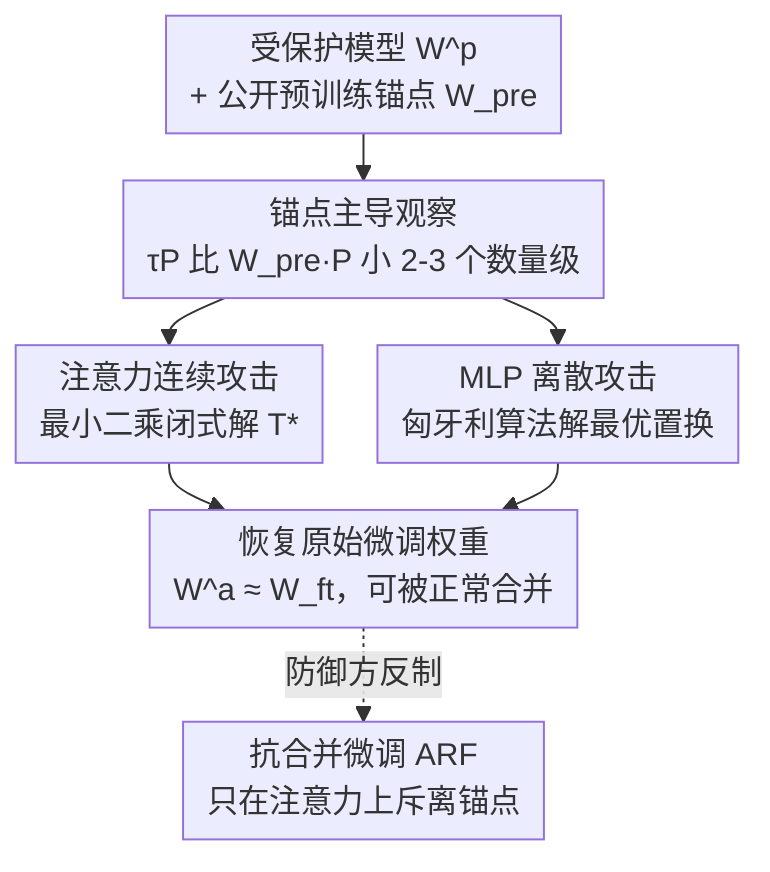

# On the Vulnerability of Parameter-Level Defenses to Model Merging

**会议**: ECCV 2026  
**arXiv**: [2606.30360](https://arxiv.org/abs/2606.30360)  
**代码**: [https://github.com/krumpguo/secure-merge-attack](https://github.com/krumpguo/secure-merge-attack)  
**领域**: 模型压缩 / 模型合并  
**关键词**: 模型合并, 参数空间防御, 知识产权保护, 锚点攻击, 抗合并微调

## 一句话总结
本文揭穿了「用线性变换让模型不可合并」这类参数级防御的根本漏洞——被保护的任务向量比预训练锚点小 2~3 个数量级，于是提出 Anchor-Guided Attack（AGA）：把公开预训练模型当静态锚点，用最小二乘 + 匈牙利算法解析地还原出防御方藏起来的变换矩阵，几乎无损地恢复受保护模型；同时给出抗攻击的 Anchor-Repulsive Fine-tuning（ARF）防御作为补救。

## 研究背景与动机
把在同一预训练骨干上微调出来的多个专家模型直接在参数空间相加（Task Arithmetic 及其后继 CAT Merging、LOT Merging 等），无需任何再训练就能拼出一个多任务模型，这就是近年火热的 model merging。它高效到几乎「白嫖」：一个「搭便车者」只要从 HuggingFace / ModelScope 下载别人辛苦微调的 checkpoint，跟自己手里的模型一合并，就能免费继承对方的专有能力，带来了严重的知识产权风险。为堵住这个口子，一批「主动防御」方法应运而生——它们的共同思路是给已微调好的权重悄悄乘上一个秘密的线性变换，破坏不同模型之间做线性算术所需的对齐关系，让未授权的合并直接崩掉，同时保证模型单独使用时性能不变。代表工作有：Params 用对角矩阵变换注意力、用置换矩阵打乱 MLP 隐藏神经元；MergeLock 用可逆/正交矩阵锁死注意力参数空间；MergeBarrier 更进一步，用泰勒展开改写 MLP 的拓扑结构让任务向量求逆在数学上都变得病态。它们在实验里确实挡住了朴素的合并尝试。

问题是，这些防御全都建立在「线性变换」这一根基上，而作者对被保护权重做了一次很朴素的拆解就发现了要命的破绽。任何微调权重都可写成「预训练权重 + 任务向量」，防御方乘上秘密矩阵 P 后，变换被同时分摊到两部分：$W^p = (W_{pre}+\tau)P = W_{pre}P + \tau P$。作者在 ViT-B/32 等多个骨干上量了这两项的 Frobenius 范数，发现变换后的任务向量 $\tau P$ 比变换后的预训练锚点 $W_{pre}P$ 小整整 2~3 个数量级。换句话说，被保护模型的参数空间几乎完全被那个「公开可查」的预训练锚点占据，任务向量在里面小到近乎可忽略。这就形成了防御方没意识到的核心矛盾：他们藏起来的秘密全在那个变换矩阵 P 里，可 P 作用在一个攻击者本来就完全知道的量（预训练权重）上——攻击者只要把受保护模型往公开锚点上「对齐」，就能反解出 P，防御的秘密性荡然无存。

**核心 idea**：把公开预训练模型当作一个静态参照锚点，通过最小化「受保护模型」与「锚点」之间的差距来解析地还原出防御变换的逆矩阵——注意力模块用最小二乘闭式解、MLP 模块用匈牙利算法求最优置换，从而在完全不知道对方用了哪种防御的「防御无关」场景下，无损地剥掉保护、恢复原始微调权重。

## 方法详解

### 整体框架
AGA 的输入是一个「受保护的微调模型」$W^p$ 加上人人可下载的「预训练模型」$W_{pre}$，输出是被剥掉保护后的原始微调权重 $W^a \approx W_{ft}$，进而可以被正常合并。整套攻击的骨架就一句话：既然 $W^p \approx W_{pre}P$（因为 $\tau P$ 可忽略），那就找一个恢复矩阵 T 让 $W^p T = W_{pre}$；由于锚点项主导了整个优化地形，这个对齐会数学上逼出 $PT \approx I$，也就是 $T \approx P^{-1}$，一乘就把保护抵消掉了：$W^a = W^p T \approx (W_{pre}P + \tau P)P^{-1} = W_{ft}$。关键在于攻击者是「防御无关」的——他不知道每个模型有没有被保护、用了哪种防御，所以要对所有候选模型无差别地施加 AGA，且不能依赖任何防御配置的先验。

由于不同架构模块被施加的变换性质不同（注意力上是连续矩阵、MLP 上是离散置换），AGA 采用双求解器设计：注意力走连续最小二乘，MLP 走离散匈牙利匹配。最后作者反过来站在防御方角度提出 ARF，专门在微调阶段人为放大注意力任务向量的幅度、破坏 AGA 赖以成功的「幅度悬殊」前提。整体流程如下：

### 关键设计

**1. 锚点主导观察：任务向量小到可忽略，秘密全暴露在锚点上**

这是全文的地基。作者把受保护权重拆成 $W_{pre}P + \tau P$ 两项后，实测发现变换后任务向量 $\tau P$ 的范数比变换后预训练锚点 $W_{pre}P$ 小 2~3 个数量级（在 ViT-B/32、ViT-L/14、GPT-2、Qwen2-7B 上一致成立，见补充材料）。这意味着不管防御方怎么乘秘密矩阵，被保护模型在参数空间里都近似等于 $W_{pre}P$——而 $W_{pre}$ 是攻击者完全掌握的公开量。防御的全部秘密性只剩变换矩阵 P，但 P 恰恰作用在一个已知量上，于是「把受保护模型对齐到公开锚点」就成了反解 P 的天然突破口。之所以这个悬殊普遍存在，是因为微调本质上只在预训练权重上做小幅调整，任务向量天生幅度就小；这不是某个防御的实现瑕疵，而是「线性保护 + 微调」范式的几何宿命。

**2. 注意力连续攻击：把还原变换写成超定线性系统的闭式解**

注意力模块（Query/Key/Value/Output 投影）通常被施加连续的可逆、正交或对角矩阵。针对这类连续变换，作者把「找恢复矩阵」直接转化为拟合一个超定线性系统。虽然防御方常在成对模块（如 Q 和 K）上施加耦合变换，但现实中攻击者对这些秘密配置一无所知，所以 AGA 干脆解耦——对每个投影矩阵独立求解一个最小二乘问题，反而更通用。对任一受保护矩阵 $W^p$ 及其预训练锚点 $W_{pre}$，最小化 $\|W^p T - W_{pre}\|_F^2$，令导数为零即得闭式解：

$$T^* = ((W^p)^T W^p)^{-1} (W^p)^T W_{pre}$$

把它分别乘回四个投影矩阵，就并行地恢复了整个注意力的原始参数空间。作者还证明了一条误差上界（Theorem 1）：这样恢复出的注意力权重误差 $\mathcal{E} = \|W^a - W_{ft}\|_F$ 严格不超过任务向量本身的范数 $\|\tau\|_F$。证明的关键是恢复误差恰好等于任务向量在 $W_{ft}$ 列空间上的正交投影 $-\Pi_{ft}\tau$，而正交投影的谱范数为 1。结合上面「$\tau$ 小 2~3 个数量级」的事实，这个理论最大误差被压在近乎可忽略的范围内——正交矩阵、非零对角矩阵都是可逆矩阵的子类，所以该保证对 Params 的对角变换、MergeLock 的正交变换普适。

**3. MLP 离散攻击：把置换还原转成线性分配问题，用匈牙利算法求全局最优**

MLP 层因为夹着非线性激活，防御方通常用离散置换矩阵去打乱隐藏神经元的顺序（打乱后单模型输出不变）。这里如果硬套连续最小二乘去近似逆置换，会因为无法施加「严格离散」约束而引入数值漂移，并在层间累积误差。AGA 的做法是把置换还原建模成一个线性分配问题（LSAP）：构造一个代价矩阵 $C$，其元素 $C_{i,j}$ 是受保护 MLP 第一层权重第 $i$ 行与预训练权重第 $j$ 行之间的负余弦相似度，然后用匈牙利算法求出让总匹配代价最小的置换矩阵 $T^*$，即 $T^* = \arg\min_T \sum_{i,j} C_{i,j} T_{i,j}$（$T$ 被约束为合法置换矩阵）。求出 $T^*$ 后左乘第一层还原行序，同时对下一层投影和中间偏置施加其转置（置换矩阵的逆即转置）以保持整个 MLP 块的输入输出等价。作者进一步给出 Theorem 2：只要任务向量满足 $\|\tau\|_F < \tfrac{1}{2}\delta_{min}$（$\delta_{min}$ 是预训练权重与其任何非平凡置换态之间的最小距离，即「置换裕度」），匈牙利算法数学上保证输出精确的逆置换，恢复误差严格为零。而深网里预训练权重高度多样、$\delta_{min}$ 很大，任务向量又天生极小，这个条件在实际微调中几乎总成立——置换类防御被彻底证伪。

**4. Anchor-Repulsive Fine-tuning：只在注意力上把权重「斥离」锚点，堵住幅度悬殊**

既然 AGA 的命门是「任务向量幅度相对锚点太小」，那防御方唯一的根治办法就是在微调阶段主动放大任务向量的幅度、抹平这个悬殊。已有的 tuning 阶段防御 MergeGuard 用全局 L2 正则去分散权重、制造任务冲突，但它有两个致命缺陷：全模型约束会限制参数空间、拖累单模型性能；而且实测它在多个数据集上仍会被 AGA 攻破，光「分散权重」并不能数学保证幅度扩张到位。作者据此提出 ARF：不惩罚整个网络，而是只对注意力的四个投影矩阵施加一个基于欧氏距离的「斥力」margin 惩罚，把它们从预训练锚点往外推到一个预设安全边界为止：

$$L_{total} = L_{CE} + \lambda_{dist} \sum_{\theta \in \{W_Q,W_K,W_V,W_O\}} \min\big(0,\ \rho\|\theta_{pre}\|_2 - \|\theta - \theta_{pre}\|_2\big)$$

其中 $\rho$ 是相对锚点幅度设定安全裕度的扩张比例，$\lambda_{dist}$ 控制斥力强度，$\min(0,\cdot)$ 保证只在距离不够时才施加、够了就不再干扰。之所以只针对注意力：注意力的连续求逆恰恰依赖最小化欧氏距离（上界正是 $\|\tau\|_F$，见 Theorem 1），所以对基于距离的斥力最敏感；而 MLP 的离散提取靠的是尺度不变的余弦匹配，欧氏放大对它无效。微调满足 margin 后，再叠加标准的可逆矩阵变换保护注意力——ARF 因此是「斥力微调 + 事后线性保护」的完整流水线，天然与后训练线性防御正交。

### 损失函数 / 训练策略
攻击侧 AGA 全程无需训练，是纯解析的闭式求解（最小二乘 + 匈牙利算法），因此对任意合并算法即插即用。防御侧 ARF 的训练目标见上式，全数据集统一取 $\lambda_{dist}=1.0$、$\rho=0.05$；由于斥力只作用在注意力、MLP 保持标准微调，单模型性能几乎无损。

## 实验关键数据

### 主实验
覆盖视觉分类（CLIP ViT-B/32、ViT-L/14，8 个数据集）、NLP 理解（GPT-2，GLUE 8 任务）、文本生成（Qwen2-7B，AlpacaEval / GSM8K / MBPP），合并范式涵盖 Task Arithmetic、CAT Merging、LOT Merging。核心指标是「受保护任务性能」：只保护其中一个模型、把它和别的合并后，看该模型对应任务的精度被 AGA 恢复了多少。

| 骨干 / 合并 | 防御 | 无保护基线 | 仅保护 | AGA 攻击后 | 恢复幅度 |
|-------------|------|-----------|--------|-----------|---------|
| ViT-B/32 · TA | Params | 67.23 | 5.49 | 66.39 | ↑60.90 |
| ViT-B/32 · TA | MergeLock | 67.23 | 5.10 | 66.39 | ↑61.29 |
| ViT-B/32 · TA | MergeBarrier | 67.23 | 29.32 | 60.80 | ↑31.48 |
| ViT-B/32 · LOT | MergeLock | 79.16 | 4.85 | 78.36 | ↑73.51 |
| Qwen2-7B · TA | Params-D | 49.10 | 3.07 | 47.79 | ↑44.72 |
| GPT-2 · TA | Params | 68.79 | 51.44 | 67.22 | ↑15.78 |

一个典型例子：LOT Merging 下 MergeLock 把受保护任务从 79.16% 压到仅 4.85%，AGA 直接恢复到 78.36%，离无保护基线不到 1%。跨任务整体效用同样惊人——MergeLock 把多任务平均效用压到 4.92%，AGA 恢复到 67.17%，与无保护的 67.23% 只差 0.06%。唯一恢复不彻底的是 MergeBarrier（它改了 MLP 拓扑，AGA 只能绕过被改的块、退回预训练 MLP），但即便如此注意力仍被完整反解，从 26.01% 提到 58.56%。复合防御（P&L、P&B、P&L&B）也挡不住：纯参数级组合被恢复到 66.39%，只有掺入 MergeBarrier 才降到约 60.66%——说明「简单叠加多种防御」并不能提供稳健安全。

### 消融实验（ARF 防御能力与 ρ / λ_dist 敏感性，ViT-B/32）

| 配置 | 合并精度（越低越好） | 单模型精度（越高越好） | 说明 |
|------|---------------------|----------------------|------|
| 无保护 | 67.23 | 88.81 | 参照 |
| MergeGuard（无攻击） | 33.97 | 86.31 | 全局正则，仍偏高且拖累单模型 |
| ARF（无攻击） | 4.63 | 88.11 | 压到近随机，单模型几乎无损 |
| ARF（遭 AGA 攻击） | 27.42 | — | 被攻击后仍低于 MergeGuard 未被攻击时 |
| ρ=0.02→0.08 | 保护 28.75→26.36 | 微调 88.32→87.94 | 对超参不敏感 |
| λ_dist=0.7→1.3 | 保护 29.26→26.17 | 微调 88.38→87.01 | 同上，鲁棒 |

### 关键发现
- AGA 对「纯参数空间混淆」类防御（Params/MergeLock）近乎完美破解（恢复到差距 <1%），而对「结构改写」类防御（MergeBarrier）只能部分恢复——注意力可逆、MLP 拓扑一旦被改就求逆病态，这是攻击的边界。
- AGA 是「非破坏性」的：即便对本来没被保护的模型施加攻击，单模型精度仍保持 88.81%，说明它可以在「防御无关」下对所有候选模型无差别施加而不误伤。
- ARF 的取胜关键是「局部性」：只斥离注意力而不动 MLP 与其它层，既彻底消除了 AGA 能利用的参数空间邻近性（合并精度压到 4.63%），又把单模型损失控制在不到 1%，明显优于全局约束的 MergeGuard。

## 亮点与洞察
- 「拆成锚点 + 任务向量、再量范数」这一步极其朴素却一击致命——把一个看似需要密码学强度的防御问题，降维成「任务向量太小所以秘密藏不住」的几何观察，是全文最漂亮的 aha。
- 双求解器分而治之很见功力：连续部分用最小二乘闭式解、离散置换部分用匈牙利算法求全局最优，各自匹配变换的数学性质，避免了「一把梭连续近似离散」带来的数值漂移。
- 两条误差界（注意力 $\le\|\tau\|_F$、MLP 在 $\|\tau\|_F<\delta_{min}/2$ 时严格为零）把「为什么攻击有效」从实验现象升到了定理级保证，且直接指向防御方向——想防住就得把 $\|\tau\|_F$ 顶上去。
- ARF 的「哪里可被距离攻击就在哪里加距离斥力、别的地方不碰」是可迁移的防御设计范式：先定位攻击赖以成功的具体几何量，再做最小侵入式干预，避免全局正则「杀敌一千自损八百」。

## 局限与展望
- AGA 对 MergeBarrier 这类改写 MLP 拓扑的防御只能绕过、不能反解，恢复精度明显低于纯参数级防御场景——说明「结构性改写」可能是比「线性混淆」更难攻的方向，但作者未深入这条防御路径。
- ARF 只在注意力上加斥力，正因为 MLP 的离散提取靠尺度不变的余弦匹配、欧氏放大无效；也就是说 ARF 对「MLP 侧的攻击」并没有提供对称的保护，一旦攻击者只针对 MLP 发力，其防御边界仍待验证。
- 全文的威胁模型假设攻击者能拿到「同一预训练骨干」；若防御方在发布时对预训练锚点也做隐藏或替换，AGA 的「静态锚点」前提会被动摇，这一情形未被讨论。
- 结论本身也承认：这项工作证明了「线性权重变换只提供了安全的假象」，真正稳健的保护需要 training-aware 的新范式——ARF 是补丁而非终局。

## 相关工作与启发
- **vs Params / Params-D**：Params 用对角矩阵变换注意力、置换矩阵打乱 MLP，Params-D 再加随机 dropout 增加提取难度；本文指出它们的对角/置换都是可逆矩阵子类，被 AGA 的闭式解与匈牙利匹配分别精确反解，dropout 也拦不住幅度悬殊带来的对齐。
- **vs MergeLock**：MergeLock 用正交/可逆矩阵锁注意力参数空间；正交矩阵正是 Theorem 1 覆盖的情形，误差被 $\|\tau\|_F$ 严格上界，因此几乎无损被破。
- **vs MergeBarrier**：它不止乘权重，还用泰勒展开改写 MLP 拓扑让求逆病态；这是唯一让 AGA 无法完全恢复的防御，本文只能绕过被改块、退回预训练 MLP，恢复精度相应下降——反衬出「结构改写」比「线性混淆」更硬。
- **vs MergeGuard**：同为 tuning 阶段防御，MergeGuard 用全局 L2 分散权重制造任务冲突，但全局约束拖累单模型、且仍被 AGA 攻破；ARF 改为只斥离注意力，既防住攻击又几乎不损单模型效用，是对 MergeGuard 的直接改进。

## 评分
- 新颖性: ⭐⭐⭐⭐⭐ 用一个朴素的范数观察系统性地证伪整类线性参数防御，并配上双定理保证，视角犀利。
- 实验充分度: ⭐⭐⭐⭐⭐ 跨视觉/NLP/生成三模态、三种合并范式、四种防御及其复合配置全覆盖，还带超参敏感性与单模型保真度分析。
- 写作质量: ⭐⭐⭐⭐ 逻辑链清晰、攻防对称呈现；公式偏密，个别符号可再用中文替代以降低阅读负担。
- 价值: ⭐⭐⭐⭐⭐ 直接冲击「让模型不可合并」这一 IP 保护路线的安全根基，对模型版权保护的后续研究有明确警示与方向指引。

<!-- RELATED:START -->

## 相关论文

- [\[ICML 2026\] FRISM: Fine-Grained Reasoning Injection via Subspace-Level Model Merging for Vision–Language Models](../../ICML2026/model_compression/frism_fine-grained_reasoning_injection_via_subspace-level_model_merging_for_visi.md)
- [\[AAAI 2026\] From Parameter to Representation: A Closed-Form Approach for Controllable Model Merging](../../AAAI2026/model_compression/from_parameter_to_representation_a_closed-form_approach_for_controllable_model_m.md)
- [\[NeurIPS 2025\] Weight Weaving: Parameter Pooling for Data-Free Model Merging](../../NeurIPS2025/model_compression/weight_weaving_parameter_pooling_for_data-free_model_merging.md)
- [\[ACL 2026\] LoRA on the Go: Instance-level Dynamic LoRA Selection and Merging](../../ACL2026/model_compression/lora_on_the_go_instance-level_dynamic_lora_selection_and_merging.md)
- [\[ICCV 2025\] FREE-Merging: Fourier Transform for Efficient Model Merging](../../ICCV2025/model_compression/free-merging_fourier_transform_for_efficient_model_merging.md)

<!-- RELATED:END -->
