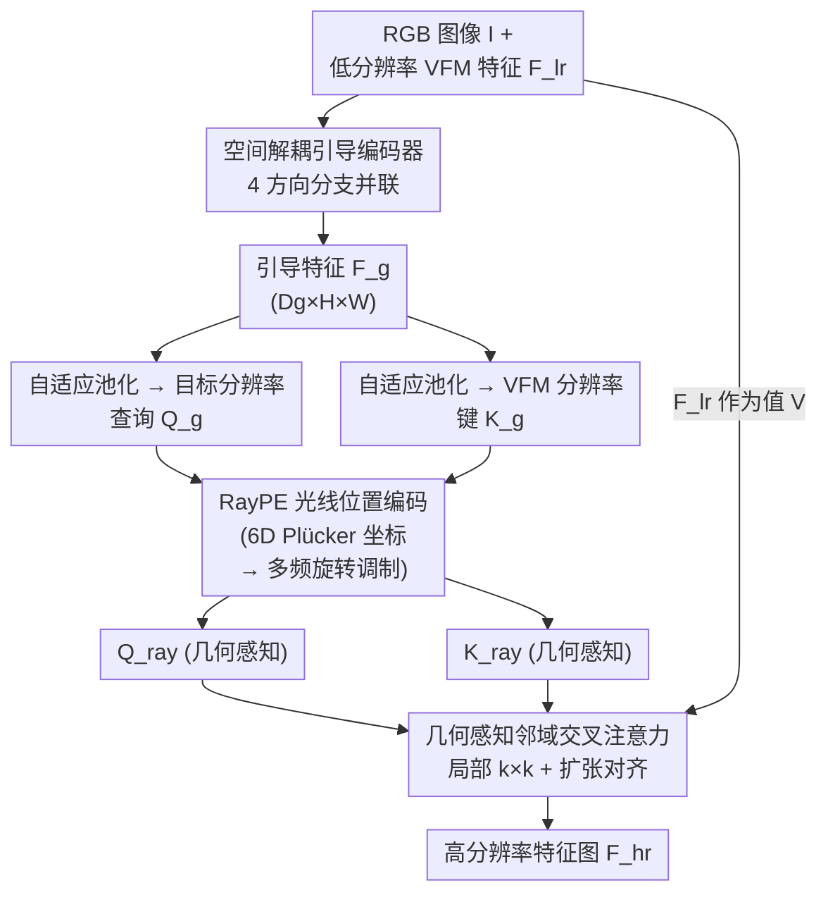

# RaysUp: Ultra-light Universal Feature Upsampling via Geometry-Aware Ray Representation

**会议**: ECCV 2026  
**arXiv**: [2606.22749](https://arxiv.org/abs/2606.22749)  
**代码**: [https://github.com/MAP-RaysUp/RaysUp](https://github.com/MAP-RaysUp/RaysUp)  
**领域**: 模型压缩  
**关键词**: 特征上采样, 极轻量网络, RayPE, 几何感知注意力, VFM无关上采样

## 一句话总结

提出一个仅 0.14M 参数、同时任务无关和 VFM 无关的极轻量通用特征上采样框架 RaysUp，通过空间解耦引导编码器、光线位置编码（RayPE）和几何感知邻域交叉注意力三个关键设计，将特征重建从 2D 像素平面提升到 3D 光线域，在语义分割、深度/法向估计、视频目标分割和开放词汇分割等多种密集预测任务上达到 SOTA 或接近 SOTA，推理速度比此前唯一的 VFM-agnostic 方法 AnyUp 快约 7 倍。

## 研究背景与动机

视觉基础模型（VFM）如 DINOv2/v3、SigLIP、PE Spatial 和 MAE 已成为现代计算机视觉的中坚力量——它们通过大规模预训练获得强大的语义表示和跨任务泛化能力，广泛用于深度估计、开放词汇分割、3D 语义场重建等下游任务。然而，这些模型普遍基于 patch 化或池化操作，输出的特征图空间分辨率极低（典型如 16×16 或 32×32），在需要精细像素级理解的密集预测任务中必须经过上采样才能使用。传统插值（双线性、最近邻）虽快但缺乏内容自适应性导致语义失真；可学习上采样方法如 LiFT、FeatUp、LoftUp 和 JAFAR 展示了任务无关的潜力，但大多需要针对不同 VFM 重训练或推理时逐图优化，部署成本高。最新的 AnyUp 首次实现了 VFM-agnostic 的通用上采样，但其网络较沉重（0.87M 参数、84 GFLOPs），在大分辨率或高吞吐场景下仍不够实用。

一个更深层的共同局限在于：所有这些方法都在 2D 图像网格上操作，隐式假设像素间的欧氏邻近等价于 3D 空间中的几何邻近。但透视投影下这个假设常常崩塌——深度不连续处的相邻像素在 3D 空间中可能相距甚远，而远距离像素可能属于同一物理表面。因此，基于 2D 邻域的插值或注意力机制无法保证重建特征在真实 3D 空间中具有几何一致性，表现为边界模糊和结构漂移。这个矛盾在表面法向和深度估计等几何敏感任务上尤为突出。

本文从经典的双边联合上采样（JBU）范式出发，思路清晰地将 JBU 的三个核心组件逐一升级：用轻量方向解耦引导编码器替代 RGB 差异范围核，用 RayPE 光线位置编码注入 3D 几何先验，用几何感知邻域交叉注意力替代固定 2D 局部邻域。**核心 idea：将特征上采样从 2D 像素平面提升到 3D 光线（ray）域，通过 6D Plücker 光线坐标以旋转调制的形式向注意力机制注入隐式几何先验，在一个仅 0.14M 参数的极轻量框架中同时实现任务无关、VFM 无关和任意分辨率的高质量特征重建。**

## 方法详解

### 整体框架

RaysUp 的输入是一张 RGB 图像 $\mathcal{I}$ 和从任意 VFM 提取的低分辨率特征图 $\mathcal{F}^{lr}$（通常分辨率仅 16×16 或 32×32），目标是将 $\mathcal{F}^{lr}$ 恢复到任意指定的目标分辨率。整个流程分四步：① 轻量空间解耦引导编码器从 RGB 图像提取方向感知的引导特征 $\mathcal{F}_g$；② 对 $\mathcal{F}_g$ 做两次自适应平均池化，分别生成目标分辨率查询 $\mathcal{Q}_g$ 和 VFM 分辨率键 $\mathcal{K}_g$；③ 两者经 RayPE 编码后得到携带 3D 几何先验的光线查询 $\mathcal{Q}_{ray}$ 和光线键 $\mathcal{K}_{ray}$；④ 几何感知邻域交叉注意力以 $\mathcal{K}_{ray}$ 和 $\mathcal{Q}_{ray}$ 为注意力对，以原始低分辨率特征 $\mathcal{F}^{lr}$ 为值 $\mathcal{V}$，在局部窗口内做跨分辨率特征聚合，输出高分辨率特征 $\mathcal{F}^{hr}$。

### 关键设计

**1. 空间解耦引导编码器：从各向异性实证到方向分解**

引导编码器负责从 RGB 图像提取结构先验。作者在分析 JAFAR 的 3×3 卷积核权重时发现了一个关键模式：卷积核的权重并非均匀分布——四个角点权重高（0.97–0.99），而中心十字区域的权重明显偏低（中心仅 0.78）。这意味着标准方形卷积在空间聚合时是各向异性的，中心通道交互不足可能导致上采样特征中出现空洞。受此启发，RaysUp 不用单一的 3×3 卷积，而是将感受野显式分解为四个正交方向分量并行处理：中心分支用 1×1 卷积负责逐点通道混合，水平分支用 1×3 卷积捕获左右纹理，垂直分支用 3×1 卷积捕获上下纹理，对角分支用 2×2 膨胀卷积（扩张率 2）捕获斜向结构。每个分支仅负责 $D_g/4$ 通道，最后按通道拼接。这种解耦把中心权重恢复为 1.00，外围分支也保持 0.89–0.99 的高权重，既修复了中心通道混合不足的问题又维持了方向敏感度。参数效率上，标准 3×3 卷积需 $27D_g$ 参数，而解耦编码器仅需约 $8.25D_g$，节省近 70% 的同时性能反而更强。

**2. RayPE 光线位置编码：用 3D 旋转调制替代 2D 坐标编码**

传统方法的位置编码在 2D 像素网格上定义，认为像素越近特征越相关——这在深度跳跃处是错的。RaysUp 将每个像素关联到一条 3D 光线：给定像素坐标 $\mathbf{x}$，光线由相机中心 $\mathbf{o}$ 和归一化方向 $\mathbf{d}(\mathbf{x})$ 完全确定，拼接为 6D 描述子 $\mathbf{r} = [\mathbf{o}, \mathbf{d}(\mathbf{x})] \in \mathbb{R}^6$。RayPE 的巧妙之处在于借鉴 RoPE 的旋转调制将几何坐标注入注意力计算：对 6D 光线描述子的每个分量做多频谐波编码生成旋转相位 $\boldsymbol{\theta} \in \mathbb{R}^{6N}$，然后将注意力头的特征拆成两半，用旋转矩阵 $\begin{bmatrix} \cos\boldsymbol{\theta} & -\sin\boldsymbol{\theta} \\ \sin\boldsymbol{\theta} & \cos\boldsymbol{\theta} \end{bmatrix}$ 做逐元素旋转。这使得注意力不再按像素平面距离而是按光线方向的余弦相似度来对齐——朝向同一 3D 点或相似方向的光线特征自然高响应。RayPE 不引入任何可学习参数（相位完全由几何坐标解析计算），消融显示它带来最大幅度的性能提升（平均 mIoU 从 81.05% 升至 82.17%），是全文性价比最高的设计。

**3. 几何感知邻域交叉注意力：在光线流形上做局部聚合**

获得光线感知的查询和键后，需要将不同分辨率的它们关联起来。全局注意力计算量巨大（$O(H_{any}W_{any} \cdot H_{lr}W_{lr})$），且会让几何上不相关的光线间产生交互破坏几何一致性。RaysUp 对每个高分辨率查询位置 $(i,j)$，在低分辨率键上找到对应映射位置并在其 $k \times k$ 邻域 $\mathcal{N}_{i,j}$ 内做交叉注意力。为了弥合分辨率差异，引入自适应扩张因子 $d_h = \max(1, \lfloor H_{any}/H_{lr} \rfloor), d_w = \max(1, \lfloor W_{any}/W_{lr} \rfloor)$ 来扩大键的采样步长。这种设计的几何含义是：局部邻域在光线流形上相当于一个平滑采样窗口——由于相机投影在局部区域近似连续，邻域内的光线方向自然相近，注意力只在几何相似的射线之间进行。$\mathcal{F}^{hr}_{i,j} = \sum_{(u,v) \in \mathcal{N}_{i,j}} \text{Softmax}\left((\mathcal{Q}_{ray})_{i,j}^\top (\mathcal{K}_{ray})_{u,v} / \sqrt{d}\right) \mathcal{V}_{u,v}$ 的计算复杂度降为 $O(H_{any}W_{any} \cdot k^2)$，实验中 $k=6$，使得从 16×16 到 2K×2K 的任意跨分辨率重建均可高效完成。

### 损失函数 / 训练策略

训练采用重建目标：从高分辨率图 $\mathcal{I}_{hr}$ 以随机缩放因子 $s \in [2, 4]$ 下采样得到低分辨率图 $\mathcal{I}_{lr}$，两者经由同一个冻结 VFM 编码器分别提取目标特征 $\mathcal{F}_{tgt}$ 和源特征 $\mathcal{F}^{lr}$。RaysUp 基于 $\mathcal{F}^{lr}$ 和 $\mathcal{I}_{hr}$（引导）重建特征，用余弦相似度损失和 L2 损失的组合 $\mathcal{L} = \mathcal{L}_{cos}(\hat{\mathcal{F}}^{hr}, \mathcal{F}_{tgt}) + \mathcal{L}_{L2}(\hat{\mathcal{F}}^{hr}, \mathcal{F}_{tgt})$ 监督。此外引入 crop 训练策略：从高分辨率图上随机裁剪局部区域，只让模型对齐该局部而非全局，迫使模型学习精细局部纹理的重建能力。模型在 ImageNet 上用 AdamW 训练 100k 步，批量 4，学习率 $2 \times 10^{-4}$，单张 A100 上仅约 1 小时（带 crop 约 4 小时），训练成本极低。

## 实验关键数据

### 主实验

RaysUp 在五项密集预测任务上以 DINOv2-S 骨干与双线性插值、FeatUp、LoftUp、JAFAR、AnyUp 系统对比：

| 任务 | 数据集 | 指标 | Bilinear | FeatUp | LoftUp | JAFAR | AnyUp | **RaysUp** |
|------|--------|------|----------|--------|--------|-------|-------|-----------|
| 语义分割 | COCO-Stuff | mIoU | 59.58 | 61.89 | 62.23 | 61.79 | 62.14 | **62.32** |
| 语义分割 | Pascal-VOC | mIoU | 81.70 | 83.37 | 84.50 | 83.89 | 84.18 | **84.64** |
| 语义分割 | ADE20K | mIoU | 40.47 | 42.33 | 42.17 | 42.16 | 42.15 | **42.34** |
| 语义分割 | Cityscapes | mIoU | 59.72 | 60.18 | **62.09** | 61.40 | 60.62 | 61.88 |
| 表面法向 | NYUv2 | RMSE↓ | 28.23 | 28.94 | 28.45 | 27.80 | 27.83 | **27.69** |
| 深度 (Abs) | NYUv2 | RMSE↓ | 0.4789 | 0.4781 | 0.4828 | 0.4693 | 0.4781 | **0.4658** |
| 深度 (Rel) | NYUv2 | RMSE↓ | 0.3348 | 0.3393 | 0.3353 | 0.3255 | 0.3244 | **0.3195** |
| 视频目标分割 | DAVIS | J&F | 64.87 | 68.74 | 70.92 | 70.90 | 70.98 | **71.47** |
| 开放词汇分割 | COCO-Stuff | mIoU | 25.73 | 26.67 | 27.54 | 27.13 | 27.30 | 27.11 |

RaysUp 在 VFM-agnostic 测试中（DINOv2/v3、SigLIP2、PE Spatial，ViT-S/M/L）一致超越 AnyUp，以 DINOv2 ViT-L 为例：RaysUp 达 86.33 mIoU vs AnyUp 85.47，深度 RMSE 0.376 vs 0.393。效率方面，RaysUp 仅 0.14M 参数、10.17 GFLOPs、1.26GB 显存，224×224 下 55 FPS（AnyUp 仅 11 FPS）；即使在 2K×2K 极端分辨率下仍可运行（1 FPS），其他方法均已 OOM。

### 消融实验

| 配置 | 平均 mIoU (4 VFMs) | 参数量 (M) | 说明 |
|------|-------------------|-----------|------|
| Full model (Decoupled + RayPE) | **82.17** | 0.14 | 完整模型 |
| 无位置编码 | 81.05 | 0.14 | 去掉 RayPE 后掉 1.12% |
| RoPE 替代 RayPE | 81.92 | 0.14 | 2D 位置编码不如 3D |
| SinRays 替代 RayPE | 81.59 | 0.47 | 参数更多但性能更低 |
| Single-Branch 引导编码器 | 81.87 | 0.266 | 单一 1×1 卷积 |
| Multi-Branch (含 3×3) | 82.09 | 0.268 | 四分支但含 3×3，参数量大 |
| Dual-Branch (1×1 + 3×3) | 82.03 | 0.66 | 双分支参数最多 |

### 关键发现

- RayPE 是性价比最高的设计点：不增加任何参数却贡献了 1.12% 的 mIoU 提升，且在所有四种 VFM、所有骨干规模上一致有效。
- 空间解耦编码器在参数量仅为 Multi-Branch 一半（0.14M vs 0.268M）的情况下取得更高性能（82.17% vs 82.09%），证明方向解耦比增加分支数的朴素策略更高效。
- RaysUp 在几何敏感任务（深度/法向）上的优势最突出（深度 RMSE 0.4658 远超 AnyUp 的 0.4781），验证了几何先验注入的有效性；语义分割上 LoftUp 因使用 SAM 掩码辅助监督在部分数据集（Cityscapes）上略优，但 LoftUp 无法推广到不同 VFM。
- 训练效率极佳：单 A100 约 1 小时完成训练（对比 AnyUp 约 5 小时、LoftUp 约数十小时），大幅降低了使用门槛。

## 亮点与洞察

- **卷积核权重分布驱动的设计**：作者没有直觉性地堆砌多分支，而是通过可视化已有方法 3×3 核的权重发现中心低权重模式，据此设计了解耦方向分支。这种从数据中「看到问题 → 设计解决方案」的做法比「直觉认为多分支好」更有说服力，且参数效率更高。
- **零参数的 3D 几何先验注入**：RayPE 仅通过像素坐标和相机几何计算旋转相位，不引入可学习参数却贡献了最大性能提升。把 NeRF 的光线表示以 RoPE 式旋转调制融入 2D 注意力机制，是简洁而优雅的跨领域技术迁移——既保留了注意力计算的原有结构，又从根本上改变了交互的几何语义。
- **极轻量与广泛适用性的平衡**：0.14M 参数做到任务无关、VFM 无关和任意分辨率三者兼顾，对需要高频部署的应用（如边缘端实时语义分割、大规模视频理解管线）有明显优势。
- 整个框架仅用约 1 小时就能训练完，且完全基于公开数据（ImageNet），复现和使用的门槛极低。

## 局限与展望

- RayPE 当前使用单位阵作为相机外参（Identity pose），即假设针孔相机模型且相机位置固定于原点。引入更精确的姿态估计（如 DA3 深度估计器提供的姿态）可能进一步提升几何敏感场景的表现，但会增加额外计算。
- 在 Cityscapes 语义分割上不及使用 SAM 辅助监督的 LoftUp，说明纯自监督范式在特定密集标注场景下仍有提升空间——结合弱监督信号可能是自然的下一个方向。
- 论文仅在 ViT-S/M/L 上验证，ViT-H/G 及更大规模骨干（如 EVA、InternViT）上的表现尚未探索。
- 引导编码器需要全分辨率 RGB 图像作为输入，在输入分辨率受限的边缘设备上需要额外的降采样预处理。

## 相关工作与启发

- **vs AnyUp**：两者均支持任意 VFM 和任意目标分辨率，但 AnyUp 使用局部窗口注意力和 feature-agnostic 卷积层来统一 VFM 维度差异，网络较重（0.87M 参数）。RaysUp 用解耦引导编码器和 RayPE 压缩至 0.14M 参数，推理快约 7 倍，性能全面领先。
- **vs JAFAR**：共享 guidance → cross-attention 的基本范式，但 JAFAR 用 Spatial Feature Transform 调制键且引导编码器使用标准 3×3 卷积。RaysUp 的解耦编码器和 RayPE 分别取代了这两个组件，在更轻量（0.14M vs 0.62M）的同时取得更好几何一致性。
- **vs LoftUp**：LoftUp 用 SAM 掩码做辅助监督，在部分语义分割上更强，但代价是依赖 SAM 且不具备 VFM-agnostic 能力。RaysUp 纯自监督达到相当水平且适用面更广。
- **设计迁移**：RayPE 把 3D 几何先验以位置编码形式注入 2D 注意力的思路可推广到多视角重建、视频跟踪中的跨帧特征匹配等任务，凡是有相机几何信息可用的场景都可尝试。

## 评分

- 新颖性: ⭐⭐⭐⭐ 将光线表示引入特征上采样，综合对各向异性卷积核的实证分析驱动解耦编码器设计，思路新颖且有理有据
- 实验充分度: ⭐⭐⭐⭐⭐ 5 类下游任务 × 4 种 VFM × 2–3 种骨干规模 × 完整消融分析，效率和效果均有扎实数据支撑
- 写作质量: ⭐⭐⭐⭐ 从动机到方法到实验的叙述流畅，2D→光线域的核心理念贯穿全文，图和表清晰有力
- 价值: ⭐⭐⭐⭐⭐ 极轻量、通用、高效的上采样器有很强的实际部署价值，RayPE 的零参数几何先验注入对后续研究有启发意义

<!-- RELATED:START -->

## 相关论文

- [\[CVPR 2025\] JamMa: Ultra-lightweight Local Feature Matching with Joint Mamba](../../CVPR2025/model_compression/jamma_ultra-lightweight_local_feature_matching_with_joint_mamba.md)
- [\[ICLR 2026\] Towards Quantization-Aware Training for Ultra-Low-Bit Reasoning LLMs](../../ICLR2026/model_compression/towards_quantization-aware_training_for_ultra-low-bit_reasoning_llms.md)
- [\[ICLR 2026\] Light Differentiable Logic Gate Networks](../../ICLR2026/model_compression/light_differentiable_logic_gate_networks.md)
- [\[AAAI 2026\] InfoCom: Kilobyte-Scale Communication-Efficient Collaborative Perception with Information-Aware Feature Compression](../../AAAI2026/model_compression/infocom_kilobyte-scale_communication-efficient_collaborative_perception_with_inf.md)
- [\[CVPR 2026\] Ultra-Fast Neural Video Compression](../../CVPR2026/model_compression/ultra-fast_neural_video_compression.md)

<!-- RELATED:END -->
