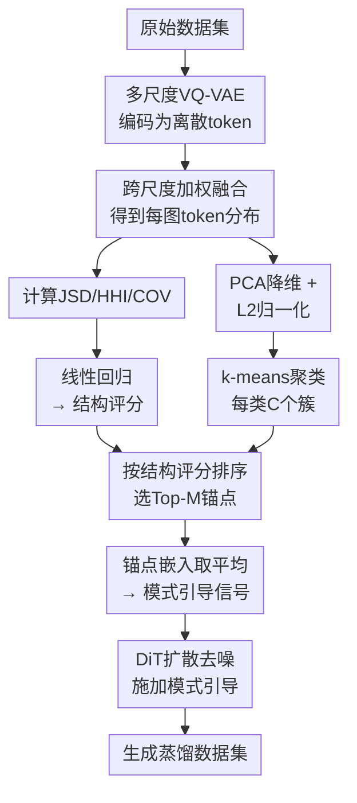

# Structural Assessment for Understanding and Guiding Dataset Distillation in Discrete Token Space

**会议**: ECCV 2026  
**arXiv**: [2606.21705](https://arxiv.org/abs/2606.21705)  
**代码**: 无  
**领域**: 模型压缩 / 数据集蒸馏  
**关键词**: 数据集蒸馏, 离散视觉token, 结构评分, 扩散模型引导, 视觉token统计分析

## 一句话总结

本文通过离散视觉token空间的统计分析方法，提出了结构评分（Structural Score）来评估蒸馏数据集质量，并基于此设计了TGDD（Token-Guided Dataset Distillation）框架，利用结构评分引导扩散模型生成高质量蒸馏数据。

## 研究背景与动机

数据集蒸馏（Dataset Distillation）的目标是用一小部分合成数据替代大规模训练集，使模型在这部分数据上训练后能达到接近全量数据的性能。近年来涌现了大量工作，通过特征匹配、最优传输、梯度对齐等方法让蒸馏数据在连续特征空间上逼近真实数据的分布。然而，这种分布层面的相似性并不能保证语义结构上的有效性——一个蒸馏数据集可能在embedding空间里与原始数据非常接近，但依然丢失了稀有概念、过度表达了平凡结构，或者没能覆盖有区分度的变化模式。实践中甚至观察到，与原始数据分布最相似的数据集并不总是训练效果最好的。这引出了一个核心问题：除了分布相似性之外，到底什么特性决定了蒸馏数据集的有效性？

本文选择从离散视觉token的角度来回答这个问题。离散tokenizer（如VQ-VAE）将每张图像映射为有限codebook中的索引序列，这使得语义基元的组合结构变得可统计分析。文中以ImageNet飞机图像和遥感飞机图像为例：虽然两个域在视角、背景、风格上差异巨大，但它们共享了一批高频token（对应飞机共有的视觉基元），而整体token分布则因上下文差异产生分化。这个观察启示我们跳出全局分布匹配的框架，转而显式刻画数据集的token组成结构。

具体来说，作者引入了三个互补的统计量来表征每张图像的token分布特征：Jensen-Shannon散度衡量样本token分布与类中心之间的上下文契合度、HHI指数衡量token使用的平衡性、TF-IDF覆盖率衡量类别区分性token的保留程度。三者的加权组合称为**结构评分（Structural Score）**。**核心idea：通过离散token空间的统计分析发现，蒸馏数据集的token组成平衡性（HHI）是验证精度的最强预测因子，且分布相似性并不等同于有效性，并以此结构评分引导扩散模型生成更高质量的蒸馏数据。**

## 方法详解

### 整体框架

本文方法分两部分。第一部分是**诊断分析**：用多尺度VQ-VAE将图像映射为离散token分布，跨尺度加权融合后计算三个token级统计量（JSD、HHI、COV），通过线性回归拟合出结构评分，从而预测蒸馏数据集的验证精度。第二部分是**设计生成**（TGDD）：在离散token空间中对每个类别做k-means聚类，对每个簇内的候选样本按结构评分排序，选取Top-M个锚点，平均其嵌入作为模式引导信号，在DiT扩散去噪过程中施加引导，生成最终的蒸馏数据集。

### 关键设计

**1. 多尺度离散token统计表征：将连续图像转化为可统计分析的离散分布**

图像经过多尺度VQ-VAE后，在L个尺度上各产生一张token索引图。每个尺度的token出现频次归一化为概率向量 $\bm{p}_i^{(\ell)}$。由于高分率下的token数随分辨率二次增长（L=10个尺度），直接求和会导致精细尺度支配融合结果。为此，作者将10个尺度分为低（1-3）、中（4-7）、高（8-10）三个频带，分别赋予权重 [3, 1, 0.5] 做加权融合，补偿低分辨率的稀疏性：

$$\bm{p}_i = \sum_{\ell=1}^{L} w_\ell \, \bm{p}_i^{(\ell)}$$

融合后的 $\bm{p}_i$ 即为图像 $i$ 在codebook上的整体token分布，支撑后续所有统计分析。

**2. 结构评分三指标：从上下文契合度、组成丰富度、类别区分性三个维度评估数据质量**

每张图像被表征为一个codebook上的离散分布后，三个互补的统计量共同刻画其token组成结构：

**JSD（Jensen-Shannon散度）** 衡量样本token分布 $\bm{p}_i$ 与对应类别的平均token分布 $\bm{\mu}_c$ 之间的差异。较低的JSD表示该样本的token组合模式在该类中更具代表性，即上下文契合度更高。

**HHI（Herfindahl-Hirschman指数）** 衡量token分布的集中程度：$\mathrm{HHI}(\bm{p}_i)=\sum_k (p_i(k))^2$。较低的HHI意味着token使用更平衡、视觉基元更丰富。实验表明HHI是三个指标中与验证精度相关性最强的单一指标——平衡的token组成比仅仅拟合原始分布更重要。

**COV（覆盖率）** 衡量类别区分性token的保留程度：从原始数据中通过TF-IDF筛选出每个类别的top判别性token集合 $\mathcal{T}_c$，计算样本在这些token上的概率和。高COV意味着样本保留了更多与类别相关的视觉基元。

三者的加权组合即为结构评分，可可靠地预测蒸馏数据集的验证精度（在ImageWoof上回归MSE仅约6）。值得注意的是，三个指标在蒸馏中的重要性不是均等的：从回归系数看，HHI权重为-10.99（负相关，越低HHI→越高精度），远高于JSD（2.96）和COV（2.07），说明token组成的平衡性远比其他因素重要。

**3. 基于结构评分的锚点选择：用token统计替代连续特征来筛选最具代表性的引导样本**

将结构评分从诊断工具转换为生成引导工具的关键在于锚点筛选。TGDD在离散token空间中运行k-means聚类，每个类别设定Kc个簇。与MGD3直接用簇心做引导不同，TGDD对每个簇内的候选样本按结构评分排序，仅选取Top-M个结构最优的样本作为锚点（IPC<50时M=20，否则M=10）。这种筛选避免了均值池化引入噪声样本——尤其是在低IPC下，数据量少导致偶然噪声更容易污染簇心。排在结构评分末尾的样本往往是token组成不平衡、缺少关键类判别token或偏离类中心的样本，将它们排除出引导信号能显著提升生成质量。

**4. Token引导的扩散生成：用锚点簇心信号引导DiT去噪**

锚点选定后，将同一簇内所有锚点嵌入取平均，得到该模式对应的引导信号 $\bar{\bm{z}}_{c,m}$。在DiT的逆向去噪过程中，对所有时间步 $t > t_{\text{stop}}$ 施加强度为 $\lambda$ 的模式引导：

$$\bm{z}_{t-1} = \bm{z}_{t-1}^{\text{base}} + \lambda \, (\bar{\bm{z}}_{c,m} - \hat{\bm{z}}_0)$$

其中 $\hat{\bm{z}}_0$ 是当前时间步预测的干净潜在变量。早期时间步（$t \leq t_{\text{stop}}$）停止引导以保持样本多样性。相比在连续特征空间中直接聚类并使用簇心引导（如MGD3），token空间的组合语义更清晰、锚点筛选更精准，从而在相同的扩散backbone下生成质量更高的合成数据。多项消融证实：完整TGDD显著优于随机选锚点（43.1%，低于基线的45.2%）和在连续特征上做结构评分筛选（44.5%），说明离散聚类与结构评分选择是互补的。

### 损失函数 / 训练策略

TGDD使用与MGD3相同的扩散生成流程，无需额外训练。锚点筛选后直接引导预训练DiT的50步采样，stop guidance设为第25步。蒸馏后的合成数据集上，用SGD训练下游分类器（ConvNet-6 / ResNetAP-10 / ResNet-18，1500-2000 epoch），与MGD3等方法的评估协议完全一致。

## 实验关键数据

### 主实验

| 数据集 | 下游模型 | IPC | SOTA (MGD3) | TGDD | 提升 |
|--------|---------|-----|-------------|------|------|
| ImageWoof | ResNetAP-10 | 50 | 56.5 | **60.3** | +3.8 |
| ImageWoof | ResNetAP-10 | 70 | 60.2 | **63.4** | +3.2 |
| ImageWoof | ResNetAP-10 | 100 | 66.5 | **67.3** | +0.8 |
| ImageNette | ResNetAP-10 | 10 | 66.4 | **67.8** | +1.4 |
| ImageNette | ResNetAP-10 | 50 | 79.5 | **81.3** | +1.8 |
| ImageNet-1k | ResNet-18 | 10 | 45.6 | **45.8** | +0.2 |
| ImageNet-1k | ResNet-18 | 50 | 60.2 | **60.3** | +0.1 |

TGDD在ImageWoof等高类间相似性的细粒度数据集上优势最明显（全局分布匹配效果有限，而token组成结构分析恰好捕捉细微差异），在ImageNet-1k上增益相对温和但仍为最优。

### 消融实验

| 配置 | ImageWoof IPC=50 | 说明 |
|------|-----------------|------|
| MGD3基线（连续空间聚类+簇心引导） | 56.5 | 无离散空间、无PCA、无锚点筛选 |
| + 离散空间聚类 | 57.4 | 仅将聚类空间从连续换为离散token |
| + PCA降维 | 58.9 | 加512维PCA |
| + 锚点筛选（TGDD完整） | **60.3** | 用结构评分筛选Top锚点 |

结构评分各指标的独立及组合消融（ImageWoof IPC=10, ResNetAP-10）：

| 配置 | JSD | HHI | COV | 精度 |
|------|-----|-----|-----|------|
| 单指标最优 (JSD) | ✓ | | | 38.2 |
| 单指标最优 (HHI) | | ✓ | | 37.8 |
| 单指标最优 (COV) | | | ✓ | 37.1 |
| 两两组合最优 (JSD+HHI) | ✓ | ✓ | | 38.7 |
| 完整三指标 | ✓ | ✓ | ✓ | **41.2** |

单指标效果有限，三者两两组合有一定互补性，完整三指标最优。

### 关键发现

- **HHI是预测精度的最强单指标**：回归系数w_HHI=-10.99，远高于JSD（2.96）和COV（2.07），说明token组成的平衡性对训练效果的影响远大于其他因素。更均衡地使用codebook中的各种视觉基元，比仅仅让token分布接近原始数据重要得多。
- **分布相似性不等于有效性**：DM和RDED的JSD值高于Stable Diffusion生成的样本（即更偏离原始分布），但前者训练精度反而更高——这直接反驳了「分布越贴近越好」的直觉。
- **跨域泛化良好**：从ImageWoof拟合的回归系数直接应用到EuroSAT遥感影像数据集，结构评分随蒸馏过程单调上升，与验证精度变化趋势一致。不同离散tokenizer（VQGAN、BEiTv2、VQ-VAE）在引导生成效果上均优于连续模型（VAE、CLIP、DINOv2）。
- **低IPC需要更多锚点**：IPC=10时20个锚点最优；IPC越高，所需锚点越少（10个已足够），过量锚点反而因引入噪声导致性能下降。

## 亮点与洞察

- **从诊断到设计的闭环**：本文最有价值的贡献是建立了「分析蒸馏数据为何有效 → 用分析结论指导生成」的闭环。先通过回归分析发现token组成平衡性（HHI）是关键，再反过来用含HHI在内的结构评分筛选锚点，而不是像MGD3那样直接用簇心均值，让分析真正服务于生成。
- **离散token空间的统计优势**：相比于连续特征空间中语义纠缠不清、难以做细粒度分析，离散token的有限词汇表使统计量（JSD/HHI/COV）天然适合做分布分析，且每个token对应具体的视觉基元，结果可解释性强。这个方法提供了一个通用的评估框架，不依赖具体的蒸馏方法。
- **零额外训练成本**：结构评分计算是推理时操作（一次VQ-VAE前向+统计量计算），TGDD无需微调扩散模型。附加预处理开销仅约0.054秒/图，远小于扩散生成的1.7秒/图，总蒸馏时间（0.43小时）与高效的MGD3（0.32小时）相当，仅为需训练的方法（Minimax 2.02小时）的1/5。

## 局限与展望

- **结构评分依赖于离散tokenizer的质量**：若tokenizer无法捕获细粒度语义差异（如医学图像中的微小病变），评分可靠性会下降。文中仅在4种tokenizer上验证，更广泛场景的泛化性需要进一步测试。
- **线性回归假设的局限性**：结构评分用线性模型拟合精度，但真实关系可能更复杂（如非线性交互或多指标之间的强耦合）。从EuroSAT跨域结果看，评分的绝对值在不同域间不可直接比，只能做相对排序。
- **TGDD的引导框架依赖MGD3**：引导机制继承自MGD3，仅在DiT和LDM上验证，且stop guidance超参（t_stop=25）在不同数据集上可能需要重新调整。
- **数据集的标签依赖**：结构评分中的COV和JSD都需要类别标签和分类别TF-IDF计算，无法直接应用于无标注场景的蒸馏评估。

## 相关工作与启发

- **vs MGD3**：MGD3在连续特征空间聚类后用全成员平均作为引导信号，TGDD则换到离散token空间聚类+用结构评分筛选Top锚点。两者共享相同的扩散引导框架，差异完全来自锚点筛选方式——TGDD在ImageWoof上比MGD3高最多5.4%。
- **vs GLaD / D4M**：这些工作利用GAN/扩散模型的生成先验辅助蒸馏优化，但缺乏对蒸馏数据本身的定量评估工具。本文的结构评分填补了这一空白，且可以独立于生成方法使用。
- **vs DM (Distribution Matching)**：DM强调全局分布对齐，本文的实验直接反驳了「分布越接近越有效」的直觉——DM虽JSD高但精度不错，说明token组成平衡性比分布接近更重要。

## 评分

- 新颖性: ⭐⭐⭐⭐ 将离散token统计分析引入数据集蒸馏评估，视角新颖；从诊断到生成的闭环设计巧妙。
- 实验充分度: ⭐⭐⭐⭐⭐ 在5个数据集、多个IPC设定、3种下游架构、多种tokenizer和扩散架构上做了充分消融，实验设计严谨。
- 写作质量: ⭐⭐⭐⭐ 动机清晰、逻辑链条完整（发现→理解→引导），图表质量高。
- 价值: ⭐⭐⭐⭐⭐ 为数据集蒸馏领域提供了第一个可解释的定量评估工具，且直接改进了生成质量，实用价值高。

<!-- RELATED:START -->

## 相关论文

- [\[ICLR 2026\] Understanding Dataset Distillation via Spectral Filtering](../../ICLR2026/model_compression/understanding_dataset_distillation_via_spectral_filtering.md)
- [\[ECCV 2026\] Distill Once, Adapt Life-Long: Exploring Dataset Distillation for Continual Test-Time Adaptation](distill_once_adapt_life-long_exploring_dataset_distillation_for_continual_test-t.md)
- [\[ICCV 2025\] Heavy Labels Out! Dataset Distillation with Label Space Lightening](../../ICCV2025/model_compression/heavy_labels_out_dataset_distillation_with_label_space_lightening.md)
- [\[CVPR 2026\] Dataset Distillation by Influence Matching](../../CVPR2026/model_compression/dataset_distillation_by_influence_matching.md)
- [\[ICLR 2026\] Dataset Distillation as Pushforward Optimal Quantization](../../ICLR2026/model_compression/dataset_distillation_as_pushforward_optimal_quantization.md)

<!-- RELATED:END -->
