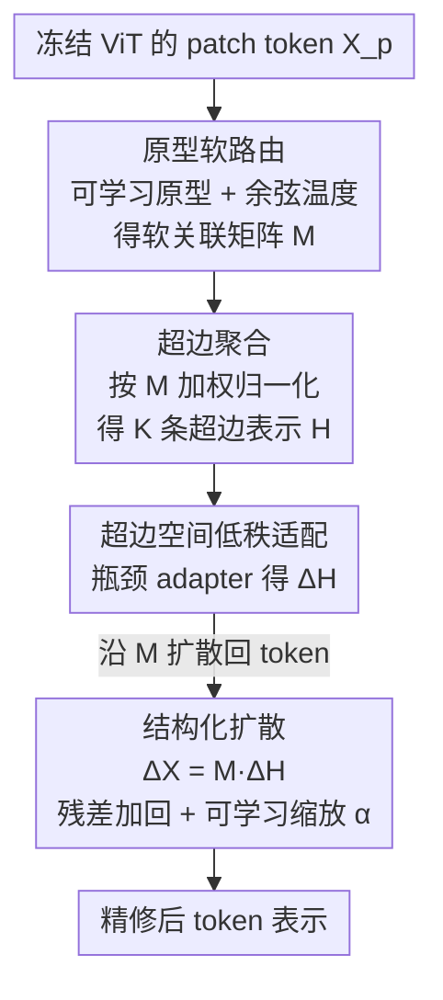

# Structured Hyperedge Adaptation for Parameter-Efficient Fine-Tuning of Vision Transformers

**会议**: ECCV 2026  
**arXiv**: [2606.22383](https://arxiv.org/abs/2606.22383)  
**代码**: 未提供  
**领域**: 模型压缩 / 参数高效微调  
**关键词**: PEFT、Adapter、超图、超边空间、结构化归纳偏置

## 一句话总结
把 ViT 的 adapter 微调从「每个 token 各自单独更新」搬到「超边空间」——先用可学习原型把 patch token 软路由成若干组（超边），在超边上做低秩瓶颈适配，再把更新扩散回 token，用极小的参数量（<0.5% backbone）在 VTAB-1K 上把结构化推理任务的准确率显著拉高。

## 研究背景与动机
把大规模预训练 ViT 迁移到下游任务，全量微调又贵又占显存，尤其当一个 backbone 要同时服务几十个任务时更不现实。参数高效微调（PEFT）因此成了主流实践：冻住 backbone，只训练一小撮参数。其中 adapter 一系（Houlsby Adapter、AdaptFormer、Convpass、RepAdapter 等）因为模块化、即插即用而广受欢迎——在每个 transformer block 里插一个轻量瓶颈模块 $\Delta{\bm{x}}_i = {\bm{W}}_{\text{up}}\sigma({\bm{W}}_{\text{down}}{\bm{x}}_i)$ 去精修中间表示。LoRA 那一类低秩重参数化本质上也是同一套逻辑。

但作者注意到这些方法有一个几乎从没被质疑过的共同假设：**适配是逐 token 独立进行的**。同一个瓶颈变换被原封不动地、彼此隔离地作用到每个 patch embedding 上。虽然冻结的自注意力层确实在编码 token 之间的上下文交互，可「适配」这个动作本身仍然是 token-wise 的——它默认特征精修应该发生在 token 空间里，完全没有显式建模视觉场景中天然存在的结构关系。可现实是，图像 token 往往对应一块连贯的区域：一个物体、一个部件、一个语义成分。在这种 token 各扫门前雪的更新方式下，属于同一物体的 token 各改各的，容易产生冗余更新、空间上不一致的精修，也白白浪费了场景里的关系信息。

这里的核心矛盾是：视觉特征本该以「组」为单位协同精修，可现有 adapter 的数学形式把每个 token 锁死成了一个孤立的更新单元。本文于是提出，PEFT 里真正被忽视的关键维度不是「改多少参数」，而是「在什么空间里改」（the adaptation space）。**本文的核心 idea 是：不在 token 空间做适配，而是先把相关 token 软聚成超边、在超边空间做低秩瓶颈适配、再沿超图关联结构把更新扩散回 token，从而给 PEFT 注入一个显式的结构化归纳偏置，同时完全保留标准 adapter 的低秩、置换等变与模块化性质。**

## 方法详解

### 整体框架
HyperAdapter 是标准 adapter 的一个即插即用替代品：backbone 一个字都不改，只是把「瓶颈变换作用在哪」从每个 token 换成了每条超边。给定冻结 ViT 产生的 patch token $\ {\bm{X}}_p\in\mathbb{R}^{N\times D}$，整条通路走四步：① 用 $K$ 个可学习原型向量把每个 token 软路由到若干超边，得到软关联矩阵 ${\bm{M}}\in\mathbb{R}^{N\times K}$；② 按 ${\bm{M}}$ 把 token 特征加权聚合成 $K$ 条紧凑的超边表示 ${\bm{H}}$；③ 在超边上跑一个低秩瓶颈 adapter 得到 $\Delta{\bm{H}}$；④ 再沿 ${\bm{M}}$ 把更新扩散回 token，残差加回原特征。CLS token 全程不参与路由，只在最后按一种聚合策略吸收超边信息。整块模块与自注意力并联插入到 Attention 和 MLP 两个分支旁。

关键在于，当每条超边恰好只含一个 token（$K=N$、${\bm{M}}={\bm{I}}_N$）时，聚合与扩散都退化成恒等映射，整个方法精确还原成普通的 token-wise adapter——也就是说 HyperAdapter 严格泛化了现有 adapter，标准设计只是它的一个特例。

### 关键设计

**1. 重新审视「适配空间」：从 token 空间搬到超边空间**

这一步是全文的立论根基，针对的痛点很直白——现有 adapter 把每个 token 当成孤立单元去更新，无视了「一堆 token 其实同属一个物体/部件」这件事，于是产生冗余和空间不一致的精修。作者的做法不是去改注意力、也不是加更多参数，而是换一个「适配发生的空间」：让一组相关 token 被联合精修，而不是各改各的。这个视角之所以有效，是因为它把结构关系从「backbone 隐式编码、适配时被忽略」变成了「适配时被显式利用」；而且它保持了 PEFT 的所有好处（backbone 不动、参数极少、模块化），只是重新定义了瓶颈变换的作用对象。论文用一个统一视角把这层意思讲透：token-wise adapter 是 HyperAdapter 在「每条超边只含单个 token」时的退化特例，所以这不是另起炉灶，而是把已有设计装进了一个更一般的框架里。

**2. 原型驱动的软路由：用相似度把 token 聚成超边，而非硬划空间格子**

要在超边空间做适配，第一件事是决定「哪些 token 归为一组」。作者引入 $K$ 个可学习原型向量 ${\bm{E}}\in\mathbb{R}^{K\times D}$（Xavier 初始化，和 adapter 参数一起训），把它们当作潜在超边的代表。每个 token 按与原型的表示相似度被**软**分配到各超边，用温度缩放的余弦路由算出关联矩阵：

$$
{\bm{M}}_{ik}=\frac{\exp\!\left(\langle\hat{{\bm{x}}}_i,\hat{{\bm{e}}}_k\rangle/\tau\right)}{\sum_{j=1}^{K}\exp\!\left(\langle\hat{{\bm{x}}}_i,\hat{{\bm{e}}}_j\rangle/\tau\right)}
$$

其中 $\hat{{\bm{x}}}_i,\hat{{\bm{e}}}_k$ 是归一化后的 token 与原型，$\tau$ 控制分配的软硬程度。这样每个 token 都能以可微的方式同时贡献给多条超边。这里的巧思是：分组不靠空间邻域这类人为先验，而是让预训练 ViT 里本就富含语义/空间信息的 token embedding 自己去决定谁和谁像——所以路由是数据自适应的、动态的。作者在附录里也验证了这一点：即便没有任何显式空间监督，学到的超边照样对齐到有意义的物体区域，且深层会自发地把更多 token 聚到少数几条超边上（渐进式特化）。

**3. 超边聚合 → 低秩适配 → 结构化扩散：让更新在组内共享**

有了软关联矩阵后，先把 token 特征聚成超边表示——按 ${\bm{M}}$ 对分到该超边的 token 做归一化加权平均：${\bm{H}}=({\bm{M}}^\top{\bm{X}}_p)\oslash({\bm{M}}^\top\mathbf{1})\in\mathbb{R}^{K\times D}$，每条超边就是一个融合了多个相关 token 的紧凑组级表示。适配只在这 $K$ 条超边上做一个轻量瓶颈变换 $\Delta{\bm{H}}={\bm{W}}_{\text{up}}\sigma({\bm{W}}_{\text{down}}{\bm{H}})$，然后把更新沿关联结构扩散回每个 token 并残差相加：$\Delta{\bm{X}}={\bm{M}}\Delta{\bm{H}}$，${\bm{X}}_p'={\bm{X}}_p+\alpha\Delta{\bm{X}}$（$\alpha$ 可学习缩放）。合起来看，整个 token 级更新可以写成一个结构化平滑算子：

$$
\Delta{\bm{X}}={\bm{M}}\,{\bm{W}}_{\text{up}}\,\sigma\!\left({\bm{W}}_{\text{down}}\left({\bm{M}}^\top{\bm{X}}_p\right)\right)
$$

它的意义是——同属一条超边的 token 会共享同一份更新，从而产生连贯、组级一致的特征精修，而不是各自为政。这一步为什么有效，作者用两条性质佐证：其一，token 级更新的秩至多为 $\min(K,r)$（$r$ 是瓶颈维度），说明它没破坏 PEFT 的低秩本质，参数和计算依旧省；其二，整个模块对 token 排列是置换等变的（余弦路由在置换下保内积，聚合与扩散逐条超边独立），符合视觉 token「无固有顺序」的直觉。换句话说，它在拿到「结构化组级适配」的同时，没丢掉低秩和置换等变这两条 adapter 的看家性质。

### 损失函数 / 训练策略
没有额外自定义损失，就是标准的下游分类交叉熵。backbone 全程冻结，只训练分类头和 HyperAdapter 模块。默认瓶颈秩 $r=8$、超边数 $K=8$（$K$ 跨数据集固定，路由温度 $\tau$ 按验证集选）。优化器 AdamW（weight decay $1\times10^{-4}$），VTAB-1K 学习率 $1\times10^{-3}$、FGVC 为 $5\times10^{-3}$，cosine 调度 + 10 epoch warmup，共 100 epoch，batch 64，输入 $224\times224$，单卡即可。模块以并联方式同时插到 Attention 和 MLP 分支。

## 实验关键数据

### 主实验
在 VTAB-1K（19 个任务，分 Natural / Specialized / Structured 三类）上用 ViT-B/16（ImageNet-21k 预训练）作 backbone，与一众强 PEFT 基线对比。HyperAdapter 以 0.44M 可训练参数拿到 77.6% 平均准确率，超过所有对手，且增益最集中在需要结构化空间推理的 Structured 类（KITTI-Dist、dSpr-Loc、sNORB 等）。

| 方法 | 参数 (M) | 平均准确率 | 相对最强基线 |
|------|---------|-----------|-------------|
| Full fine-tuning | 85.8 | 68.9 | — |
| Linear probing | 0 | 57.6 | — |
| LoRA | 0.29 | 74.5 | — |
| SSF | 0.24 | 75.7 | — |
| RepAdapter | 0.22 | 76.1 | — |
| Res-Tuning | 0.55 | 76.3 | 之前最强 |
| **HyperAdapter (本文)** | 0.44 | **77.6** | **+1.3** |

换更大/不同结构的 backbone 结论一致：ViT-L/16 上达 77.7%（Structured 63.8%，仅 1.18M 参数、不到 backbone 的 0.5%），Swin-Base 上达 77.6%（Structured 63.0%，0.60M 参数），说明方法是架构无关的。少样本 FGVC（5 个细粒度数据集，1/2/4/8/16-shot）上，HyperAdapter 在几乎所有数据集和 shot 设定下最优或接近最优，且在 1–4 shot 的超低样本区间增益最明显。作者还在 ADE20K 语义分割（ViT-L）上补测，mIoU 达 45.20，超过 VPT、RepAdapter，证明结构化超边适配能推广到密集预测任务。

### 消融实验

| 配置 | 平均准确率 | 说明 |
|------|-----------|------|
| Token-wise baseline（去掉超边路由，参数量相当） | 76.3 | 同容量 adapter，无分组 |
| **HyperAdapter (Full)** | **77.6** | 加超边路由，+1.3（Natural +0.3 / Specialized +1.7 / Structured +1.9） |
| $K=4$ | 77.2 | 超边太少，组级聚合不足 |
| $K=8$（默认） | 77.6 | 容量与效率的最佳折衷 |
| $K=16$ | 77.3 | 超边过多，token 组被碎片化 |
| Parallel (Attn+MLP)（默认） | 77.6 | 并联双分支最优 |
| Pre (Attn Only) | 76.3 | 单分支且前置，最差 |
| $r=8$（默认） | 77.6 | 瓶颈维度 8 已饱和 |
| $r=64$ | 77.0 | 参数翻数倍反而无益 |

### 关键发现
- **增益来自结构、不是参数**：token-wise baseline 参数量与 HyperAdapter 相当（甚至在匹配预算实验里把 baseline 的 $r$ 撑到 12、AdaptFormer 撑到 24 使三者都是 0.44M），HyperAdapter 仍高出约 1 个点，证实收益源于超边路由这个结构化机制而非容量。
- **结构化任务受益最大**：Structured 类涨 1.9 个点、Specialized 涨 1.7，正好是空间/关系依赖最强的场景，印证「组级适配捕获高阶关系」的核心主张。
- **超边数与瓶颈维度都存在甜点**：$K$ 和 $r$ 增大到 8 后性能即饱和，再加只涨参数不涨精度——说明表达力瓶颈不在容量，而在「是否分组」。
- **路由行为随深度渐进特化**：浅层路由熵高、token 分散到多条超边（探索），深层熵降、集中到少数超边（特化）；patch-grid 可视化也显示深层把邻近 patch 聚成连贯语义区域。DAAM 归因图上，HyperAdapter 的激活比 baseline / AdaptFormer 更聚焦于物体本体、背景噪声更少。
- **效率代价温和**：相比 token-wise 方法，训练延迟 212–218→239 ms/batch、推理 117–121→129 ms/batch、显存 2.8–3.0→3.2 GB，FLOPs 几乎不变（17.8G vs 17.6G），额外开销 $O(NKD+KDr)$ 相对自注意力 $O(N^2D)$ 可忽略。

## 亮点与洞察
- **重新定义「在哪适配」这个维度**：以往 PEFT 卷的是「改多少参数、怎么低秩分解」，本文把注意力引到「适配发生在什么空间」——一个此前几乎无人讨论的正交维度，这个 reframing 本身就很有启发。
- **token-wise adapter 是特例的统一视角**：当 $K=N$、${\bm{M}}={\bm{I}}$ 时精确退化成普通 adapter，让新方法不是「又一个 trick」，而是把整类方法收进了更一般的框架，理论上也顺手证了低秩性和置换等变。
- **结构化平滑算子的解读很干净**：把「聚合 → 低秩适配 → 扩散」写成一个作用在 token 上的平滑算子 ${\bm{M}}{\bm{W}}_{\text{up}}\sigma({\bm{W}}_{\text{down}}{\bm{M}}^\top{\bm{X}}_p)$，直观说明了「同组 token 共享更新」为何能带来连贯精修。
- **可迁移的思路**：把「先软聚类成组、组内做轻量变换、再扩散回单元」这套模式，可以搬到任何「基本单元之间有隐式高阶结构、但主干只做逐单元处理」的场景，比如点云、图节点、甚至多模态 token 的高效适配。

## 局限与展望
- 作者承认路由（分配 + 聚合 + 扩散）比 token-wise adapter 多了一层计算，虽然实测开销温和，但对更大 backbone、更高分辨率输入的可扩展性还需进一步优化路由机制。
- 超边数 $K$ 在所有层、所有数据集上固定；自适应/数据相关的超边构造有望捕获更丰富的 token 关系、提升跨任务灵活性。
- 主实验集中在视觉分类（VTAB-1K、少样本 FGVC），虽补了 ADE20K 分割，但对视频理解、多模态学习等更广任务的验证仍是开放方向。
- 自己发现的一点：$\tau$ 在正文里仅按验证集调、且只在 Caltech101 上给了敏感性曲线（$\tau=0.10$ 最优），跨数据集的温度稳健性证据略单薄；另外主结果各类提升虽稳但幅度不大（平均 +1.3），是否值得那点额外延迟需按部署场景权衡。

## 相关工作与启发
- **vs 普通 Adapter / LoRA / AdaptFormer / RepAdapter**：它们都在 token 空间逐个独立精修 token；本文在学到的超边空间做组级适配，显式捕获 token 间高阶关系。本文优势是同参数预算下更强、结构化任务尤甚，代价是多一层路由计算。
- **vs 图/超图 ViT（ViG、MobileViG、GreedyViG、Vision HGNN）**：那些工作把图/超图计算塞进 backbone、改核心运算、从头学关系表示；本文完全不动预训练 ViT，只在瓶颈 adapter 内部用软超图做一次「路由→适配→扩散」，超边只是适配用的瞬时交互空间，不是特征提取主干。
- **vs HGNN**：HGNN 是端到端的关系表示学习骨干、靠迭代图传播；HyperAdapter 是冻结 transformer 上的轻量 PEFT 模块，用轻量路由替代迭代传播，且保持低秩、置换等变、可退化成 token-wise adapter。据作者所知，这是首个把 PEFT 形式化为「超边级结构化适配」的工作。
- **vs Prompt-based（VPT、E2VPT、VFPT、ViaPT）**：prompt 方法通过可学习 prompt token 改变注意力交互，但注意力混合后仍是逐 token 精修特征；本文直接改「适配的作用对象」，在 ViT-L 上对比 VFPT/ViaPT 平均准确率更高（77.6 vs 75.5 / 76.4）。

## 评分
- 新颖性: ⭐⭐⭐⭐☆ 「适配空间」这个 reframing 加超边级适配确实新，且给出 token-wise adapter 是特例的统一视角，但底层组件（原型软路由、瓶颈 adapter）均是成熟部件的组合。
- 实验充分度: ⭐⭐⭐⭐⭐ 覆盖 3 种 backbone、24 个下游任务、分类+少样本+分割，消融把 $K$/$r$/放置/温度/CLS 聚合/匹配参数预算都扫了一遍，还有路由熵、patch-grid、DAAM 多种可视化。
- 写作质量: ⭐⭐⭐⭐⭐ 立论清晰，method 从「重审适配空间」层层推进到统一视角，三条命题（退化、置换等变、低秩）把性质讲得很扎实。
- 价值: ⭐⭐⭐⭐☆ 即插即用、参数<0.5%、架构无关，工程上易采纳；平均增益不算大但在结构化任务上稳定有效，且开辟了「适配空间」这一可继续挖的维度。

<!-- RELATED:START -->

## 相关论文

- [\[ICLR 2026\] Efficient Orthogonal Fine-Tuning with Principal Subspace Adaptation](../../ICLR2026/model_compression/efficient_orthogonal_fine-tuning_with_principal_subspace_adaptation.md)
- [\[CVPR 2026\] S2FT: Parameter-Efficient Fine-Tuning in Sparse Spectrum Domain](../../CVPR2026/model_compression/s2ft_parameter-efficient_fine-tuning_in_sparse_spectrum_domain.md)
- [\[ICLR 2026\] PiCa: Parameter-Efficient Fine-Tuning with Column Space Projection](../../ICLR2026/model_compression/pica_parameter-efficient_fine-tuning_with_column_space_projection.md)
- [\[ICLR 2026\] Memba: Membrane-driven Parameter-Efficient Fine-Tuning for Mamba](../../ICLR2026/model_compression/memba_membrane-driven_parameter-efficient_fine-tuning_for_mamba.md)
- [\[ACL 2025\] Trans-PEFT: Transferable Parameter-Efficient Fine-Tuning on Evolving Base Models](../../ACL2025/model_compression/trans_peft_transferable.md)

<!-- RELATED:END -->
