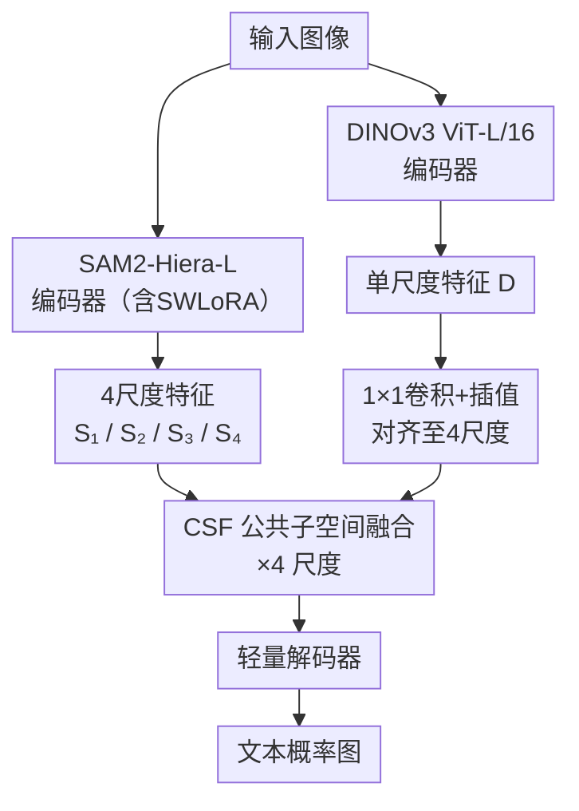

# TextDS: Parameter-Efficient Representation Alignment for Scene Text Detection under Distribution Shifts

**会议**: ECCV2026  
**arXiv**: [2606.28077](https://arxiv.org/abs/2606.28077)  
**代码**: [https://github.com/ZChenDang/TextDS](https://github.com/ZChenDang/TextDS)  
**领域**: 场景文本检测  
**关键词**: 场景文本检测, 分布偏移, 参数高效微调, 低秩自适应, 特征对齐

## 一句话总结

TextDS 采用 SAM2 和 DINOv3 双编码器架构，通过逐步低秩自适应（SWLoRA）和公共子空间融合（CSF）实现无需大规模场景文本预训练的鲁棒场景文本检测，仅用 4.9M 参数即在域偏移和雨/雾/曝光/低分辨率等成像退化条件下达到领先性能。

## 研究背景与动机

实际部署场景下，场景文本检测器不可避免会遭遇分布偏移——包括跨域变化（不同拍摄场景、字体语言、字体风格）和成像退化（雨雾、过曝光/欠曝光、低分辨率）。现有方法大多依赖于 SynthText-800k/150k 等大规模场景文本预训练数据集来提升域内性能，但对分布偏移下的鲁棒性评估和优化却研究不足。当部署到真实环境时，雨雾降低对比度、欠曝光压缩动态范围、过曝光抹掉笔画细节、低分辨率丢失精细纹理——这些退化同时破坏像素可分性和几何线索，使基于像素聚类的阈值/区域生长方法和基于显式结构建模的边界定位都变得不稳定。

本文的核心洞察是：相比于在场景文本数据上大规模预训练，视觉基础模型（如 SAM2 和 DINOv3）已经具备了强大的通用视觉先验。如果能利用它们的互补优势——SAM2 提供结构化多尺度特征，DINOv3 提供域鲁棒的语义表示——再通过高效的适配和融合机制将其转化为文本检测所需的分辨能力，就可以绕过对场景文本预训练的重度依赖，同时提升跨域泛化和退化条件下的鲁棒性。**核心 idea：构建 SAM2-DINOv3 双编码器架构，通过逐步低秩自适应（SWLoRA）在 SAM2 块级别做渐进式微调，再通过公共子空间融合（CSF）在共享子空间内融合双分支并保留 DINOv3 的正交补域信息，仅用 4.9M 可训练参数实现分布偏移下的鲁棒场景文本检测。**

## 方法详解

### 整体框架

TextDS 整体架构为双编码器 + 融合 + 轻量解码器的串行 pipeline。输入图像同时送入 SAM2-Hiera-L 和 DINOv3 ViT-L/16 两个编码分支。SAM2 分支在每层 Hiera 块前插入 SWLoRA 模块进行参数高效微调，输出 4 尺度特征金字塔（S₁~S₄）。DINOv3 分支以固定 448×448 分辨率提取单尺度语义特征 D，再通过 4 个 1×1 卷积和双线性插值对齐到 SAM2 的四个尺度。每个尺度的对齐特征对 (S_k, D_k) 经 CSF 模块融合，输出 F_k。4 个尺度的融合特征送入轻量解码器，输出文本概率图。

### 关键设计

**1. SAM2-DINOv3 双编码器：以互补视觉基础模型替代场景文本预训练**

现有场景文本检测方法无一例外依赖 SynthText 等大规模合成数据集做预训练以获得文本感知表示。本文的思路是跳脱这一范式：SAM2-Hiera-L 编码器仅保留图像编码主干（去除提示编码器和掩码解码器），天然输出 4 尺度特征金字塔（分辨率依次递减，通道数 144→288→576→1152），提供从高分辨率的笔画/边界细节到低分辨率的全局布局先验的多层结构信息。DINOv3 ViT-L/16 以固定 448×448 输入提取 28×28 单尺度语义特征，通过自蒸馏学习得到的表示具有跨域鲁棒性。为匹配 SAM2 的多尺度结构，DINOv3 特征经 4 个独立的 1×1 卷积（将 1024 维压缩到对应尺度通道数）加双线性插值对齐到每个 SAM2 尺度。两个编码器的原始权重全程冻结，仅 SWLoRA 和 CSF 中的少量参数参与训练——这是实现仅 4.9M 可训练参数的关键。

**2. SWLoRA：逐步低秩自适应与余弦相似度动态早停**

场景文本检测对不同尺度的适配需求不同：高分辨率层需要精细调整边界和笔画，中层控制实例连通性和形变一致性，低层主要贡献全局布局先验和背景抑制。SWLoRA 的核心思想是对每个冻结的 Hiera 块执行最多 T=5 步的迭代式低秩精炼，每步叠加一个 LoRA 风格的残差：

$$x^{(t+1)} = x^{(t)} + \gamma_{t}\,\frac{\alpha}{r}\,W_{up}\big(\text{Dropout}(\text{LN}(W_{down}(x^{(t)})))\big)$$

其中 $\gamma_t$ 是可学习的步长缩放因子，$r$ 为 LoRA 秩（默认 8），$\alpha$ 为缩放常数。每一步相当于在当前表示上施加一次低秩方向修正。精炼到第 t 步后，计算连续两步表示的余弦相似度：

$$\cos^{(t)} = \frac{\langle \text{vec}(x^{(t+1)}), \text{vec}(x^{(t)}) \rangle}{\|\text{vec}(x^{(t+1)})\|_2 \|\text{vec}(x^{(t)})\|_2 + \varepsilon}$$

若 $\cos^{(t)} > \tau$（早停阈值）且至少执行了 1 步最小更新，则终止精炼，以当前状态送入冻结 Hiera 块。这个动态早停机制让困难样本和需要更强调整的块获得更多精炼步数，而简单样本快速退出——在 CTW-1500、Total-Text、MLT 上的平均步数分别为 3.65、2.20、3.48（最大 5），对应节约 27%、56%、30% 的微调计算量，在精度与效率间取得平衡。

**3. CSF：公共子空间融合与正交补域保留**

双编码器特征融合的关键难题是：两个分支既有共享信息（共同关注的文本区域），又有互补信息（SAM2 的结构细节 vs DINOv3 的域鲁棒语义）。简单的拼接或加权求和会混合噪声，难以区分哪些信息是共享的、哪些是各分支独有的。CSF 在二阶统计层次解决这个问题。

首先对每个尺度的特征对 (S_k, D_k) 经 1×1 卷积投影到公共通道数 C，然后使用全局平均池化的拼接经 MLP+Sigmoid 得到自适应门控权重 $\alpha$，生成中间混合特征 $M = \alpha \odot \hat{S} + (1-\alpha) \odot \hat{D}$。

第二步，将 $\hat{S}$ 和 $\hat{D}$ 展平并中心化，计算各自的协方差矩阵，再求 $A = \Sigma_S \Sigma_D$。对 A 做特征分解取前 r=16 个特征向量构成公共子空间的正交基 Q。这个子空间捕捉了两个分支统计上共享的变异模式。

第三步（最巧妙的一步），将跨分支交互限制在此公共子空间内，同时显式保留 DINOv3 的正交补域信息：

$$F_k = \mathcal{P}_k(M_k) + (\hat{D}_k - \mathcal{P}_k(\hat{D}_k))$$

其中 $\mathcal{P}_k(X) = Q_k(Q_k^\top X)$ 是投影到公共子空间的操作。第一项对混合特征 M 在公共子空间内投影和融合，确保两分支只在统计上共享的维度上交互；第二项将 D 中不属于公共子空间的分量原封不动保留下来，防止融合操作无意中丢弃 DINOv3 特有的域鲁棒信息——这个"融合但不丢弃"的设计是 CSF 区别于简单特征拼接或注意力融合的核心差异。

### 损失函数 / 训练策略

训练损失为等权重的二值交叉熵损失和 IoU 损失之和，旨在同时优化像素级分类精度和边界区域的重叠质量。使用 AdamW 优化器，初始学习率 0.001，权重衰减 $5\times10^{-4}$，余弦退火调度到最低 $1\times10^{-7}$，共训练 50 个 epoch，batch size 4，单张 RTX 4090。

## 实验关键数据

### 主实验

TextDS 在三个标准场景文本检测数据集上与近年代表性方法对比。在域内测试中全面领先的同时，仅需 4.9M 可训练参数（已有方法的 1/5~1/8），无需 SynthText 预训练，推理速度达 44.1 FPS。

| 数据集 | 指标 | DB-Net | TextBPN | LRANet | S3INet | TextDS |
|--------|------|--------|---------|--------|--------|--------|
| CTW-1500 | F-measure | 83.4 | 85.0 | 87.4 | 86.0 | **90.6** |
| Total-Text | F-measure | 84.7 | 87.9 | 87.7 | 88.7 | **89.1** |
| MLT | F-measure | 85.6 | 87.4 | 88.3 | 89.7 | **92.2** |
| - | 参数量 | 28.0M | 38.7M | 34.3M | 38.0M | **4.9M** |
| - | FPS | 35.0 | 22.6 | 38.1 | 37.3 | **44.1** |

在本文构造的退化变体数据集上，TextDS 展现出极高的退化鲁棒性，各条件 F-measure 仅下降 0.4~1.7 个百分点：

| 条件 | CTW-1500 | Total-Text | MLT |
|------|----------|------------|-----|
| 正常 | 90.6 | 89.1 | 92.2 |
| 雨 | 89.2 | 87.7 | 91.6 |
| 雾 | 89.8 | 88.3 | 91.9 |
| 欠曝光 | 90.1 | 87.8 | 92.1 |
| 过曝光 | 89.9 | 87.9 | 91.8 |
| 低分辨率 256 | 89.8 | 88.3 | 90.9 |
| 低分辨率 128 | 88.9 | 88.0 | 88.3 |

### 消融实验

| 配置 | CTW-1500 | Total-Text | MLT | 说明 |
|------|----------|------------|-----|------|
| 基线（单编码器） | 82.2 | 85.1 | 86.4 | 无双编码、无适配、无融合 |
| + 双编码器 | 85.3 | 86.0 | 88.1 | 引入 DINOv3 分支 |
| + SWLoRA | 87.9 | 88.3 | 90.3 | 逐步低秩自适应 |
| + CSF（无 SWLoRA） | 88.2 | 87.8 | 91.0 | 公共子空间融合 |
| 完整模型 | 90.6 | 89.1 | 92.2 | 全部模块 |

### 关键发现

- **CSF 在 MLT 上贡献最大**：在 MLT 多语言跨域场景下，仅加 CSF 就带来 4.6 个点的提升，说明公共子空间融合对跨域语义对齐至关重要
- **SWLoRA 与 CSF 互补**：二者单独使用时分别提升 1.9~2.6 和 1.9~6.0 个点（因数据集而异），叠加后进一步提升，说明结构适配和特征融合解决的是不同层面的问题
- **早停效率高**：SWLoRA 平均执行步数大幅低于最大步数 5，有效节约了微调计算量且不影响精度
- **退化鲁棒性均衡**：各退化类型的性能下降幅度接近（1~2 个点），说明双编码器+CSF 的设计对各种退化都有防御力，而非针对某一种退化做专门优化

## 亮点与洞察

- **去预训练化思路**：本文最巧妙的点在于绕过 SynthText 预训练，直接用通用视觉基础模型的互补组合来做场景文本检测——这比在合成文本数据上从头训练高效得多，且泛化性能更好。这个思路可以推广到其他需要域鲁棒性的细粒度视觉任务（如文档分析、遥感目标检测）。
- **CSF 的"融合但不丢弃"设计**：公共子空间投影确保两分支只在统计共享的维度上交互，而正交补域保留则保证 DINOv3 独有的域鲁棒信息不被融合操作冲刷掉。这种"部分融合 + 部分保留"的模式可迁移到任意异构编码器的特征融合场景。
- **SWLoRA 的样本自适应深度**：用余弦相似度做早停的动机很自然——不是每个块、每个样本都需要同样多的微调——但 LoRA 的多步迭代式设计在 LoRA 变体中较为新颖，且与场景文本检测的尺度依赖特性做了有机结合。

## 局限与展望

- 论文构造的退化数据集是通过合成退化流程生成的，真实复杂场景下的退化（如镜头畸变、动态模糊、压缩伪影）尚未覆盖。从合成退化到真实退化的泛化能力有待验证。
- 双编码器设计虽参数高效，但推理时两个编码器都需要前向传播，实际计算开销高于端到端单编码器方案。论文报告了 44.1 FPS，但未详细对比两个编码器各自的耗时占比。
- SWLoRA 仅作用于 SAM2 编码器的 Hiera 块，未在 DINOv3 侧做适配。DINOv3 特征是否可以用类似适配器进一步精细微调以获得更好的双分支对齐，值得探索。
- 公共子空间的秩 r=16 作为默认设置在全部实验中固定使用，论文未讨论不同数据集是否需要不同的最优秩。

## 相关工作与启发

- **vs DB-Net / TextBPN / LRANet / S3INet 等传统文本检测方法**：这些方法都依赖 SynthText 大规模预训练，且主要在理想条件下评估。TextDS 走了一条不同路径——用通用基础模型替代特定领域预训练，并将评估扩展到分布偏移场景。在三个标准数据集上全面领先，证明了去预训练化思路在文本检测领域的可行性。
- **vs Qwen-OCR / DeepSeek-OCR / PP-OCR 等基于大语言模型的 OCR 方案**：LLM-based 方法语义理解强但像素级几何定位弱。TextDS 作为前端检测器提供高质量文本区域，可与 LLM-OCR 形成互补。论文也展示了这种互补性的可视化对比。

## 评分
- 新颖性: ⭐⭐⭐⭐⭐ 用通用基础模型组合替代场景文本预训练的思路在文本检测领域很新颖，SWLoRA 和 CSF 的设计动机和实现都有独到之处
- 实验充分度: ⭐⭐⭐⭐ 三个标准数据集 + 5 种退化条件 × 3 数据集 = 15 组系统实验，消融清晰。退化数据集为合成生成而非真实场景数据
- 写作质量: ⭐⭐⭐⭐⭐ 动机清晰、方法叙述详细、公式和图示组织得当，实验对比表信息密度高
- 价值: ⭐⭐⭐⭐⭐ 无需场景文本预训练 + 仅 4.9M 参数 + 退化鲁棒，实用性极强，对文本检测方向有启发性

<!-- RELATED:START -->

## 相关论文

- [\[ICCV 2025\] Gradient Short-Circuit: Efficient Out-of-Distribution Detection via Feature Intervention](../../ICCV2025/model_compression/gradient_short-circuit_efficient_out-of-distribution_detection_via_feature_inter.md)
- [\[ACL 2026\] SRA: Span Representation Alignment for Large Language Model Distillation](../../ACL2026/model_compression/sra_span_representation_alignment_for_large_language_model_distillation.md)
- [\[AAAI 2026\] From Parameter to Representation: A Closed-Form Approach for Controllable Model Merging](../../AAAI2026/model_compression/from_parameter_to_representation_a_closed-form_approach_for_controllable_model_m.md)
- [\[ACL 2025\] Quaff: Quantized Parameter-Efficient Fine-Tuning under Outlier Spatial Stability Hypothesis](../../ACL2025/model_compression/quaff_quantized_peft.md)
- [\[CVPR 2026\] Frequency Switching Mechanism for Parameter-Efficient Multi-Task Learning](../../CVPR2026/model_compression/frequency_switching_mechanism_for_parameter-ecient_multi-task_learning.md)

<!-- RELATED:END -->
