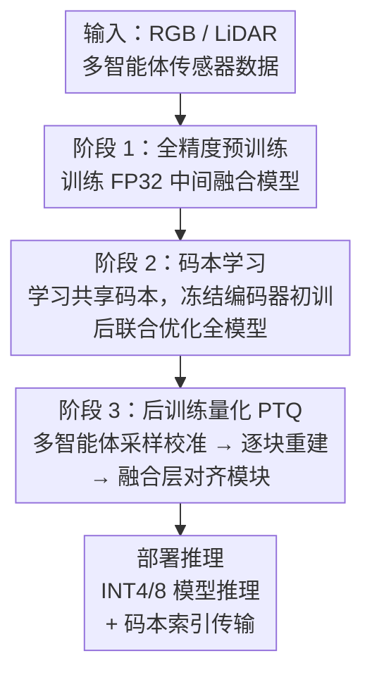

# QuantV2X: A Fully Quantized Multi-Agent System for Cooperative Perception

**会议**: ECCV 2026  
**arXiv**: [2509.03704](https://arxiv.org/abs/2509.03704)  
**代码**: [https://github.com/ucla-mobility/QuantV2X](https://github.com/ucla-mobility/QuantV2X) (有)  
**领域**: 多智能体协作感知 / 模型量化  
**关键词**: V2X协作感知, 模型量化, 多智能体系统, 后训练量化, 码本通信

## 一句话总结
QuantV2X 提出首个全量化多智能体 V2X 协作感知系统，通过端到端量化神经网络模型和通信消息表征，在 INT4/INT8 低比特下保持全精度模型 99.8% 的感知精度，同时将系统端到端延迟降低 3.2 倍，在 V2X-Real 数据集上 mAP30 反超全精度基线 +9.5。

## 研究背景与动机

**领域现状**：V2X 协作感知通过让自动驾驶智能体实时共享传感器信息来突破单车视野盲区和遮挡限制，主流范式是中间融合（intermediate fusion），即各智能体将原始传感器数据编码为 BEV 特征后共享，再由接收方融合做检测。近年来研究主要集中在提升融合精度指标上。

**现有痛点**：几乎所有现有系统都基于全精度（FP32）假设运行，这导致三个系统性瓶颈：（1）全精度模型推理计算量大，车载 GPU 本地推理延迟高；（2）FP32 BEV 特征图通信数据量巨大（典型尺寸下约 8.6 MB/帧），传输延迟严重；（3）全精度模型和特征图占用大量 GPU 显存，限制了可缓存的协作历史信息量。这三者叠加使得全精度系统在真实部署中性能急剧下降，甚至在严格延迟约束下无法运行。

**核心矛盾**：现有研究的精度提升与真实部署的效率需求之间存在根本性脱节——论文追求更高的 AP 指标，却忽略了推理延迟、通信带宽、显存预算这些部署硬约束。V2X-ReaLO 等真实测试平台已证明，全精度系统在线部署时的实际性能远低于离线理想评估结果。

**本文目标**：构建一套从模型侧到通信侧全栈量化的协作感知系统，在满足部署硬约束的前提下，保持甚至超越全精度系统的感知能力。具体分解为三个子问题：（1）如何在低比特量化下保持协作感知精度？（2）如何压缩通信消息以减少传输延迟？（3）量化后的系统能否在真实延迟约束下超越全精度基线？

**切入角度**：作者观察到全精度表征同时主导了计算和通信两端延迟——模型推理慢因为 FP32 乘加开销大，通信慢因为 FP32 特征图体积大。如果将模型权重/激活和传输消息都量化到低比特，就能从两个源头同时削减延迟。

**核心 idea**：用全栈量化（模型侧 PTQ + 通信侧码本量化消息）替代全精度计算和全精度消息传输，通过异构对齐模块补偿量化引入的特征分布偏移，让低比特系统在真实延迟约束下超越全精度基线。

## 方法详解

### 整体框架

QuantV2X 要解决的是一套全精度 V2X 系统的部署效率问题：本地推理慢、通信数据大、显存占用高，三者叠加导致真实场景下延迟爆炸、性能骤降。整体方法是把模型和通信两端都量化到低比特（INT8/INT4），同时引入码本消息表征和对齐模块，确保量化后特征质量不崩塌。系统分三个阶段串行执行。

阶段 1 训练一个标准 FP32 中间融合模型（编码器 + 融合模块 + 检测头），作为后续量化的基座。阶段 2 引入共享码本，将 BEV 特征图量化为码本索引以压缩通信，先冻结编码器训练码本，再联合微调全模型。阶段 3 用少量校准数据（0.5% 训练集）对全模型做后训练量化，逐块重建以最小化量化误差，在融合层额外施加异构对齐损失和空间对齐损失。

### 关键设计

**1. 码本量化消息表征：用码本索引替代 FP32 特征图传输**

通信带宽是 V2X 系统真实部署的首要瓶颈——一帧 FP32 BEV 特征约 8.6 MB，在 27 Mbps 传输速率下仅传输延迟就超过 2.5 秒，完全无法满足实时性要求。本设计用一个所有智能体共享的可学习码本 $\mathcal{D} = \{d_1, d_2, \ldots, d_{n_L}\} \in \mathbb{R}^{C \times n_L}$ 来压缩传输：每个空间位置 $(h,w)$ 的 BEV 特征向量 $F_{[h,w]}$ 通过最近邻查找 $d_\ell$，发送方只传码本索引 $\text{index}_{[h,w]}$，接收方用本地码本重建特征 $\hat{F}_{[h,w]}$。

带宽节省的数学本质是：原始 FP32 传输需 $\log_2(H \times W \times C \times 32 / 8)$ 比特，而码本索引只需 $\log_2(H \times W \times \log_2(n_L) \times n_R / 8)$ 比特。当 $n_L=128$、$n_R=1$ 时，消息体积从 8.6 MB 压缩到 0.03 MB，压缩比约 287 倍，通信延迟从 286.8 ms 降至 12.9 ms。训练分两阶段：先冻结编码器、只优化码本参数以最小化重建误差 $\min_{\Theta_{\mathrm{cb}}} \sum_{(h,w)} \|F_{[h,w]} - \hat{F}_{[h,w]}\|_2^2$；再解冻全模型联合优化，加入检测损失使编码器学会产出更易被码本重建的特征。与 CodeFilling 等先前码本方法相比，本设计的码本训练与后续 PTQ 阶段协同设计，确保量化后的编码器特征仍能被码本高质量重建。

**2. 后训练量化 PTQ：逐块重建校准 + 多智能体采样策略**

将 FP32 模型直接做逐层线性量化会导致严重的精度损失，尤其在多智能体异质场景下各智能体激活分布不一致，量化范围难以标定。本设计的 PTQ 流程以逐块（block-wise）重建为核心：将网络按功能切分为若干块（如主干块、融合块、检测头块），对每块先用 Max-min 策略初始化量化参数 $s, z$，再在初始尺度 $s_0$ 附近线性离散出一组候选 $\{s_t\}_{t=1}^{T}$，选最小化 Frobenius 重建误差的 $s_{\text{opt}} = \arg\min_{s_t} \|X - \hat{X}(s_t)\|_F^2$ 作为最终尺度。为进一步减小舍入误差，引入 AdaRound 为每个权重元素自适应选择舍入方向。

关键是校准数据集的构建方式：作者提出多智能体采样策略，随机采样不同的智能体组合和通信模式来构造校准集。这一步让量化参数见过足够多样的协作模式，避免校准集过于单一导致实际部署时泛化崩塌。只用了 0.5% 的训练数据（5000 步校准），就能将 INT4/8 的精度恢复到 FP32 的 98.8%-99.8%。与 LiDAR-PTQ（只做部分量化）不同，QuantV2X 对编码器、融合模块、检测头全链路量化，且校准开销仅为其 40%（0.38 vs 0.93 GPU 小时）。

**3. 对齐模块：异构对齐损失 + 空间对齐损失修正量化偏移**

多智能体协作场景下，直接对融合模块做常规量化会导致两类特征偏移：（1）不同智能体的传感器模态（LiDAR vs 相机）和编码器架构（PointPillar vs SECOND）不同，量化后激活值分布出现系统性偏差；（2）真实部署中的定位噪声和传输异步引入空间不对齐，量化进一步放大了这种敏感度。

对齐模块在 PTQ 校准阶段作用于融合层，施加两个额外损失。异构对齐损失用 KL 散度对齐全精度和量化模型的融合 BEV 特征分布：$\mathcal{L}_{\text{hetero}} = D_{\text{KL}}(\mathbf{H}_i^{\text{fp}} \| \mathbf{H}_i^{\text{int}})$，推动量化后的融合特征保持与全精度一致的空间激活模式，减少 false positive 检测。空间对齐损失用 L2 距离对齐全精度和量化模型的最终检测框输出：$\mathcal{L}_{\text{spatial}} = \|\mathcal{B}_i^{\text{fp}} - \mathcal{B}_i^{\text{int}}\|_2^2$，直接约束下游检测结果的空间一致性，提升远距离和高 IoU 阈值下的定位精度。

如表 10 所示，仅用 AdaRound 时 50m+ 远距离 AP70 仅 22.0，加上对齐模块后提升至 27.9（+27%），且对定位噪声的鲁棒性显著优于朴素量化——在极端位姿误差下，朴素量化的 AP30 从 75.1 降至不到 40，而 QuantV2X 基本保持全精度水平。

### 一个完整示例

以一个两智能体协作场景（LiDAR-PointPillar 车辆 + LiDAR-SECOND 路侧单元）走一遍推理流程。输入是双方各自一帧 LiDAR 点云（约 6 万点/帧），编码器产出 $H \times W \times C = 200 \times 200 \times 256$ 的 FP32 BEV 特征图，原需传输 200$\times$200$\times$256$\times$4 ≈ 40.96 MB（假设无压缩）。经码本量化后（$n_L=128$, $n_R=1$），每空间位置的 256 维向量被替换为一个 7-bit 索引，仅传 200$\times$200$\times$7/8 ≈ 35 KB 的索引数据加码本（128$\times$256$\times$4 ≈ 128 KB，一次性下发），总传输量约 0.03 MB。接收方用本地码本查表重建 $\hat{F}$，送入 INT8 量化融合模块，经对齐模块校准后的融合特征几乎与 FP32 版本分布一致，检测头输出 3D 框。端到端系统延迟从全精度的 346.3 ms（本地 29.2 + 融合 30.3 + 通信 286.8）降至 40.0 ms（本地 14.2 + 融合 12.9 + 通信 12.9），降幅 88%。关键不在于计算更快，而在于通信延迟从瓶颈变成了无足轻重的开销。

### 损失函数 / 训练策略

系统分三阶段训练，每阶段有独立的优化目标：

- **阶段 1（全精度预训练）**：标准检测损失 $\mathcal{L}_{\text{det}}$ 训练 FP32 中间融合模型，40 epoch，选最优 checkpoint。
- **阶段 2（码本学习）**：
    - 子阶段 1（冻结编码器，20 epoch）：$\min_{\Theta_{\mathrm{cb}}} \sum_{(h,w)} \|F - \hat{F}\|_2^2$，纯重建损失训练码本；
    - 子阶段 2（联合微调，10 epoch）：$\min_{\theta, \mathcal{D}} \mathcal{L}_{\text{det}}(\hat{B}, B^{\text{gt}}) + \lambda_{\text{rec}} \sum_{(h,w)} \|F - \hat{F}\|_2^2$，检测损失 + 重建损失联合优化，使编码器适配码本。
- **阶段 3（PTQ 校准，5000 步）**：对每块用式 (8) 的 Frobenius 重建误差优化量化参数，融合层额外施加 $\mathcal{L}_{\text{hetero}}$ 和 $\mathcal{L}_{\text{spatial}}$。校准集以多智能体随机采样构造，大小仅为训练集的 0.5%。

## 实验关键数据

### 主实验

系统级性能对比（V2X-Real 数据集），将系统延迟纳入评估后，QuantV2X 显著超越所有全精度和通信压缩基线：

| 系统 | 传输特征 / 体积 | mAP30/50 | 与上界的差距 $\Delta$ |
|------|----------------|----------|---------------------|
| Upper-bound（理想无延迟） | - | 53.8/43.5 | - |
| Full-Precision (无压缩) | BEV Feature / 8.6 MB | 43.1/34.8 | -10.7/-8.7 |
| Full-Precision (16x 压缩) | BEV Feature / 0.54 MB | 48.8/38.0 | -5.0/-5.5 |
| Where2Comm | BEV Feature / 0.30 MB | 49.7/39.0 | -4.1/-4.5 |
| CodeFilling | Codebook / 0.03 MB | 51.4/40.8 | -2.4/-2.7 |
| **QuantV2X (Ours)** | Codebook / 0.03 MB | **52.6/42.2** | **-1.2/-1.3** |

系统延迟分解：QuantV2X 的总延迟为 40.0 ms（计算 27.1 ms + 通信 12.9 ms），全精度系统为 346.3 ms（计算 59.5 ms + 通信 286.8 ms），加速 8.7 倍。仅模型量化就使计算延迟从 59.5 ms 降至 27.1 ms（-55%），且因激活位宽减半，通信延迟也连带从 286.8 ms 降至 87.0 ms。码本通信进一步将通信延迟降至 12.9 ms。

跨融合方法泛化性（DAIR-V2X, INT4/8, AP30/50）：

| Bits (W/A) | Pyramid Fusion | F-Cooper | AttFuse | V2X-ViT | Who2com | Where2comm |
|------------|---------------|----------|---------|---------|---------|------------|
| 32/32 | 75.1/68.2 | 64.5/56.0 | 68.8/63.1 | 57.4/49.5 | 63.2/57.3 | 62.1/53.7 |
| 4/8 | 74.2/66.7 | 57.4/49.5 | 66.6/60.8 | 29.9/8.8 | 57.2/52.8 | 60.4/51.5 |

CNN 类融合方法（Pyramid Fusion、Who2com）对量化最鲁棒；V2X-ViT 因 LayerNorm 和窗口注意力量化敏感度高而崩塌；F-Cooper 的 max-pooling 对离群值敏感，量化后损失较大。

### 消融实验

组件消融（DAIR-V2X, INT4/8）：

| 配置 | $L_P$+$C_R$ AP30/50 | $L_P$+$L_S$ AP30/50 | 精度恢复率 |
|------|---------------------|---------------------|-----------|
| Full-Precision | 75.1/68.2 | 80.3/76.1 | 100%/100% |
| Max-min (朴素量化) | 73.2/61.5 | 76.5/60.1 | 97.4%/90.2% |
| + AdaRound | 72.8/65.1 | 80.1/74.2 | 96.9%/95.4% |
| + $\mathcal{L}_{\text{hetero}}$ | 74.0/66.4 | 80.8/75.3 | 98.5%/97.3% |
| + $\mathcal{L}_{\text{spatial}}$ | 74.2/66.7 | 80.2/75.5 | 98.8%/99.8% |

对齐模块是恢复 AP50 的关键——朴素量化下 AP50 从 68.2 跌到 61.5（-6.7），而加上两个对齐损失后恢复到 66.7（仅 -1.5），说明量化主要损害的是高 IoU 精确定位能力，对齐损失直接修正了这一问题。

码本超参消融（V2X-Real）：$n_L=128, n_R=1$ 取得最佳系统精度 mAP30 52.6；增大 $n_R$ 到 2 反而因消息体积增加导致系统精度下降（52.4），印证了通信延迟对最终性能的主导影响。

位姿噪声鲁棒性：在 0-0.6m 位置噪声和 0-1.0 度朝向噪声下，QuantV2X 的 AP30 曲线几乎与 FP32 重合；朴素量化的 AP30 从 75 骤降至约 40。

### 关键发现

- **通信延迟是系统性能的第一瓶颈**：仅压缩通信（CodeFilling，不做模型量化）相比无压缩全精度提升 +8.3 mAP30；仅做模型量化提升 +5.6；两者叠加（QuantV2X）提升 +9.5，说明两端优化有协同效应。延迟分解图 6 清晰地展示了这种叠加关系。
- **对齐模块对远距离检测至关重要**：50m+ AP70 从 AdaRound 的 22.0 提升至 27.9（+27%），说明量化误差在远距离场景下被几何放大，对齐损失通过直接约束下游检测框缓解了这一问题。
- **INT4/8 是实用甜蜜点**：2-bit 权重量化下 AP30 从 75.1 暴跌至 40.8，且 TensorRT 等推理引擎不支持 2-bit，不具备部署可行性。
- **显存约束下的扩展性**：在受限 GPU 显存预算下（模拟车载 Orin/Jetson），QuantV2X 能装入比全精度大 2-3x 的骨干网络，从而在同等硬件上获得更高感知精度，这是纯精度指标无法体现的部署优势。
- **真实 ROS 测试平台验证**：在 V2X-ReaLO 在线评测中（V2V/I2I/V2I 三种模式），QuantV2X 的 mAP 接近甚至超过全精度系统的离线理想值，同时大幅领先全精度系统的在线实测值（V2V mAP 50.1 vs 46.1）。

## 亮点与洞察

- **全栈量化思维**：不同于以往工作孤立地优化模型量化或通信压缩，QuantV2X 认识到模型位宽降低会连带减少通信数据量（激活从 FP32 变 INT8 本身就减半），而码本索引比压缩后的 FP32 特征更紧凑——两端优化有乘数效应。这种"模型侧量化降了通信量，通信侧码本进一步压到极致"的设计思路值得其他分布式感知系统借鉴。
- **对齐模块两个损失分工明确且互补**：$\mathcal{L}_{\text{hetero}}$ 对 BEV 特征空间做分布对齐（解决 false positive 和特征模糊），$\mathcal{L}_{\text{spatial}}$ 对最终检测结果做回归对齐（解决定位精度和远距离退化）——消融实验清楚展示了各自的作用区间。
- **"系统延迟约束下全精度可能不如量化"的反直觉结论**：这是论文最核心的 insight——在真实 V2X 场景下，信息的时效性（timeliness）比精度（precision）更重要。量化虽然牺牲了一点点模型精度，但换来的低延迟让协作信息在时间窗口内有效到达，最终系统性能反超。这为评估协作感知系统提供了新范式。
- **校准数据构造的多智能体采样**：随机采样智能体组合构建校准集，使量化参数见过足够的协作多样性——这个工程细节简单但关键，否则校准出的量化参数在未见过的智能体组合下会严重漂移。

## 局限与展望

- **只验证了 INT8/INT4**：2-bit 量化实验显示精度崩塌（AP30 从 75.1 到 40.8），论文没有探索混合精度策略（如对敏感层保留高精度、非敏感层激进量化），这可能是进一步压缩空间的方向。
- **码本大小固定且全局共享**：$n_L=128$ 的共享码本假设所有场景的 BEV 特征分布相似，在跨域（城市 vs 高速 vs 乡村）场景下可能需要自适应码本或分层码本。
- **仅评估了检测任务**：协作感知的最终目标是规划和控制，量化对下游规划模块的影响尚未评估。检测精度保持不等于规划安全性保持。
- **异构智能体组合的覆盖有限**：实验中的模态组合为 LiDAR+LiDAR 或 LiDAR+Camera，未涉及 Camera-only 或 Radar 等其他常见配置。
- **延迟模型假设 27 Mbps 固定传输速率**：实际 V2X 通信（C-V2X/DSRC）的带宽动态变化，信道拥塞时传输速率可能远低于标称值，量化消息的优势在极端低带宽下会更大，但论文未做敏感性分析。

## 相关工作与启发

- **vs LiDAR-PTQ**：LiDAR-PTQ 只做部分网络量化且针对单车 LiDAR 感知，QuantV2X 做到全链路端到端量化并面向多智能体融合场景，且通过对齐模块解决了多智能体特有的异质性问题。校准效率也更高（0.38 vs 0.93 GPU 小时）。
- **vs CodeFilling**：CodeFilling 也使用码本压缩通信，但仅在 FP32 模型上工作，不涉及模型侧量化。QuantV2X 展示了当模型也被量化时，码本需要联合训练才能保持重建质量——这解释了为何 CodeFilling 的系统级性能（51.4 mAP30）不如 QuantV2X（52.6）。
- **vs Where2comm**：Where2comm 通过空间置信度图选择性传输重要区域来压缩通信，属于"传什么"的稀疏化策略；QuantV2X 的码本方法属于"怎么传"的量化策略。两者可组合使用（先稀疏化再码本量化），是明显的后续工作方向。
- **vs LLM 量化方法（GPTQ/AWQ/SmoothQuant）**：这些方法针对自回归 Transformer 和离散 token 设计，直接用于 V2X 的 3D 稀疏卷积 / BEV 编码器 / 多模态融合会导致严重精度损失，因为 V2X 需要保持空间几何一致性而非语义概率分布。

## 评分

- 新颖性: ⭐⭐⭐⭐ 首次将全栈量化引入 V2X 协作感知，码本通信 + 端到端 PTQ + 对齐模块的组合是新的，但各单项技术（PTQ、VQ、AdaRound）本身并非原创。
- 实验充分度: ⭐⭐⭐⭐⭐ 在两个真实数据集（DAIR-V2X、V2X-Real）+ 一个仿真数据集（OPV2V）+ 真实 ROS 测试平台（V2X-ReaLO）上全面评估，覆盖模型级和系统级两类指标，消融实验、鲁棒性分析、延迟分解、扩展性实验、功耗测量一应俱全。
- 写作质量: ⭐⭐⭐⭐⭐ 问题陈述清晰，motivation 图（Fig.1）直观，方法分三阶段叙述有条理，实验设计针对三个研究问题（RQ1/RQ2/RQ3）一一回答，附录 QA 式讨论量化与 LLM 方法的区别很有帮助。
- 价值: ⭐⭐⭐⭐⭐ 直击 V2X 协作感知从研究到部署的 gap，提供了完整的工程方案和开源代码，为领域树立了"系统效率优先于纯精度"的评估范式，实用价值很高。

<!-- RELATED:START -->

## 相关论文

- [\[ICML 2026\] More Capable, Less Cooperative? When LLMs Fail At Zero-Cost Collaboration](../../ICML2026/multi_agent/more_capable_less_cooperative_when_llms_fail_at_zero-cost_collaboration.md)
- [\[ICML 2026\] EngiAgent: Fully Connected Coordination of LLM Agents for Solving Open-ended Engineering Problems with Feasible Solutions](../../ICML2026/multi_agent/engiagent_fully_connected_coordination_of_llm_agents_for_solving_open-ended_engi.md)
- [\[AAAI 2026\] AgentODRL: A Large Language Model-based Multi-agent System for ODRL Generation](../../AAAI2026/multi_agent/agentodrl_a_large_language_model-based_multi-agent_system_fo.md)
- [\[ACL 2026\] Efficient Multi-Agent System Training with Data Influence-Oriented Tree Search](../../ACL2026/multi_agent/efficient_multi-agent_system_training_with_data_influence-oriented_tree_search.md)
- [\[ICLR 2026\] CoAct-1: Computer-using Multi-agent System with Coding Actions](../../ICLR2026/multi_agent/coact-1_computer-using_multi-agent_system_with_coding_actions.md)

<!-- RELATED:END -->
