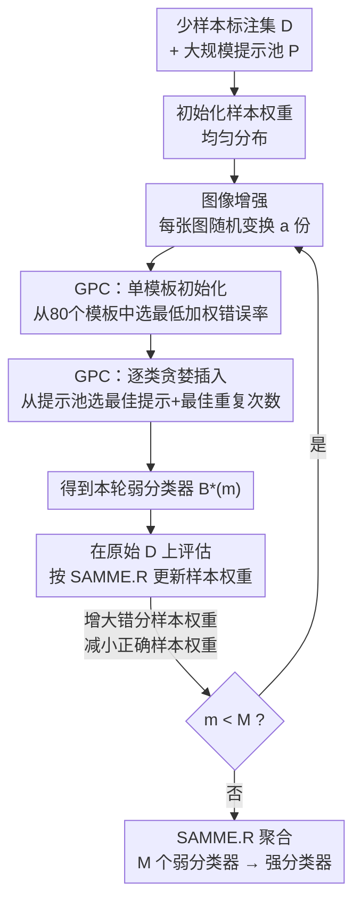

# AdaBoosting Text Prompts for Vision-Language Models

**会议**: ECCV 2026  
**arXiv**: [2607.00684](https://arxiv.org/abs/2607.00684)  
**代码**: [https://sung0503.github.io/TPB](https://sung0503.github.io/TPB)  
**领域**: 多模态VLM  
**关键词**: 文本提示增强, AdaBoost, 少样本分类, 跨模型迁移, 提示集成

## 一句话总结
本文提出 Text Prompt Boosting (TPB)，将 AdaBoost 框架引入 VLM 的文本提示构造中——把每个类别的提示词集合视为一个弱分类器，通过迭代重加权困难样本、逐轮构造新的提示弱分类器并集成为强分类器，从而在少样本场景下实现样本数驱动的性能持续提升（shot scalability），且该自然语言提示集成可在异构 VLM 间直接重嵌入迁移，保持跨模型迁移后的性能增益。

## 研究背景与动机

**领域现状**：预训练 VLM（如 CLIP）进行零样本图像分类时，分类准确率高度依赖文本提示的质量。当前主流做法分为两条路线：一是软提示（soft prompting，如 CoOp），在连续嵌入空间学习可微分的上下文向量，性能好但学到的提示绑定在特定模型的表示空间，无法跨模型迁移且不可读；二是硬提示（hard prompting），用自然语言文本构造提示，通过 LLM 生成候选描述（如 CuPL、DCLIP）或进化搜索（如 ProAPO、LLMbo）来优化少样本性能，保有人类可读性和跨模型可迁移性。

**现有痛点**：现有少样本硬提示方法（如 ProAPO、LLMbo）在构造提示时仅优化一个全局聚合指标（如整体验证准确率），这个指标容易被占多数的"简单样本"主导。一旦某组候选提示正确分类了这些简单样本，验证准确率就会过早饱和，导致方法停止搜素新的语义线索，无法覆盖目标域的更广泛视觉多样性。结果是即使标注样本数增加（从 1-shot 到 16-shot），这些方法的性能提升也非常有限——ProAPO 在 RN50 上从 1-shot 到 16-shot 仅提升 1.7 个百分点。

**核心矛盾**：硬提示方法既需要保留自然语言的跨模型可迁移性，又需要能从有限标注中充分榨取信息以覆盖长尾和困难样本。单一全局优化目标无法区分"被简单样本主导的伪饱和"与"真正覆盖了视觉多样性"的差异，导致增加的标注样本被浪费。

**本文目标**：设计一种硬提示框架，使得：(1) 性能随标注样本数（shot）增加而持续提升；(2) 构造的提示集成以自然语言形式存在，可在异构 VLM 间直接迁移；(3) 迁移后仍保留 shot 驱动的性能增益。

**切入角度**：作者观察到 AdaBoost 的核心机制——迭代重加权错分样本、迫使后续弱分类器聚焦困难样本——恰好可以解决现有硬提示方法"被简单样本主导、无法利用困难样本信号"的问题。如果把每个类别的文本提示集合看成一个弱分类器，那么 AdaBoost 框架可以自然地将多组提示集成为一个强分类器，每一轮都显式聚焦上一轮分错的样本。

**核心 idea**：用 AdaBoost 风格的迭代重加权 + 贪婪提示组合（GPC）代替单次全局优化，将文本提示弱分类器逐轮集成为强分类器，使困难样本持续驱动新提示的发现。

## 方法详解

### 整体框架

TPB 要解决的问题是：给定 K 类少样本标注图像集 D 和一个预训练 VLM，如何构造一组自然语言提示集合，使得分类器在源模型上性能随 shot 数持续提升，且该提示集合可无缝迁移到其他 VLM。整体框架是一个 M 轮 boosting 循环：每轮先用当前样本权重运行 GPC（Greedy Prompt Composition）算法，从大规模提示池中为每个类别选出一组最优提示构成弱分类器；然后用该弱分类器在原始训练集上评估，根据 SAMME.R 规则更新样本权重——分错的样本权重增大、分对的减小；下一轮的 GPC 在新权重下重新选提示，自然聚焦上一轮的困难样本。M 轮结束后，所有弱分类器的输出按 SAMME.R 的分数聚合公式求和，得到强分类器的最终预测。

**框架图说明**：D 和 E 合起来是 GPC 弱学习器的两个阶段，C 中的图像增强是每轮 boosting 前对训练集做的数据增广（防止小样本下快速过拟合）。G 中的权重更新是 AdaBoost 的核心：错分样本权重上升，下一轮 GPC 在评估候选提示时会自然偏好那些能纠正这些错分样本的提示。整个循环跑 M=50 轮（ImageNet 为 30 轮），所有弱分类器的文本提示都以自然语言形式保留，迁移时只需在新 VLM 上重新编码文本嵌入即可。

### 关键设计

**1. GPC 弱学习器：两阶段贪婪提示组合**

GPC 要解决的问题是：给定当前样本权重 w（错分样本权重大，正确样本权重小），如何从大规模提示池 P 中为每个类别选出一组提示 B_k，使加权分类错误率最小。穷举所有类别间的提示组合不可行，因此 GPC 采用两阶段贪婪策略。

第一阶段是单模板初始化。从 CLIP 提供的 80 个标准模板（如 "a photo of a {class}."）中，选一个使加权错误率最低的共享模板 phi*，所有类别的提示银行 B_k 初始化为 [phi*(c_k)]。这样做有两个好处：一是任何分类器至少需要每类一个提示，共享模板以最小开销提供这一点；二是单模板本身已是合理基线，为后续贪婪细化提供稳定起点。

第二阶段是逐类循环贪婪插入。对每一类 k，评估其提示池 P_k 中每个候选提示 t：将 t 暂时加入 B_k 并计算新的加权错误率。核心创新在于"重复插入"机制：由于类别分数是银行内所有提示余弦相似度的未加权平均，往已有较多提示的银行加一条提示可能改变极小。GPC 允许重复选择同一个提示 d 次，效果等价于在无梯度的离散空间中近似连续加权。对每个候选 t，计算使其最优的重复次数 d(t)（通过分析 upside/downside flip 的闭式解），选 delta_epsilon(k, t, d)/d 最小的候选；若该值为负（即降低了加权错误率），则将 t 重复 d 次加入 B_k。循环遍历所有类直到完整一轮遍历不再有任何更新。

为什么这样有效：贪婪插入直接以加权错误率下降为目标函数，天然适配 AdaBoost 的样本权重机制——权重高的困难样本对错误率的贡献更大，GPC 会优先选择能纠正这些样本的提示。重复插入作为一种无参数连续化手段，避免了引入可学习权重带来的过拟合风险（尤其在少样本场景下参数量相对训练信号过大）。

**2. 大规模提示池构造：模板 + LLM 描述 + 拼接**

TPB 要求提示池有足够的表现力以覆盖多样的视觉特征。池的构造分三个来源：(1) CLIP 原版 80 个手工模板，如 "a photo of a {class}."、"a blurry photo of a {class}."，提供基础的类名嵌入方式；(2) 前人工作发布的 LLM 生成描述，包括 DCLIP、CuPL、GPT4Vis 等，例如 "beagles have large, floppy ears that hang down to the sides of their face."，提供丰富的视觉属性描述；(3) 将模板和描述句做拼接（如 "a photo of a beagle, which has large, floppy ears."），进一步扩展离散搜索空间和语义多样性。

消融实验表明，仅用 CuPL 描述不如 CuPL+DCLIP 联合使用的效果好，即使 DCLIP 单独作为零样本方法准确率较低——这说明提示池的多样性比单个来源的质量更重要，多样化的候选空间使 GPC 在不同 boosting 轮次中有更多选择来应对不同类型的困难样本。

**3. Boosting 循环中的图像增广：防止小样本过拟合**

在每轮 GPC 之前，TPB 对少样本训练集做图像增广（随机裁剪 + 水平翻转），增广因子 a=4，即每张原图增广为 4 张变体，样本权重 w_i 复制到每份变体上并重新归一化。不做增广时，AdaBoost 在少样本下会在几轮内迅速拟合训练集达到接近 100% 准确率，之后权重更新不再产生有信息量的错误信号，弱分类器停止改进，测试准确率几乎不变。增广迫使每轮看到的是原图的不同变换版本，保持训练准确率不饱和，每轮都能产生有意义的错分样本用于重加权，使 boosting 在几十轮内持续稳定提升测试准确率。

一个关键消融是固定总曝光预算 M*a=200，变化 (M,a) 的分配——大 a 小 M（如 a=200, M=1）在源模型上准确率最高（74.42%），但迁移到 ViT-L/H 目标模型时准确率下降；小 a 大 M（如 a=4, M=50）在源模型上略低（73.36%），但迁移准确率最高（82.24% / 84.49%）。这说明迁移鲁棒性的核心驱动力是迭代 boosting 重加权过程，而非单纯的数据增广曝光量。

**4. SAMME.R 聚合：多类置信度加权的 AdaBoost 变体**

TPB 采用 SAMME.R（Zhu et al., 2005）作为 boosting 的具体实现，而非原始二分类 AdaBoost 的加权多数投票。SAMME.R 的核心优势是弱分类器输出 K 类的概率估计而非硬预测标签，重加权和聚合都使用这些实值置信度，信息量更大。

具体来说，每轮 GPC 产生的弱分类器 F^(m)(x) 输出 K 维概率向量（通过式 (3) 的 softmax 计算）。样本权重更新公式为 w_i' = w_i * exp(-(K-1)/K * y_i^T * log F^(m)(x_i))，其中 y_i 是 K 维对称编码向量（正确类为 1，其他类为 -1/(K-1)）。最终强分类器的预测不是投票，而是对各轮弱分类器的逐类分数求和后取 argmax：每轮对类别 k 的分数为 s_k^(m)(x) = (K-1) * (log F_k^(m)(x) - (1/K) * sum_j log F_j^(m)(x))，即在类内 log 概率中去均值中心化。

### 损失函数 / 训练策略

TPB 没有传统的反向传播训练。弱学习器 GPC 的目标函数是加权 0-1 错误率的最小化（式 (5)），通过贪婪搜索而非梯度优化来实现。SAMME.R 的权重更新隐含地优化多类指数损失。关键超参：boosting 轮数 M=50（ImageNet 为 30），增广因子 a=4，温度参数 tau=1。推理时所有 prompt 的文本嵌入可预计算，因此 TPB 仅需一次 VLM 前向传播，与单 prompt 方法推理开销相当。

## 实验关键数据

### 主实验

在 OpenAI CLIP RN50 上的 11 个数据集少样本分类结果（表 1）：

| 方法 | 类型 | 1-shot 平均准确率 | 16-shot 平均准确率 | 1-shot→16-shot 提升 |
|------|------|-------------------|-------------------|---------------------|
| CLIP (ZS) | 零样本 | 56.0 | — | — |
| CuPL | 零样本 | 60.4 | — | — |
| CoOp | 软提示 | 59.3 | 73.2 | +13.9 pp |
| PEZ | 梯度硬提示 | 42.4 | 61.1 | +18.7 pp |
| LLMbo | 硬提示 | 61.1 | 61.4 | +0.3 pp |
| ProAPO | 硬提示 | 62.7 | 64.4 | +1.7 pp |
| **TPB** | 硬提示集成 | **63.8** | **70.3** | **+6.5 pp** |

TPB 在 1-shot 已略优于 ProAPO（+1.1 pp），在 16-shot 拉开显著差距（+5.9 pp）。LLMbo 和 ProAPO 从 1-shot 到 16-shot 几乎无提升（+0.3 pp 和 +1.7 pp），验证了其"被简单样本主导、无法从额外标注中获益"的核心痛点；TPB 的 +6.5 pp 提升表明 AdaBoost 重加权机制有效驱动了困难样本的利用。CoOp 在 16-shot 达到最高的 73.2%，但它是模型绑定的软提示，无法跨模型迁移。

在 ViT-B/32 上的跨模型迁移实验（表 2，源模型 ViT-B/32，目标模型 ViT-L 和 ViT-H 组）：

| 目标模型 | 方法 | 1-shot | 16-shot | 1-shot→16-shot 提升 |
|---------|------|--------|---------|---------------------|
| ViT-L 组平均 | ZS-CLIP | 76.76 | — | — |
| | CoOp+EFT | 63.81 | 74.05 | +10.24 pp |
| | ProAPO | 79.59 | 80.01 | +0.42 pp |
| | **TPB** | **79.66** | **82.07** | **+2.41 pp** |
| ViT-H 组平均 | ZS-CLIP | 78.75 | — | — |
| | CoOp+EFT | 62.69 | 72.73 | +10.04 pp |
| | ProAPO | 82.07 | 82.39 | +0.32 pp |
| | **TPB** | **81.73** | **84.24** | **+2.51 pp** |

ProAPO 迁移后 shot 增益几乎为零（ViT-L 上 +0.42 pp，ViT-H 上 +0.32 pp），而 TPB 保持了清晰的 shot 驱动增益（+2.41 pp 和 +2.51 pp）。CoOp+EFT 虽然通过模拟微调实现了迁移，但需要三次模型前向传播，且在某些目标模型（如 DFN）上严重退化（降至 22-40%）。

### 消融实验

| 消融配置 | 源模型 ViT-B/32 | 目标 ViT-L | 目标 ViT-H | 说明 |
|---------|----------------|-----------|-----------|------|
| TPB (M=50, a=4, full pool) | 72.87 | 82.07 | 84.24 | 完整模型 |
| w/o 重复插入 | 72.77 | 81.64 | 83.99 | 去掉重复插入，源模型几乎不变，迁移略降 |
| 仅 CuPL+DCLIP 池 | — | 81.12 | 82.88 | 缩小提示池，性能下降但依然超 ProAPO |
| M=1 (单弱分类器，1-shot) | 61.80 | — | — | 单轮不如 ProAPO (66.27) |
| M=10 (1-shot) | 66.77 | — | — | 10轮已匹配 ProAPO |
| M=50 (1-shot) | 67.39 | — | — | 50轮仅略优于30轮，趋于饱和 |
| M=1/a=200 (固定曝光预算) | 74.42 | 80.77 | 83.12 | 大a小M在源模型最好但迁移差 |
| M=50/a=4 (固定曝光预算) | 73.36 | 82.24 | 84.49 | 小a大M迁移最好 |

### 关键发现

- **Boosting 轮数 vs 增广的权衡**：固定总曝光 M*a=200 下，大 M 小 a（多轮少增广）在源模型上略低但在迁移上显著更好，说明跨模型迁移鲁棒性来自于迭代重加权而非更多增广数据。这是因为多轮 boosting 迫使每轮从不同角度（不同的错分样本分布）发现互补的语义提示，这些互补语义对模型架构不敏感。
- **提示池多样性的重要性**：即使 DCLIP 单独作为零样本方法准确率较低，将其加入提示池仍能提升 TPB 性能，尤其在 shot 数增大时效果更明显——多样化的候选空间为后期 boosting 轮次提供了更多选择来覆盖长尾困难样本。
- **PEZ 梯度硬提示迁移失败的根本原因**：PEZ 学到的文本提示看似是自然语言字符，实则是模型特定的编码——例如为 "pug" 类生成的上下文是 "hey darby pls violets kissestc accept liza any,, adorable gorgeous heart heart :-) life behaved pug"，这些无意义词串在 RN50 表示空间中充当了任务判别特征，但在 ViT-L/14 上准确率从 71.07% 暴跌至 53.02%（零样本基线以下）。这证明提示的可迁移性不来自"它是文本"，而来自"它接近流畅的自然语言"。
- **重复插入的作用**：53% 的被选提示被重复选择超过 1 次。即使完全去掉重复插入，TPB 仍远超 ProAPO（72.77 vs 67.35，16-shot），说明核心收益来自 boosting 框架本身，重复插入是锦上添花的细化手段。
- **TPB 支持双向迁移**：从 ViT-L/14 到 EVA-02 B/16 的反向迁移实验显示，TPB 在源模型上提升 +10.17 pp，迁移后仍保持 +6.98 pp 增益，初步验证了双向迁移能力。

## 亮点与洞察

- **将 AdaBoost 引入文本提示构造是一个优雅的跨范式嫁接**：AdaBoost 的"聚焦困难样本"机制恰好命中硬提示方法"被简单样本主导导致饱和"的核心痛点，两者结合自然而非牵强。每个弱分类器由自然语言提示构成，保留了可解释性——可以看到哪一轮针对什么困难样本引入了什么语义线索。
- **GPC 中的重复插入机制是对连续加权的巧妙离散近似**：在少样本设定下，为每个提示引入可学习权重会导致过拟合（参数过多），而允许同一提示重复插入等价于在离散空间调整其贡献权重，零参数、零梯度、纯搜索，却达到了近似效果。
- **图像增广作为 boosting 的"永动机"**：低 shot 下 AdaBoost 容易快速过拟合，图像增广在这里不是单纯的正则化手段，而是为每轮 boosting 创造新的"错误信号"——同一只狗的不同裁剪角度可能被不同提示描述，这使 boosting 过程有持续的信息增量。
- **曝光预算实验设计精妙**：固定 M*a=200 并 sweep 分配比例，干净地分离了"增广带来的数据量增加"和"boosting 重加权带来的聚焦效应"两个混杂因素，是最有价值的消融之一。
- **PEZ 的失败案例是论文的隐藏亮点**：梯度优化的文本提示退化为一串无意义字符——这给整个领域一个清晰的反面教材：迁移性取决于语义保真度而非介质类型。可迁移到其他需要跨模型泛化的提示优化任务中。

## 局限与展望

- **构建成本在大规模数据集上不可忽略**：GPC 在每轮需要对每个类别的提示池逐一评估候选提示，虽有两阶段贪婪和闭式 flip 分析的加速，但在 ImageNet-1K（1000 类）上的提示池和候选空间仍然很大。作者将 ImageNet 的 M 从 50 降至 30 侧面反映了这一点。
- **AdaBoost 重加权可能对噪声样本过于敏感**：作者在 limitation 中承认，若少样本集中包含标注错误或极端非典型样本，AdaBoost 可能过度聚焦这些样本导致性能退化。缺少对标注噪声的鲁棒性实验。
- **提示池质量是关键但未深度探究的上限**：所有提示来自固定的预构造池，对于细粒度或歧义类别，池中可能缺乏足够精准的语义描述。是否能引入"按需生成"的机制（如根据当前困难样本动态查询 LLM 生成新描述）是一个自然的改进方向。
- **与 CoOp 的对比不够公平**：CoOp 是模型绑定的软提示方法，TPB 在源模型准确率上不及 CoOp（16-shot: 70.3 vs 73.2），作者将其归因于"迁移性的代价"，但未探究是否可以在保持文本形式的前提下通过某种轻量微调缩小这一差距。
- **多模态 backbone 外的泛化性未验证**：所有实验基于 CLIP 风格的双塔 VLM，未在单塔架构（如 ViLT）、生成式 VLM 或其他多模态范式上验证。

## 相关工作与启发

- **vs ProAPO / LLMbo**: 两者都用少量标注图像指导 LLM 生成/搜索提示，但都只优化单一全局准确率指标，导致 shot 增加后性能饱和。TPB 用 AdaBoost 重加权代替单次全局优化，本质区别在于目标函数的粒度——ProAPO 问"这组提示整体好不好"，TPB 问"这组提示对当前还分不对的那些样本好不好"。
- **vs CoOp / PromptSRC (软提示)**：软提示方法在源模型上可以达到更高准确率，但学到的连续向量绑定在特定 VLM 的表示空间，无法跨模型重用。TPB 选择了"牺牲一点源模型性能换取完全迁移性"的路线，这在实际部署中更有价值——可以用小模型构造提示，直接部署到大模型上。
- **vs PEZ (梯度硬提示)**：PEZ 证明了"离散文本 + 梯度优化"这条路在迁移性上是失败的——梯度会把文本推向模型特定的非语义编码。TPB 的成功反过来说明，保持自然语言流畅性对于跨模型泛化至关重要，未来的硬提示方法都应遵循这一约束。
- **vs AdaBoost 经典应用 (Viola-Jones 等)**：传统 AdaBoost 在视觉中的应用多是级联检测器，弱分类器是简单的 Haar 特征决策桩。TPB 将弱分类器换成了 "VLM + 自然语言提示"，展示了 AdaBoost 在深度学习时代的全新用武之地——不是做更快更强的特征，而是做可迁移的语义集成。

## 评分
- 新颖性: ⭐⭐⭐⭐☆ 将经典 AdaBoost 框架引入 VLM 提示构造是跨范式嫁接，想法简洁自然但前人未做；GPC 的重复插入机制有一定巧思。
- 实验充分度: ⭐⭐⭐⭐⭐ 11 个数据集、6 种目标 VLM、1-16 shot、跨模型双向迁移、曝光预算隔离分析、定性可视化，消融覆盖全面且每项都在回答一个明确问题。
- 写作质量: ⭐⭐⭐⭐☆ 方法动机清晰（从 ProAPO 饱和问题直接推导出 AdaBoost 方案），实验逻辑严密，PEZ 的失败案例分析尤其出彩。图 1 的概览图有效传达了核心概念。
- 价值: ⭐⭐⭐⭐☆ 为硬提示方法的 shot scalability 问题提供了简洁有效的解决方案，提示集成的跨模型迁移特性有实际部署价值。提示池是静态的这一限制也为后续工作留下了明确的改进空间。

<!-- RELATED:START -->

## 相关论文

- [\[CVPR 2026\] Mostly Text, Smart Visuals: Asymmetric Text-Visual Pruning for Large Vision-Language Models](../../CVPR2026/multimodal_vlm/mostly_text_smart_visuals_asymmetric_text-visual_pruning_for_large_vision-langua.md)
- [\[ICML 2026\] TGV-KV: Text-Grounded KV Eviction for Vision-Language Models](../../ICML2026/multimodal_vlm/tgv-kv_text-grounded_kv_eviction_for_vision-language_models.md)
- [\[CVPR 2025\] Words or Vision: Do Vision-Language Models Have Blind Faith in Text?](../../CVPR2025/multimodal_vlm/words_or_vision_do_vision-language_models_have_blind_faith_in_text.md)
- [\[CVPR 2026\] TIPSv2: Advancing Vision-Language Pretraining with Enhanced Patch-Text Alignment](../../CVPR2026/multimodal_vlm/tipsv2_patch_text_alignment.md)
- [\[CVPR 2026\] TANGO: Text-Anchored Guided Optimization for Robust Fine-tuning Vision-Language Models under Label Noise](../../CVPR2026/multimodal_vlm/tango_text-anchored_guided_optimization_for_robust_fine-tuning_vision-language_m.md)

<!-- RELATED:END -->
