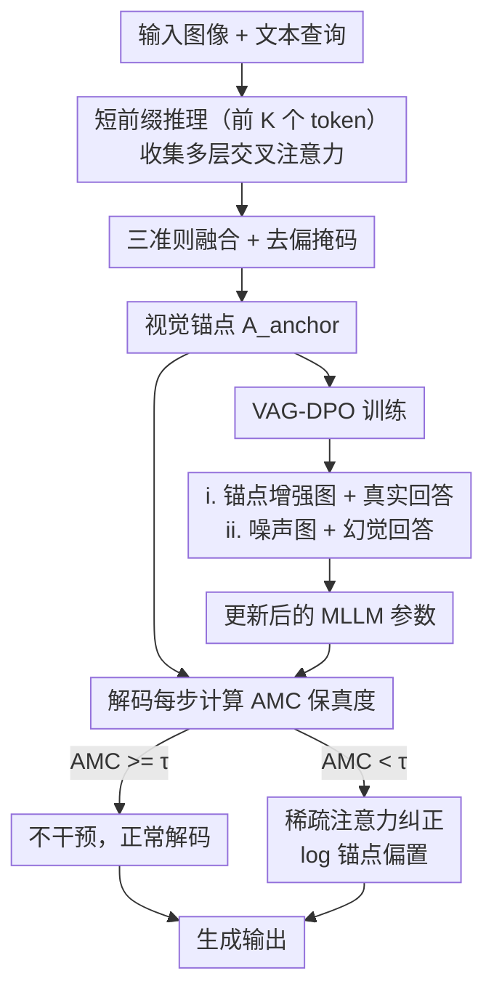

# ADAPT: Attention Dynamics Alignment with Preference Tuning for Faithful MLLMs

**会议**: ECCV 2026  
**arXiv**: [2606.31054](https://arxiv.org/abs/2606.31054)  
**代码**: [https://github.com/yao-ustc/ADAPT](https://github.com/yao-ustc/ADAPT) (有)  
**领域**: 多模态VLM  
**关键词**: MLLM幻觉, 交叉注意力退化, 视觉锚点, 注意力监督解码, 视觉条件偏好优化

## 一句话总结

ADAPT 从早期解码的多层交叉注意力中提纯语义对齐的视觉锚点，在推理时以锚点为参照在线监测注意力保真度、仅检测到显著退化时稀疏纠正，并通过视觉条件对比的偏好优化强化模型对视觉证据的依赖，在多个幻觉基准上降低 40–60% 幻觉率，仅 1.42 倍推理开销。

## 研究背景与动机

多模态大语言模型的幻觉问题是可信部署的首要瓶颈——模型会在生成中描述图像里不存在的物体、赋予错误的属性或创造不存在的空间关系，即使是 GPT-5、Qwen-VL2、LLaVA 等主流模型也未能免疫。现有缓解策略分两条路线：训练时对齐用 RLHF/DPO 及其视觉感知变体（mDPO、RLHF-V、SIMA）微调模型参数以偏好事实性回答；推理时干预通过对比解码（VCD）、惩罚策略（OPERA）、注意力头抑制（SPIN）等手段在输出层修改分布。然而这些方法有一个共同特征：它们都是在 token 输出层面事后调整分布，并不关注幻觉在模型内部产生的过程。模型即使通过了某项幻觉基准，也未必真的"看见"了图像中的对应区域——语言先验和位置偏差交织在一起，使幻觉在复杂场景下反复出现。

本文作者从模型内部信号入手，系统分析了 MLLM 生成过程中 text-to-image 交叉注意力的动态变化，发现了一个高度一致的退化现象：生成过程从早期的"视觉接地阶段"不可逆地滑向"先验主导阶段"，交叉注意力表现出三个可量化的失效模式——注意力从文本相关的视觉证据上漂移变得发散或产生空间偏好、对新生成的 token 不再敏感、视觉 token 上的总注意力值逐层递减。这意味着交叉注意力的退化发生在幻觉 token 被选择之前，如果能在注意力层面实时检测到这种退化的前兆，就有可能在模型真正输出幻觉之前施行干预。

本文的切入角度正是将交叉注意力作为可操作的内部信号来追踪和纠正，而不是等错误生成后再修改输出概率。

**核心 idea：从早期解码的可靠交叉注意力中提纯语义对齐的视觉锚点，在推理中以此锚点为参照在线监测注意力保真度，仅在检测到显著退化时施加稀疏纠正，再通过视觉条件对比的偏好优化让模型学会区分"看见了"和"猜对了"。**

## 方法详解

### 整体框架

ADAPT 围绕同一个视觉锚点设计了三阶段协同框架。先对前 K 个 token 的多层交叉注意力做一轮预处理——用频谱/平滑度/聚焦度三个互补准则加权融合、再扣除模型固有的空间位置偏差——得到一个 query 自适应的稳定视觉锚点。锚点随后被用于两个并行的干预：推理阶段，在每步解码时计算当前注意力与锚点的偏差度（AMC 指标），仅在指标低于阈值时用锚点权重做对数偏置纠正；训练阶段，用锚点增强图和纯噪声图构造视觉条件对比偏好对，让模型在视觉证据充分时自信、在视觉信息缺失时谨慎。三个阶段共享锚点但用法不同——推理是"被动监测"，训练是"主动塑造"。

### 关键设计

**1. 三准则融合去偏的视觉锚点：从多层交叉注意力提炼 query 自适应的可靠参照**

原始交叉注意力作为干预信号有两个缺陷：噪声大，大量与语义无关的高频分量混在其中；存在位置偏差——Transformer 的"注意力沉没"（attention sink）现象使某些空间位置无论图像内容如何都获得过高聚焦。本文的策略是先在前 K=5 个 token（处于可靠的视觉接地阶段）收集 L 层交叉注意力图，用三个互补准则逐层打分。频谱准则用 2D FFT 检测高频能量比，抑制不稳定接地；平滑度准则用总变分正则化惩罚碎片化散布，鼓励关注连续的物体区域；聚焦度准则根据查询语义动态调节目标熵——对"颜色是什么"这种精细问询应聚焦局部区域，对"描述整个场景"这种全局问询需分散注意力。三个准则得分经可学习投影权重融合，权重在 AMBER 验证集上网格搜索确定为 ω_spec=0.4、ω_smooth=0.3、ω_focus=0.3，且最优区域是平缓低谷而非尖峰，证实了三准则是互补而非冗余。融合后还需去除位置偏差：向模型输入纯噪声图像但保留相同问题，统计出"无内容时"的注意力先验 M_bias，将其取倒数构造去偏掩码与融合图逐元素相乘，得到最终的 query 自适应锚点 A_anchor。

**2. 基于 AMC 指标的在线注意力退化监测与条件触发纠正**

解码过程中退化并非均匀发生——模型可能在大部分步骤保持良好的视觉接地，只在少数关键步骤失稳。本文定义了 Anchor-Modulated Concentration（AMC）指标来量化当前注意力与锚点的对齐程度：

$$S_{AMC}(A_t \| A_{anchor}) = \frac{\sum_i (a_{i,t}^2 \cdot w_i^{anchor})}{(\sum_i a_{i,t})^2 + \epsilon}$$

AMC 的核心在于把锚点权重嵌入浓度计算：当注意力集中到锚点本身也高权重的区域时分子大分值高；当注意力扩散到锚点低权重的背景或位置偏置区域时分子小分值低。每步解码计算一次 AMC，仅在低于阈值 τ=0.6 时触发纠正——将锚点权重的对数加性偏置到注意力 logits 上做温和导向。这种条件触发机制避免了每步都做额外计算，使 ADAPT 的推理开销仅 1.42 倍，远低于 OPERA（7.20 倍）和 GF-SCD（3.96 倍）。

**3. 视觉条件对比的偏好优化：让模型学会区分"看见"与"猜对"**

标准 DPO 在文本层面做偏好对比——对同一图像比较不同回答的对错概率，模型学到的是"哪个文本更像标准答案"，但并不区分回答的忠实性源于视觉证据还是语言先验。VAG-DPO 改变了对比的变量：它固定回答的对错标签，但改变所依赖的图像条件。对事实性回答 y_c，chosen 分支看它在锚点增强图上的生成概率；对幻觉性回答 y_r，rejected 分支看它在纯噪声图上的概率。优化目标是让模型在视觉证据充分时自信、在视觉证据缺失时谨慎——VAG-DPO 迫使模型区分"我确实在图像中看见了"和"我只是根据语言先验猜了一个答案"这两种根本不同的状态，从机制上而不是从输出统计上强化了对视觉证据的依赖。

### 损失函数 / 训练策略

VAG-DPO 的损失函数与标准 DPO 形式相同，但核心区别在于两个概率项的条件不同：

$$\mathcal{L}_{\text{VAG-DPO}} = -\mathbb{E}_{\mathcal{D}}\left[\log\sigma\left(\beta\log\frac{P_\theta(y_c|I_{\text{VE}},Q)}{P_{\text{ref}}(y_c|I_{\text{VE}},Q)} - \beta\log\frac{P_\theta(y_r|I_{\text{noise}},Q)}{P_{\text{ref}}(y_r|I_{\text{noise}},Q)}\right)\right]$$

其中 I_VE 是锚点增强图像，I_noise 是纯噪声图像。偏好数据集基于 RLAIF-V 和 RLHF-V 子集构建，仅替换图像条件，保留原有回答对标签。训练超参：β=0.1，学习率 1e-6，1 个 epoch。

## 实验关键数据

### 主实验

| 骨干网络 | 方法 | Obj-Hal Chairs↓ | AMBER Chair↓ | AMBER Hal↓ | MM-Hal Cog↓ | POPE-Adv Prec↑ |
|---------|------|----------------|-------------|-----------|------------|---------------|
| LLaVA-1.5-7B | 基线 | 54.4 | 7.8 | 36.4 | 4.2 | 76.1 |
| | +ADAPT-TF | 35.6 | 4.0 | 16.7 | 1.1 | 90.3 |
| | +ADAPT | **30.7** | **3.8** | **15.2** | **1.2** | **91.9** |
| Qwen2.5-VL-3B | 基线 | 43.2 | 8.0 | 44.4 | 4.3 | 93.2 |
| | +ADAPT | **15.2** | **3.1** | **13.5** | **0.5** | **94.0** |
| Qwen2.5-VL-7B | 基线 | 32.3 | 4.7 | 21.9 | 1.2 | 93.5 |
| | +ADAPT | **16.8** | **3.5** | **13.1** | **0.7** | **93.5** |
| LLaVA-1.5-13B | 基线 | 49.8 | 7.0 | 29.0 | 3.2 | 84.5 |
| | +ADAPT | **34.8** | **4.2** | **17.7** | **1.4** | **90.6** |

### 消融实验

| 配置 | Chair↓ | Hal↓ | Cog↓ | 说明 |
|------|--------|------|------|------|
| LLaVA-7B 基线 | 7.8 | 36.4 | 4.2 | 无任何干预 |
| +Visual Enhance（仅） | 4.7 | 18.7 | 1.8 | 仅锚点增强输入，无解码纠偏 |
| +Attention-Supervised（仅） | 6.3 | 27.8 | 2.9 | 仅推理时注意力监测与纠偏 |
| +VAG-DPO（仅） | 6.0 | 25.0 | 2.1 | 仅训练时视觉条件 DPO |
| +ADAPT（全量） | **3.8** | **15.2** | **1.2** | 三组件协同 |

### 关键发现

- **三组件强协同而非简单叠加**：Visual Enhance 独立效果最好（Chair 7.8→4.7），但全量 ADAPT（3.8）远超任意单组件，说明"好的起点"（锚点）与"实时纠偏"（监测）和"内在偏好塑造"（DPO）之间存在互补而非冗余的叠加效应。
- **推理效率远优于同类方法**：ADAPT 的 1.42 倍开销显著低于 OPERA（7.20 倍）、GF-SCD（3.96 倍）和 VCD（2.03 倍），核心在于条件触发——大部分解码步注意力正常时 AMC 通过检测，不触发任何额外操作。
- **锚点本身即高精度视觉定位特征**：将 ADAPT 锚点用于 RefCOCOg 接地定位，达到 Acc 50.3 / mIoU 57.0，不仅大幅超越 LLaVA-7B（32.6/41.8），甚至超过 CLIP（45.9/51.3），证明三准则融合去偏后的锚点可直接作为高质量的可迁移语义定位特征。
- **通用能力保留更好**：VAG-DPO 在 MME 上的下降（-51.52）比标准 DPO（-68.27）少约 25%，说明"固定回答、改变视觉条件"的对比策略比"固定图像、改变回答"更温和——不会强迫模型在视觉证据较弱时仍对低置信度回答赋予高概率。

## 亮点与洞察

- **从"输出级事后补救"到"内部信号预判"的范式转变**：现有所有主流方法（VCD、OPERA、SPIN）都在 token 概率层面操作，ADAPT 是第一篇系统把交叉注意力退化作为可操作干预信号的工作，这个视角本身就很有启发性——不等到错误输出发生就在内部状态上进行干预。
- **AMC 指标的工程巧思**：将锚点权重嵌入注意力浓度计算，一个公式同时实现了漂移检测和噪声过滤，比单纯看注意力熵或最大注意力值更精准、更抗位置偏差干扰。
- **"固定回答、改变视觉条件"的 DPO 策略**：VAG-DPO 的核心洞察深刻——标准 DPO 教模型说正确的话，但不教模型区分"正确源于看见还是猜对"。把偏好对比的变量从回答对错换成视觉证据强弱，是对齐中第一次直接针对"语言先验 vs 视觉证据"这一根本矛盾做优化。
- **条件触发干预的设计哲学**：ADAPT 不追求每步都主动纠正，而是"只在必要时介入"——既保护了正常解码的流畅性，又把额外计算开销压到最低。

## 局限与展望

- 幻觉的来源不限于注意力退化——推理错误、知识缺失、指令跟随失败等同样产生幻觉。ADAPT 仅针对交叉注意力退化这一种失效模式，对非退化导致的幻觉不保证有效。更完整的框架需要融合多种内部信号的联合监测。
- 前 K 个 token 处于"可靠接地阶段"的假设在极端场景下可能不成立——如果模型在前几个 token 就开始幻觉（如复杂场景下认错主体），提取的锚点本身错误，整个纠正过程可能反向放大幻觉。K 的鲁棒性和锚点质量自动验证机制需进一步研究。
- VAG-DPO 的噪声图像负样本对精确空间关系敏感的任务（表格理解、图表解读、OCR）可能破坏关键结构信息，产生不合理的对比对从而干扰学习。对这些任务需设计更柔和的视觉条件退化策略。

## 相关工作与启发

- **vs VCD（对比解码）**: VCD 通过对比原始分布与扭曲输入分布来抑制语言先验，每步需两路前向，是输出级后处理；ADAPT 在注意力维度做正向锚点引导，且训练阶段从根本上强化视觉依赖。
- **vs OPERA**: OPERA 每步检查候选 token 的注意力模式异常并施加惩罚，7 倍开销极高；ADAPT 的条件触发在效率和幻觉抑制间取得更优平衡。
- **vs SPIN（注意力头抑制）**: SPIN 训练前识别低估图像 token 的注意头做静态抑制，柔性和 query 自适应性不如 ADAPT 的动态按需纠正。
- **vs IBD（图像偏置解码）**: IBD 全盘放大图像偏置注意力来对抗语言先验，ADAPT 通过 AMC 锚点权重做选择性放大，只在必要处介入。

## 评分

- 新颖性: ⭐⭐⭐⭐⭐ 从交叉注意力退化内部信号出发系统分析并设计三阶段干预框架，将内部状态作为可操作信号的视角具有范式启发意义
- 实验充分度: ⭐⭐⭐⭐⭐ 覆盖 4 个基准、4 种骨干网络，包含消融/效率/接地/通用能力四维分析，全面且清晰
- 写作质量: ⭐⭐⭐⭐⭐ 先揭示退化现象再设计干预，方法逐层递进，图表配合到位，逻辑自洽
- 价值: ⭐⭐⭐⭐⭐ 幻觉是 MLLM 首要可信瓶颈，ADAPT 达 SOTA 降幻觉效果且仅 1.42 倍开销，实用性极强

<!-- RELATED:START -->

## 相关论文

- [\[CVPR 2026\] Dynamics-Aware Preference Optimization for Vision-Language Models](../../CVPR2026/multimodal_vlm/dynamics-aware_preference_optimization_for_vision-language_models.md)
- [\[ACL 2025\] OmniAlign-V: Towards Enhanced Alignment of MLLMs with Human Preference](../../ACL2025/multimodal_vlm/omnialign-v_towards_enhanced_alignment_of_mllms_with_human_preference.md)
- [\[ECCV 2026\] Staying VIGILant: Mitigating Visual Laziness via Counterfactual Visual Alignment in MLLMs](staying_vigilant_mitigating_visual_laziness_via_counterfactual_visual_alignment_.md)
- [\[ICCV 2025\] Instruction-Oriented Preference Alignment for Enhancing Multi-Modal Comprehension Capability of MLLMs](../../ICCV2025/multimodal_vlm/instruction-oriented_preference_alignment_for_enhancing_multi-modal_comprehensio.md)
- [\[CVPR 2026\] Multi-speaker Attention Alignment for Multimodal Social Interaction](../../CVPR2026/multimodal_vlm/multi-speaker_attention_alignment_for_multimodal_social_interaction.md)

<!-- RELATED:END -->
