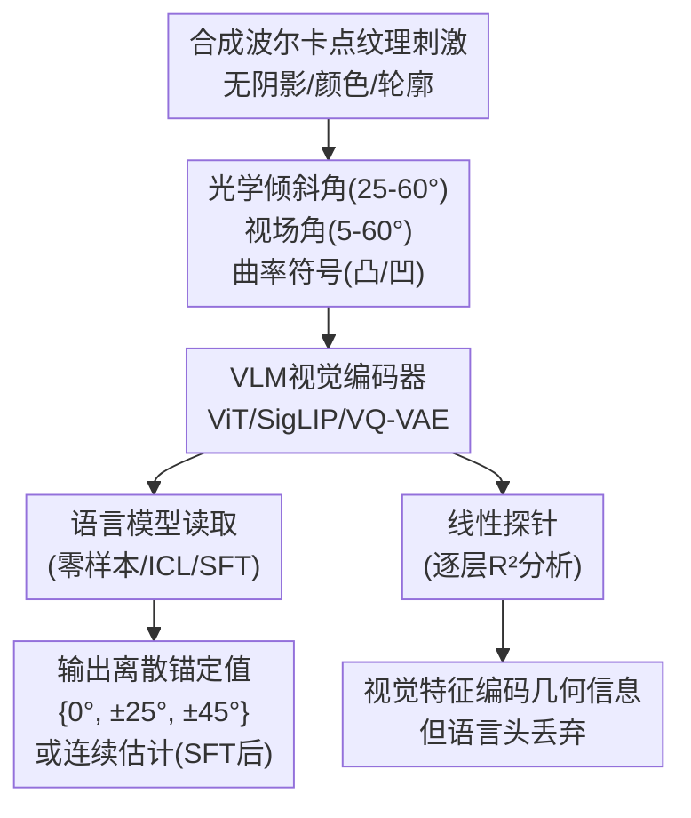

# Anchored, Not Graded: Vision-Language Models Fail at Slant-from-Texture Perception

**会议**: ECCV 2026  
**arXiv**: [2606.06714](https://arxiv.org/abs/2606.06714)  
**代码**: 无  
**领域**: 多模态VLM  
**关键词**: 视觉语言模型、纹理感知、斜面感知、心理物理学、锚定效应  

## 一句话总结
本文系统评估了多种VLM在纹理驱动斜面感知任务上的表现，发现VLM的零样本预测严重锚定在少数离散值（0度、±25度、±45度）上，与人类和自监督CNN展现的连续有偏感知完全不同，且这种锚定来源于语言输出端的读取瓶颈而非视觉编码器的几何信息缺失。

## 研究背景与动机

**领域现状**：人类对纹理驱动的斜面感知（slant-from-texture）已有系统的心理物理学研究基础。Todd等人的经典实验表明，人类能从纹理梯度线索判断三维表面倾斜角度，但判断存在系统性的有偏规律：凸表面看起来比相同物理角度的凹表面更陡（B1）、更大的视场角产生更大的感知倾斜（B2）、小视场角下曲率符号辨别能力下降至随机水平（B3）。这些偏差通常用感知增益（perceptual gain = 判断倾斜/真实倾斜）约为0.56来量化，说明人类系统性地低估了表面倾斜度。

**核心矛盾**：先前研究表明，自监督CNN（以重建为目标的自动编码器）能复现类似人类的纹理斜面感知偏差，而监督CNN（直接回归物理倾斜角度）则能实现无偏表现。这表明类人偏差不是单纯由架构决定的，而是取决于学习目标是否强调纹理统计而非显式几何标签。然而，当模型演进到更大的视觉语言模型（VLM）——结合大规模视觉编码器和语言模型，通过图文对对齐训练——它们在这个经典心理物理任务上的表现如何，尚无人研究。

**本文目标**：评估多种VLM在标准纹理斜面感知任务上的行为，回答两个问题：（1）行为层面——VLM是否表现出与人类和自监督CNN相似的系统性偏差？（2）干预层面——提示工程、上下文学习和监督微调能否诱导出类似人类的连续感知行为？

**切入角度**：作者巧妙地将心理物理学实验范式引入VLM评估——使用与人类/CNN实验完全相同的合成波尔卡点纹理刺激，这些刺激无阴影、无颜色、无轮廓线索，纹理梯度是唯一的三维定向信息。这种高度受控的设置排除了语义内容干扰，直达模型对低层级几何线索的处理能力。

**核心 idea**：VLM在零样本设置下对纹理斜面感知表现出独特的锚定失败模式——输出坍缩到少数离散值（0度、±25度、±45度）而非随刺激参数连续变化，且这种失败不是视觉编码能力不足，而是语言输出端的读取瓶颈（readout bottleneck）。

## 方法详解

### 整体框架

本文构建了一个受心理物理学启发的VLM评估范式。输入是合成波尔卡点纹理表面图像——两张带有相同随机圆点纹理的平板组成二面角，通过纹理梯度传递三维定向信息。输出是模型对表面倾斜角度（-90度至+90度）和曲率符号（凸/凹）的估计。整个流程分为三个环节：刺激生成与不同提示模板的设计、多家族VLM的零样本/上下文学习/微调评估、以及通过线性探针和注意力头消融定位失败根源。刺激参数包括光学倾斜角（25度至60度，10个取值）、视场角（5度至60度，10个取值）、曲率符号（凸/凹）和纹理随机种子（12种抖动），共200个条件×12种纹理抖动构成完整的刺激集。每个刺激-提示对使用低温度（T=0.1）单次查询执行，主实验覆盖6个开源VLM（Gemma3、LLaMA4、LLaVA、Mistral、Moondream、Qwen2.5-VL）以及12个前沿闭源模型（GPT-5.4、Gemini3.1等）的验证。

### 关键设计

**1. 受控心理物理刺激范式：将纹理梯度隔离为唯一线索**

实验使用合成波尔卡点纹理（synthetic dot-textured surfaces），严格遵循Todd等人和Wang等人的刺激生成协议。每个刺激由两张带有相同随机散布圆点的平板组成二面角，仅通过纹理梯度传递三维信息——无着色、无颜色、无轮廓轮廓线索。刺激参数按全因子设计：光学倾斜角σ_cen（10个水平，25度至60度）、视场角FOV（10个水平，5度至60度）、曲率符号（凸/凹），共200个条件。真实物理倾斜角ρ由σ_cen和FOV共同决定：

$$\rho = \sigma_{\text{cen}} - s \cdot \frac{\text{FOV}}{4}, \quad s = -1 (\text{concave}), \; s = +1 (\text{convex})$$

这里的关键区别在于：光学倾斜角σ_cen是实验控制的匹配参数，对应纹理梯度的直接"读出"；而物理倾斜角ρ则融合了曲率和FOV信息，需要理解三维结构的几何推理。因此，预测物理倾斜角比直接读取局部纹理特征要困难得多，这也使本文能区分VLM是"没看到"纹理还是"不会说"。每种纹理随机抖动（12种种子）独立生成新的投影，确保几何推理必须泛化到纹理外观噪声之上。训练集2000张，测试集400张。

**2. 系统性提示工程与锚定现象的揭示**

作者设计了7种提示变体用于倾斜回归任务、3种用于二分类（凸/凹）任务，系统变化任务类型、指令详细程度、语言风格（自然语言vs技术语言）、输出格式（自由文本vs JSON）以及是否提供标注样例进行上下文学习。实验发现，无论提示如何变化，所有VLM的零样本预测都惊人地锚定在一小组离散值上——最常见的是0度、±25度和±45度。许多模型超过50%的预测集中在同一个值上，表明这不是随机噪声而是系统性锚定。三点关键证据支撑锚定而非噪声的解释：（1）错误类型包括指令遵循错误（输出无数字值）、示例锚定（Moondream重复示例中的值）和零度锚定（预测平面但推理文本描述陡峭斜面）；（2）双因素方差分析（ANOVA）显示提示类型对倾斜误差无显著主效应（p=0.157），仅模型类型显著（p=0.000291），提示×模型的交互效应显著（p=0.002）但不存在一致性改善；（3）温度变化和重复查询（10次重复）的方差极低，平均化预测也无改善。上下文学习提供4个带标签示例同样无效，中位误差仍在40度以上，曲率符号准确率接近随机（50%）。

**3. 监督微调（SFT）的部分修复与残余锚定**

对Qwen2.5-VL-3B使用LoRA进行SFT（仅更新q_proj和v_proj），训练损失为带掩码的token loss。SFT显著改善倾斜估计（MAE从45.1度降至15.3度，STD从34.9度降至26.2度，配对t检验p=3.4×10^{-106}），曲率符号识别从随机（50%）提升至86.10%，数值上接近人类表现（86%）但仍低于自监督CNN（96.4%）。然而锚定并未消除：与SFT前相比，锚定发生在更小尺度上，预测值围绕真实值呈带状分布（在真实值附近的水平带），而非连续的线性映射。曲率符号判断的误差模式呈现有趣的类人但更极端的不对称性：凹表面在大FOV下几乎无翻转错误（接近0%），而凸表面在全部光学倾斜范围内保持0.3-0.4的显著错误率。这与人类偏差B1方向一致但更加显著。SFT引入了预测与真实值之间的单调关系，但未能根除语言输出的离散化倾向。

**4. 视觉模块探查精确定位读取瓶颈**

为了定位零样本失败是源于视觉编码不当还是语言读出失败，作者对Qwen2.5-VL-3B的32层视觉编码器进行逐层线性探针（ridge regression, α=1.0）。可视化特征（后投影器层）对物理倾斜的R²=0.826、光学倾斜R²=0.988、FOV R²=0.884、曲率准确率=0.983，证明视觉特征包含丰富的几何信息，与独立ViT-MAE-86M性能相当。逐层分析显示：光学倾斜从第一层就开始接近饱和（R²=0.992），FOV、物理倾斜和曲率在中间层（第17-19层，约56%-59%深度）达到峰值后在后端层下降——FOV从0.920降至0.844、物理倾斜从0.879降至0.769。这一后端下降趋势表明，最后的transformer层为下游语言建模目标重新组织特征，牺牲了部分几何信息的可及性。补丁合并层（patch merger）因为2×2空间合并重新引入局部结构，从中度恢复（FOV=0.884, PS=0.826）。该模式在4个不同架构的VLM（LLaVA-1.5-7B/CLIP-ViT-L/14、PaliGemma-3B/SigLIP-So400M、Chameleon-7B/VQ-VAE）中得到一致性验证。Chameleon尤为突出：作为唯一视觉/文本token在同一transformer中流动的模型，最后一层（layer 31）几何关联几乎归零（OS R²=0.033, FOV R²=0.005, PS R²=0.065, 曲率准确率=0.552随机水平），几何信息在最终层被转换掉了。

进一步的读出测试直接证明了读取瓶颈：将冻结的后投影器视觉token（投影到LM嵌入空间的token）平均池化后接一个线性回归头（仅在2000训练集上拟合），在400测试集上产生连续预测，Qwen2.5-VL-3B的R²=0.696（MAE=21.4度）、LLaVA的R²=0.857、PaliGemma的R²=0.880，且产生342+/400个唯一预测值——即预测本质上是连续的。这说明几何信息在线性读出层面是可解码的，但VLM的语言头在处理这些信息时将其丢弃了。

### 一个完整示例：光学倾斜=40度、FOV=35度、凸表面的刺激

生成一张光学倾斜40度、FOV=35度、凸表面、特定纹理种子的合成图像。图像输入Qwen2.5-VL-3B（零样本），使用自然语言提示"分析波尔卡点变形来估算表面倾斜角度"。模型输出"(25, 0.7); dots are stretched near the fold center"，预测值为25度（真实值：ρ = 40 - (+1) × 35/4 = 31.25度）。虽然预测方向正确（凸表面），但模型输出落在了±25度的锚定点上，而非对31.25度的连续估计。若使用不同的纹理抖动（相同几何条件、不同随机种子），模型仍稳定输出25度——说明预测由锚定驱动而非纹理外观变化驱动。经过SFT后，同一模型对类似刺激的预测从25度移至32度，更接近真实值31.25度，但仍然形成围绕真实值的带状分布，而非在每张刺激上独立连续变化。

## 实验关键数据

### 主实验

| 模型 | 倾斜MAE(度) | 曲率准确率 | 主导锚定值 | 模式占比 |
|------|------------|-----------|------------|---------|
| Qwen2.5-VL-3B | ~45 | ~50%(随机) | 0°, ±25°, ±45° | >50% |
| LLaVA-1.5-7B | ~45 | ~50% | 0°, ±25°, ±45° | >50% |
| PaliGemma-3B | ~45 | ~50% | 0°, ±25°, ±45° | >50% |
| Gemma3 (各种尺寸) | ~45 | ~50% | 0°, ±25°, ±45° | >50% |
| Qwen2.5-VL-3B (SFT后) | **15.3** | **86.1%** | 细粒度锚定(带状分布) | 下降但仍显著 |
| 人类(Todd et al.) | 有偏(增益~0.56) | ~86% | 连续有偏 | — |
| 自监督CNN(Wang et al.) | 有偏(类人) | **96.4%** | 连续有偏 | — |

> 注：零样本模型间差异不显著（提示类型双因素ANOVA p=0.157），所有VLM同样锚定。额外12个闭源模型（GPT-5.4、Gemini3.1、Claude Opus等）也呈现相同锚定模式，R²与物理倾斜的相关系数≤0.16（均值0.04），曲率准确率在0.46-0.58之间（随机水平）。

### 消融实验

| 配置 | 关键指标(倾斜MAE/曲率准确率) | 说明 |
|------|---------------------------|------|
| Qwen2.5-VL-3B 零样本 | 45.1° / 50% | 基线：离散锚定 |
| + 自然语言提示变体 | ~45° / ~50% | 7种提示无显著改善 |
| + 技术语言提示 | ~45° / ~50% | 专业术语无帮助 |
| + JSON输出格式 | ~45° / ~50% | 格式约束不影响锚定 |
| + 上下文学习(4例) | ~45° / ~50% | 带标签样例不改善 |
| + SFT 10轮(LoRA) | 15.3° / 86.1% | MAE大幅下降，曲率准确率接近人类 |
| + SFT 100轮(LoRA) | ~15° / ~86% | 进一步改善有限，残余锚定仍在 |
| + 逐注意力头消融 | ~45° / ~50% | 504个单头消融均未消除锚定 |
| 视觉token线性探针 | R²=0.696(连续预测) | 证明几何信息在语言输入端存在 |

### 关键发现
- **视觉编码器≠瓶颈**：线性探针表明VLM的视觉编码器在深层（17-19层）编码了丰富的几何信息（物理倾斜R²≈0.88），但最终层为语言目标重新组织了特征空间，丢失了部分几何可读性——这是"知道但说不出来"的神经基础。
- **SFT引入单调性但未消除离散化**：SFT使预测与真实值之间建立了单调关系，但输出仍呈离散带状分布而非连续变化，说明语言模型天生倾向于将连续值映射到少量"强势"数字token上——这与LLM解码中的成数偏好（round-number bias）高度一致。
- **读出头测试是最强证据**：仅用一个线性回归层从后投影器视觉token中直接预测物理倾斜，即可实现连续输出（R²=0.696-0.880，400刺激中342+个唯一值），直接证明VLM「知道」但不「会说」——几何信息已存在于语言模型输入端的视觉token中，但语言模型未能将其翻译为连续数值估计。
- **跨模型架构的复制性**：从Qwen的Native ViT到CLIP-ViT-L/14、SigLIP-So400M、VQ-VAE，四个异构视觉编码器的逐层探查模式高度一致——几何信息在中间层达到峰值后在后端层下降。Chameleon（视觉/文本token共享单一transformer）的最后一层甚至将接近完美的几何编码（R²>0.9）降至接近零，是读取瓶颈最极端的例证。

## 亮点与洞察
- **"知道但说不出来"的精确诊断**：本文最精彩的洞见不仅在于发现VLM表现差，更在于通过逐层探针+读出头测试精确定位了失败节点——不是视觉编码器能力不足，而是语言模型的"读出"环节丢失了连续几何信息。这种编码-读出解离（encoding-readout dissociation）为理解VLM的多模态信息流提供了关键证据。
- **心理物理学实验范式的巧妙迁移**：将经典的人类视觉实验（斜面纹理感知）严格复刻到VLM评估中，利用其高度受控、无语义干扰的特点，揭示了标准高层面VLM基准测试（VQA/COCO captioning等）无法暴露的低层级视觉能力缺口。这种"降维打击"式的评估策略值得在其他感知任务中推广。
- **对交叉熵损失瓶颈的推测性但深刻的分析**：作者推测VLM的语言模型使用交叉熵在离散token序列上训练，一个连续值（如42.5度）必须编码为"4-2-.-5"的token序列——模型没有内在动力去保证文本输出与视觉token中的连续几何变量共变。这一观察为"语言模型的离散本性"提供了具体案例，暗示需要新的训练目标或架构设计来弥合连续感知与离散表达之间的鸿沟。
- **SFT部分修复的行为学意义**：SFT后曲率符号判断错误的方向不对称性（凸表面更易被误判为凹、凹表面在大FOV下不出错）与人类偏差B1方向一致但更显著，表明VLM在某种程度上学习了与人类相似的启发式处理策略，但表达能力受限导致无法平滑表达。

## 局限与展望
- **仅测试了波尔卡点纹理**：实验仅在合成波尔卡点纹理上进行，未扩展到其他纹理类型（规则纹理、自然纹理）。虽然波尔卡点纹理在心理物理学中有充分基础，但VLM在自然图像纹理上的表现可能有所不同——考虑到VLM训练数据以自然照片为主，自然纹理可能更"在分布内"。
- **SFT仅实验了一个模型**：微调实验仅在Qwen2.5-VL-3B上执行，未验证其他架构（如LLaVA、PaliGemma）SFT是否同样有效或更有效。不同VLM的SFT行为差异可能揭示更丰富的机制。
- **未来工作方向**：（1）在更多纹理类型上验证锚定效应；（2）向刺激中添加额外几何线索（如阴影、轮廓）以测试线索充足条件下VLM能否恢复连续预测；（3）探索替代架构设计——如将视觉token的连续信息通过连续输出头（而非离散token序列）直接回归，或设计鼓励连续表达的辅助损失函数；（4）更精细地追踪几何信息在语言模型隐藏状态中的变换流程——从视觉token经transformer层到输出embedding的完整信息流映射；（5）将诊断范式扩展到其他低层级感知任务（透视、深度、形状从阴影等）。

## 相关工作与启发
- **vs Wang et al. (2023, 自监督CNN的斜面感知)**：Wang等人发现自监督CNN复现了类人的有偏感知，监督CNN则无偏。本文在其基础上将研究扩展到VLM，发现VLM展现的是更根本性的失败——不是有偏而是锚定。三者的对比构成了有意思的频谱：自监督CNN=类人有偏但连续，监督CNN=无偏但连续，VLM=锚定离散且无关刺激参数。这表明学习目标（重建vs分类vs语言建模）决定了感知表征的性质。
- **vs Rudman et al. (2026, VLM失效机制)**：Rudman等人发现特定注意力头会导致VLM复制提示中的数值（prompt copying），并证明消融这些头可消除复制。本文在更大规模上（两个模型共1288个消融实验）测试了类似假设，但发现锚定不是单头可解释的现象——没有单头消融能消除锚定，说明连续几何量感知中的锚定是一个分布式属性，与离散的分类任务有本质不同。
- **vs Tseng et al. / Lou et al. (LLM中的数值锚定)**：已有研究显示LLM在数值推理任务中存在锚定效应和成数偏好。本文将这些发现延伸到VLM的感知任务中，展示了一种更底层的锚定——不依赖于推理上下文，而是直接由纹理刺激驱动的感知估计也表现出同样的离散化倾向，暗示这可能是一个更根本的语言模型属性。
- **vs 标准VLM视觉基准**：本文与VLM在VQA、captioning、场景理解等高层面任务上的成功形成鲜明对比，揭示了当前基准测试中缺失的"低层级感知梯度"，提示未来评估应包含更多心理物理学意义上的感知任务。

## 评分
- 新颖性: ⭐⭐⭐⭐⭐ [将经典心理物理范式系统引入VLM评估，发现独特的锚定失败模式并通过探针精确定位读取瓶颈，思路清晰、方法扎实，填补了VLM低层级几何感知评估的空白]
- 实验充分度: ⭐⭐⭐⭐⭐ [覆盖6个开源+12个闭源VLM、多种提示变体、SFT干预、逐层线性探针、注意力头消融（1288个）、跨4种异构视觉编码器的泛化验证，实验设计全面且严谨]
- 写作质量: ⭐⭐⭐⭐⭐ [逻辑链条清晰流畅：从现象发现（锚定）→干预（提示/ICL/SFT无效或部分有效）→定位（探针证明视觉编码正常）→机制（读取瓶颈+注意力头消融负结果），各模块环环相扣；图表配合精准，ANOVA和探针结果呈现清晰]
- 价值: ⭐⭐⭐⭐⭐ [为VLM的安全落地（人类-AI协作中感知一致性要求）提供了关键诊断工具，揭示了当前语言建模范式在连续感知表达上的根本性局限，对未来的VLM架构设计和评估方法有重要指导意义]

<!-- RELATED:START -->

## 相关论文

- [\[CVPR 2026\] Same or Not? Enhancing Visual Perception in Vision-Language Models](../../CVPR2026/multimodal_vlm/same_or_not_enhancing_visual_perception_in_vision-language_models.md)
- [\[CVPR 2025\] Vision-Language Models Do Not Understand Negation](../../CVPR2025/multimodal_vlm/vision-language_models_do_not_understand_negation.md)
- [\[ECCV 2026\] Skin-R1: Clinical Knowledge-Guided Dermatological Diagnosis Using Vision-Language Models](skin-r1_clinical_knowledge-guided_dermatological_diagnosis_using_vision-language.md)
- [\[CVPR 2026\] Bias Is a Subspace, Not a Coordinate: A Geometric Rethinking of Post-hoc Debiasing in Vision-Language Models](../../CVPR2026/multimodal_vlm/bias_is_a_subspace_not_a_coordinate_a_geometric_rethinking_of_post-hoc_debiasing.md)
- [\[ECCV 2026\] AdaBoosting Text Prompts for Vision-Language Models](adaboosting_text_prompts_for_vision-language_models.md)

<!-- RELATED:END -->
