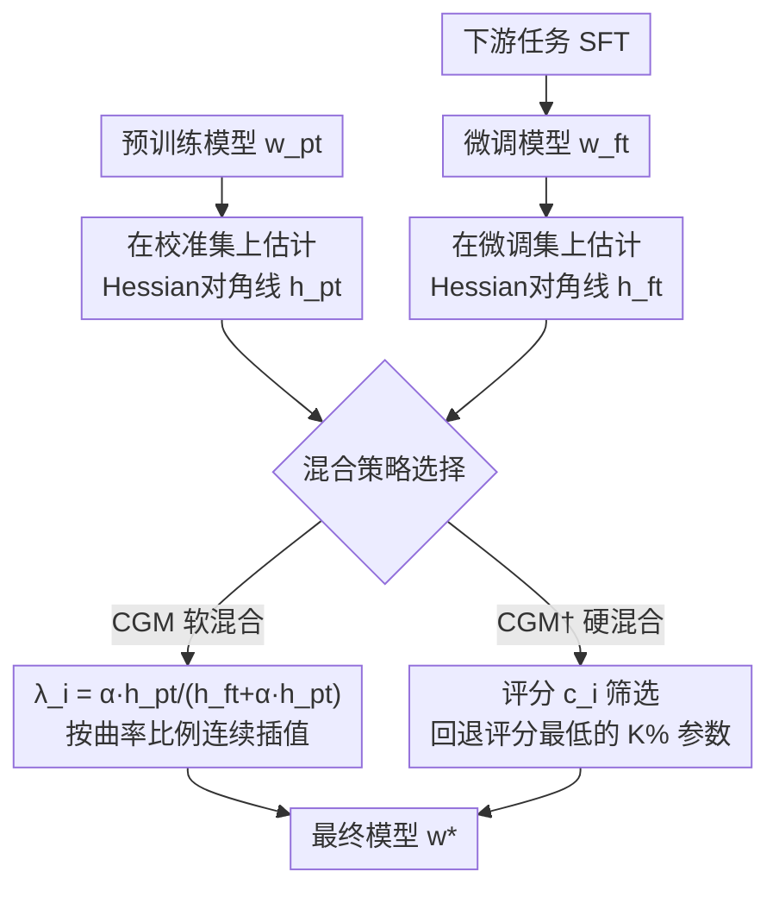

# Curvature-Guided Mixing for MLLM Adaptation

**会议**: ECCV2026  
**arXiv**: [2606.24963](https://arxiv.org/abs/2606.24963)  
**代码**: [https://github.com/zzsyjl/CGM-ECCV-2026](https://github.com/zzsyjl/CGM-ECCV-2026)  
**领域**: 多模态VLM  
**关键词**: 灾难性遗忘，模型合并，曲率引导，Hessian近似，MLLM微调

## 一句话总结

提出Curvature-Guided Mixing（CGM）框架，通过对预训练和微调两个损失曲面进行二阶泰勒展开与Hessian对角近似，推导出基于相对曲率的闭式软混合比（CGM），并进一步设计基于曲率感知评分的稀疏硬混合策略（CGM†），在MLLM微调中实现下游适应与通用知识保留的最优平衡。

## 研究背景与动机

多模态大语言模型（MLLM）凭借海量图文数据的预训练，在视觉问答、图像描述、视觉推理等一系列通用任务上展现了强大的零样本能力。然而，当需要将MLLM适配到某个特定的下游任务时，标准SFT微调几乎必然带来灾难性遗忘——模型在通用benchmark上的性能大幅下滑，新学习的技能以牺牲已有基础能力为代价。这是MLLM微调中最核心的困境之一。

近年来的缓解思路有三条：正则化方法在微调损失中加入惩罚项约束重要参数的变化，但超参数平衡棘手；参数高效微调（LoRA、Adapter等）通过冻结大部分参数只训练少量新增参数来减少干扰，但面对跨领域迁移时容量往往不够；模型合并则试图在微调完成后将预训练权重和微调权重合并成一个兼顾两者的统一模型。然而现有合并方法存在根本缺陷：Spider用启发式的梯度加幅值评分来选择参数，缺乏理论支撑；Model Tailor虽然用到了Hessian矩阵，但它的目标只优化下游性能，完全不考虑通用知识保存。这两条路各走极端——要么选择无原则，要么只保新能力不保旧知识。

本文的核心洞察是：预训练和微调两个损失曲面的几何结构往往是各向异性的——同一个参数方向对两个任务的重要性可能截然不同。如果能够在每个参数上根据它对两个任务的相对重要性（即曲率大小）来决定应该更靠近预训练值还是微调值，就能实现各自在最擅长的方向上主导最终模型。**核心idea：将模型合并形式化为同时在预训练和微调两个局部极小点附近最小化损失增量的联合优化问题，利用Hessian矩阵的二阶近似刻画损失曲面的局部曲率，推导出基于相对曲率的闭式软混合比（CGM），并进一步将问题转化为稀疏参数选择以得到更鲁棒的硬混合策略（CGM†）——两者均在MLLM上验证了在保持下游任务精度的同时几乎无损地保留通用知识的能力。**

## 方法详解

### 整体框架

CGM框架的核心思想是：给定预训练权重 w_pt 和微调权重 w_ft，对每个参数决定它应该更接近哪个端点，使得最终模型 w* 在预训练任务和微调任务上的损失增量之和最小。框架包含三个关键步骤：第一步，在预训练模型上用少量校准样本估计Hessian矩阵的对角线 h_pt（反映预训练任务对各参数的敏感度）；第二步，在下游任务上做标准SFT得到 w_ft，同时在微调模型上估计 h_ft（反映微调任务对各参数的敏感度）；第三步，选择软混合（CGM）或硬混合（CGM†）策略生成最终权重。

### 关键设计

**1. 联合优化目标与损失曲面二阶近似**

合并问题的核心难点在于：我们没有预训练数据，只知道微调集；要同时保住通用知识，就必须利用预训练权重本身携带的信息。CGM的开创之处在于把这个问题形式化为一个可解的优化问题——寻找权重 w 同时最小化它对两个损失曲面的偏离。假设 w_pt 和 w_ft 分别是预训练和微调任务的局部极小点（梯度为零），那么两个损失函数在各自极小点附近的增量可以用二阶泰勒展开近似，一阶梯度和高阶项均可忽略。再取Hessian矩阵的对角线近似（将复杂度从 O(d²) 降至 O(d) 且将问题解耦为每个参数独立），联合目标就简化为两项二次惩罚之和。每个参数 i 只需优化自己的混合比 λ_i，目标函数是 λ_i 的简单二次函数，为后面的闭式解奠定了基础。

**2. CGM软混合：基于相对曲率的闭式最优混合比**

将 w_i 参数化为 w_ft_i + λ_i·(w_pt_i - w_ft_i)，代入联合目标并对 λ_i 求导，得到闭式最优解：

$$
\lambda_i^* = \frac{\alpha\,h^{\text{pt}}_i}{h^{\text{ft}}_i + \alpha\,h^{\text{pt}}_i}
$$

这一结果的物理含义非常直观：当某个参数在预训练损失曲面上的曲率 h_pt_i 很大时（意味着该参数对预训练任务非常关键），λ_i 趋近于 1，最终权重更接近预训练值；反之，当它在微调曲面上的曲率 h_ft_i 很大时，λ_i 趋近于 0，更接近微调值。α 是一个平衡系数，控制对两个任务的相对重视程度。整个过程是软混合——每个参数都在微调值和预训练值之间连续插值，插值比例完全由相对曲率决定，没有任何启发式设计。值得注意的是，如果曲率用Fisher信息矩阵估计，该形式与Fisher Merging相同，但CGM的推导出发点（联合损失最小化）与Fisher Merging（Laplace后验近似）完全不同，且CGM不限于FIM——使用Hutchinson估计的真实Hessian对角线可取得更好的效果。

**3. CGM†硬混合：基于曲率感知评分的稀疏回退**

软混合虽然闭式优雅，但它修改了每一个参数——这种稠密更新可能不必要地扰动大量本不需要改动的参数。CGM†采取了截然不同的思路：不从预训练值向微调值混合，而是从微调值出发，选择性地将一部分参数回退到预训练值。对每个参数做出二值选择（保留微调值或回退到预训练值），代入联合目标后，问题的复杂度被消解为一个简单的排序问题。每个参数得到一个评分 c_i = (h_ft_i - α·h_pt_i) · Δ²_i（Δ_i 是 w_pt_i 和 w_ft_i 的差值），它综合了三种信息：微调曲率（越小越倾向回退）、预训练曲率（越大越倾向回退）以及参数改变幅度（越大越应该慎重决定）。评分最低的参数——即对微调任务不敏感但对预训练任务非常关键的参数——被选中回退到预训练值，其余大量参数保留微调成果。实验表明仅回退 10% 的参数量就足以恢复几乎所有通用知识，而且选中的参数在注意力投影矩阵上呈现清晰的竖条纹列模式（vertical bands），说明评分找到了有语义结构的参数群组，而非随机杂乱的分布。

### 损失函数 / 训练策略

CGM本身没有训练过程——它是在微调完成后对权重进行后处理。Hessian对角线的估计通过empirical Fisher Information Matrix（简称FIM，在局部极小点处等价于平方梯度的期望）实现：对于预训练模型，在8个样本/任务的校准集上计算平方梯度作为 h_pt；对于微调模型，在微调数据集上积累平方梯度作为 h_ft。实验中对LLaVA-1.5-7B微调最后12层语言模型和视觉投影器（1 epoch，lr 1e-4，batch size 64），对Qwen-2.5VL-3B微调最后6层和视觉投影器（3 epochs，lr 1e-5）。FIM估计带来的额外开销约7.9%（throughput从3.81降至3.51 samples/s），几乎可忽略。

## 实验关键数据

### 主实验

以LLaVA-1.5-7B在OKVQA上的微调为例（核心对比，Hscore为通用和目标任务的调和平均）：

| 方法 | Pre-Avg（通用） | OKVQA（目标） | Hscore | Avg |
|------|:-:|:-:|:-:|:-:|
| Pre-trained | 66.1 | 52.8 | 58.7 | 64.6 |
| Fine-tuned | 50.4 | 58.0 | 53.9 | 51.2 |
| Tailor | 61.6 | 57.6 | 59.6 | 61.2 |
| DARE | 51.0 | 51.2 | 51.1 | 51.0 |
| Grafting | 62.0 | 57.1 | 59.5 | 61.5 |
| Magnitude | 54.0 | 54.5 | 54.9 | 55.1 |
| Wanda | 52.2 | 53.9 | 53.1 | 52.4 |
| **CGM (ours)** | **64.2** | **59.8** | **61.9** | **63.7** |
| **CGM† (ours)** | **65.7** | **60.2** | **62.8** | **65.0** |

CGM†在通用知识保留（Pre-Avg 65.7 vs 微调的50.4）和目标分数（60.2 vs 微调的58.0）上同时超越所有基线，在8个通用benchmark上恢复了接近预训练模型（66.1）的通用水平。在Flickr30k和Qwen-2.5VL上的实验趋势一致——CGM系列取得了最佳综合指标。

### 消融实验

在CGM†的评分函数 c_i = (h_ft - α·h_pt)·Δ² 上逐项消融（LLaVA-OKVQA）：

| 消融变体 | 评分依据 | Hscore | Avg |
|---------|---------|:-:|:-:|
| 仅参数幅值 | Δ² | 54.0 | 54.0 |
| 微调曲率+幅值 | h_ft·Δ² | 53.1 | 52.4 |
| 预训练曲率+幅值 | -α·h_pt·Δ² | 61.7 | 65.1 |
| **完整CGM†** | **(h_ft - α·h_pt)·Δ²** | **62.8** | **65.0** |

仅用Δ²或加上微调曲率都会导致严重遗忘（Hscore仅54左右）；加入预训练曲率后Hscore跃升至61.7；完整形式达到最佳62.8。两项曲率信息缺一不可。

### 关键发现

- **稀疏就足够**：即使只回退10%的参数（K=0.1），CGM†已经能恢复几乎全部通用知识，Pre-Avg对K在10%~90%范围内几乎不敏感。这意味着灾难性遗忘的根源可能只涉及少量关键参数。
- **α的鲁棒性**：平衡系数α在0.1~0.15时效果最优，但Pre-Avg在α广泛变化范围内几乎不变——联合目标本身已牢牢锁住了基础能力。
- **结构化选择**：CGM†在注意力投影层上选择的参数呈现清晰的竖条纹列模式，而非Magnitude基线的杂乱散点——评分找到了以输入维度为单位的结构化参数群组，具有语义合理性。
- **LaTeX-OCR上的表现**：Qwen-2.5VL在LaTeX-OCR任务上，CGM的Hscore达到71.0，比微调模型的66.5高出4.5个点，同时目标分数几乎持平——这是少见的在保持新能力的同时几乎不丢失通用知识的case。

## 亮点与洞察

- **从损失曲面几何到闭式最优解**：将看似经验性的模型合并问题转化为可解析求解的联合优化问题，推导出的λ公式具有极好的可解释性——曲率越大越偏向对应模型，是"每个参数在它最擅长的任务上主导"这一直觉的最优数学实现。
- **双模式统一框架**：同一理论框架下自然衍生出两种互补策略——软混合全参数连续插值，硬混合稀疏二值选择（等价于对更新量加L₀约束）。实验证实硬混合通常更优，验证了"最小程度修改"的假设。
- **与Fisher Merging的关系**：当曲率用FIM估计时CGM退化为Fisher Merging的形式，但CGM的推导框架更一般，能用真实Hessian对角线（Hutchinson估计）取得更好效果，且不限于FIM。
- **消融设计精巧**：四种消融变体完全对应评分公式的逐项拆分，每个组分的贡献清晰可辨，是论文消融设计的范本。

## 局限与展望

- **对角Hessian近似引入独立性假设**：假设参数之间不相关，忽略了交互效应。块对角或Kronecker近似可能进一步提升效果，但计算成本会增加。
- **需要额外的FIM估计步骤**：虽然开销仅7.9%，但修改了标准微调流程（需要积累梯度平方）；无法直接对已有的微调检查点做后处理。
- **Hessian估计质量依赖校准集**：预训练Hessian只用8个样本/任务，校准集分布不匹配时可能导致估计偏差。
- **未探索多任务连续微调场景**：当前只处理单步微调，在持续学习多个任务时的表现需要进一步验证。

## 相关工作与启发

- **vs Spider**：Spider用启发式评分（梯度+幅值）选择保留参数，效果对评分形式敏感且缺乏理论支撑；CGM从联合优化出发自然推导闭式解，兼具理论保证和更优实践效果。
- **vs Model Tailor**：Model Tailor也用Hessian但只优化下游损失，实质是找到对下游最关键的一批参数做保护；CGM同时考虑两端曲率，目标是寻找平衡而非单方面保护。
- **vs Fisher Merging**：CGM在FIM估计下形式上与Fisher Merging相同，但推导出发点不同且CGM更一般化，支持FIM以外的Hessian估计方案并取得更好效果。
- **vs LoRA等PEFT方法**：PEFT通过减少可训练参数来减轻遗忘，但面对跨领域迁移时容量有限；CGM作为微调后的后处理方法可与其正交结合。

## 评分
- 新颖性: ⭐⭐⭐⭐⭐ 首次将模型合并形式化为联合损失最小化并推导闭式曲率引导解，软硬两种混合策略框架统一且推导严谨
- 实验充分度: ⭐⭐⭐⭐⭐ 在LLaVA-1.5和Qwen-2.5VL两个架构、多个下游任务上做了全面的主实验、消融、超参分析和选择可视化，消融设计尤为清晰
- 写作质量: ⭐⭐⭐⭐⭐ 动机清晰、推导循序渐进（从联合目标到软混合再到硬混合）、公式和直觉互为补充、消融有说服力
- 价值: ⭐⭐⭐⭐⭐ 解决了MLLM微调中灾难性遗忘的实际痛点，方法简洁（闭式解）通用（无架构假设），可直接用于任何有预训练和微调检查点的场景

<!-- RELATED:START -->

## 相关论文

- [\[ACL 2026\] Text-Guided Multi-Scale Frequency Representation Adaptation](../../ACL2026/multimodal_vlm/text-guided_multi-scale_frequency_representation_adaptation.md)
- [\[AAAI 2026\] UniFit: Towards Universal Virtual Try-on with MLLM-Guided Semantic Alignment](../../AAAI2026/multimodal_vlm/unifit_towards_universal_virtual_try-on_with_mllm-guided_semantic_alignment.md)
- [\[AAAI 2026\] Exo2Ego: Exocentric Knowledge Guided MLLM for Egocentric Video Understanding](../../AAAI2026/multimodal_vlm/exo2ego_exocentric_knowledge_guided_mllm_for_egocentric_vide.md)
- [\[ICLR 2026\] Flatness-Guided Test-Time Adaptation for Vision-Language Models](../../ICLR2026/multimodal_vlm/flatness_guided_test-time_adaptation_for_vision-language_models.md)
- [\[CVPR 2026\] Vision-Language Model Guided Source-Free Domain Adaptation via Optimal Transport](../../CVPR2026/multimodal_vlm/vision-language_model_guided_source-free_domain_adaptation_via_optimal_transport.md)

<!-- RELATED:END -->
