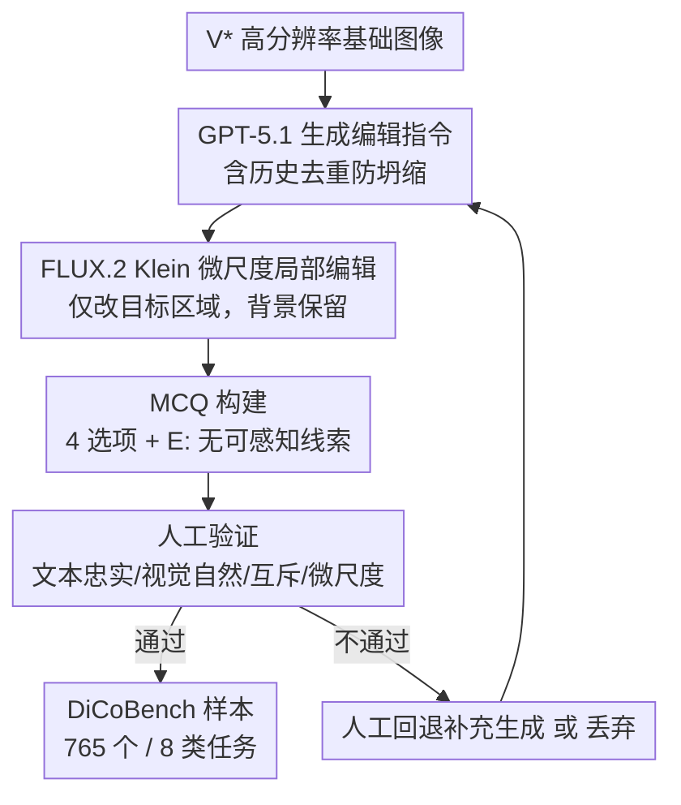

# DiCoBench: Benchmarking Multi-Image Fine-Grained Perception via Differential and Commonality Visual Cues

**会议**: ECCV 2026  
**arXiv**: [2606.26602](https://arxiv.org/abs/2606.26602)  
**代码**: 无  
**领域**: 多模态VLM  
**关键词**: 多图像细粒度感知, 视觉线索引导, benchmark, 高分辨率, MLLM评测

## 一句话总结
DiCoBench 提出首个以隐式视觉线索（差分与共性）驱动的高分辨率多图像细粒度感知 benchmark，包含 765 个高质样本、8 种任务，用 MCQ 范式消除 n-gram 评测偏差；18 个 MLLM 中最好的 Gemini-3-Pro 仅 58.1%（人类 98.3%），揭示了现有模型在自主视觉线索发现上的严重不足。

## 研究背景与动机
现有 MLLM 在单图细粒度感知上进展显著——V*、HR-Bench、TreeBench 等 benchmark 表明，先进模型已能精确定位和识别高分辨率图像中的微小细节。但这些评测**根本上依赖问题中的显式文本提示**（如「红杯子在哪？」），本质上衡量的是被动的 text-to-image grounding 能力，而非主动从图像本身发现视觉线索的能力。

为什么之前没人做隐式视觉线索驱动的多图 benchmark？原因有三：（1）**评测范式惯性**——现有图像差分描述（IDC）任务习惯用 ROUGE-L / CIDEr 等 n-gram 匹配指标，但这些指标对 MLLM 的输出格式差异极为敏感，会严重误判模型的真实感知能力（G-VEval 已证实这一点）；（2）**任务设计盲区**——已有工作只关注视觉差异，完全忽略了「共性」（两幅完全不同场景中共同存在的实体/逻辑关系）这一同等重要的认知维度；（3）**分辨率不足**——现有多图数据集普遍使用低分辨率图像，无法评估模型在微尺度视觉线索上的感知极限。

做这件事现在才可能的关键使能因素是：GPT-5.1 等强 MLLM 可自动生成多样化编辑指令、FLUX.2 Klein 等图像编辑模型可实现微尺度局部编辑且保持背景不变、以及 MCQ 范式已成熟可直接用于消除评测偏差。

本文的设计选择：将隐式视觉线索系统性地分为**差分线索**和**共性线索**两条并行轨道，每轨各设 4 种感知任务，共 8 类；用高分辨率（平均 1895px，逼近 2K）图像构建 MCQ 样本，每个问题追加「无可感知差异/共性」选项以保证逻辑完备性。

核心 idea：不靠文本提示，让模型纯靠跨图比较来发现微尺度视觉线索，以此作为细粒度感知能力的真正试金石。

## 方法详解

### 整体框架
DiCoBench 的本质是一个**以视觉线索为驱动的跨图细粒度感知评测体系**。输入是一对高分辨率图像和一个不含任何显式文本提示的问题，输出是模型从 A-E 五个选项中选出正确答案。整个流程分两个维度展开：任务定义（评测什么）和数据集构建（怎么造）。任务体系将人类无需文本指引即可捕捉的视觉线索分为差分（两图之间有什么不同）和共性（两图之间有什么相同）两轨，每轨下设属性/实体/空间关系/推理 4 种递进任务，形成 2 x 4 = 8 类任务的覆盖矩阵。构建管线则采用「MLLM 生成指令 + 图像编辑模型执行 + 严格人工验证」的半自动范式，在 765 个样本上保证文本忠实度、视觉自然度、选项互斥性和微尺度约束四条金标准。

### 关键设计

**1. 双轨八任务体系：将隐式视觉线索从「有没有文本提示」这个维度拆干净**

现有 benchmark 的根问题是评测目标与人类真实感知过程不匹配——人看到两幅图时，脑中会自发捕捉「哪里不一样」和「哪里一样」，这不需要任何文字指令。DiCoBench 据此将视觉线索分为两轨。

**差分视觉线索轨**（Differential Visual Cues）评测模型发现两幅高度对齐的高分辨率图像中微尺度变化的能力，包含四个递进层级：（1）**属性（Attribute）**——微目标的光谱反射率、表面材质或形态形状发生毫米级改变，但类别身份和空间坐标不变，如 DIP 开关从红色变绿色；（2）**实体（Entity）**——微观物体发生类别替换、异常消失或意外出现，如远处「限速 60」标牌被换成「限速 80」；（3）**空间关系（Spatial Relationship）**——实体保持身份和属性不变，但位置发生微位移或拓扑重组，如钥匙从抽屉内移到墙挂钩上；（4）**推理（Reasoning）**——微尺度不一致不是像素级变化，而是潜在物理交互的「视觉痕迹」，如沙滩上新增的脚印、玻璃边缘出现微裂纹，需要二阶因果推理。

**共性视觉线索轨**（Commonality Visual Cues）是一个全新挑战：两幅图的全局语义、光照、视角完全不同，模型需要在海量视觉干扰中找到唯一的交集。（1）**实例（Instance）**——跨场景实例重识别，如在凌乱宿舍和户外野餐垫上找到同一把带独特磨损痕迹的瑞士军刀；（2）**类别（Category）**——跨域类别对齐，如服务器机房地上的红色短网线 vs 回收站里的蓝色长网线，尽管颜色/长度/状态不同但同属 RJ45 网线；（3）**空间定位（Spatial Grounding）**——不靠外观匹配，判断两图中处于相同相对位置的物体对；（4）**推理（Reasoning）**——没有任何视觉或结构重叠，要求模型先细致感知两图几乎所有细节，再判断物体间是否存在功能关系（组合/供给/嵌套/协作），如旧门锁与锈钥匙构成「组合」关系。

**2. MCQ 评测范式：用一个「E 选项 + 严格字母匹配」根除 n-gram 评测偏差**

IDC 领域长期用 ROUGE-L / CIDEr 评测生成文本差异描述的质量，但 G-VEval 已证明这些指标对 MLLM 的输出格式差异极度敏感——模型可能准确感知了差异，仅因为描述措辞不够「标准」就被严重扣分，导致其真实感知能力被系统性低估。

DiCoBench 将全部任务设计为多选题（MCQ）：每个样本随机选取 4 个成功的图像-指令配对作为 A/B/C/D 选项，确保正确答案在所有字母选项间均匀分布以消除语言偏置猜测。关键一步是**追加选项 E：「两幅图像之间没有可见差异」或「两幅图像之间没有可见共性」**。这不仅在逻辑上补全了选项空间（防止模型靠随机猜测在 4 选 1 中拿到非平凡分数），也让「无中生有型幻觉」（在相同图像间「看见」差异）可以被量化捕获。评测采用温度=0 的直接字母输出 + 精确字符匹配，彻底消除文本生成评测的格式偏差。

**3. 半自动构建管线与四重人工质控：在 765 个样本上穷尽质量把关**

完全人工标注高分辨率微尺度样本成本极高且一致性差，完全自动生成则质量不可控。DiCoBench 采用「MLLM 指令生成 + 扩散模型编辑 + 多轮人工验证」的半自动管线。

指令生成阶段：基于 V* 数据集的基础图像和标注 mask，将微目标 mask 扩展 $2\times$ 上下文边距以保证融合平滑。用 GPT-5.1 为每个 mask 生成 6 条多样化、任务感知的修改指令，并将已生成的指令迭代反馈回上下文窗口以防止模式坍缩。编辑阶段：指令和扩展 mask 输入 FLUX.2 Klein 进行微尺度局部编辑，确保仅修改变目标的内在属性而复杂高分辨率背景完全不变。最终人工校验阶段：**所有合成样本**必须通过四项严格标准的逐一审查——（1）文本忠实度：修改必须严格忠实于指令；（2）视觉自然度：编辑区域无模糊、伪影或边界退化；（3）选项互斥性：同一基础图像的不同选项（A-D）之间必须互斥且可区分；（4）尺度约束：修改区域严格保持 $<5\%$ 总图像面积。任一标准不通过，样本要么回退到人工回退机制补充生成，要么永久丢弃。

八类任务各自还有定制化的生成与过滤流程。以共性-推理任务为例：预定义组合/供给/嵌套/协作四种关系，转换为可视觉识别的物体对，在两幅完全不同的图像中定位合适 mask 后合成各自物体，最后由人工专家验证合成质量和答案可推导性。

### 一个完整示例：Attribute 任务样本的构建与评测

以差分-属性任务的一个具体样本为例。基础图像是一张高分辨率电子工作台照片，其中包含一个毫米级 DIP 开关。GPT-5.1 被要求生成「仅改变 DIP 开关颜色、不改变其类别身份和空间位置」的编辑指令，分别生成「从红变绿」「从 ON 变 OFF」等多条指令。FLUX.2 Klein 在扩展 mask 区域内执行编辑，其余桌面背景完全不变。从所有通过自动检查的编辑中随机选 4 个作为选项 A-D，追加选项 E「两图之间无可见差异」。

评测时，模型看到两张几乎完全相同的电子工作台照片和问题「这两张图之间有什么不同？」，候选为 A: DIP 开关从红变绿 / B: DIP 开关从 ON 变 OFF / C: 螺丝从十字变一字 / D: 电容从蓝色变黑色 / E: 无可见差异。人类一眼能看出 DIP 开关是唯一变化区域并选对；但现有模型往往因为微目标占比过小而忽略了视觉线索，直接选 E 或随机猜测。

### 损失函数 / 训练策略
DiCoBench 是评测 benchmark，不涉及模型训练。但其构建管线中的**质量控制标准**可视为一种「优化策略」：四项人工验证标准（文本忠实度/视觉自然度/选项互斥性/尺度约束 $<5\%$ 面积）是所有样本进入最终数据集的必要门控条件，未通过的样本被迭代回退或丢弃，形成闭环质量保证。此外，为防止模型利用语言偏置猜测，正确答案在所有字母选项间强制均匀分布。

## 实验关键数据

### 主实验

18 个 MLLM 在 DiCoBench 上的表现，人类作为上限对照（完整 8 任务详见原文 Table 1，此处展示代表性模型）：

| 模型 | Attr. | Ent. | Spa. | Rea. (Diff) | Ins. | Cat. | Spa. (Comm) | Rea. (Comm) | Avg |
|------|-------|------|------|-------------|------|------|-------------|-------------|-----|
| Human | 97.6 | 98.9 | 98.0 | 97.3 | 99.1 | 99.1 | 98.4 | 97.4 | **98.3** |
| Gemini-3-Pro | 49.4 | 89.5 | 82.0 | 28.0 | 72.7 | 63.6 | 58.4 | 36.4 | **58.1** |
| Gemini-3-Flash | 25.0 | 55.6 | 40.0 | 14.3 | 45.5 | 63.6 | 41.7 | 36.4 | **41.9** |
| GPT-4o | 32.9 | 46.3 | 26.0 | 25.3 | 28.2 | 24.6 | 26.0 | 20.0 | **29.0** |
| GPT-5 | 35.3 | 54.7 | 48.0 | 22.7 | 66.4 | 53.6 | 36.0 | 22.6 | **42.6** |
| TreeVGR-7B (开源) | 35.3 | 57.9 | 34.0 | 29.3 | 76.4 | 62.7 | 58.4 | 20.0 | **48.8** |
| DeepEyes-7B (开源) | 31.8 | 55.8 | 36.0 | 26.7 | 75.5 | 60.9 | 29.6 | 20.0 | **42.9** |
| Qwen3-VL-8B (开源) | 29.4 | 51.6 | 40.0 | 21.3 | 71.8 | 63.6 | 20.8 | 20.0 | **40.3** |

### 高分辨率消融分析

以 Qwen3-VL-8B 为对象，在每种任务中抽样 1/10 样本并人工标注视觉线索位置，做两组对照实验：

| 输入设置 | 效果 | 分析 |
|----------|------|------|
| 原始高分辨率输入（Vanilla） | 基线 | 大量无关视觉信息淹没微尺度线索 |
| 裁剪到线索区域（Cropped） | 显著提升 | 过滤无关区域降低干扰 |
| 裁剪后缩放回原尺寸（Cropped+Resized） | 进一步提升 | 同时增加了线索的**相对占比**，双因子改善 |

结论：高分辨率从两个方向挑战模型——（1）引入过多无关视觉信息量；（2）降低视觉线索的相对尺度占比。两种效应叠加使现有模型难以在全局高分辨率场景中定位微尺度线索。

### 人类感知时长实验

邀请 8 位未接触过评测的博士生，两人一组分别在 30s / 60s / 120s / 无限制四种时间约束下完成任务：

| 时间约束 | 人类准确率 | 与 Gemini-3-Pro (58.1%) 差距 |
|----------|-----------|-------------------------------|
| 30s | ~70% | 差距缩小 |
| 60s | ~80% | 拉开 |
| 120s | ~90% | 显著拉开 |
| 无限制 | 98.3% | 40.2% 的巨大鸿沟 |

关键发现：人类感知不是瞬间完成的——时间受限时人与模型的差距缩小，但随着时间投入增加，人类准确率持续上升至接近完美，而模型仍陷于瓶颈。这暗示现有 MLLM 的感知能力也像推理能力一样，可能受益于更大的计算投入（如 test-time compute scaling）。

### 关键发现
- **推理任务是通用软肋**：无论闭源还是开源，差分轨和共性轨的推理子任务分数普降至 20-30% 随机猜测水平；共性推理更甚，几乎所有开源模型统一选 E（「无共性」），得分锁死在 20%。
- **「丢失视觉线索」是第一大错误类型**：错误分析（Gemini-3-Pro 与 Qwen3-VL）显示，丢失视觉线索占主导，说明模型存在系统性缺陷——这与过去缺乏此类评测、训练数据中无对应信号直接相关。除此之外，Gemini-3-Pro 更偏向「无中生有型幻觉」（在相同图间看到差异），Qwen3-VL 更偏向「事实描述型幻觉」（误判物体朝向/位置）。
- **闭源 vs 开源差距并不悬殊**：TreeVGR-7B 的 48.8% 超过 GPT-4o 的 29.0% 和 GPT-4.1 的 25.0%，说明轻量级任务专用优化模型有能力与大规模闭源模型竞争。
- **共性-类别任务相对最强**：大部分模型在此项得分超 50%，说明基本物体识别和分类能力较为成熟；瓶颈集中在需要深度逻辑分析的视觉线索整合。

## 亮点与洞察
- **「E 选项」设计精妙，一箭双雕**：既补全了 MCQ 的逻辑空间（避免 4 选 1 的随机猜测拿分），又能直接量化「无中生有型幻觉」——这在以往的 IDC 评测中完全不可测量。这是一个极低实现成本但效果显著的评测设计 trick，可迁移到任何需要区分「真不知道」和「瞎猜」的 VQA benchmark。
- **高分辨率的「双重挑战」机制分析有洞察力**：实验将高分辨率拆解为「无关信息量大」和「线索相对尺度小」两个独立因子，通过 crop vs crop+resize 实验解耦——crop 消除前者，crop+resize 消除后者。这种消融思路可迁移到任何需要分析分辨率效应的视觉任务。
- **人类感知时长实验是评测论文中罕见的「认知对照」设计**：不做简单的人类上限 vs 模型对比，而是揭示了人类感知的时变特性——随着时间投入从 ~70% 爬到 98.3%，而模型锁在 58%。这直接导向一个可操作的研究方向：给 MLLM 的视觉感知引入 test-time scaling。
- **共性线索轨填补了真正的空白**：在完全不同场景中找到唯一交集，这一能力在已有 benchmark 中从未被单独、系统地评测过，但它对应「人类在复杂环境中的物体再认」这一真实认知需求。

## 局限与展望
- **作者承认**：DiCoBench 的构建依赖人工严格校验，扩展到更大规模受限于标注成本；当前样本量 765 虽已是同类最大，但对覆盖全部现实场景仍显不足。
- **图像来源依赖 V***：所有基础图像均来自 V* 数据集，场景多样性和分布偏差未做系统分析，可能影响评测结论的泛化性。
- **推理任务的操作化定义可能偏窄**：共性推理目前只覆盖组合/供给/嵌套/协作四种功能关系，而现实中的逻辑关系远比这丰富（如因果链、时序依赖、意图推断等），未来可扩展更多关系类型。
- **MCQ 范式虽消除 n-gram 偏差，但引入新的局限性**：固定选项无法评测模型的自由形式描述能力；对于部分正确但非完全匹配的感知（如感知到了差异但描述粒度不同），MCQ 将其二分为对/错，损失了细粒度的能力刻画。
- **具体改进方向**：（1）引入更多基础图像来源以提高场景多样性；（2）扩展共性推理的关系类型库，如添加因果/时序/反事实关系；（3）设计混合评测范式，在 MCQ 外增加开放式描述任务以刻画更细粒度的感知能力谱系；（4）探索基于此 benchmark 的训练数据合成 pipeline，用高质量合成数据反哺模型在视觉线索发现上的能力短板。

## 相关工作与启发
- **vs V* / HR-Bench / TreeBench（单图细粒度 benchmark）**：它们依赖问题中的显式文本提示引导模型关注特定物体，评测的是 text-to-image grounding；DiCoBench 完全去掉文本提示，评测的是模型自主从图像中发现视觉线索的能力，更接近人类在真实环境中的感知方式。
- **vs MuirBench / BLINK / MIR Benchmark（多图综合 benchmark）**：它们覆盖 STEM 知识、场景理解等宏观逻辑关系，但使用低分辨率图像，无法评测微尺度视觉线索的发现能力；DiCoBench 聚焦高分辨率下的隐式视觉线索，互补而非替代。
- **vs DiffTell / OmniDiff / OneDiff（图像差分描述）**：它们用生成文本描述差异 + n-gram 指标评测，存在格式偏差和任务单一（只做差异不做共性）两个根本缺陷；DiCoBench 用 MCQ + 双轨体系同时解决两者，且将分辨率推到 2K 级别。
- **vs G-VEval**：G-VEval 指出现有 n-gram 评测指标的失效，DiCoBench 是首个将这一洞察落地为完整 benchmark 设计的工作——用 MCQ 从根本上规避了格式偏差问题。

## 评分
- 新颖性: ⭐⭐⭐⭐☆ 将「隐式视觉线索」作为评测维度体系化是首次，共性线索轨填补了明确空白；但 MCQ 范式和半自动构建管线本身不算全新，核心新颖性在于问题定义而非技术手段。
- 实验充分度: ⭐⭐⭐⭐⭐ 18 个模型全面评测，涵盖闭源/开源/微调专用三类；分辨率消融、人类时变实验、错误分类分析三个分析实验都提供了超越主表分数的洞见。
- 写作质量: ⭐⭐⭐⭐⭐ 动机链条清晰（三条痛点 → 三条设计），任务定义用具体例子代替抽象描述极好懂，实验分析有层次而非罗列数字。
- 价值: ⭐⭐⭐⭐⭐ 揭示了一个被社区系统性忽视的能力缺口——模型 40 分 vs 人类 98 分，这个 58 分的鸿沟足以驱动未来数年 MLLM 在自主视觉线索发现方向的研究。benchmark 设计本身也提供了可复用的评测框架（E 选项、MCQ、双轨）。

<!-- RELATED:START -->

## 相关论文

- [\[CVPR 2026\] DiG: Differential Grounding for Enhancing Fine-Grained Perception in Multimodal Large Language Models](../../CVPR2026/multimodal_vlm/dig_differential_grounding_for_enhancing_fine-grained_perception_in_multimodal_l.md)
- [\[ECCV 2026\] VisReflect: Latent Visual Reflection for Fine-Grained Perception in Long Visual Context](visreflect_latent_visual_reflection_for_fine-grained_perception_in_long_visual_c.md)
- [\[ICLR 2026\] Catching the Details: Self-Distilled RoI Predictors for Fine-Grained MLLM Perception](../../ICLR2026/multimodal_vlm/catching_the_details_self-distilled_roi_predictors_for_fine-grained_mllm_percept.md)
- [\[ICLR 2026\] Benchmarking Large Vision-Language Models on Fine-Grained Image Tasks: A Comprehensive Evaluation](../../ICLR2026/multimodal_vlm/benchmarking_large_vision-language_models_on_fine-grained_image_tasks_a_comprehe.md)
- [\[ECCV 2026\] ProactiveBench: Benchmarking Proactiveness in Multimodal Large Language Models](proactivebench_benchmarking_proactiveness_in_multimodal_large_language_models.md)

<!-- RELATED:END -->
