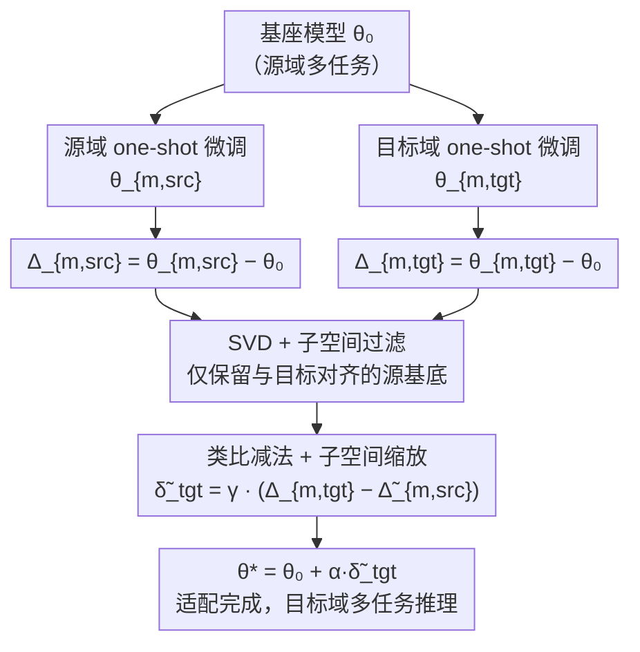

# Domain Arithmetic: One-Shot VLA Adaptation under Environmental Shifts

**会议**: ECCV 2026  
**arXiv**: [2607.00666](https://arxiv.org/abs/2607.00666)  
**代码**: [https://github.com/snumprlab/dart](https://github.com/snumprlab/dart)  
**领域**: 多模态VLM / 机器人  
**关键词**: VLA适配, 权重算术, 域迁移, one-shot学习, 子空间对齐

## 一句话总结
DART 提出一种基于权重空间类比运算的 VLA 模型 one-shot 域适配方法：用单个源域+目标域 demonstration 分别微调，通过子空间对齐过滤后相减提取纯域向量，再将其加回基座模型，在 LIBERO 多视角、视觉扰动、跨实体和真实机器人场景下，仅用 1 条 demonstrations 就显著超越现有适配基线。

## 研究背景与动机
VLA 模型（如 RT-2、OpenVLA、π 系列）在大规模机器人数据上预训练后展现出强大的多任务能力，但一旦部署到与训练环境存在域偏移（相机位姿变化、光照差异、传感器标定不同、甚至换成不同型号的机械臂）的新场景中，同一任务的性能会急剧下降。已有适配方法要么需要为目标域每个任务收集大量 demonstrations（全量微调成本极高），要么引入特定架构修改（如仅调视觉编码器、加 LoRA），限制了对不同 VLA 骨干的通用性。

这构成了一个尖锐矛盾：**真实部署中域偏移无处不在，但逐任务采集 demonstrations 在家庭等场景根本不可行**。于是作者把目标推向极限——one-shot VLA 适配：只用目标域中**一个任务的一条 demonstration**，就将基座模型在目标域上恢复出全部已学任务的执行能力。

直觉是：虽然 one-shot 微调后模型参数的变化（update-vector）主要由任务特异的方向主导（因而对 held-out 任务泛化差），但这些 update-vector 中同时存在一个更小但可复用的**域特异方向**——它编码了"目标域长什么样"的信息。作者通过子空间对齐分析发现：同一任务跨域的 update-vector 高度对齐，同一域跨任务的 update-vector 也有高于随机的对齐，并且 task/domain 方向在权重空间中近似可加性分解。这直接启发了 DART 的核心 insight：**用类比运算（target update minus source update）消去任务方向，仅保留域方向，再将其注入基座模型**——如同 "queen = king + woman - man" 在权重空间的翻版。

## 方法详解

### 整体框架
DART 的目标是：给定在源域 ε_src 上训练好的多任务 VLA 基座模型 θ₀，以及目标域 ε_tgt 中单个任务 T_m 的一条 demonstration D_{m,tgt}，产出适配参数 θ* 使 θ* 在目标域全部任务上表现良好。整体流程分三步：

1. **分别 one-shot 微调**：用同一任务 T_m 的源域演示 D_{m,src} 和目标域演示 D_{m,tgt} 分别对 θ₀ 做行为克隆微调（各 1,000 步），得到 θ_{m,src} 和 θ_{m,tgt}，进而算出两个 update-vector：Δ_{m,src} = θ_{m,src} − θ₀，Δ_{m,tgt} = θ_{m,tgt} − θ₀。
2. **子空间增强的域向量提取**：对每一层的 Δ_{m,src} 和 Δ_{m,tgt} 做 SVD 分解，计算子空间对齐分数 γ^(l)，通过重叠能量筛选仅保留与目标子空间对齐的源基底（子空间过滤），再用 γ^(l) 对域向量做逐层降权（子空间缩放），得到精炼域向量 δ̃_tgt。
3. **域向量注入**：将域向量加回基座模型 θ* = θ₀ + α·δ̃_tgt，得到目标域适配模型，直接用于全部任务推理。

### 关键设计

**1. 类比减法提取域向量：通过源-目标 update-vector 对减消除任务方向**

作者在第 4 节证明，one-shot update-vector Δ_{m,tgt} 中任务特异方向占主导（同一任务跨域 γ 高），但也存在微弱但一致的域方向（同域跨任务 γ 略高于跨域跨任务），且两者在权重空间近似线性可加（任务原型 + 域原型 − 全局原型 的合成方向与真实 update-vector 的 γ 最高）。基于此，DART 用一个巧妙的类比操作来解耦：设同一任务 T_m 在源域的 update-vector 为 Δ_{m,src}，目标域为 Δ_{m,tgt}，则域向量 δ_tgt = Δ_{m,tgt} − Δ_{m,src}。因为两个 update-vector 共享任务特定方向，相减后任务分量被抵消，残留的就是纯域迁移信息。这个设计的精妙之处在于：只需分别用源域和目标域的同一条任务演示各微调一次，无需任何多任务数据或额外标注。实操上，可以先从源训练集中选定 T_m，再到目标域采集同任务的演示，保证任务匹配。

**2. 子空间过滤：只减去与目标子空间对齐的源基底向量，防止源域噪声污染域向量**

直接减法有一个隐患：Δ_{m,src} 中可能含有源域特有的伪影（与任务无关的微调噪声），盲目减去会将这些噪声注入域向量。DART 的做法是只过滤源 update-vector，保留目标 update-vector 的完整信息（因为目标 update 的独特基底恰好编码了域信息）。具体步骤：对每层权重矩阵 Δ_{m,src} 和 Δ_{m,tgt} 分别 SVD，得到左奇异向量 U_src 和 U_tgt；构造交互矩阵 C = U_tgt^⊤ U_src，第 j 个源基底的重叠能量 e_j = ||C_{:,j}||²₂ 衡量该基底落在目标子空间中的比例；以子空间对齐分数 γ 为阈值，贪心地选取能量和达到 γ·Σe_j 的基底索引集合 J_l，构造过滤后的源 update-vector Δ̃_{m,src} = U_src[:,J_l] · U_src[:,J_l]^⊤ · Δ_{m,src}。这与模型合并中的子空间对齐方法方向相反——后者保留每个 update-vector 的独特成分以最大化能力，DART 则是找共有的任务相关成分以精确消除。

**3. 子空间缩放：对低对齐层降权，抑制信噪比低的域向量**

即使过滤了不对齐的基底，如果两个 update-vector 从根本上就弱对齐（γ→0），减法产生的域向量中噪声占比仍然很高。DART 直接用对齐分数 γ^(l) 对域向量逐层缩放：δ̃_tgt^(l) = γ^(l) · (Δ_{m,tgt}^(l) − Δ̃_{m,src}^(l))。直观上，γ 高的层说明 source 和 target 共享大量任务结构，减法效果好、域向量干净，保留完整强度；γ 低的层说明两域差异大或更新本身噪声多，缩放后降低其对最终模型的影响。消融实验表明，子空间缩放带来的增益主要来自高度失对齐的层（如 LLM 中的 MLP Up_proj 层），这些层的 γ 接近 0，其域向量若不加降权反而会伤害多任务能力。

### 损失函数 / 训练策略
One-shot 微调阶段使用标准行为克隆（BC）损失，在目标域演示 D_{m,tgt} 的动作上最小化负对数似然，优化器为 AdamW，学习率 5×10⁻⁵，无 warmup，固定训练 1,000 步，batch size 64。基座模型按照各 VLA 的官方协议预训练（如 LIBERO 上 π₀.₅ 用 openpi 发布的 checkpoint，π₀-FAST 从头训练 30,000 步）。域向量提取阶段不涉及额外训练，仅做权重空间算术；缩放系数 α 在 LIBERO Long 子集上用 10 rollouts 小搜索确定（α=0.8 用于视角迁移，α=0.6 用于视觉扰动），并在所有其他场景（含真实机器人）中复用同一值。SVD 计算可用随机化 SVD（rank r=256）将全量分解 15 分 35 秒降至 6 分 33 秒，性能几乎无损（79.1% vs 78.7%）。

## 实验关键数据

### 主实验
DART 在 π₀.₅ 上的 LIBERO 新视角迁移结果（40 任务，3 次随机 adaptation task 平均，每次 50 rollouts）：

| 方法 | Small | Medium | Large | 平均 |
|------|-------|--------|-------|------|
| Zero-shot | 88.3 | 63.9 | 11.3 | 54.5 |
| One-shot FT | 43.4 | 33.3 | 17.8 | 31.5 |
| RETAIN (ICLR 2026) | 87.4 | 72.4 | 48.9 | 69.6 |
| FLA (CVPR 2026) | 92.2 | 76.4 | 54.3 | 74.3 |
| **DART (Ours)** | **92.0** | **80.8** | **64.4** | **79.1** |

真实机器人 UR10e 五任务视角迁移结果（仅用一条 Stack Cube 演示适配，每任务 12 rollouts）：

| 方法 | Eggplant | Lemon | Carrot | Stack Cube | Press Stapler | 平均 |
|------|----------|-------|--------|------------|---------------|------|
| Zero-shot | 50.0 | 33.3 | 41.7 | 16.7 | 75.0 | 43.3 |
| One-shot FT | 58.3 | 58.3 | 41.7 | 33.3 | 66.7 | 51.7 |
| RETAIN | 58.3 | 41.7 | 41.7 | 16.7 | 83.3 | 48.3 |
| FLA | 58.3 | 50.0 | 50.0 | 16.7 | 100.0 | 55.0 |
| **DART** | **91.7** | **91.7** | **83.3** | **41.7** | **100.0** | **81.7** |

其他主实验结果：跨实体迁移（Panda→UR5e, MimicGen），DART 平均成功率 69.4%（vs Zero-shot 62.0%）；π₀-FAST 架构上 DART 平均 79.4%（vs FLA 76.6%）；组合视觉扰动（View+Noise+Light）下 DART 平均 75.0%（vs FLA 71.5%）。

### 消融实验
LIBERO 三视角平均成功率消融（π₀.₅）：

| 子空间过滤 | 子空间缩放 | 平均成功率 (%) |
|-----------|-----------|---------------|
| ✗ | ✗ | 78.1 |
| ✓ | ✗ | 78.8 |
| ✗ | ✓ | 78.5 |
| ✓ | ✓ | **79.1** |

相比 One-shot FT 的 31.5%，纯类比减法（无子空间组件）即达到 78.1%（+46.6pp），证明类比运算本身就能有效隔离域知识。子空间过滤进一步提升到 78.8%（+0.7pp），子空间缩放到 78.5%（+0.4pp），二者叠加达到 79.1%，说明过滤和缩放分别贡献于抑制源域噪声和降低失对齐层的干扰。

### 关键发现
- **类比运算是最核心的贡献**：仅靠 Δ_{m,tgt} − Δ_{m,src} 就在三视角平均上获得 +46.6pp 收益（相对 One-shot FT），证明 one-shot update-vector 中 task/domain 方向的加性分解假说成立。
- **缩放系数 α 极其鲁棒**：在 Medium 和 Large 视角下 α 从 0.2 到 1.4 的波动仅带来 0.8% 和 2.1% 的标准差，DART w/o SA 则波动更大，说明子空间过滤+缩放抑制了会被 α 放大的噪声成分。
- **微调步数宽容**：One-shot FT 随步数增加因灾难性遗忘而退化，DART 却稳步上升（因任务方向随训练更显著，有利于提取纯净域向量），且 200 步即可达到竞争力性能。
- **LLM 层适配是关键**：在 Vis/LLM/Action 三层中，Vis+LLM 效果接近全层，单独适配 Action 几乎无效，且 LLM 中 MLP Up_proj 层的域向量幅值最大、子空间对齐最低——提示域知识主要编码在 LLM 的 MLP 层。
- **域向量可合并**：将 Small/Medium/Large 三个视角的域向量合并为一个，用 TSV 合并后平均成功率 75.7%，可减少多域部署的分量存储开销。

## 亮点与洞察
- **用"类比"而非"合并"做域适配，问题定义精准**：模型合并（如 TIES、Iso-C）的目标是组合不同模型的能力，类比（analogy）的目标是消去共性、提取差异——这正好是域适配所需要的。DART 是第一个在 VLA 中系统使用类比做域迁移的工作，实验也表明直接套用合并方法（如 TIES 合并 [Δ_{m,tgt}, −Δ_{m,src}]）效果不如 DART（77.6% vs 79.1%）。
- **子空间对齐分数一石二鸟**：γ 既用作基底选择的阈值（决定过滤多少），又用作域向量的缩放系数（决定信噪比低的层降权多少），没有引入额外超参数。这个设计简洁且高效，背后是对 update-vector 低秩结构和任务/域方向几何关系的深刻理解。
- **源域演示的获取假设实际可满足**：作者明确指出可以先从源训练集选好 adaptation task，再到目标域采集同任务的演示——不是要求在庞大的目标域数据里找出和源域"同样的任务"，而是反过来做，这个工程细节让假设在实际部署中可行。
- **方法对 VLA 架构不敏感**：π₀.₅（flow matching 连续回归）和 π₀-FAST（自回归离散 token）均有效，说明 weight-space 的 task/domain 加性分解是 VLA 模型的通用结构属性，根植于其共享的视觉-语言预训练骨干。

## 局限与展望
- 作者承认大视角偏移（Large viewpoint）下所有 one-shot 方法性能都有限（DART 64.4% vs full-data FT 上界 90.9%），极端域偏移仍然是挑战，未来可探索更强的域向量提取机制或更好的基座模型微调策略。
- 缩放系数 α 虽在较宽范围内鲁棒，但仍需要一个小的搜索过程（10 rollouts），对真实部署中完全无搜索的场景还不够"即插即用"；逐层自适应缩放可能是解法。
- 该方法要求源域和目标域的 adaptation task 相同（T_m = T_m'）。当无法精确匹配时（如源数据集庞大且无清晰任务索引），使用相似任务（余弦相似度检索）可部分缓解但仍有明显退化（80.8% → 69.0%），说明域向量提取对任务匹配敏感；更强的跨域任务检索是一个有价值的改进方向。
- 当前实验集中在视觉域偏移和跨实体迁移，对动力学变化（如物体质量、摩擦力、关节阻尼等物理参数偏移）的效果未验证，这类偏移是否同样在权重空间形成线性可分的域方向值得探索。

## 相关工作与启发
- **vs Task Arithmetic (ICLR 2023)**：TA 使用加法和类比做多任务能力的组合，但其类比仅做直接减法用于跨语言迁移和对齐迁移。DART 在 TA 的类比基础上引入了子空间过滤和缩放两个增强机制，并将类比重新定位为"域信息提取"而非"能力组合"，这在 VLA 适配场景中获得显著收益。
- **vs RETAIN (ICLR 2026)**：RETAIN 通过模块级插值权衡新旧任务能力，本质是参数空间线性插值，不显式建模域偏移方向。DART 的类比减法显式提取域向量，在相同 one-shot 数据预算下取得更高成功率（79.1% vs 69.6%），说明显式建模优于隐式权衡。
- **vs FLA (CVPR 2026)**：FLA 仅在视觉编码器中插入 LoRA 进行参数高效适配，冻结 LLM 和 action expert。DART 通过权重算术同时适配所有模块，在数据极度匮乏（one-shot per scene vs task-wise）的设置下性能更好，且不引入任何架构修改，即插即用于任意 VLA。
- **vs SCALE (ICML 2026, test-time adaptation)**：SCALE 在推理时适应但主要面向有限偏移。DART 在 π₀-FAST 上的三视角平均 79.4% vs SCALE 73.0%，说明在较大环境偏移下，test-time adaptation 的能力有限，对 VLA 策略参数的显式适配仍是必要的。

## 评分
- 新颖性: ⭐⭐⭐⭐⭐ 将 weight arithmetic 中的类比运算首次系统应用于 VLA 域适配，配合子空间对齐增强，问题定义和方法设计都很有新意
- 实验充分度: ⭐⭐⭐⭐⭐ 覆盖两个 VLA 架构、模拟+真实机器人、视觉偏移+跨实体、消融+超参分析+层选择+域向量合并+源域遗忘检查，实验设计周全
- 写作质量: ⭐⭐⭐⭐⭐ 从第 4 节实证分析（为什么 one-shot FT 失败）到第 5 节方法设计（基于分析发现提出 DART），逻辑链条紧密，动机充分自洽
- 价值: ⭐⭐⭐⭐⭐ one-shot VLA 适配是机器人部署的核心痛点，DART 数据效率极高（1 条 demo per environment）、架构无关、即插即用，实用价值突出

<!-- RELATED:START -->

## 相关论文

- [\[CVPR 2025\] COUNTS: Benchmarking Object Detectors and Multimodal Large Language Models under Distribution Shifts](../../CVPR2025/multimodal_vlm/counts_benchmarking_object_detectors_and_multimodal_large_language_models_under_.md)
- [\[CVPR 2026\] Vision-Language Model Guided Source-Free Domain Adaptation via Optimal Transport](../../CVPR2026/multimodal_vlm/vision-language_model_guided_source-free_domain_adaptation_via_optimal_transport.md)
- [\[CVPR 2026\] One Patch to Caption Them All: A Unified Zero-Shot Captioning Framework](../../CVPR2026/multimodal_vlm/one_patch_to_caption_them_all_a_unified_zero-shot_captioning_framework.md)
- [\[CVPR 2026\] Addressing Exacerbated Attention Sink for Source-Free Cross-Domain Few-Shot Learning](../../CVPR2026/multimodal_vlm/addressing_exacerbated_attention_sink_for_source-free_cross-domain_few-shot_lear.md)
- [\[ICML 2026\] VLANeXt：构建强大 VLA 模型的配方](../../ICML2026/multimodal_vlm/vlanext_recipes_for_building_strong_vla_models.md)

<!-- RELATED:END -->
