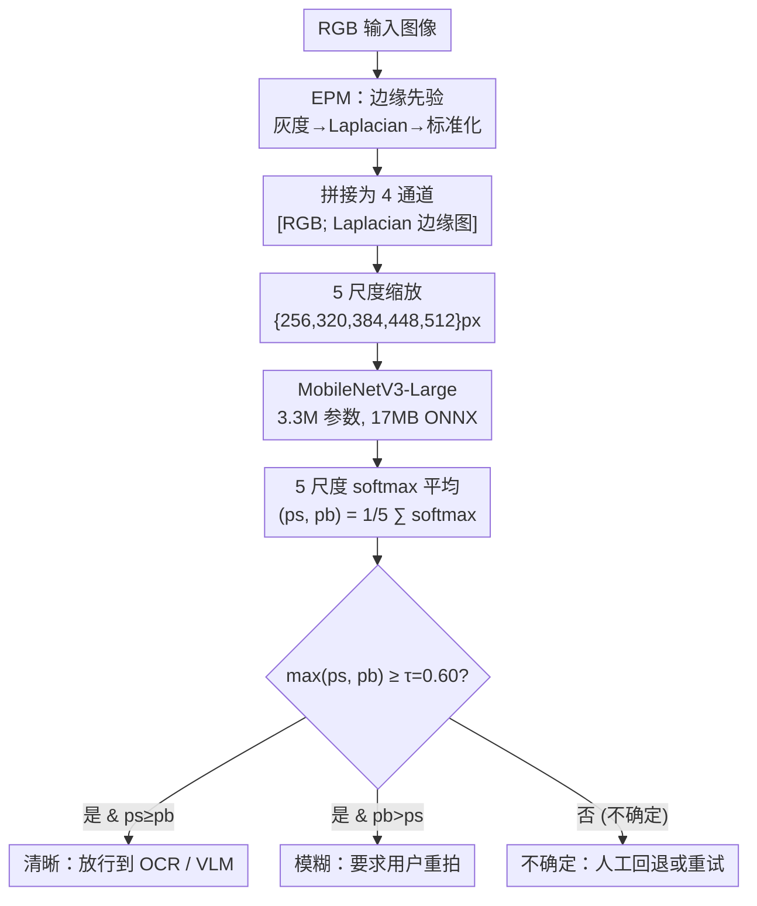

# Edges Before Embeddings: A Confidence-Aware Blur Gate for Vision-Language Pipelines

**会议**: ECCV 2026  
**arXiv**: [2606.25838](https://arxiv.org/abs/2606.25838)  
**代码**: [https://github.com/bradduy/MagikaDocumentFromPixel](https://github.com/bradduy/MagikaDocumentFromPixel)  
**领域**: 多模态 VLM  
**关键词**: 图像质量检测, 模糊检测, 选择性预测, 视觉语言管线, 边缘先验

## 一句话总结

本文提出 MagikaDocumentFromPixel，一个轻量级 CPU 友好型模糊检测门控器，通过 Laplacian 边缘先验模块 (EPM) 作为第 4 输入通道注入频域信息，搭配多尺度测试时增强和 max-softmax 选择性预测阈值，在 ~7ms CPU 推理时间内以 F1=0.9803 的质量为 VLM/OCR 管线提供清晰/模糊/不确定三路路由决策。

## 研究背景与动机

生产环境中的视觉管线默默地在模糊输入上退化：运动模糊、失焦、压缩伪影等让下游 OCR 吐出不可用的乱码、VLM 调用消耗 token 却输出无意义的结果、图像检索返回低质量匹配。这些问题在开发 benchmark 上看不到，但在部署中每天发生。最头疼的是"静默退化"——下游系统不会主动报错，因为垃圾输出在语法上看起来是合法的。现有方案处于两难：经典启发式方法（Laplacian 方差、FFT 频带能量）计算极快不到 1ms，但场景依赖性强，在纹理丰富但清晰的场景（毛皮、树叶）或平滑但清晰的场景（天空、白墙）上会把清晰误判为模糊，且无法按领域调参；深度学习去模糊网络（DeblurGAN 等）参数上亿，推理成本高，而且设计目标是修复模糊而非检测模糊——生产线团队真正需要的是在进入昂贵计算之前就决定"这张图值不值得喂给下游"的**门控器**，而非修复器。

这种窘境的核心矛盾在于：管线需要一个比下游快三个数量级的过滤器，但既能保持经典方法的轻量速度、又能达到深度学习的判别精度，同时还要具备"节制"能力——遇到不确定的输入时知道说"不知道"，而不是强行给出错误分类。本文的切入角度是：不必让 CNN 从像素统计中重新发现频域证据，而是把经典 Laplacian 算子的输出作为**显式输入通道**告诉网络。**核心 idea：将 Laplacian 边缘幅度标准化后作为第 4 通道与 RGB 拼接，用 MobileNetV3-Large 做多尺度推理，通过 max-softmax 阈值实现带节制的三路路由（清晰/模糊/不确定），构建一个 ~7ms CPU、17MB 的轻量生产级模糊门控器。**

## 方法详解

### 整体框架

整个系统的设计是一个清晰的串行管线：输入 RGB 图像先经过 EPM 提取边缘先验得到第 4 通道，拼接后的 4 通道输入同时缩放到 5 个分辨率，由共享权重的 MobileNetV3-Large 在每个尺度上独立推理，5 个 softmax 向量取平均后通过置信度阈值 τ=0.60 做三路路由决策。整体流程如下图所示：

框架中有几个值得注意的设计选择。EPM 是一个参数无关的固定变换模块（Laplacian 核是固定的 3×3 卷积），不引入可学习参数；5 尺度 TTA 是纯推理时的操作，不参与训练；MobileNetV3-Large 在 5 个尺度上共享权重，参数总量仅 3.3M；最终路由的 τ 阈值是部署时可调的产品旋钮，不同下游可以设置不同阈值来平衡精度与用户摩擦。

### 关键设计

**1. Edge Prior Module (EPM)：将经典频域线索以输入形式注入 CNN**

传统 Laplacian 方差启发式计算快（<1ms）但场景依赖——纯 CNN 从像素统计中学习频域信息则需要大量数据和参数。EPM 的核心想法是：既然 Laplacian 算子已经能有效提取高频边缘信息，为什么不直接把它作为输入通道告诉网络？具体做法：取 RGB 的亮度分量 G(x) = 0.299R + 0.587G + 0.114B，用 3×3 8-邻域 Laplacian 核做卷积得到边缘幅度，再对整张边缘图做逐图像标准化（减均值除标准差），将结果作为第 4 通道与 RGB 拼接为 4 通道输入 [x; φ(x)] ∈ R^(4×H×W)。第一卷积的输入通道从 3 扩展到 4：前三个通道用 ImageNet 预训练权重初始化，第 4 个通道初始化为输出通道均值 ×0.1（标准的 warm-start 策略）。

EPM 的代价微乎其微——Laplacian 核是固定的 9 次乘法运算，仅增加第一卷积的 3×3×输出通道数 = 16 参数（对 3.3M 模型可忽略），推理延迟几乎不变。但增益显著：在 AMD/ROCm 环境的匹配对照中，EPM 将单尺度 F1 从 0.9632 提升至 0.9746（+1.14 点），5 尺度 TTA F1 从 0.9672 提升至 0.9803（+1.31 点）——这是整个实验日志中**单一改动最大的增益**。原因是 CNN 不再需要从像素噪声中重新发现"模糊 = 高频能量下降"这个早已被经典方法验证的关系。

**2. 多尺度测试时增强 (Multi-scale TTA)：免训练的分辨率集成**

模糊检测天然具有尺度敏感性：同一个模糊图像在低分辨率下看起来可能清晰（因为模糊被下采样抹平了），在高分辨率下才暴露模糊痕迹。论文利用这一特性，在推理时将输入同时缩放到 {256, 320, 384, 448, 512} px 五个分辨率，让共享权重的 MobileNetV3-Large 在每个尺度上独立推理，对 5 个 softmax 向量取平均后再做路由：(ps, pb) = 1/|S| Σ softmax(f_θ(x_↓s))。这个操作不需要重新训练，在部署时提供约 0.5 个 F1 点的免费增益。当延迟成为瓶颈时可以关闭（单尺度 384px F1=0.9722）。更有趣的是，EPM 和多尺度 TTA 存在正向交互：EPM 的加入反而扩大了 TTA 的增益幅度（+0.57 vs 基线的 +0.40），说明边缘先验为多尺度集成提供了独立于 RGB 的证据信号。

**3. 置信度感知路由 (Confidence-Aware Routing)：带节制权的三路决策**

这是系统中最具实用意义的设计。模型输出 sharp/blurred 的二类 softmax 概率 (ps, pb)，推理时根据 max(ps, pb) 是否超过阈值 τ 做三路路由：超过且 ps≥pb 输出"清晰"放行到下游 OCR/VLM；超过且 pb>ps 输出"模糊"要求用户重拍；不超过阈值则输出"不确定"送入人工回退或重试——这就是经典的 selective prediction 中的"节制"（abstention）权，形式化为 Chow's rule。τ 被设计为**部署时可调的产品旋钮**而不是训练超参：KYC 场景可以设高阈值（宁愿多误拒也不放过模糊）、社交媒体上传可以设低阈值（宁愿接受少量模糊也不打断用户体验）、数据集清洗可以设中等阈值。论文的默认值是 τ=0.60，来自经验观察。一个重要警告：验证集上 F1 会饱和到 1.0，τ 不能在验证集上调参，必须在生产流量的一小部分上标定——这是论文明确指出的易踩的坑。

### 损失函数 / 训练策略

采用标准的交叉熵损失训练。骨干网络为 MobileNetV3-Large（ImageNet 预训练，~3.3M 参数），编译为 17MB ONNX 产物且支持动态 batch 和宽高维度。关键训练配置：输入分辨率 384×384，优化器 AdamW lr=1e-4，Cosine 学习率调度，25 epoch，中等数据增强（裁剪、翻转、弱颜色抖动）。额外的数据技巧：将 GoPro Large 中的 blur_gamma 子文件夹也作为模糊类一起训练，免费带来约 +1% F1。需要注意的是：训练超过 25 epoch 在 384px 下会过拟合；Focal Loss 在近似平衡的数据集上反而有害；强数据增强（RandAugment, MixUp）在 ≥224px 时降低精度。

## 实验关键数据

### 主实验

在 GoPro Large 测试集上的结果。两个参考系统：原始 NVIDIA/CUDA 配方（384px + 5 尺度 TTA）和本文的 EPM 扩展（AMD/ROCm 环境）。

| 指标 | NVIDIA/CUDA 配方 | + EPM（本文） |
|------|-----------------|--------------|
| F1 | 0.9749 | **0.9803** |
| 准确率 | 0.9752 | **0.9806** |
| 精确率 | 0.9889 | **0.9981** |
| 召回率 | 0.9613 | **0.9631** |
| AUC | 0.9982 | **0.9989** |
| 模型大小 (ONNX) | 17 MB | 17 MB |
| 延迟 (单尺度, CPU) | ~7 ms | ~7 ms |
| 延迟 (5 尺度 TTA) | ~35 ms | ~35 ms |

EPM 在精确率上有最为明显的提升（0.9889 → 0.9981），说明边缘先验有效降低了"把清晰误判为模糊"的假阳性。

### 消融实验

匹配环境（AMD/ROCm）下的隔离对比，所有行使用相同训练配置。

| 配置 | F1 @ 单尺度 384 | F1 @ 5 尺度 TTA | TTA 增益 |
|------|----------------|-----------------|----------|
| 基线 (固定 384 训练) | 0.9632 | 0.9672 | +0.40 |
| Res-Rand (随机分辨率训练) | 0.9642 | 0.9668 | +0.26 |
| **EPM（本文）** | **0.9746** | **0.9803** | **+0.57** |
| EPM + Res-Rand (堆叠) | 0.9402 | 0.9537 | +1.35 |

### 关键发现

- **EPM 是最大杠杆**：单尺度 +1.14 点 F1、TTA +1.31 点 F1，是全部 46 个实验配置中单一改动最大的增益。
- **分辨率主导能力**：从 128px 到 384px 移动带来 ~13 点 F1 提升，远大于骨干网络容量变化的影响；MobileNetV3-Large 优于 Small 仅在 ≥384px 时才显现。
- **EPM 与 Res-Rand 不可堆叠**：EPM 的边缘幅度天然与分辨率相关，Res-Rand 每 batch 随机选择分辨率导致辅助通道的统计分布不断变化，模型无法学到稳定的边缘先验，反而退化。两者应互斥使用。
- **负结果值得记录**：Focal Loss 有害、强数据增强在 ≥224px 降低精度、25 epoch 后过拟合、验证集 F1 饱和到 1.0 无法用于调参——这些负结果为后续团队省去了大量试错成本。

## 亮点与洞察

- **EPM 的设计哲学巧妙**：不增加新架构、不设计新损失，只是把经典 Laplacian 算子的输出拼成第 4 输入通道，就让 CNN 绕过了"从像素重新发现频域信息"的不必要学习——这对任何需要频域线索的视觉任务都有借鉴意义（文本检测、去噪、超分）。
- **"门控+置信度+路由"的通用模式**：论文发现这个模式也独立出现在 Magika（内容类型检测）、Risk-Controlled OCR、DocVLM 三个系统中——这是一个控制论框架：轻量门控器发出置信度信号，用阈值决定是否消费昂贵下游。这个模式很可能成为生产视觉/文档系统的默认架构。
- **分辨率优先的实用 insight**：在模糊检测这个任务上，提高输入分辨率的效果远大于换更大的骨干网络——这个发现与 DocVLM 等大模型文献一致，说明分辨率是视觉任务的杠杆优先级第一的维度。
- **三路路由的工程巧思**：第三个"不确定"输出实际上是一个部署时旋钮：不是技术选择，而是产品选择。不同下游场景（KYC、社交上传、数据集清洗）共享同一模型，仅通过调节 τ 阈值来平衡精度与用户摩擦。

## 局限与展望

- **单一模糊分布**：所有实验在 GoPro Large 运动模糊上，离焦模糊、低光噪声、压缩伪影、扫描畸变均未测试。跨数据集泛化（RealBlur、HIDE、文档模糊集）是首要扩展方向。
- **单一随机种子**：报告值来自单次训练，应补充多种子均值±标准差和配对 McNemar 检验。
- **校准未测量**：使用 max-softmax 阈值但未报告 ECE 或可靠性图，温度缩放和 isotonic regression 仅凭 F1 就被否定了。完整的校准研究是计划中的配套实验。
- **τ 未做 sweep**：文中固定 τ=0.60 未报告 PR 曲线随 τ 的变化。PR 权衡曲线和 risk-coverage 曲线是这里正确的评估工具。
- **预测的失败模式未验证**：论文定性预测了三类典型错误（纹理丰富但清晰的场景判为模糊、平滑但清晰的场景判为模糊、强眩光/镜头耀斑判为模糊），但未做定量错误分析。

## 相关工作与启发

- **vs Laplacian / FFT 启发式**: 经典方法 <1ms 但场景依赖，不能调参，无"不确定"节制能力。EPM 用可学习的方式吸收了频域线索，保留了速度优势的同时大幅提升精度。
- **vs MUSIQ / MANIQA (IQA)**: 深度学习 IQA 模型输出连续质量分数而非二类路由决策，且需要 GPU（~50ms）。本文的模糊门控输出清晰/模糊/不确定的路由标签，不需要人为设定 cutoff。
- **vs DeblurGAN**: 去模糊网络修复而非检测，参数上亿、推理 ~200ms GPU。本文的路由决策比修复更符合生产级需求——对模糊收据，用户需要的往往是"请重拍"而非"一个 AI 修复的版本"。
- **vs Magika**: Magika 做文件内容类型检测，本文做图像模糊检测——两者共享 < small-model + confidence + routing > 的控制论框架。这个模式的反复出现暗示它是生产视觉系统的默认架构。

## 评分

- 新颖性: ⭐⭐⭐⭐ 虽然是经典 CNN+Laplacian，但 EPM 作为显式输入通道的设计重构了"告诉网络而不是让网络重新发现"的范式，且三路路由的工程适配做得很到位。
- 实验充分度: ⭐⭐⭐⭐ 46 个配置、8 个 sweep、正负结果都报告（连失败的堆叠组合都写了），但单分布、单种子、无校准是明显短板。
- 写作质量: ⭐⭐⭐⭐⭐ 文章结构清晰，贡献区分明确（recipe / EPM / routing / pattern observation），正负结果坦诚，局限性和预期失败模式都主动列明——是"诚实论文"的示范。
- 价值: ⭐⭐⭐⭐ 解决了一个真实的生产级痛点——生产管线中的静默退化，且给出的解决方案轻量、可部署、可调参。跨系统的"门控+置信度+路由"模式洞察也有启发意义。

<!-- RELATED:START -->

## 相关论文

- [\[CVPR 2026\] CICA: Coupling Confidence-Aware Pretraining with Confidence-Informed Attention for Robust Multimodal Sentiment Analysis](../../CVPR2026/multimodal_vlm/cica_coupling_confidence-aware_pretraining_with_confidence-informed_attention_fo.md)
- [\[ICLR 2026\] Language-Instructed Vision Embeddings for Controllable and Generalizable Perception](../../ICLR2026/multimodal_vlm/language-instructed_vision_embeddings_for_controllable_and_generalizable_percept.md)
- [\[ECCV 2026\] Rank-Aware Hyperbolic Alignment for Vision–Language Dataset Distillation](rank-aware_hyperbolic_alignment_for_vision-language_dataset_distillation.md)
- [\[ACL 2026\] Reducing Peak Memory Usage for Modern Multimodal Large Language Model Pipelines](../../ACL2026/multimodal_vlm/reducing_peak_memory_usage_for_modern_multimodal_large_language_model_pipelines.md)
- [\[NeurIPS 2025\] Scene-Aware Urban Design: A Human-AI Recommendation Framework Using Co-Occurrence Embeddings and Vision-Language Models](../../NeurIPS2025/multimodal_vlm/scene-aware_urban_design_a_human-ai_recommendation_framework_using_co-occurrence.md)

<!-- RELATED:END -->
