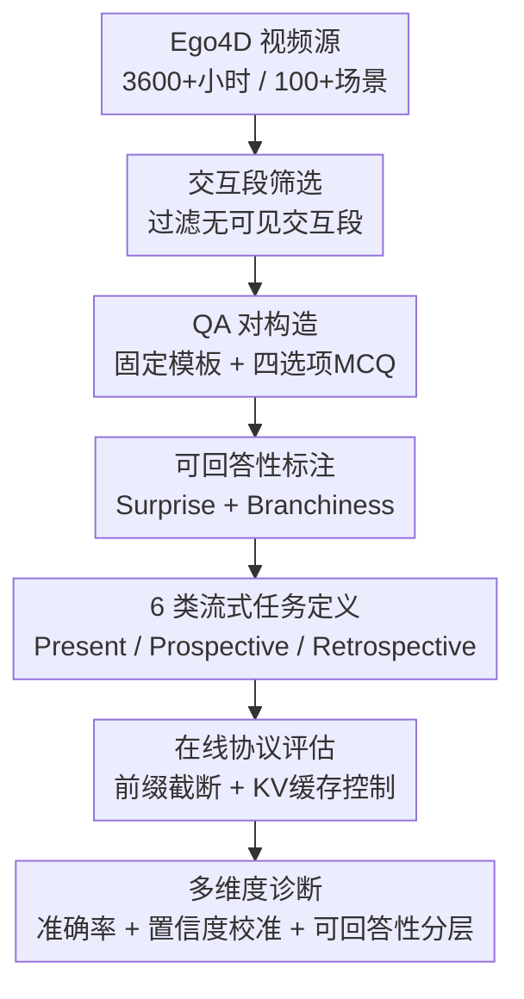

# EgoSAT: A Comprehensive Benchmark of Egocentric Streaming Interaction Understanding

**会议**: ECCV 2026  
**arXiv**: [2606.24422](https://arxiv.org/abs/2606.24422)  
**代码**: 无  
**领域**: 多模态VLM  
**关键词**: 第一人称视频理解, 流式推理, VLM基准测试, 可回答性评估, 置信度校准

## 一句话总结
EgoSAT 是首个面向第一人称（egocentric）流式交互理解的系统性基准，将过去（回顾）、现在（实时）、未来（前瞻）三类推理统一在严格的在线协议下，通过可回答性量化与置信度诊断揭示当前 VLM 不仅在时序推理上表现薄弱，更存在严重的"自信地犯错"（confidently wrong）校准失效问题。

## 研究背景与动机

可穿戴相机与边缘计算的进步，结合 VLM 的突破，正在催生新一代能通过自然语言为佩戴者提供上下文感知辅助的 AI 系统。这类系统的核心特征是流式处理：AI 助理必须持续感知、理解并记住设备捕获的视频流与用户查询，以回答"刚才发生了什么"（回顾推理）、"正在做什么"（在线理解）和"接下来会做什么"（前瞻预测）。然而，这些任务长期以来被割裂研究——视频问答、在线视频叙述、活动预测各有独立的基准和方法，从未在同一流式框架下被统一评估。

为什么之前没有人做统一的流式基准？根本原因有两个：一是第一人称视频的时序标注极其昂贵且稀疏，Ego4D 之前缺乏大规模、高质量的手物交互（hand-object interaction）标注；二是过去的 VLM 几乎没有流式推理能力（仅支持离线全帧输入），直到近年来 TimeChat-Online、Flash-VStream 等流式 VLM 出现才使在线评估成为可能。此外，流式场景下还有一个被严重忽视的问题——**可回答性（answerability）**：在部分观测条件下，某些查询本身就不可预测（比如未来有多个等可能的分支），此时强迫模型给出答案是不公平的。此前没有基准系统性地建模和评估这一点。

EgoSAT 的关键使能因素有三个：(1) Ego4D 提供了 3600+ 小时、覆盖 100+ 场景的密集手物交互标注；(2) 流式 VLM 的出现使在线协议下的基准评估具备可行性；(3) 作者提出的 surprise（突变）和 branchiness（分支性）两种可回答性量化指标，使"可预测/不可预测"具备可操作的数学定义。本文的核心 idea 是：**将回顾、现在、前瞻三类时序推理统一到同一个流式前缀约束下，并引入可回答性量化 + 置信度诊断，使评估从单纯的终端准确率升级为"模型是否知道自己不该回答"的不确定性感知评估**。

## 方法详解

### 整体框架
EgoSAT 的本质是一个"可回答性感知的流式 VLM 基准"，需要解决三个层面的问题：第一，如何形式化流式交互理解中的三类时序推理任务；第二，如何量化"该不该回答"——即从部分观测中推断是否具备足够证据；第三，如何诊断模型的置信度是否与其真实可回答性对齐。整个基准的构建与评估遵循图 1 所示的纵向流程。

具体而言，EgoSAT 以 Ego4D 为视频源，首先利用其 rejection tags 过滤出 1,997 个包含可见手物交互的视频片段（共 165 小时，覆盖 56 个场景）。对每个交互段，用固定模板将 Ego4D 的时序标注转换为多选题（MCQ），每个 MCQ 含 1 个正确答案 + 2 个时间混淆的 hard negative + 1 个语义遥远的 absurd negative（从训练集高频词中剔除后按 CLIP 文本嵌入距离最远采样），四选项随机打乱。最终得到约 4,800 个高质量 QA 对，均匀分布在 6 类任务中。

评估时，所有模型（包括离线 VLM）都遵守严格的在线前缀约束：在时刻 $t$ 只允许访问 $X_{1:t}$ 的观测帧，禁止看向未来帧。模型需在 Present（当前叙事 + 状态切换）、Prospective（短视距 + 多步预测）、Retrospective（短视距 + 多步检索）六类任务上作答。此外，EgoSAT 还从可回答性层面对样本打标（surprise 与 branchiness），并记录模型在选择答案时的 token 级置信度 $Conf = \max_{k \in C} p(k)$，用于置信度-可回答性对齐诊断。

### 关键设计

**1. 统一流式推理形式化：三类时序推理共享同一前缀约束**

流式视频被建模为短片段序列 $X_{1:t} = \{x_1, \ldots, x_t\}$，给定文本查询 $Q$ 和候选项集合 $C$，模型 $\mathcal{F}_\theta$ 产生输出 $\hat{A} = \mathcal{F}_\theta(Q, X_{1:t}) \in C$。三类推理的区别仅在于 $Q$ 所指向的目标时刻：

- **Present modeling（当前建模）**：$Q$ 指向当前片段 $x_t$，模型仅用 $x_t$ 作答，且需判断是否有交互发生（interaction presence）。
- **Prospective modeling（前瞻建模）**：$Q$ 指向未来片段 $x_{t+\tau}\;(\tau > 0)$，模型只能用 $X_{1:t}$ 作答，且需判断预测在当前观测下是否可行。
- **Retrospective modeling（回顾建模）**：$Q$ 指向过去片段 $x_{t-\tau} \in X_{1:t}$，模型需从累积观测中定位并检索相关历史上下文。

这种统一的公式化将原本独立的视频问答、在线叙述、活动预测三类任务自然收束为同一框架的不同时间指向，使跨任务的能力诊断成为可能。注意作者特意使用 "prospective/retrospective"（而非 "anticipation/memory"）以强调流式前缀约束——回答必须在部分观测下给出，模型还需自行判断回答时机是否合适。

**2. 可回答性量化：Surprise 与 Branchiness 双指标**

前瞻建模的核心困境在于：部分观测条件下有些未来事件本质不可预测（如动词"拿起"之后可以接"放下""递给""放入"等多个等可能的后继），此时准确率低不能简单归咎为模型能力差。作者提出两个互补的可回答性指标来区分"模型不行"和"问题本身无解"。

**Surprise（突变）** 量化短视距的前后帧突变程度。对每个查询时刻 $t$，定义上下文窗口 $A = [t-\tau, t)$ 和目标窗口 $B = [t, t+h]$（$h$ 为短视距），分别提取 CLIP 图像特征和 CLIP 文本特征（文本来自与 $A$ 重叠的动作标签），计算视觉相似度 $s_v = \cos(v_A, v_B)$ 和语义相似度 $s_t = \sum_i w_i \cos(t_{a_i}, t_B)$。由于 $s_v$ 和 $s_t$ 来自不同模态、尺度不可比，作者先对两者分别做经验分布变换（probability integral transform + probit），映射到标准正态空间后等权融合：

$$z_v = \Phi^{-1}(\hat{F}_v(s_v)), \quad z_t = \Phi^{-1}(\hat{F}_t(s_t)), \quad z = (z_v + z_t)/2, \quad \text{Surprise}(t) = -z$$

负号保证相似度越低（不匹配越强）、surprise 越高。该定义完全无参数、可复现，使可回答性分层和后续置信度诊断具备可操作的数学基础。

**Branchiness（分支性）** 量化后继交互的多样性和语义分散程度。设 $O$ 为覆盖 $t$ 的当前交互，$A$ 为短窗口 $(t, t+h]$ 内的最早后继交互。遍历数据集构建条件后继分布 $p(A \mid O)$，用两个分量刻画：

$$S(O) = -\sum_i p_i \log p_i \quad \text{（Shannon熵，衡量后继的多样性与均匀度）}$$

$$Q(O) = \sum_i \sum_j p_i p_j \, d(A_i, A_j) \quad \text{（Rao二次熵，衡量后继之间的语义分散度）}$$

其中 $d(A_i, A_j) = 1 - \cos(e_i, e_j)$ 为 CLIP 文本嵌入距离。最终 $\text{Branchiness}(O) = S(O) \cdot Q(O)$：分支性高意味着未来有多个等可能且语义迥异的后继，预测本质上不可靠。Surprise 捕获突变型不可预测性，Branchiness 捕获多模态分叉型不可预测性，两者互补。作者通过人工校验验证了这两个自动指标与人类判断的一致性（branchiness 78%, surprise 84%）。

**3. 置信度诊断：答案分布层面的校准分析**

仅靠准确率无法回答一个关键问题：模型是否"知道"自己不该回答？作者借鉴 LLM 多选题置信度分析的方法，从模型在选择字母（A/B/C/D）时的 next-token 分布中提取自包含置信度。设 $p_{\text{raw}}(k)$ 为字母 $k$ 的概率质量（聚合其所有单 token 变体），$m = \sum_{k \in C} p_{\text{raw}}(k)$，则条件概率 $p(k) = p_{\text{raw}}(k)/m$，置信度与不确定性定义为：

$$\text{Conf} = \max_{k \in C} p(k), \quad \text{Ent} = -\sum_{k \in C} p(k) \log p(k)$$

这套诊断体系支撑了三个层面的分析：(a) **可预测性分层**——将 short-horizon anticipation 的查询按 surprise/branchiness 分为 predictable 和 unpredictable 两组，检验模型是否对不可预测查询分配更低置信度；(b) **时序距离校准**——在多步预测/检索中，随 lead/lag 增大（$\tau \rightarrow 2\tau \rightarrow 3\tau$），理论可回答性递减，拟合置信度曲线斜率应 < 0；否则说明模型的自包含置信度没有正确追踪时序难度；(c) **正确/错误置信度差异**——理想情况下正确回答应有更高置信度，错误回答应有更低置信度；若出现"回答错误但置信度反而更高"，即为 dangerously "confidently wrong"。

**4. ROI 感知的流式视觉 Token 选择**

针对流式 VLM 的 KV 缓存预算约束，作者提出一个简单但有效的改进：在原地 TimeChat-Online 的 Dynamic Token Drop (DTD) 基础上，引入第一人称先验——手部区域和注视（gaze）区域。直觉是：在第一人称交互视频中，关键信息高度集中在手-物接触和视线焦点区域，背景 token 占据大量缓存预算却贡献甚微。

具体实现是完全 training-free 的：用 MediaPipe Hand Landmarker 离线提取每帧的手部边界框，用 GLC gaze estimator 提取注视坐标，将这些区域定义为 Interaction ROI。在 token selection 阶段，ROI 内的视觉 token 始终保留，ROI 外的 token 再用原始 DTD 进行压缩——两者共享同一 6K token 预算，85% 的丢弃率主要施加于背景区域。该设计虽然极简，但直接检验了一个重要假设：第一人称先验能否在预算不变的前提下提升流式交互理解。

### 一个完整示例：Short-horizon Anticipation 的完整流程

以 "short-horizon anticipation" 任务为例走一遍端到端流程：

1. **视频源**：从 Ego4D 中取一段厨房场景的第一人称视频，佩戴者正在切菜（$t$ 时刻）。Ego4D 已标注切菜交互段的时间区间。
2. **查询时刻确定**：锚定 $t$ 为切菜交互段内的一个时刻，$\tau = 8\text{s}$ 后佩戴者将"拿起锅铲"。
3. **可回答性计算**：
    - 取 $A = [t-\tau, t)$ 作为上下文窗口，$B = [t, t+h]$ 为目标窗口。计算 $s_v = \cos(v_{\text{切菜}}, v_{\text{拿锅铲}})$ 和 $s_t$（基于"切菜"和"拿锅铲"的文本语义相似度），经 probit 变换后得到 surprise 分。
    - 查 Ego4D 中"切菜"的后继分布 $p(A \mid \text{切菜})$，计算 branchiness：若常见后继有"拿锅铲""洗手""拿盘子"等多个语义分散的动作，branchiness 高；若几乎是"拿下一颗菜"，branchiness 低。
    - 综合判定该查询为 predictable 或 unpredictable。
4. **MCQ 构造**：正确答案为"拿起锅铲"，hard negative 从切菜段前后邻近交互中采样（如"拿起菜刀""打开水龙头"），absurd negative 从跨场景候选池中按 CLIP 距离最远选取（如"翻书"），四选项随机打乱。
5. **模型评估**：给模型输入 $X_{1:t}$ 的帧序列 + MCQ 文本，要求输出选项字母。记录准确率和置信度 $Conf$。
6. **诊断**：该查询若被标记为 predictable，但模型 $Conf < 0.5$ 且答错，说明模型缺乏时序推理能力；若被标记为 unpredictable，但模型 $Conf > 0.9$ 且答错，则暴露 confidently wrong 行为——模型对自己的错误毫无自知。

### 损失函数 / 训练策略

作者在 zero-shot 评估之外，对 TimeChat-Online-7B 及其 ROI 变体进行了轻量级 LoRA-based SFT。SFT 分为两个阶段：

- **MCQ SFT**：从 6 类任务的训练集中各采样 1,200 条，混合为统一训练清单，用 next-token LM loss 训练模型产出结构化 MCQ 答案（`<ANS>, <VERB>, <NOUN>, <DESC>` 格式）。冻结视觉编码器。
- **State SFT**：在 MCQ SFT checkpoint 之上，加入 1,200 条 Now Narration 的交互可见性判断样本 + 1,200 条 State Switch 样本，辅以各 MCQ 任务 120 条以保持能力，训练模型产出 `<STATE> INTERACTION </STATE>` vs `<STATE> NO_INTERACTION </STATE>` 的状态格式。

注意：MCQ SFT 和 State SFT 使用不同的输出 schema，两者不可直接混合训练（否则会导致 schema violation）。这也是 Table 1 中 SFT 模型在某些 state 列分数为 0.00 的原因——MCQ-first SFT 训练集仅含 MCQ 格式数据，模型无法正确输出状态切换所需的纯 state 格式。

## 实验关键数据

### 主实验

EgoSAT 评估了三组模型：(1) 离线商用模型（Gemini 2.5 Pro, Claude Sonnet 4）；(2) 离线开源模型（Qwen2.5-VL 72B/32B/7B, Video-LLaVA 7B）；(3) 在线流式模型（TimeChat-Online-7B, ROI-TimeChat-Online, Flash-VStream, LLaVA-OV1.5）及其 SFT 变体。所有离线模型均通过前缀截断模拟在线条件——在查询时刻 $t$ 只保留 $X_{1:t}$ 的视觉前缀，杜绝偷看未来。

**Table 1: EgoSAT 主结果（MCQ 准确率）**

| 模型 | Now Narr. (MCQ Acc) | State Switch (Fg->bg) | State Switch (Bg->fg) | Short-horizon Anticipation | Multi-step Anticipation | Short-horizon Retrieval | Multi-step Retrieval |
|------|---------------------|-----------------------|-----------------------|---------------------------|------------------------|------------------------|---------------------|
| Human | 73.13 | 60.63 | 63.75 | 70.63 | 63.13 | 76.25 | 73.75 |
| Gemini 2.5 Pro | 43.00 | 21.43 | 16.67 | 29.92 | 29.43 | 39.80 | 48.15 |
| Claude Sonnet 4 | 38.43 | 11.59 | 12.00 | 32.20 | 29.98 | 40.46 | 39.64 |
| Qwen2.5-VL-72B | 38.86 | 3.95 | 8.64 | 43.06 | 26.00 | 51.87 | 43.46 |
| Qwen2.5-VL-32B | 39.91 | 2.63 | 7.41 | 37.24 | 25.23 | 50.86 | 40.74 |
| TimeChat-Online-7B | 33.33 | 0.00 | 0.00 | 29.72 | 26.01 | 37.84 | 31.63 |
| ROI-TimeChat-Online | 36.47 | 0.00 | 1.25 | 30.51 | 25.05 | 34.41 | 30.82 |
| TimeChat-Online-7B (SFT) | 45.59 | 0.00 | 0.00 | 61.63 | 42.79 | 43.90 | 45.43 |

几个关键发现：(1) 所有模型在三类任务上与人类表现（63-76%）均有巨大差距，EgoSAT 远未被解决；(2) 商用模型在 Present 任务上领先，但在 Prospective 和 Retrospective 上并无明显优势——反映预训练数据虽能提供一般视觉常识，但无法弥补流式时序推理的根本性缺陷；(3) 在线流式模型相较于同规模的离线模型（Qwen2.5-VL-7B: 27.84 vs TimeChat-Online: 29.72 on Short Anticipation，但 Qwen 在 Retrieval 上 42.79 vs TimeChat 37.84）整体落后，KV 缓存的压缩导致信息衰减，尤其在多步场景下差距加剧；(4) ROI 缓存策略在 Present 任务上带来 3.14% 的提升（36.47 vs 33.33），但在 Retrospective/Prospective 上反而下降——因为这些任务需要更广的背景上下文，手/注视 ROI 可能恰好丢弃了这些线索；(5) SFT 带来显著提升，尤其是 Prospective 任务（29.72 → 61.63），说明模型具备提取时序敏感表征的能力，只是缺乏与 MCQ 推理任务对齐的指令微调。

### 可回答性诊断实验

**Table 2: 多步预测/检索的时序距离-准确率-置信度斜率分析**

| 模型 | Anticipation Lead $3\tau$ | Lead $2\tau$ | Lead $\tau$ | Conf Slope | Retrieval Lag $\tau$ | Lag $2\tau$ | Lag $3\tau$ | Conf Slope |
|------|--------------------------|-------------|------------|------------|---------------------|------------|------------|------------|
| Qwen2.5-VL-72B | 27.99 | 23.51 | 26.49 | -0.76 | 47.78 | 42.22 | 40.37 | -0.16 |
| Qwen2.5-VL-32B | 25.68 | 22.07 | 27.93 | <0.01 | 42.96 | 40.37 | 38.89 | <0.01 |
| TimeChat-Online-7B | 27.99 | 26.49 | 29.85 | 0.61 | 44.07 | 42.96 | 42.59 | 0.99 |
| TimeChat-Online-7B (SFT) | 42.91 | 42.91 | 42.54 | <0.01 | 45.93 | 48.52 | 41.85 | 0.01 |

理想行为是：lead/lag 越大（距离锚定事件越远），准确率递减、置信度递减（conf slope < 0）。但实际结果远非如此：多数模型并不呈现单调的准确率退化，尤其在 Anticipation 上，局部视觉相似性和固有不确定性往往压倒时序距离的影响；置信度斜率常与期望趋势不一致甚至反向（0.61, 0.99），表明当前 VLM 的自包含置信度并不能可靠追踪事实上的可回答性或时序难度。SFT 后斜率趋近于 0，说明模型只是学会了在更大范围内保持恒定置信度，而非真正学会了校准。

**Short-horizon Anticipation 的可预测性分层实验**揭示了更严重的问题。将查询按 surprise/branchiness 分为 predictable 和 unpredictable 两组后，模型在 predictable 组上的准确率确实更高（如 Qwen2.5-VL-72B: 37.56 vs 28.11），但两组之间的置信度差异极小甚至反向——Qwen2.5-VL-72B 在 unpredictable 组置信度反而更高（73.00 vs 68.43）。这说明当前 VLM 几乎无法区分可预测和固有不确定的查询，对不可预测场景同样给出高置信度，频繁出现"自信地犯错"。SFT 虽在一定程度上压制了错误回答的置信度（TimeChat-Online SFT: conf_wrong 从 48.68 降到 43.62），但也同时压低了正确回答的置信度（conf_correct 从 51.46 升到 58.53），主要效果是抑制 overconfident 错误而非提升校准精度。

### 关键发现
- **人类 upper bound 远未被触及**：人类在全部六类任务上显著超过最强模型（如 Short-horizon Anticipation 70.63 vs Qwen2.5-VL-72B 43.06），但人类在 State Switch（60-64%）和 Multi-step Anticipation（63.13%）上也偏低，确认了交互边界敏感性和观测不充分性是流式理解固有的挑战。
- **ROI 缓存的矛盾效果**最值得深思：手/注视 ROI 提升 Present 任务（+3.14%），但损害 Retrospective 和 Prospective——暗示背景区域在某些任务中携带着时序动态必要的因果信号（如场景切换暗示即将发生的互动），独立于手物交互本身。这挑战了"第一人称只需看手"的直觉。
- **SFT 效果巨大但原因值得审视**：Prospective 任务 +30+ 点的提升可能部分来自模型学会利用 MCQ 选项的统计偏差——尽管 blind baseline 验证了仅靠文本不可靠，但 MCQ 格式本身为模型提供了比 open-ended 更窄的决策空间。
- **State Switch 揭示了极度不对称性**：多数模型检测"进入交互"（bg->fg）比"退出交互"（fg->bg）更容易，说明交互的起始视觉线索（手出现、物体被触碰）比结束线索（手离开）更显著。
- **Memory proxy 实验表明**：即使为离线模型提供更长的稀疏历史（keyframe + caption），收益也不单调甚至无提升，简单的"追加更多过去上下文"无法解决流式理解——需要自适应的记忆选择、压缩和检索机制。

## 亮点与洞察
- **可回答性双指标设计极为巧妙**：Surprise 和 Branchiness 从突变和分叉两个互补维度刻画不可预测性，将评估从简单的"答对/答错"升级为"是否该答 + 答得怎样"的二维框架。其分布变换（PIT + probit）将不同模态的相似度映射到统一空间的方法，是可复现、无参数且完全自动化的——这对未来 benchmark 设计有直接的范式参考价值。
- **"confidently wrong"诊断撕开了 VLM 评估的遮羞布**：多数 VLM 基准只看最终准确率，EgoSAT 首次在流式第一人称场景下系统性地展示模型"自信地犯错"有多普遍。这实质上是在论证：VLM 的 calibration 在部分观测、固有时序不确定性的场景下是脆弱的，而安全性敏感的 AI 助理（如辅助视障人士识别危险）恰恰不能容忍这种 miscalibration。
- **ROI 缓存的双面性是一个可迁移的教训**：hand+gaze ROI 在 Present 任务上有效、在 Retrospective/Prospective 上有害，揭示了一个普遍的设计原则——token 预算分配策略必须根据任务的时间指向动态调整。这可以迁移到任何需要时序推理的流式 VLM 的 memory management 设计中。
- **SFT 的局限性暗示了新的训练范式需求**：SFT 大幅提升准确率但几乎不改善 confidence calibration（conf slope 仍接近 0），说明 supervised fine-tuning 天然不优化不确定性感知。这为 RL-based calibration training（论文在 future work 中也提到）提供了坚实的动机，可以迁移为一种通用的 post-training 校准范式。

## 局限与展望
- **作者承认的局限**：目前大多数评估仍基于离线模型的前缀截断模拟，真正原生支持流式推理的模型很少且偏向小规模（7B），流式模型本身的时序推理能力基础薄弱；可回答性推理（尤其是 calibrated confidence estimation）仍是开放难题，SFT 远不足以解决。
- **MCQ 格式的固有局限**：虽然 MCQ 提供了确定性评估和置信度提取的便利，但四个选项中的 hard negative 仍为模型提供了时间锚定线索——实际流式交互中用户不会给选项。open-ended 实验（附录）显示 Gemini 2.5 Pro 的 verb-noun pair 精确匹配率仅约 4%，揭示了 MCQ 和真实表现之间的巨大鸿沟。
- **可回答性标注的粒度**：surprise 和 branchiness 都是基于 Ego4D 标注的自动指标，人工校验仅覆盖了少部分样本（78%/84% 一致性）。对于细粒度的动作序列（如烹饪中的微操作），这两个粗粒度指标可能无法充分捕捉可预测性的微妙变化。
- **状态切换任务的设计缺陷**：State Switch 要求模型在两次查询中分别识别"切换前"和"切换后"的状态，两者都必须正确才计为成功——这种联合约束过于严格，且目前所有原生流式模型（不含 SFT）在该任务上几乎为 0，无法区分模型真正的能力差异。
- **改进方向**：(1) 引入 RL-based 训练使模型学会答案和置信度的联合校准，如将 Brier score 或 ECE 作为 reward 信号；(2) 设计自适应的 memory 选择机制，在 token 预算约束下动态权衡 hand/gaze ROI 与背景上下文，而非固定策略；(3) 将 open-ended 评估从辅助补充升级为一级指标，用 LLM judge + structured extraction 替代严格的字符串匹配。

## 相关工作与启发
- **vs 现有流式 VLM 基准（StreamingBench, OVO-Bench, SVBench）**：这些基准关注通用流式视频理解，不专门针对第一人称场景，也未显式评估可回答性——EgoSAT 的独特之处在于同时要求第一人称交互感知 + 时序层级推理 + 可回答性诊断三维覆盖。
- **vs 第一人称 VQA 基准（EgoSchema, EgoTaskQA, QAEgo4D, EgoLifeQA）**：它们虽然针对 egocentric，但都是离线全帧观测评估，不区分可预测/不可预测查询，也不做置信度校准分析。EgoSAT 是首次在 egocentric 场景下引入严格的在线前缀约束与可回答性分层。
- **vs 流式 VLM 系统（TimeChat-Online, Flash-VStream, StreamingVLM）**：这些工作聚焦于系统设计（token 压缩、memory propagation、KV cache 管理），EgoSAT 为其提供了统一的 benchmark 和诊断工具，揭示出 token 预算管理需要在"手物交互证据保留"与"背景时序线索保留"之间做动态权衡，而非一刀切压缩。
- **vs 置信度校准研究（LLM calibration 文献）**：EgoSAT 将 LLM 的置信度校准问题首次引入流式第一人称视频理解场景，揭示出在部分观测条件下 calibration 失效更严重（因为不确定性来源不仅是模型内部的知识盲区，还包括观测不足和未来固有随机性）。这为 calibration 研究开启了一个新的困难级别。

## 评分
- 新颖性: ⭐⭐⭐⭐⭐ 首个将回顾/现在/前瞻三类推理统一到流式前缀约束下的 egocentric benchmark，可回答性量化与置信度诊断的组合是全新的评估维度
- 实验充分度: ⭐⭐⭐⭐⭐ 覆盖 14+ 模型（商用+开源+流式+SFT+ROI变体+人类）、6 类任务、多张诊断表（准确率/置信度斜率/可预测性分层/记忆代理敏感性/选项分析/blind baseline/open-ended），附录实验极详尽
- 写作质量: ⭐⭐⭐⭐ 问题形式化和可回答性定义非常清晰，实验分析层次分明，但主表列数偏多、附录中某些表（如选项重排验证）的叙事稍显松散
- 价值: ⭐⭐⭐⭐⭐ 为流式 egocentric VLM 评估设立了新标准，calibration 诊断揭示的问题具有广泛的安全性和可靠性意义，可回答性双指标可作为未来基准设计的参考范式

<!-- RELATED:START -->

## 相关论文

- [\[ICLR 2026\] MME-Unify: A Comprehensive Benchmark for Unified Multimodal Understanding and Generation Models](../../ICLR2026/multimodal_vlm/mme-unify_a_comprehensive_benchmark_for_unified_multimodal_understanding_and_gen.md)
- [\[CVPR 2026\] Beyond Single Images: A Comprehensive Benchmark for Album-Level Vision-Language Understanding](../../CVPR2026/multimodal_vlm/beyond_single_images_a_comprehensive_benchmark_for_album-level_vision-language_u.md)
- [\[CVPR 2026\] EgoAVU: Egocentric Audio-Visual Understanding](../../CVPR2026/multimodal_vlm/egoavu_egocentric_audio-visual_understanding.md)
- [\[ICLR 2026\] UrbanFeel：A Comprehensive Benchmark for Temporal and Perceptual Understanding of City Scenes through Human Perspective](../../ICLR2026/multimodal_vlm/urbanfeela_comprehensive_benchmark_for_temporal_and_perceptual_understanding_of_.md)
- [\[AAAI 2026\] Exo2Ego: Exocentric Knowledge Guided MLLM for Egocentric Video Understanding](../../AAAI2026/multimodal_vlm/exo2ego_exocentric_knowledge_guided_mllm_for_egocentric_vide.md)

<!-- RELATED:END -->
