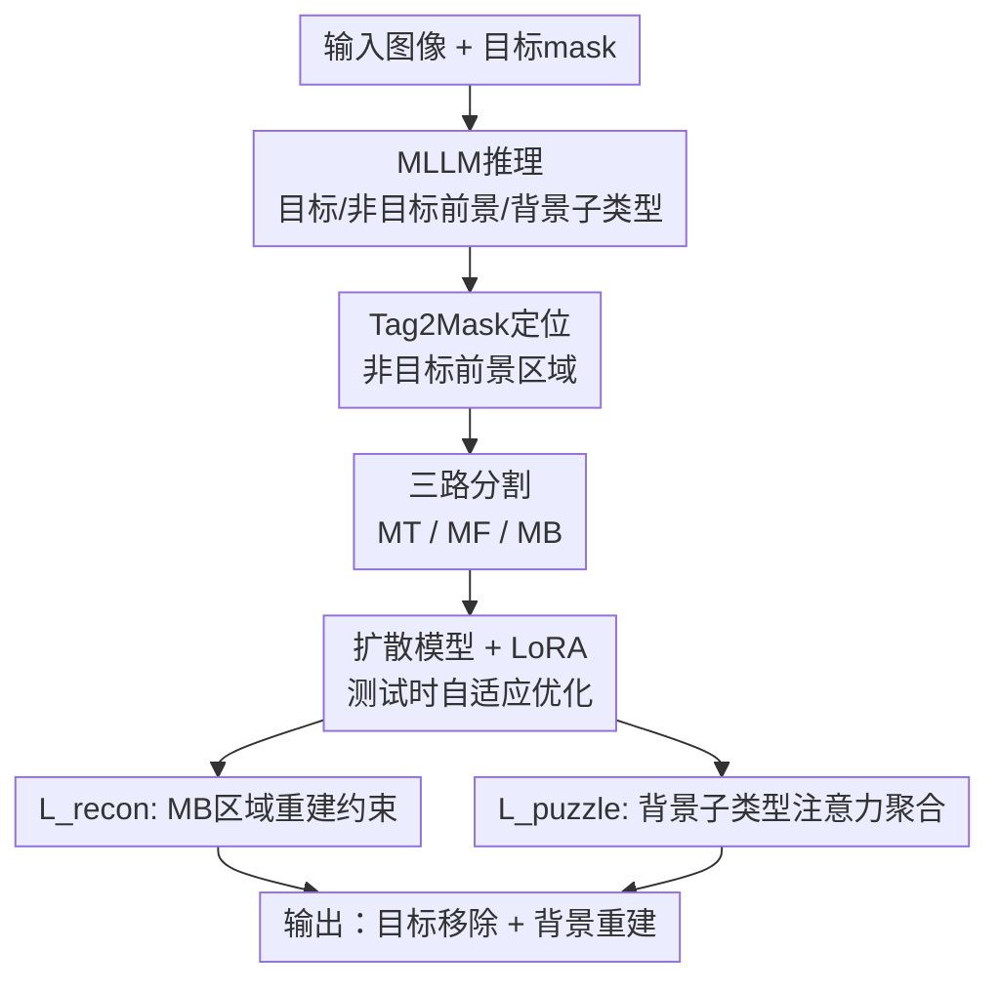

# EraseLoRA: MLLM-Driven Foreground Exclusion and Background Subtype Aggregation for Dataset-Free Object Removal

**会议**: ECCV 2026  
**arXiv**: [2512.21545](https://arxiv.org/abs/2512.21545)  
**代码**: [https://shjo-april.github.io/EraseLoRA](https://shjo-april.github.io/EraseLoRA) (有)  
**领域**: 多模态VLM / 图像恢复  
**关键词**: 物体移除, 背景感知推理, MLLM, 测试时自适应, LoRA, 扩散模型, 无数据集

## 一句话总结
EraseLoRA 提出一种无数据集的物体移除框架：先用 MLLM 对单张图像做三路分割（目标前景 / 非目标前景 / 背景子类型），再通过测试时 LoRA 自适应优化将多个背景子类型聚合重建到 mask 区域，全程不需要任何训练数据、不做 self-attention 的显式遮挡或重定向，在背景保真度上比此前 dataset-free 方法提升至少 23%、前景再生率近乎减半，且超越所有 dataset-driven 方法。

## 研究背景与动机
物体移除（object removal）不同于普通图像修补（inpainting）：后者只需在缺失区域生成"看起来合理"的内容，而物体移除必须消除被 mask 的目标、同时恢复被遮挡的背景，并且保证背景的结构和上下文保真度。近两年出现了一类 dataset-free 的扩散模型物体移除方法（如 DesignEdit、AttentiveEraser），它们不依赖配对训练数据，而是对扩散模型的 self-attention 做手术——在 mask 区域内阻断或重定向 self-attention，迫使模型只参考 unmask 区域的上下文来填充 mask。这类 attention surgery 方法在简单场景下有效，但存在两个根本性缺陷。第一，它们把整个 mask 区域当作唯一的前景，将 mask 外的非目标物体（non-target foreground）误判为背景来参考，导致那些不该出现的物体被"再生"到 mask 里。第二，它们对注意力施加统一约束，不区分背景的不同子类型（如天空、草地、路面），结果就是纹理模糊、结构错位、不同子类型之间出现不自然的边界。

这两个缺陷的共同根源是**缺乏显式的背景感知推理（background-aware reasoning）**——模型根本不知道 mask 后面应该是什么背景、mask 外面哪些东西不能拿来当背景参考。EraseLoRA 的核心 idea 是用 MLLM 弥补这个认知缺口：让 MLLM 看图说话，从单张 image-mask pair 中推理出"哪些是目标要删的、哪些是非目标不能参考的、mask 背后可能有哪些背景子类型"，然后把 MLLM 的推理结果作为干净的背景线索，通过测试时 LoRA 自适应注入扩散模型，用两个互补的损失函数引导 mask 区域的重建，全程不做 attention 的显式阻断。

## 方法详解

### 整体框架
EraseLoRA 是一个两阶段的无数据集物体移除框架，输入是一张图像和一个目标 mask，输出是目标被移除、背景被忠实地重建的图像。第一阶段 BFE（Background-aware Foreground Exclusion）利用 MLLM 和 Tag2Mask 模型生成三路分割——目标前景 mask、非目标前景 mask、干净背景 mask——以及背景子类型标签集合。第二阶段 BRSA（Background-aware Reconstruction with Subtype Aggregation）将干净背景线索作为监督，在冻结扩散模型主干的前提下对插入的 LoRA adapter 做测试时优化，通过背景重建损失和背景拼图损失联合驱动 mask 区域的生成。优化完成后 LoRA 权重 merge 回主干，推理时无额外开销。

### 关键设计

**1. BFE：MLLM 驱动的三路前景/背景分割**

此前 dataset-free 方法直接把 mask 外的所有像素当作"背景参考"，这在图中有非目标物体（如要删除一个人，旁边还有一辆车）时是致命的——车会被当作背景纹理参考，进而在 mask 区域再生出一辆车。BFE 的核心动作是让 MLLM 对输入 image-mask pair 做一次场景级推理：识别图中所有语义标签，将 mask 覆盖的物体分类为目标前景（target foreground），将 mask 外、可能引起错误再生的物体分类为非目标前景标签 $\mathcal{F}$，将 mask 后方被遮挡的场景成分分类为背景子类型标签 $\mathcal{B}$。接着对 $\mathcal{F}$ 中的每个标签用 Tag2Mask 模型（默认 Grounding DINO + SAM2）做 pixel-level 定位，取并集得到非目标前景 mask $M_F$。剩余既不在目标 mask $M_T$ 也不在 $M_F$ 的区域即为干净背景 $M_B$。三者在 latent space 中构成空间域 $\Omega$ 的完备划分：$\Omega = M_T \cup M_F \cup M_B$。

这个显式的三路分割一举解决"非目标前景被误认为背景"的问题——$M_F$ 标注的像素直接被排除在 BRSA 阶段的背景参考之外，不会成为扩散模型填充 mask 时的注意力来源。

**2. 背景重建损失 L_recon：用干净背景锚定重建保真度**

BFE 给出了高置信度的干净背景区域 $M_B$，BRSA 的核心设计之一就是在这片区域上施加一个简单直接的 reconstruction loss，把扩散模型的输出 latent $\hat{z}$ 约束到输入 latent $z$ 上：$\mathcal{L}_{\text{recon}} = \frac{1}{|M_B|}\sum_{p \in M_B} \|\hat{z}[p] - z[p]\|_2^2$。这和传统 inpainting 里的"可见区域不动"逻辑一脉相承，但关键在于这里的 $M_B$ 是经过 MLLM 推理后排除了非目标前景的——它是真正的干净背景，而非此前方法里那个"mask 外全算背景"的粗糙集合。单独使用 L_recon 即可将 BG Sim. 从 0.605 提升到 0.736（+21.7%），说明仅靠干净背景锚定就能大幅改善重建质量。

**3. 背景拼图损失 L_puzzle：把背景子类型当拼图块，逐片对位**

L_recon 虽然保住了干净背景的保真度，但它不管 mask 内部不同背景子类型怎么"拼"到一起——比如草地和路面交界处容易出现错位、或某个子类型（如广告牌纹理）根本就没填进去。L_puzzle 的设计动机很直白：把 MLLM 推理出的每个背景子类型标签 $b \in \mathcal{B}$ 看作一块拼图片，要求所有拼图片的注意力热力图在空间上的最大响应位置，集中在"合法区域"（即 $M_T \cup M_B$）上，而远离非目标前景区域 $M_F$。

具体做法是：对每个背景标签 $b$，从扩散模型各层各头的 cross-attention 中提取 token 对应的空间注意力图 $A_b[p]$（先对各层各头各 token 取均值得到 $\tilde{A}_b$，再做跨标签 softmax 归一化，温度 $\tau=100$），然后取所有背景标签在每个位置上的最强响应 $A^{\text{dom}}[p] = \max_{b \in \mathcal{B}} A_b[p]$。L_puzzle 就是 $A^{\text{dom}}$ 与合法区域二值指示 $\mathbf{1}_{M_T \cup M_B}$ 之间的 soft Dice loss：$\mathcal{L}_{\text{puzzle}} = 1 - \text{Dice}(A^{\text{dom}}, \mathbf{1}_{M_T \cup M_B})$。Dice 系数定义为 $\frac{2\sum_p X[p]Y[p]}{\sum_p X[p] + \sum_p Y[p] + \epsilon}$。

这个损失的效果是"软引导"而非"硬阻断"：它不禁止注意力看向 $M_F$，而是通过最大化 Dice 重叠来鼓励注意力集中在合法区域，从而让每个背景子类型的纹理在 mask 内各就各位。消融实验也验证了这一点——单独用 L_puzzle 效果差（BG Sim. 0.561），因为它没有 L_recon 的显式像素监督，但和 L_recon 联合使用时达到最优（BG Sim. 0.743）。

**4. 测试时 LoRA 自适应：取代 attention surgery 的软适配方案**

此前 dataset-free 方法的核心机制是修改 diffusion 推理过程中的 self-attention——在 mask 内部把 self-attention 权重置零（阻止 mask 内的 token 互相参考），迫使模型完全依赖 unmask 区域。EraseLoRA 完全抛弃了这种硬阻断。BRSA 在扩散主干中插入 LoRA adapter（rank=32），冻结所有原始参数，仅对 LoRA 权重做 500 步测试时优化，优化目标为 $\mathcal{L}_{\text{total}} = \mathcal{L}_{\text{recon}} + 0.2 \cdot \mathcal{L}_{\text{puzzle}}$。优化完成后 LoRA 权重 merge 入主干，推理时参数量、显存、延迟与原始扩散模型完全一致。

这个设计有几个精妙之处。首先，它避开了 attention surgery 的两个固有问题：阻断 self-attention 的短程交互会破坏细粒度纹理、在 patch-level attention 的现代扩散架构（如 SD3.5、FLUX）上会产生棋盘格伪影。其次，LoRA 的低秩适配本质上是一种"为当前图像定制扩散行为"的方式——它让模型学会在当前场景中把 BFE 给出的干净背景线索注入 mask 区域，而非粗暴地禁止某些 token 互看。最后，LoRA 的可插拔性意味着 EraseLoRA 可以搭载任意扩散主干（论文在 SD1.5、SDXL、SD3.5-M、FLUX.1 上均验证有效），且模型无关。

### 损失函数 / 训练策略
总损失 $\mathcal{L}_{\text{total}} = \mathcal{L}_{\text{recon}} + 0.2 \cdot \mathcal{L}_{\text{puzzle}}$。测试时自适应 500 iterations，LoRA rank=32，冻结扩散主干所有参数，仅优化 LoRA adapter。MLLM 默认 InternVL3-78B，Tag2Mask 默认 Grounded SAM2。所有 backbone 的推理配置（scheduler、guidance scale、resolution、采样步数）保持不变。LoRA 优化完成后权重 merge 入主干，推理零额外开销。

## 实验关键数据

### 主实验
在两个 benchmark（OpenImages V7 200 样本 + RORD 343 帧）上对比，指标为 BG Sim.（背景相似度，越高越好）、FG Sim.（前景相似度，越低越好）和 BG Pres.（背景保留度，越高越好）。三指标均基于 DINOv3 特征 cosine 相似度计算。

| 方法 | OpenImages BG Sim.↑ | OpenImages FG Sim.↓ | OpenImages BG Pres.↑ | RORD BG Sim.↑ | RORD FG Sim.↓ | RORD BG Pres.↑ |
|------|---------------------|---------------------|----------------------|---------------|---------------|----------------|
| SD3.5-M (baseline) | 0.605 | 0.286 | 0.934 | 0.582 | 0.319 | 0.907 |
| + AttentiveEraser | 0.559 | 0.276 | 0.931 | 0.541 | 0.302 | 0.901 |
| + DesignEdit | 0.600 | 0.255 | 0.933 | 0.597 | 0.273 | 0.908 |
| **+ EraseLoRA** | **0.743** | **0.151** | 0.924 | **0.779** | **0.138** | 0.901 |
| | | | | | | |
| SDXL-Inpainting | 0.677 | 0.212 | 0.742 | 0.645 | 0.234 | 0.720 |
| PowerPaint | 0.669 | 0.217 | 0.719 | 0.729 | 0.176 | 0.687 |
| CLIPAway | 0.656 | 0.223 | 0.713 | 0.744 | 0.156 | 0.705 |
| SmartEraser | 0.709 | 0.185 | 0.727 | 0.768 | 0.148 | 0.672 |
| EntityErasure | 0.679 | 0.204 | 0.728 | 0.766 | 0.175 | 0.716 |

EraseLoRA 在 BG Sim. 上相对 baseline 提升 +0.14（OpenImages，约 23%）和 +0.20（RORD，约 34%），FG Sim. 近乎减半（0.286→0.151 和 0.319→0.138），且超越所有 dataset-driven 方法。BG Pres. 维持在约 0.90，比 dataset-driven 方法高出约 0.18，说明 EraseLoRA 几乎只修改 mask 区域、不动背景。

在额外的 GPT-Metric 评估中，EraseLoRA 的 GPT-Success 达到 71.0%（OpenImages）和 81.3%（RORD），远超 DesignEdit 的 24.8%/10.2% 和 SmartEraser 的 59.5%/75.8%，验证了从语义层面物体确实被移除且背景重建合理。

### 消融实验

| 实验配置 | BG Sim.↑ | FG Sim.↓ | 说明 |
|---------|----------|----------|------|
| **BFE 对 prior 方法的即插即用** | | | |
| AttentiveEraser (baseline) | 0.559 | 0.276 | 不做前景排除 |
| + BFE | 0.596 | 0.252 | BG Sim.+6.6%, FG Sim.-8.6% |
| DesignEdit (baseline) | 0.600 | 0.255 | 不做前景排除 |
| + BFE | 0.603 | 0.251 | 提升有限（DesignEdit 本身有部分 mask 内自注意力阻断） |
| | | | |
| **BRSA 损失函数消融** | | | |
| SD3.5-M (无 EraseLoRA) | 0.605 | 0.286 | baseline |
| + 仅 L_recon | 0.736 | 0.158 | 干净背景锚定，BG +21.7% |
| + 仅 L_puzzle | 0.561 | 0.278 | 缺显式像素监督，效果差于 baseline |
| + L_recon + L_puzzle (完整) | 0.743 | 0.151 | 最优，二者互补 |

### 关键发现
- **L_recon 是保真度的主力**：单独使用即带来 +21.7% BG Sim. 提升，这表明 BFE 给出的干净背景 mask 质量很高、锚定效果显著。L_puzzle 单独使用反而劣于 baseline，因为它只是软引导注意力分布、没有显式像素约束，无法独立驱动高质量重建。
- **BFE 的即插即用性很强**：将 BFE 接到 AttentiveEraser 和 DesignEdit 上，不修改二者的推理管线即可获得 6.6% BG Sim. 提升和 8.6% FG Sim. 下降，证明非目标前景误判确实是此前方法的普遍瓶颈。
- **MLLM 规模不是关键瓶颈**：LLaVA-7B（7B 参数）即可达到 BG Sim. 0.728、FG Sim. 0.164，与 Qwen2.5-VL-72B（BG Sim. 0.726）基本持平。背景感知推理能力（能否准确分类背景子类型）比模型规模更重要。
- **跨 backbone 泛化**：在 SD1.5、SDXL、SD3.5-M、FLUX.1 四个差异巨大的扩散架构上，EraseLoRA 均带来至少 17.8% BG Sim. 提升和 28.8% FG Sim. 下降，且 text-to-image 对齐能力越强的 backbone 收益越大。
- **推理效率**：LoRA 权重 merge 后推理延迟与原始 SD3.5-M 相同（4s），显存 30.9GB（测试时优化阶段需要额外 9GB，但推理时 merge 后无额外开销）。采用 early stopping（约 141 iterations）可保持 96.5% 的 BG Sim. 同时将优化时间缩短 3.5x。

## 亮点与洞察
- **用 MLLM 推理"看不见的东西"是本文最巧妙的思路**：传统 MLLM 在图像编辑中用于描述可见内容或生成新内容，EraseLoRA 首次让 MLLM 推理被遮挡的背景——模型看不到 mask 后面是什么，但可以通过场景上下文（如"这是一条马路，mask 盖住了人，后面应该是路面"）推断出背景子类型。这种"从可见推不可见"的 reasoning 方向值得在其他遮挡相关任务（如视频目标移除、全景分割补全）中复用。
- **软引导优于硬阻断的思想值得推广**：此前 dataset-free 方法都在 attention 矩阵上做"手术"（置零、重定向），EraseLoRA 证明了通过损失函数软引导注意力分布（Dice loss 让背景子类型注意力的 dominant map 对齐合法区域）是一种更稳健、更通用的替代方案。这一思想可以迁移到其他需要控制扩散模型注意力流向的任务——比如可控生成中想让某些 token 关注特定区域、但不希望硬性阻断破坏生成质量时，软引导 loss 是一种轻量且有效的选择。
- **BFE 的即插即用性揭示了一个通用改进路径**：三路分割（目标/非目标/背景）这一操作不依赖任何特定方法，可以作为一个预处理模块直接接入几乎所有物体移除 pipeline——无论是 dataset-free 还是 dataset-driven。论文通过 BFE+AttentiveEraser 和 BFE+DesignEdit 的实验证明了这一点。
- **LoRA 作为测试时自适应的载体很优雅**：常规的测试时自适应（TTA）需要更新模型参数或维护额外的优化状态，而 LoRA adapter 在优化后可以直接 merge 回主干权重，推理时零额外开销。此外 LoRA 的低秩约束天然防止过拟合到单张图像——rank=32 在 500 步优化中既是够用的表达能力，又不至于让模型"记住"当前图像的具体噪声模式。

## 局限与展望
- **测试时优化耗时**：每张图平均 3 分钟（SD3.5-M、500 iterations），虽然通过轻量 MLLM + early stopping 可降至约 40 秒，但仍然不是"秒级交互"体验。这是 TTA 范式的固有代价。实际 deployment 中可以按场景预计算：同一背景上下文的多次移除可复用同一次优化（如视频帧共享）。
- **MLLM 推理的不确定性**：在复杂场景（语义边界模糊、严重遮挡）中 MLLM 可能给错背景子类型标签或漏标非目标前景，导致残留痕迹。论文提出的 interactive control 模式（用户手动标注非目标前景 + 指定背景标签）是一种务实的补救方案，但增加了人工干预。
- **物理效果（阴影、反射）不在 mask 内时不处理**：物体移除后如果物体的阴影、反光等物理效果在初始 mask 之外，会留下痕迹。论文建议扩展 interactive mask 覆盖效果区域，但这依赖用户判断。
- **仅在 2D 图像上验证**：论文将视频物体移除非为未来方向，思路是"背景上下文跨帧共享可以摊销逐帧优化成本"——这确实是一个自然的扩展方向，且实验初步验证了单帧优化的 LoRA 可复用于同场景其他帧。但光流一致性、时序闪烁等问题尚未涉及。
- **未讨论 MLLM 推理和 diffusion 生成之间的 failure propagation**：如果 MLLM 推理错误（如把非目标前景误标为背景子类型），该错误会通过 Tag2Mask 和 BRSA 损失函数传播到最终生成结果。论文的 hallucination-mitigated MLLM 实验（MARINE）显示效果反而下降，说明当前最优策略仍是使用背景感知能力最强的 MLLM 而非幻觉最少的——这里的微妙权衡值得深入研究。

## 相关工作与启发
- **vs DesignEdit / AttentiveEraser（dataset-free attention surgery）**：它们的核心机制是在 self-attention 中阻断 mask 内 token 的相互交互，EraseLoRA 完全不做 attention 阻断，而是通过 MLLM 推理提供干净背景线索 + 测试时 LoRA 优化来实现移除。这一路线切换的代价是每张图需要约 3 分钟优化，收益是消除 attention 阻断带来的纹理模糊和棋盘格伪影。对追求质量的离线场景（如照片后期、影视后期），这个 trade-off 是值得的；对实时交互场景则不然。
- **vs SmartEraser / EntityErasure（dataset-driven 物体移除）**：这类方法在大规模配对数据上训练移除先验，优点是推理快（2-3 秒），缺点是不区分非目标前景和背景（和 attention surgery 方法一样会把非目标物体当背景参考）、且会扰动 mask 外区域（BG Pres. 约 0.72 vs EraseLoRA 的约 0.90）。这提示一个有趣的方向：能否把 EraseLoRA 的 BFE 三路分割思想融入 dataset-driven 方法的训练数据构造中——给配对数据也标注非目标前景，让训练出的模型天然具备前景排除能力。
- **vs MLLM 用于图像编辑（GenArtist / FireEdit / Chain-of-Zoom）**：此前工作用 MLLM 理解可见场景、生成编辑指令或填充新内容，本质是"看图生成"。EraseLoRA 用 MLLM 做"看图推理被挡住的东西"，这是对 MLLM 能力边界的一次有趣的推进——它检验了 MLLM 是否具备"补全被遮挡场景"的常识推理。这个方向可以启发更多"逆向推理"任务，如去水印、去马赛克、全景分割中被遮挡物体的补全。

## 评分
- 新颖性: ⭐⭐⭐⭐⭐ 首次将 MLLM 用于"推理被遮挡背景"而非"理解可见前景"，dataset-free 物体移除从 attention surgery 范式切换到 MLLM+TTA 范式，思路新颖
- 实验充分度: ⭐⭐⭐⭐⭐ 两个 benchmark + 配对 benchmark + GPT-Metric、跨 4 个 diffusion backbone + 4 个 MLLM + 4 个 Tag2Mask 的灵活性实验、损失消融、即插即用验证、LoRA rank/迭代数超参搜索、early stopping 效率分析、视频扩展初步验证，非常全面
- 写作质量: ⭐⭐⭐⭐ 结构清晰，图表示意到位，对 attention surgery 缺陷的分析（附录 B.2）很有说服力；附录篇幅较长，部分内容可精简
- 价值: ⭐⭐⭐⭐⭐ 即插即用、模型无关、超越 dataset-driven 方法——这三个属性意味着 EraseLoRA 可以迅速被社区 adopt 并整合到各种下游应用中；BFE 的三路分割思想对相关任务的通用启发价值也很高

<!-- RELATED:START -->

## 相关论文

- [\[ICML 2026\] Detached Skip-Links and $R$-Probe: Decoupling Feature Aggregation from Gradient Propagation for MLLM OCR](../../ICML2026/multimodal_vlm/detached_skip-links_and_r-probe_decoupling_feature_aggregation_from_gradient_pro.md)
- [\[CVPR 2026\] HAMMER: Harnessing MLLM via Cross-Modal Integration for Intention-Driven 3D Affordance Grounding](../../CVPR2026/multimodal_vlm/hammer_harnessing_mllm_via_cross-modal_integration_for_intention-driven_3d_affor.md)
- [\[ECCV 2024\] Elysium: Exploring Object-level Perception in Videos via MLLM](../../ECCV2024/multimodal_vlm/elysium_exploring_object-level_perception_in_videos_via_mllm.md)
- [\[CVPR 2026\] MODIX: A Training-Free Multimodal Information-Driven Positional Index Scaling for Vision-Language Models](../../CVPR2026/multimodal_vlm/modix_a_training-free_multimodal_information-driven_positional_index_scaling_for.md)
- [\[ECCV 2026\] Rank-Aware Hyperbolic Alignment for Vision–Language Dataset Distillation](rank-aware_hyperbolic_alignment_for_vision-language_dataset_distillation.md)

<!-- RELATED:END -->
