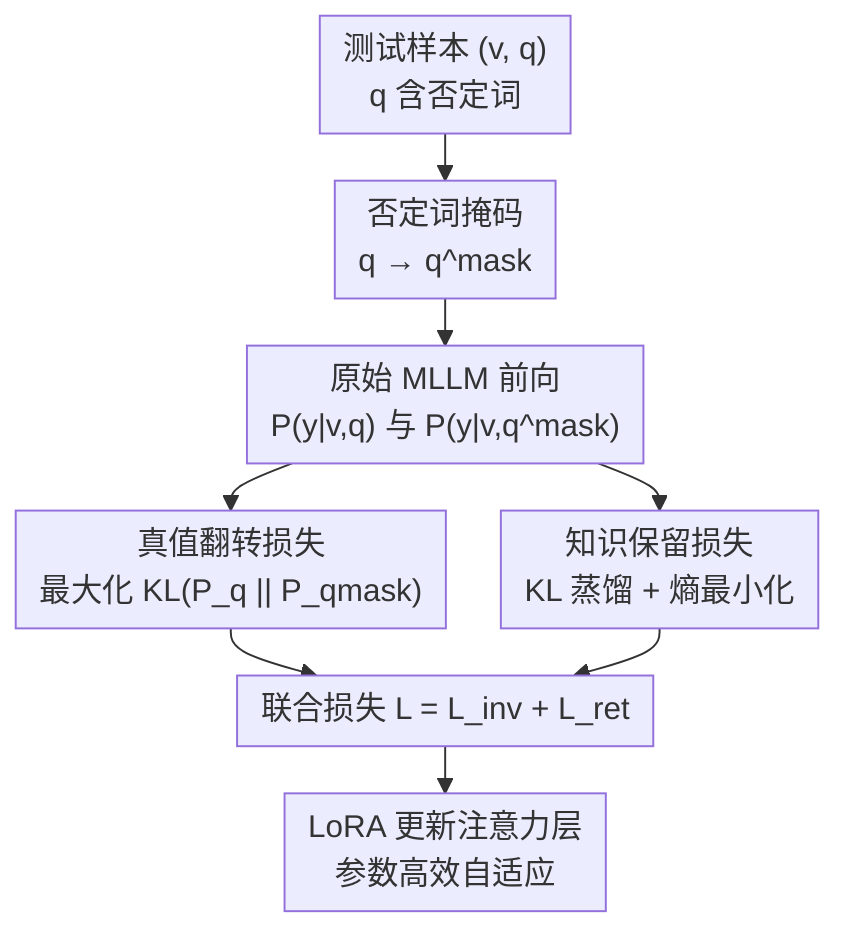

# Evaluating and Enhancing Negation Comprehension in Remote Sensing MLLMs

**会议**: ECCV 2026  
**arXiv**: [2606.20177](https://arxiv.org/abs/2606.20177)  
**代码**: [https://hhc1997.github.io/RS-Neg-and-NeFo/](https://hhc1997.github.io/RS-Neg-and-NeFo/)  
**领域**: 多模态VLM  
**关键词**: 否定理解, 遥感多模态大模型, 测试时自适应, 基准数据集, 真值翻转

## 一句话总结
针对遥感 MLLM 在否定查询下性能严重退化的问题，本文构建首个遥感否定理解基准 RS-Neg（22K 样本，覆盖区域级到场景级四类任务），并提出测试时自适应方法 NeFo，将否定的逻辑角色（真值翻转算子）显式建模为优化目标，仅用约 5% 无标签测试样本即可显著提升多个基座模型的否定理解能力，并在未见任务上展现强泛化性。

## 研究背景与动机
多模态大模型在遥感任务中取得了显著进展，但其否定理解能力几乎未被探索。否定是自然语言的基本组成部分——人类 18 个月大的婴儿就能通过否定句理解新物体——然而即使 70B 参数的 MLLM 在处理否定时也会出现严重性能退化。这一问题在遥感场景中尤为关键：灾害监测中需要回答「有多少建筑未被洪水淹没」，交通规划中需要定位「未被冰覆盖的路线」。误解否定可能直接导致与用户意图相反的输出，带来严重安全隐患。

现有否定评估工作（NegVQA、GaslightingBench、NegBench 等）均聚焦通用领域自然图像，其数据生成管线无法直接适配遥感图像中的小尺寸目标（通常小于 32x32 像素）和细粒度属性/状态级推理需求（如「未被冰覆盖的道路」涉及状态级否定而非简单对象缺失）。由此产生两个核心问题：(1) 如何全面评估遥感 MLLM 的否定理解能力？(2) 如何增强 MLLM 在否定查询下的鲁棒性？

核心 idea：将否定在语言学中的逻辑角色——一个翻转命题真值的一元算子——显式编码为测试时优化目标，通过最大化否定句与其去否定变体之间的输出差异来驱动模型关注否定语义，同时用原始模型做教师仅对肯定查询做知识蒸馏以避免固化错误。

## 方法详解

### 整体框架
本文包含两部分核心贡献。第一部分是 RS-Neg 基准的自动构建管线：从现有遥感图文数据集出发，用 LLM 从描述文本中提取对象/属性/状态并生成候选否定概念，再通过基于 MCTS 的动态视觉聚焦（DyFo）逐概念验证这些否定元素在图像中确实不存在，最后用 LLM 将过滤后的否定描述转化为 VQA、MCQ、Visual Grounding 和 Scene Classification 四类任务数据，共 22,464 个样本。第二部分是 NeFo 测试时自适应方法：给定含否定的测试查询，先用词法规则掩码掉否定词得到去否定变体，然后通过真值翻转损失（最大化两个变体的输出 KL 散度）和知识保留损失（对去否定变体做 KL 蒸馏 + 熵最小化）联合优化 LoRA 参数，以完全自监督的方式在测试时提升模型对否定的敏感度。

### 关键设计

**1. RS-Neg 自动否定数据管线：解决遥感小目标否定验证难题**

现有否定数据生成方法依赖全局图像感知，面对遥感图像中小于 32x32 像素的目标时几乎失效——论文附录 B 显示，即使 Claude Opus 4.5 也会在此类场景下出错。本文的管线分三步解决这个问题。第一步，LLM 解析图文对的描述文本，提取其中提及的对象、属性（颜色/形状）和状态（动作/条件），然后生成「与上下文语义相关但描述中未出现」的候选否定概念。第二步，使用 DyFo（Dynamic Focus）进行视觉验证：对对象级否定，直接用 Grounding DINO 做存在性检测；对属性/状态级否定，将其与对应对象组合为 MCTS 搜索的根节点，交替执行语义聚焦（视觉专家定位并裁剪目标区域）和空间放大（对裁剪区域逐级放大以做实例级检查），由 Qwen2.5-VL-7B 对每个搜索节点评分并引导方向。第三步，LLM 将过滤后的否定概念转化为任务特定格式：VQA 构造是非问句（如「这张图是否展示了没有 {neg_object} 的 {pos_object}？是」），MCQ 为一个正确描述加三个干扰项（至少一个含否定），Grounding 保留原 bbox 但修改描述引入否定，分类任务用规则将否定标签作为干扰项加入。LLM 重述增加了语言多样性，避免模型过拟合到固定的否定模板。

**2. 真值翻转损失：将否定的逻辑语义编码为优化信号**

从语言逻辑学角度看，否定是一个翻转命题真值的一元算子——「区域被洪水淹没」与「区域未被洪水淹没」的理想输出应当截然相反。NeFo 将这一直觉形式化为真值翻转损失：给定含否定查询 $q$，先用词法规则掩码掉否定词（英语否定词有限：no, not, without 等）得到去否定变体 $q^{mask}$，然后最大化两者输出分布的 KL 散度：

$$\mathcal{L}_{inv} = -\max\left(\mathbb{D}_{\text{KL}}[\mathcal{P}_{\Theta}(y|v,q) \| \mathcal{P}_{\Theta}(y|v,q^{mask})], \alpha\right)$$

其中 $\alpha$ 是截断参数（设为 0.4）以保证训练稳定。这个损失放大了仅因否定词存在与否而产生的输出差异，迫使模型将注意力集中到否定相关的语义信息上。与需要人工标注或教师模型的方法不同，该信号完全自监督——只需知道查询中否定词的位置即可。

**3. 知识保留损失：防止测试时自适应的灾难性遗忘**

TTA 的核心风险是模型在适应测试分布时丢失预训练知识。NeFo 采用双重策略规避此问题。第一，用原始模型（冻结参数）作为教师，仅对去否定变体 $q^{mask}$ 做 KL 蒸馏，而非对含否定的查询——因为原始模型在否定查询上本身就可能产生噪声输出，蒸馏其否定预测反而会固化错误。第二，加入熵最小化辅助目标，使模型对肯定输入的预测更自信，同时为 $\mathcal{L}_{inv}$ 提供更稳定的对照锚点：

$$\mathcal{L}_{ret} = \beta \mathbb{D}_{\text{KL}}[\mathcal{P}_{\Theta^o}(y|v,q^{mask}) \| \mathcal{P}_{\Theta}(y|v,q^{mask})] + \gamma \mathcal{H}(\mathcal{P}_{\Theta}(y|v,q^{mask}))$$

其中 $\beta$ 和 $\gamma$ 均为平衡系数（默认 0.4）。最终联合优化 $\min_{\tilde{\Theta}} \mathcal{L} = \mathcal{L}_{inv} + \mathcal{L}_{ret}$，仅更新 LLM 模块中注意力层的 LoRA 参数（rank=8, scale=16），可训参数量仅约 2.5M，极为轻量。

**4. 轻量级在线自适应策略：最小数据需求下的实用部署方案**

针对真实遥感部署场景中模型需快速适应的需求，NeFo 采用在线学习模式：仅使用极少量测试样本（VQA 用 150 个，MCQ 用 300 个，约占全测试集 5%）进行 LoRA 微调，然后报告全测试集性能。训练使用 AdamW 优化器，batch size=1。这一设计的实用价值在于：遥感场景中标注数据极其昂贵，而 NeFo 完全不依赖任何人工标注——仅用无标签的测试查询本身即可完成自适应，非常适合边缘设备或无人机遥感等资源受限场景。跨模型规模实验进一步验证了其普适性，从 2B 到 32B 的 Qwen3-VL 系列均能获得一致提升。

### 一个完整示例

以 RS-Neg VQA 中的一个具体样本说明 NeFo 的工作流程。输入为一张洪水灾后遥感图像 $v$ 和查询 $q$：「Is there any building not flooded?」（是否存在未被洪水淹没的建筑？）。

第一步，词法掩码：识别并移除否定词 "not"，得到去否定变体 $q^{mask}$：「Is there any building flooded?」。

第二步，原始 MLLM（如 Qwen2.5-VL-7B）对两个变体分别做前向推理。假设含否定的 $q$ 对应的输出分布为 "Yes" 概率 0.35、"No" 概率 0.65；去否定的 $q^{mask}$ 对应分布为 "Yes" 概率 0.82、"No" 概率 0.18。理想情况下两者应截然相反——如果建筑确实被洪水淹没，$q^{mask}$ 应回答 "Yes" 而 $q$（问的是「未被淹没」）应回答 "No"。

第三步，计算损失。$\mathcal{L}_{inv}$ 计算两个分布的 KL 散度并取负以最大化分歧（受 $\alpha=0.4$ 截断保护）；$\mathcal{L}_{ret}$ 则让当前模型对 $q^{mask}$ 的预测逼近冻结的原始模型的预测分布，同时最小化熵使预测更尖锐。

第四步，梯度仅通过 LoRA 低秩矩阵回传，注意力层的 adapter 参数被更新。经过在 150 个 VQA 样本上约数轮迭代，模型学会在遇到否定词时系统性地翻转其输出逻辑，而不会遗忘对肯定查询的正确响应。

### 损失函数 / 训练策略

总损失为两项之和 $\mathcal{L} = \mathcal{L}_{inv} + \mathcal{L}_{ret}$。其中 $\mathcal{L}_{inv}$ 带截断参数 $\alpha=0.4$ 防止 KL 散度过大导致训练不稳定；$\mathcal{L}_{ret}$ 中 $\beta=0.4$ 控制知识保留强度，$\gamma=0.4$ 控制熵最小化强度。关键训练策略：(1) 完全自监督，无任何人工标注；(2) TTA 期间原始模型参数冻结，仅更新 LoRA 参数（rank=8, scale=16，约 2.5M）；(3) 对 MCQ 数据，每个选项转化为「Does this caption describe the image?」的是非判断格式，仅包含否定词的样本参与训练；(4) 各基座模型的学习率和 $\gamma$ 调优设置见论文附录 E。

## 实验关键数据

### 主实验

在 RS-Neg VQA 和 RS-Neg MCQ 上对比 NeFo 与三种 SOTA TTA 方法（Tent、SAR、TLM）。下表展示四个代表性基座模型在否定查询下的总体准确率。

| 基座模型 | 方法 | RS-Neg VQA (total) | RS-Neg MCQ (total) |
|---------|------|-------------------|-------------------|
| Qwen2.5-VL-7B | Baseline | 74.96 | 54.29 |
| | + Tent | 73.09 | 55.77 |
| | + SAR | 65.21 | 55.52 |
| | + TLM | 69.30 | 49.43 |
| | **+ NeFo** | **79.52** | **65.46** |
| Qwen3-VL-7B | Baseline | 71.47 | 57.30 |
| | **+ NeFo** | **75.42** | **64.55** |
| RS-LLaVA-7B | Baseline | 73.15 | 23.72 |
| | **+ NeFo** | **74.75** | **24.46** |
| GeoReason-7B | Baseline | 67.30 | 45.59 |
| | **+ NeFo** | **69.76** | **53.39** |

核心发现：(1) 现有 TTA 方法在否定查询下普遍导致性能下降，因为它们会自我强化错误预测；(2) NeFo 在所有基座模型上取得一致提升，Qwen2.5-VL 的 MCQ 提升高达 11.17%；(3) 按否定类型看，对象级否定提升最大（如 Qwen2.5-VL VQA 对象 +6.07），状态级否定提升温和（+1.22），因状态级需上下文推理，本质上更难。

零样本泛化结果进一步证明 NeFo 学到的是可迁移的否定理解能力。以 Qwen2.5-VL 为例，经 MCQ 数据 TTA 后的模型在未见过的 RS-Neg 分类任务上从 60.37 提升至 66.63（+6.26%），在 RS-Neg Grounding IoU@0.5 上从 54.03 提升至 63.37（+9.34%），在真实洪水灾害数据集 FloodNet VQA 上从 37.32 提升至 57.47（+20.15%）——这一巨大跃升直接体现了否定理解对实际救灾场景的实用价值。

### 消融实验

以 Qwen2.5-VL-7B 为基座，逐一消融 NeFo 的三个核心组件：真值翻转损失（TI）、知识保留损失（KR）、熵最小化（EM）。

| 配置 | RS-Neg VQA (total) | RS-Neg MCQ (total) | 关键发现 |
|------|-------------------|-------------------|------|
| Base (Qwen2.5-VL) | 74.96 | 54.29 | 未适配基线 |
| NeFo w/o TI | 74.05 | 57.78 | VQA 去掉 TI 几乎无提升，TI 是 VQA 核心驱动力 |
| NeFo w/o EM | 76.84 | 29.06 | 去掉 EM 对 MCQ 灾难性（-36.40），熵最小化为肯定预测提供稳定锚点 |
| NeFo w/o KR | 77.82 | 22.71 | 去掉 KR 对 MCQ 最致命（-42.75），模型过拟合并灾难性遗忘 |
| **NeFo (full)** | **79.52** | **65.46** | 三个组件协同工作 |

关键发现：(1) 不同任务对各组件敏感度截然不同——VQA 中 TI 最关键（去掉后几乎无提升），MCQ 中 KR 和 EM 不可或缺；(2) MCQ 涉及肯定和否定描述的混合判别，去掉 KR 后模型在 TTA 中丢失对肯定描述的判别力，性能崩塌至 22.71%，远低于基线 54.29%；(3) 即使保留 KR 和 TI，去掉 EM 后 MCQ 仍从 65.46% 暴跌至 29.06%，因为模型对肯定输入的预测变模糊，使得 $\mathcal{L}_{inv}$ 失去稳定的对照锚点。

超参数分析显示 NeFo 对 $\beta$ 不敏感（VQA 准确率在 73.76%-74.75% 窄区间波动），因为很小的 $\beta$ 就足以防止遗忘——TTA 过程中知识保留损失始终接近零。而对 $\gamma$ 更敏感：$\gamma=0.1$ 时 MCQ 下降 7.28%，但在 0.7-1.0 范围内表现稳定。跨模型规模实验表明，最小的 Qwen3-VL-2B 经 NeFo 后在 VQA 上从 64.61 提升至 74.51（+9.9%），逼近 32B 基线（77.70），证明 NeFo 对资源受限场景有极高实用价值。

### 关键发现
- **TI 是 VQA 的核心驱动**：去掉 TI 后 VQA 几乎回到基线水平（74.05 vs 74.96），说明单纯的分布适配无法替代显式的否定逻辑建模。
- **KR 是 MCQ 的生存必需**：MCQ 中模型需同时处理肯定和否定描述，无 KR 时模型过拟合到否定数据上，完全丧失对肯定描述的判别力，验证了论文关于灾难性遗忘的核心论点。
- **小模型收益更显著**：Qwen3-VL-2B 经 NeFo 后 VQA 从 64.61 跃升至 74.51（+9.9%），接近 32B 模型基线水平，证明 NeFo 对边缘设备部署极具吸引力。
- **TTA 数据量存在最优区间**：MCQ 上训练样本从 50 增至 600 时性能持续提升（+17.4%），但增至 700 时出现过拟合和性能崩塌，需减小学习率缓解。

## 亮点与洞察
- **将语言学定义直接转化为优化目标**是本文最巧妙的设计。否定是真值翻转算子这一论断来自 Horn (2001) 的经典语言学理论，但从未有人将其编码为 MLLM 的损失函数。这一「借概念做损失」的思路可迁移到其他逻辑语义（如量化词 all/some、模态词 must/may）的理解增强任务。
- **仅对去否定变体做蒸馏而非原查询**是一个看似细微但至关重要的设计选择。原始模型在否定查询上本身就会出错，蒸馏其否定预测等于固化错误——这一洞察简单却容易被忽略，也是 MCQ 消融中 w/o KR 崩塌至 22.71% 的根本原因。
- **词法掩码的极简主义**：仅用一个否定词词典做掩码，无需复杂 NLP 解析器，证明了在否定词有限的语言（如英语）中，极简方案足以支撑有效的自监督信号。
- **LoRA + TTA 的组合为遥感部署提供了实用路径**：2.5M 参数量、150 个无标签样本、batch size=1 的设置，使该方法可在无人机或边缘设备上几乎实时地完成自适应，无需上传数据到云端。

## 局限与展望
- 词法掩码依赖英语否定词词典（no, not, without 等），无法处理隐性否定（如 rarely、hardly、few）或跨语言的复杂否定形态，在中文等否定表达更多样的语言中可能需要更复杂的掩码策略。
- 状态级否定的提升幅度始终小于对象级否定（VQA 平均 +2.46% vs 对象 +6.07%），暴露出该方法对需要上下文推理的否定类型建模不足。
- 实验主要在 7B-8B 参数规模模型上进行 LoRA 微调（扩展到 32B 时仍有效但增益收窄），尚未验证在 70B+ 模型或全参数微调下的行为。
- RS-Neg 基准数据全部由 LLM 自动生成，缺乏人工标注的质量验证——LLM 生成的否定查询可能存在不自然或逻辑瑕疵，作者未报告人工抽检的质量数据。
- NeFo 需要在测试时做在线学习，无法零样本直接生效，对需要毫秒级响应的实时应用构成了延迟约束。未来可探索将 TTA 中学到的 LoRA 参数固化并入基础模型，实现一次学习、永久受益。
- 未探索 TTA 与训练阶段数据增强（如在预训练或 SFT 阶段加入否定样本）的组合效果，两者可能互补。

## 相关工作与启发
- **vs NegVQA (Zhang et al., 2025)**：NegVQA 针对通用领域构造二选一问题评估否定理解，数据生成依赖全局图像感知；本文针对遥感场景引入 DyFo 处理小目标，并覆盖四类任务，评估维度更全面。
- **vs NegCLIP / CoNCLIP / NegBench**：这些工作通过大规模否定图文对的后训练改善 CLIP 风格嵌入模型的否定理解；NeFo 面向生成式 MLLM 且不需要任何训练标注，采用 TTA 范式避免了昂贵的遥感数据标注成本。
- **vs NEAT (Han et al., 2025)**：NEAT 同样采用 TTA 思路但仅适用于视觉-语言嵌入模型的对齐校正；NeFo 将 TTA 扩展到自回归生成式 MLLM，且首次将否定的逻辑语义显式编码为优化目标，而非仅做分布对齐。
- **vs DyFo (Li et al., 2025)**：DyFo 的 MCTS 视觉搜索被直接用于 RS-Neg 构建管线中的否定概念验证，是一个精巧的技术借用案例，体现了「组合现有工具解决新问题」的工程智慧。

## 评分
- 新颖性: ⭐⭐⭐⭐ 首次将遥感否定理解问题系统化（基准 + 方法），真值翻转损失的设计有语言学理论支撑且实用有效，但整体上是「已知组件（TTA + LoRA + KL）+ 新场景 + 新损失公式」的组合式创新。
- 实验充分度: ⭐⭐⭐⭐⭐ 四个基座模型、三种 TTA 基线、完整消融（逐组件 + 超参数）、跨模型规模扩展（2B-32B）、数据规模扩展分析、三类零样本泛化测试，覆盖全面，结论可信。
- 写作质量: ⭐⭐⭐⭐ 动机清晰（18 个月婴儿的否定理解切入点有感染力），结构合理，核心公式定义明确；部分方法细节（如 DyFo 搜索的具体分支策略）在正文中不够详尽，需查附录。
- 价值: ⭐⭐⭐⭐⭐ 否定的准确理解是遥感 MLLM 走向真实部署（灾害响应、军事侦察、城市规划）的安全关键瓶颈，本文提供了可操作的基准工具和实用的轻量解决方案，5% 数据 + 2.5M 参数的 TTA 方案对资源受限场景极具吸引力。

<!-- RELATED:START -->

## 相关论文

- [\[ECCV 2026\] RSICCLLM: A Multimodal Large Language Model for Remote Sensing Image Change Captioning](rsiccllm_a_multimodal_large_language_model_for_remote_sensing_image_change_capti.md)
- [\[CVPR 2026\] VLM4RSDet: Collaborative Optimization with Vision-Language Model for Enhancing Remote Sensing Object Detection](../../CVPR2026/multimodal_vlm/vlm4rsdet_collaborative_optimization_with_vision-language_model_for_enhancing_re.md)
- [\[ICLR 2026\] PhysLLM: Harnessing Large Language Models for Cross-Modal Remote Physiological Sensing](../../ICLR2026/multimodal_vlm/physllm_harnessing_large_language_models_for_cross-modal_remote_physiological_se.md)
- [\[ICLR 2026\] CityLens: Evaluating Large Vision-Language Models for Urban Socioeconomic Sensing](../../ICLR2026/multimodal_vlm/citylens_evaluating_large_vision-language_models_for_urban_socioeconomic_sensing.md)
- [\[NeurIPS 2025\] CHOICE: Benchmarking the Remote Sensing Capabilities of Large Vision-Language Models](../../NeurIPS2025/multimodal_vlm/choice_benchmarking_the_remote_sensing_capabilities_of_large_vision-language_mod.md)

<!-- RELATED:END -->
