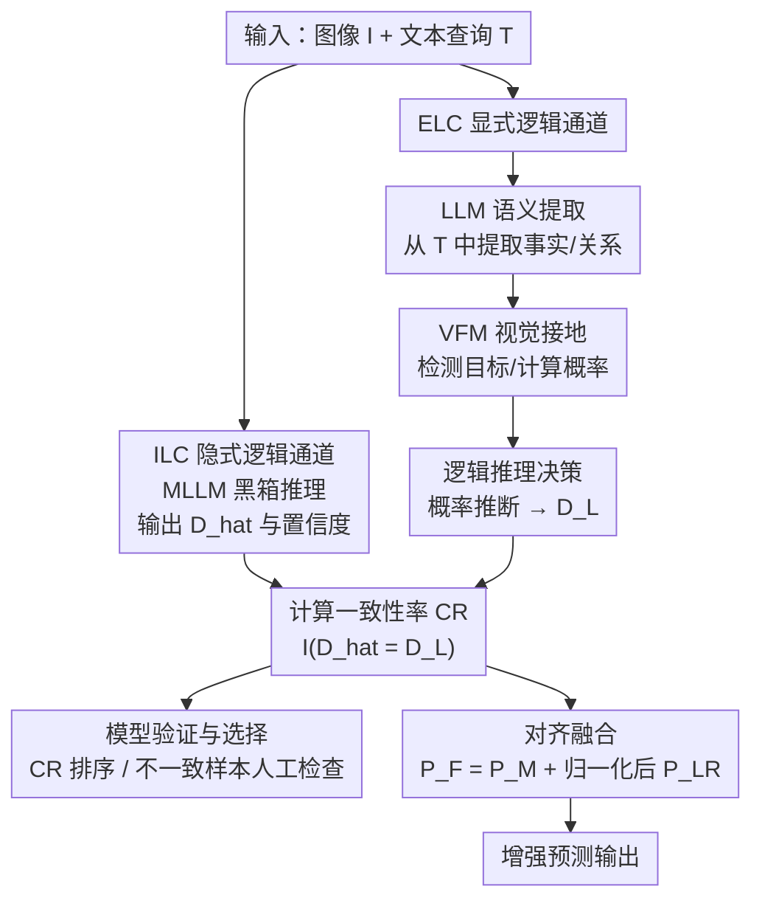

# Explicit Logic Channel for Validation and Enhancement of MLLMs on Zero-Shot Tasks

**会议**: ECCV 2026  
**arXiv**: [2603.11689](https://arxiv.org/abs/2603.11689)  
**代码**: 无  
**领域**: 多模态VLM  
**关键词**: 显式逻辑推理, MLLM验证, 零样本学习, 一致性检验, 视觉接地

## 一句话总结
提出显式逻辑通道（ELC），与 MLLM 黑箱通道（ILC）并行运行，通过 LLM 提取语义事实、VFM 视觉接地、概率逻辑推理三步产生可解释的决策；定义一致性率 CR 作为无标注下的模型质量代理指标，并通过跨通道对齐融合提升零样本 VLC 任务性能，在 3 个 benchmark 上对 11 个 MLLM 验证有效。

## 研究背景与动机
前沿 MLLM 在视觉-语言理解（VLC）任务上表现强劲，但在面向新任务的零样本部署中通常被当作黑箱使用，用户无法判断模型是否可靠、哪个模型最适合当前任务。MLLM 基于统计概率做 next-token 预测，缺乏显式推理过程，容易产生幻觉和事实错误。另一方面，已有工作（Grounded VQA、VideoQA 等）试图通过额外标注（注意力区域、场景图）让模型自我解释，但这些方法依赖标注数据，无法用于无标注的零样本场景。

核心矛盾在于：MLLM 在海量 VL 语料上预训练，隐式地学到了类似人类的推理能力（形成"隐式逻辑通道"ILC），但人类做决策依赖的是显式的事实、关系和逻辑规则。于是本文提出一个并行于 ILC 的显式逻辑通道（ELC），用 LLM 从文本中提取任务相关的事实和关系，用 VFM 将这些事实在图像中接地，再用概率逻辑推理做出可解释的决策。两个通道的一致性天然成为无标注下的模型质量信号。

核心 idea：双通道框架下，ELC 用 LLM+VFM+逻辑推理产生基于显式视觉证据的决策，ILC 与 ELC 的一致性率 CR 可替代 ground-truth 标注用于模型验证、选择和增强。

## 方法详解

### 整体框架
本文要解决的问题是：在零样本、无 ground-truth 标注的条件下，如何判断一个 MLLM 在新 VLC 任务上是否可靠，以及如何进一步提升其性能。整体方案是构建一个双通道并行系统：上通道是 MLLM 原生的黑箱推理（ILC），下通道是本文提出的显式逻辑通道（ELC）。ELC 分三步运作：（1）LLM 根据 prompt 从文本查询中提取任务相关的语义事实 $(\hat{F}_s, \hat{R}_s)$；（2）VFM 将这些事实在输入图像 $I$ 中接地，产生置信概率 $\hat{F}_v$；（3）逻辑推理模块对接地后的事实和关系做概率推断，选出最优决策 $\hat{D}_L = \arg\max_{D \in \mathcal{D}} P_{LR}(D|\hat{F}_v, \hat{R}_s)$。

两个通道独立运行后，计算一致性率 $CR = \frac{1}{|\mathcal{Q}|}\sum_{q \in \mathcal{Q}} \mathbb{I}(\hat{D}(q) = \hat{D}_L(q))$。高 CR 意味着两个通道对知识的覆盖一致，MLLM 更可靠；低 CR 则提示至少一个通道出了问题。CR 反映三种情况：知识被充分覆盖（两通道都对，CR 高）、部分覆盖（一通道对一通道错，CR 中低）、OOD（两通道都错，CR 低）。在一致性子集 $\mathcal{Q}_c$ 上，进一步做对齐融合：用一致样本上的均值置信度 $\mu_{ILC}^c, \mu_{ELC}^c$ 将 ELC 的概率归一化并缩放到 ILC 的量级，融合得分 $P_F(D|q_n) = P_M(D|q_n) + \mu_{ILC}^c[P_{LR}(D|q_n)/\mu_{ELC}^c]$，取最大值作为增强后的预测。

### 关键设计

**1. ELC 通用三步流水线：LLM 语义提取 + VFM 视觉接地 + 概率逻辑推理**

ELC 的核心思路是模仿人类做视觉-语言决策的过程——先理解文本在问什么，再在图像中找证据，最后用逻辑规则得出结论。这与 MLLM 直接从像素和 token 跳到答案的黑箱路径形成鲜明对比。三步各司其职：LLM（如 Mistral/Qwen3）负责语言理解，根据任务定制 prompt 从文本中提取关键语义概念（对象、属性、关系）；VFM（如 GroundingDINO/EvaCLIP）负责视觉接地，对每个提取的概念在图像中定位实例并输出置信概率；逻辑推理模块用概率公式（min/max/几何平均/加权和）将零散的视觉证据聚合成最终决策概率。

这个三步流水线是通用框架，针对不同 VLC 任务只需调整每一步的具体实现（LLM prompt、VFM 类型、后段逻辑公式），不需要任何训练或微调。消融实验表明，ELC 对 LLM 和 VLM 的选型不敏感——换用 Mistral 和 Qwen3.0 做 LLM，CR 和增强后的 Acc 差异均小于 1%。

**2. 事实/反事实概率推理：MC-VQA 场景的显式逻辑**

对于多选 VQA（MC-VQA），正确回答需要同时确认"该有的都有"（事实证据）和"不该有的没有"（反事实证据）。ELC 的做法是：让 LLM 从问题和候选项中提取 positive（pos，图中应存在的）和 negative（neg，图中不应存在的）名词短语；VFM 检测每个名词对应目标的所有实例，取最大检测概率作为该名词的存在概率。

事实证据的概率定义为所有 pos 目标概率的最小值 $P(pos) = \min\{P(O_p^1), \cdots, P(O_p^K)\}$——因为只要有一个"该有的"目标缺失，pos 断言就不成立。反事实证据的概率取所有 neg 目标概率的最大值 $P(neg) = \max\{P(O_n^1), \cdots, P(O_n^L)\}$——因为只要有一个"不该有的"目标出现，neg 断言就被违反。最终逻辑概率对两种证据取几何平均做归一化：$P_{LR}(c|I,T) = [P(pos)(1-P(neg))]^{1/2}$（仅当 pos 和 neg 都不为空时；若一方为空则直接取另一方的值）。ELC 选择 $P_{LR}$ 最高的候选项作为答案。

**3. 关联推理与证据积累：HC-REC 场景的显式逻辑**

HC-REC（Human-Centric Referring Expression Comprehension）的任务是根据文本描述在图像中定位目标人物。本文为两种不同难度的 HC-REC 场景设计了不同的 ELC 逻辑。

对于标准 HC-REC（HC-RefCOCOg，平均 8.9 词），LLM 从描述中提取人物相关和物体相关的名词，VFM 检测所有人/物实例。关键设计是**证据积累**机制：对每个检测到的人物 $h_i$，累加其与各关联物体的匹配得分。关联概率用面积交并比定义：$R_A(o_{kl}, h_i) = A_{int}(o_{kl}, h_i) / A(o_{kl})$，取所有物体实例中最大的关联率为该物体的最终关联概率 $P(O_k|h_i) = \max_l R_A(o_{kl}, h_i)$。人物本身的存在概率 $P(h_i|H)$ 也纳入积累，最终 $P_{LR}(h_i|T) = \frac{1}{K+1}(\sum_{k=1}^K P(O_k|h_i) + P(h_i|H))$。这种从多源视觉证据逐步积累概率的方式，灵感来自感知决策理论（perceptual decision-making）。

对于长文本 HC-REC（HC-RefLoCo，平均 93.2 词），核心挑战不仅是文本长度，更在于大量句子与定位目标人物无关（环境描述、泛泛叙述）。ELC 先让 LLM 将每个句子分为三类：Essential Facts（直接描述目标人物，如衣着/动作）、Non-Essential Facts（描述物体属性但非人物本身）、Environment（环境/场景/其他人）。然后 VFM 检测所有人并裁剪人物 patch，将每个人物 patch 与每个句子组成图文对送入 VLM，获得匹配概率 $P_{VLM}(h_n|S_k)$。最终决策用效用加权：$P_{LR}(h_n|T) = \sum_{k=1}^K P_{VLM}(h_n|S_k) \cdot u(S_k)$，其中 Essential Facts 语句效用权重高，Environment 语句权重极低。这个设计本质上是让模型在零样本条件下模仿人类的常识性注意力——优先相信直接描述目标的句子，弱化无关信息。

**4. 一致性率 CR 与对齐融合：无标注下的评估与增强**

CR 是本文最核心的指标创新。定义简单：在所有测试样本上计算 ILC 与 ELC 预测一致的样本占比。其有效性基于一个关键假设：两个通道共享大量预训练语料的交集，因此对同一输入的理解应该一致；不一致则说明至少一个通道的知识覆盖不足。实验证明 CR 与真实准确率 Acc 高度相关（平均 Pearson's r = 0.9905，Spearman's ρ = 0.9621，Kendall's τ = 0.9091），使 CR 成为无需 gt 标注即可对 MLLM 排名和筛选的可靠代理指标。

对齐融合则利用一致性信号进一步提升性能。首先选出两个通道预测一致的样本子集 $\mathcal{Q}_c$，计算两通道在该子集上的平均置信度 $\mu_{ILC}^c, \mu_{ELC}^c$。对新样本，将 ELC 的概率先除以 $\mu_{ELC}^c$ 归一化，再乘以 $\mu_{ILC}^c$ 对齐到 ILC 的量级，最后与 ILC 概率相加。对于 HC-REC，融合公式扩展为考虑 IoU 加权的版本 $P_F(h_m|T) = P_M(h_m|T) + \max_i [IoU_{mi} \cdot (\mu_{ILC}^c / \mu_{ELC}^c) P_{LR}(h_i|T)]$。实验显示即使最强的 MLLM 也能从融合中受益。

### 一个完整示例

以 NegBench COCO 上的一个 MC-VQA 样本为例：图像是一张餐桌场景，问题提供 4 个候选描述，其中包含"a dining table with plates and a bottle"等选项。ILC（如 InternVL3.0-8B）直接输出每个选项的置信度并选最高者。

ELC 的处理流程如下：（1）LLM 提取 pos 名词 {"dining table", "plates", "bottle"} 和 neg 名词（例如某些选项声称存在的 "carrot"）；（2）VFM（GroundingDINO）在图像中检测这些目标——餐桌概率 0.92、盘子概率 0.87、瓶子概率 0.78、胡萝卜未检出概率接近 0；（3）对每个选项分别计算 $P(pos)$ 和 $P(neg)$。假设某选项的 pos 集合为 {table, plates}，则 $P(pos) = \min(0.92, 0.87) = 0.87$；其 neg 集合为空，$P_{LR} = 0.87$。另一选项可能 pos 和 neg 都有，则 $P_{LR} = [P(pos) \cdot (1-P(neg))]^{1/2}$。ELC 取 $P_{LR}$ 最大的选项作为预测。若 ILC 和 ELC 选同一选项，该样本计入一致性集合，可进一步计算 CR 和融合增强。

## 实验关键数据

### 主实验

在 NegBench（COCO 集，5914 题）和 HC-RefCOCOg（test 集）上的代表性结果如下。$Acc_E$ 为对齐融合增强后的准确率，ELC 单独运行的 Acc 列在表格底部供参考。

**NegBench COCO（MC-VQA，Acc）：**

| MLLM (ILC) | Acc / Rank | CR / Rank | $Acc_E$ |
|------------|------------|-----------|---------|
| InternVL3.0-8B | 0.9319 / 1 | 0.7259 / 1 | 0.9557 |
| InternVL2.5-8B | 0.9121 / 2 | 0.7038 / 4 | 0.9650 |
| Qwen2.5-VL-7B | 0.8165 / 4 | 0.7109 / 3 | 0.8356 |
| LLaVA-1.5-13B | 0.6206 / 8 | 0.5810 / 8 | 0.6206 |
| QwenVL-7B-Chat | 0.2426 / 11 | 0.2310 / 11 | 0.6245 |
| ELC (单独) | 0.7577 | — | — |

**HC-RefCOCOg test（HC-REC，Acc@IoU 0.5/0.75/0.9）：**

| MLLM (ILC) | Acc/50/75/90 / R | CR50 / R | $Acc_E$/50/75/90 |
|------------|-------------------|----------|-------------------|
| Qwen3.0-VL-8B | 0.818/0.777/0.632 / 1 | 0.692 / 1 | 0.856/0.798/0.673 |
| InternVL3.5-8B | 0.808/0.761/0.610 / 2 | 0.681 / 2 | 0.854/0.796/0.670 |
| InternVL2.0-8B | 0.755/0.672/0.408 / 4 | 0.663 / 3 | 0.841/0.777/0.637 |
| LLaVA-1.6-13B | 0.082/0.005/0.002 / 11 | 0.087 / 10 | 0.752/0.693/0.591 |
| ELC (单独) | 0.801/0.743/0.634 | — | — |

**HC-RefLoCo test（长文本 HC-REC）：**

| MLLM (ILC) | Acc50 | mAcc / R | CR / R | $Acc_E$50 | $mAcc_E$ |
|------------|-------|----------|--------|-----------|----------|
| Qwen3.0-VL-8B | 0.9418 | 0.8024 / 1 | 0.8128 / 1 | 0.9388 | 0.8143 |
| InternVL3.5-8B | 0.8866 | 0.6733 / 2 | 0.7746 / 2 | 0.9003 | 0.7323 |
| Gemma-3-12B | 0.0889 | 0.0207 / 10 | 0.0815 / 10 | 0.4315 | 0.3575 |
| ELC (单独) | 0.815 | 0.734 | — | — | — |

三项关键观察：（1）CR 排名与 Acc 排名高度一致——在 NegBench COCO 和 HC-RefLoCo 上 InternVL3.0 和 Qwen3.0 分别同时占据 Acc 和 CR 双第一；（2）对齐融合在所有 benchmark 上均带来一致提升，即便最强的 MLLM 也从 ELC 中受益（如 InternVL2.5-8B 在 COCO 上从 0.912 提升至 0.965）；（3）ELC 单独运行的 Acc 处于中游偏上水平（不是最强），但作为辅助通道时却能让 ILC+ELC 融合后超过最强的单独 ILC。

### 消融与分析

**CR 与 Acc 的相关性分析（Table 4）：**

| Benchmark | Pearson's $r$ | Spearman's $\rho$ | Kendall's $\tau$ |
|-----------|---------------|-------------------|-------------------|
| NegBench COCO | 0.9543 | 0.8364 | 0.6727 |
| NegBench VOC2007 | 0.9968 | 0.9727 | 0.9273 |
| HC-RefCOCOg val | 0.9972 | 0.9909 | 0.9636 |
| HC-RefCOCOg test | 0.9973 | 0.9727 | 0.8909 |
| HC-RefLoCo val | 0.9987 | 1.0000 | 1.0000 |
| HC-RefLoCo test | 0.9987 | 1.0000 | 1.0000 |
| 平均 | 0.9905 | 0.9621 | 0.9091 |

三项相关系数在所有 benchmark 上均远超 0.5 的弱相关阈值，均值超 0.9，证实 CR 是无标注条件下可靠的模型性能代理指标。

**一致但错误（CI）案例分析：** 在 HC-RefCOCOg val 上对 Qwen3.0-VL（CR=0.703，排名第 1）手工检查 CI 样本：CI 率仅 4.7%，其中 52% 由 gt 标注不准确导致（如 gt 框只标上半身而两通道都预测全身）、32% 源于模型共享偏置、仅 15% 是 ELC 本身错误。InternVL-2.5（CR=0.670）的 CI 率为 4.4%，其中 46% gt 错误、44% 模型偏置、10% ELC 错误。结论：CR 越高，CI 风险越低，且 CI 主要由 gt 噪声和模型偏置引起，而非 ELC 的缺陷。

**ELC 误差级联分析：** 在 HC-RefCOCOg 上随机抽 100 样本做 GT noun/box 替换实验。使用 LLM 提取的 noun + VFM 预测的 box 时，ELC Acc50 = 82%（GroundingDINO）/ 74%（SAM3）；替换为 GT noun 后升至 93%/94%；进一步替换为 GT box 后达 98%。即 LLM 名词提取误差贡献约 10 个百分点的性能损失，VFM 定位误差再贡献约 10 个百分点。

**对抗鲁棒性：** 在 100 张图上手动遮挡关键目标后，Qwen3.0-VL 的 ILC Acc50 从 91% 骤降至 60%，ELC Acc50 从 82% 降至 41%，CR 从 0.80 降至 0.57。ELC 对目标缺失更敏感——这恰好说明 ELC 真正依赖视觉证据而非语言捷径，当证据被破坏时它会诚实地"认输"。

### 关键发现
- 一致性率 CR 与真实 Acc 高度相关（平均 Pearson's r = 0.99），证明即使没有 gt 标注，CR 也能可靠地对 MLLM 排名和筛选。
- 对齐融合在全部 3 个 benchmark 上对所有 11 个 MLLM 都带来一致的性能提升（无一例外），且即便是 Acc 最高的 MLLM 也能进一步受益。
- 当 CR 较高时（如 >0.7），CI（一致但错误）比例很低（~5%），且主要由 gt 标注缺陷引起，而非 ELC 本身的推理错误。
- InternVL 和 Qwen 家族在 VLC 任务上整体更强，但家族内部不同版本间性能差异巨大（如 InternVL3.0 vs 3.5 在 NegBench 上的反转），证明模型选择在零样本场景中确实是真问题。
- ELC 对 LLM 和 VLM 选型不敏感（消融差异 <1%），说明框架的鲁棒性；但对 VFM 的目标检测质量有依赖（误差级联约 10 个百分点）。

## 亮点与洞察
- **双通道架构的思想简洁而有力**：不是让 MLLM 自己变可解释（需要训练），也不是训练一个评估模型（需要标注），而是用一个现成的"逻辑检查器"（ELC）与黑箱 MLLM 并行运行，利用两者的一致性/不一致性自然推断出 MLLM 的可靠性。这种"不做加法而做验证"的思路可迁移到任何黑箱模型的零样本评估场景。
- **CR 是"穷人版"的 ground-truth**：在标注缺失的现实中，CR 用另一种基础模型（LLM+VFM）的知识作为参照系，绕过了对人工标注的依赖。这个思路本质上是用"模型共识"替代"人类共识"作为质量信号——前提是两个模型的知识来源有足够交集但推理路径足够不同，这一点在论文中得到了充分验证。
- **几何平均归一化的逻辑干净**：$P(pos) = \min$（所有该在的都在才成立）和 $P(neg) = \max$（有一个不该在的出现就失败）的非对称聚合方式，精确对应了自然语言中肯定与否定的逻辑语义。几何平均 $[P(pos)(1-P(neg))]^{1/2}$ 则优雅地处理了两种证据同时存在的归一化问题。

## 局限与展望
- **ELC 的性能上限受 VFM 制约**：当 VFM 无法检测到关键目标（如小目标、罕见类别、重度遮挡），ELC 的整个推理链会从源头出错。消融实验显示 VFM 误差贡献约 10 个百分点的性能损失。未来可考虑集成多个 VFM 做交叉验证或置信度校准来缓解。
- **仅覆盖两类 VLC 任务**：MC-VQA（多选）和 HC-REC（指代表达定位）。对于开放式 VQA（生成答案）、视频理解、多轮对话等更复杂的 VLC 任务，当前的 ELC 设计需要大幅扩展逻辑推理模块——例如需要引入时序逻辑或对话状态追踪。
- **长文本场景的句子分类依赖 LLM 常识**：HC-RefLoCo 中区分 Essential/Non-Essential/Environment 三类的 prompt 依赖 LLM 的世界知识，如果 LLM 对特定领域的表达不熟悉，分类可能出错。可考虑引入少量 in-context examples 或轻量适配。
- **一致性假设在 OOD 场景下失效**：当输入同时超出了 MLLM 和 VFM 的训练分布，两个通道都会出错且 CR 会虚假地降低（但不是假阳性——CR 低本身就是一个正确的"危险信号"）。作者已指出这一点，但未给出具体对策。
- **未来方向**：作者提出可扩展到更复杂的多模态 CoT（Chain-of-Thought）推理任务，让 ELC 在推理的每一步都提供显式逻辑验证，而非仅在最终决策层面。

## 相关工作与启发
- **vs Grounded VQA / Visual Grounding 类方法**：这些工作通过在训练中引入额外的视觉标注（注意力区域、目标框、场景图）和专用损失函数，让模型在输出答案的同时提供视觉解释。区别在于它们需要标注数据和模型训练，面向的是有监督场景；ELC 完全零样本、不需要训练，面向的是无标注的模型验证。两者的互补性很强——Grounded VQA 让单个模型更可信，ELC 让你知道该信哪个模型。
- **vs 神经符号推理（Neuro-Symbolic）**：传统神经符号框架是"神经网络 → 符号引擎"的串行结构，且符号引擎通常需要额外学习（如编程式逻辑规则）。ELC 的关键不同在于：（1）双通道是并行而非串行；（2）逻辑推理模块不需要训练，直接用概率公式和常识权重。这降低了部署门槛，但也限制了可处理任务的复杂度。
- **vs Self-Consistency / Calibration**：Self-Consistency 通过在同一个模型内多次采样取多数票来提高可靠性，Calibration 则校准模型置信度使其与真实准确率对齐。ELC 的"一致性"是跨模型（MLLM vs LLM+VFM）而非模型内的，因此能捕捉到单个模型内部采样无法暴露的系统性错误（如模型本身的知识盲区）。

## 评分
- 新颖性: ⭐⭐⭐⭐⭐ 双通道并行验证 + CR 无标注评估 + 对齐融合，三重创新都建立在"利用已有基础模型的知识交集做零样本验证"这个简洁而深刻的想法上，为 MLLM 零样本部署可靠性问题开辟了新路径。
- 实验充分度: ⭐⭐⭐⭐⭐ 3 个 benchmark、11 个 MLLM（4 家族）、3 种相关系数、CI 手工检查、误差级联分析、对抗鲁棒性测试、LLM/VLM 消融——覆盖全面且每个实验都回答了具体问题。
- 写作质量: ⭐⭐⭐⭐ 结构清晰，Figure 1-4 按任务分别展示双通道设计，数学公式定义完整。部分消融实验（VLM 对比、完整混淆矩阵）因篇幅放在附录，虽不影响主线但主体内容稍显密集。
- 价值: ⭐⭐⭐⭐⭐ 零样本 MLLM 验证是产业落地的真实痛点——部署方无法为每个新任务都标注验证集。CR 提供了一种"零成本"的模型筛选方案，对齐融合则以极低的工程代价（几次前向推理）换取一致性的性能提升。思路可泛化到其他模态和任务。

<!-- RELATED:START -->

## 相关论文

- [\[ECCV 2026\] Generating a Paracosm for Training-Free Zero-Shot Composed Image Retrieval](generating_a_paracosm_for_training-free_zero-shot_composed_image_retrieval.md)
- [\[CVPR 2026\] G-MIXER: Geodesic Mixup-based Implicit Semantic Expansion and Explicit Semantic Re-ranking for Zero-Shot Composed Image Retrieval](../../CVPR2026/multimodal_vlm/g_mixer_geodesic_mixup_based_implicit_semantic_expansion_for_zero_shot_cir.md)
- [\[ACL 2025\] RATE-Nav: Region-Aware Termination Enhancement for Zero-shot Object Navigation with Vision-Language Models](../../ACL2025/multimodal_vlm/rate-nav_region-aware_termination_enhancement_for_zero-shot_object_navigation_wi.md)
- [\[CVPR 2026\] FlowComposer: Composable Flows for Compositional Zero-Shot Learning](../../CVPR2026/multimodal_vlm/flowcomposer_composable_flows_for_compositional_zeroshot_learning.md)
- [\[CVPR 2026\] Explaining CLIP Zero-shot Predictions Through Concepts](../../CVPR2026/multimodal_vlm/explaining_clip_zero-shot_predictions_through_concepts.md)

<!-- RELATED:END -->
