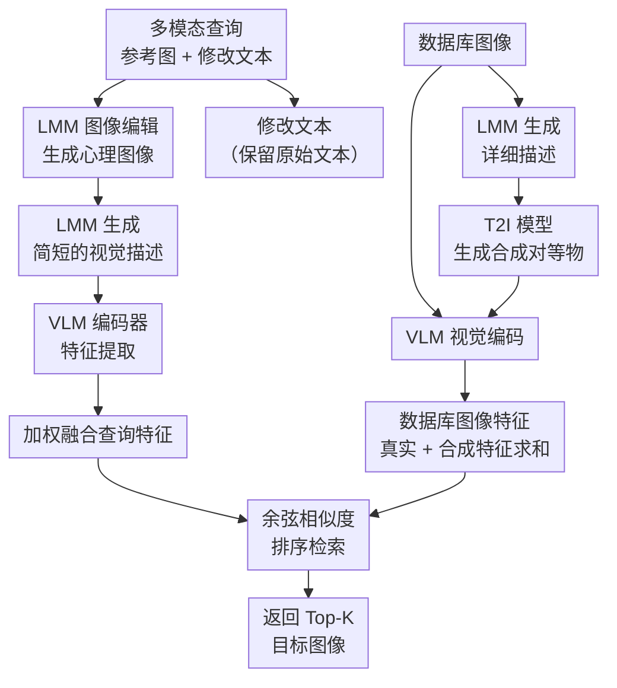

# Generating a Paracosm for Training-Free Zero-Shot Composed Image Retrieval

**会议**: ECCV 2026  
**arXiv**: [2602.00813](https://arxiv.org/abs/2602.00813)  
**代码**: [https://github.com/leowangtong/Paracosm/](https://github.com/leowangtong/Paracosm/)  
**领域**: 多模态 VLM  
**关键词**: 组合式图像检索、零样本检索、无训练、LMM、合成图像

## 一句话总结
Paracosm 首次将 LMM 的图像编辑能力引入零样本组合式图像检索，对多模态查询直接生成"心理图像"（mental image）并同时为数据库图像创建合成对等物，将查询和数据库统一到一个合成空间（paracosm）中进行匹配，以无训练方式大幅超越此前所有零样本方法，甚至媲美有监督方法。

## 研究背景与动机

组合式图像检索（Composed Image Retrieval, CIR）是近年来个性化视觉搜索的重要方向——用户提供一张参考图像和一段修改文本（如"把这条裙子的颜色从红色改成蓝色"），系统需要从数据库中检索出符合这个多模态查询的目标图像。CIR 的核心难点在于：用户的"心理图像"（mental image）只隐含在查询中，并不物理存在，而检索却必须依据这个并不存在的图像来寻找匹配。早期方法依赖人工标注的三元组（参考图、修改文本、目标图）进行有监督训练，成本极高且难以扩展；近年来零样本 CIR（ZS-CIR）成为主流。其中训练式方法通过文本反转网络将参考图映射为伪词 token，再与修改文本融合进行跨模态匹配；无训练方法则利用大语言多模态模型（LMM）为多模态查询生成一段文本描述，将 CIR 转化为文本到图像的检索问题。

然而，现有无训练方法有一个根本性的缺陷——它们用文本描述来替代视觉查询。无论 LMM 的文字生成能力多强，一段描述文字必然丢失大量细粒度视觉信息：颜色深浅、材质纹理、空间布局、光影关系……这些在检索中常常是区分两张相近图像的关键。已有研究也尝试用文生图模型（T2I）为查询生成伪目标图像来辅助匹配，但这些方法仍依赖文本描述的中间环节，且没有解决生成图像与真实数据库图像之间的合成-真实域差距（synthetic-to-real domain gap）。当你在合成图像上提取的特征去和真实图像匹配时，域差异会严重干扰相似度计算。

本文的切入角度是：既然 LMM 已经具备了强大的图像编辑能力，为什么不直接"画"出用户心里想的那张图？事实上，参考图像 + 修改文本正是图像编辑的标准输入格式——用 LMM 直接编辑参考图像，比绕一圈先生成文本再用 T2I 画出来要直接得多。但编辑出来的"心理图像"仍然是合成的，和库里的真实照片不在同一个"世界"。本文的应对是：不试图消除域差距，而是干脆把数据库的图像也"搬到"合成空间里——为每张数据库图像生成一个合成对等物，让查询和数据库在同一个合成空间中匹对。**核心 idea：用 LMM 直接编辑参考图像生成多模态查询的"心理图像"，同时为数据库每张图像生成合成对等物，将查询与数据库统一到一个虚拟的合成空间（paracosm）中做相似度匹配，从而无训练地实现零样本组合式图像检索，并大幅缓解合成-真实域差距。**

## 方法详解

### 整体框架

Paracosm 的核心思路非常简洁：既然用户查询隐含着一幅"心理图像"，那就直接把这幅图生成出来；生成的是合成的，那就把数据库也统统生成一遍合成版本，两边在同一个合成空间里做匹配。整个流程分为查询处理和数据库预处理两条支线，最终在特征空间汇合。

对于每条多模态查询（参考图 + 修改文本），Paracosm 利用 LMM 的图像编辑能力，直接将参考图按照修改文本的语义进行编辑，得到"心理图像"（mental image）。接着对这张心理图像用另一个 LMM 生成一句极简的视觉描述（避免美学细节，只保留内容描述）。心理图像的视觉特征 + 描述文本特征 + 原始修改文本特征三者加权融合成查询特征。

对于数据库，Paracosm 预先为每张图像做两件事：第一步用 LMM 生成一段详细描述（覆盖所有可见物体、属性、空间关系），第二步用文本到图像（T2I）模型基于这段描述生成一个"合成对等物"。匹配时取真实图像和合成对等物的视觉特征之和作为该数据库图像的特征。最终通过余弦相似度在查询特征和所有数据库图像特征间进行检索。

### 关键设计

**1. Mental Image 生成：用 LMM 图像编辑替代文本描述**

现有无训练 ZS-CIR 方法（如 CIReVL、LDRE、OSrCIR）都用 LMM 生成文本描述，再将描述匹配到数据库图像——这本质上是文本到图像的检索，丢失了大量视觉信息。Paracosm 的切入点是：多模态查询的输入格式（参考图 + 修改文本）和图像编辑任务完全一致，与其绕一圈"写描述再用描述检索"，不如直接用 LMM 的编辑能力把"心理图像"画出来。具体做法是将参考图像和修改文本送入 Qwen-Image-Edit（支持图像编辑的 LMM），直接输出编辑后的心理图像。实验表明，这种直接编辑的方式显著优于"先写描述再用 T2I 生成伪目标图"的间接路径（Table 1：直接编辑在 CIRR R@1 上 32.27% vs T2I 生成 31.71%）。心理图像保留了大量文本描述无法承载的视觉细节——材质、光影、形状的微妙变化——这些细粒度线索在区分相近候选图像时至关重要。

**2. 数据库合成对等物：将整个匹对搬到合成空间**

直接拿合成的心理图像与真实数据库图像匹配存在明显的域差距——两个域的特征分布不同，余弦相似度会受域偏移干扰而非纯语义差异主导。Paracosm 的应对很巧妙：不是去缩小域差距（这通常需要域适应训练），而是把数据库也"搬到"合成空间来。为每张数据库图像做两件事：先用 LMM 生成一段详尽描述（捕捉所有可见物体、属性、空间关系、细粒度视觉元素），再以这段描述为 prompt 用 Qwen-Image（或 FLUX、LongCat 等 T2I 模型）生成一张合成对等物。匹配时数据库图像的特征取真实图像与合成对等物视觉特征之和（等权重相加，即 $\phi^i = V(\mathbf{I}^i) + V(\mathbf{I}^i_{syn})$）。消融实验证明，加入合成对等物后 CIRR R@1 从 27.93% 提升到 32.27%，CIRCO mAP@5 从 18.29 提升到 26.10——说明将匹对统一到同一域内带来的增益远大于合成图像引入的噪声。

**3. 多模态查询特征的三路加权融合**

Paracosm 在查询端没有只使用心理图像，而是巧妙地融合了三个信息源：心理图像的视觉编码 $V(\mathbf{I}_{mental})$、心理图像的简短描述 $\mathbf{t}_{query}$ 的文本编码 $T(\mathbf{t}_{query})$、以及原始修改文本 $\mathbf{t}_{mod}$ 的文本编码 $T(\mathbf{t}_{mod})$。三者通过超参数 $\lambda$ 加权：

$$\small\mathbf{q} = \lambda\big(V(\mathbf{I}_{mental}) + T(\mathbf{t}_{query})\big) + (1-\lambda)T(\mathbf{t}_{mod})$$

心理图像和它的简短描述用 $\lambda$ 加权后直接相加形成"视觉-文本混合基座"，修改文本则以 $1-\lambda$ 的权重独立融入。这背后的直觉是：心理图像承载了丰富的视觉细节，但可能在某些语义属性上不够精确；简短描述提供了明确的语义锚点；修改文本保留了原始查询中用户明确给出的修饰意图。三者互补。实验发现 $\lambda=0.3$ 在所有三个基准数据集上一致最优——这意味着修改文本的权重（0.7）意外地高于心理图像和描述（0.3），说明在域差距存在的情况下，文本信息的稳定可靠性仍然对检索至关重要。

### 损失函数 / 训练策略

Paracosm 是完全的无训练方法，不需要任何损失函数或训练过程。所有组件（LMM 图像编辑、LMM 描述生成、T2I 合成图像生成、VLM 特征提取）均直接使用预训练模型。唯一的"调参"是在 CIRR 验证集上对超参数 $\lambda$（修改文本权重）和 $\beta$（真实图像与合成对等物的权重）进行网格搜索，分别确定为 0.3 和 0.5 后固定使用。

## 实验关键数据

### 主实验

Paracosm 在三个标准基准（CIRR、CIRCO、Fashion IQ）上使用 CLIP ViT-L/14 和 OpenCLIP ViT-G/14 两种 VLM backbone 进行评估，与现有最先进的零样本方法进行全面对比。

**CIRR 与 CIRCO 测试集结果（ViT-L/14 backbone）：**

| 方法 | CIRR R@1 | CIRR R@5 | CIRR RSubset@1 | CIRCO mAP@5 | CIRCO mAP@50 |
|------|----------|----------|----------------|-------------|--------------|
| Pic2Word (CVPR'23) | 23.90 | 51.70 | 53.76 | 8.72 | 11.29 |
| SEARLE (ICCV'23) | 24.24 | 52.48 | 53.76 | 11.68 | 15.12 |
| LinCIR (CVPR'24) | 25.04 | 53.25 | 57.11 | 12.59 | 15.85 |
| LDRE (SIGIR'24) | 26.53 | 55.57 | 60.43 | 23.35 | 27.50 |
| CIReVL (ICLR'24) | 24.55 | 52.31 | 59.54 | 18.57 | 21.80 |
| IP-CIR+LDRE (CVPR'25) | 29.76 | 58.82 | 62.48 | 26.43 | 31.07 |
| CIG+SEARLE (CVPR'25) | 26.72 | 55.52 | 57.95 | 12.84 | 16.17 |
| **Paracosm (ours)** | **31.95** | **61.56** | **64.68** | **30.24** | **35.42** |

**Fashion IQ 验证集结果（ViT-L/14 backbone）：**

| 方法 | Shirt R@10 | Dress R@10 | Toptee R@10 | Average R@10 |
|------|-----------|-----------|------------|-------------|
| Pic2Word | 26.20 | 20.00 | 27.90 | 24.70 |
| SEARLE | 26.89 | 20.48 | 29.32 | 25.56 |
| LinCIR | 29.10 | 20.92 | 28.81 | 26.28 |
| CIReVL | 29.49 | 24.79 | 31.36 | 28.55 |
| CIG+LinCIR | 28.90 | 21.12 | 29.78 | 26.60 |
| **Paracosm (ours)** | **31.80** | **24.99** | **31.82** | **29.45** |

Paracosm 在所有指标上显著超越所有零样本方法。使用更强的 ViT-G/14 backbone 时优势进一步扩大——CIRCO mAP@5 达到 39.82（此前最优 OSrCIR 仅 30.47），CIRR R@1 达到 39.30（此前最优 OSrCIR 37.26）。即便与有监督方法相比，Paracosm 在多个指标上也已持平甚至超越。

### 消融实验

基于 CLIP ViT-B/32 backbone 在 CIRR 和 CIRCO 上的完整消融（Table 6）：

| 配置 | 查询编码 | 数据库编码 | CIRR R@1 | CIRCO mAP@5 |
|------|---------|-----------|----------|-------------|
| 基线：仅心理图像描述 | $\mathbf{t}_{query}$ | 真实图像 | 17.21 | 14.91 |
| + 心理图像 | $\mathbf{t}_{query}+\mathbf{I}_{mental}$ | 真实图像 | 18.80 | 13.71 |
| + 心理图像 + 修改文本 | $\mathbf{t}_{query}+\mathbf{I}_{mental}+\mathbf{t}_{mod}$ | 真实图像 | 27.93 | 18.29 |
| + 合成对等物（完整模型） | 全量查询特征 | 真实+合成 | **32.27** | **26.10** |

### 关键发现

- **心理图像贡献显著但非决定性**：仅加入心理图像（去掉修改文本）反而在 CIRCO 上略降，说明心理图像必须与修改文本配合才能发挥检索增益——视觉细节丰富但语义不够精准，文本提供明确的修饰方向。
- **合成对等物是最大增益来源**：加入合成对等物后 CIRCO mAP@5 从 18.29 跳升至 26.10（+42.7%），远超其他任何单个模块的贡献。这验证了"统一匹对空间"的核心假设——消除域差距带来的收益远大于合成图像自身的噪声。
- **修改文本权重 $\lambda=0.3$ 跨数据集一致最优**：CIRR、CIRCO、Fashion IQ 三个基准互不重叠，最优 $\lambda$ 都稳定在 0.3，说明查询特征中修改文本应占主导（0.7）而非视觉基座（0.3），这暗示当前 LMM 生成的图像质量可能仍有提升空间。
- **$\beta=0.5$ 等权重简单有效**：真实图像与合成对等物各占一半权重不仅性能最优，也避免了不对称权重的调参复杂性。
- **对 LMM 选择鲁棒**：在 Qwen-Image-Edit 和 LongCat-Image-Edit 之间切换结果稳定（CIRR R@1 32.27 vs 32.12），说明 Paracosm 的优势来自整体框架而非特定模型。
- **与 GPT-4o 相比提升甚微**：将 Qwen2.5-VL 换成 GPT-4o 生成心理图像描述，CIRR R@1 仅从 32.27 微升至 31.86（实际略降），说明核心方法不依赖 LMM 的规模。

## 亮点与洞察

- **"打不过就加入"的域适应思路**：大多数方法试图缩小合成-真实域差距（域适应、域对齐），Paracosm 反其道而行之——把数据库也拉到合成空间，让匹配在域内进行。这个思路优雅且免训练，值得在其他涉及合成-真实跨域匹对的任务中借鉴（如神经渲染检索、仿真→真实的跨域检索）。
- **图像编辑天然适配 CIR 查询**：CIR 的多模态查询输入恰好和图像编辑任务的输入格式完美对齐（参考图 + 编辑指令）。Paracosm 是第一篇系统性地利用这一对齐关系的方法——不是巧合，而是对任务本质结构的洞察。
- **三路特征融合的设计智慧**：心理图像（丰富视觉但不精确）+ 简短描述（语义锚点）+ 修改文本（原始约束）——三者互补。$\lambda=0.3$ 的结果揭示了一个反直觉的事实：在 CIR 中，文本信息的可靠性可能比图像的丰富性更重要。
- **训练-free 但超越有监督**：Paracosm 无需在任何 CIR 数据上训练，在 CIRCO mAP@50 等指标上已经超过了 Combiner、BLIP4CIR 等有监督方法，展示了基础模型零样本泛化能力的巨大潜力。

## 局限与展望

- **对 LMM 生成质量高度敏感**：当 LMM 编辑出的心理图像不符合事实时（如生成了一个卡通风格的鸭子而非真实的毛绒玩具），检索必然失败。论文图 7 展示了多类失败案例，包括反事实生成（烤箱门上的燃烧器）、编辑失败（未改变冰箱门颜色）、查询理解错误等。未来可以引入一致性检测机制来过滤或修正错误生成。
- **计算开销大**：处理 CIRCO 的 123K 张数据库图像需要约 12.9 小时（16 张 A100 集群），物理存储约 41.4 GB。虽然合成图像的特征最终压缩到 0.38 GB 且只做一次离线预处理，但在实际大规模部署时仍需要权衡性能与成本。
- **不同数据集需手动调整 prompt 模板**：由于 CIRR、CIRCO、Fashion IQ 的修改文本格式存在差异（如 CIRCO 包含"shared concept"概念），Paracosm 为每个基准设计了略有不同的 prompt 模板。未来可以探索自适应 prompt 生成，让 LMM 自动根据输入格式构造最优指令。
- **缺乏对不当查询的过滤机制**：论文在影响分析中指出，Paracosm 没有机制检测或拒绝恶意查询，如果用户输入不当修改文本，中间生成的心理图像和检索结果可能产生社会负面影响。

## 相关工作与启发

- **vs OSrCIR (Tang et al., CVPR'25)**：同为无训练 ZS-CIR，OSrCIR 用 reflective chain-of-thought 提升 LMM 输出描述的质量，本质仍是文本→图像检索；Paracosm 直接生成心理图像并使用合成对等物消除域差距——这是根本性的范式转变。在 ViT-G/14 backbone 下，Paracosm 的 CIRCO mAP@5 达到 39.82，OSrCIR 仅 30.47。论文还通过严格复现发现 OSrCIR 实际使用的可能是 OpenCLIP 而非所声称的 CLIP，指出了社区中的可复现性问题。
- **vs IP-CIR (Li et al., CVPR'25)**：同样尝试生成伪目标图像辅助检索，但 IP-CIR 走的是"生成描述→LLM 修改描述→T2I 生成图像"的间接路径，且必须结合 LDRE 等文本反转网络一起使用。Paracosm 直接编辑参考图像并将数据库也"搬到"合成空间，更简洁且无需额外训练。
- **vs LDRE (Yang et al., SIGIR'24)**：LDRE 通过生成多条多样化的描述来提升召回，但所有描述仍然是文本，丢失视觉细节。Paracosm 用单张心理图像就超越了 LDRE 的多条描述策略（CIRR R@1: 39.30 vs 36.15）。

## 评分
- 新颖性: ⭐⭐⭐⭐⭐ 首次系统性地利用 LMM 图像编辑能力与合成对等物策略解决零样本 CIR，思路简洁优雅，是 CIR 任务上方法论的范式转变
- 实验充分度: ⭐⭐⭐⭐⭐ 在 3 个基准、2 种 backbone 上与所有主流零样本方法对比，消融实验覆盖所有组件，还包含计算开销分析、LMM 鲁棒性分析、跨生成器对比，并指出 SOTA 方法的可复现性问题
- 写作质量: ⭐⭐⭐⭐⭐ 从 first-principles 出发讲动机，逻辑链条清晰，方法描述图文并茂，实验分析深入细致（如 $\lambda$ 跨数据集一致最优的发现），还诚实地讨论了局限性
- 价值: ⭐⭐⭐⭐⭐ 大幅刷新零样本 CIR SOTA，方法极度简单且无需训练，直接可部署，对电商、时尚等实际应用场景有重要实用价值

<!-- RELATED:START -->

## 相关论文

- [\[CVPR 2026\] STiTch: Semantic Transition and Transportation in Collaboration for Training-Free Zero-Shot Composed Image Retrieval](../../CVPR2026/multimodal_vlm/stitch_semantic_transition_and_transportation_in_collaboration_for_training-free.md)
- [\[CVPR 2026\] Self-guided Semantic Inspection for Zero-Shot Composed Image Retrieval](../../CVPR2026/multimodal_vlm/self-guided_semantic_inspection_for_zero-shot_composed_image_retrieval.md)
- [\[CVPR 2026\] G-MIXER: Geodesic Mixup-based Implicit Semantic Expansion and Explicit Semantic Re-ranking for Zero-Shot Composed Image Retrieval](../../CVPR2026/multimodal_vlm/g_mixer_geodesic_mixup_based_implicit_semantic_expansion_for_zero_shot_cir.md)
- [\[ECCV 2026\] Explicit Logic Channel for Validation and Enhancement of MLLMs on Zero-Shot Tasks](explicit_logic_channel_for_validation_and_enhancement_of_mllms_on_zero-shot_task.md)
- [\[CVPR 2026\] Adapting In-context Generation for Enhanced Composed Image Retrieval](../../CVPR2026/multimodal_vlm/adapting_in-context_generation_for_enhanced_composed_image_retrieval.md)

<!-- RELATED:END -->
