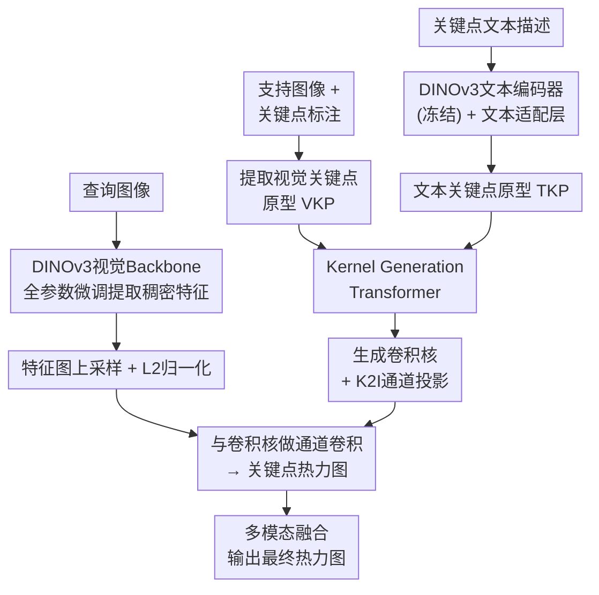

# GKDT: General Keypoint Detection Transformer

**会议**: ECCV 2026  
**arXiv**: [2607.00752](https://arxiv.org/abs/2607.00752)  
**代码**: [https://github.com/AlanLuSun/General-Keypoint-Detection](https://github.com/AlanLuSun/General-Keypoint-Detection) (有)  
**领域**: 多模态VLM  
**关键词**: 通用关键点检测, 多模态提示, DINOv3, Kernel Generation Transformer, 大规模数据集

## 一句话总结
本文构建了包含130万实例的大规模统一关键点数据集MegaKPT，并提出基于DINOv3的通用关键点检测Transformer GKDT，通过Kernel Generation机制将视觉/文本关键点原型转化为动态卷积核，在22个测试集上以单一模型于多数类别实现90%+ PCK@0.1精度。

## 研究背景与动机

关键点检测是计算机视觉的基础任务，为人体姿态估计、动物行为分析、机器人操作等应用提供细粒度的部件理解。过去数十年间，该领域从Harris角点、SIFT等传统方法演进到基于CNN和Transformer的深度学习时代，涌现了ViTPose++、HRNet等高精度人体姿态模型以及AP-10K、Animal Kingdom等动物专用模型。然而这些专精模型本质上是闭集检测器——它们只能识别训练时定义好的特定类别关键点（如17个人体骨骼关键点），一旦遇到鱼或沙发这样解剖结构完全不同的物体便毫无泛化能力。关键点检测领域长期缺乏一种能跨类别、跨领域工作的通用模型。

近年来的研究尝试通过提示学习打破这一局限，让模型根据少量标注图像（视觉提示）或关键点文本描述（文本提示）来检测任意物体的关键点。OpenKD和X-Pose等工作展示了多模态提示的可行性，但它们的训练数据集规模有限（UniKPT约41.8万实例），限制了跨领域知识迁移和未见类别的泛化性能。更深层的矛盾在于：要支撑真正的通用关键点检测，既需要一个大规模、高质量、统一标注的关键点数据集来覆盖从昆虫到家具、从人体到医学影像的超大类别跨度，又需要一个能灵活处理视觉和文本提示且能在如此规模和异质性数据上高效训练的检测模型。

本文分别从数据和模型两个角度给出系统方案。数据方面将29个已有数据集手动统一标注格式并补充文本描述，构建了涵盖10个大类、超过130万实例的MegaKPT数据集。模型方面以DINOv3为视觉骨干，设计了Kernel Generation Transformer，将多模态关键点原型动态转化为检测卷积核。**核心idea：利用DINOv3自监督预训练的强表征能力，通过Kernel Generation机制将视觉和文本关键点提示动态转化为可卷积的检测核，在MegaKPT大规模统一数据集上训练出单一模型，实现对22个测试集（含未见类别）的通用关键点检测。**

## 方法详解

### 整体框架

GKDT是一个基于提示的通用关键点检测模型，支持视觉提示（给一张或几张标注了关键点的支持图像）、文本提示（直接用关键点名称描述，如"左眼""右前腿关节"）或两者同时使用。模型以DINOv3视觉Transformer为主干网络并全参数微调以释放其自监督表征能力；文本侧使用冻结的DINOv3文本编码器加轻量文本适配层。核心流水线为：先分别从视觉和文本提示提取关键点原型（VKP和TKP），然后将这些原型作为token输入Kernel Generation Transformer进行模态间交互和查询上下文聚合，最终生成一组卷积核，与上采样后的查询特征图做通道卷积得到关键点热力图。

### 关键设计

**1. 多模态关键点原型构建：从视觉和文本提示提取统一的关键点表示**

对于视觉提示，模型将支持图像上标注的每个关键点坐标编码为高斯热图（标准差σ控制扩散范围），然后用该热图的权重对DINOv3视觉特征图的各空间位置做线性加权求和，得到该关键点的视觉嵌入。当提供K张支持图像时，同一关键点类型的K个视觉嵌入取平均得到视觉关键点原型（VKP），这一平均操作显著降低了单张图像标注误差带来的噪声。对于文本提示，每条关键点文本经冻结的DINOv3文本编码器和一个可训练的文本适配层处理后，取其分类token作为文本关键点原型（TKP）。最终通过T2I投影器将文本特征的通道维度与视觉特征对齐，确保两种原型能够共享后续的Transformer处理。该构建方案的核心优势在于：高斯热图加权使模型聚焦关键点周围的语义区域，而非依赖于精确的单点坐标，这为不同物体上形态各异的关键点提供了统一且鲁棒的表示基底。

**2. Kernel Generation Transformer：跨模态交互与自适应卷积核生成**

这是本文最核心的设计。将VKP和TKP拼接为token序列后，输入KG Transformer。该模块的内部机制分两层：首先通过自注意力让VKP和TKP之间充分交换信息——当某一模态的提示较弱时（如文本描述过于模糊或视觉支持图像角度不佳），另一模态的强特征可以通过注意力传播辅助改善弱模态的表示，这是多模态融合在表征层面的直接体现；其次通过交叉注意力让原型token聚合查询图像的特征上下文，使生成的卷积核不仅包含关键点的先验语义信息，还能感知查询图像中物体的具体姿态、尺度和外观。经过多层自注意力和交叉注意力后，Kernel Expander通过逐层反卷积将原型token上采样为空间卷积核（尺寸支持1×1、3×3、5×5）。相比传统方法为每个关键点学习一组固定的检测参数（如ViTPose++中Conv1×1的权重），KG Transformer生成的卷积核是动态的——对于每张查询图像和每类关键点都生成专用于该场景的检测核，这赋予了模型处理从轿车到苍蝇等极端多样物体的灵活性。

**3. 非参数化检测与多模态热力图融合：卷积核直接作为关键点探测器**

生成的视觉卷积核Wᵛ和文本卷积核Wᵗ分别与经过L2归一化后的上采样查询特征图做通道维度卷积，得到两套独立的关键点热力图Hᵛ和Hᵗ。在测试阶段，两套热力图通过有效性指示因子𝕀ᵛ和𝕀ᵗ进行加权融合——仅当某模态的提示有效时其热力图才参与融合，若两种提示均有效则取平均值作为最终输出。这一设计的精妙之处在于：它无缝支持视觉提示、文本提示和双模态三种推理模式，且双模态融合能够规避用户选择提示方式的风险——实验表明22个测试集中21个的双模态结果与最优单模态差距小于2%，即使用户不确定哪种提示更佳，双模态总能接近最佳效果。

### 损失函数 / 训练策略

**混合模态提示训练（Mix-Modal Prompted Training）**：现实使用中用户可以自由选择视觉、文本或双模态提示，但若训练只使用双模态数据，测试时单模态的效果就会显著退化。为此每个训练episode从{视觉, 文本, 双模态}中随机选取一种提示模式，并相应地对关键点有效性指示因子进行掩码。实验表明{视觉, 文本, 双模态}三模式训练在所有推理方式下均取得最佳效果，而仅用{双模态}则单模态性能大幅下降，仅用{视觉, 文本}则双模态性能受损。

**动态重要性采样（Dynamic Importance Sampling）**：MegaKPT的10个大类之间存在严重的头尾分布不均——服装类（DeepFashion2）有近50万实例，而医学类仅千余例。简单的重要性采样会导致尾类样本快速枯竭引发灾难性遗忘，均匀采样又会使尾类欠拟合。本文提出的动态重要性采样策略的核心机制是：基于超类的剩余样本数动态判断当前采样的类是否属于"头部"（样本数排前50%的类），若是则将该样本从数据池中移除，否则放回；当某个超类的数据被取空时将其从数据池删除。随着迭代进行，头类的样本逐渐消耗耗尽，尾类的相对占比自然提升，整个分布动态趋向平衡。实验表明该策略在尾类性能上提升显著（在HInt提升1.03%、Cephalometric提升0.40%），同时头部类性能几乎无损。

训练损失为预测热力图与GT高斯热图之间的均方误差（MSE），对视觉和文本两路输出分别计算损失并根据有效性指示因子加权平均：仅当某模态提示有效时对应热力图才参与损失计算，无效的关键点作为负样本（热力图目标为零图）参与学习。

## 实验关键数据

### 主实验

以下为单目标场景PCK@0.1对比结果（部分代表性数据集，未见类别以▲标记）：

| 提示方式 | 数据集 | 本文 | OpenKD | X-Pose | 提升 |
|---------|--------|------|--------|--------|------|
| 视觉 | Animal Pose (△) | 81.11 | 49.41 | - | +31.70 |
| 视觉 | CUB (▲) | 97.71 | 85.51 | - | +12.20 |
| 视觉 | Hand X-ray (▲) | 99.28 | 68.67 | - | +30.61 |
| 文本 | CUB (▲) | 98.58 | 89.82 | 67.07 | +8.76 |
| 文本 | AwA (△) | 92.80 | 81.80 | 28.57 | +11.00 |
| 文本 | Hand X-ray (▲) | 99.62 | 82.24 | 2.41 | +17.38 |
| 双模态 | NABird (▲) | 96.86 | 91.81 | - | +5.05 |
| 双模态 | HInt | 81.13 | 50.94 | - | +30.19 |
| 双模态 | Cephalometric | 99.49 | 99.18 | - | +0.31 |
| 双模态 | Hand X-ray (▲) | 99.60 | 85.31 | - | +14.29 |

多目标场景COCO人体姿态估计AP结果：

| 模型 | 检测器 | AP | AP_50 | AP_75 |
|------|--------|-----|-------|-------|
| GKDT-H† (微调) | G-DINO | 78.1 | 91.7 | 85.1 |
| GKDT-H | G-DINO | 77.2 | 91.6 | 84.3 |
| GKDT | G-DINO | 75.0 | 90.8 | 82.3 |
| X-Pose | 端到端 | 71.8 | 88.9 | 78.3 |
| ViTPose++-H (专家模型) | Faster R-CNN | 79.1 | 91.6 | 85.7 |

### 消融实验

| 配置 | Animal(visual) | Animal(text) | CUB(visual) | CUB(text) |
|------|---------------|-------------|-------------|-----------|
| Full GKDT | 81.11 | 73.27 | 97.71 | 98.58 |
| 冻结Backbone + 无KG | 53.86 | 54.00 | 79.55 | 87.11 |
| 微调Backbone + 无KG | 79.08 | 68.29 | 96.78 | 96.81 |
| KG无交叉注意力(仅自注意力) | 80.23 | 73.15 | - | - |
| KG无自注意力(仅交叉注意力) | 65.90 | 82.94 | - | - |
| 均匀采样 → 动态重要性采样 | 头类+0.05 | 头类-0.05 | 尾类HInt +1.03 | 尾类Cephalo +0.40 |

### 关键发现

- KG Transformer是性能提升的核心：完全去掉KG后文本提示性能大幅下降（CUB从98.58降至96.81），自注意力（SA）对视觉提示的贡献远大于交叉注意力（CA），而CA对文本提示略有帮助
- 微调DINOv3视觉Backbone至关重要：完全冻结时空所有模式的性能都大幅退化（Animal视觉从81.11降至53.86），验证了通用关键点检测需要充分的特征适配
- 动态重要性采样对尾类性能提升显著（最高+6.36%在OpenKD上），而头部类性能几乎无损失，验证了"消耗性移除头类"策略的有效性
- 双模态融合能有效规避单模态弱提示的风险：21/22个测试集的双模态结果与最优单模态差距<2%，18/22个差距<1%
- 即使只使用10%的训练数据，在Cephalometric上仍能取得90%+准确率，体现了DINOv3预训练的强大知识迁移能力

## 亮点与洞察

- **Kernel Generation的设计哲学非常巧妙**：将关键点检测等价于一组卷积核对特征图的响应，从而把提示学习转化为卷积核的动态生成，避免了为每个关键点类别设计独立输出头的僵化架构，这是该模型能处理740种不同关键点的根本原因
- **自注意力让视觉和文本原型互相增强**：当视觉支持图像质量不佳或文本描述不完整时，强模态的特征可以通过注意力传播改善弱模态的表征，这种隐式跨模态增强比显式的模态融合更优雅
- **动态重要性采样是处理长尾数据的高效工程方案**：不需要重采样分布或修改损失函数，而是通过"从头部消耗、从尾部保留"的采样机制让分布自然趋于平衡，实现简单且效果好
- **MegaKPT的质量控制投入值得借鉴**：人工统一29个数据源的标注格式、用LLM标准化分类名称、为医学影像提供专家级关键点文本——这些细致的数据工程为GKD研究奠定了持久的基础设施

## 局限与展望

- 模型参数量较大：GKDT-L可学习参数349M，GKDT-H达898M，在边缘设备或实时场景下面临部署挑战，未来的知识蒸馏或结构精简方向值得探索
- 两阶段推理（先目标检测再关键点检测）虽然灵活但系统复杂度高，端到端方法X-Pose在效率上更优，GKDT的"灵活对接更优检测器"策略在学术上合理但工程上增加了管线复杂性
- 模型高度依赖DINOv3的特征体系，是否能平滑迁移到未来更强的视觉基础模型尚待验证，不过KG Transformer作为通用组件理论上与backbone解耦
- 跨大类迁移（如从人体到四足动物）仍有较大提升空间：COCO（92.82%）到AP-10K（58.87%）的大幅下降说明解剖结构差异仍是GKD的核心挑战
- 论文未系统讨论遮挡、极端姿态、小物体等困难场景的鲁棒性，这些是实际部署中无法回避的

## 相关工作与启发

- **vs OpenKD [Lu et al. 2024]**: OpenKD最早探索多模态提示关键点检测，但其数据集UniKPT仅41.8万实例且模型结构较为简单；GKDT以MegaKPT（3倍数据量）和DINOv3+KG Transformer实现了全面的性能超越，证明了数据规模+强backbone的联合提升效果
- **vs X-Pose [Yang et al. 2024]**: X-Pose将目标检测和关键点检测放在同一个端到端模型中，但双重任务互相影响导致关键点精度受限；GKDT采用两阶段范式，灵活对接更优的目标检测器（如G-DINO），在COCO的AP上从71.8提升至77.2，验证了"检测和关键点分离"的设计选择
- **vs ViTPose++ [Xu et al. 2023]**: ViTPose++是人体姿态估计的专家模型，在COCO上AP达79.1但只能检测17个预定义人体关键点；GKDT作为通用模型在COCO上达到78.2（配合GT box），接近专家模型水平的同时支持数百种不同类型物体的关键点检测

## 评分
- 新颖性: ⭐⭐⭐⭐ 将DINOv3+Kernel Generation用于通用关键点检测是首创，MegaKPT数据集的构建具有重要推动意义
- 实验充分度: ⭐⭐⭐⭐⭐ 22个测试集×3种提示模式×多目标场景×丰富消融，实验设计非常全面
- 写作质量: ⭐⭐⭐⭐ 方法描述清晰、motivation充分，但公式密度略高，部分符号定义可更直观
- 价值: ⭐⭐⭐⭐⭐ MegaKPT数据集和GKDT模型为通用关键点检测领域提供了数据和模型的双重基座，在机器人、医学影像、动物行为分析等方向有广阔应用前景

<!-- RELATED:START -->

## 相关论文

- [\[NeurIPS 2025\] In-Context Compositional Learning via Sparse Coding Transformer](../../NeurIPS2025/multimodal_vlm/in-context_compositional_learning_via_sparse_coding_transformer.md)
- [\[ICML 2025\] RollingQ: Reviving the Cooperation Dynamics in Multimodal Transformer](../../ICML2025/multimodal_vlm/rollingq_reviving_the_cooperation_dynamics_in_multimodal_transformer.md)
- [\[ICCV 2025\] OrderChain: Towards General Instruct-Tuning for Stimulating the Ordinal Understanding Ability of MLLM](../../ICCV2025/multimodal_vlm/orderchain_towards_general_instruct-tuning_for_stimulating_the_ordinal_understan.md)
- [\[ACL 2026\] Towards Visually Grounded Multimodal Summarization via Cross-Modal Transformer and Gated Attention](../../ACL2026/multimodal_vlm/towards_visually_grounded_multimodal_summarization_via_cross-modal_transformer_a.md)
- [\[CVPR 2026\] UI-Lens: Assessing General MLLMs' Potential to Automate UI Display Quality Assurance](../../CVPR2026/multimodal_vlm/ui-lens_assessing_general_mllms_potential_to_automate_ui_display_quality_assuran.md)

<!-- RELATED:END -->
