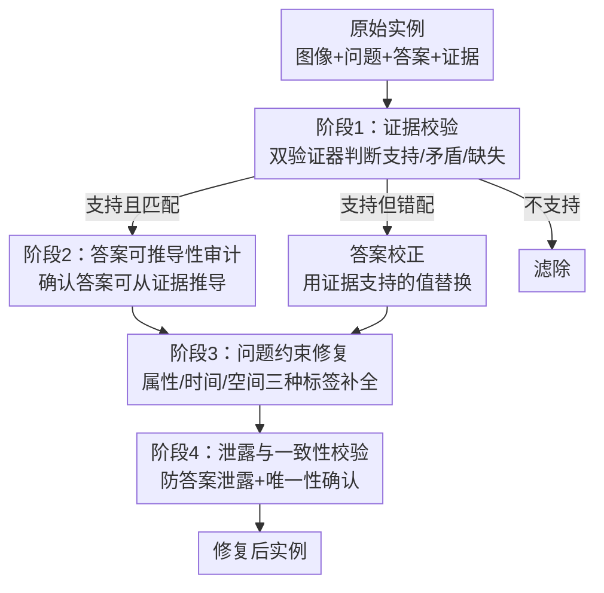

# Identifying and Resolving Pitfalls of Knowledge-Based VQA Benchmarks: Auditing, Repairing, and Augmenting

**会议**: ECCV 2026  
**arXiv**: [2607.00159](https://arxiv.org/abs/2607.00159)  
**代码**: [GitHub](https://github.com/VAN-QIAN/ECCV26-ARA)  
**领域**: 多模态VLM  
**关键词**: KB-VQA, 基准测试审计, 答案-证据对齐, 接地消歧, 多实体增强  

## 一句话总结
对知识驱动视觉问答（KB-VQA）基准 InfoSeek 和 E-VQA 进行系统性审计，揭示答案-证据错位、问题欠指定和单实体视觉捷径三类普遍缺陷，提出四阶段修复协议和受控多实体增强协议，实验表明修复后模型排名反转、增强后检索召回和 QA 精度大幅下降，说明当前 KB-VQA 评估对知识接地推理能力的衡量严重失真。

## 研究背景与动机
KB-VQA 任务的初衷是评估 VLM 能否从外部结构化知识库中检索、接地并推理出超越视觉证据的答案，答案正确率（accuracy）被广泛默认为知识接地推理能力的可靠代理指标。然而，这一代理关系依赖三个关键假设：（A）标注答案必须能从关联知识库中推导；（B）问题必须给出足够约束以唯一确定答案；（C）视觉场景必须真正需要接地消歧才能正确回答。

现有代表性 KB-VQA 基准 InfoSeek 和 E-VQA 在这三条假设上存在系统性违反。第一，InfoSeek 的 QA 对来自 Wikidata 知识图谱三元组，但评估知识库使用的是 Wikipedia 文本，跨源构造导致约 22% 的实例标注答案在给定知识库中缺失或被证据直接反驳（如标注 McLaren 12C 质量为 1302 kg，证据却写 1301 kg）。第二，模板化问题生成大量丢弃关键限定词，导致约 47%-59% 的问题欠指定——同一问题可对应多个证据支持的合理答案（如"交配期是什么时候"既可答春季、也可答 3-4 月或约1岁），但评估仅认可单一标注答案，正确的知识推理被系统性地判错。第三，现有基准图像以单一显著实体为主，全局图像检索即可命中目标，定位-接地-消歧三步被压缩为一条捷径，高 accuracy 不代表模型真正具备接地推理能力。

这些缺陷导致基准分数与目标能力脱钩：高 accuracy 可能来自标注伪影、数据偏差或捷径策略，而非忠实的知识接地推理。本文的目标是通过审计揭示这些问题，并通过修复和增强协议恢复基准的诊断力，使评估分数重新与知识推理能力对齐。

核心 idea：给 KB-VQA 基准做一次"体检+手术"——先用双验证器审计标注有效性和问题清晰度并修复，再通过受控注入视觉干扰实体强制接地消歧，把有缺陷的基准转化为能真实反映检索-推理能力的诊断测试平台。

## 方法详解

### 整体框架
本文方法由两个独立但互补的协议组成，均作用于已有 KB-VQA 基准（InfoSeek 和 E-VQA），不引入新模型训练。第一个是四阶段审计与修复协议，针对假设 A（答案可推导性）和 B（问题良定义性），输出修复后实例或滤除无效实例。第二个是受控增强协议，针对假设 C（接地消歧必要性），通过在原图中注入同类或异类干扰实体，将单实体场景升级为多实体场景，保持答案不变，迫使模型必须依赖文本约束定位目标实体后才能检索和推理。

增强协议独立于修复协议运行：在修复后的基准上，为每张锚点图像拼接一个同类或异类干扰实体图像，对同类增强在问题中追加最小空间提示（如"左边的鱼"），对异类增强保持问题不变，确保性能变化仅反映接地消歧难度的增加。

### 关键设计

**1. 四阶段级联审计与修复协议：从证据校验到全局一致性确认**

针对假设 A 和 B 的违反，协议以四个级联阶段依次处理，每个阶段的输出是下一阶段的输入，保证修复的可追溯性。阶段 1（证据校验）将实例分为三类：支持且匹配、支持但错配、不支持。关键设计是使用两个独立验证器（Qwen3-30B-A3B 和 DeepSeek-v3.2）对目标实体页逐节扫描，仅当两个验证器一致判定为"不支持"时才移除实例——这有效缓解了单模型误判导致的过度滤除。证据上下文被局部化到节级别（E-VQA 平均 868 tokens，InfoSeek 平均 877 tokens），避免全页面噪音干扰校验精度。对于 E-VQA 实例，由于数据集构造时提供了证据段落，直接检查引用段落并回访错配案例。

阶段 2 对"支持但错配"的实例执行证据锚定的答案校正：DeepSeek-v3.2 仅将错配标注重写为已验证证据明确支持的值，不作为答案来源。若证据中无法推导出任何值，实例被移除。这一步对 InfoSeek 尤为重要，因为它频繁纠正跨源构造引入的答案侧错配；对 E-VQA 则影响很小，因其答案本身从证据文章中选取。

阶段 4 在所有修复完成后执行终检：检查问题是否泄露答案、修复后答案是否仍被证据支持、修复后问题是否约束唯一答案。任何导致泄露的编辑被回滚并保守重写。这一终检门控防止了修复过程中引入的新错误。

**2. 歧义标签驱动的问题约束修复：三种欠指定模式的精准补全**

针对假设 B，论文界定了三种反复出现的歧义模式并以标签驱动修复：（1）缺失属性约束——如问"这种植物能长多大"却不指定高度还是直径；（2）缺失时间范围——如问"交配期是何时"却不限定季节、月份还是生命阶段；（3）缺失空间参照或粒度——如问"这种动物生活在哪个国家或地区"但不限定国家级还是区域级。审计显示 E-VQA 有 21.5% 属性缺失、27.5% 空间缺失、10% 时间缺失；InfoSeek 为 17.3%、30.3%、2%。

修复策略遵循最小编辑原则：对 InfoSeek，恢复从 KG 到问题映射时丢弃的限定词（facet）；对 E-VQA，在原模板生成问题中补全对细粒度实体的消歧限定词。修复后不改变原始意图和证据依赖关系，确保评估仍然是对同一个知识点进行测试，只是约束变得充分。例如，E-VQA 中"交配期是何时"被修改为"一年中哪个季节是交配期"，而答案"春季"不变。

**3. 受控多实体增强：类内与类内干扰注入，答案语义锚定不变**

针对假设 C（接地消歧要求），增强协议为每个锚点实例注入恰好一个干扰实体，构造两种场景：类内增强（intra-category）——干扰实体与锚点属于同一语义类别（如两张湖的图片左右拼接），在问题中追加最小空间提示（如"右边的湖"）以指定锚点；类间增强（inter-category）——干扰实体来自不同类别（如地标旁边放一只动物），问题保持不变。两种设置下，标注答案和知识库均保持原样，性能变化纯粹反映视觉歧义增加后的接地消歧难度，而非知识或标注漂移。

类内增强隔离了细粒度类内歧义：即使干扰实体与锚点语义同源，模型也必须将文本约束（如"在左边"）对接到局部视觉证据上，而非依赖粗粒度全局嵌入。类间增强则测试检索是否对不相关的视觉内容过度敏感——干扰实体语义上不相关，但足以扰动全局图像表示，模型若不先确定问题所指目标实体的文本约束再检索，就会被干扰实体误导。

对于增强数据集的质量控制，每个数据集采样 100 个类内和 100 个类间实例进行人工评估：两位标注者仅凭锚点证据回答问题。人工精度为 E-VQA 类内 87.5%、类间 96.0%；InfoSeek 类内 86.0%、类间 89.5%，验证了增强实例的可回答性。

### 一个完整示例：InfoSeek McLaren 12C 实例的修复过程

以 InfoSeek QID 5441（McLaren 12C）为例。原始问题为"What is the mass of this car?"，标注答案为"1302"千克。阶段 1 双验证器扫描 McLaren 12C Wikipedia 页面后发现，证据中明确写有"It weighs 1,301 kg"，标注 1302 与证据存在单值偏差（跨源 Wikidata 到 Wikipedia 的典型错配），判定为"支持但错配"。阶段 2 将答案校正为"1301"。阶段 3 识别到原问题缺少属性约束——"mass"可指整备质量、干重等多种定义——证据上下文指向"dry weight"，因此在问题中追加"dry weights"约束。阶段 4 校验确认修复后问题不泄露答案，且"1301"在证据中唯一对应干重。最终修复后实例：问题"What is the dry weight mass of this car?"，答案"1301"。实验表明，修复后 EchoSight 的 re-ranker 能正确排到 Design 节并输出正确答案。

## 实验关键数据

### 主实验：修复前后的性能变化与排名反转

在 InfoSeek 实体去重子集（1,924 题，分为 String 1,604 / Numerical 223 / Time 97）和 E-VQA 固定评估集（4,750 题）上，保持图像、检索设置、检查点和评估指标完全不变，仅修复问题和答案。

| 方法 | 主干 | InfoSeek 未修复 | InfoSeek 修复 | E-VQA 未修复 | E-VQA 修复 |
|------|------|----------------|--------------|-------------|-----------|
| Wiki-PRF | Qwen | 44.9 | 43.6 | 31.9 | 33.1 |
| ReflectiVA | Llama | 37.3 | 38.1 | 36.8 | 36.6 |
| IBA | Llama | 34.5 | 42.4 | 41.9 | 42.7 |
| EchoSight | Llama | 30.9 | 37.2 | 40.4 | 40.9 |
| CoMeM | Qwen | 24.3 | 23.5 | 14.1 | 13.4 |
| LLaVA-v1.5 | Llama | 5.8 | 6.6 | 12.9 | 12.7 |
| Qwen2.5-VL | Qwen | 21.4 | 28.3 | 21.9 | 21.9 |

关键发现：（1）排名反转——InfoSeek 未修复时 ReflectiVA（37.3）高于 IBA（34.5），修复后 IBA（42.4）反超 ReflectiVA（38.1），差距从 +2.8 变为 -4.3。这直接挑战了"聚合过滤优于显式证据选择"的未修复结论。（2）相对差距缩小——未修复时 Wiki-PRF 领先 IBA 10.4 个点，修复后仅领先 1.2 个点，削弱了"迭代多工具检索天然优于模块化工作流"的推论。（3）严格子集（Time/Num）增益更显著，如 Wiki-PRF 在 Time 子集从 35.1 升至 43.3、Num 从 45.7 升至 52.9，说明答案错配在这些精确匹配子集中尤为致命。E-VQA 变化幅度较小，与修复统计一致（E-VQA 主要改问题，48.5% 问题修改 vs 仅 2.9% 答案修改；InfoSeek 76.1% 问题 + 38.8% 答案修改）。

细粒度归因分析：在 EchoSight 的 re-rank top-1 已命中正确实体的 664 样本上，纯问题修复带来 60.1→75.1 的提升，问题+答案联合修复带来 34.0→45.2 的提升，纯答案修复几乎不变（44.2→44.3），说明问题澄清是精度提升的主要驱动力。

### 增强实验：接地消歧瓶颈的量化暴露

在所有方法上评估锚点子集和类内/类间增强变体（InfoSeek 1,604 实例，E-VQA 3,871 实例）。

| 方法 | 锚点 IS | 锚点 EV | 类内 IS | 类内 EV | 类间 IS | 类间 EV |
|------|---------|---------|---------|---------|---------|---------|
| IBA | 40.1 | 38.4 | 21.4 | 19.8 | 21.6 | 16.6 |
| Wiki-PRF | 43.9 | 32.8 | 23.6 | 23.1 | 25.9 | 22.5 |
| EchoSight | 38.7 | 42.0 | 15.9 | 19.3 | 17.8 | 18.5 |

增强后所有方法 QA 精度大幅下降，且检索召回（R@1）急剧恶化：InfoSeek 从 43.5 降至类内 14.7/类间 20.4，E-VQA 从 13.4 降至类内 3.5/类间 2.9。后检索阶段的证据选择也无法弥补损失——IBA 在 InfoSeek 上后检索召回从 45.1 降至 21.7/21.6，EchoSight 在 E-VQA 上从 46.6 降至 11.8/11.7。这确认了一旦初始接地失败，后续证据聚合无法补偿，接地消歧是关键瓶颈而非下游推理。

消融对照：用空白面板（Blank）和锚点重复（Double）替代语义干扰实体，检索下降幅度远小于真实增强（如 E-VQA Blank R@1 6.3、Double 9.9 vs 类内 3.5、类间 2.9），证实语义干扰带来的难度超出布局偏移。

### 关键发现
- 修复后 InfoSeek 上 IBA 增益最大（+7.9），反映其显式实体识别-重排序流程在问题清晰化后受益最大；聚合方法如 ReflectiVA 和 CoMeM 增益有限，因为它们依赖模型内在评估证据相关性，问题澄清对这一机制的帮助不如显式证据选择直接。
- 排名反转的经济含义：若社区依赖未修复基准做出"聚合过滤优于显式选择"的判断，大量资源可能被投入到昂贵的模型训练上，而实际收益与投入不成正比。
- Wiki-PRF 在增强场景下未主动调用其 grounding 工具，工具调用次数和命中率均从锚点场景显著下降（如 InfoSeek 类内：Caption 调用从 439→340，Hit@1 从 20.3→7.9），说明稀疏奖励训练（仅针对最终答案正确）导致模型在检索阶段缺乏探索动机。
- E-VQA 与 InfoSeek 的跨数据集排名差主要由检索难度驱动：InfoSeek 的初始检索 R@1 高达 43.5%，Wiki-PRF 因此保持竞争力（48.6%）；E-VQA 的 R@1 仅 13.4%，Wiki-PRF 直接跌至 18.2%。这进一步强化了需要挑战检索环节的论点。

## 亮点与洞察
- **"体检+手术"双层审计框架**：不是提出新模型，而是给已有基准做诊断和修复——这种"元评估"思路在 KB-VQA 领域是首次系统化执行，从三个假设出发的审计框架本身可作为通用方法论迁移到其他需要外部知识的 VQA/推理基准。
- **双验证器交叉校验去除单模型偏差**：仅用开源模型（Qwen3-30B-A3B + DeepSeek-v3.2）做证据验证，要求两个模型一致才滤除实例，兼顾了自动审计的可扩展性和决策的可靠性——这个"弱模型交叉验证"的思路可复用于任何需要自动标注质量审计的场景。
- **受控增强的实验设计学**：增强协议精心隔离了变量——答案不变、知识库不变、仅注入一个干扰实体并追加最小文本提示，保证性能变化唯一归因于接地消歧难度。Blank/Double 布局对照进一步剥离了纯拼接效应，实验设计的严谨性值得学习。
- **修复后排名反转的警示意义**：首次用实验证明 benchmark 质量问题不仅影响绝对分数，更会扭曲方法间的比较结论，从而误导整个社区的研究资源分配。这一发现对任何依赖 leaderboard 的领域都有启示。

## 局限与展望
- **修复协议的最小编辑原则在处理深层语义歧义时力不从心**：人工评估揭示了一批"文本上有答案、但语义上仍歧义"的残余案例（如 Raglan Castle 实例，问"哪个国家的人认为这座城堡可比任何其他"，证据实际上说的是"城堡可比英格兰或威尔士的任何其他城堡"，主语歧义通过最小编辑无法修复）。作者承认这类案例可能需要更大胆的问题重写，但会改变问题语义，留待未来工作。
- **增强协议的干扰实体选择可能引入意外的视觉混淆**：人工评估发现某些类间干扰实体图像中包含与锚点同类型的次级内容（如 Mont Aiguille 山图片中也有树木，混淆了作为锚点的植物问题），说明需要更强的干扰实体过滤或目标检测裁剪。
- **仅测试单干扰实体、单跳推理场景**：现实多模态查询可能涉及多实体、多跳推理和复杂空间关系，本文的两个实体场景是向下兼容的第一步，未来应探索更复杂的多实体场景。
- **修复和增强依赖 LLM/VLM 的自动化**：修复质量受限于所用模型的判断能力，人工评估虽然验证了高一致性（92.9%/91.5%），但模型审计固有地存在边界案例误判。未来可探索更强的闭源模型做仲裁，或引入更结构化的证据推导性形式化检查。

## 相关工作与启发
- **vs InfoSeek / E-VQA**：这两个基准是本文的"患者"，InfoSeek 的 Wikidata→Wikipedia 跨源构造导致严重答案-证据错配（22% 不支持），E-VQA 的模板化生成导致大量欠指定问题（59% 歧义）。本文不是提出新数据集替代它们，而是修复和增强现有基准，这种"复用而非替换"的思路对算力和标注资源有限的团队有参考价值。
- **vs IBA / EchoSight / Wiki-PRF / ReflectiVA / CoMeM**：这些方法是本文评估的基线，覆盖了显式证据重排序（IBA、EchoSight）和隐式证据聚合（ReflectiVA、CoMeM）两类主流 KB-VQA 范式。本文发现修复后两类方法的差距缩小、排名反转，说明"选范式"的结论对基准质量敏感——在设计新方法之前，先审计基准的可靠性可能比直觉更重要。
- **vs SK-VQA**：SK-VQA 也关注 KB-VQA 中的上下文理解，但其思路是构造合成数据训练模型，与本文的基准修复思路互补——修复后的基准天然可以作为更好的训练和评估环境。

## 评分
- 新颖性: ⭐⭐⭐⭐☆ 首次对 KB-VQA 基准做系统性审计、修复和受控增强，审计框架的三假设结构清晰、通用性强；但修复和增强协议本身在技术上较直接，创新主要在问题定义和实验设计层面。
- 实验充分度: ⭐⭐⭐⭐⭐ 覆盖 2 个数据集、5 个 SOTA 基线、2 种语言模型主干、多种数据变体（未修复/修复/锚点/类内/类间/Blank/Double），人工评估 10% 修复集和 200 个增强样本，细粒度归因分析区分问题修复和答案修复的贡献，实验设计严谨且自洽。
- 写作质量: ⭐⭐⭐⭐☆ 结构清晰，三个假设贯穿全文，修复和增强协议步骤明确，附录提供大量定性案例；部分表格数据密集、排版可读性有限，Method 与 Experiment 之间缺少一个桥接的总览段落。
- 价值: ⭐⭐⭐⭐⭐ 对 KB-VQA 社区的警示意义重大——证明 benchmark 质量直接影响方法排序和资源分配决策，修复和增强协议可直接应用到其他知识密集推理基准，提出的"先审计再评估"范式有望成为基准驱动研究的标准前置步骤。

<!-- RELATED:START -->

## 相关论文

- [\[CVPR 2026\] CC-VQA: Conflict- and Correlation-Aware Method for Mitigating Knowledge Conflict in Knowledge-Based Visual Question Answering](../../CVPR2026/multimodal_vlm/cc-vqa_conflict-_and_correlation-aware_method_for_mitigating_knowledge_conflict_.md)
- [\[ACL 2025\] MAGIC-VQA: Multimodal and Grounded Inference with Commonsense Knowledge for Visual Question Answering](../../ACL2025/multimodal_vlm/magic-vqa_multimodal_and_grounded_inference_with_commonsense_knowledge_for_visua.md)
- [\[ICML 2025\] SK-VQA: Synthetic Knowledge Generation at Scale for Training Context-Augmented Multimodal LLMs](../../ICML2025/multimodal_vlm/sk-vqa_synthetic_knowledge_generation_at_scale_for_training_context-augmented_mu.md)
- [\[ACL 2025\] Redundancy Principles for MLLMs Benchmarks](../../ACL2025/multimodal_vlm/redundancy_principles_for_mllms_benchmarks.md)
- [\[CVPR 2026\] Differences That Matter: Auditing Models for Capability Gap Discovery and Rectification](../../CVPR2026/multimodal_vlm/differences_that_matter_auditing_models_for_capability_gap_discovery_and_rectifi.md)

<!-- RELATED:END -->
