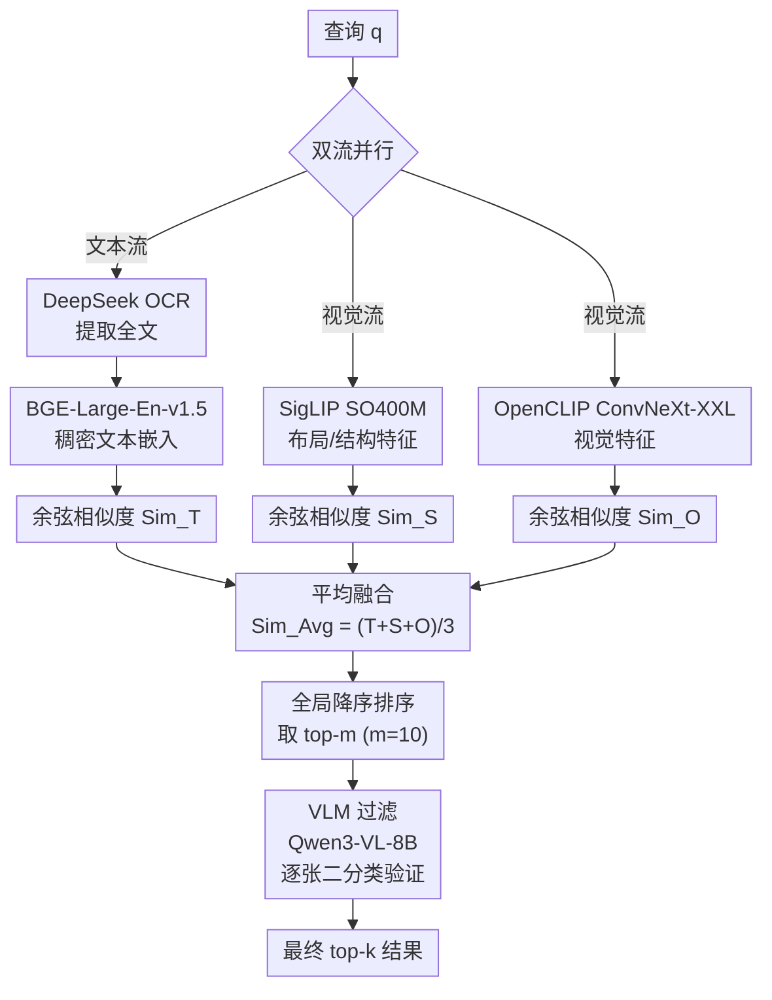

# Invoice Haystack: Benchmarking Document Retrieval and Visual Question Answering Under Strong Visual Homogeneity

**会议**: ECCV 2026  
**arXiv**: [2606.25343](https://arxiv.org/abs/2606.25343)  
**代码**: [https://heethanjan.github.io/invoice-haystack/](https://heethanjan.github.io/invoice-haystack/)  
**领域**: 多模态VLM  
**关键词**: 文档检索, 视觉同质性, 嵌入塌缩, 发票VQA, 多模态RAG

## 一句话总结

本文发现现有多文档 VQA benchmark 因文档类型高度多样化而人为制造了嵌入空间的可分性、掩盖了真实企业场景中模板化文档的检索困境，定量提出了"嵌入塌缩"概念（视觉相似文档平均余弦相似度 0.73 vs 已有基准 0.31-0.38），并构建 Invoice Haystack 压力测试基准（1500 张发票 + 200 个判别性 QA 对），同时提出 VL-RAG 双流融合 + VLM 验证过滤框架，在最强同质性设置下 Recall@1 达 50.0%，将此前 SOTA 从 40.0% 提升 10 个百分点。

## 研究背景与动机

视觉语言模型（如 GPT-5.2、Gemini 3.0 Pro、Qwen3-VL）在单文档 VQA 上已接近甚至超越人类，但当文档规模扩大到数百上千份时，检索性能显著退化。已有大规模多文档检索基准 DocHaystack 和 InfoHaystack 把文档集合扩充到 1000 篇，但它们的构建方式有一个被忽视的根本性问题：这些基准从各种来源（图表、手写信件、新闻剪报、学术论文等）混合了视觉特征截然不同的文档类型。在高维视觉嵌入空间中，异质文档自然形成互相分离的簇，检索器仅凭粗粒度的视觉全局特征（比如"这是一张饼图"对"这是一封手写信"）就能轻易区分正负样本。这会显著夸大检索器在真实场景中的可用性。

然而企业文档管理的现实截然相反：一个财务部门存放的几千张发票可能只来源于十几种模板，同一模板的两张发票在视觉嵌入空间中的余弦相似度可以高达 0.95，但包含完全不同的交易内容（不同的日期、金额、客户号）。当前 benchmark 的构建方式刻意回避了这一场景，因此它们无法告诉使用者一个检索系统在面对几百张同模板发票时是否还能正常工作。本文把这种现象命名为"嵌入塌缩"（Embedding Collapse），即视觉编码器把视觉高度相似的文档实例压缩到几乎无法区分的表示区域，使得纯视觉检索的输出接近随机猜测。这一塌缩在之前的工作中既没有被定量刻画，也没有对应的基准来测量。

本文因此做了两件事：首先设计一个专门逼出嵌入塌缩的 benchmark，然后提出应对这一问题的检索框架。**核心 idea：构建强视觉同质性的 Invoice Haystack 压力测试基准（1500 张发票，平均余弦相似度 0.73，是已有基准的 2 倍），并设计 VL-RAG 双流融合框架——文本流用 OCR + BGE-Large 捕获语义差异，视觉流用 SigLIP + OpenCLIP 保留布局结构，经平均融合得分排序 + VLM 二分类验证过滤，产生同时利用两种信号互补优势的精准检索结果。**

## 方法详解

### 整体框架

VL-RAG 的设计出发点是一个简单但关键的观察：在强视觉同质的文档集中，文本和视觉在各自单独使用时都信息不全，但二者提供正交互补的信号。文本使能实例级语义区分（"这张发票的日期是 10 月 15 日"），视觉则提供粗粒度的布局过滤（排除版面完全不同的文档）。因此 VL-RAG 构建了并行双流编码、平均得分融合、VLM 二次验证的三级流水线。查询 q 同时进入文本编码流和视觉编码流，两条流各自输出余弦相似度得分，三个得分做简单平均后对全语料排序，取出 top-m 候选送入 VLM 做逐张二次验证，最终输出严格确保可回答查询的 top-k 结果，架构在零样本的前提下即可运行。

### 关键设计

**1. 双流融合评分：让视觉与文本信号互补寻址**

视觉编码器在模板化文档上会遭遇嵌入塌缩——同一模板的两张发票在 SigLIP 表征下的余弦相似度均值高达 0.73，纯视觉检索在此场景下退化到接近随机（CLIP 在 Invoice-1500 上仅 7.0%）。纯文本方法虽能捕获发票之间的语义差异，但会丢弃有价值的结构布局信号，比如表格的行列对应关系、表头与表值的上下文，纯文本从 OCR 输出中很难准确还原。VL-RAG 的解决策略是让两条编码流并行工作并做简单平均融合。文本流先用 DeepSeek OCR 将图像转为文字，再用 BGE-Large-En-v1.5 编码为 1024 维稠密向量，与查询计算余弦相似度 Sim_T。视觉流使用 SigLIP ViT-SO400M/14@384 和 OpenCLIP ConvNeXt-XXL@1024 分别编码整图，计算 Sim_S 和 Sim_O。三个得分做等权平均：

$$\text{Sim}_{\text{Avg}} = \frac{1}{3}(\text{Sim}_T + \text{Sim}_S + \text{Sim}_O)$$

这种简单融合背后的效果逻辑是：一篇文档只有当它在文本上匹配（语义相符）且在视觉上匹配（布局一致）时才被推高总分，任一流域的低分都会拉低平均。消融实验证实，去掉文本流后在 Invoice-1500 上 Recall@1 从 50.0% 剧降至 21.0%，说明同质场景下文本信号是不可或缺的判别源，而纯视觉配置（Sim_S + Sim_O）在仅三视觉编码器时就已达 21.0%、几乎等同于文本的边际增益，印证了两者的互补性。

**2. VLM 验证过滤：用语义理解消除向量相似度的歧义**

向量相似度排序的长处是高召回——正确的文档通常落在 top-m 里，短处是低精度——top-1 经常不是对的。在同质的候选集中，最靠前的几份文档可能在视觉嵌入上极度靠近（如同一模板的三张发票只差一个金额数字），向量距离根本无法区分谁真回答。VL-RAG 针对这一矛盾设计了 VLM 验证过滤：对从平均融合得分排序中取出的 top-m 候选集（实验设 m=10），每张文档图像与原始查询一起送入 Qwen3-VL-8B-Instruct，用最简 Prompt 做二分类判断："Can this image provide the answer to this question? Answer only yes or no."。仅保留回答 "yes" 的候选作为最终输出，若全 "no" 则无过滤回退到 top-m 原始排名以保证总有结果。VLM 的介入将向量空间的连续相似度问题转化为语义层次的离散验证——模型需要真正"读"一下这张发票的内容来确认它是否包含查询所需的信息，消除了"视觉像但内容不像"的假阳性。消融实验显示，在 SigLIP+OpenCLIP+Text 的基础上添加 VLM 过滤，Invoice-1500 的 Recall@1 从 35.0% 跃升至 50.0%（+15pp），它是所有模块中贡献最大的单一组件。

**3. 最佳视觉编码器选择："No-CLIP"反直觉发现**

此前的最强基线 V-RAG 使用 CLIP + SigLIP + OpenCLIP 三个视觉编码器集成，直觉是更多编码器融合更强。但本文的消融实验发现了一个反直觉且可复现的规律：任何包含 CLIP 的配置都比不包含的更差。完整 VL-RAG（SigLIP + OpenCLIP + Text + VLM）在 Invoice-1500 上 Recall@1 为 50.0%，而加入 CLIP 后降为 33.5%，下降了 16.5 个百分点。将 CLIP 与 SigLIP+OpenCLIP 拼接做纯视觉融合（无 Text 流），Recall@1 也从 21.0%（不含 CLIP）降至 14.5%（含 CLIP）。作者分析原因是 CLIP 在自然图像上预训练，其对比学习目标偏好全局美学相似性——CLIP 认为同一模板的两张发票"相似"（因为整体视觉风格高度一致），这恰好与需要"区分不同实例"的检索目标矛盾。该发现对多文档检索系统的设计有实践指导意义：当目标任务与自然图像检索差异大时，"更多编码器 ≠ 更强"，编码器预训练数据分布的匹配度比其名气或参数量更重要。

**4. Invoice Haystack 基准构建：四阶段管线控质**

为逼出嵌入塌缩，基准本身的设计需要针对强视觉同质性做刻意裁剪，不是简单地挑一组发票就行。作者采用四阶段管线：（1）图像匿名化——Gemini 3 Pro 擦除 2000 张发票中的 7 类敏感信息（公司名、地址、账号等），但保持数字运算关系（行合计→小计→税额→总计经过严格校验），确保语义完整性不被破坏；（2）复杂 QA 生成——Gemini 2.5 Flash 对每张匿名发票生成一个需要多字段联合检索才能回答的问题（如"building no 506890 对应的 2023-10-15 的订单号是多少"），排除"Yes/No"和单字段问题，使用 1-2 词短答案以简化验证；（3）AI 过滤——GPT-5.2 筛选消除含糊、非区分性或无需看图即可回答的 QA，将候选从 2000 缩减到 200；（4）人工三查验证——人类审核员逐一检查匿名化完整性、问题区分力与答案准确性，同时手动移除有渲染缺陷的发票（2000→1500）。最终获得 200 个 QA 对 × 1500 张发票的基准集，平均成对余弦相似度 0.73——几乎是此前最高基准（0.38）的两倍，从量化上证实了与现有 benchmark 在难度上有质的差别。

### 一个完整示例

假设查询是："What is the order no associated with the contract invoice transaction dated 15-OCT-2023 and building no 506890？" 文本流中，DeepSeek OCR 从 1500 张发票各自提取全文，BGE-Large 将每篇与查询编码为向量后计算余弦相似度——只有同时含有 "15-OCT-2023" 和 "506890" 数字序列的少数发票获得高 Sim_T（如 0.87 vs 均值 0.32）。同时视觉流对每张发票编码——同一模板的发票布局相近，Sim_S 和 Sim_O 的区分度很小，但它能高效排除版面完全不同的文档（如一份目录页）。三者平均后 top-10 候选集里排名靠前的基本都是模板 A 下的发票（噪声模板 B 的发票因视觉差异被下拉）。进入 VLM 过滤阶段，Qwen3-VL-8B 逐一检查 10 张候选图：当看到一张发票上印着 "Order No: INV-2023-7890" 以及 "Building No: 506890" 时返回 "yes"，其余 9 张虽视觉布局极其相似但文字不符（如日期是 11 月或建筑编号不同）者回答 "no"。最终只有目标发票保留，Recall@1 命中。

### 损失函数 / 训练策略

无训练步骤。所有编码器（BGE-Large-En-v1.5、SigLIP SO400M/14@384、OpenCLIP ConvNeXt-XXL@1024）均为冻结零样本设置，不做任何微调；VLM 过滤器（Qwen3-VL-8B-Instruct）也以零样本方式进行二分类推理，贪婪解码，最大生成长度 128 token。检索池大小 m=10，所有实验在 A100（80GB）GPU 上执行。

## 实验关键数据

### 主实验

| 数据集 | 规模 | 指标 | VL-RAG | V-RAG | BM25(OCR) | CLIP | 提升(vs V-RAG) |
|--------|------|------|--------|-------|-----------|------|----------------|
| Invoice Haystack | 500 | R@1 | **60.0%** | 46.5% | 43.0% | 10.0% | +13.5 pp |
| Invoice Haystack | 1000 | R@1 | **53.0%** | 43.0% | 41.5% | 8.0% | +10.0 pp |
| Invoice Haystack | 1500 | R@1 | **50.0%** | 40.0% | 38.5% | 7.0% | +10.0 pp |
| DocHaystack | 1000 | R@1 | **77.1%** | 75.2% | 62.4% | 27.5% | +1.9 pp |
| InfoHaystack | 1000 | R@1 | **84.5%** | 80.0% | 32.9% | 53.6% | +4.5 pp |

在 Invoice Haystack 上 VL-RAG 的 Recall@1 显著超越 V-RAG 超过 10 个百分点，而在异质基准（DocHaystack、InfoHaystack）上领先幅度较小（1.9-4.5 pp），说明文本流的贡献在异质集合中是互补而非必要——视觉信息已足够判别。CLIP 在 Invoice-1500 上仅 7.0% 的 Recall@1 接近随机（随机 P=1/1500=0.067%），直观展示了嵌入塌缩的严重程度。在 VQA 端到端评估中（搭配 GPT-5.2），VL-RAG 在 Invoice-500 上准确率达 61.0%，超 V-RAG（49.5%）11.5 个百分点。

### 消融实验

| 配置 | Invoice-1500 R@1 | 三基准平均 R@1 | 说明 |
|------|------------------|----------------|------|
| 完整 VL-RAG (S+L+O+Text+VLM) | **50.0%** | **70.5%** | 不含 CLIP 的最优配置 |
| w/o VLM 过滤 (S+L+O+Text) | 35.0% | 55.9% | VLM 贡献最大的单一模块，+15pp |
| 纯文本 BGE 单独 | 31.5% | 52.4% | 纯文本反超全部纯视觉方案 |
| 纯视觉 (S+L+O) 无文本 | 21.0% | 44.0% | 无文本流 Invoice 仅 21.0% |
| 含 CLIP 的全文配置 (C+S+L+O+Text+VLM) | 33.5% | 54.5% | 含 CLIP 反而差于无 CLIP 版 |
| CLIP 单独 | 7.0% | 29.4% | Invoice-1500 上接近随机 |
| SigLIP 单独 | 20.0% | 35.7% | 视觉编码器中的最强单模 |
| OpenCLIP 单独 | 19.5% | 39.4% | 在异质基准上因自然图偏好偏高 |

### 关键发现

- **No-CLIP 是最反直觉的消融结果**：CLIP 作为几乎所有多模态任务的默认首选，在模板化文档检索中反而引入噪声，任何含 CLIP 的配置都比对应的无 CLIP 配置更差。SigLIP + OpenCLIP 是最佳视觉组合，预训练数据分布匹配度比编码器名气更重要。
- **VLM 过滤是增益最大的单一组件**：将 Recall@1 从 35.0% 提升至 50.0%（+15pp），VQA accuracy 整体上升约 8-12pp。它用大模型的语义理解解决了向量距离无法消除的歧义，是整条流水线从"好召回"到"好精度"的转换器。
- **BM25(OCR) 出乎意料地强**：传统稀疏检索在 Invoice-1500 上达 38.5% R@1，超过所有纯视觉方案（SigLIP 20.0%、OpenCLIP 19.5%、CLIP 7.0%），与 V-RAG（40.0%）只差 1.5pp。这一数据有力地说明在同质场景下文本信号是更可靠的判别来源，也提醒社区在做复杂神经检索之前应先建立强稀疏基线。
- **Top-k 检索深度并非越大越好**：从 k=1 提升到 k=3 时多数 VLM 的 VQA 准确率上升，但从 k=3 再到 k=5 时 Gemini 和 Qwen3-VL 的准确率反而轻微下降（如 Qwen3-VL 在 Invoice-500 上从 64.0% 降至 63.0%），说明更多候选引入的干扰信息开始抵消召回增益。

## 亮点与洞察

- 嵌入塌缩的量化定义（平均余弦相似度 0.73 vs 0.31-0.38）虽然简单，但它首次用一个具体数字刻画了"文档有多视觉相似"以及"检索因此差了多少"。这个度量本身可作为任何多文档检索工作的诊断工具。
- No-CLIP 发现可视为一个典型的"最佳模型在新场景下失灵"案例。CLIP 在多模态几乎所有子领域都是默认首选，但在强视觉同质性下适得其反，提示研究者在构建系统时不要依赖组件名气，必须做针对性消融。
- VLM 验证过滤做到极致简单（一句 Prompt、一个 8B 模型），却是最大增益来源，这种"粗检索 + 精验证"的分层范式——在向量层面做高召回候选生成、在语义层面做高精度确认——可迁移到其他需要从大规模近距候选中找到唯一答案的信息检索场景。
- 实验设计的覆盖面完整：3 个基准（同质/异质对照）× 3 个语料规模 × 3 个检索指标 + VQA 端到端 + 系统性消融含 CLIP 有无对照，论证链可信的另一个体现是消融表中每个排除了某个组件的配置的数字都能从物理角度解释其升降原因。

## 局限与展望

- 融合权重固定为 1/3 等权平均，没有考虑语料本身的同质性程度来动态调整。未来可以依据当前集合的余弦相似度分布，在更同质时提高文本流权重、更异质时提高视觉流权重。
- 所有编码器均零样本使用，如果在财务文档领域做有监督微调有望进一步提升，但可能会损害异质基准上的泛化（即 DocHaystack/InfoHaystack 上的性能下降风险）。
- 基准仅覆盖发票一种文档类型，企业场景中还有合同、采购订单、质检报告等其他模板化文档，在领域多样性上有限。
- 200 个 QA 对相对较少（虽然严格的四阶段生成流程确保了质量），更难在大规模上评估统计显著性，未来可用合成数据或众包扩展。
- 缺少跨模板难度分层：同厂家不同格式发票的视觉差异度、不同厂家模板间的可混淆度没有细粒度标签，不利于细粒度分析检索器在哪里失败。

## 相关工作与启发

- **vs V-RAG [Chen+ 2025]**: 作为最直接的基线，V-RAG 完全依赖多视觉编码器集成（CLIP+SigLIP+OpenCLIP），没有显式文本编码，由 BM25(OCR) 的表现反超说明纯视觉在多文档同质检索中存在根本性的信息瓶颈。VL-RAG 加入 BGE 文本流后将最优 Recall@1 从 40.0% 提升至 50.0%。
- **vs ColPali [Faysse+ 2024]**: ColPali 用视觉语言模型做端到端页面级别检索（late interaction），不需要显式 OCR 管线。VL-RAG 的可控双流架构方便做组件级消融（如 No-CLIP 效应），但端到端优化的潜力和推理效率可能不如 ColPali。
- **vs BM25 [Robertson & Zaragoza 2009]**: BM25(OCR) 是本文最有冲击力的对照——纯文本稀疏检索在 Invoice-1500 上达到 38.5% R@1，高于 SigLIP（20.0%）和 OpenCLIP（19.5%）。结果提醒社区在转向复杂神经检索方法前应建立有意义的稀疏基线。

## 评分

- 新颖性: ⭐⭐⭐⭐ 嵌入塌缩的量化定义和 No-CLIP 发现是真实的新贡献，但双流融合本身并非全新思路
- 实验充分度: ⭐⭐⭐⭐⭐ 3 基准 × 3 规模 × 3 指标 + VQA 端到端 + 系统消融含所有关键组件，论证链完整，反直觉结论可复现
- 写作质量: ⭐⭐⭐⭐ 动机链条清晰，实验数据组织合理，但方法部分公式堆叠稍显冗余
- 价值: ⭐⭐⭐⭐⭐ 直接暴露了多文档检索领域容易被忽视的核心痛点，Invoice Haystack 基准和 No-CLIP 消融发现对被文档检索和金融 AI 感兴趣的研究者有持久参考价值

<!-- RELATED:START -->

## 相关论文

- [\[NeurIPS 2025\] Benchmarking Retrieval-Augmented Multimodal Generation for Document Question Answering](../../NeurIPS2025/multimodal_vlm/benchmarking_retrievalaugmented_multimodal_generation_for_do.md)
- [\[ACL 2026\] WikiSeeker: Rethinking the Role of Vision-Language Models in Knowledge-Based Visual Question Answering](../../ACL2026/multimodal_vlm/wikiseeker_rethinking_the_role_of_vision-language_models_in_knowledge-based_visu.md)
- [\[CVPR 2026\] VQ-VA World: Towards High-Quality Visual Question-Visual Answering](../../CVPR2026/multimodal_vlm/vq-va_world_towards_high-quality_visual_question-visual_answering.md)
- [\[CVPR 2025\] MARTEN: Visual Question Answering with Mask Generation for Multi-Modal Document Understanding](../../CVPR2025/multimodal_vlm/marten_visual_question_answering_with_mask_generation_for_multi-modal_document_u.md)
- [\[ICLR 2026\] Meta-Adaptive Prompt Distillation for Few-Shot Visual Question Answering](../../ICLR2026/multimodal_vlm/meta-adaptive_prompt_distillation_for_few-shot_visual_question_answering.md)

<!-- RELATED:END -->
