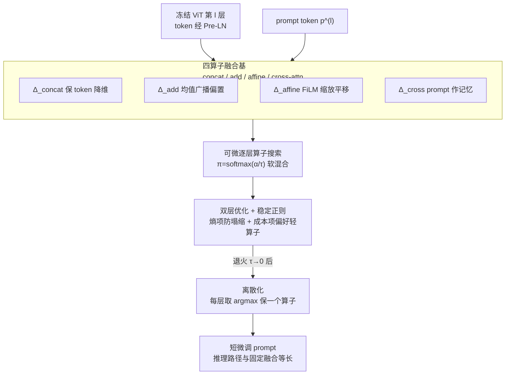

# Layer-Specific Prompt Fusion Discovery via Differentiable Search in Vision Foundation Models

**会议**: ECCV 2026  
**arXiv**: [2606.26379](https://arxiv.org/abs/2606.26379)  
**项目页**: [https://xixiaouab.github.io/Prompt-Fusion-Discovery/](https://xixiaouab.github.io/Prompt-Fusion-Discovery/)  
**代码**: 见项目页（论文未直接给 GitHub 链接）  
**领域**: 多模态VLM / 视觉基础模型 / 参数高效微调  
**关键词**: 视觉 prompt tuning、可微架构搜索、逐层融合、DARTS、信息瓶颈

## 一句话总结
本文把视觉 prompt tuning 里「prompt 与 image token 怎么融合」这件一直被写死为拼接/相加的事，重新表述成一个双层优化问题，用可微架构搜索（DARTS）为冻结 ViT 的**每一层各自挑选**一个融合算子（concat / add / affine / cross-attention），在只调 0.75% 参数的前提下把 VTAB-1k 均值刷到 77.01%，并揭示「融合方式本身」是 prompt tuning 里此前被忽视的一阶变量。

## 研究背景与动机
视觉 prompt tuning（VPT）已经是把大规模 ViT 迁移到下游任务的主流参数高效方案：backbone 全程冻结，只往输入/特征空间里塞一小撮可学习的 prompt token，训练时只更新这些 token。它的核心动作其实只有一步——在把融合结果送进 transformer 层之前，怎么把 prompt token 和 image token 拼到一起。可是从 VPT 到后来的 E2VPT、SA2VP、VFPT、LoR-VP 一路下来，绝大多数工作都在琢磨「prompt 放在哪几层、长度多少、要不要频域化、要不要空间结构化」，唯独**融合方式**几乎无人动过：要么拼接（concatenation），要么相加（addition），而且一旦选定就在全网所有层用同一种，从第 1 层到第 12 层一视同仁。

问题在于 ViT 不同深度承载的语义天差地别——浅层管低级结构、深层管高级语义，这是被反复证实的分层特性；那么用一把「固定的融合尺子」量到底的做法就很可疑：到底是拼接更好还是相加更好？会不会存在一种混合方案，能在不同层各取所长？如果混合方案确实更优，光靠拼接和相加这两块料是否够拼出好东西？作者做了个前置观察（Sec. 3.3 消融）——把 concat 和 add 这两种简单融合直接组合，并不能得到最优结果，说明搜索空间的「原材料」不够丰富。真正的矛盾是：融合方式的选择空间是离散的、逐层的、还和 prompt 参数耦合（换了融合方式，最优 prompt 也会变），手工穷举 $4^{12}$ 量级的组合根本不现实。本文要做的，就是把「选融合方式」从人拍脑袋变成可学习、可搜索、随任务和层深自动适配。

本文的核心 idea 是：**把 prompt-token 融合当作一个可搜索的可微组件，用 DARTS 式双层优化让冻结 ViT 的每一层从 {concat, add, affine, cross-attention} 里自动选出最适合该层语义的融合算子**——内层优化 prompt，外层优化「每层用哪种融合」的架构权重，并额外提出 affine 与 cross-attention 两种轻量算子来把搜索空间的表达力补齐。

## 方法详解

### 整体框架
方法名为 **Auto-Prompting**。标准 VPT 在每一层用同一个固定融合算子把 prompt 和 patch token 拼起来喂给冻结的 transformer；本文把这个固定算子换成一个**可搜索的融合模块**，分两阶段工作。**搜索阶段**：每层维护一组「架构 logits」$\alpha^{(l)}$，经 softmax 得到对 4 个候选算子的逐层偏好权重 $\pi^{(l)}=(\pi_1,\pi_2,\pi_3,\pi_4)$；同时 4 个算子并行处理同一份输入产出各自结果 $\Delta_1,\dots,\Delta_4$，加权求和成软融合喂进冻结块。**离散化阶段**：训练收敛后，对每层取偏好最大的那一个算子固定下来，丢弃其余，再短暂微调 prompt 恢复性能。

关键的注入点：设冻结 ViT 用 Pre-LayerNorm 结构，本文把融合模块 $\Delta^{(l)}$ 插在**层内 LayerNorm 之后、冻结 MSA 之前**，且不在其后再加归一化——即 $\widehat{x}_{\mathrm{msa}}^{(l-1)}=\Delta^{(l)}(p^{(l)},\tilde{x}^{(l-1)})$，$\tilde{x}^{(l-1)}=\mathrm{LN}(x^{(l-1)})$。之所以插在 LN 之后，是因为 LN 会把加在它之前的任何常数偏置抹掉（$\mathrm{LN}(z+b)=\mathrm{LN}(z)$），只有插在 LN 后才能让加性/仿射调制真正保留下来。所有算子被强制约束输出恒为 $k\times d$（$k$ 是含 CLS 的 token 数），使冻结 backbone 的接口、位置编码、注意力图尺寸、块内 FLOPs 都不变。

可训练变量分两组：**模型参数 $\phi$**（prompt token 本身 + 各算子内部权重，如 concat 的降维矩阵、affine 的 FiLM MLP、cross 的 QKV 投影）与**架构参数 $\alpha$**（每层一个 4 维 logit 向量，只决定选哪种融合）。二者分别在训练集 / 验证集上优化，构成双层规划。

### 关键设计

**1. 四算子融合基：把「可能有用的融合方式」组织成一个完备且轻量的搜索空间**

搜索空间 $\mathcal{S}=\{\Delta_{\texttt{concat}},\Delta_{\texttt{add}},\Delta_{\texttt{affine}},\Delta_{\texttt{cross}}\}$ 是本文的原材料。前置消融显示只有 concat+add 两种简单融合拼不出最优解，于是作者额外引入 affine 和 cross-attention，理由是这四者互补且轻量，且很多更重的融合设计（门控残差、动态投影）都能由它们精确组合或近似逼近，构成「特征调制的完备基」。四者具体机制：

- **concat**（保 token 拼接）：不像原始 VPT 把 $(m{+}k)$ 个 token 塞进块里改变接口，本文先前缀 prompt 再用一个列随机矩阵 $R^{(l)}=\mathrm{softmax}_{\mathrm{col}}(U^{(l)})$ 把序列压回 $k$ 个 token：$\Delta_{\texttt{concat}}=(R^{(l)})^{\top}[p^{(l)};\tilde{x}^{(l-1)}]$。每个输出 token 是 $(m{+}k)$ 个输入的凸组合，不用任何 QKV 投影，比 cross 更省更稳。
- **add**（均值偏置）：把 prompt 汇成一个向量 $s=\mathrm{LN}(\mathrm{mean}(p^{(l)}))$，广播加到每个 token 上，$\Delta_{\texttt{add}}=\tilde{x}^{(l-1)}+\mathbf{1}_k s^{\top}$，代价几乎为零。
- **affine**（FiLM 缩放平移）：复用同一个 prompt 摘要 $s$，用两个小 MLP 生成逐通道的缩放 $\gamma=\sigma(\phi_\gamma(s))$ 和偏移 $\beta=\phi_\beta(s)$，$\Delta_{\texttt{affine}}=\gamma\odot\tilde{x}^{(l-1)}+\mathbf{1}_k\beta^{\top}$。add 是它 $\gamma=\mathbf{1},\beta=s$ 的特例。
- **cross-attention**（prompt 作记忆）：image token 作 query 去 attend 一份 prompt 记忆，$A^{(h)}=\mathrm{softmax}(Q_x^{(h)}(K_p^{(h)})^{\top}/\sqrt{d_h})\in\mathbb{R}^{k\times m}$，输出拼头后加残差。它提供内容自适应的路由，是四者里最重的。

论文特别讨论了 add 与 affine 的「冗余」为何要留（Sec. 2.5）：虽然 add 是 affine 特例，但从零训 affine 的 MLP 优化地形复杂得多，参数无关的 add 像残差连接一样在搜索早期提供稳定的近恒等梯度通路；且外层的成本正则会利用这种冗余做隐式剪枝——只有当 affine 的额外表达力真能降验证损失时才启用它，否则自动退回零成本的 add。作者报告：没有这种「利用算子冗余」的稳定化策略，搜索会有 65% 的概率塌缩到次优解。

**2. 可微逐层算子搜索（DARTS 双层优化 + 稳定正则）：把「选融合方式」变成可用梯度求解的问题**

这是「differentiable search」的核心。离散的「第 $l$ 层用哪个算子」被松弛成连续的软混合：$\pi^{(l)}(\tau)=\mathrm{softmax}(\alpha^{(l)}/\tau)$，软融合 $\Delta_{\text{soft}}^{(l)}=\sum_{i\in\mathcal{S}}\pi_i^{(l)}\Delta_i$，温度 $\tau$ 从高（探索）退火到低（选择），$\tau\to0$ 时软融合收敛到 argmax 的硬选择。优化目标是标准 DARTS 双层规划——外层在验证集上调架构参数 $\alpha$，内层在训练集上调模型参数 $\phi$：

$$\min_{\alpha}\ \mathcal{L}_{\mathrm{val}}\big(\phi^{\ast}(\alpha),\alpha\big),\quad\text{s.t.}\ \ \phi^{\ast}(\alpha)=\arg\min_{\phi}\mathcal{L}_{\mathrm{train}}(\phi,\alpha).$$

$\nabla_\alpha\mathcal{L}_{\mathrm{val}}$ 用 DARTS 的一步展开近似（先对 $\phi$ 走一步 $\phi'=\phi-\eta_\phi\nabla_\phi\mathcal{L}_{\text{train}}$，再算含 Hessian-向量积的修正项），HVP 由两次反向传播算得、不显式构造 Hessian。为防止过早塌缩、并在精度相近时偏好便宜算子，外层加两个正则：**负熵项** $\widetilde{\mathcal{R}}_{\mathrm{ent}}=-\sum_l H(\pi^{(l)})$ 鼓励探索，**成本项** $\widetilde{\mathcal{R}}_{\mathrm{cost}}=\sum_l\sum_i c_i\pi_i^{(l)}$ 惩罚重算子，其中归一化成本先验按微基准设为 $c=[0,0.06,0.30,1.00]$（对应 add, affine, concat, cross）。外层总目标：

$$\mathcal{L}_{\text{outer}}=\mathcal{L}_{\mathrm{val}}+\lambda_{\mathrm{ent}}\widetilde{\mathcal{R}}_{\mathrm{ent}}+\lambda_{\mathrm{cost}}\widetilde{\mathcal{R}}_{\mathrm{cost}}.$$

搜索到某个 epoch 后离散化：每层取 $\widehat{i}^{(l)}=\arg\max_i\pi_i^{(l)}$，冻结 $\alpha$、只保留选中算子，再短微调 $\phi$ 几轮。这样最终部署的推理路径长度和固定融合方法完全一样——搜索的开销只在训练期，推理期零额外分支。这正是「逐层融合」的落地含义：不是所有层共享一种融合，而是搜出一张「第几层用哪个算子」的蓝图。

**3. 信息瓶颈视角：为什么「让每层自选融合」在原理上就该更好**

作者用信息瓶颈（IB）给方法一个理论解释，而非仅靠实验。设进入第 $l$ 层的表示为 $T^{(l)}$，逐层 IB 目标 $\mathcal{L}_{\mathrm{IB}}^{(l)}=I(T^{(l)};X)-\beta I(T^{(l)};Y)$（$X$ 输入图、$Y$ 标签），前者要压缩输入相关的冗余、后者要保留标签相关信息。互信息不可精确计算，故用 MINE/InfoNCE/CLUB 三种变分估计器报告一致趋势。观察结论（CUB-200, ViT-B/16）：相比固定融合的 VPT，本文在深层对 $\widehat{I}(T^{(l)};X)$ 的压缩更强、对 $\widehat{I}(T^{(l)};Y)$ 的保留更高，经验 IB 代理值一致更低——即搜索出的融合达到了更优的「压缩-相关」权衡。作者强调这是趋势性证据而非「去背景」的因果证明。这个视角还解释了搜索学到的规律：浅层偏好轻算子（concat/add）保结构线索，深层转向语义算子（affine/cross-attn）强调标签相关模式，与 Sec. 3.4 的注意力趋势自洽。

### 损失函数 / 训练策略
两阶段（Algorithm 1）：**Phase I 可微搜索**——每 epoch 内层用软混合更新 $\phi$、外层用一步展开梯度更新 $\alpha$、并按余弦退火降 $\tau$；**Phase II 离散化后短微调**——各层只用选中算子，继续调 $\phi$ 恢复性能。训练细节：AdamW，学习率 $1\times10^{-3}$，weight decay 0.01，余弦调度，100 epoch，batch 64，A100，三个种子取平均 top-1。默认每层 10 个 prompt token（$d=768$）。

## 实验关键数据

### 主实验
在 34 个数据集、3 个基准（VTAB-1k 19 个、FGVC 5 个、HTA 10 个）上，ViT-Base/16 冻结 backbone。核心对比（Table 1）：

| 方法 | 调参比例(%) | FGVC均值 | HTA均值 | VTAB-1k均值 | Structured |
|------|------------|---------|--------|------------|-----------|
| VPT-Deep (ECCV22) | 0.73 | 89.11 | 85.5 | 69.43 | 54.98 |
| VFPT (NeurIPS24) | 0.66 | 89.24 | — | 75.49 | 60.19 |
| SA2VP (AAAI24) | 0.81 | 90.08 | 91.5 | 75.83 | 60.80 |
| LoR-VP (ICLR25) | — | 91.22 | — | 74.69 | 58.71 |
| **Ours (Auto-Prompting)** | **0.75** | **91.60** | **92.5** | **77.01** | **62.55** |

相对固定融合的 VPT-Deep，VTAB-1k 均值 +7.58、FGVC +2.49、HTA +7.0；相对 VFPT 在近似预算下 VTAB +1.52；相对 SA2VP 拿下 Natural(82.88) 与 Structured(62.55) 双最优。**Structured 组提升最猛**（+7.57 over VPT-D），细分到几何推理任务尤其明显：dSprites/Orientation +6.6%、CLEVR/Count +14.7%（均 over VPT-Deep）——固定融合抓不住空间关系，而搜索自动让深层用 cross-attention 做内容自适应路由。跨预训练范式（Table 2）：MoCo v3 下仅调 0.25% 参数即全类别最优（Natural 79.60 / Specialized 86.86 / Structured 61.01）；MAE 下也以更低预算全面超过 VFPT。换 Swin-Base（Table 3）同样全类别最优，Structured 较 VPT-D +10.51%。

### 消融实验
只改融合规则、固定 prompt 长度和 backbone（Table 4，VTAB-1k 三类均值）：

| 融合方式 | 是否搜索 | Natural | Specialized | Structured | 相对最优固定的增益 |
|---------|---------|---------|------------|-----------|------------------|
| Concat | ✗ | 78.42 | 82.10 | 56.33 | -1.73 |
| Add | ✗ | 77.63 | 81.47 | 55.98 | -2.32 |
| Affine | ✗ | 78.86 | 82.62 | 57.40 | -1.05 |
| Cross-Attn | ✗ | 79.91 | 83.44 | 58.67 | 0.00（最优固定）|
| **Ours（搜索）** | ✓ | **82.88** | **85.61** | **62.55** | **+3.00** |

### 关键发现
- **没有任何单一算子是全局最优**：单算子里 cross-attention 最强，但即便如此，逐层搜索仍比它再高 +3.00 均值（Structured 上 +3.88 最大）——证明「融合方式」值得逐层区别对待，光改 prompt 内容不够。
- **搜索学到的算子随深度分布高度规律**：VTAB-1k 上 1–4 层把 0.69 的概率质量给轻算子（concat/add），9–12 层把 0.73 给 affine/cross-attn，中间层（5–8）熵最高最纠结；三个种子间 12 层有 9–10 层的最终算子一致。且「最终选 cross-attention 的层」正是「换成固定规则后掉点最多的层」——**在哪切换算子和选哪个算子同样重要**。
- **任务自适应**：FGVC 把 cross-attention 往更深推（要绑定细粒度实例属性），Structured 比 Natural 更频繁选 cross/affine（重几何校准），任何静态配方都抓不住这些差异。
- **效率可接受**：4 候选时搜索开销是 VPT-Deep 的 1.38×（10.8 vs 7.8 GPU 小时），但换来 VTAB 均值 +3.5；离散化后每图推理 15.9ms vs VPT-Deep 14.8ms，仅 +7.4%——因为推理期每层只留一个算子、并靠算子异构让浅层用便宜操作、深层才用贵操作。

## 亮点与洞察
- **把「融合方式」提升为一等可搜索变量**：这是全文最「啊哈」的点——领域卷了几年 prompt 的位置/长度/频域，却没人质疑过融合算子本身可以逐层不同、可以被学。作者用一个前置消融（concat+add 拼不出最优）就把这个盲区戳开了。
- **搜索空间的「完备基」论证很扎实**：不是随手塞四个算子，而是论证 add/affine/concat/cross 分别对应偏置注入/特征校准/凸组合/内容路由，能组合逼近更重的融合设计；还专门辩护 add 与 affine 的表面冗余为何对搜索稳定性和隐式剪枝都不可少（去掉就 65% 塌缩）。
- **成本先验驱动的隐式剪枝**：把逐算子微基准延迟归一成 $c=[0,0.06,0.30,1.00]$ 塞进外层正则，让搜索在精度相近时自动退回便宜算子——这个「精度-成本前沿可调」的机制可直接迁到任何 DARTS 式 PEFT 搜索里。
- **IB 视角与算子调度的呼应**：把「浅层保结构、深层做语义」这条经验规律和信息瓶颈的压缩-相关权衡对上了，给「为什么逐层自选融合有效」提供了原理层解释，而不只是刷点。

## 局限与展望
- **搜索有额外训练开销**：1.38× 的搜索成本对小数据集尚可，但要扩到大规模数据或更深/更多候选算子时，双层优化 + HVP 的开销会放大（作者把这归为深层评 cross-attention 所致）。
- **IB 结论是相关性而非因果**：作者自己反复强调 MI 观察是「趋势性证据」，注意力集中≠去背景，不能当成精度提升的因果证明——读者不宜过度解读。
- **搜索空间仍是手工设定的四算子**：虽号称可扩展、能塞新算子，但当前完备性论证依赖「更重融合能被这四者近似」这一假设；若某任务需要的融合本质不在这个基里，方法上限就被框住了。
- **主要验证在分类**：34 个数据集都是识别/分类任务，附录仅提「初步的密集预测扩展」，检测/分割等结构化输出任务上是否同样奏效尚待验证。
- ⚠️ arXiv 号 2606.26379（2026-06）为未来/占位日期，部分引用（如 liu2026*、xiao2026*）也指向未来年份，具体数值与引用以原文正式版为准。

## 相关工作与启发
- **vs VPT / VPT-Deep**：VPT 全网用单一固定融合（拼接或相加），本文把融合变成逐层可搜索组件。区别在于 VPT 只学 prompt「内容」，本文同时学 prompt 内容与「融合方式」；优势是 VTAB-1k 均值 +7.58 且几何推理任务大幅领先，代价是搜索期多 38% 训练开销。
- **vs E2VPT / SA2VP / VFPT / LoR-VP**：这些后续工作分别在 prompt 的解耦/残差交互、空间结构、频域、低秩形式上做文章，但都仍固定融合方案。本文正交地补上「融合选择」这块缺口，且在相近参数预算下超过它们全部。
- **vs 传统 ViT 的 NAS**：以往 NAS 用来搜 transformer 块结构、宽度、头数或动态 token 路由；本文把 prompt tuning 放进 DARTS 框架，搜的不是网络本身而是「冻结 backbone 上的 prompt 融合算子」，保持 ViT 接口不变——这是把 NAS 和轻量微调嫁接起来的新用法。
- **vs FiLM / 交叉注意力**：affine 算子直接借用 FiLM 的逐通道缩放平移，cross 借用标准注意力，但本文的贡献不在这两块砖本身，而在「让每层自动决定用哪块砖」，并给出何时该用重砖（深层、几何任务）的数据驱动答案。

## 评分
- 新颖性: ⭐⭐⭐⭐⭐ 把「融合方式」从写死变成逐层可搜索，是 prompt tuning 领域一个真正被忽视的一阶变量，切入角度新且有说服力。
- 实验充分度: ⭐⭐⭐⭐⭐ 34 数据集 3 基准、跨 MAE/MoCo v3 预训练、跨 ViT/Swin backbone、含逐层算子分布与注意力可视化、效率-延迟分析，覆盖面很全。
- 写作质量: ⭐⭐⭐⭐ 方法与观察分层清晰、诚实标注 IB 为相关性证据；但公式与附录极密，主文若无附录较难完全复现搜索稳定化细节。
- 价值: ⭐⭐⭐⭐ 成本可控、推理零额外开销、可扩展塞新算子，且 insight（逐层融合调度）可直接启发其他 PEFT 搜索，实用与启发性兼具。

<!-- RELATED:START -->

## 相关论文

- [\[ICML 2026\] Layer-Specific Fine-Tuning for Improved Negation Handling in Medical Vision-Language Models](../../ICML2026/multimodal_vlm/layer-specific_fine-tuning_for_improved_negation_handling_in_medical_vision-lang.md)
- [\[ICLR 2026\] InSight-o3: Empowering Multimodal Foundation Models with Generalized Visual Search](../../ICLR2026/multimodal_vlm/insight-o3_empowering_multimodal_foundation_models_with_generalized_visual_searc.md)
- [\[CVPR 2026\] Towards Calibrating Prompt Tuning of Vision-Language Models](../../CVPR2026/multimodal_vlm/towards_calibrating_prompt_tuning_of_vision-language_models.md)
- [\[CVPR 2026\] LVLM-Aided Alignment of Task-Specific Vision Models](../../CVPR2026/multimodal_vlm/lvlm-aided_alignment_of_task-specific_vision_models.md)
- [\[AAAI 2026\] BOFA: Bridge-Layer Orthogonal Low-Rank Fusion for CLIP-Based Class-Incremental Learning](../../AAAI2026/multimodal_vlm/bofa_bridge-layer_orthogonal_low-rank_fusion_for_clip-based_.md)

<!-- RELATED:END -->
