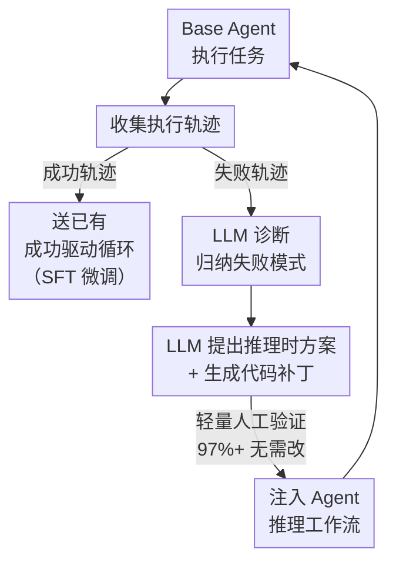

# Learning from Failure: Inference-Time Self-Improvement for Computer-Use Agents

**会议**: ECCV 2026  
**arXiv**: [2606.31270](https://arxiv.org/abs/2606.31270)  
**代码**: [https://github.com/snow10072740/Learning_from_Failure](https://github.com/snow10072740/Learning_from_Failure) (有)  
**领域**: 多模态VLM / Agent  
**关键词**: 失败驱动自我改进, 推理时优化, 计算机使用Agent, GUI智能体, 代码补丁  

## 一句话总结

提出一个失败驱动的推理时自我改进循环：LLM 作为元控制器分析 Agent 在 GUI 任务中积累的失败轨迹，归纳出 grounding 错误、能力缺口、知识不足和冗余循环四类瓶颈，分别为每类设计推理时优化策略（视觉搜索 / 终端执行 / 知识支持 / 重复告警），以代码补丁形式注入 Agent 工作流，在 OSWorld 上将 OpenCUA-72B 的 success rate 从 42.3% 提升至 48.9%（+6.6 点），零额外训练开销，仅增加约 8% 推理计算量。

## 研究背景与动机

**领域现状**: 计算机使用 Agent（Computer-Use Agent）利用多模态大语言模型操作电脑完成购票、做幻灯片等复杂任务。这类系统需要大量高质量交互轨迹数据来训练和改进。由于人工标注轨迹成本极高、不可扩展，主流做法是在可验证环境（如 OSWorld）中让 Agent 自主执行任务，用自动验证器判断轨迹是否正确，保留成功轨迹并用于迭代微调（SFT），形成"Agent → 环境 → 成功轨迹 → 微调 → 改进 Agent"的自我改进循环。OpenCUA、UI-TARS、Mobile-Agent 等代表性工作都采用这一范式。

**现有痛点**: 这种成功驱动循环有一个根本性浪费——大量失败轨迹被直接丢弃。构建可验证环境本身需要可观的人力工程投入（虽然比人工标注轨迹便宜，但远非免费），丢弃失败轨迹意味着这部分投入的产出被浪费了一半以上。更重要的是，失败轨迹本身蕴含了丰富的信息——每条失败轨迹都是一个诊断样本，精确指出了 Agent 在哪些场景下 grounding 不准、哪些操作反复不生效、哪些知识超出模型训练范围。这些诊断信号比成功轨迹更加富信息量。

**核心矛盾**: 一方面构建可验证环境的工程投入应当被充分利用、不应浪费；另一方面失败轨迹包含丰富的诊断信息却一直被丢弃。

**本文目标**: 探索一个互补的失败驱动自我改进循环，在推理时（而非训练时）从失败轨迹中提取价值，实现不增加训练成本的 Agent 持续改进。

**核心 idea**: 用 LLM 作为元控制器来分析失败轨迹、诊断失败模式、提出推理时解决方案并自动生成代码补丁；经过轻量人工验证（平均 <3% 行数需要修改）后注入 Agent 工作流，让 Agent 在不重新训练的情况下改进推理时行为。

## 方法详解

### 整体框架

论文提出一个失败案例循环（Failure-Case Loop），与已有的成功驱动循环互补。核心流程分为三个阶段：

**阶段一 —— 失败轨迹收集**：基础 Agent 在可验证环境（OSWorld）中执行任务，生成多样化执行轨迹。环境的内置奖励函数自动评估每条轨迹，失败轨迹被保留作为后续分析和改进的素材。

**阶段二 —— LLM 引导的诊断与改进**：每条失败轨迹（包含任务指令、动作历史、中间思考过程）被送入 LLM。LLM 在上下文中推理失败原因，进行结构化诊断——归纳出当前主导的失败模式，提出对应的推理时修正策略，并自动生成可直接注入 Agent 代码的补丁。人类仅做轻量验证（选策略方向 + 检查代码语法），97%+ 的补丁无需修改即可部署。

**阶段三 —— 迭代累积**：补丁被集成到 Agent 的推理工作流中，然后 Agent 在新一轮 rollout 中执行。更新后的失败轨迹再次进入诊断循环。经过 4 轮迭代，四种策略依次被引入并累积生效。

### 关键设计

**1. 视觉搜索：解决 grounding 不精准问题**  

LLM 在第一轮分析中发现 grounding 错误是最常见的瓶颈之一：Agent 在复杂 UI 界面上定位目标元素时频繁出错，尤其在高分辨率或视觉密集的界面中。为此设计了视觉搜索机制作为 grounding 的后验证环节。每当 Agent 执行需要空间定位的操作（如 click、moveto、dragto）时，框架以目标位置为中心裁剪 400×400 像素区域并放大 2 倍，在该区域上用红色空心圆圈（半径 7px）标记原始动作位置，然后将这张带标注的局部视图连同任务指令、动作历史和推理上下文一起送给 Agent，要求 Agent 验证该操作是否正确。如果 Agent 判定坐标有误，可以主动修正坐标后再执行。这个"执行 → 验证 → 修正"闭环显著提高了 grounding 精度，在 OSWorld 小集上将 success rate 从 41.67% 提升到 47.22%（+5.55 点），是四个策略中贡献最大的之一。

**2. 终端执行：填补 Agent 的能力操作缺口**  

LLM 识别出另一个系统性短板：Agent 默认只使用鼠标/键盘的低级 GUI 操作（点击、拖拽），但操作系统本身提供了更可靠的顶层控制接口——终端。Agent 几乎从不主动使用终端，导致很多本可用一条命令完成的任务变成了易出错的复杂点击序列。为此框架引入终端执行能力：Agent 可通过快捷键 Ctrl+Alt+T 打开终端，用命令行执行文件查找、程序安装、路径复制等操作。对于终端能力较弱的 Agent（如 GUI-Owl-32B），框架还额外注入了三条操作规则——必须用快捷键打开终端、执行命令前先搜索正确语法、命令后必须按 Enter 提交。这一策略在 OSWorld 小集上提升 5.52 个百分点（从 41.67 到 47.19），效果与视觉搜索相当，说明"给 Agent 更高效的工具"和"让 Agent 更准地使用现有工具"同等重要。

**3. 知识支持：弥补 Agent 的专业领域知识不足**  

LLM 发现 Agent 在遇到超出其内部知识范围的任务时频繁陷入停滞——例如不知道 LibreOffice 的特定快捷键、不清楚命令行安装语法。Agent 缺乏像人类一样查阅外部资料的机制。为此设计两套互补的知识获取通道：一是软件手册检索器，为 Agent 提供经挑选的常用软件快捷键/操作指南（如 LibreOffice Calc 的 Ctrl+D 向下填充、Writer 的 Ctrl+L 左对齐等），手册被组织成紧凑的参考表而非全文；二是搜索引擎接口，允许 Agent 在不确定时向 GPT-5-mini 发出自然语言查询，返回简洁可操作的信息。当 Agent 检测到某步操作需要其不具备的知识时，可以主动触发查询。在 OSWorld 小集上单此策略提升 2.77 个百分点。典型案例：Agent 不知道如何解决 "conda: command not found" 错误，通过搜索引擎查询后学会了正确的安装命令。

**4. 重复告警：打破 Agent 的冗余循环**  

LLM 分析发现最频繁的失败模式是动作冗余循环——Agent 卡在重复执行相同操作但不检查状态是否已变化的死循环中，这占了全部失败模式的 43%。为此设计了三重重复检测机制，在最近 5 步的滑动窗口内监控三类信号：思考循环（相同 low-level 计划语句反复出现）、动作循环（相同 pyautogui 操作频繁重复）、屏幕状态循环（从 OSWorld accessibility tree 提取 UI 节点子树，计算结构/文本属性的哈希值，连续 3 步无变化）。阈值设定为：任一信号在 5 步窗口中出现 ≥3 次即触发告警。一旦触发，系统向 Agent 追加一条 prompt，鼓励其尝试替代策略（如发起搜索查询、切换到终端操作、探索不同 UI 路径）而非继续未产出的循环。单此策略在 OSWorld 小集上提升 2.73 个百分点。

### 一个完整示例：LibreOffice Impress 字体变更任务

任务要求"将演示文稿中所有字体改为 Liberation Sans Narrow"。基础 Agent 反复进入 Master View、修改字体、退出、再进入 Master View，循环超过 20 次直到 30 步限制耗尽。

LLM 诊断后发现：根本原因是字体编辑只在普通幻灯片上生效，Master View 中的修改不会传播到普通幻灯片——Agent 缺少对这个"作用域隔离"的认知，且没有检测到自己正在重复无效行为。LLM 提出的修复方案是注入一个动作循环检测模块：在每步执行后检查过去 5 步中 high-level 动作模式（进入 Master View→编辑→退出→再进入）是否出现 ≥2 次，一旦触发则停止循环并提示 Agent 尝试不同策略。

人类验证环节仅做语法级别检查（约 <3% 的行数修改），补丁即可部署。部署后 Agent 检测到重复模式，主动切换为直接编辑普通幻灯片，成功完成字体变更。

### 损失函数 / 训练策略

本方法不涉及模型权重更新或训练。全部改进以推理时代码补丁形式注入 Agent 工作流，因此不存在训练损失函数。推理开销方面：引入约 8% 的计算量增加（主要来自视觉搜索的图像裁剪和 LLM 验证调用），但由于四条策略减少了冗余循环和无效操作，交互步数下降约 15%，整体效率有所提升。元控制器的选择（论文对比了 Claude 4.5 Sonnet、GPT-5.2、Gemini 3 Flash、Qwen3-VL-32B）对效果有显著影响，Claude 4.5 Sonnet 在失败模式分析的全面性和代码实现能力上综合最优。

## 实验关键数据

### 主实验：OSWorld 基准对比

| 模型 | 步数 | Success Rate (%) |
|------|------|-----------------|
| Claude 3.7 Sonnet | 100 | 28.0 |
| OpenAI CUA 4o | 200 | 38.1 |
| UI-TARS-1.5 | 100 | 42.5 |
| OpenAI CUA o3 | 200 | 42.9 |
| Agent S2 w/ Gemini-2.5-Pro | 50 | 41.4 |
| OpenCUA-32B | 100 | 34.5 |
| **+ Ours** | 100 | **38.2** |
| GUI-Owl-32B | 100 | 19.0 |
| **+ Ours** | 100 | **21.3** |
| OpenCUA-72B | 100 | 42.3 ± 2.6 |
| **+ Ours（主结果）** | 100 | **48.9 ± 1.2** |

在 OSWorld 完整测试集（100 步限制）上，本文方法将 OpenCUA-72B 的 success rate 从 42.3% 提升至 48.9%，绝对提升 +6.6 点（相对 +15.6%），超越所有开源模型，方差从 ±2.6 降至 ±1.2，表明改进后系统更稳定。

### 消融实验：各策略单独贡献

| 配置 | OSWorld 小集（30 步） | 说明 |
|------|---------------------|------|
| OpenCUA-72B 基线 | 41.67 | 原始模型 |
| + Visual Search | 47.22 | 解决 grounding 错误 |
| + Terminal Execution | 47.19 | 填补能力操作缺口 |
| + Knowledge Support | 44.44 | 弥补专业知识不足 |
| + Repetition Detection | 44.40 | 打破冗余动作循环 |
| + Full Method（全部叠加） | 52.74 | 四种策略协同生效 |

四类策略各自贡献正向提升，其中视觉搜索和终端执行效果最显著（各约 +5.5 点）。全部叠加后达到 52.74%，远超任意单一策略，说明四种策略覆盖了互补的失败模式，组合后 Agent 鲁棒性显著增强。

### 跨模型与跨 Benchmark 泛化

| 模型 | Base | + Ours | 相对提升 |
|------|------|--------|---------|
| GUI-Owl-32B（OSWorld） | 19.0 | 21.3 | +12.1% |
| OpenCUA-32B（OSWorld） | 34.5 | 38.2 | +10.7% |
| OpenCUA-72B（OSWorld） | 42.3 | 48.9 | +15.6% |

| Benchmark | Base（Qwen3-VL-32B） | + Ours | 绝对提升 |
|-----------|---------------------|--------|---------|
| OmniACT（桌面级 Agent） | 4.77 | 6.90 | +2.13 |
| AndroidControl（移动端 GUI） | 28.37 | 36.23 | +7.86 |
| ScreenSpotPro（GUI 指代定位） | 27.50 | 30.74 | +3.24 |
| WebVoyager（网页交互） | 23.80 | 27.90 | +4.10 |

### 关键发现

- 视觉搜索和终端执行是贡献最大的两项策略（各 +5.5 点），说明 grounding 不精确和缺乏系统级工具是 GUI Agent 最主要的两个性能瓶颈。
- 跨模型泛化表现一致：3 个不同架构/来源的模型均获得约 +10-15% 的相对提升，且更强的模型获益更多（72B > 32B），说明框架是模型能力的放大器而非补丁。
- 从 OSWorld 挖掘的失败补丁直接迁移到其他 Benchmark 均有效，其中 AndroidControl（+7.86）和 WebVoyager（+4.10）提升最大，说明本文归纳的失败模式（尤其是能力缺口和冗余循环）具有跨平台通用性。
- 初始失败模式以冗余循环（43%）和 grounding 错误（24%）为主。四轮迭代后剩余失败转向更高级的认知层面问题——任务理解 12%、CAPTCHA 12%、UI 识别 24%、多步规划 28%。这说明框架有效解决了低层瓶颈，但更高层的语义推理问题仍需模型本身能力升级。

## 亮点与洞察

- **用"外部诊断"替代"内部训练"**：本文最大的范式转换是不重新训练模型，而是通过 LLM 分析失败→生成代码补丁来修正 Agent 推理时行为。这相当于给 Agent 装了一个以外部诊断驱动的行为修正系统，与人类从错误中学习的方式更为接近——我们不是重写大脑，而是制定新策略。
- **失败轨迹的"诊断价值"被系统化利用**：之前的工作把失败轨迹当作垃圾丢弃，本文证明了它们不是噪声而是结构化监督信号——每条失败轨迹都是一个无需人工标注的测试用例，精确定位了 Agent 的某个能力边界。
- **四类失败模式本身也是独立贡献**：LLM 归纳出的 grounding 不精准、能力缺口、知识不足、冗余循环这四类模式不仅是本方法的输入，也是对当前 GUI Agent 瓶颈的一次系统性分类，可直接迁移到其他 Agent 的调试、评估、benchmark 构建中。
- **"强 LLM 诊断 + 弱 Agent 执行"的元控制范式**：用 Claude 4.5 Sonnet 作为元控制器诊断失败并生成方案，然后将方案注入 Qwen3-VL-32B 等较弱模型。这种分工优雅地绕开了"弱模型发现不了自己的错误"的困境，有广阔的迁移空间（如用最强模型生成策略→注入全部开源 Agent 管线）。
- **人类验证比例极低（<3%）**：97%+ 的 LLM 生成补丁无需修改即可部署，说明当前最强 LLM 作为元控制器已经具备了跨代码库诊断和生成可用补丁的能力，这本身是非平凡的结果。

## 局限与展望

- 作者承认元控制器（LLM）的选择对效果有较大影响：GPT-5.2 和 Qwen3-VL 识别的失败模式不够全面，Gemini 3 Flash 的代码实现能力较弱。这意味着框架质量受限于元控制器的能力天花板，在弱元控制器下效果可能显著打折。
- 轻量人工验证（<3% 修改）在 OSWorld 环境中成立，但在更复杂或未见过的环境中失败模式的分布可能变化很大，LLM 生成的补丁可能需要更多人工介入来保证稳健性。
- 约 8% 的计算开销虽然在论文中描述为"适度"，但在大规模部署（如同时运行成百上千个 Agent）中可能累积显著，尤其视觉搜索涉及多次图像裁剪和 LLM 验证调用。
- 从失败模式分布变化来看，框架解决低层瓶颈后剩余的更高层认知问题（任务理解偏差、CAPTCHA 绕过）更难用"代码补丁"形式修复，可能需要模型本身的推理能力升级或专门的推理训练。
- 一个可行的改进方向是让元控制器在更多回合中自动调整策略优先级，或者训练一个奖励模型来自动筛选最有价值的失败轨迹和最优修复策略，进一步减少对 LLM 每轮完整调用的依赖。

## 相关工作与启发

- **vs 成功驱动循环（OpenCUA / UI-TARS / Mobile-Agent）**: 这些方法只利用成功轨迹做 SFT 微调，本文是其互补——在不增加训练开销的情况下利用被丢弃的失败轨迹。两者可以级联：本文改进后的 Agent 产生更多成功轨迹 → SFT 循环进一步强化。
- **vs 自进化 Agent（SEAgent / SEA / UI-Genie）**: 这些方法通过 trial-and-error 或迭代增强从经验中学习，但通常需要大量 rollout 和训练开销。本文更轻量——纯推理时干预，不需要权重更新。
- **vs GUI 错误分析（Zheng et al. / Liu et al. / Wu et al.）**: 前人工作也分析了 GUI Agent 的 grounding 等失败原因，但本文走得更远——不止于分析，而是将分析结果转化为可执行的代码补丁并验证了有效性。
- **vs 测试时计算扩展（Test-Time Compute Scaling）**: 本文也可以看作一种"有针对性"的测试时计算扩展——不是无差别增加推理 token（如 chain-of-thought 扩展），而是根据具体失败类型注入策略性干预，效率更高。

## 评分

- 新颖性: ⭐⭐⭐⭐ [将"失败驱动"视角系统化引入 Agent 自我改进，补丁式推理时干预的范式比较新；四个策略本身不算全新，但组合方式和框架设计精巧]
- 实验充分度: ⭐⭐⭐⭐⭐ [OSWorld 主实验 + 小集逐策略消融 + 3 个模型跨模型泛化 + 4 个 Benchmark 跨环境泛化，验证体系非常完整]
- 写作质量: ⭐⭐⭐⭐ [motivation 链条清晰（浪费→系统化利用→实验验证→泛化），方法部分既有框架又有具体案例]
- 价值: ⭐⭐⭐⭐⭐ [零训练开销 +6.6 点绝对提升，与现有 SFT 管线完全互补，可直接部署在现有 Agent 系统中；失败模式分类体系也具有独立参考价值]

<!-- RELATED:START -->

## 相关论文

- [\[AAAI 2026\] "Are We Done Yet?": A Vision-Based Judge for Autonomous Task Completion of Computer Use Agents](../../AAAI2026/multimodal_vlm/are_we_done_yet_a_vision-based_judge_for_autonomous_task_completion_of_computer_.md)
- [\[ICML 2026\] AgentHijack: Benchmarking Computer Use Agent Robustness to Common Environment Corruptions](../../ICML2026/multimodal_vlm/agenthijack_benchmarking_computer_use_agent_robustness_to_common_environment_cor.md)
- [\[ICLR 2026\] Turning Internal Gap into Self-Improvement: Promoting the Generation-Understanding Unification in MLLMs](../../ICLR2026/multimodal_vlm/turning_internal_gap_into_self-improvement_promoting_the_generation-understandin.md)
- [\[ACL 2025\] Attacking Vision-Language Computer Agents via Pop-ups](../../ACL2025/multimodal_vlm/attacking_vl_agents_popups.md)
- [\[NeurIPS 2025\] SITCOM: Scaling Inference-Time COMpute for VLAs](../../NeurIPS2025/multimodal_vlm/sitcom_scaling_inference-time_compute_for_vlas.md)

<!-- RELATED:END -->
