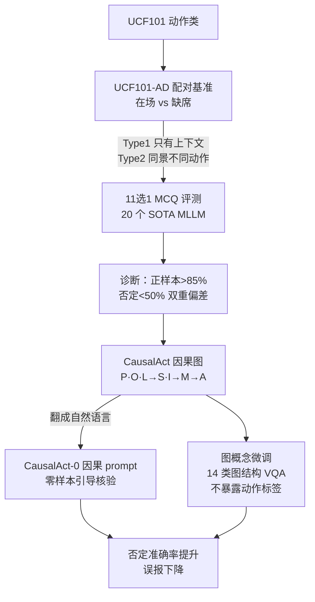

# Learning to Deny: Action Denial in Multimodal Large Language Models

**会议**: ECCV2026  
**arXiv**: [2606.31187](https://arxiv.org/abs/2606.31187)   
**论文**: [项目主页 raiyaan-abdullah.github.io/Learn-to-Deny-webpage](https://raiyaan-abdullah.github.io/Learn-to-Deny-webpage)  
**代码**: [https://github.com/raiyaan-abdullah/Learn-to-Deny](https://github.com/raiyaan-abdullah/Learn-to-Deny)  
**领域**: 多模态VLM / 视频理解 / 因果推理  
**关键词**: 动作否定, 视频MLLM, 因果图, 捷径学习, 谄媚偏差

## 一句话总结
本文提出 UCF101-AD 基准（1.1 万条「动作在场/动作缺席」配对视频）专门测 MLLM 能否在「场景、物体、人都在但定义性动作没发生」时正确否定该动作，发现 20 个 SOTA 模型正样本识别 >85% 却在否定样本上普遍跌破 50%；再提出 CausalAct 因果图框架（把场景拆成 P/O/L/S/I/M/A 七节点的 DAG，用自然语言 prompt + 图概念微调），显著降低误报、证明「否定」是可学习的推理技能。

## 研究背景与动机

**领域现状与被忽视的盲区**：以 Qwen-VL、InternVideo、VideoLLaMA、Ovis 等为代表的视频 MLLM 在标准动作识别 benchmark（UCF101、Kinetics）上零样本就能拿到很高准确率，但越来越多分析指出这份成绩很大程度来自**虚假相关**——模型不是在验证「定义动作的那段运动」，而是靠背景、物体这些上下文线索直接推断动作。之所以一直没人系统研究这个问题，是因为现有 benchmark（UCF101、Kinetics、HMDB51、ActivityNet）几乎全是**正样本**：标注的动作真的发生、定义性运动可见，很少包含「相关物体/演员/场景都在，但动作没发生」这种**硬反事实负样本**。既然模型从没在「上下文相似但运动缺席」的片段上被训练或评测过，就没人知道它到底能不能把真动作证据和误导性上下文分开——这个盲区一直隐形。

**核心矛盾**：鲁棒的视频理解要求模型既能通过定义性运动**确认**动作、也能在运动缺席时**可靠地否定**动作；但 MLLM 天生有两重偏差在对抗这一点——感知上依赖静态捷径（context→action 的短路），语言上有「谄媚/顺从」倾向（倾向肯定前提而非否定），两者叠加就是「一看上下文像就说动作在发生」。本文的目标正是造一个专测「动作否定」的基准来暴露这一缺陷，并给出一种让模型学会否定的方法。

作者的核心 idea 是**把动作从「上下文的相关物」重构成「结构化因果链的产物」**：一个动作是 参与者+环境+交互+运动动力学 的结构化组合的结果，其中运动最关键。只有当 MLLM 被引导去按「上下文→空间关系→交互→运动→动作」这条因果链逐级核验证据、而不是从 context 直接短路到 action，它才会在关键证据（定义性运动）缺失时否定动作。这就落成了 UCF101-AD（诊断）+ CausalAct（治疗）的双线设计。

## 方法详解

本文有两个可分割的贡献：一个诊断性 benchmark（UCF101-AD）和一个改进方法（CausalAct）。方法详解围绕这两块 + 它们如何串起来展开。

### 整体框架

**诊断侧（UCF101-AD）**：从 UCF101 的动作类出发，为每个动作构造**配对**的「动作在场（Action-Presence）」和「动作缺席（Action-Denial）」片段。负样本刻意保留正样本的场景/物体/演员上下文，但**移除定义性运动**，分两型：Type 1「只有上下文」（如「Not Playing Piano」= 人在钢琴旁但不弹）、Type 2「同上下文、不同运动」（如「Not Basketball Dunk」= 球场上有人运球传球但没扣篮）。评测用固定 11 选 1 的 MCQ VQA，选项含主干扰项（对应原 UCF101 目标动作）+ 其他类随机动作 + 一个「None」。全程人工核验（无 MLLM 参与，避免模型偏差），共 11,283 条。

**治疗侧（CausalAct）**：把「动作是否发生」建模成一个有向无环图（DAG）上的因果核验——上下文节点（人 P、物 O、地点 L）→ 关系节点（空间关系 S、交互 I）→ 动态节点（运动 M）→ 动作节点（A）。先把这张图翻译成自然语言 prompt（CausalAct-0，零样本用），引导强语言骨干模型按因果链核验；再对小模型做**图概念微调**——用只涉及图结构/不暴露动作标签的辅助 VQA 任务，教模型内化这套因果依赖。

### 关键设计

**1. 配对反事实负样本：把「定义性运动」逼成唯一判别信号**

痛点是现有 benchmark 的负样本要么是定位干扰帧、要么是失败尝试、要么是场景模糊，都没能隔离「运动」这个变量。UCF101-AD 的做法是给每个正类造一个**上下文尽量相同、只差定义性运动**的负类。关键约束有两条：其一，只挑「需要建模时序运动动力学」的动作（排除 sitting/standing 这种静态原子状态），且要求**完整执行**才算动作在场（略微挥一下高尔夫杆不算 swing）；其二，Type 1/Type 2 两分法把「上下文线索」和「运动证据」显式解耦——Type 1 保留物体环境但无交互，Type 2 保留同场景但换成其他合理动作。这样模型想答对就**必须验证运动**，没法靠 context 蒙。为进一步减歧义，每个 UCF101 短标签被改写成描述句当干扰项（「HulaHoop」→「A person is spinning a hula hoop」）。

**2. 双重失败诊断：证明捷径学习与谄媚是同一底层偏差**

这是 benchmark 的分析亮点。作者不满足于「模型分低」，而是追问：**捷径学习（靠上下文短路）和谄媚（倾向答 yes）是两个独立故障，还是同一偏差的两副面孔？** 做法是额外构造一个 Binary Yes/No 设置直接测谄媚（如「Is a person applying makeup to their eyes?」），再算每个视频上「MCQ 错误率」（没选对 None 的频率）与「谄媚率」（错答 yes 的频率）的 Pearson 相关。结果：**所有模型都呈正相关**，平均 $r=0.388$、每个模型 $p<0.01$；且 Type 2（$r=0.409$）比 Type 1（$r=0.367$）更强。更关键的是对每个模型都有 $P(\text{yes}\mid\text{MCQ 错})>P(\text{yes}\mid\text{MCQ 对})$ 且 $P(\text{yes}\mid\text{主干扰项})>P(\text{yes}\mid\text{随机干扰项})$（差 0.2–0.6）——说明谄媚恰好集中在「模型已经锁定误导性动作假设」的样本上。两种错误紧密耦合，指向同一根因：从上下文推断动作、而非验证定义性运动。

**3. CausalAct 因果图：用 DAG 阻断 context→action 的短路**

痛点是模型在「相关范式」下工作，隐式地把「上下文在场」等同于「动作存在」。CausalAct 受 ActionGenome 启发，把动作场景拆成七类变量组成的 DAG，依赖关系是：

$$S\leftarrow f_S(P,O,L),\quad I\leftarrow f_I(P,O),\quad M\leftarrow f_M(I),\quad A\leftarrow f_A(I,M)$$

直觉是：上下文（人/物/环境）决定空间配置 → 空间配置使能交互 → 交互产生运动模式 → **只有观测到恰当运动才该推断动作**。这个结构**显式禁止** $A\leftarrow L$ 或 $A\leftarrow O$ 这种从上下文直连动作的短路，强制模型先核验交互和运动的在场。图还能适配不同动作类型：人本位动作可从运动直达动作，物本位动作则要交互+运动同时满足。落地时把 DAG 翻成一段结构化自然语言 prompt（定义每个节点、讲清每条有向边 P→I、I→M、M→A 等，并给「弹吉他 vs 不弹吉他」正负例），前置到用户 query，让模型「在脑内推断各分量、不输出推理、只回选项号」。

**4. 图概念微调：教模型「读懂图」而非「记住答案」**

痛点是弱视觉-语言对齐的模型（如 VideoLLaMA3）跟不上结构化 prompt，零样本下 CausalAct 甚至可能掉点。解法是一个**辅助微调阶段**：对每个训练视频构造 $(P,O,L,S,I,M,A)$ 的图，自动生成**只探测图本身**的 VQA——涵盖 4 大类共 14 种题型：图结构查询（节点/边计数、成员/边有效性检查）、节点关系（父子列举、基数、邻接验证）、路径发现（枚举 P→A 的所有通路、验证某条路径是否合法）、属性一致性（把某节点描述换成冲突类的属性让模型挑出不一致、因果前件识别、反向因果验证）。**关键是这些题绝不暴露真实动作标签**，避免标签泄漏——模型学到的是「断言动作前先核验因果链」这个**可迁移技能**，而非背 UCF101-AD 的负标签。这解释了为什么只在抽象图题上训练，却能在 Action-Denial 测试集大幅涨点。

## 实验关键数据

### 主实验：20 个 MLLM 在 UCF101-AD 上的零样本表现

| 模型 | Type1↑ | Type2↑ | Overall-AD↑ | Presence↑ | HM↑ |
|------|--------|--------|-------------|-----------|-----|
| VideoLLaMA3-7B | 49.4 | 53.4 | **51.5** | 96.0 | **67.0** |
| Qwen2.5-VL-72B | 42.6 | 47.8 | 45.7 | 97.6 | 62.3 |
| Ovis2.5-9B(thinking) | 36.7 | 43.8 | 40.4 | 96.7 | 57.0 |
| Ovis2.5-9B | 34.5 | 33.8 | 34.1 | 97.5 | 50.5 |
| GPT-4o-mini | 20.7 | 22.3 | 21.5 | 90.1 | 34.7 |
| Valley-Eagle-7B | 8.8 | 13.1 | 11.1 | 96.4 | 19.9 |

- **人类基线**：36 名参与者在 UCF101-AD 上达 86.6% Overall-AD，证明否定样本对人是可靠可判的，模型的失败不是数据噪声。
- 最强的 VideoLLaMA3-7B 也只有 51.5% Overall-AD，多数模型落在 20–35%；而所有模型 Presence（正样本）常 >90%，坐实「会识别、不会否定」。

### CausalAct 的改进效果（图概念微调后，小模型）

| 模型 | Base Overall-AD | CausalAct | Δ |
|------|-----------------|-----------|---|
| Ovis2.5-2B | 27.0 | **52.3** | +25.3 |
| Qwen2.5-VL-3B | 19.8 | **40.7** | +20.9 |
| VideoLLaMA3-2B | 25.4 | **43.3** | +17.9 |

在外部数据集上（Ovis2.5-9B 零样本 CausalAct-0 vs Base）否定准确率全面提升：HMDB51 +23.1、SSv2 +21.4、Diving48 +22.7、K400 +11.5，说明因果核验是跨分布可迁移的。

### 消融实验（ScanNet 无关，均在 UCF101-AD 上）

| 消融维度 | 关键发现 |
|----------|----------|
| 图结构是否重要 | 零样本对 Pruned/Random 图不敏感（没训不会读图）；**微调后**打乱因果依赖大多掉点——证明模型确实学会用完整结构 |
| 是否只是语言微调 | 只更新 LLM+projector、冻结视觉编码器，平均掉约 **15%**——必须更新视觉栈才能把因果图 grounding 到视觉证据，不是单纯 prompt-following |
| 渐进减歧义 | Standard→Explicit Denial（把 None 换成明确否定句）→去掉主干扰项，准确率逐级逼近正样本水平——模型能否定，但需要歧义足够低 |
| 选项数 | 11 选 1 → 4 选 1（保留主干扰项+None），多数模型仍 <50%——难点不在选项多，而在否定本身 |

### 关键发现
- **「会思考」的模型反而更差**：除 Ovis2.5 外，reasoning 模型普遍不如其标准版——它们的 chain-of-thought 常过度依赖视觉上下文、自信地选最合理的干扰动作，甚至幻觉出不存在的动作描述。当前 thinking 模型对**否定性约束校准不良**：倾向解释「可能在发生什么」而非论证「什么都没发生」。
- **规模有帮助但看架构**：Qwen2.5-VL 从 3B→72B 涨 +25.9、VideoLLaMA3 从 2B→7B 涨 +26.1，但 Ovis2.5 从 2B→9B 只涨 +7.1——规模能转化成否定能力，前提是架构能利用这份容量。
- **Type 1 通常比 Type 2 更难**：说明模型过度 index 到「物体/环境在场」；CausalAct 的增益在 Type 2 上更大，因为图知识特别擅长把目标动作和近似非目标运动区分开。
- **CausalAct-0 是低成本推理替代**：Ovis2.5-9B-Thinking 要 639 分钟才到 40.4% Overall-AD，而标准 Ovis2.5-9B + CausalAct-0 只要 109 分钟达到相当水平——结构化 prompt 比昂贵的 CoT 更划算。

## 亮点与洞察
- **「配对反事实 + 只差运动」的 benchmark 构造范式很干净**：通过严格控制「上下文相同、只移除定义性运动」，把一个模糊的「模型是否真懂动作」问题变成可量化的「动作否定准确率」。这个思路可迁移到任何「模型可能靠捷径蒙对」的判别任务——造一批「表面线索齐全但关键证据缺失」的配对负样本即可暴露捷径。
- **把捷径学习和谄媚统一成一个偏差**（$r=0.388$、$p<0.01$）是很有说服力的诊断：它把两个原本分开研究的故障模式（感知短路 / 语言顺从）用一个相关系数联系起来，说明去偏应同时治两者。
- **图概念微调避免标签泄漏**：只教图结构、不给动作标签，却学到可迁移的「先核验因果链再断言」技能——这是「教方法而非教答案」的漂亮范例，可推广到任何想让模型学「推理协议」而非「记结果」的场景。
- **发现 thinking 模型对否定校准不良**：一个反直觉且有价值的观察——更多推理步不等于更鲁棒，当任务是「论证否定」时，现有 CoT 反而放大了肯定偏差。

## 局限与展望
- **闭集、短视频、MCQ 评测**：当前是 UCF101 派生的封闭动作集 + 平均 ~7 秒短片 + 11 选 1，离真实世界的开放集、长视频、自由问答还有距离；作者也承认 Explicit Denial 那种「明确告诉模型动作没发生」的设置现实中不可得。
- **因果图的可扩展性存疑**：复杂真实视频物体众多，把所有可见实体塞进图/prompt 不现实；作者提出未来可做 actor-centric 过滤（只保留与演员空间接近/交互的物体）。
- **CausalAct 增益依赖语言骨干强度**：零样本下弱对齐模型（VideoLLaMA3）用 prompt 甚至掉点，必须微调；且微调要更新视觉编码器（否则掉 15%），成本不低。
- **未验证 embodied/交互环境**：否定能力能否泛化到具身或可交互环境仍是开放问题。改进方向：把因果核验做成可微模块而非纯 prompt、扩到开放词表、结合 actor-centric 图剪枝应对拥挤长视频。

## 相关工作与启发
- **vs 现有动作识别 benchmark（UCF101/Kinetics/HMDB51）**：它们负样本多为隐式（背景/无标注帧）或用于探测相邻故障（同场景相似动作、失败尝试）；UCF101-AD 首次显式围绕「动作否定」构造——移除定义性运动、保留误导上下文、正负配对，填补了「运动缺席时能否否定」的空白。
- **vs 因果推理/场景图工作（ActionGenome、VCDN、CLADDER）**：这些多用图做**预测或解释**；本文反过来问「显式结构能否帮模型在强上下文下**决定何时否定**」，把因果图从预测工具变成核验工具。
- **vs 去偏方法（背景/物体去相关，如 ALBAR）**：已有去偏主要在**正样本 regime** 操作、奖励正确标签，而非在运动缺失时奖励**显式否定**；CausalAct 直接针对否定场景，通过结构化核验前置条件来对抗上下文短路。
- **vs 谄媚/顺从偏差研究**：以往孤立研究偏差或推理；本文把「视频动作否定」当作两者交汇的检验场，并给出非谄媚化的方法。

## 评分
- 新颖性: ⭐⭐⭐⭐⭐ 「动作否定」这一被忽视的能力 + 配对反事实基准 + 把捷径学习与谄媚统一 + 因果图当核验工具，多处原创。
- 实验充分度: ⭐⭐⭐⭐⭐ 20 个 SOTA 模型、人类基线、Type 分型、双重失败相关性、6 个外部数据集泛化、图结构/语言微调/选项数/规模多维消融、计算开销对比，非常扎实。
- 写作质量: ⭐⭐⭐⭐ 动机层层递进、诊断与治疗双线清晰、附录（完整 prompt + 14 题型）详尽；正文图较多需对照读。
- 价值: ⭐⭐⭐⭐⭐ 揭示现代视频 MLLM 的关键盲区（不会因果地判断运动是否真发生），对监控/自动驾驶/体育分析等误报敏感场景有直接意义，且提供可复用的诊断工具和低成本改进法。

<!-- RELATED:START -->

## 相关论文

- [\[ECCV 2026\] ProactiveBench: Benchmarking Proactiveness in Multimodal Large Language Models](proactivebench_benchmarking_proactiveness_in_multimodal_large_language_models.md)
- [\[CVPR 2026\] SIMPACT: Simulation-Enabled Action Planning using Vision-Language Models](../../CVPR2026/multimodal_vlm/simpact_simulation-enabled_action_planning_using_vision-language_models.md)
- [\[CVPR 2026\] Learning to See through Illumination Extremes with Event Streaming in Multimodal Large Language Models](../../CVPR2026/multimodal_vlm/learning_to_see_through_illumination_extremes_with_event_streaming_in_multimodal.md)
- [\[CVPR 2026\] Octopus: History-Free Gradient Orthogonalization for Continual Learning in Multimodal Large Language Models](../../CVPR2026/multimodal_vlm/octopus_history-free_gradient_orthogonalization_for_continual_learning_in_multim.md)
- [\[ECCV 2024\] UniCode: Learning a Unified Codebook for Multimodal Large Language Models](../../ECCV2024/multimodal_vlm/unicode_learning_a_unified_codebook_for_multimodal_large_language_models.md)

<!-- RELATED:END -->
