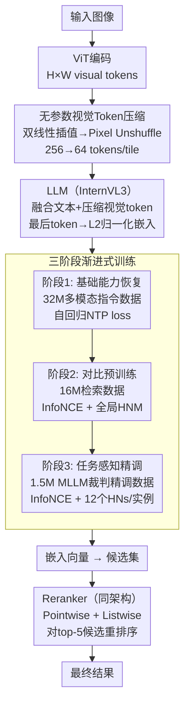

# Magic-MM-Embedding: Towards Visual-Token-Efficient Universal Multimodal Embedding with MLLMs

**会议**: ECCV 2026  
**arXiv**: [2602.05275](https://arxiv.org/abs/2602.05275)  
**代码**: [https://github.com/xxx](https://github.com/xxx) (无)  
**领域**: 多模态VLM  
**关键词**: 多模态嵌入、视觉Token压缩、渐进式训练、MLLM-as-a-Judge、通用检索  

## 一句话总结
Magic-MM-Embedding 在 InternVL3 基础上引入无参数视觉 token 压缩（降至 25%）并搭配三阶段渐进式训练（生成恢复→对比预训练→MLLM裁判精调），不仅克服了压缩带来的性能损失，还在 MMEB / VisDoc / 跨模态检索上全面超越先前 SOTA 同时大幅降低推理延迟。

## 研究背景与动机

**领域现状**：多模态嵌入模型正从 CLIP 双塔架构向 MLLM 范式转移。MLLM 将视觉特征作为离散 token 与文本 token 在统一 transformer 中处理，实现 token 级深度跨模态融合，在通用多模态检索上展现出远超 CLIP 的能力。近期工作在数据规模、难负例挖掘、多阶段渐进训练等方面不断推进性能边界。

**现有痛点**：这些方法都忽略了一个关键瓶颈——视觉 token 序列过长带来的巨大计算开销。标准 MLLM（如 LLaVA-OneVision）为一张图可生成多达 7,290 个视觉 token 输入到语言模型。但对于检索任务而言，目标是从冗余的视觉 token 中蒸馏信息到一个 [EOS] 嵌入向量上，大量 token 带来的计算量呈平方增长，而其对最终嵌入语义质量的边际贡献却非常有限。这使得 MLLM 嵌入模型在大规模、低延迟的检索系统中难以部署。

**核心矛盾**：现有方法认为"视觉 token 越多性能越好"，因而不断堆叠 token 数量；但事实上检索任务中存在大量视觉冗余，长序列的巨量计算开销与有限的嵌入质量提升之间存在严重不平衡。简单压缩 token 又会损伤多模态理解能力，导致嵌入质量下降。

**切入角度**：本文的关键洞察是——视觉 token 压缩带来的性能损失可以通过精心设计的训练策略弥补甚至逆转。压缩不是"trade-off"，而是可以成为"战略性优势"。

**核心 idea**：将无参数的双线性插值 + pixel unshuffle 视觉 token 压缩（降至 25% token）与三阶段渐进式训练（生成恢复→对比学习→MLLM裁判精调）协同设计，使压缩后的模型不仅不掉点，反而在更高效的推理下超越全 token 基线。

## 方法详解

> 本文方法整体是一个"压缩架构 + 三阶段训练 + 协同重排序"的综合框架，各组件环环相扣。

### 整体框架

本文的系统分为两大核心部分：**视觉 token 压缩架构（InternVL3-VTC）** 和 **三阶段渐进式训练管道**，外加一个协同训练的 **重排序器（Reranker）**。

视觉 token 压缩是无参数的：对 ViT 输出的空间特征图依次做双线性插值下采样和 pixel unshuffle 操作，将每张图 tile 的 token 数从 256 降到 64（保留 25%），大幅降低注意力计算量。但压缩会破坏预训练 LLM 预期的视觉特征空间分布，因此需要三阶段训练来恢复并提升嵌入能力：

**阶段 1（基础能力恢复）**：在 3,200 万条多模态指令数据上做生成式继续训练，重新对齐压缩后的视觉特征与 LLM 语义空间，恢复多模态理解和生成能力。  
**阶段 2（对比预训练）**：在 1,600 万条多模态检索数据上做对比学习，先以 batch 内负例热身，再引入全局难负例挖掘（从全数据集中排名 50–100 的候选中采样 2 个难负例）。  
**阶段 3（任务感知精调）**：用 Qwen3-VL 作为裁判，对 150 万条目标训练集执行"检索-判断"——对每个查询用阶段 2 模型检索 top-20 候选，让 MLLM 判断相关性，从中筛选高质量难负例（每实例 12 个），驱动最终对比学习。

重排序器从阶段 1 的 checkpoint 初始化，在阶段 3 的裁判精调数据上联合训练 pointwise（Yes/No 二分类）和 listwise（从 M 个候选中定位正例位置）目标，推理时对 embedder 的 top-5 结果进行重排序。

### 关键设计

**1. 无参数视觉 Token 压缩：用插值代替学习来避免优化困难**

在 MLLM 嵌入模型中，视觉 token 数量直接决定自注意力的 O(N²) 计算开销。常见的可学习压缩模块（如 BLIP-2 的 Q-Former、Honeybee）虽然灵活，但在检索场景下引入额外参数会导致训练不稳定甚至收敛崩溃。本文采用纯无参数方案：对 ViT 输出的空间特征图先用双线性插值将 H×W 降为 H′×W′，再用 pixel unshuffle（下采样因子 α=2）进一步压缩为 H′/α × W′/α 个 token（每通道数扩展到 α²C）。整个过程不引入任何可学习参数，且保留了局部空间结构。消融实验表明，双线性插值相比可学习的 Conv2d（平均 17.9 vs 61.0）和自适应平均池化（60.6 vs 61.0）都更优：Conv2d 因冷启动导致模块与 MLLM 相互适配困难、效果崩溃；均值池化丢失局部细节；而双线性插值无需学习、保留局部性，在文本→文档检索任务上优势明显。

对于多 tile 场景（如文档图像），每 tile 独立执行 256→64 的压缩。自然图像 tile 数限制为 1（大部分场景）或 4（文档），最终每张图像最多 256 个视觉 token（相比基线的 1280+），注意计算减少 93.8%。

**2. 三阶段渐进式训练：从生成恢复到对比精调的粗到细策略**

压缩后的视觉特征与预训练 LLM 期望的分布存在 gap，直接做对比学习效果很差（仅 MMEB 1.9）。本文设计了三阶段渐进式训练：

**阶段 1（生成恢复）**：用 3,200 万条多模态指令数据（含开源 2,620 万 + 自建 580 万，覆盖指令跟随、描述、定位、分类）做自回归 next token prediction 训练。这一步的关键是恢复模型对压缩后视觉特征的理解与生成能力——消融显示跳过阶段 1 直接做对比学习会使 MMEB 从 65.4 降到 64.7，VisDoc 从 70.7 降到 69.8。  

**阶段 2（对比预训练+难负例挖掘）**：在 1,600 万条多模态检索数据上做 InfoNCE 对比学习，分两步走——先以简单 batch 内负例热身，再引入全局难负例挖掘（Global HNM）。具体地，对每个查询从全数据集中检索排序过的候选列表，剔除 ground-truth 正例后从排名 50–100 的位置随机采样 2 个难负例。选择 50–100 而非 top-10 是为了避免误将真正的正例当成负例（false negative）。  

**阶段 3（MLLM-as-a-Judge 任务感知精调）**：用 Qwen3-VL-8B 作为外部裁判，对目标训练集执行"检索-判断"过程。先使用阶段 2 模型为每个查询检索 top-20 候选，然后让 MLLM 裁判逐对评估相关性（比较 yes/no token 的 logit）。若是正例则扩充正例集（用于 reranker 训练）；若是负例且排位靠前则作为高质量难负例。每实例注入 12 个裁判验证的难负例参与 InfoNCE 计算。这种方法有效避免了规则式难负例挖掘引入 false negative 的问题——消融显示 MLLM 裁判方案在同等难负例数量下始终优于规则式方案（如 n=12 时 MMEB 68.0 vs 67.0）。

**3. 协同重排序器：联合 pointwise 和 listwise 训练**

在推理时采用 embedder + reranker 的两阶段检索策略。重排序器从阶段 1 checkpoint 初始化，在阶段 3 的裁判精调数据上训练。关键创新在于 joint 训练两个目标：pointwise（对候选对输出 Yes/No）和 listwise（从 M ∈ {2,3,4,5} 个候选中识别正例位置 k）。两个 loss 权重均为 1。重排序器受益于阶段 3 中 MLLM 裁判扩增的正负例集（augmented positive set 包含原始 ground-truth 和裁判识别的新正例），而非仅依赖原始标签。推理时对 embedder 输出的 top-5 候选做 pointwise 重排序，进一步提升精度。

### 损失函数 / 训练策略

- **阶段 1**：自回归 Next Token Prediction (NTP) loss，全参数训练，lr=1×10⁻⁵，全局 batch size 48，30,000 步
- **阶段 2&3**：InfoNCE contrastive loss，温度 τ=0.03，LoRA rank=16（全连接层），lr=2×10⁻⁴
- **Reranker**：CE loss for pointwise + listwise，lr=4×10⁻⁵，2 轮
- **硬件**：48×NVIDIA A800 (80GB) GPU（阶段 2&3），24×A800（reranker）
- **tile 策略**：文档图 MAX_NUM=4，自然图 MAX_NUM=1

## 实验关键数据

### 主实验

**Table 1: MMEB 基准 — 通用多模态检索（Precision@1）**

| 模型 | 骨架 | 分类 | VQA | 检索 | Grounding | IND | OOD | 平均 |
|------|------|------|-----|------|-----------|-----|-----|------|
| VLM2Vec-V1 | Qwen2-VL (2.2B) | 59.0 | 49.4 | 65.4 | 73.4 | 66.0 | 52.6 | 59.3 |
| UniME-V2 (E) | LLaVA-OV (8.0B) | 65.3 | 67.6 | 72.9 | 90.2 | 74.8 | 66.7 | 71.2 |
| UniME-V2 (E+R) | LLaVA-OV (8.0B) | — | — | — | — | 75.2 | — | — |
| **Magic-MM-Embedding (E)** | InternVL3-VTC (1.9B) | 60.9 | 63.3 | 72.2 | 84.6 | 74.7 | 59.5 | **68.0** |
| **Magic-MM-Embedding (E+R)** | InternVL3-VTC (1.9B) | 61.3 | 67.2 | 73.5 | 89.8 | 75.2 | 63.9 | **70.2** |
| **Magic-MM-Embedding (E)** | InternVL3-VTC (8.1B) | 65.0 | 68.2 | 74.7 | 89.6 | 78.4 | 63.7 | **71.9** |
| **Magic-MM-Embedding (E+R)** | InternVL3-VTC (8.1B) | 64.4 | 71.0 | 75.7 | 90.1 | 78.4 | 65.9 | **72.9** |

在 2B 量级，Magic-MM-Embedding embedder 在 IND 上 74.7（超 UniME-V2 E 的 74.8 的 8B 版），OOD 上 59.5 虽不及 8B 模型但整体竞争力强。在 8B 量级，embedder 平均 71.9 超越 UniME-V2 (E) 的 71.2，E+R 实现 72.9 的全面 SOTA。值得注意：2B embedder（68.0）已接近 UniME-V2 8B E+R（69.0），高效性显著。

**Table 2: VisDoc 基准 — 视觉文档检索（NDCG@5）**

| 模型 | 骨架 | VDRv1 | VDRv2 | VR | OOD | 总体 |
|------|------|-------|-------|----|-----|------|
| GME | Qwen2-VL (2.2B) | 86.1 | 54.0 | 82.5 | 43.1 | 72.7 |
| GME | Qwen2-VL (8.3B) | 89.4 | 55.6 | 85.0 | 44.4 | 75.2 |
| **Magic-MM-Embedding (E)** | InternVL3-VTC (1.9B) | 83.4 | 53.3 | 85.6 | 42.2 | 72.1 |
| **Magic-MM-Embedding (E+R)** | InternVL3-VTC (1.9B) | 84.4 | 56.1 | 87.4 | 41.8 | **73.3** |
| **Magic-MM-Embedding (E+R)** | InternVL3-VTC (8.1B) | 86.8 | 59.6 | 89.1 | 42.9 | **75.5** |

在文档检索这样需要高分辨率精度的任务上，仅用 25% token 仍取得 SOTA。8B E+R 总体 75.5 超越 GME 8B 的 75.2，且 GME 使用了更大规模的专有数据。

**Table 4: 推理效率对比（L20 GPU, batch=1, BF16）**

| 模型 | 骨架 | MMEB查询 延迟(ms) | MMEB候选 延迟(ms) | VisDoc候选 延迟(ms) |
|------|------|:----:|:----:|:----:|
| LLaVE | Aquila-VL (2.0B) | 162.8 | 143.0 | 233.6 |
| UniME-V2 | LLaVA-OV (8.0B) | 906.9 | 788.1 | 1341.1 |
| InternVL3 (Vanilla) | InternVL3 (1.9B) | 37.1 | 29.2 | 103.6 |
| **Magic-MM-Embedding** | InternVL3-VTC (1.9B) | **29.9** | **26.1** | **57.3** |
| **Magic-MM-Embedding** | InternVL3-VTC (8.1B) | **50.9** | **40.6** | **94.8** |

仅 99.6 平均视觉 token（vs LLaVE 3,699、UniME-V2 7,371），延迟大幅降低。2B 模型 MMEB 查询延迟从 162.8ms（LLaVE）降至 29.9ms，VisDoc 候选从 233.6ms 降至 57.3ms。

### 消融实验

**Table 5: 渐进式训练管道 & Reranker 消融**

| 阶段1 | 阶段2 | 阶段3 | Reranker | MMEB | VisDoc |
|:----:|:----:|:----:|:-------:|:----:|:------:|
| ✓ | ✗ | ✗ | ✗ | 1.9 | 0.5 |
| ✗ | ✓ | ✗ | ✗ | 64.7 | 69.8 |
| ✓ | ✓ | ✗ | ✗ | 65.4 | 70.7 |
| ✓ | ✗ | ✓ | ✗ | 67.1 | 70.9 |
| ✓ | ✓ | ✓ | ✗ | 68.0 | 72.1 |
| ✓ | ✓ | ✓ | ✓ | 70.2 | 73.3 |

阶段 1 单独训练完全不可用（MMEB 1.9），但跳过阶段 1 直接做阶段 2 也掉点（65.4→64.7），说明生成恢复阶段是压缩模型成功的关键热身。三个阶段全上比缺少任一阶段都好。引入 reranker 再提升 2.2（MMEB）和 1.2（VisDoc）。

**Figure 3: Visual Token 数量消融**

| #Tokens/tile | MMEB | VisDoc | 平均 | 注意计算减少 |
|:-----------:|:----:|:------:|:---:|:----------:|
| 36 | 62.6 | 66.8 | 64.7 | 98.0% |
| 64 | 63.2 | 67.6 | 65.4 | 93.8% |
| 100 | 63.3 | 68.9 | 66.1 | 84.7% |
| 144 | 63.1 | 69.1 | 66.1 | 68.4% |
| 256 (Vanilla) | 63.7 | 68.5 | 66.1 | 0% |

64 token 是 sweet spot：比 256 token 仅低 0.7 平均分，但注意力计算减少 93.8%。更多 token（100/144）计算节省有限且性能不提升，更少 token（36）则开始掉点。

### 关键发现

- **阶段 1（生成恢复）是不可或缺的热身**：直接跳过阶段 1，模型在 MMEB 上从 65.4 降到 64.7，VisDoc 从 70.7 降到 69.8——压缩破坏了预训练视觉特征的分布，生成式训练能够重新对齐压缩后的视觉特征与 LLM 语义空间。
- **MLLM 裁判难负例显著优于规则式方法**：同等难负例数量（n=12）下，MLLM 裁判方案（MMEB 68.0, VisDoc 72.1）全面优于规则式（MMEB 67.0, VisDoc 70.1），且裁判模型选择（Qwen3-VL vs InternVL3）对结果影响不大（一致性 80.4%），说明方法对裁判模型鲁棒。
- **压缩不是 trade-off 而是战略优势**：64 token 模型不仅推理更快，在 8B 量级还以 71.9（embedder）/ 72.9（E+R）超越全 token 的 UniME-V2（71.2 / —），验证了"压缩+针对性训练"可以同时提升效率与效果。
- **64 token 是效率与精度的最优平衡点**：36 token 虽计算更少但性能明显下降（65.4→64.7）；100/144 token 性能与 256 持平但计算节省不再明显（84.7%→68.4%）。
- **训练效率也大幅提升**：相同对比训练配置下，2B 模型训练时间从 52h 43m 降到 24h 38m（降幅 53%），性能几乎不损失。

## 亮点与洞察

- **无参数压缩 + 渐进训练协同设计的范式**：大多数工作要么只做压缩（导致掉点）、要么只优化训练（无视效率）。本文证明了二者的协同——简洁的无参数压缩减少了优化的不确定性，而专门设计的训练策略弥补了压缩的信息损失，最终 1+1>2。
- **"压缩后的模型需要生成式热身而非直接对比学习"**：这是一个反直觉但关键的发现——很多人认为压缩后直接做对比学习即可，但阶段 1 的生成恢复（而非检索目标）才是让压缩架构起效的第一步。跳过它会导致约 1 个点的性能损失。原因在于压缩改变了视觉特征的密度和分布，生成式目标比对比式目标更适合"重新对齐"视觉和语言空间。
- **MLLM-as-a-Judge 做难负例挖掘的高性价比方案**：用外部 MLLM 做裁判的方式优雅地解决了传统规则式难负例挖掘的三个问题：false negative（排位靠前的真实正例被误当成负例）、难负例质量不可控、不同数据集的判断标准不统一。而且对裁判模型的选择很鲁棒（InternVL3 和 Qwen3-VL 一致性 80.4%），大幅降低了部署门槛。
- **64 token 的 sweet spot 来自"检索任务天然冗余"**：检索目标是将视觉+文本信息压缩到一个 [EOS] 嵌入向量中，而非逐像素高保真重建。这意味着大量的视觉 token 对嵌入质量边际贡献很小。本文通过系统消融实验找到了这个 sweet spot，并为后续研究提供了可复现的分析框架。
- **Pointwise + Listwise 联合训练的 Reranker**：不同于传统的只用 pairwise loss，本文同时训练 pointwise（Yes/No 判定）和 listwise（从 M 候选中定位正例位置），两个目标互补，且受益于阶段 3 的裁判扩增数据（augmented positive set），比只用原始标签更有效。

## 局限与展望

- **文档检索 OOD 上仍有差距**：在 VisDoc 的 OOD 基准上，8B E+R 仅 42.9（低于 GME 8B 的 44.4），说明压缩后的模型在跨领域泛化上仍有提升空间。可能的改进方向是为文档类任务保留更多 token 或使用混合策略。
- **压缩模块是固定的**：当前使用固定的 256→64 token 压缩比（75%），对于不同复杂度图像缺乏自适应能力。可探索基于图像内容的自适应压缩比（如简单场景 36 token、复杂文档 144 token）。
- **训练成本仍然不低**：虽然推理效率大幅提升，但三阶段训练（32M+16M+1.5M 样本）仍然需要 48×A800 GPU，对资源有限的团队门槛较高。阶段 1 的全参数训练尤其昂贵——或许可以用更小规模的通用数据做对齐。
- **仅验证了 InternVL3 骨架**：虽然 InternVL3 是代表性 MLLM，但实验仅在单一骨架上进行。该方案能否泛化到 Qwen2.5-VL、LLaVA-OneVision 等其他 MLLM 架构尚未验证。
- **MLLM 裁判阶段引入了额外推理开销**：阶段 3 的"检索-判断"过程中需要调用 Qwen3-VL-8B 评估大量候选对（2.8M 对），虽然是一次性离线成本，但对于希望用更少数据的场景可能过于昂贵。论文未讨论裁判推理成本与收益之间的量化关系。

## 相关工作与启发

- **vs VLM2Vec / UniME / QQMM / LLaVE 等 MLLM 嵌入方法**：这些方法专注于数据规模、难负例策略、渐进训练等方向来提升 MLLM 嵌入质量，但都直接使用标准 MLLM 架构，没有关注视觉 token 冗余带来的效率瓶颈。本文首次系统性地将视觉 token 压缩引入 MLLM 嵌入领域，并证明压缩后的模型在效率提升的同时可以超越全 token 基线。  
- **vs InternVL3（原始骨架）**：本文的 InternVL3-VTC 在 InternVL3 基础上仅添加了无参数压缩模块，与原始架构的唯一差异是对 ViT 输出的特征图做了插值和 pixel unshuffle。对比实验显示压缩后在多模态理解能力上反而略优（86.1 vs 84.9 on MME），说明压缩可能起到了正则化作用或减少了不必要的特征噪声。  
- **vs 通用视觉 token 压缩方法（如 LLaVA-PruMerge、FastV、TokenPacker）**：这些方法主要针对一般图文生成任务设计，目标是保持生成质量的同时减少 token。本文首次系统研究了压缩后的 token 在嵌入/检索任务上的表现，并发现检索任务对压缩的容忍度比生成任务更高——因为嵌入目标是将信息凝聚到一个 [EOS] token，而非逐像素重建。  
- **vs MLLM-as-a-Judge / 自训练方法**：使用外部 MLLM 做裁判筛选难负例的方式可以看作一种"自蒸馏+数据增强"的组合。类似思路在 RLAIF-V、Self-Rewarding 等方向也有出现，但本文将其应用于嵌入学习的难负例挖掘中，并展示了其对裁判模型选择的鲁棒性。

## 评分

- 新颖性: ⭐⭐⭐⭐⭐ 将视觉 token 压缩引入 MLLM 通用多模态嵌入领域并系统验证了"压缩+针对性训练"可以同时提升效率与精度，切入点在已有大量 MLLM 嵌入工作中属于首创。  
- 实验充分度: ⭐⭐⭐⭐⭐ 覆盖 MMEB（36 子集）、VisDoc（24 子集）、跨模态（5 个基准 3 种粒度）三大类评测，做了 token 数量消融、三阶段训练消融、难负例数量和类型消融、裁判模型消融、LoRA rank 消融、不同压缩方法对比、训练效率对比、vLLM 部署效率对比——几乎穷举了所有相关维度，数据丰富度极高。  
- 写作质量: ⭐⭐⭐⭐⭐ 问题定位清晰（从效率瓶颈到核心矛盾的推导有说服力），方法部分叙事流畅（压缩→训练→重排序逐层展开），消融实验设计与结果解读紧密对应，每张表后面都有分析段落而非单纯罗列数字。  
- 价值: ⭐⭐⭐⭐⭐ 直接解决了 MLLM 嵌入模型实用化的核心障碍——推理效率。结果在多项基准上达到 SOTA，且效率提升幅度（2B 模型延迟从 162.8ms 到 29.9ms）在实践中意义重大。方法简洁（无参数压缩）、训练策略可复现（全部使用公开数据），可作为未来 MLLM 嵌入研究的标准 baseline。

<!-- RELATED:START -->

## 相关论文

- [\[ICLR 2026\] U-MARVEL: Unveiling Key Factors for Universal Multimodal Retrieval via Embedding Learning](../../ICLR2026/multimodal_vlm/u-marvel_unveiling_key_factors_for_universal_multimodal_retrieval_via_embedding_.md)
- [\[CVPR 2026\] MuCo: Multi-turn Contrastive Learning for Multimodal Embedding Model](../../CVPR2026/multimodal_vlm/muco_multi-turn_contrastive_learning_for_multimodal_embedding_model.md)
- [\[ICML 2026\] CHARM: 用 Multimodal JEPA + 通道描述做时间序列 foundation embedding](../../ICML2026/multimodal_vlm/giving_sensors_a_voice_multimodal_jepa_for_semantic_time-series_embeddings.md)
- [\[CVPR 2026\] ProM3E: Probabilistic Masked MultiModal Embedding Model for Ecology](../../CVPR2026/multimodal_vlm/prom3e_probabilistic_masked_multimodal_embedding_model_for_ecology.md)
- [\[CVPR 2026\] Ego: Embedding-Guided Personalization of Vision-Language Models](../../CVPR2026/multimodal_vlm/ego_embedding-guided_personalization_of_vision-language_models.md)

<!-- RELATED:END -->
