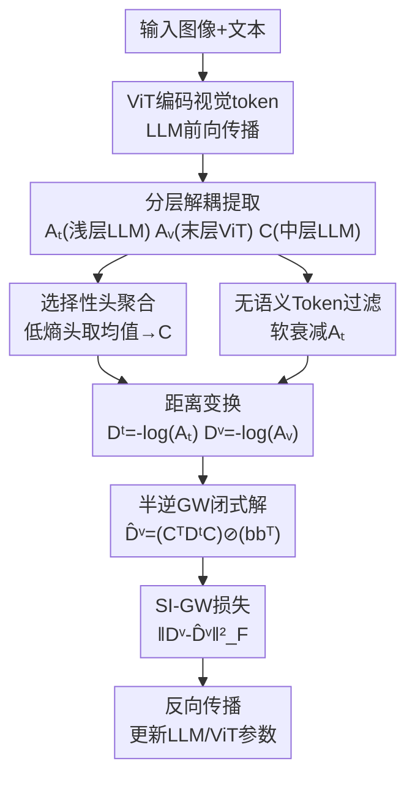

# MIRROR: Aligning Semantic Relations from Language to Image via Gromov-Wasserstein

**会议**: ECCV2026  
**arXiv**: [2606.29462](https://arxiv.org/abs/2606.29462)  
**代码**: 暂无  
**领域**: 多模态VLM  
**关键词**: 关系对齐, Gromov-Wasserstein, 多模态大模型, 几何正则化, 关系推理

## 一句话总结

MIRROR 提出 Semi-Inverse Gromov-Wasserstein（SI-GW）几何正则化框架，通过闭式解将语言空间中概念间的关系结构映射到视觉空间，在不引入额外参数和推理开销的前提下显著提升 MLLM 的关系推理能力。

## 研究背景与动机

多模态大语言模型（MLLM）在基础视觉理解上已取得巨大进展，但在涉及关系推理的任务上仍然力不从心。例如，LLM 能够在文本层面正确推理"哈士奇和阿拉斯加在耳形和体型上不同"，但同样的模型在看到图像时仍可能混淆这两个品种；它能文字推理"坐下来需要重心在支撑面上方"，却无法判断视觉中的空间支撑关系。这种割裂揭示了当前 MLLM 中一个深层问题：语言模型内部其实编码了丰富的概念间关系知识，但这些关系性先验在跨到视觉模态时丢失了。

追溯其原因，主流 MLLM 通过投影适配器（projection adapter）将视觉 token 映射到大语言模型的输入空间，再以语言建模损失（next-token prediction）训练。这个范式保证每个视觉 token 携带了正确的语义——即 identity-level alignment（每个概念"是什么"对齐了）——但从未问过概念之间的关系结构是否也跨了模态。当一个模型只知道"猫"和"垫子"各自是什么、却不知道它们之间的空间关系模式（如"躺在上面"对应的视觉距离结构）时，关系推理自然失败。近期 Platonic Representation Hypothesis 等理论工作提示，跨模态表示实际上趋向于共享统计结构，而 LLM 能从结构化文本中自发发展出视觉推理先验——这意味着文本空间的关系几何是一个优质的"教师信号"，可以用来系统性地重塑视觉空间的结构。

**核心 idea**：将跨模态对齐从 identity-level 提升到 relational-structure level——提出 Semi-Inverse Gromov-Wasserstein（SI-GW）问题，从语言空间的关系几何（以自注意力导出的距离矩阵度量）和跨模态交互（以交叉注意力为耦合）出发，闭式求解视觉空间"应该具有"的理想距离结构，再以此作为正则化目标训练视觉表示，使其关系几何与语言一致。

## 方法详解

### 整体框架

MIRROR 在标准语言建模损失之上增加一个几何正则项 ℒ_SI-GW，总损失为 ℒ_total = ℒ_LM + λ · ℒ_SI-GW。训练过程中，它从 MLLM 的 Transformer 架构中取出三种注意力成分：文本自注意力 Aₜ（编码语言侧的概念间关系）、视觉自注意力 Aᵥ（编码视觉侧的概念间关系）、以及文本到视觉的交叉注意力 C（编码跨模态对应关系）。将 Aₜ 和 Aᵥ 经负对数变换转为距离矩阵 Dᵗ 和 Dᵛ，然后求解 Semi-Inverse GW 问题得到视觉侧应具有的理想距离结构 D̂ᵛ，最后最小化 Dᵛ 与 D̂ᵛ 的 Frobenius 差距。整个过程不引入任何新参数，推理时零开销——所有 SI-GW 计算仅在训练时使用注意力矩阵。

### 关键设计

**1. Semi-Inverse GW问题：闭式解将语言关系映射到视觉空间**

经典的 Gromov-Wasserstein 距离同时优化耦合矩阵和距离矩阵来对齐两个度量空间。但在 MLLM 中情况不同：交叉注意力机制已经提供了一个天然的数据驱动耦合 C，问题不在于找对应关系，而在于"给定语言距离结构 Dᵗ 和耦合 C，视觉距离结构应该是什么样子才能让两个空间关系一致？"这就是 Semi-Inverse GW 问题的核心——一个逆向几何问题。MIRROR 证明了该问题具有唯一闭式解 D̂ᵛ = (Cᵀ Dᵗ C) ⊘ (b bᵀ)，其中 b = Cᵀ 𝟙 是各视觉 token 上的耦合质量（即列和）。这个解有直观的期望解释：对于一对视觉 token (k, ℓ)，它们在语言侧对应的期望距离是"以 C 为权重对文本 token 对 (i, j) 的距离做条件期望"。闭式解带来了巨大的计算收益：直接评估原始四重求和需要 O(n²ₜ n²ᵥ)，而矩阵分解操作将复杂度降到 O(n²ₜ nᵥ + n²ᵥ nₜ)。

**2. 分层解耦提取：从Transformer不同层获取稳定几何成分**

直接从一个注意力层提取 Aₜ 和 C 会导致梯度耦合和训练不稳定，因为在 decoder-only MLLM 中它们属于同一因果注意力图的不同子块，被同一个 softmax 联合归一化。MIRROR 将三种成分分层提取：Aₜ 从浅层 LLM 层（第 1 层）提取——此时文本关系几何较为纯净，未受多模态强烈混合；C 从中间层（第 16 层）提取——这一层在信息丰富度和注意力集中度之间取得平衡；Aᵥ 从 ViT 最后一层提取——该层最直接影响下游视觉推理。消融实验证实，去掉分层解耦会导致训练发散（SI-GW 梯度破坏注意力分布），它是 MIRROR 的"存在性"组件。

**3. 选择性头聚合与无语义Token过滤：清洗高频噪声源**

多头注意力的不同头质量差异很大——许多头的交叉注意力近似均匀分布，直接取均值会稀释重要的跨模态对应关系。MIRROR 计算每个头的交叉注意力熵，保留熵最低的 k 个（实验取 k=8）做均值，得到的耦合矩阵 C 更集中有效。文本侧，系统提示词和图像占位符等 token 不携带视觉语义却出现在自注意力 Aₜ 中，MIRROR 设计了一套位置感知软衰减机制：根据 token 的位置及其与视觉 token 的注意力质量用权重 wⱼ∈[0,1] 将对应条目乘以 (1-α·wⱼ) 后重新归一化，保留可能有用上下文的同时降低无关 token 的影响。去掉头选择导致 GQA 下降 2.1 分、BLINK 下降 7.3 分，说明耦合质量对几何对齐的信号传递至关重要。

### 损失函数/训练策略

总损失：ℒ_total = ℒ_LM + λ · ℒ_SI-GW，其中 ℒ_SI-GW = ‖Dᵛ − D̂ᵛ‖²_F。最优权重 λ = 2×10⁻³，在 [10⁻³, 5×10⁻³] 范围内稳定；权重增大到 10⁻² 时语言建模目标被过度压制、性能下降。在 LLaVA-1.5 和 LLaVA-NeXT 系列（7B/13B）上微调 1 epoch，8×RTX 6000 Ada GPU 完成训练。

## 实验关键数据

### 主实验

| 数据集 | 指标 | LLaVA-1.5-7B +MIRROR | LLaVA-NeXT-7B +MIRROR |
|--------|------|----------------------|----------------------|
| GQA | Overall | 61.93 (+0.77) | 65.56 (+0.82) |
| GQA | Global | +3.16 | +2.13 |
| GQA | Relation | +0.63 | +1.44 |
| BLINK | Average | 42.9 (+2.5) | 39.2 (+2.4) |
| BLINK | 空间关系 | +4.9 | — |
| VQAv2 | — | 81.1 (+1.8) | 82.1 (-0.1) |
| POPE | — | 86.3 (+0.6) | 87.1 (+0.4) |
| RealWorldQA | — | 56.8 (+0.2) | 57.7 (-0.1) |

### 消融实验

| 配置 | GQA | BLINK | 说明 |
|------|-----|-------|------|
| 基线 (无SI-GW) | 61.2 | 40.5 | LLaVA-1.5-7B原始模型 |
| +分层解耦+头选择 | 61.7 | 41.9 | 逐步集成第一步 |
| +Token过滤 (完整) | 61.9 | 42.9 | 完整MIRROR |
| 去掉分层解耦 | diverged | diverged | 训练直接发散 |
| 去掉头选择 | 59.8 (-2.1) | 35.6 (-7.3) | 退化严重 |

### 关键发现

- **分层解耦是"存在性"组件**：去掉后训练直接发散；头选择虽然影响大但不至发散，重要性次之。
- **Global 场景提升最大**（+1.04~+3.16%）：这类任务（如"桌上有几个红色的东西？"）需要整合多对象关系；Object/Attribute 提升很小——这些任务取决于局部特征识别而非关系几何，符合方法的预期行为。
- **BLINK 上中高层推理受益集中**：空间关系（+4.9%）、多视角推理（+3.8%）、定位（+4.9%）、计数（+4.2%）均有显著提升；低层视觉任务（反射、深度估计）基本不变，说明增益确实来自关系几何对齐而非通用特征增强。
- **通用VQA性能无损**：VQAv2/POPE/RealWorldQA 保持或微升，POPE（幻觉检测）一致改善（+0.3~+0.6），提示更好的跨模态距离结构有助于减轻物体幻觉。

## 亮点与洞察

- **洞察深刻**：将跨模态对齐从 identity-level 提升到 relational-structure level，抓住了 MLLM 关系推理失败的根本——每个概念"是什么"对齐了但"怎么关系"没对齐。这个分析本身就有很强的启发价值,可以作为未来工作诊断推理缺陷的分析框架。
- **理论优雅**：Semi-Inverse GW 问题有唯一闭式解，且有清晰的期望概率解释，不是黑盒正则化。从 O(n²ₜ n²ᵥ) 到 O(n²ₜ nᵥ + n²ᵥ nₜ) 的加速也靠数学结构而非近似。
- **工程实用**：不引入额外参数和推理开销，只在训练时作为正则项直接插入现有 MLLM 微调流程。分层解耦和头选择等设计解决了实际部署中的稳定性问题。
- **迁移性好**：任何基于投影适配器的 MLLM 都可以直接套用，关系对齐的思路也可推广到其他跨模态场景（如视频-语言、3D-语言）。

## 局限与展望

- 实验仅在 LLaVA-1.5/LLaVA-NeXT 上验证，尚未在更大规模 MLLM（如 Qwen2-VL、InternVL2 等）和更多样化的训练数据上测试泛化性。
- SI-GW 依赖交叉注意力作为跨模态耦合——如果模型本身交叉注意力质量差（如部分稀疏激活架构），耦合 C 可能不可靠，限制方法有效性。
- 超参 λ 敏感区间较窄（最优 2×10⁻³，到 10⁻² 开始掉点），不同模型可能需要重新调参；未来工作可探索自适应权重策略。

## 相关工作与启发

- **vs 标准投影对齐（LLaVA 等）**: 投影适配器确保每个视觉 token 语义正确但不保证关系结构跨模态一致；MIRROR 增加了一阶关系损失来弥补这一盲区。
- **vs Gromov-Wasserstein 距离**: 经典 GW 同时优化耦合和距离矩阵；MIRROR 固定耦合和一侧距离矩阵只优化另一侧——这个"半逆"视角对于有天然耦合（交叉注意力）的场景比经典 GW 更自然、更高效。
- **vs Platonic Representation Hypothesis（Huh 2024）**: 该理论指出跨模态表示趋向于共享统计结构，MIRROR 实际上提供了实现这一趋向的具体算法——而不仅仅是观察现象。

## 评分

- 新颖性: ⭐⭐⭐⭐⭐ [将关系几何对齐作为跨模态对齐的新维度，SI-GW 问题形式化新颖且有闭式解]
- 实验充分度: ⭐⭐⭐⭐ [在 4 种配置、2 个关系推理基准和多个通用 VQA 上验证，消融完整；但只覆盖 LLaVA 系列]
- 写作质量: ⭐⭐⭐⭐⭐ [问题动机讲得清楚，数学推导整洁，定理证明精简，实验结果组织有序]
- 价值: ⭐⭐⭐⭐⭐ [直接诊断了 MLLM 的关键缺陷并提供即插即用的解决方案，兼容现有模型，有很高的实用和启发价值]

<!-- RELATED:START -->

## 相关论文

- [\[CVPR 2026\] Rethinking Model Selection in VLM Through the Lens of Gromov-Wasserstein Distance](../../CVPR2026/multimodal_vlm/rethinking_model_selection_in_vlm_through_the_lens_of_gromov-wasserstein_distanc.md)
- [\[AAAI 2026\] Empowering Semantic-Sensitive Underwater Image Enhancement with VLM](../../AAAI2026/multimodal_vlm/empowering_semantic-sensitive_underwater_image_enhancement_with_vlm.md)
- [\[ACL 2025\] Can Multimodal Large Language Models Understand Spatial Relations?](../../ACL2025/multimodal_vlm/spatialmqa_mllm_spatial_relations.md)
- [\[ICLR 2026\] Multimodal Aligned Semantic Knowledge for Unpaired Image-text Matching](../../ICLR2026/multimodal_vlm/multimodal_aligned_semantic_knowledge_for_unpaired_image-text_matching.md)
- [\[CVPR 2026\] G-MIXER: Geodesic Mixup-based Implicit Semantic Expansion and Explicit Semantic Re-ranking for Zero-Shot Composed Image Retrieval](../../CVPR2026/multimodal_vlm/g_mixer_geodesic_mixup_based_implicit_semantic_expansion_for_zero_shot_cir.md)

<!-- RELATED:END -->
