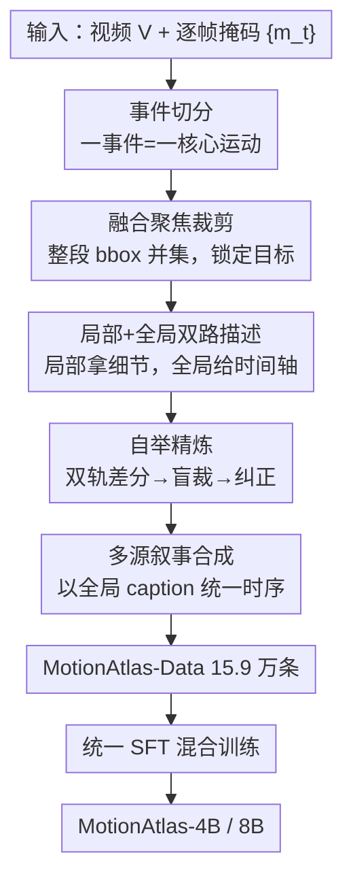

# MotionAtlas: Detailed Region Captioning for Motion-Centric Videos

**会议**: ECCV 2026  
**arXiv**: [2606.29531](https://arxiv.org/abs/2606.29531)  
**代码**: [https://kagura-0001.github.io/projects/MotionAtlas](https://kagura-0001.github.io/projects/MotionAtlas) (项目页，含 benchmark / 数据 / 代码)  
**领域**: 多模态VLM / 视频理解  
**关键词**: 区域级运动描述, Video-MLLM, 细粒度运动, 自举精炼, 评测 benchmark

## 一句话总结
MotionAtlas 把「描述整段视频运动」这个难以量化评测的任务，收窄为「给定视频 + 时空掩码，只描述目标区域内的运动」，并配套交付了一个 2073 题 MCQ 的诊断性 benchmark、一条能规模化产出 15.9 万条高保真运动描述的自举数据流水线，以及一套让 Qwen3-VL / Molmo2 在八个运动理解 benchmark 上普遍涨点的训练配方。

## 研究背景与动机
视频多模态大模型（Video-MLLM）在通用视频理解上已经相当强，但一旦任务要求对局部区域做精确的时空推理——比如判断羽毛球运动员回位时朝哪个方向移动、起跳瞬间躯干如何后仰、脚步节奏怎样变化——现有模型几乎集体失灵。它们倾向于抓住高层语义（"一个人在打球"），却说不清"怎么动"这一层细粒度的运动学细节。更麻烦的是数据侧：主流做法都是**全局运动描述**（describe 整个场景或显著物体的运动），而这条路线有一个几乎无解的软肋——评测不可解性。自由形式的全局运动描述既很难核查它是否**完整**（该说的运动有没有漏，recall），也很难核查它是否**忠实**（有没有编造，anti-hallucination），于是标注流水线无法可靠地做质量控制，也就无法规模化。

作者把这个僵局的根源归结为"任务定义本身太发散"。全局描述里视觉杂乱（visual clutter）和多物体运动纠缠（motion entanglement）交织在一起，标注者的注意力被分散，模型的输出无从对齐到某个可验证的锚点。既然如此，与其在"如何评测一段发散文本"上死磕，不如**换一个更可控的任务形态**：把描述范围用一张时空掩码框死，模型只需说清这个区域内的运动。区域一旦被限定，视觉杂乱和运动纠缠被天然剥离，标注者只盯着局部运动，产出的标注就更细、更全、更一致——而这恰恰是让评测"可量化、可扩展"的前提。

顺着这个思路，本文把区域级运动评测拆成一个 **事件—运动—事实（event–motion–fact）** 的标注层级：先把视频切成若干事件，每个事件用密集的运动细节描述，再把每条细节蒸馏成一条可独立核验的原子事实；这些事实进一步被转成选择题（MCQ）清单，于是"给一段自由描述打分"这件难事，就被改写成"让裁判模型逐题核对清单"的密集、可诊断的验证。**核心 idea：把运动描述从难以评测的「全局自由文本」收窄为「时空掩码约束下的区域级描述」，用「事件→原子事实→MCQ 清单」的层级把评测变成可量化的逐题核对，再以「双轨自举差分裁决」替代人工审核，让高保真运动标注得以规模化到十万量级。**

## 方法详解

### 整体框架
MotionAtlas 是一个"benchmark + 数据 + 模型"三位一体的系统，但真正撑起它的是两条并行的标注管线和一个训练配方。**评测侧**先构建 MotionAtlas-Bench：从四个运动丰富的数据源里挑出"运动本身就难描述"的实体，经过事件切分、六维度运动本体densify、原子事实抽取、MCQ 生成、两级质控，最终得到 107 段视频、2073 道 MCQ，配一套 checklist-based 的裁判协议来给任意 caption 打 Accuracy / Recall / Precision。**数据侧**要把 benchmark 那套"AI 提议 + 人工精炼"的高质量流程扩到 15.9 万样本，关键是**去掉人工审核环节还不掉质量**——为此设计了 segment–caption–bootstrap–summarize 四阶段流水线，用双轨自举差分裁决替代人工纠错，用多源叙事合成消除事件间的时序不连贯。**训练侧**把区域级运动数据和通用运动/图文 QA 按比例混合，做一次统一 SFT，得到 MotionAtlas-4B/8B 系列。

下图是数据流水线（评测侧与数据侧共享事件切分与空间裁剪的设计，差异在于评测侧有人工介入、数据侧用自举替代）：

### 关键设计

**1. 区域级运动描述任务 + 事件—事实—MCQ 评测协议：把「没法打分的自由描述」变成「逐题核对的清单」**

全局运动描述最致命的不是模型不会说，而是"说了也没法客观打分"。作者的破局点是先把任务约束到时空掩码内，再把评测拆成三层：视频先切成事件（每个事件对应一个核心运动），每个事件沿六个运动维度——运动学（方向/轨迹/速度变化/旋转）、身体部位（各肢体独立动作）、空间（相对环境地标的位置）、交互（接触/抓握/释放）、状态（姿态与遮挡变化）、相机（镜头运动）——densify 成密集描述，再蒸馏成一条条原子事实，每条事实只隔离一个可独立核验的属性。裁判协议由此定义为：给定模型生成的 caption C 和视频 V，让裁判模型对清单里每道 MCQ 逐一选项，据此报三个互补指标。其中 Recall 的定义很巧——它把"答对"和"答错但至少提到了"都算进分子，专门度量模型"愿不愿意去描述目标运动"而不是甩锅"未提及"：

$$\text{Recall} = \frac{N_{\text{correct}} + N_{\text{error}}}{N_{\text{total}}}, \qquad \text{Precision} = \frac{N_{\text{correct}}}{N_{\text{correct}} + N_{\text{error}}}$$

Precision 则只在"确实提到了运动"时算准确率。这套 MCQ 里还专门塞了三类诊断性负项：not mentioned / mentioned but no value 用来惩罚漏观察、显式考察 recall，mentioned but different value 用来兜底抓幻觉。这样一来，原本发散的运动描述评测，被改造成密集、可诊断、可复现的核对，且实测对裁判模型选择相当鲁棒（换 Gemini 3 Pro / GPT-5.2 / Qwen3-VL-235B 当裁判，模型排名的 Spearman ρ 仍达 0.89–0.98）。

**2. 融合聚焦裁剪：用整段 bbox 并集而非逐帧裁剪，锁住大位移下的目标**

细粒度运动理解要求 VLM 把注意力钉在目标实体上，但目标在视频里往往有大幅位移，逐帧裁剪会带来空间抖动、且每帧裁剪框忽大忽小导致有效分辨率不稳。作者的做法是对整个事件区间内该实体所有帧的 bounding box 取**并集**，构造一个固定不动的融合聚焦裁剪区域（merged focal crop）。这样即便目标在事件内跑动很大，裁剪区域也保持固定，既消除了空间抖动、把目标上的有效分辨率抬起来，又压掉了背景干扰物。消融显示这一步极其关键：去掉空间裁剪、直接喂原始视频片段，标注质量 Accuracy 从 39.9 掉到 32.7（−7.2），是三个组件里掉点最狠的之一——说明"把镜头拉近到目标"是引导 VLM 看对地方的前提。

**3. 自举精炼：用两条独立 rollout 的分歧定位幻觉，靠模型「判别强于生成」来自我纠错**

这是把 benchmark 的人工审核换成自动化、还能保质的核心机制。它建立在一个观察上：同一视觉输入下两次独立生成的描述，**分歧处更可能来自幻觉，一致处更可能是真实视觉证据**。于是流程分四步：先对同一裁剪片段独立生成两份描述（Dual Rollout）；再让 LLM 抽出两份描述里相互冲突的断言集合（Differential Extraction）——这些冲突点不确定性最高、最值得核验；接着对每个冲突断言，把 A 说法、B 说法再加一个干扰项随机打乱，喂给 VLM 做**三选一盲裁**（Visual Grounded Judgment）——这里的干扰项是校准锚点，一旦裁判选了它，就说明这次裁决不可靠、直接丢弃以防错误传播；最后把可靠裁决合并回原描述得到精炼结果。这一步之所以有效，是因为它把"生成"这个 VLM 相对弱的能力，替换成了"判别/核对"这个 VLM 相对强的能力（self-consistency / SelfCheckGPT 思路的运动版）。消融里去掉自举精炼，标注 Accuracy 从 39.9 掉到 36.4（−3.5），单次生成会残留更多未纠正的幻觉。

**4. 多源叙事合成 + 实体中心运动分：一个管跨事件时序连贯、一个管样本筛选**

四阶段的最后一步是多源叙事合成：把各事件的局部精炼描述 {ĉₖ} 和整段视频的全局 caption c_full 融合，用 c_full 的全局时间轴给局部叙事排序，删掉事件边界处的臆测性描述、去掉相邻事件间的冗余，冲突时以"运动细节 > 场景上下文"的优先级裁决。消融显示只用局部 caption、不给全局 caption，Accuracy 掉 6.7 到 33.2——因为局部描述各说各的、事件之间的时序会打架，全局 caption 提供了那根统一的时间轴。另一个容易被忽略但很重要的设计是数据筛选阶段的**实体中心运动分**：不同于全视频全局打分，它只度量被指实体自身的运动强度、同时压掉相机运动和背景共模运动。做法是取掩码内的光流强度 $c_t$，减去周围环带与背景区域的光流强度 $\beta_t$，再补一个小的绝对项防止过度抑制掉小目标的真实运动：

$$f_t = \max(0,\; c_t - \beta_t) + \alpha \cdot c_t, \qquad \alpha = 0.3$$

其中 $\alpha c_t$ 这一项是关键的"保底信号"——纯做 $c_t-\beta_t$ 会把小目标本就微弱的运动一并抹掉。最终实体运动分还联合考虑运动强度（90 分位）与运动持续性（超过阈值的帧占比 $p^\gamma$），压制偶发的运动尖峰。正是这套筛选，把 22 万原始样本过滤到 15.9 万条"真·难描述"的高质量样本。

### 损失函数 / 训练策略
训练不搞花活，就是一次统一 SFT。混合四类数据（Table 3）：MotionAtlas 区域级运动描述 15.9 万（注入实体中心的细粒度运动能力）、Tarsier2-Recap 41.7 万 + MotionSight 13 万（保通用运动理解）、LLaVA-OneVision-1.5 图文 QA 32 万（防灾难性遗忘）。四路拼接、按数据集规模成比例采样，跑 1 个 epoch。base model 用 Qwen3-VL(4B/8B) 与 Molmo2(4B/8B)，全参微调，每视频均匀采 16 帧，最大序列长 16384，AdamW + 峰值 lr $1\times10^{-5}$ + cosine + 3% warmup。

## 实验关键数据

### 主实验
在自建 MotionAtlas-Bench 上，区域级运动描述被证明极难，连最强闭源模型都很难在细粒度细节上拿到高分；而用 MotionAtlas-Data 微调后所有 base model 一致大涨。下表为 Single-Frame Grounding 设置下的 Overall Accuracy（%）：

| 模型 | 本文微调前 | 本文微调后 | 提升 |
|------|-----------|-----------|------|
| Molmo2-4B | 13.7 | 21.6 | +7.9 |
| Molmo2-8B | 19.2 | 24.4 | +5.2 |
| Qwen3-VL-4B | 19.3 | 27.7 | +8.4 |
| Qwen3-VL-8B | 24.3 | 31.6 | +7.3 |

一个很能说明数据质量的点：基于 Qwen3-VL-8B 微调出的模型（31.6 / 34.1）反超了未微调的 Qwen3-VL-235B（30.5 / 33.7），小模型 + 好数据 > 大模型。此外 Full-Sequence Grounding（每帧都叠精确掩码）一致优于 Single-Frame（只给首帧掩码要模型自己 track），说明连续的空间提示确实增强了细粒度运动描述能力。

在 7 个公开运动/视频理解 benchmark 上，尽管训练数据**全部是区域级**运动描述，却一致提升了**非区域**的通用运动任务（Qwen3-VL-4B 为例）：

| Benchmark | Qwen3-VL-4B | + MotionAtlas-Data | 提升 |
|-----------|-------------|--------------------|------|
| MotionBench | 55.9 | 61.9 | +6.0 |
| TOMATO | 27.4 | 35.2 | +7.8 |
| FAVOR-Bench | 47.0 | 55.0 | +8.0 |
| TempCompass | 69.6 | 74.2 | +4.6 |
| DREAM-1K (F1) | 35.6 | 38.9 | +3.3 |

涨幅最大的正是强调时序动态与动作属性识别的 TOMATO / FAVOR，和数据的细粒度运动覆盖高度吻合；且各 benchmark 无一掉点，确认没有引发灾难性遗忘。

### 消融实验
数据流水线三组件消融（在 MotionAtlas-Bench 上以 caption 质量裁判，指标为 Accuracy）：

| 配置 | Accuracy | Recall | Precision | 说明 |
|------|---------|--------|-----------|------|
| MA Pipeline (full) | 39.9 | 68.2 | 58.5 | 完整流水线 |
| w/o Self-Bootstrap | 36.4 | 64.1 | 56.8 | 去双轨自举，掉 3.5，幻觉未纠正 |
| w/o Full-Video Caption | 33.2 | 58.9 | 56.4 | 去全局 caption，掉 6.7，事件间时序打架 |
| w/o Spatial Crop | 32.7 | 60.9 | 53.6 | 去空间裁剪，掉 7.2，注意力被背景带偏 |

数据成分迁移消融（Qwen3-VL-4B，逐步加数据）也很关键：只加通用 caption 已能涨（如 FAVOR 47.0→52.2），但加"区域细节"带来的增益明显更大（FAVOR→55.7、TOMATO 27.4→31.9），再加显式视觉区域线索进一步把 TOMATO 推到 35.2——说明涨点不是"多几个动词/泛泛描述"的副产品，而是区域接地的监督在起作用。

### 关键发现
- 三组件里**空间裁剪掉点最狠**（−7.2）、**全局 caption 次之**（−6.7），说明"把镜头拉近目标"和"用全局时间轴统一局部叙事"是这条自动化管线的两根支柱；自举精炼（−3.5）主要在压幻觉。
- **区域级监督会跨迁移到通用任务**：作者给出的解释是，MotionAtlas-Data 里含大量"32 帧能答、16 帧答不出"的细粒度线索，监督本身就逼模型去读时序密集的证据；训练完后模型才重新学会"从 8→16→32 帧持续受益"，而未微调的 Qwen3-VL-8B/32B 在 32 帧反而掉点（密集时空信息压垮了它对目标区域的稳定 track）。
- **不可替代性**：把 MotionAtlas-Data 换成等量 TarsierRecap，在 MotionAtlas-Bench 上几乎零提升（各规模都卡在 ~12–13%），证明其细粒度细节没有现成替代品；而外部 benchmark 即便不用本数据也能涨，但增益一致更小。

## 亮点与洞察
- **把"没法评测"当成一等公民来设计任务**：论文最聪明的一步不是模型，而是意识到"全局运动描述评测不可解"是整条数据链路无法规模化的病根，于是用"区域掩码约束 + MCQ 清单核对"把评测变可量化——这是典型的"改题面比解难题更划算"。
- **自举精炼把生成难题转成判别易题**：抓两条 rollout 的分歧当高风险候选、再用三选一盲裁（还带一个校准干扰项来判定裁决是否可信），把 VLM"判别强于生成"的性质用足，是可迁移到任意"无人工审核也要保质"的合成数据场景的 trick。
- **融合聚焦裁剪（bbox 并集）**这个小设计消融掉点最大，提醒做区域级视频理解时"裁剪框稳不稳"比想象中重要——大位移下逐帧裁剪的抖动会实质性拖垮标注质量。
- **纯区域数据反哺通用能力**，且作者用"32 帧可答/16 帧不可答"的分析把"为什么能迁移"讲清楚了，而不是停留在"就是涨了"。

## 局限与展望
- 作者承认目前只做**单目标**设定，多物体交互、身份对应尚未覆盖；扩展到 multi-object with interaction 是自然的下一步。
- 大 VLM backbone（Qwen3-VL-235B、Gemini 3 Pro）只用于**离线数据构建**，部署靠蒸馏出的 4B/8B——意味着这套高保真标注能力目前依赖强模型，无法在线端到端复现。
- 自己观察到的：benchmark 仅 107 段视频，虽然作者用 2073 道 MCQ + 减集排名鲁棒性（1/4 规模 ρ 仍 >0.90）论证了统计稳定性，但视频层面的领域覆盖（体育/日常/动物/物体四类）相对有限；aspect-level 标签的标注一致性偏低（κ=0.47），论文也只把它当诊断切片而非独立结论。
- 运动分/裁剪等超参（α=0.3、λ=0.2 等）多为经验设定，跨域迁移时是否需要重调未充分讨论。

## 相关工作与启发
- **vs 全局运动描述（DREAM-1K / Tarsier / ShareGPT4Video）**: 它们描述整段场景或显著物体的运动，本文只描述掩码区域内的运动，区别在于用时空掩码剥离了视觉杂乱与运动纠缠，从而换来可量化、抗幻觉的评测；代价是需要额外的掩码标注。
- **vs 细粒度运动 benchmark（MotionBench / FAVOR-Bench / MotionSight）**: 它们也做细粒度运动，但多为全局标注、且评测仍受"自由文本难打分"困扰；MotionAtlas 用 event→fact→MCQ 清单把评测做成密集诊断，并且是唯一标注多维度运动属性、每视频平均 19.4 题的 benchmark。
- **vs 区域级理解（Osprey / VideoRefer / PixelRefer / Sa2VA）**: 它们把区域级 captioning 拓到时空视频域，但主要描述外观与静态属性；本文的数据源效果消融直接证明 VideoRefer 这类偏外观的数据在运动任务上甚至低于 baseline，凸显"区域级 + 运动导向"这一空白正是 MotionAtlas 填的。

## 评分
- 新颖性: ⭐⭐⭐⭐⭐ 用"区域掩码约束 + MCQ 清单"绕开全局运动描述的评测不可解性，任务形态与评测协议的重定义很干净。
- 实验充分度: ⭐⭐⭐⭐⭐ 8 个 benchmark × 4 个 base model 全面验证，管线/数据成分/规模/裁判/帧数多维消融，附录还给了减集排名鲁棒性与标注漏斗统计。
- 写作质量: ⭐⭐⭐⭐☆ 逻辑链清晰、图表信息量大；符号偏多（尤其附录运动分推导），主文对自举四阶段的机制交代到位。
- 价值: ⭐⭐⭐⭐⭐ benchmark + 数据 + 模型全开源，纯区域数据反哺通用任务这一发现对做视频运动理解的人有直接参考价值。

<!-- RELATED:START -->

## 相关论文

- [\[ICML 2025\] Toward Robust Hyper-Detailed Image Captioning: A Multiagent Approach and Dual Evaluation Metrics for Factuality and Coverage](../../ICML2025/multimodal_vlm/toward_robust_hyper-detailed_image_captioning_a_multiagent_approach_and_dual_eva.md)
- [\[ECCV 2026\] RSICCLLM: A Multimodal Large Language Model for Remote Sensing Image Change Captioning](rsiccllm_a_multimodal_large_language_model_for_remote_sensing_image_change_capti.md)
- [\[ACL 2026\] Region-R1: Reinforcing Query-Side Region Cropping for Multi-Modal Re-Ranking](../../ACL2026/multimodal_vlm/region-r1_reinforcing_query-side_region_cropping_for_multi-modal_re-ranking.md)
- [\[ECCV 2026\] MedRegion-CT: Region-Aware Multimodal Large Language Model via SlowFast Tokenization and Pseudo-Mask Guidance for 3D CT Report Generation](region-aware_multimodal_large_language_model_via_slowfast_tokenization_and_pseud.md)
- [\[ICLR 2026\] Omni-Captioner: Data Pipeline, Models, and Benchmark for Omni Detailed Perception](../../ICLR2026/multimodal_vlm/omni-captioner_data_pipeline_models_and_benchmark_for_omni_detailed_perception.md)

<!-- RELATED:END -->
